# 320_Final_Proj

Uses the database from: https://github.com/jamesqo/gun-violence-data

Link to police killings database: https://www.kaggle.com/jpmiller/police-violence-in-the-us?select=police_killings_MPV.csv

---
jupyter:
  kernelspec:
    display_name: Python 3
    language: python
    name: python3
  language_info:
    codemirror_mode:
      name: ipython
      version: 3
    file_extension: .py
    mimetype: text/x-python
    name: python
    nbconvert_exporter: python
    pygments_lexer: ipython3
    version: 3.8.6
  nbformat: 4
  nbformat_minor: 2
---

::: {.cell .markdown}
# **Analysis of US Gun Violence Incidents from 2013 - 2017**
:::

::: {.cell .markdown}
### ***Nandini Venkatesh, Sheral and Radhika Patel***
:::

::: {.cell .markdown}
## INTRODUCTION
:::

::: {.cell .markdown}
Some BS on Gun Violence \...

-   how it impacts the country\'s politics
-   why its important to analyze the data for it
-   what can we get out of analyzing gun violence data
:::

::: {.cell .markdown}
## DATA COLLECTION
:::

::: {.cell .markdown}
:::

::: {.cell .code execution_count="13" scrolled="true"}
``` {.python}
import numpy as np
import matplotlib.pyplot as plt
import pandas as pd
from datetime import datetime as dt
import pip
pip.main(['install','seaborn'])
import seaborn as sns
```

::: {.output .stream .stderr}
    WARNING: pip is being invoked by an old script wrapper. This will fail in a future version of pip.
    Please see https://github.com/pypa/pip/issues/5599 for advice on fixing the underlying issue.
    To avoid this problem you can invoke Python with '-m pip' instead of running pip directly.
:::

::: {.output .stream .stdout}
    Requirement already satisfied: seaborn in /opt/conda/lib/python3.8/site-packages (0.11.1)
    Requirement already satisfied: matplotlib>=2.2 in /opt/conda/lib/python3.8/site-packages (from seaborn) (3.3.3)
    Requirement already satisfied: pandas>=0.23 in /opt/conda/lib/python3.8/site-packages (from seaborn) (1.1.5)
    Requirement already satisfied: scipy>=1.0 in /opt/conda/lib/python3.8/site-packages (from seaborn) (1.5.3)
    Requirement already satisfied: numpy>=1.15 in /opt/conda/lib/python3.8/site-packages (from seaborn) (1.19.5)
    Requirement already satisfied: kiwisolver>=1.0.1 in /opt/conda/lib/python3.8/site-packages (from matplotlib>=2.2->seaborn) (1.3.1)
    Requirement already satisfied: pyparsing!=2.0.4,!=2.1.2,!=2.1.6,>=2.0.3 in /opt/conda/lib/python3.8/site-packages (from matplotlib>=2.2->seaborn) (2.4.7)
    Requirement already satisfied: pillow>=6.2.0 in /opt/conda/lib/python3.8/site-packages (from matplotlib>=2.2->seaborn) (8.1.0)
    Requirement already satisfied: python-dateutil>=2.1 in /opt/conda/lib/python3.8/site-packages (from matplotlib>=2.2->seaborn) (2.8.1)
    Requirement already satisfied: cycler>=0.10 in /opt/conda/lib/python3.8/site-packages (from matplotlib>=2.2->seaborn) (0.10.0)
    Requirement already satisfied: six in /opt/conda/lib/python3.8/site-packages (from cycler>=0.10->matplotlib>=2.2->seaborn) (1.15.0)
    Requirement already satisfied: pytz>=2017.2 in /opt/conda/lib/python3.8/site-packages (from pandas>=0.23->seaborn) (2020.5)
:::
:::

::: {.cell .markdown}
Here we are reading our main csv file containing data on shootings in
the US from 2013 to 2018. We skipped several columns that we deemed were
unnecessary for our data analysis such as any of the *url* columns, did
not provide concise information such as *location_description*, or had
several rows of missing data, which were specifically ones related to
describing guns found the these incidents.
:::

::: {.cell .code execution_count="14"}
``` {.python}
cols = list(pd.read_csv("stage3.csv", nrows =1))
df_2017= pd.read_csv("stage3.csv")
df_2017 = df_2017.drop(columns = ['incident_url', 'source_url', 'incident_url_fields_missing', 
                        'gun_stolen', 'gun_type', 'location_description', 'notes', 'n_guns_involved', 'sources'])
df_2017.head(10)
```

::: {.output .execute_result execution_count="14"}
```{=html}
<div>
<style scoped>
    .dataframe tbody tr th:only-of-type {
        vertical-align: middle;
    }

    .dataframe tbody tr th {
        vertical-align: top;
    }

    .dataframe thead th {
        text-align: right;
    }
</style>
<table border="1" class="dataframe">
  <thead>
    <tr style="text-align: right;">
      <th></th>
      <th>incident_id</th>
      <th>date</th>
      <th>state</th>
      <th>city_or_county</th>
      <th>address</th>
      <th>n_killed</th>
      <th>n_injured</th>
      <th>congressional_district</th>
      <th>incident_characteristics</th>
      <th>latitude</th>
      <th>longitude</th>
      <th>participant_age</th>
      <th>participant_age_group</th>
      <th>participant_gender</th>
      <th>participant_name</th>
      <th>participant_relationship</th>
      <th>participant_status</th>
      <th>participant_type</th>
      <th>state_house_district</th>
      <th>state_senate_district</th>
    </tr>
  </thead>
  <tbody>
    <tr>
      <th>0</th>
      <td>461105</td>
      <td>2013-01-01</td>
      <td>Pennsylvania</td>
      <td>Mckeesport</td>
      <td>1506 Versailles Avenue and Coursin Street</td>
      <td>0</td>
      <td>4</td>
      <td>14.0</td>
      <td>Shot - Wounded/Injured||Mass Shooting (4+ vict...</td>
      <td>40.3467</td>
      <td>-79.8559</td>
      <td>0::20</td>
      <td>0::Adult 18+||1::Adult 18+||2::Adult 18+||3::A...</td>
      <td>0::Male||1::Male||3::Male||4::Female</td>
      <td>0::Julian Sims</td>
      <td>NaN</td>
      <td>0::Arrested||1::Injured||2::Injured||3::Injure...</td>
      <td>0::Victim||1::Victim||2::Victim||3::Victim||4:...</td>
      <td>NaN</td>
      <td>NaN</td>
    </tr>
    <tr>
      <th>1</th>
      <td>460726</td>
      <td>2013-01-01</td>
      <td>California</td>
      <td>Hawthorne</td>
      <td>13500 block of Cerise Avenue</td>
      <td>1</td>
      <td>3</td>
      <td>43.0</td>
      <td>Shot - Wounded/Injured||Shot - Dead (murder, a...</td>
      <td>33.9090</td>
      <td>-118.3330</td>
      <td>0::20</td>
      <td>0::Adult 18+||1::Adult 18+||2::Adult 18+||3::A...</td>
      <td>0::Male</td>
      <td>0::Bernard Gillis</td>
      <td>NaN</td>
      <td>0::Killed||1::Injured||2::Injured||3::Injured</td>
      <td>0::Victim||1::Victim||2::Victim||3::Victim||4:...</td>
      <td>62.0</td>
      <td>35.0</td>
    </tr>
    <tr>
      <th>2</th>
      <td>478855</td>
      <td>2013-01-01</td>
      <td>Ohio</td>
      <td>Lorain</td>
      <td>1776 East 28th Street</td>
      <td>1</td>
      <td>3</td>
      <td>9.0</td>
      <td>Shot - Wounded/Injured||Shot - Dead (murder, a...</td>
      <td>41.4455</td>
      <td>-82.1377</td>
      <td>0::25||1::31||2::33||3::34||4::33</td>
      <td>0::Adult 18+||1::Adult 18+||2::Adult 18+||3::A...</td>
      <td>0::Male||1::Male||2::Male||3::Male||4::Male</td>
      <td>0::Damien Bell||1::Desmen Noble||2::Herman Sea...</td>
      <td>NaN</td>
      <td>0::Injured, Unharmed, Arrested||1::Unharmed, A...</td>
      <td>0::Subject-Suspect||1::Subject-Suspect||2::Vic...</td>
      <td>56.0</td>
      <td>13.0</td>
    </tr>
    <tr>
      <th>3</th>
      <td>478925</td>
      <td>2013-01-05</td>
      <td>Colorado</td>
      <td>Aurora</td>
      <td>16000 block of East Ithaca Place</td>
      <td>4</td>
      <td>0</td>
      <td>6.0</td>
      <td>Shot - Dead (murder, accidental, suicide)||Off...</td>
      <td>39.6518</td>
      <td>-104.8020</td>
      <td>0::29||1::33||2::56||3::33</td>
      <td>0::Adult 18+||1::Adult 18+||2::Adult 18+||3::A...</td>
      <td>0::Female||1::Male||2::Male||3::Male</td>
      <td>0::Stacie Philbrook||1::Christopher Ratliffe||...</td>
      <td>NaN</td>
      <td>0::Killed||1::Killed||2::Killed||3::Killed</td>
      <td>0::Victim||1::Victim||2::Victim||3::Subject-Su...</td>
      <td>40.0</td>
      <td>28.0</td>
    </tr>
    <tr>
      <th>4</th>
      <td>478959</td>
      <td>2013-01-07</td>
      <td>North Carolina</td>
      <td>Greensboro</td>
      <td>307 Mourning Dove Terrace</td>
      <td>2</td>
      <td>2</td>
      <td>6.0</td>
      <td>Shot - Wounded/Injured||Shot - Dead (murder, a...</td>
      <td>36.1140</td>
      <td>-79.9569</td>
      <td>0::18||1::46||2::14||3::47</td>
      <td>0::Adult 18+||1::Adult 18+||2::Teen 12-17||3::...</td>
      <td>0::Female||1::Male||2::Male||3::Female</td>
      <td>0::Danielle Imani Jameison||1::Maurice Eugene ...</td>
      <td>3::Family</td>
      <td>0::Injured||1::Injured||2::Killed||3::Killed</td>
      <td>0::Victim||1::Victim||2::Victim||3::Subject-Su...</td>
      <td>62.0</td>
      <td>27.0</td>
    </tr>
    <tr>
      <th>5</th>
      <td>478948</td>
      <td>2013-01-07</td>
      <td>Oklahoma</td>
      <td>Tulsa</td>
      <td>6000 block of South Owasso</td>
      <td>4</td>
      <td>0</td>
      <td>1.0</td>
      <td>Shot - Dead (murder, accidental, suicide)||Hom...</td>
      <td>36.2405</td>
      <td>-95.9768</td>
      <td>0::23||1::23||2::33||3::55</td>
      <td>0::Adult 18+||1::Adult 18+||2::Adult 18+||3::A...</td>
      <td>0::Female||1::Female||2::Female||3::Female||4:...</td>
      <td>0::Rebeika Powell||1::Kayetie Melchor||2::Mist...</td>
      <td>NaN</td>
      <td>0::Killed||1::Killed||2::Killed||3::Killed||4:...</td>
      <td>0::Victim||1::Victim||2::Victim||3::Victim||4:...</td>
      <td>72.0</td>
      <td>11.0</td>
    </tr>
    <tr>
      <th>6</th>
      <td>479363</td>
      <td>2013-01-19</td>
      <td>New Mexico</td>
      <td>Albuquerque</td>
      <td>2806 Long Lane</td>
      <td>5</td>
      <td>0</td>
      <td>1.0</td>
      <td>Shot - Dead (murder, accidental, suicide)||Mas...</td>
      <td>34.9791</td>
      <td>-106.7160</td>
      <td>0::51||1::40||2::9||3::5||4::2||5::15</td>
      <td>0::Adult 18+||1::Adult 18+||2::Child 0-11||3::...</td>
      <td>0::Male||1::Female||2::Male||3::Female||4::Fem...</td>
      <td>0::Greg Griego||1::Sara Griego||2::Zephania Gr...</td>
      <td>5::Family</td>
      <td>0::Killed||1::Killed||2::Killed||3::Killed||4:...</td>
      <td>0::Victim||1::Victim||2::Victim||3::Victim||4:...</td>
      <td>10.0</td>
      <td>14.0</td>
    </tr>
    <tr>
      <th>7</th>
      <td>479374</td>
      <td>2013-01-21</td>
      <td>Louisiana</td>
      <td>New Orleans</td>
      <td>LaSalle Street and Martin Luther King Jr. Boul...</td>
      <td>0</td>
      <td>5</td>
      <td>2.0</td>
      <td>Shot - Wounded/Injured||Drive-by (car to stree...</td>
      <td>29.9435</td>
      <td>-90.0836</td>
      <td>NaN</td>
      <td>NaN</td>
      <td>0::Male||1::Male||2::Male||3::Male||4::Male</td>
      <td>NaN</td>
      <td>NaN</td>
      <td>0::Injured||1::Injured||2::Injured||3::Injured...</td>
      <td>0::Victim||1::Victim||2::Victim||3::Victim||4:...</td>
      <td>93.0</td>
      <td>5.0</td>
    </tr>
    <tr>
      <th>8</th>
      <td>479389</td>
      <td>2013-01-21</td>
      <td>California</td>
      <td>Brentwood</td>
      <td>1100 block of Breton Drive</td>
      <td>0</td>
      <td>4</td>
      <td>9.0</td>
      <td>Shot - Wounded/Injured||Drive-by (car to stree...</td>
      <td>37.9656</td>
      <td>-121.7180</td>
      <td>NaN</td>
      <td>0::Teen 12-17||1::Teen 12-17||2::Teen 12-17||4...</td>
      <td>0::Male||1::Male||2::Male||3::Male||4::Male</td>
      <td>NaN</td>
      <td>NaN</td>
      <td>0::Injured||1::Injured||2::Injured||3::Injured...</td>
      <td>0::Victim||1::Victim||2::Victim||3::Victim||4:...</td>
      <td>11.0</td>
      <td>7.0</td>
    </tr>
    <tr>
      <th>9</th>
      <td>492151</td>
      <td>2013-01-23</td>
      <td>Maryland</td>
      <td>Baltimore</td>
      <td>1500 block of W. Fayette St.</td>
      <td>1</td>
      <td>6</td>
      <td>7.0</td>
      <td>Shot - Wounded/Injured||Shot - Dead (murder, a...</td>
      <td>39.2899</td>
      <td>-76.6412</td>
      <td>0::15</td>
      <td>0::Teen 12-17||1::Adult 18+||2::Adult 18+||3::...</td>
      <td>0::Male</td>
      <td>0::Deshaun Jones</td>
      <td>NaN</td>
      <td>0::Killed||1::Injured||2::Injured||3::Injured|...</td>
      <td>0::Victim||1::Victim||2::Victim||3::Victim||4:...</td>
      <td>NaN</td>
      <td>44.0</td>
    </tr>
  </tbody>
</table>
</div>
```
:::
:::

::: {.cell .markdown}
We convert our date column to a datetime and remove data on shootings
after 2017 since data for the year 2018 is incomplete. We also create
another dataframe containing shootings from 2017.
:::

::: {.cell .code execution_count="15"}
``` {.python}
df_2017.columns
```

::: {.output .execute_result execution_count="15"}
    Index(['incident_id', 'date', 'state', 'city_or_county', 'address', 'n_killed',
           'n_injured', 'congressional_district', 'incident_characteristics',
           'latitude', 'longitude', 'participant_age', 'participant_age_group',
           'participant_gender', 'participant_name', 'participant_relationship',
           'participant_status', 'participant_type', 'state_house_district',
           'state_senate_district'],
          dtype='object')
:::
:::

::: {.cell .code execution_count="16"}
``` {.python}
df_2017["date"] = pd.to_datetime(df_2017["date"])
df_2013_2018 = df_2017.iloc[:-13802]
df_2017 = df_2017.iloc[164474:]
df_2017 = df_2017.iloc[:-13802]
df_2013_2018.head(10)
```

::: {.output .execute_result execution_count="16"}
```{=html}
<div>
<style scoped>
    .dataframe tbody tr th:only-of-type {
        vertical-align: middle;
    }

    .dataframe tbody tr th {
        vertical-align: top;
    }

    .dataframe thead th {
        text-align: right;
    }
</style>
<table border="1" class="dataframe">
  <thead>
    <tr style="text-align: right;">
      <th></th>
      <th>incident_id</th>
      <th>date</th>
      <th>state</th>
      <th>city_or_county</th>
      <th>address</th>
      <th>n_killed</th>
      <th>n_injured</th>
      <th>congressional_district</th>
      <th>incident_characteristics</th>
      <th>latitude</th>
      <th>longitude</th>
      <th>participant_age</th>
      <th>participant_age_group</th>
      <th>participant_gender</th>
      <th>participant_name</th>
      <th>participant_relationship</th>
      <th>participant_status</th>
      <th>participant_type</th>
      <th>state_house_district</th>
      <th>state_senate_district</th>
    </tr>
  </thead>
  <tbody>
    <tr>
      <th>0</th>
      <td>461105</td>
      <td>2013-01-01</td>
      <td>Pennsylvania</td>
      <td>Mckeesport</td>
      <td>1506 Versailles Avenue and Coursin Street</td>
      <td>0</td>
      <td>4</td>
      <td>14.0</td>
      <td>Shot - Wounded/Injured||Mass Shooting (4+ vict...</td>
      <td>40.3467</td>
      <td>-79.8559</td>
      <td>0::20</td>
      <td>0::Adult 18+||1::Adult 18+||2::Adult 18+||3::A...</td>
      <td>0::Male||1::Male||3::Male||4::Female</td>
      <td>0::Julian Sims</td>
      <td>NaN</td>
      <td>0::Arrested||1::Injured||2::Injured||3::Injure...</td>
      <td>0::Victim||1::Victim||2::Victim||3::Victim||4:...</td>
      <td>NaN</td>
      <td>NaN</td>
    </tr>
    <tr>
      <th>1</th>
      <td>460726</td>
      <td>2013-01-01</td>
      <td>California</td>
      <td>Hawthorne</td>
      <td>13500 block of Cerise Avenue</td>
      <td>1</td>
      <td>3</td>
      <td>43.0</td>
      <td>Shot - Wounded/Injured||Shot - Dead (murder, a...</td>
      <td>33.9090</td>
      <td>-118.3330</td>
      <td>0::20</td>
      <td>0::Adult 18+||1::Adult 18+||2::Adult 18+||3::A...</td>
      <td>0::Male</td>
      <td>0::Bernard Gillis</td>
      <td>NaN</td>
      <td>0::Killed||1::Injured||2::Injured||3::Injured</td>
      <td>0::Victim||1::Victim||2::Victim||3::Victim||4:...</td>
      <td>62.0</td>
      <td>35.0</td>
    </tr>
    <tr>
      <th>2</th>
      <td>478855</td>
      <td>2013-01-01</td>
      <td>Ohio</td>
      <td>Lorain</td>
      <td>1776 East 28th Street</td>
      <td>1</td>
      <td>3</td>
      <td>9.0</td>
      <td>Shot - Wounded/Injured||Shot - Dead (murder, a...</td>
      <td>41.4455</td>
      <td>-82.1377</td>
      <td>0::25||1::31||2::33||3::34||4::33</td>
      <td>0::Adult 18+||1::Adult 18+||2::Adult 18+||3::A...</td>
      <td>0::Male||1::Male||2::Male||3::Male||4::Male</td>
      <td>0::Damien Bell||1::Desmen Noble||2::Herman Sea...</td>
      <td>NaN</td>
      <td>0::Injured, Unharmed, Arrested||1::Unharmed, A...</td>
      <td>0::Subject-Suspect||1::Subject-Suspect||2::Vic...</td>
      <td>56.0</td>
      <td>13.0</td>
    </tr>
    <tr>
      <th>3</th>
      <td>478925</td>
      <td>2013-01-05</td>
      <td>Colorado</td>
      <td>Aurora</td>
      <td>16000 block of East Ithaca Place</td>
      <td>4</td>
      <td>0</td>
      <td>6.0</td>
      <td>Shot - Dead (murder, accidental, suicide)||Off...</td>
      <td>39.6518</td>
      <td>-104.8020</td>
      <td>0::29||1::33||2::56||3::33</td>
      <td>0::Adult 18+||1::Adult 18+||2::Adult 18+||3::A...</td>
      <td>0::Female||1::Male||2::Male||3::Male</td>
      <td>0::Stacie Philbrook||1::Christopher Ratliffe||...</td>
      <td>NaN</td>
      <td>0::Killed||1::Killed||2::Killed||3::Killed</td>
      <td>0::Victim||1::Victim||2::Victim||3::Subject-Su...</td>
      <td>40.0</td>
      <td>28.0</td>
    </tr>
    <tr>
      <th>4</th>
      <td>478959</td>
      <td>2013-01-07</td>
      <td>North Carolina</td>
      <td>Greensboro</td>
      <td>307 Mourning Dove Terrace</td>
      <td>2</td>
      <td>2</td>
      <td>6.0</td>
      <td>Shot - Wounded/Injured||Shot - Dead (murder, a...</td>
      <td>36.1140</td>
      <td>-79.9569</td>
      <td>0::18||1::46||2::14||3::47</td>
      <td>0::Adult 18+||1::Adult 18+||2::Teen 12-17||3::...</td>
      <td>0::Female||1::Male||2::Male||3::Female</td>
      <td>0::Danielle Imani Jameison||1::Maurice Eugene ...</td>
      <td>3::Family</td>
      <td>0::Injured||1::Injured||2::Killed||3::Killed</td>
      <td>0::Victim||1::Victim||2::Victim||3::Subject-Su...</td>
      <td>62.0</td>
      <td>27.0</td>
    </tr>
    <tr>
      <th>5</th>
      <td>478948</td>
      <td>2013-01-07</td>
      <td>Oklahoma</td>
      <td>Tulsa</td>
      <td>6000 block of South Owasso</td>
      <td>4</td>
      <td>0</td>
      <td>1.0</td>
      <td>Shot - Dead (murder, accidental, suicide)||Hom...</td>
      <td>36.2405</td>
      <td>-95.9768</td>
      <td>0::23||1::23||2::33||3::55</td>
      <td>0::Adult 18+||1::Adult 18+||2::Adult 18+||3::A...</td>
      <td>0::Female||1::Female||2::Female||3::Female||4:...</td>
      <td>0::Rebeika Powell||1::Kayetie Melchor||2::Mist...</td>
      <td>NaN</td>
      <td>0::Killed||1::Killed||2::Killed||3::Killed||4:...</td>
      <td>0::Victim||1::Victim||2::Victim||3::Victim||4:...</td>
      <td>72.0</td>
      <td>11.0</td>
    </tr>
    <tr>
      <th>6</th>
      <td>479363</td>
      <td>2013-01-19</td>
      <td>New Mexico</td>
      <td>Albuquerque</td>
      <td>2806 Long Lane</td>
      <td>5</td>
      <td>0</td>
      <td>1.0</td>
      <td>Shot - Dead (murder, accidental, suicide)||Mas...</td>
      <td>34.9791</td>
      <td>-106.7160</td>
      <td>0::51||1::40||2::9||3::5||4::2||5::15</td>
      <td>0::Adult 18+||1::Adult 18+||2::Child 0-11||3::...</td>
      <td>0::Male||1::Female||2::Male||3::Female||4::Fem...</td>
      <td>0::Greg Griego||1::Sara Griego||2::Zephania Gr...</td>
      <td>5::Family</td>
      <td>0::Killed||1::Killed||2::Killed||3::Killed||4:...</td>
      <td>0::Victim||1::Victim||2::Victim||3::Victim||4:...</td>
      <td>10.0</td>
      <td>14.0</td>
    </tr>
    <tr>
      <th>7</th>
      <td>479374</td>
      <td>2013-01-21</td>
      <td>Louisiana</td>
      <td>New Orleans</td>
      <td>LaSalle Street and Martin Luther King Jr. Boul...</td>
      <td>0</td>
      <td>5</td>
      <td>2.0</td>
      <td>Shot - Wounded/Injured||Drive-by (car to stree...</td>
      <td>29.9435</td>
      <td>-90.0836</td>
      <td>NaN</td>
      <td>NaN</td>
      <td>0::Male||1::Male||2::Male||3::Male||4::Male</td>
      <td>NaN</td>
      <td>NaN</td>
      <td>0::Injured||1::Injured||2::Injured||3::Injured...</td>
      <td>0::Victim||1::Victim||2::Victim||3::Victim||4:...</td>
      <td>93.0</td>
      <td>5.0</td>
    </tr>
    <tr>
      <th>8</th>
      <td>479389</td>
      <td>2013-01-21</td>
      <td>California</td>
      <td>Brentwood</td>
      <td>1100 block of Breton Drive</td>
      <td>0</td>
      <td>4</td>
      <td>9.0</td>
      <td>Shot - Wounded/Injured||Drive-by (car to stree...</td>
      <td>37.9656</td>
      <td>-121.7180</td>
      <td>NaN</td>
      <td>0::Teen 12-17||1::Teen 12-17||2::Teen 12-17||4...</td>
      <td>0::Male||1::Male||2::Male||3::Male||4::Male</td>
      <td>NaN</td>
      <td>NaN</td>
      <td>0::Injured||1::Injured||2::Injured||3::Injured...</td>
      <td>0::Victim||1::Victim||2::Victim||3::Victim||4:...</td>
      <td>11.0</td>
      <td>7.0</td>
    </tr>
    <tr>
      <th>9</th>
      <td>492151</td>
      <td>2013-01-23</td>
      <td>Maryland</td>
      <td>Baltimore</td>
      <td>1500 block of W. Fayette St.</td>
      <td>1</td>
      <td>6</td>
      <td>7.0</td>
      <td>Shot - Wounded/Injured||Shot - Dead (murder, a...</td>
      <td>39.2899</td>
      <td>-76.6412</td>
      <td>0::15</td>
      <td>0::Teen 12-17||1::Adult 18+||2::Adult 18+||3::...</td>
      <td>0::Male</td>
      <td>0::Deshaun Jones</td>
      <td>NaN</td>
      <td>0::Killed||1::Injured||2::Injured||3::Injured|...</td>
      <td>0::Victim||1::Victim||2::Victim||3::Victim||4:...</td>
      <td>NaN</td>
      <td>44.0</td>
    </tr>
  </tbody>
</table>
</div>
```
:::
:::

::: {.cell .markdown}
Here we are parsing columns that include attributes of multiple people
involved in a particular incident, for example, participant_age,
participant_age_group, and participant_type. Each person is separated by
a \'\|\|\' and the attributes are separated by \'::\' and are then added
to a dictionary, the key being the person\'s numerical and the value
being the attribute. This is being changed in a new dataframe df_age,
which includes the parsed values of these columns.
:::

::: {.cell .code execution_count="17"}
``` {.python}
df_age = df_2017.dropna(subset =['participant_age'])

def splitting(x):
    x = x.split('||')
    dict = {}
    for y in x: 
        y = y.split("::")
        dict[int(y[0])] = int(y[1])
    return dict
    
def splitting_group(x):
    x = str(x).split('||')
    dict = {}
    for y in x:
        y = y.split("::")
        if len(y) == 2:
            dict[int(y[0])] = y[1]
    return dict

df_age['participant_age'] = df_age['participant_age'].apply(splitting)
df_age['participant_age_group'] = df_age['participant_age_group'].apply(splitting_group)
df_age['participant_type'] = df_age['participant_type'].apply(splitting_group)
df_age['participant_gender'] = df_age['participant_gender'].apply(splitting_group)
df_age
```

::: {.output .stream .stderr}
    <ipython-input-17-c791789a4bfb>:20: SettingWithCopyWarning: 
    A value is trying to be set on a copy of a slice from a DataFrame.
    Try using .loc[row_indexer,col_indexer] = value instead

    See the caveats in the documentation: https://pandas.pydata.org/pandas-docs/stable/user_guide/indexing.html#returning-a-view-versus-a-copy
      df_age['participant_age'] = df_age['participant_age'].apply(splitting)
    <ipython-input-17-c791789a4bfb>:21: SettingWithCopyWarning: 
    A value is trying to be set on a copy of a slice from a DataFrame.
    Try using .loc[row_indexer,col_indexer] = value instead

    See the caveats in the documentation: https://pandas.pydata.org/pandas-docs/stable/user_guide/indexing.html#returning-a-view-versus-a-copy
      df_age['participant_age_group'] = df_age['participant_age_group'].apply(splitting_group)
    <ipython-input-17-c791789a4bfb>:22: SettingWithCopyWarning: 
    A value is trying to be set on a copy of a slice from a DataFrame.
    Try using .loc[row_indexer,col_indexer] = value instead

    See the caveats in the documentation: https://pandas.pydata.org/pandas-docs/stable/user_guide/indexing.html#returning-a-view-versus-a-copy
      df_age['participant_type'] = df_age['participant_type'].apply(splitting_group)
    <ipython-input-17-c791789a4bfb>:23: SettingWithCopyWarning: 
    A value is trying to be set on a copy of a slice from a DataFrame.
    Try using .loc[row_indexer,col_indexer] = value instead

    See the caveats in the documentation: https://pandas.pydata.org/pandas-docs/stable/user_guide/indexing.html#returning-a-view-versus-a-copy
      df_age['participant_gender'] = df_age['participant_gender'].apply(splitting_group)
:::

::: {.output .execute_result execution_count="17"}
```{=html}
<div>
<style scoped>
    .dataframe tbody tr th:only-of-type {
        vertical-align: middle;
    }

    .dataframe tbody tr th {
        vertical-align: top;
    }

    .dataframe thead th {
        text-align: right;
    }
</style>
<table border="1" class="dataframe">
  <thead>
    <tr style="text-align: right;">
      <th></th>
      <th>incident_id</th>
      <th>date</th>
      <th>state</th>
      <th>city_or_county</th>
      <th>address</th>
      <th>n_killed</th>
      <th>n_injured</th>
      <th>congressional_district</th>
      <th>incident_characteristics</th>
      <th>latitude</th>
      <th>longitude</th>
      <th>participant_age</th>
      <th>participant_age_group</th>
      <th>participant_gender</th>
      <th>participant_name</th>
      <th>participant_relationship</th>
      <th>participant_status</th>
      <th>participant_type</th>
      <th>state_house_district</th>
      <th>state_senate_district</th>
    </tr>
  </thead>
  <tbody>
    <tr>
      <th>164474</th>
      <td>740176</td>
      <td>2017-01-01</td>
      <td>Tennessee</td>
      <td>Memphis</td>
      <td>3000 block of Danville Road</td>
      <td>1</td>
      <td>0</td>
      <td>9.0</td>
      <td>Shot - Dead (murder, accidental, suicide)||Dri...</td>
      <td>35.0670</td>
      <td>-89.9156</td>
      <td>{0: 18, 1: 17, 2: 22}</td>
      <td>{0: 'Adult 18+', 1: 'Teen 12-17', 2: 'Adult 18+'}</td>
      <td>{0: 'Female', 1: 'Male', 2: 'Male'}</td>
      <td>0::Kiara Tatum||1::Jaylen Clayton||2::Devante ...</td>
      <td>NaN</td>
      <td>0::Killed||1::Unharmed, Arrested||2::Unharmed,...</td>
      <td>{0: 'Victim', 1: 'Subject-Suspect', 2: 'Subjec...</td>
      <td>91.0</td>
      <td>33.0</td>
    </tr>
    <tr>
      <th>164475</th>
      <td>741857</td>
      <td>2017-01-01</td>
      <td>Nebraska</td>
      <td>Omaha</td>
      <td>N 24th St and Sprague St</td>
      <td>0</td>
      <td>0</td>
      <td>2.0</td>
      <td>Shots Fired - No Injuries</td>
      <td>41.2960</td>
      <td>-95.9470</td>
      <td>{0: 25}</td>
      <td>{0: 'Adult 18+'}</td>
      <td>{0: 'Male'}</td>
      <td>0::Kareebo Adams</td>
      <td>NaN</td>
      <td>0::Unharmed, Arrested</td>
      <td>{0: 'Subject-Suspect'}</td>
      <td>NaN</td>
      <td>11.0</td>
    </tr>
    <tr>
      <th>164476</th>
      <td>741852</td>
      <td>2017-01-01</td>
      <td>Nebraska</td>
      <td>Omaha</td>
      <td>S 27th St and Polk St</td>
      <td>0</td>
      <td>1</td>
      <td>2.0</td>
      <td>Shot - Wounded/Injured</td>
      <td>41.1918</td>
      <td>-95.9528</td>
      <td>{0: 23, 1: 17}</td>
      <td>{0: 'Adult 18+', 1: 'Teen 12-17'}</td>
      <td>{0: 'Female', 1: 'Male'}</td>
      <td>0::Ana Manriquez</td>
      <td>NaN</td>
      <td>0::Injured||1::Unharmed, Arrested</td>
      <td>{0: 'Victim', 1: 'Subject-Suspect'}</td>
      <td>NaN</td>
      <td>5.0</td>
    </tr>
    <tr>
      <th>164477</th>
      <td>740911</td>
      <td>2017-01-01</td>
      <td>Pennsylvania</td>
      <td>Erie</td>
      <td>2134 Glendale Ave</td>
      <td>0</td>
      <td>1</td>
      <td>3.0</td>
      <td>Shot - Wounded/Injured||Domestic Violence</td>
      <td>42.1306</td>
      <td>-80.0272</td>
      <td>{0: 61, 1: 71}</td>
      <td>{0: 'Adult 18+', 1: 'Adult 18+'}</td>
      <td>{0: 'Female', 1: 'Male'}</td>
      <td>NaN</td>
      <td>1::Significant others - current or former</td>
      <td>0::Injured||1::Unharmed, Arrested</td>
      <td>{0: 'Victim', 1: 'Subject-Suspect'}</td>
      <td>NaN</td>
      <td>NaN</td>
    </tr>
    <tr>
      <th>164479</th>
      <td>740240</td>
      <td>2017-01-01</td>
      <td>Virginia</td>
      <td>Richmond</td>
      <td>2800 block of Fairfield Ave</td>
      <td>0</td>
      <td>1</td>
      <td>3.0</td>
      <td>Shot - Wounded/Injured</td>
      <td>37.5488</td>
      <td>-77.3984</td>
      <td>{0: 18}</td>
      <td>{0: 'Adult 18+'}</td>
      <td>{0: 'Male'}</td>
      <td>NaN</td>
      <td>NaN</td>
      <td>0::Injured</td>
      <td>{0: 'Victim'}</td>
      <td>71.0</td>
      <td>16.0</td>
    </tr>
    <tr>
      <th>...</th>
      <td>...</td>
      <td>...</td>
      <td>...</td>
      <td>...</td>
      <td>...</td>
      <td>...</td>
      <td>...</td>
      <td>...</td>
      <td>...</td>
      <td>...</td>
      <td>...</td>
      <td>...</td>
      <td>...</td>
      <td>...</td>
      <td>...</td>
      <td>...</td>
      <td>...</td>
      <td>...</td>
      <td>...</td>
      <td>...</td>
    </tr>
    <tr>
      <th>225862</th>
      <td>1021943</td>
      <td>2017-12-31</td>
      <td>Alabama</td>
      <td>Selma</td>
      <td>300 block of Gaines Avenue</td>
      <td>0</td>
      <td>1</td>
      <td>7.0</td>
      <td>Shot - Wounded/Injured||Drive-by (car to stree...</td>
      <td>32.3752</td>
      <td>-87.0035</td>
      <td>{0: 16}</td>
      <td>{0: 'Teen 12-17'}</td>
      <td>{0: 'Male'}</td>
      <td>NaN</td>
      <td>NaN</td>
      <td>0::Injured</td>
      <td>{0: 'Victim'}</td>
      <td>67.0</td>
      <td>23.0</td>
    </tr>
    <tr>
      <th>225864</th>
      <td>1018580</td>
      <td>2017-12-31</td>
      <td>Illinois</td>
      <td>Rockford</td>
      <td>1100 Greenwood Ave</td>
      <td>0</td>
      <td>0</td>
      <td>17.0</td>
      <td>Non-Shooting Incident||Officer Involved Incide...</td>
      <td>42.2726</td>
      <td>-89.0796</td>
      <td>{0: 22}</td>
      <td>{0: 'Adult 18+'}</td>
      <td>{0: 'Male'}</td>
      <td>0::Jared E Mayes</td>
      <td>NaN</td>
      <td>0::Unharmed, Arrested</td>
      <td>{0: 'Subject-Suspect'}</td>
      <td>67.0</td>
      <td>34.0</td>
    </tr>
    <tr>
      <th>225868</th>
      <td>1020900</td>
      <td>2017-12-31</td>
      <td>Florida</td>
      <td>Fort Pierce</td>
      <td>601 N 25th St</td>
      <td>0</td>
      <td>1</td>
      <td>18.0</td>
      <td>Shot - Wounded/Injured||Institution/Group/Busi...</td>
      <td>27.4549</td>
      <td>-80.3500</td>
      <td>{1: 15, 2: 17}</td>
      <td>{1: 'Teen 12-17', 2: 'Teen 12-17'}</td>
      <td>{0: 'Male', 1: 'Male', 2: 'Male'}</td>
      <td>1::Delroy Scott||2::James Collins</td>
      <td>NaN</td>
      <td>0::Unharmed||1::Injured, Arrested||2::Unharmed...</td>
      <td>{0: 'Victim', 1: 'Subject-Suspect', 2: 'Subjec...</td>
      <td>84.0</td>
      <td>25.0</td>
    </tr>
    <tr>
      <th>225873</th>
      <td>1018101</td>
      <td>2017-12-31</td>
      <td>Illinois</td>
      <td>Chicago</td>
      <td>1900 S Sawyer Ave</td>
      <td>0</td>
      <td>1</td>
      <td>NaN</td>
      <td>Shot - Wounded/Injured||Drive-by (car to stree...</td>
      <td>41.8553</td>
      <td>-87.7069</td>
      <td>{0: 26}</td>
      <td>{0: 'Adult 18+'}</td>
      <td>{0: 'Male', 1: 'Male'}</td>
      <td>NaN</td>
      <td>NaN</td>
      <td>0::Injured||1::Unharmed</td>
      <td>{0: 'Victim', 1: 'Subject-Suspect'}</td>
      <td>NaN</td>
      <td>NaN</td>
    </tr>
    <tr>
      <th>225874</th>
      <td>1019212</td>
      <td>2017-12-31</td>
      <td>Kentucky</td>
      <td>Robards</td>
      <td>11000 block of US 41</td>
      <td>0</td>
      <td>1</td>
      <td>1.0</td>
      <td>Shot - Wounded/Injured</td>
      <td>37.7520</td>
      <td>-87.5396</td>
      <td>{0: 37}</td>
      <td>{0: 'Adult 18+', 1: 'Adult 18+'}</td>
      <td>{0: 'Male', 1: 'Male', 2: 'Male'}</td>
      <td>0::Reginald Brown II||1::Maurice Thompson</td>
      <td>NaN</td>
      <td>0::Injured||1::Unharmed||2::Unharmed</td>
      <td>{0: 'Victim', 1: 'Subject-Suspect', 2: 'Subjec...</td>
      <td>11.0</td>
      <td>4.0</td>
    </tr>
  </tbody>
</table>
<p>38449 rows × 20 columns</p>
</div>
```
:::
:::

::: {.cell .markdown}
Here we introduce a new dataset containing governors of states and their
political parties from 1775 to 2018. We create a dataframe from this csv
file then drop all rows containing years less than 2013 or greater than
2018 or if the state is not in our dictionary of states we are using. We
have created dictionaries for the years from 2013 to 2017. Each
dictionary has a key for every state with a value containing the
political party of the governor for that state in that year. The three
options for political parties are Democrats, Republicans, and
Independent. While parsing through the valid rows, we check the year of
the row, go to the respective dictionary and add the political party to
the state of the row for that year. After we are done parsing through
the file, we will have dictionaries for our target years that tell us
the governing political party for each state. We also introduce another
dataset containing the population for every state from 2010 to 2019. We
create a dataframe for this csv file which will be used later.
:::

::: {.cell .code execution_count="18"}
``` {.python}
us_state_to_abbrev = {
    "Alabama": "AL",
    "Alaska": "AK",
    "Arizona": "AZ",
    "Arkansas": "AR",
    "California": "CA",
    "Colorado": "CO",
    "Connecticut": "CT",
    "Delaware": "DE",
    "Florida": "FL",
    "Georgia": "GA",
    "Hawaii": "HI",
    "Idaho": "ID",
    "Illinois": "IL",
    "Indiana": "IN",
    "Iowa": "IA",
    "Kansas": "KS",
    "Kentucky": "KY",
    "Louisiana": "LA",
    "Maine": "ME",
    "Maryland": "MD",
    "Massachusetts": "MA",
    "Michigan": "MI",
    "Minnesota": "MN",
    "Mississippi": "MS",
    "Missouri": "MO",
    "Montana": "MT",
    "Nebraska": "NE",
    "Nevada": "NV",
    "New Hampshire": "NH",
    "New Jersey": "NJ",
    "New Mexico": "NM",
    "New York": "NY",
    "North Carolina": "NC",
    "North Dakota": "ND",
    "Ohio": "OH",
    "Oklahoma": "OK",
    "Oregon": "OR",
    "Pennsylvania": "PA",
    "Rhode Island": "RI",
    "South Carolina": "SC",
    "South Dakota": "SD",
    "Tennessee": "TN",
    "Texas": "TX",
    "Utah": "UT",
    "Vermont": "VT",
    "Virginia": "VA",
    "Washington": "WA",
    "West Virginia": "WV",
    "Wisconsin": "WI",
    "Wyoming": "WY",
    "District of Columbia": "DC",
    "American Samoa": "AS",
    "Guam": "GU",
    "Northern Mariana Islands": "MP",
    "Puerto Rico": "PR",
    "United States Minor Outlying Islands": "UM",
    "U.S. Virgin Islands": "VI",
}

cols = list(pd.read_csv("governors.csv", nrows =1))
df_governor= pd.read_csv("governors.csv")
dict_2013 = {}
dict_2014 = {}
dict_2015 = {}
dict_2016 = {}
dict_2017 = {}
for index, row in df_governor.iterrows():
    if int(row["year"]) > 2018 or int(row["year"]) < 2013 or row["state"] not in us_state_to_abbrev :
        df_governor = df_governor.drop(index)
    else:
        if int(row["year"]) == 2013:
            dict_2013[row["state"]] = row["party"]
        elif int(row["year"]) == 2014:
            dict_2014[row["state"]] = row["party"]
        elif int(row["year"]) == 2015:
            dict_2015[row["state"]] = row["party"]
        elif int(row["year"]) == 2016:
            dict_2016[row["state"]] = row["party"]
        elif int(row["year"]) == 2017:
            dict_2017[row["state"]] = row["party"]

cols = list(pd.read_csv("populations.csv", nrows =1))
df_populations= pd.read_csv("populations.csv", usecols =cols)
df_populations = df_populations.iloc[:-13]
df_populations.head()
```

::: {.output .execute_result execution_count="18"}
```{=html}
<div>
<style scoped>
    .dataframe tbody tr th:only-of-type {
        vertical-align: middle;
    }

    .dataframe tbody tr th {
        vertical-align: top;
    }

    .dataframe thead th {
        text-align: right;
    }
</style>
<table border="1" class="dataframe">
  <thead>
    <tr style="text-align: right;">
      <th></th>
      <th>state</th>
      <th>census</th>
      <th>estimates base</th>
      <th>2010</th>
      <th>2011</th>
      <th>2012</th>
      <th>2013</th>
      <th>2014</th>
      <th>2015</th>
      <th>2016</th>
      <th>2017</th>
      <th>2018</th>
      <th>2019</th>
    </tr>
  </thead>
  <tbody>
    <tr>
      <th>0</th>
      <td>Alabama</td>
      <td>4779736.0</td>
      <td>4780125.0</td>
      <td>4785437.0</td>
      <td>4799069.0</td>
      <td>4815588.0</td>
      <td>4830081.0</td>
      <td>4841799.0</td>
      <td>4852347.0</td>
      <td>4863525.0</td>
      <td>4874486.0</td>
      <td>4887681.0</td>
      <td>4903185.0</td>
    </tr>
    <tr>
      <th>1</th>
      <td>Alaska</td>
      <td>710231.0</td>
      <td>710249.0</td>
      <td>713910.0</td>
      <td>722128.0</td>
      <td>730443.0</td>
      <td>737068.0</td>
      <td>736283.0</td>
      <td>737498.0</td>
      <td>741456.0</td>
      <td>739700.0</td>
      <td>735139.0</td>
      <td>731545.0</td>
    </tr>
    <tr>
      <th>2</th>
      <td>Arizona</td>
      <td>6392017.0</td>
      <td>6392288.0</td>
      <td>6407172.0</td>
      <td>6472643.0</td>
      <td>6554978.0</td>
      <td>6632764.0</td>
      <td>6730413.0</td>
      <td>6829676.0</td>
      <td>6941072.0</td>
      <td>7044008.0</td>
      <td>7158024.0</td>
      <td>7278717.0</td>
    </tr>
    <tr>
      <th>3</th>
      <td>Arkansas</td>
      <td>2915918.0</td>
      <td>2916031.0</td>
      <td>2921964.0</td>
      <td>2940667.0</td>
      <td>2952164.0</td>
      <td>2959400.0</td>
      <td>2967392.0</td>
      <td>2978048.0</td>
      <td>2989918.0</td>
      <td>3001345.0</td>
      <td>3009733.0</td>
      <td>3017804.0</td>
    </tr>
    <tr>
      <th>4</th>
      <td>California</td>
      <td>37253956.0</td>
      <td>37254519.0</td>
      <td>37319502.0</td>
      <td>37638369.0</td>
      <td>37948800.0</td>
      <td>38260787.0</td>
      <td>38596972.0</td>
      <td>38918045.0</td>
      <td>39167117.0</td>
      <td>39358497.0</td>
      <td>39461588.0</td>
      <td>39512223.0</td>
    </tr>
  </tbody>
</table>
</div>
```
:::
:::

::: {.cell .markdown}
Now that we have a dataset containing shootings for our target years of
2013 to 2017, we will create a dictionary called
dict_state_shootings_per_year. This dictionary will have a key for every
state and a value of a list of length 5. Each index in the list will
correspond to a year. Index 0 will correspond to 2013, index 1 to
2014,\..., index 4 to 2017. We will iterate through every row in our
dataframe and check the year of the shooting. After that we will go to
the corresponding list in the dictionary for the state the shooting
occurred at and increment the respective index for the year the shooting
occurred at. At the end of the iteration, we will have a dictionary that
relays the number of shootings in every state for every year from
2013-2017. Finally, to normalize our data, we go through each list for
every state and divide the number of shootings in a year by the
population of the respective state for the same year. This way when we
are comparing our data, we are also taking into account the population
of the state.
:::

::: {.cell .code execution_count="19"}
``` {.python}
# parsing df to get a table of number of shootings in each state per year
!pip install folium
import folium

dict_state_shootings_per_year = {}
for index, row in df_2013_2018.iterrows():
    if row["date"].year == 2013:
        if row["state"] in dict_state_shootings_per_year:
            dict_state_shootings_per_year[row["state"]][0] = dict_state_shootings_per_year[row["state"]][0] + 1
        else:
            dict_state_shootings_per_year[row["state"]] = [1,0,0,0,0]
    elif row["date"].year == 2014:
        if row["state"] in dict_state_shootings_per_year:
            dict_state_shootings_per_year[row["state"]][1] = dict_state_shootings_per_year[row["state"]][1] + 1
        else:
            dict_state_shootings_per_year[row["state"]] = [0,1,0,0,0]
    elif row["date"].year == 2015:
        if row["state"] in dict_state_shootings_per_year:
            dict_state_shootings_per_year[row["state"]][2] = dict_state_shootings_per_year[row["state"]][2] + 1
        else:
            dict_state_shootings_per_year[row["state"]] = [0,0,1,0,0]
    elif row["date"].year == 2016:
        if row["state"] in dict_state_shootings_per_year:
            dict_state_shootings_per_year[row["state"]][3] = dict_state_shootings_per_year[row["state"]][3] + 1
        else:
            dict_state_shootings_per_year[row["state"]] = [0,0,0,1,0]
    else:
        if row["state"] in dict_state_shootings_per_year:
            dict_state_shootings_per_year[row["state"]][4] = dict_state_shootings_per_year[row["state"]][4] + 1
        else:
            dict_state_shootings_per_year[row["state"]] = [0,0,0,0,1]

for index, row in df_populations.iterrows():
    dict_state_shootings_per_year[row["state"]][0] = dict_state_shootings_per_year[row["state"]][0]/row["2013"]
    dict_state_shootings_per_year[row["state"]][1] = dict_state_shootings_per_year[row["state"]][1]/row["2014"]
    dict_state_shootings_per_year[row["state"]][2] = dict_state_shootings_per_year[row["state"]][2]/row["2015"]
    dict_state_shootings_per_year[row["state"]][3] = dict_state_shootings_per_year[row["state"]][3]/row["2016"]
    dict_state_shootings_per_year[row["state"]][4] = dict_state_shootings_per_year[row["state"]][4]/row["2017"]
shootings_per_state_normalized = pd.DataFrame(dict_state_shootings_per_year.items(), columns=['state', 'years']) 
split = pd.DataFrame(shootings_per_state_normalized['years'].tolist(), columns=['2013','2014','2015','2016','2017'])
shootings_per_state_normalized = pd.concat([shootings_per_state_normalized, split], axis=1)
shootings_per_state_normalized = shootings_per_state_normalized.drop('years', axis=1)

def changeAbbrev(name):
    return us_state_to_abbrev[name]
shootings_per_state_normalized['state'] = shootings_per_state_normalized['state'].apply(changeAbbrev)
print(shootings_per_state_normalized)  
#print(dict_state_shootings_per_year)
```

::: {.output .stream .stdout}
    Requirement already satisfied: folium in /opt/conda/lib/python3.8/site-packages (0.12.1)
    Requirement already satisfied: jinja2>=2.9 in /opt/conda/lib/python3.8/site-packages (from folium) (2.11.2)
    Requirement already satisfied: numpy in /opt/conda/lib/python3.8/site-packages (from folium) (1.19.5)
    Requirement already satisfied: requests in /opt/conda/lib/python3.8/site-packages (from folium) (2.25.1)
    Requirement already satisfied: branca>=0.3.0 in /opt/conda/lib/python3.8/site-packages (from folium) (0.4.2)
    Requirement already satisfied: MarkupSafe>=0.23 in /opt/conda/lib/python3.8/site-packages (from jinja2>=2.9->folium) (1.1.1)
    Requirement already satisfied: certifi>=2017.4.17 in /opt/conda/lib/python3.8/site-packages (from requests->folium) (2020.12.5)
    Requirement already satisfied: chardet<5,>=3.0.2 in /opt/conda/lib/python3.8/site-packages (from requests->folium) (4.0.0)
    Requirement already satisfied: idna<3,>=2.5 in /opt/conda/lib/python3.8/site-packages (from requests->folium) (2.10)
    Requirement already satisfied: urllib3<1.27,>=1.21.1 in /opt/conda/lib/python3.8/site-packages (from requests->folium) (1.26.2)
       state          2013      2014      2015      2016      2017
    0     PA  1.565397e-06  0.000177  0.000140  0.000171  0.000170
    1     CA  1.019320e-06  0.000097  0.000083  0.000092  0.000117
    2     OH  8.638052e-07  0.000204  0.000184  0.000210  0.000232
    3     CO  5.693642e-07  0.000104  0.000145  0.000147  0.000144
    4     NC  1.219099e-06  0.000218  0.000185  0.000207  0.000209
    5     OK  1.557142e-06  0.000166  0.000215  0.000229  0.000220
    6     NM  9.558982e-07  0.000153  0.000189  0.000191  0.000214
    7     LA  1.946145e-06  0.000410  0.000363  0.000442  0.000425
    8     MD  8.441400e-07  0.000213  0.000215  0.000215  0.000262
    9     TN  1.539802e-06  0.000243  0.000267  0.000303  0.000279
    10    MO  1.655433e-06  0.000210  0.000280  0.000255  0.000283
    11    DC  9.222526e-06  0.001265  0.000797  0.000725  0.001643
    12    IL  1.395876e-06  0.000240  0.000269  0.000394  0.000398
    13    DE  3.248244e-06  0.000529  0.000389  0.000346  0.000407
    14    UT  3.451084e-07  0.000074  0.000109  0.000082  0.000072
    15    MI  1.412278e-06  0.000146  0.000128  0.000132  0.000136
    16    GA  6.016558e-07  0.000202  0.000272  0.000166  0.000192
    17    IN  1.065658e-06  0.000182  0.000200  0.000228  0.000223
    18    MS  6.691848e-07  0.000262  0.000221  0.000285  0.000344
    19    NY  8.153096e-07  0.000097  0.000148  0.000128  0.000104
    20    FL  6.651106e-07  0.000158  0.000134  0.000204  0.000198
    21    WA  5.743838e-07  0.000093  0.000129  0.000105  0.000119
    22    SC  1.049521e-06  0.000344  0.000347  0.000301  0.000343
    23    AZ  7.538335e-07  0.000083  0.000070  0.000080  0.000083
    24    KY  6.810970e-07  0.000221  0.000207  0.000230  0.000231
    25    NJ  1.580676e-06  0.000172  0.000120  0.000138  0.000151
    26    VA  7.270588e-07  0.000153  0.000159  0.000188  0.000174
    27    WI  1.743146e-07  0.000185  0.000194  0.000149  0.000236
    28    RI  1.895589e-06  0.000179  0.000214  0.000224  0.000181
    29    TX  4.154037e-07  0.000116  0.000119  0.000129  0.000102
    30    AL  4.140717e-07  0.000272  0.000213  0.000269  0.000300
    31    KS  1.382546e-06  0.000131  0.000158  0.000197  0.000199
    32    CT  8.345293e-07  0.000162  0.000205  0.000224  0.000218
    33    WV  1.078799e-06  0.000196  0.000186  0.000218  0.000215
    34    MN  3.694482e-07  0.000083  0.000075  0.000085  0.000136
    35    NV  3.602344e-07  0.000133  0.000171  0.000184  0.000147
    36    NE  5.361128e-07  0.000185  0.000198  0.000200  0.000229
    37    MA  0.000000e+00  0.000143  0.000197  0.000226  0.000257
    38    HI  0.000000e+00  0.000034  0.000053  0.000055  0.000048
    39    NH  0.000000e+00  0.000172  0.000156  0.000203  0.000153
    40    IA  0.000000e+00  0.000183  0.000188  0.000210  0.000187
    41    AK  0.000000e+00  0.000198  0.000515  0.000600  0.000429
    42    AR  0.000000e+00  0.000193  0.000181  0.000241  0.000273
    43    ID  0.000000e+00  0.000071  0.000107  0.000092  0.000095
    44    OR  0.000000e+00  0.000100  0.000171  0.000135  0.000123
    45    WY  0.000000e+00  0.000110  0.000338  0.000217  0.000157
    46    ME  0.000000e+00  0.000138  0.000174  0.000174  0.000152
    47    ND  0.000000e+00  0.000149  0.000198  0.000199  0.000176
    48    MT  0.000000e+00  0.000125  0.000136  0.000156  0.000159
    49    VT  0.000000e+00  0.000272  0.000187  0.000151  0.000114
    50    SD  0.000000e+00  0.000085  0.000121  0.000167  0.000228
:::
:::

::: {.cell .markdown}
The following chloropleth graphs display the number of shootings per
capita for a state in a given year. The darker a state is, the higher
the number of shootings per capita and vice versa for lighter states.
:::

::: {.cell .code execution_count="20"}
``` {.python}
url = ("https://raw.githubusercontent.com/python-visualization/folium/master/examples/data")
state_geo = f"{url}/us-states.json"
m = folium.Map(location=[48, -102], zoom_start=3)

folium.Choropleth(
    geo_data=state_geo,
    name="choropleth",
    data=shootings_per_state_normalized,
    columns=["state", "2013"],
    key_on="feature.id",
    fill_color="YlGn",
    fill_opacity=1,
    line_opacity=.5,
    legend_name="Shootings",
).add_to(m)

folium.LayerControl().add_to(m)
html = '<div align="center" style="border:3px; border-style:solid; position: fixed; font-weight: bold; top: 50px; left: 125px; width: 400px; height: 30px; background-color: #FFFFFF; z-index:9000;">Shootings Per State in 2013</div>'

m.get_root().html.add_child(folium.Element(html))
m
```

::: {.output .execute_result execution_count="20"}
```{=html}
<div style="width:100%;"><div style="position:relative;width:100%;height:0;padding-bottom:60%;"><span style="color:#565656">Make this Notebook Trusted to load map: File -> Trust Notebook</span><iframe src="about:blank" style="position:absolute;width:100%;height:100%;left:0;top:0;border:none !important;" data-html=%3C%21DOCTYPE%20html%3E%0A%3Chead%3E%20%20%20%20%0A%20%20%20%20%3Cmeta%20http-equiv%3D%22content-type%22%20content%3D%22text/html%3B%20charset%3DUTF-8%22%20/%3E%0A%20%20%20%20%0A%20%20%20%20%20%20%20%20%3Cscript%3E%0A%20%20%20%20%20%20%20%20%20%20%20%20L_NO_TOUCH%20%3D%20false%3B%0A%20%20%20%20%20%20%20%20%20%20%20%20L_DISABLE_3D%20%3D%20false%3B%0A%20%20%20%20%20%20%20%20%3C/script%3E%0A%20%20%20%20%0A%20%20%20%20%3Cstyle%3Ehtml%2C%20body%20%7Bwidth%3A%20100%25%3Bheight%3A%20100%25%3Bmargin%3A%200%3Bpadding%3A%200%3B%7D%3C/style%3E%0A%20%20%20%20%3Cstyle%3E%23map%20%7Bposition%3Aabsolute%3Btop%3A0%3Bbottom%3A0%3Bright%3A0%3Bleft%3A0%3B%7D%3C/style%3E%0A%20%20%20%20%3Cscript%20src%3D%22https%3A//cdn.jsdelivr.net/npm/leaflet%401.6.0/dist/leaflet.js%22%3E%3C/script%3E%0A%20%20%20%20%3Cscript%20src%3D%22https%3A//code.jquery.com/jquery-1.12.4.min.js%22%3E%3C/script%3E%0A%20%20%20%20%3Cscript%20src%3D%22https%3A//maxcdn.bootstrapcdn.com/bootstrap/3.2.0/js/bootstrap.min.js%22%3E%3C/script%3E%0A%20%20%20%20%3Cscript%20src%3D%22https%3A//cdnjs.cloudflare.com/ajax/libs/Leaflet.awesome-markers/2.0.2/leaflet.awesome-markers.js%22%3E%3C/script%3E%0A%20%20%20%20%3Clink%20rel%3D%22stylesheet%22%20href%3D%22https%3A//cdn.jsdelivr.net/npm/leaflet%401.6.0/dist/leaflet.css%22/%3E%0A%20%20%20%20%3Clink%20rel%3D%22stylesheet%22%20href%3D%22https%3A//maxcdn.bootstrapcdn.com/bootstrap/3.2.0/css/bootstrap.min.css%22/%3E%0A%20%20%20%20%3Clink%20rel%3D%22stylesheet%22%20href%3D%22https%3A//maxcdn.bootstrapcdn.com/bootstrap/3.2.0/css/bootstrap-theme.min.css%22/%3E%0A%20%20%20%20%3Clink%20rel%3D%22stylesheet%22%20href%3D%22https%3A//maxcdn.bootstrapcdn.com/font-awesome/4.6.3/css/font-awesome.min.css%22/%3E%0A%20%20%20%20%3Clink%20rel%3D%22stylesheet%22%20href%3D%22https%3A//cdnjs.cloudflare.com/ajax/libs/Leaflet.awesome-markers/2.0.2/leaflet.awesome-markers.css%22/%3E%0A%20%20%20%20%3Clink%20rel%3D%22stylesheet%22%20href%3D%22https%3A//cdn.jsdelivr.net/gh/python-visualization/folium/folium/templates/leaflet.awesome.rotate.min.css%22/%3E%0A%20%20%20%20%0A%20%20%20%20%20%20%20%20%20%20%20%20%3Cmeta%20name%3D%22viewport%22%20content%3D%22width%3Ddevice-width%2C%0A%20%20%20%20%20%20%20%20%20%20%20%20%20%20%20%20initial-scale%3D1.0%2C%20maximum-scale%3D1.0%2C%20user-scalable%3Dno%22%20/%3E%0A%20%20%20%20%20%20%20%20%20%20%20%20%3Cstyle%3E%0A%20%20%20%20%20%20%20%20%20%20%20%20%20%20%20%20%23map_f17628e0bfb5418ba2b067667b8327fa%20%7B%0A%20%20%20%20%20%20%20%20%20%20%20%20%20%20%20%20%20%20%20%20position%3A%20relative%3B%0A%20%20%20%20%20%20%20%20%20%20%20%20%20%20%20%20%20%20%20%20width%3A%20100.0%25%3B%0A%20%20%20%20%20%20%20%20%20%20%20%20%20%20%20%20%20%20%20%20height%3A%20100.0%25%3B%0A%20%20%20%20%20%20%20%20%20%20%20%20%20%20%20%20%20%20%20%20left%3A%200.0%25%3B%0A%20%20%20%20%20%20%20%20%20%20%20%20%20%20%20%20%20%20%20%20top%3A%200.0%25%3B%0A%20%20%20%20%20%20%20%20%20%20%20%20%20%20%20%20%7D%0A%20%20%20%20%20%20%20%20%20%20%20%20%3C/style%3E%0A%20%20%20%20%20%20%20%20%0A%20%20%20%20%3Cscript%20src%3D%22https%3A//cdnjs.cloudflare.com/ajax/libs/d3/3.5.5/d3.min.js%22%3E%3C/script%3E%0A%3C/head%3E%0A%3Cbody%3E%20%20%20%20%0A%20%20%20%20%3Cdiv%20align%3D%22center%22%20style%3D%22border%3A3px%3B%20border-style%3Asolid%3B%20position%3A%20fixed%3B%20font-weight%3A%20bold%3B%20top%3A%2050px%3B%20left%3A%20125px%3B%20width%3A%20400px%3B%20height%3A%2030px%3B%20background-color%3A%20%23FFFFFF%3B%20z-index%3A9000%3B%22%3EShootings%20Per%20State%20in%202013%3C/div%3E%0A%20%20%20%20%0A%20%20%20%20%20%20%20%20%20%20%20%20%3Cdiv%20class%3D%22folium-map%22%20id%3D%22map_f17628e0bfb5418ba2b067667b8327fa%22%20%3E%3C/div%3E%0A%20%20%20%20%20%20%20%20%0A%3C/body%3E%0A%3Cscript%3E%20%20%20%20%0A%20%20%20%20%0A%20%20%20%20%20%20%20%20%20%20%20%20var%20map_f17628e0bfb5418ba2b067667b8327fa%20%3D%20L.map%28%0A%20%20%20%20%20%20%20%20%20%20%20%20%20%20%20%20%22map_f17628e0bfb5418ba2b067667b8327fa%22%2C%0A%20%20%20%20%20%20%20%20%20%20%20%20%20%20%20%20%7B%0A%20%20%20%20%20%20%20%20%20%20%20%20%20%20%20%20%20%20%20%20center%3A%20%5B48.0%2C%20-102.0%5D%2C%0A%20%20%20%20%20%20%20%20%20%20%20%20%20%20%20%20%20%20%20%20crs%3A%20L.CRS.EPSG3857%2C%0A%20%20%20%20%20%20%20%20%20%20%20%20%20%20%20%20%20%20%20%20zoom%3A%203%2C%0A%20%20%20%20%20%20%20%20%20%20%20%20%20%20%20%20%20%20%20%20zoomControl%3A%20true%2C%0A%20%20%20%20%20%20%20%20%20%20%20%20%20%20%20%20%20%20%20%20preferCanvas%3A%20false%2C%0A%20%20%20%20%20%20%20%20%20%20%20%20%20%20%20%20%7D%0A%20%20%20%20%20%20%20%20%20%20%20%20%29%3B%0A%0A%20%20%20%20%20%20%20%20%20%20%20%20%0A%0A%20%20%20%20%20%20%20%20%0A%20%20%20%20%0A%20%20%20%20%20%20%20%20%20%20%20%20var%20tile_layer_7c5cd9d6a898414681d0fa9d267ad535%20%3D%20L.tileLayer%28%0A%20%20%20%20%20%20%20%20%20%20%20%20%20%20%20%20%22https%3A//%7Bs%7D.tile.openstreetmap.org/%7Bz%7D/%7Bx%7D/%7By%7D.png%22%2C%0A%20%20%20%20%20%20%20%20%20%20%20%20%20%20%20%20%7B%22attribution%22%3A%20%22Data%20by%20%5Cu0026copy%3B%20%5Cu003ca%20href%3D%5C%22http%3A//openstreetmap.org%5C%22%5Cu003eOpenStreetMap%5Cu003c/a%5Cu003e%2C%20under%20%5Cu003ca%20href%3D%5C%22http%3A//www.openstreetmap.org/copyright%5C%22%5Cu003eODbL%5Cu003c/a%5Cu003e.%22%2C%20%22detectRetina%22%3A%20false%2C%20%22maxNativeZoom%22%3A%2018%2C%20%22maxZoom%22%3A%2018%2C%20%22minZoom%22%3A%200%2C%20%22noWrap%22%3A%20false%2C%20%22opacity%22%3A%201%2C%20%22subdomains%22%3A%20%22abc%22%2C%20%22tms%22%3A%20false%7D%0A%20%20%20%20%20%20%20%20%20%20%20%20%29.addTo%28map_f17628e0bfb5418ba2b067667b8327fa%29%3B%0A%20%20%20%20%20%20%20%20%0A%20%20%20%20%0A%20%20%20%20%20%20%20%20%20%20%20%20var%20choropleth_4b81e7e646884850b046036c2bfbf948%20%3D%20L.featureGroup%28%0A%20%20%20%20%20%20%20%20%20%20%20%20%20%20%20%20%7B%7D%0A%20%20%20%20%20%20%20%20%20%20%20%20%29.addTo%28map_f17628e0bfb5418ba2b067667b8327fa%29%3B%0A%20%20%20%20%20%20%20%20%0A%20%20%20%20%0A%20%20%20%20%20%20%20%20function%20geo_json_f689d64b51f847f8a9209b247837f205_styler%28feature%29%20%7B%0A%20%20%20%20%20%20%20%20%20%20%20%20switch%28feature.id%29%20%7B%0A%20%20%20%20%20%20%20%20%20%20%20%20%20%20%20%20case%20%22DE%22%3A%20%0A%20%20%20%20%20%20%20%20%20%20%20%20%20%20%20%20%20%20%20%20return%20%7B%22color%22%3A%20%22black%22%2C%20%22fillColor%22%3A%20%22%23addd8e%22%2C%20%22fillOpacity%22%3A%201%2C%20%22opacity%22%3A%200.5%2C%20%22weight%22%3A%201%7D%3B%0A%20%20%20%20%20%20%20%20%20%20%20%20%20%20%20%20case%20%22LA%22%3A%20case%20%22MO%22%3A%20case%20%22NJ%22%3A%20case%20%22OK%22%3A%20case%20%22PA%22%3A%20case%20%22RI%22%3A%20case%20%22TN%22%3A%20%0A%20%20%20%20%20%20%20%20%20%20%20%20%20%20%20%20%20%20%20%20return%20%7B%22color%22%3A%20%22black%22%2C%20%22fillColor%22%3A%20%22%23d9f0a3%22%2C%20%22fillOpacity%22%3A%201%2C%20%22opacity%22%3A%200.5%2C%20%22weight%22%3A%201%7D%3B%0A%20%20%20%20%20%20%20%20%20%20%20%20%20%20%20%20default%3A%0A%20%20%20%20%20%20%20%20%20%20%20%20%20%20%20%20%20%20%20%20return%20%7B%22color%22%3A%20%22black%22%2C%20%22fillColor%22%3A%20%22%23ffffcc%22%2C%20%22fillOpacity%22%3A%201%2C%20%22opacity%22%3A%200.5%2C%20%22weight%22%3A%201%7D%3B%0A%20%20%20%20%20%20%20%20%20%20%20%20%7D%0A%20%20%20%20%20%20%20%20%7D%0A%0A%20%20%20%20%20%20%20%20function%20geo_json_f689d64b51f847f8a9209b247837f205_onEachFeature%28feature%2C%20layer%29%20%7B%0A%20%20%20%20%20%20%20%20%20%20%20%20layer.on%28%7B%0A%20%20%20%20%20%20%20%20%20%20%20%20%7D%29%3B%0A%20%20%20%20%20%20%20%20%7D%3B%0A%20%20%20%20%20%20%20%20var%20geo_json_f689d64b51f847f8a9209b247837f205%20%3D%20L.geoJson%28null%2C%20%7B%0A%20%20%20%20%20%20%20%20%20%20%20%20%20%20%20%20onEachFeature%3A%20geo_json_f689d64b51f847f8a9209b247837f205_onEachFeature%2C%0A%20%20%20%20%20%20%20%20%20%20%20%20%0A%20%20%20%20%20%20%20%20%20%20%20%20%20%20%20%20style%3A%20geo_json_f689d64b51f847f8a9209b247837f205_styler%2C%0A%20%20%20%20%20%20%20%20%7D%29%3B%0A%0A%20%20%20%20%20%20%20%20function%20geo_json_f689d64b51f847f8a9209b247837f205_add%20%28data%29%20%7B%0A%20%20%20%20%20%20%20%20%20%20%20%20geo_json_f689d64b51f847f8a9209b247837f205%0A%20%20%20%20%20%20%20%20%20%20%20%20%20%20%20%20.addData%28data%29%0A%20%20%20%20%20%20%20%20%20%20%20%20%20%20%20%20.addTo%28choropleth_4b81e7e646884850b046036c2bfbf948%29%3B%0A%20%20%20%20%20%20%20%20%7D%0A%20%20%20%20%20%20%20%20%20%20%20%20geo_json_f689d64b51f847f8a9209b247837f205_add%28%7B%22features%22%3A%20%5B%7B%22geometry%22%3A%20%7B%22coordinates%22%3A%20%5B%5B%5B-87.359296%2C%2035.00118%5D%2C%20%5B-85.606675%2C%2034.984749%5D%2C%20%5B-85.431413%2C%2034.124869%5D%2C%20%5B-85.184951%2C%2032.859696%5D%2C%20%5B-85.069935%2C%2032.580372%5D%2C%20%5B-84.960397%2C%2032.421541%5D%2C%20%5B-85.004212%2C%2032.322956%5D%2C%20%5B-84.889196%2C%2032.262709%5D%2C%20%5B-85.058981%2C%2032.13674%5D%2C%20%5B-85.053504%2C%2032.01077%5D%2C%20%5B-85.141136%2C%2031.840985%5D%2C%20%5B-85.042551%2C%2031.539753%5D%2C%20%5B-85.113751%2C%2031.27686%5D%2C%20%5B-85.004212%2C%2031.003013%5D%2C%20%5B-85.497137%2C%2030.997536%5D%2C%20%5B-87.600282%2C%2030.997536%5D%2C%20%5B-87.633143%2C%2030.86609%5D%2C%20%5B-87.408589%2C%2030.674397%5D%2C%20%5B-87.446927%2C%2030.510088%5D%2C%20%5B-87.37025%2C%2030.427934%5D%2C%20%5B-87.518128%2C%2030.280057%5D%2C%20%5B-87.655051%2C%2030.247195%5D%2C%20%5B-87.90699%2C%2030.411504%5D%2C%20%5B-87.934375%2C%2030.657966%5D%2C%20%5B-88.011052%2C%2030.685351%5D%2C%20%5B-88.10416%2C%2030.499135%5D%2C%20%5B-88.137022%2C%2030.318396%5D%2C%20%5B-88.394438%2C%2030.367688%5D%2C%20%5B-88.471115%2C%2031.895754%5D%2C%20%5B-88.241084%2C%2033.796253%5D%2C%20%5B-88.098683%2C%2034.891641%5D%2C%20%5B-88.202745%2C%2034.995703%5D%2C%20%5B-87.359296%2C%2035.00118%5D%5D%5D%2C%20%22type%22%3A%20%22Polygon%22%7D%2C%20%22id%22%3A%20%22AL%22%2C%20%22properties%22%3A%20%7B%22name%22%3A%20%22Alabama%22%7D%2C%20%22type%22%3A%20%22Feature%22%7D%2C%20%7B%22geometry%22%3A%20%7B%22coordinates%22%3A%20%5B%5B%5B%5B-131.602021%2C%2055.117982%5D%2C%20%5B-131.569159%2C%2055.28229%5D%2C%20%5B-131.355558%2C%2055.183705%5D%2C%20%5B-131.38842%2C%2055.01392%5D%2C%20%5B-131.645836%2C%2055.035827%5D%2C%20%5B-131.602021%2C%2055.117982%5D%5D%5D%2C%20%5B%5B%5B-131.832052%2C%2055.42469%5D%2C%20%5B-131.645836%2C%2055.304197%5D%2C%20%5B-131.749898%2C%2055.128935%5D%2C%20%5B-131.832052%2C%2055.189182%5D%2C%20%5B-131.832052%2C%2055.42469%5D%5D%5D%2C%20%5B%5B%5B-132.976733%2C%2056.437924%5D%2C%20%5B-132.735747%2C%2056.459832%5D%2C%20%5B-132.631685%2C%2056.421493%5D%2C%20%5B-132.664547%2C%2056.273616%5D%2C%20%5B-132.878148%2C%2056.240754%5D%2C%20%5B-133.069841%2C%2056.333862%5D%2C%20%5B-132.976733%2C%2056.437924%5D%5D%5D%2C%20%5B%5B%5B-133.595627%2C%2056.350293%5D%2C%20%5B-133.162949%2C%2056.317431%5D%2C%20%5B-133.05341%2C%2056.125739%5D%2C%20%5B-132.620732%2C%2055.912138%5D%2C%20%5B-132.472854%2C%2055.780691%5D%2C%20%5B-132.4619%2C%2055.671152%5D%2C%20%5B-132.357838%2C%2055.649245%5D%2C%20%5B-132.341408%2C%2055.506844%5D%2C%20%5B-132.166146%2C%2055.364444%5D%2C%20%5B-132.144238%2C%2055.238474%5D%2C%20%5B-132.029222%2C%2055.276813%5D%2C%20%5B-131.97993%2C%2055.178228%5D%2C%20%5B-131.958022%2C%2054.789365%5D%2C%20%5B-132.029222%2C%2054.701734%5D%2C%20%5B-132.308546%2C%2054.718165%5D%2C%20%5B-132.385223%2C%2054.915335%5D%2C%20%5B-132.483808%2C%2054.898904%5D%2C%20%5B-132.686455%2C%2055.046781%5D%2C%20%5B-132.746701%2C%2054.997489%5D%2C%20%5B-132.916486%2C%2055.046781%5D%2C%20%5B-132.889102%2C%2054.898904%5D%2C%20%5B-132.73027%2C%2054.937242%5D%2C%20%5B-132.626209%2C%2054.882473%5D%2C%20%5B-132.675501%2C%2054.679826%5D%2C%20%5B-132.867194%2C%2054.701734%5D%2C%20%5B-133.157472%2C%2054.95915%5D%2C%20%5B-133.239626%2C%2055.090597%5D%2C%20%5B-133.223195%2C%2055.22752%5D%2C%20%5B-133.453227%2C%2055.216566%5D%2C%20%5B-133.453227%2C%2055.320628%5D%2C%20%5B-133.277964%2C%2055.331582%5D%2C%20%5B-133.102702%2C%2055.42469%5D%2C%20%5B-133.17938%2C%2055.588998%5D%2C%20%5B-133.387503%2C%2055.62186%5D%2C%20%5B-133.420365%2C%2055.884753%5D%2C%20%5B-133.497042%2C%2056.0162%5D%2C%20%5B-133.639442%2C%2055.923092%5D%2C%20%5B-133.694212%2C%2056.070969%5D%2C%20%5B-133.546335%2C%2056.142169%5D%2C%20%5B-133.666827%2C%2056.311955%5D%2C%20%5B-133.595627%2C%2056.350293%5D%5D%5D%2C%20%5B%5B%5B-133.738027%2C%2055.556137%5D%2C%20%5B-133.546335%2C%2055.490413%5D%2C%20%5B-133.414888%2C%2055.572568%5D%2C%20%5B-133.283441%2C%2055.534229%5D%2C%20%5B-133.420365%2C%2055.386352%5D%2C%20%5B-133.633966%2C%2055.430167%5D%2C%20%5B-133.738027%2C%2055.556137%5D%5D%5D%2C%20%5B%5B%5B-133.907813%2C%2056.930849%5D%2C%20%5B-134.050213%2C%2057.029434%5D%2C%20%5B-133.885905%2C%2057.095157%5D%2C%20%5B-133.343688%2C%2057.002049%5D%2C%20%5B-133.102702%2C%2057.007526%5D%2C%20%5B-132.932917%2C%2056.82131%5D%2C%20%5B-132.620732%2C%2056.667956%5D%2C%20%5B-132.653593%2C%2056.55294%5D%2C%20%5B-132.817901%2C%2056.492694%5D%2C%20%5B-133.042456%2C%2056.520078%5D%2C%20%5B-133.201287%2C%2056.448878%5D%2C%20%5B-133.420365%2C%2056.492694%5D%2C%20%5B-133.66135%2C%2056.448878%5D%2C%20%5B-133.710643%2C%2056.684386%5D%2C%20%5B-133.688735%2C%2056.837741%5D%2C%20%5B-133.869474%2C%2056.843218%5D%2C%20%5B-133.907813%2C%2056.930849%5D%5D%5D%2C%20%5B%5B%5B-134.115936%2C%2056.48174%5D%2C%20%5B-134.25286%2C%2056.558417%5D%2C%20%5B-134.400737%2C%2056.722725%5D%2C%20%5B-134.417168%2C%2056.848695%5D%2C%20%5B-134.296675%2C%2056.908941%5D%2C%20%5B-134.170706%2C%2056.848695%5D%2C%20%5B-134.143321%2C%2056.952757%5D%2C%20%5B-133.748981%2C%2056.772017%5D%2C%20%5B-133.710643%2C%2056.596755%5D%2C%20%5B-133.847566%2C%2056.574848%5D%2C%20%5B-133.935197%2C%2056.377678%5D%2C%20%5B-133.836612%2C%2056.322908%5D%2C%20%5B-133.957105%2C%2056.092877%5D%2C%20%5B-134.110459%2C%2056.142169%5D%2C%20%5B-134.132367%2C%2055.999769%5D%2C%20%5B-134.230952%2C%2056.070969%5D%2C%20%5B-134.291198%2C%2056.350293%5D%2C%20%5B-134.115936%2C%2056.48174%5D%5D%5D%2C%20%5B%5B%5B-134.636246%2C%2056.28457%5D%2C%20%5B-134.669107%2C%2056.169554%5D%2C%20%5B-134.806031%2C%2056.235277%5D%2C%20%5B-135.178463%2C%2056.67891%5D%2C%20%5B-135.413971%2C%2056.810356%5D%2C%20%5B-135.331817%2C%2056.914418%5D%2C%20%5B-135.424925%2C%2057.166357%5D%2C%20%5B-135.687818%2C%2057.369004%5D%2C%20%5B-135.419448%2C%2057.566174%5D%2C%20%5B-135.298955%2C%2057.48402%5D%2C%20%5B-135.063447%2C%2057.418296%5D%2C%20%5B-134.849846%2C%2057.407343%5D%2C%20%5B-134.844369%2C%2057.248511%5D%2C%20%5B-134.636246%2C%2056.728202%5D%2C%20%5B-134.636246%2C%2056.28457%5D%5D%5D%2C%20%5B%5B%5B-134.712923%2C%2058.223407%5D%2C%20%5B-134.373353%2C%2058.14673%5D%2C%20%5B-134.176183%2C%2058.157683%5D%2C%20%5B-134.187137%2C%2058.081006%5D%2C%20%5B-133.902336%2C%2057.807159%5D%2C%20%5B-134.099505%2C%2057.850975%5D%2C%20%5B-134.148798%2C%2057.757867%5D%2C%20%5B-133.935197%2C%2057.615466%5D%2C%20%5B-133.869474%2C%2057.363527%5D%2C%20%5B-134.083075%2C%2057.297804%5D%2C%20%5B-134.154275%2C%2057.210173%5D%2C%20%5B-134.499322%2C%2057.029434%5D%2C%20%5B-134.603384%2C%2057.034911%5D%2C%20%5B-134.6472%2C%2057.226604%5D%2C%20%5B-134.575999%2C%2057.341619%5D%2C%20%5B-134.608861%2C%2057.511404%5D%2C%20%5B-134.729354%2C%2057.719528%5D%2C%20%5B-134.707446%2C%2057.829067%5D%2C%20%5B-134.784123%2C%2058.097437%5D%2C%20%5B-134.91557%2C%2058.212453%5D%2C%20%5B-134.953908%2C%2058.409623%5D%2C%20%5B-134.712923%2C%2058.223407%5D%5D%5D%2C%20%5B%5B%5B-135.857603%2C%2057.330665%5D%2C%20%5B-135.715203%2C%2057.330665%5D%2C%20%5B-135.567326%2C%2057.149926%5D%2C%20%5B-135.633049%2C%2057.023957%5D%2C%20%5B-135.857603%2C%2056.996572%5D%2C%20%5B-135.824742%2C%2057.193742%5D%2C%20%5B-135.857603%2C%2057.330665%5D%5D%5D%2C%20%5B%5B%5B-136.279328%2C%2058.206976%5D%2C%20%5B-135.978096%2C%2058.201499%5D%2C%20%5B-135.780926%2C%2058.28913%5D%2C%20%5B-135.496125%2C%2058.168637%5D%2C%20%5B-135.64948%2C%2058.037191%5D%2C%20%5B-135.59471%2C%2057.987898%5D%2C%20%5B-135.45231%2C%2058.135776%5D%2C%20%5B-135.107263%2C%2058.086483%5D%2C%20%5B-134.91557%2C%2057.976944%5D%2C%20%5B-135.025108%2C%2057.779775%5D%2C%20%5B-134.937477%2C%2057.763344%5D%2C%20%5B-134.822462%2C%2057.500451%5D%2C%20%5B-135.085355%2C%2057.462112%5D%2C%20%5B-135.572802%2C%2057.675713%5D%2C%20%5B-135.556372%2C%2057.456635%5D%2C%20%5B-135.709726%2C%2057.369004%5D%2C%20%5B-135.890465%2C%2057.407343%5D%2C%20%5B-136.000004%2C%2057.544266%5D%2C%20%5B-136.208128%2C%2057.637374%5D%2C%20%5B-136.366959%2C%2057.829067%5D%2C%20%5B-136.569606%2C%2057.916698%5D%2C%20%5B-136.558652%2C%2058.075529%5D%2C%20%5B-136.421728%2C%2058.130299%5D%2C%20%5B-136.377913%2C%2058.267222%5D%2C%20%5B-136.279328%2C%2058.206976%5D%5D%5D%2C%20%5B%5B%5B-147.079854%2C%2060.200582%5D%2C%20%5B-147.501579%2C%2059.948643%5D%2C%20%5B-147.53444%2C%2059.850058%5D%2C%20%5B-147.874011%2C%2059.784335%5D%2C%20%5B-147.80281%2C%2059.937689%5D%2C%20%5B-147.435855%2C%2060.09652%5D%2C%20%5B-147.205824%2C%2060.271782%5D%2C%20%5B-147.079854%2C%2060.200582%5D%5D%5D%2C%20%5B%5B%5B-147.561825%2C%2060.578491%5D%2C%20%5B-147.616594%2C%2060.370367%5D%2C%20%5B-147.758995%2C%2060.156767%5D%2C%20%5B-147.956165%2C%2060.227967%5D%2C%20%5B-147.791856%2C%2060.474429%5D%2C%20%5B-147.561825%2C%2060.578491%5D%5D%5D%2C%20%5B%5B%5B-147.786379%2C%2070.245291%5D%2C%20%5B-147.682318%2C%2070.201475%5D%2C%20%5B-147.162008%2C%2070.15766%5D%2C%20%5B-146.888161%2C%2070.185044%5D%2C%20%5B-146.510252%2C%2070.185044%5D%2C%20%5B-146.099482%2C%2070.146706%5D%2C%20%5B-145.858496%2C%2070.168614%5D%2C%20%5B-145.622988%2C%2070.08646%5D%2C%20%5B-145.195787%2C%2069.993352%5D%2C%20%5B-144.620708%2C%2069.971444%5D%2C%20%5B-144.461877%2C%2070.026213%5D%2C%20%5B-144.078491%2C%2070.059075%5D%2C%20%5B-143.914183%2C%2070.130275%5D%2C%20%5B-143.497935%2C%2070.141229%5D%2C%20%5B-143.503412%2C%2070.091936%5D%2C%20%5B-143.25695%2C%2070.119321%5D%2C%20%5B-142.747594%2C%2070.042644%5D%2C%20%5B-142.402547%2C%2069.916674%5D%2C%20%5B-142.079408%2C%2069.856428%5D%2C%20%5B-142.008207%2C%2069.801659%5D%2C%20%5B-141.712453%2C%2069.790705%5D%2C%20%5B-141.433129%2C%2069.697597%5D%2C%20%5B-141.378359%2C%2069.63735%5D%2C%20%5B-141.208574%2C%2069.686643%5D%2C%20%5B-141.00045%2C%2069.648304%5D%2C%20%5B-141.00045%2C%2060.304644%5D%2C%20%5B-140.53491%2C%2060.22249%5D%2C%20%5B-140.474664%2C%2060.310121%5D%2C%20%5B-139.987216%2C%2060.184151%5D%2C%20%5B-139.696939%2C%2060.342983%5D%2C%20%5B-139.088998%2C%2060.359413%5D%2C%20%5B-139.198537%2C%2060.091043%5D%2C%20%5B-139.045183%2C%2059.997935%5D%2C%20%5B-138.700135%2C%2059.910304%5D%2C%20%5B-138.623458%2C%2059.767904%5D%2C%20%5B-137.604747%2C%2059.242118%5D%2C%20%5B-137.445916%2C%2058.908024%5D%2C%20%5B-137.265177%2C%2059.001132%5D%2C%20%5B-136.827022%2C%2059.159963%5D%2C%20%5B-136.580559%2C%2059.16544%5D%2C%20%5B-136.465544%2C%2059.285933%5D%2C%20%5B-136.476498%2C%2059.466672%5D%2C%20%5B-136.301236%2C%2059.466672%5D%2C%20%5B-136.25742%2C%2059.625503%5D%2C%20%5B-135.945234%2C%2059.663842%5D%2C%20%5B-135.479694%2C%2059.800766%5D%2C%20%5B-135.025108%2C%2059.565257%5D%2C%20%5B-135.068924%2C%2059.422857%5D%2C%20%5B-134.959385%2C%2059.280456%5D%2C%20%5B-134.701969%2C%2059.247595%5D%2C%20%5B-134.378829%2C%2059.033994%5D%2C%20%5B-134.400737%2C%2058.973748%5D%2C%20%5B-134.25286%2C%2058.858732%5D%2C%20%5B-133.842089%2C%2058.727285%5D%2C%20%5B-133.173903%2C%2058.152206%5D%2C%20%5B-133.075318%2C%2057.998852%5D%2C%20%5B-132.867194%2C%2057.845498%5D%2C%20%5B-132.560485%2C%2057.505928%5D%2C%20%5B-132.253777%2C%2057.21565%5D%2C%20%5B-132.368792%2C%2057.095157%5D%2C%20%5B-132.05113%2C%2057.051341%5D%2C%20%5B-132.127807%2C%2056.876079%5D%2C%20%5B-131.870391%2C%2056.804879%5D%2C%20%5B-131.837529%2C%2056.602232%5D%2C%20%5B-131.580113%2C%2056.613186%5D%2C%20%5B-131.087188%2C%2056.405062%5D%2C%20%5B-130.78048%2C%2056.366724%5D%2C%20%5B-130.621648%2C%2056.268139%5D%2C%20%5B-130.468294%2C%2056.240754%5D%2C%20%5B-130.424478%2C%2056.142169%5D%2C%20%5B-130.101339%2C%2056.114785%5D%2C%20%5B-130.002754%2C%2055.994292%5D%2C%20%5B-130.150631%2C%2055.769737%5D%2C%20%5B-130.128724%2C%2055.583521%5D%2C%20%5B-129.986323%2C%2055.276813%5D%2C%20%5B-130.095862%2C%2055.200136%5D%2C%20%5B-130.336847%2C%2054.920812%5D%2C%20%5B-130.687372%2C%2054.718165%5D%2C%20%5B-130.785957%2C%2054.822227%5D%2C%20%5B-130.917403%2C%2054.789365%5D%2C%20%5B-131.010511%2C%2054.997489%5D%2C%20%5B-130.983126%2C%2055.08512%5D%2C%20%5B-131.092665%2C%2055.189182%5D%2C%20%5B-130.862634%2C%2055.298721%5D%2C%20%5B-130.928357%2C%2055.337059%5D%2C%20%5B-131.158389%2C%2055.200136%5D%2C%20%5B-131.284358%2C%2055.287767%5D%2C%20%5B-131.426759%2C%2055.238474%5D%2C%20%5B-131.843006%2C%2055.457552%5D%2C%20%5B-131.700606%2C%2055.698537%5D%2C%20%5B-131.963499%2C%2055.616383%5D%2C%20%5B-131.974453%2C%2055.49589%5D%2C%20%5B-132.182576%2C%2055.588998%5D%2C%20%5B-132.226392%2C%2055.704014%5D%2C%20%5B-132.083991%2C%2055.829984%5D%2C%20%5B-132.127807%2C%2055.955953%5D%2C%20%5B-132.324977%2C%2055.851892%5D%2C%20%5B-132.522147%2C%2056.076446%5D%2C%20%5B-132.642639%2C%2056.032631%5D%2C%20%5B-132.719317%2C%2056.218847%5D%2C%20%5B-132.527624%2C%2056.339339%5D%2C%20%5B-132.341408%2C%2056.339339%5D%2C%20%5B-132.396177%2C%2056.487217%5D%2C%20%5B-132.297592%2C%2056.67891%5D%2C%20%5B-132.450946%2C%2056.673433%5D%2C%20%5B-132.768609%2C%2056.837741%5D%2C%20%5B-132.993164%2C%2057.034911%5D%2C%20%5B-133.51895%2C%2057.177311%5D%2C%20%5B-133.507996%2C%2057.577128%5D%2C%20%5B-133.677781%2C%2057.62642%5D%2C%20%5B-133.639442%2C%2057.790728%5D%2C%20%5B-133.814705%2C%2057.834544%5D%2C%20%5B-134.072121%2C%2058.053622%5D%2C%20%5B-134.143321%2C%2058.168637%5D%2C%20%5B-134.586953%2C%2058.206976%5D%2C%20%5B-135.074401%2C%2058.502731%5D%2C%20%5B-135.282525%2C%2059.192825%5D%2C%20%5B-135.38111%2C%2059.033994%5D%2C%20%5B-135.337294%2C%2058.891593%5D%2C%20%5B-135.140124%2C%2058.617746%5D%2C%20%5B-135.189417%2C%2058.573931%5D%2C%20%5B-135.05797%2C%2058.349376%5D%2C%20%5B-135.085355%2C%2058.201499%5D%2C%20%5B-135.277048%2C%2058.234361%5D%2C%20%5B-135.430402%2C%2058.398669%5D%2C%20%5B-135.633049%2C%2058.426053%5D%2C%20%5B-135.91785%2C%2058.382238%5D%2C%20%5B-135.912373%2C%2058.617746%5D%2C%20%5B-136.087635%2C%2058.814916%5D%2C%20%5B-136.246466%2C%2058.75467%5D%2C%20%5B-136.876314%2C%2058.962794%5D%2C%20%5B-136.931084%2C%2058.902547%5D%2C%20%5B-136.586036%2C%2058.836824%5D%2C%20%5B-136.317666%2C%2058.672516%5D%2C%20%5B-136.213604%2C%2058.667039%5D%2C%20%5B-136.180743%2C%2058.535592%5D%2C%20%5B-136.043819%2C%2058.382238%5D%2C%20%5B-136.388867%2C%2058.294607%5D%2C%20%5B-136.591513%2C%2058.349376%5D%2C%20%5B-136.59699%2C%2058.212453%5D%2C%20%5B-136.859883%2C%2058.316515%5D%2C%20%5B-136.947514%2C%2058.393192%5D%2C%20%5B-137.111823%2C%2058.393192%5D%2C%20%5B-137.566409%2C%2058.590362%5D%2C%20%5B-137.900502%2C%2058.765624%5D%2C%20%5B-137.933364%2C%2058.869686%5D%2C%20%5B-138.11958%2C%2059.02304%5D%2C%20%5B-138.634412%2C%2059.132579%5D%2C%20%5B-138.919213%2C%2059.247595%5D%2C%20%5B-139.417615%2C%2059.379041%5D%2C%20%5B-139.746231%2C%2059.505011%5D%2C%20%5B-139.718846%2C%2059.641934%5D%2C%20%5B-139.625738%2C%2059.598119%5D%2C%20%5B-139.5162%2C%2059.68575%5D%2C%20%5B-139.625738%2C%2059.88292%5D%2C%20%5B-139.488815%2C%2059.992458%5D%2C%20%5B-139.554538%2C%2060.041751%5D%2C%20%5B-139.801%2C%2059.833627%5D%2C%20%5B-140.315833%2C%2059.696704%5D%2C%20%5B-140.92925%2C%2059.745996%5D%2C%20%5B-141.444083%2C%2059.871966%5D%2C%20%5B-141.46599%2C%2059.970551%5D%2C%20%5B-141.706976%2C%2059.948643%5D%2C%20%5B-141.964392%2C%2060.019843%5D%2C%20%5B-142.539471%2C%2060.085566%5D%2C%20%5B-142.873564%2C%2060.091043%5D%2C%20%5B-143.623905%2C%2060.036274%5D%2C%20%5B-143.892275%2C%2059.997935%5D%2C%20%5B-144.231845%2C%2060.140336%5D%2C%20%5B-144.65357%2C%2060.206059%5D%2C%20%5B-144.785016%2C%2060.29369%5D%2C%20%5B-144.834309%2C%2060.441568%5D%2C%20%5B-145.124586%2C%2060.430614%5D%2C%20%5B-145.223171%2C%2060.299167%5D%2C%20%5B-145.738004%2C%2060.474429%5D%2C%20%5B-145.820158%2C%2060.551106%5D%2C%20%5B-146.351421%2C%2060.408706%5D%2C%20%5B-146.608837%2C%2060.238921%5D%2C%20%5B-146.718376%2C%2060.397752%5D%2C%20%5B-146.608837%2C%2060.485383%5D%2C%20%5B-146.455483%2C%2060.463475%5D%2C%20%5B-145.951604%2C%2060.578491%5D%2C%20%5B-146.017328%2C%2060.666122%5D%2C%20%5B-146.252836%2C%2060.622307%5D%2C%20%5B-146.345944%2C%2060.737322%5D%2C%20%5B-146.565022%2C%2060.753753%5D%2C%20%5B-146.784099%2C%2061.044031%5D%2C%20%5B-146.866253%2C%2060.972831%5D%2C%20%5B-147.172962%2C%2060.934492%5D%2C%20%5B-147.271547%2C%2060.972831%5D%2C%20%5B-147.375609%2C%2060.879723%5D%2C%20%5B-147.758995%2C%2060.912584%5D%2C%20%5B-147.775426%2C%2060.808523%5D%2C%20%5B-148.032842%2C%2060.781138%5D%2C%20%5B-148.153334%2C%2060.819476%5D%2C%20%5B-148.065703%2C%2061.005692%5D%2C%20%5B-148.175242%2C%2061.000215%5D%2C%20%5B-148.350504%2C%2060.803046%5D%2C%20%5B-148.109519%2C%2060.737322%5D%2C%20%5B-148.087611%2C%2060.594922%5D%2C%20%5B-147.939734%2C%2060.441568%5D%2C%20%5B-148.027365%2C%2060.277259%5D%2C%20%5B-148.219058%2C%2060.332029%5D%2C%20%5B-148.273827%2C%2060.249875%5D%2C%20%5B-148.087611%2C%2060.217013%5D%2C%20%5B-147.983549%2C%2059.997935%5D%2C%20%5B-148.251919%2C%2059.95412%5D%2C%20%5B-148.399797%2C%2059.997935%5D%2C%20%5B-148.635305%2C%2059.937689%5D%2C%20%5B-148.755798%2C%2059.986981%5D%2C%20%5B-149.067984%2C%2059.981505%5D%2C%20%5B-149.05703%2C%2060.063659%5D%2C%20%5B-149.204907%2C%2060.008889%5D%2C%20%5B-149.287061%2C%2059.904827%5D%2C%20%5B-149.418508%2C%2059.997935%5D%2C%20%5B-149.582816%2C%2059.866489%5D%2C%20%5B-149.511616%2C%2059.806242%5D%2C%20%5B-149.741647%2C%2059.729565%5D%2C%20%5B-149.949771%2C%2059.718611%5D%2C%20%5B-150.031925%2C%2059.61455%5D%2C%20%5B-150.25648%2C%2059.521442%5D%2C%20%5B-150.409834%2C%2059.554303%5D%2C%20%5B-150.579619%2C%2059.444764%5D%2C%20%5B-150.716543%2C%2059.450241%5D%2C%20%5B-151.001343%2C%2059.225687%5D%2C%20%5B-151.308052%2C%2059.209256%5D%2C%20%5B-151.406637%2C%2059.280456%5D%2C%20%5B-151.592853%2C%2059.159963%5D%2C%20%5B-151.976239%2C%2059.253071%5D%2C%20%5B-151.888608%2C%2059.422857%5D%2C%20%5B-151.636669%2C%2059.483103%5D%2C%20%5B-151.47236%2C%2059.472149%5D%2C%20%5B-151.423068%2C%2059.537872%5D%2C%20%5B-151.127313%2C%2059.669319%5D%2C%20%5B-151.116359%2C%2059.778858%5D%2C%20%5B-151.505222%2C%2059.63098%5D%2C%20%5B-151.828361%2C%2059.718611%5D%2C%20%5B-151.8667%2C%2059.778858%5D%2C%20%5B-151.702392%2C%2060.030797%5D%2C%20%5B-151.423068%2C%2060.211536%5D%2C%20%5B-151.379252%2C%2060.359413%5D%2C%20%5B-151.297098%2C%2060.386798%5D%2C%20%5B-151.264237%2C%2060.545629%5D%2C%20%5B-151.406637%2C%2060.720892%5D%2C%20%5B-151.06159%2C%2060.786615%5D%2C%20%5B-150.404357%2C%2061.038554%5D%2C%20%5B-150.245526%2C%2060.939969%5D%2C%20%5B-150.042879%2C%2060.912584%5D%2C%20%5B-149.741647%2C%2061.016646%5D%2C%20%5B-150.075741%2C%2061.15357%5D%2C%20%5B-150.207187%2C%2061.257632%5D%2C%20%5B-150.47008%2C%2061.246678%5D%2C%20%5B-150.656296%2C%2061.29597%5D%2C%20%5B-150.711066%2C%2061.252155%5D%2C%20%5B-151.023251%2C%2061.180954%5D%2C%20%5B-151.165652%2C%2061.044031%5D%2C%20%5B-151.477837%2C%2061.011169%5D%2C%20%5B-151.800977%2C%2060.852338%5D%2C%20%5B-151.833838%2C%2060.748276%5D%2C%20%5B-152.080301%2C%2060.693507%5D%2C%20%5B-152.13507%2C%2060.578491%5D%2C%20%5B-152.310332%2C%2060.507291%5D%2C%20%5B-152.392486%2C%2060.304644%5D%2C%20%5B-152.732057%2C%2060.173197%5D%2C%20%5B-152.567748%2C%2060.069136%5D%2C%20%5B-152.704672%2C%2059.915781%5D%2C%20%5B-153.022334%2C%2059.888397%5D%2C%20%5B-153.049719%2C%2059.691227%5D%2C%20%5B-153.345474%2C%2059.620026%5D%2C%20%5B-153.438582%2C%2059.702181%5D%2C%20%5B-153.586459%2C%2059.548826%5D%2C%20%5B-153.761721%2C%2059.543349%5D%2C%20%5B-153.72886%2C%2059.433811%5D%2C%20%5B-154.117723%2C%2059.368087%5D%2C%20%5B-154.1944%2C%2059.066856%5D%2C%20%5B-153.750768%2C%2059.050425%5D%2C%20%5B-153.400243%2C%2058.968271%5D%2C%20%5B-153.301658%2C%2058.869686%5D%2C%20%5B-153.444059%2C%2058.710854%5D%2C%20%5B-153.679567%2C%2058.612269%5D%2C%20%5B-153.898645%2C%2058.606793%5D%2C%20%5B-153.920553%2C%2058.519161%5D%2C%20%5B-154.062953%2C%2058.4863%5D%2C%20%5B-153.99723%2C%2058.376761%5D%2C%20%5B-154.145107%2C%2058.212453%5D%2C%20%5B-154.46277%2C%2058.059098%5D%2C%20%5B-154.643509%2C%2058.059098%5D%2C%20%5B-154.818771%2C%2058.004329%5D%2C%20%5B-154.988556%2C%2058.015283%5D%2C%20%5B-155.120003%2C%2057.955037%5D%2C%20%5B-155.081664%2C%2057.872883%5D%2C%20%5B-155.328126%2C%2057.829067%5D%2C%20%5B-155.377419%2C%2057.708574%5D%2C%20%5B-155.547204%2C%2057.785251%5D%2C%20%5B-155.73342%2C%2057.549743%5D%2C%20%5B-156.045606%2C%2057.566174%5D%2C%20%5B-156.023698%2C%2057.440204%5D%2C%20%5B-156.209914%2C%2057.473066%5D%2C%20%5B-156.34136%2C%2057.418296%5D%2C%20%5B-156.34136%2C%2057.248511%5D%2C%20%5B-156.549484%2C%2056.985618%5D%2C%20%5B-156.883577%2C%2056.952757%5D%2C%20%5B-157.157424%2C%2056.832264%5D%2C%20%5B-157.20124%2C%2056.766541%5D%2C%20%5B-157.376502%2C%2056.859649%5D%2C%20%5B-157.672257%2C%2056.607709%5D%2C%20%5B-157.754411%2C%2056.67891%5D%2C%20%5B-157.918719%2C%2056.657002%5D%2C%20%5B-157.957058%2C%2056.514601%5D%2C%20%5B-158.126843%2C%2056.459832%5D%2C%20%5B-158.32949%2C%2056.48174%5D%2C%20%5B-158.488321%2C%2056.339339%5D%2C%20%5B-158.208997%2C%2056.295524%5D%2C%20%5B-158.510229%2C%2055.977861%5D%2C%20%5B-159.375585%2C%2055.873799%5D%2C%20%5B-159.616571%2C%2055.594475%5D%2C%20%5B-159.676817%2C%2055.654722%5D%2C%20%5B-159.643955%2C%2055.829984%5D%2C%20%5B-159.813741%2C%2055.857368%5D%2C%20%5B-160.027341%2C%2055.791645%5D%2C%20%5B-160.060203%2C%2055.720445%5D%2C%20%5B-160.394296%2C%2055.605429%5D%2C%20%5B-160.536697%2C%2055.473983%5D%2C%20%5B-160.580512%2C%2055.567091%5D%2C%20%5B-160.668143%2C%2055.457552%5D%2C%20%5B-160.865313%2C%2055.528752%5D%2C%20%5B-161.232268%2C%2055.358967%5D%2C%20%5B-161.506115%2C%2055.364444%5D%2C%20%5B-161.467776%2C%2055.49589%5D%2C%20%5B-161.588269%2C%2055.62186%5D%2C%20%5B-161.697808%2C%2055.517798%5D%2C%20%5B-161.686854%2C%2055.408259%5D%2C%20%5B-162.053809%2C%2055.074166%5D%2C%20%5B-162.179779%2C%2055.15632%5D%2C%20%5B-162.218117%2C%2055.03035%5D%2C%20%5B-162.470057%2C%2055.052258%5D%2C%20%5B-162.508395%2C%2055.249428%5D%2C%20%5B-162.661749%2C%2055.293244%5D%2C%20%5B-162.716519%2C%2055.222043%5D%2C%20%5B-162.579595%2C%2055.134412%5D%2C%20%5B-162.645319%2C%2054.997489%5D%2C%20%5B-162.847965%2C%2054.926289%5D%2C%20%5B-163.00132%2C%2055.079643%5D%2C%20%5B-163.187536%2C%2055.090597%5D%2C%20%5B-163.220397%2C%2055.03035%5D%2C%20%5B-163.034181%2C%2054.942719%5D%2C%20%5B-163.373752%2C%2054.800319%5D%2C%20%5B-163.14372%2C%2054.76198%5D%2C%20%5B-163.138243%2C%2054.696257%5D%2C%20%5B-163.329936%2C%2054.74555%5D%2C%20%5B-163.587352%2C%2054.614103%5D%2C%20%5B-164.085754%2C%2054.61958%5D%2C%20%5B-164.332216%2C%2054.531949%5D%2C%20%5B-164.354124%2C%2054.466226%5D%2C%20%5B-164.638925%2C%2054.389548%5D%2C%20%5B-164.847049%2C%2054.416933%5D%2C%20%5B-164.918249%2C%2054.603149%5D%2C%20%5B-164.710125%2C%2054.663395%5D%2C%20%5B-164.551294%2C%2054.88795%5D%2C%20%5B-164.34317%2C%2054.893427%5D%2C%20%5B-163.894061%2C%2055.041304%5D%2C%20%5B-163.532583%2C%2055.046781%5D%2C%20%5B-163.39566%2C%2054.904381%5D%2C%20%5B-163.291598%2C%2055.008443%5D%2C%20%5B-163.313505%2C%2055.128935%5D%2C%20%5B-163.105382%2C%2055.183705%5D%2C%20%5B-162.880827%2C%2055.183705%5D%2C%20%5B-162.579595%2C%2055.446598%5D%2C%20%5B-162.245502%2C%2055.682106%5D%2C%20%5B-161.807347%2C%2055.89023%5D%2C%20%5B-161.292514%2C%2055.983338%5D%2C%20%5B-161.078914%2C%2055.939523%5D%2C%20%5B-160.87079%2C%2055.999769%5D%2C%20%5B-160.816021%2C%2055.912138%5D%2C%20%5B-160.931036%2C%2055.813553%5D%2C%20%5B-160.805067%2C%2055.736876%5D%2C%20%5B-160.766728%2C%2055.857368%5D%2C%20%5B-160.509312%2C%2055.868322%5D%2C%20%5B-160.438112%2C%2055.791645%5D%2C%20%5B-160.27928%2C%2055.76426%5D%2C%20%5B-160.273803%2C%2055.857368%5D%2C%20%5B-160.536697%2C%2055.939523%5D%2C%20%5B-160.558604%2C%2055.994292%5D%2C%20%5B-160.383342%2C%2056.251708%5D%2C%20%5B-160.147834%2C%2056.399586%5D%2C%20%5B-159.830171%2C%2056.541986%5D%2C%20%5B-159.326293%2C%2056.667956%5D%2C%20%5B-158.959338%2C%2056.848695%5D%2C%20%5B-158.784076%2C%2056.782971%5D%2C%20%5B-158.641675%2C%2056.810356%5D%2C%20%5B-158.701922%2C%2056.925372%5D%2C%20%5B-158.658106%2C%2057.034911%5D%2C%20%5B-158.378782%2C%2057.264942%5D%2C%20%5B-157.995396%2C%2057.41282%5D%2C%20%5B-157.688688%2C%2057.609989%5D%2C%20%5B-157.705118%2C%2057.719528%5D%2C%20%5B-157.458656%2C%2058.497254%5D%2C%20%5B-157.07527%2C%2058.705377%5D%2C%20%5B-157.119086%2C%2058.869686%5D%2C%20%5B-158.039212%2C%2058.634177%5D%2C%20%5B-158.32949%2C%2058.661562%5D%2C%20%5B-158.40069%2C%2058.760147%5D%2C%20%5B-158.564998%2C%2058.803962%5D%2C%20%5B-158.619768%2C%2058.913501%5D%2C%20%5B-158.767645%2C%2058.864209%5D%2C%20%5B-158.860753%2C%2058.694424%5D%2C%20%5B-158.701922%2C%2058.480823%5D%2C%20%5B-158.893615%2C%2058.387715%5D%2C%20%5B-159.0634%2C%2058.420577%5D%2C%20%5B-159.392016%2C%2058.760147%5D%2C%20%5B-159.616571%2C%2058.929932%5D%2C%20%5B-159.731586%2C%2058.929932%5D%2C%20%5B-159.808264%2C%2058.803962%5D%2C%20%5B-159.906848%2C%2058.782055%5D%2C%20%5B-160.054726%2C%2058.886116%5D%2C%20%5B-160.235465%2C%2058.902547%5D%2C%20%5B-160.317619%2C%2059.072332%5D%2C%20%5B-160.854359%2C%2058.88064%5D%2C%20%5B-161.33633%2C%2058.743716%5D%2C%20%5B-161.374669%2C%2058.667039%5D%2C%20%5B-161.752577%2C%2058.552023%5D%2C%20%5B-161.938793%2C%2058.656085%5D%2C%20%5B-161.769008%2C%2058.776578%5D%2C%20%5B-161.829255%2C%2059.061379%5D%2C%20%5B-161.955224%2C%2059.36261%5D%2C%20%5B-161.703285%2C%2059.48858%5D%2C%20%5B-161.911409%2C%2059.740519%5D%2C%20%5B-162.092148%2C%2059.88292%5D%2C%20%5B-162.234548%2C%2060.091043%5D%2C%20%5B-162.448149%2C%2060.178674%5D%2C%20%5B-162.502918%2C%2059.997935%5D%2C%20%5B-162.760334%2C%2059.959597%5D%2C%20%5B-163.171105%2C%2059.844581%5D%2C%20%5B-163.66403%2C%2059.795289%5D%2C%20%5B-163.9324%2C%2059.806242%5D%2C%20%5B-164.162431%2C%2059.866489%5D%2C%20%5B-164.189816%2C%2060.02532%5D%2C%20%5B-164.386986%2C%2060.074613%5D%2C%20%5B-164.699171%2C%2060.29369%5D%2C%20%5B-164.962064%2C%2060.337506%5D%2C%20%5B-165.268773%2C%2060.578491%5D%2C%20%5B-165.060649%2C%2060.68803%5D%2C%20%5B-165.016834%2C%2060.890677%5D%2C%20%5B-165.175665%2C%2060.846861%5D%2C%20%5B-165.197573%2C%2060.972831%5D%2C%20%5B-165.120896%2C%2061.076893%5D%2C%20%5B-165.323543%2C%2061.170001%5D%2C%20%5B-165.34545%2C%2061.071416%5D%2C%20%5B-165.591913%2C%2061.109754%5D%2C%20%5B-165.624774%2C%2061.279539%5D%2C%20%5B-165.816467%2C%2061.301447%5D%2C%20%5B-165.920529%2C%2061.416463%5D%2C%20%5B-165.915052%2C%2061.558863%5D%2C%20%5B-166.106745%2C%2061.49314%5D%2C%20%5B-166.139607%2C%2061.630064%5D%2C%20%5B-165.904098%2C%2061.662925%5D%2C%20%5B-166.095791%2C%2061.81628%5D%2C%20%5B-165.756221%2C%2061.827233%5D%2C%20%5B-165.756221%2C%2062.013449%5D%2C%20%5B-165.674067%2C%2062.139419%5D%2C%20%5B-165.044219%2C%2062.539236%5D%2C%20%5B-164.912772%2C%2062.659728%5D%2C%20%5B-164.819664%2C%2062.637821%5D%2C%20%5B-164.874433%2C%2062.807606%5D%2C%20%5B-164.633448%2C%2063.097884%5D%2C%20%5B-164.425324%2C%2063.212899%5D%2C%20%5B-164.036462%2C%2063.262192%5D%2C%20%5B-163.73523%2C%2063.212899%5D%2C%20%5B-163.313505%2C%2063.037637%5D%2C%20%5B-163.039658%2C%2063.059545%5D%2C%20%5B-162.661749%2C%2063.22933%5D%2C%20%5B-162.272887%2C%2063.486746%5D%2C%20%5B-162.075717%2C%2063.514131%5D%2C%20%5B-162.026424%2C%2063.448408%5D%2C%20%5B-161.555408%2C%2063.448408%5D%2C%20%5B-161.13916%2C%2063.503177%5D%2C%20%5B-160.766728%2C%2063.771547%5D%2C%20%5B-160.766728%2C%2063.837271%5D%2C%20%5B-160.952944%2C%2064.08921%5D%2C%20%5B-160.974852%2C%2064.237087%5D%2C%20%5B-161.26513%2C%2064.395918%5D%2C%20%5B-161.374669%2C%2064.532842%5D%2C%20%5B-161.078914%2C%2064.494503%5D%2C%20%5B-160.79959%2C%2064.609519%5D%2C%20%5B-160.783159%2C%2064.719058%5D%2C%20%5B-161.144637%2C%2064.921705%5D%2C%20%5B-161.413007%2C%2064.762873%5D%2C%20%5B-161.664946%2C%2064.790258%5D%2C%20%5B-161.900455%2C%2064.702627%5D%2C%20%5B-162.168825%2C%2064.680719%5D%2C%20%5B-162.234548%2C%2064.620473%5D%2C%20%5B-162.541257%2C%2064.532842%5D%2C%20%5B-162.634365%2C%2064.384965%5D%2C%20%5B-162.787719%2C%2064.324718%5D%2C%20%5B-162.858919%2C%2064.49998%5D%2C%20%5B-163.045135%2C%2064.538319%5D%2C%20%5B-163.176582%2C%2064.401395%5D%2C%20%5B-163.253259%2C%2064.467119%5D%2C%20%5B-163.598306%2C%2064.565704%5D%2C%20%5B-164.304832%2C%2064.560227%5D%2C%20%5B-164.80871%2C%2064.450688%5D%2C%20%5B-165.000403%2C%2064.434257%5D%2C%20%5B-165.411174%2C%2064.49998%5D%2C%20%5B-166.188899%2C%2064.576658%5D%2C%20%5B-166.391546%2C%2064.636904%5D%2C%20%5B-166.484654%2C%2064.735489%5D%2C%20%5B-166.413454%2C%2064.872412%5D%2C%20%5B-166.692778%2C%2064.987428%5D%2C%20%5B-166.638008%2C%2065.113398%5D%2C%20%5B-166.462746%2C%2065.179121%5D%2C%20%5B-166.517516%2C%2065.337952%5D%2C%20%5B-166.796839%2C%2065.337952%5D%2C%20%5B-167.026871%2C%2065.381768%5D%2C%20%5B-167.47598%2C%2065.414629%5D%2C%20%5B-167.711489%2C%2065.496784%5D%2C%20%5B-168.072967%2C%2065.578938%5D%2C%20%5B-168.105828%2C%2065.682999%5D%2C%20%5B-167.541703%2C%2065.819923%5D%2C%20%5B-166.829701%2C%2066.049954%5D%2C%20%5B-166.3313%2C%2066.186878%5D%2C%20%5B-166.046499%2C%2066.110201%5D%2C%20%5B-165.756221%2C%2066.09377%5D%2C%20%5B-165.690498%2C%2066.203309%5D%2C%20%5B-165.86576%2C%2066.21974%5D%2C%20%5B-165.88219%2C%2066.312848%5D%2C%20%5B-165.186619%2C%2066.466202%5D%2C%20%5B-164.403417%2C%2066.581218%5D%2C%20%5B-163.981692%2C%2066.592172%5D%2C%20%5B-163.751661%2C%2066.553833%5D%2C%20%5B-163.872153%2C%2066.389525%5D%2C%20%5B-163.828338%2C%2066.274509%5D%2C%20%5B-163.915969%2C%2066.192355%5D%2C%20%5B-163.768091%2C%2066.060908%5D%2C%20%5B-163.494244%2C%2066.082816%5D%2C%20%5B-163.149197%2C%2066.060908%5D%2C%20%5B-162.749381%2C%2066.088293%5D%2C%20%5B-162.634365%2C%2066.039001%5D%2C%20%5B-162.371472%2C%2066.028047%5D%2C%20%5B-162.14144%2C%2066.077339%5D%2C%20%5B-161.840208%2C%2066.02257%5D%2C%20%5B-161.549931%2C%2066.241647%5D%2C%20%5B-161.341807%2C%2066.252601%5D%2C%20%5B-161.199406%2C%2066.208786%5D%2C%20%5B-161.128206%2C%2066.334755%5D%2C%20%5B-161.528023%2C%2066.395002%5D%2C%20%5B-161.911409%2C%2066.345709%5D%2C%20%5B-161.87307%2C%2066.510017%5D%2C%20%5B-162.174302%2C%2066.68528%5D%2C%20%5B-162.502918%2C%2066.740049%5D%2C%20%5B-162.601503%2C%2066.89888%5D%2C%20%5B-162.344087%2C%2066.937219%5D%2C%20%5B-162.015471%2C%2066.778388%5D%2C%20%5B-162.075717%2C%2066.652418%5D%2C%20%5B-161.916886%2C%2066.553833%5D%2C%20%5B-161.571838%2C%2066.438817%5D%2C%20%5B-161.489684%2C%2066.55931%5D%2C%20%5B-161.884024%2C%2066.718141%5D%2C%20%5B-161.714239%2C%2067.002942%5D%2C%20%5B-161.851162%2C%2067.052235%5D%2C%20%5B-162.240025%2C%2066.991988%5D%2C%20%5B-162.639842%2C%2067.008419%5D%2C%20%5B-162.700088%2C%2067.057712%5D%2C%20%5B-162.902735%2C%2067.008419%5D%2C%20%5B-163.740707%2C%2067.128912%5D%2C%20%5B-163.757138%2C%2067.254881%5D%2C%20%5B-164.009077%2C%2067.534205%5D%2C%20%5B-164.211724%2C%2067.638267%5D%2C%20%5B-164.534863%2C%2067.725898%5D%2C%20%5B-165.192096%2C%2067.966884%5D%2C%20%5B-165.493328%2C%2068.059992%5D%2C%20%5B-165.794559%2C%2068.081899%5D%2C%20%5B-166.243668%2C%2068.246208%5D%2C%20%5B-166.681824%2C%2068.339316%5D%2C%20%5B-166.703731%2C%2068.372177%5D%2C%20%5B-166.375115%2C%2068.42147%5D%2C%20%5B-166.227238%2C%2068.574824%5D%2C%20%5B-166.216284%2C%2068.881533%5D%2C%20%5B-165.329019%2C%2068.859625%5D%2C%20%5B-164.255539%2C%2068.930825%5D%2C%20%5B-163.976215%2C%2068.985595%5D%2C%20%5B-163.532583%2C%2069.138949%5D%2C%20%5B-163.110859%2C%2069.374457%5D%2C%20%5B-163.023228%2C%2069.609966%5D%2C%20%5B-162.842489%2C%2069.812613%5D%2C%20%5B-162.470057%2C%2069.982398%5D%2C%20%5B-162.311225%2C%2070.108367%5D%2C%20%5B-161.851162%2C%2070.311014%5D%2C%20%5B-161.779962%2C%2070.256245%5D%2C%20%5B-161.396576%2C%2070.239814%5D%2C%20%5B-160.837928%2C%2070.343876%5D%2C%20%5B-160.487404%2C%2070.453415%5D%2C%20%5B-159.649432%2C%2070.792985%5D%2C%20%5B-159.33177%2C%2070.809416%5D%2C%20%5B-159.298908%2C%2070.760123%5D%2C%20%5B-158.975769%2C%2070.798462%5D%2C%20%5B-158.658106%2C%2070.787508%5D%2C%20%5B-158.033735%2C%2070.831323%5D%2C%20%5B-157.420318%2C%2070.979201%5D%2C%20%5B-156.812377%2C%2071.285909%5D%2C%20%5B-156.565915%2C%2071.351633%5D%2C%20%5B-156.522099%2C%2071.296863%5D%2C%20%5B-155.585543%2C%2071.170894%5D%2C%20%5B-155.508865%2C%2071.083263%5D%2C%20%5B-155.832005%2C%2070.968247%5D%2C%20%5B-155.979882%2C%2070.96277%5D%2C%20%5B-155.974405%2C%2070.809416%5D%2C%20%5B-155.503388%2C%2070.858708%5D%2C%20%5B-155.476004%2C%2070.940862%5D%2C%20%5B-155.262403%2C%2071.017539%5D%2C%20%5B-155.191203%2C%2070.973724%5D%2C%20%5B-155.032372%2C%2071.148986%5D%2C%20%5B-154.566832%2C%2070.990155%5D%2C%20%5B-154.643509%2C%2070.869662%5D%2C%20%5B-154.353231%2C%2070.8368%5D%2C%20%5B-154.183446%2C%2070.7656%5D%2C%20%5B-153.931507%2C%2070.880616%5D%2C%20%5B-153.487874%2C%2070.886093%5D%2C%20%5B-153.235935%2C%2070.924431%5D%2C%20%5B-152.589656%2C%2070.886093%5D%2C%20%5B-152.26104%2C%2070.842277%5D%2C%20%5B-152.419871%2C%2070.606769%5D%2C%20%5B-151.817408%2C%2070.546523%5D%2C%20%5B-151.773592%2C%2070.486276%5D%2C%20%5B-151.187559%2C%2070.382214%5D%2C%20%5B-151.182082%2C%2070.431507%5D%2C%20%5B-150.760358%2C%2070.49723%5D%2C%20%5B-150.355064%2C%2070.491753%5D%2C%20%5B-150.349588%2C%2070.436984%5D%2C%20%5B-150.114079%2C%2070.431507%5D%2C%20%5B-149.867617%2C%2070.508184%5D%2C%20%5B-149.462323%2C%2070.519138%5D%2C%20%5B-149.177522%2C%2070.486276%5D%2C%20%5B-148.78866%2C%2070.404122%5D%2C%20%5B-148.607921%2C%2070.420553%5D%2C%20%5B-148.350504%2C%2070.305537%5D%2C%20%5B-148.202627%2C%2070.349353%5D%2C%20%5B-147.961642%2C%2070.316491%5D%2C%20%5B-147.786379%2C%2070.245291%5D%5D%5D%2C%20%5B%5B%5B-152.94018%2C%2058.026237%5D%2C%20%5B-152.945657%2C%2057.982421%5D%2C%20%5B-153.290705%2C%2058.048145%5D%2C%20%5B-153.044242%2C%2058.305561%5D%2C%20%5B-152.819688%2C%2058.327469%5D%2C%20%5B-152.666333%2C%2058.562977%5D%2C%20%5B-152.496548%2C%2058.354853%5D%2C%20%5B-152.354148%2C%2058.426053%5D%2C%20%5B-152.080301%2C%2058.311038%5D%2C%20%5B-152.080301%2C%2058.152206%5D%2C%20%5B-152.480117%2C%2058.130299%5D%2C%20%5B-152.655379%2C%2058.059098%5D%2C%20%5B-152.94018%2C%2058.026237%5D%5D%5D%2C%20%5B%5B%5B-153.958891%2C%2057.538789%5D%2C%20%5B-153.67409%2C%2057.670236%5D%2C%20%5B-153.931507%2C%2057.69762%5D%2C%20%5B-153.936983%2C%2057.812636%5D%2C%20%5B-153.723383%2C%2057.889313%5D%2C%20%5B-153.570028%2C%2057.834544%5D%2C%20%5B-153.548121%2C%2057.719528%5D%2C%20%5B-153.46049%2C%2057.796205%5D%2C%20%5B-153.455013%2C%2057.96599%5D%2C%20%5B-153.268797%2C%2057.889313%5D%2C%20%5B-153.235935%2C%2057.998852%5D%2C%20%5B-153.071627%2C%2057.933129%5D%2C%20%5B-152.874457%2C%2057.933129%5D%2C%20%5B-152.721103%2C%2057.993375%5D%2C%20%5B-152.469163%2C%2057.889313%5D%2C%20%5B-152.469163%2C%2057.599035%5D%2C%20%5B-152.151501%2C%2057.620943%5D%2C%20%5B-152.359625%2C%2057.42925%5D%2C%20%5B-152.74301%2C%2057.505928%5D%2C%20%5B-152.60061%2C%2057.379958%5D%2C%20%5B-152.710149%2C%2057.275896%5D%2C%20%5B-152.907319%2C%2057.325188%5D%2C%20%5B-152.912796%2C%2057.128019%5D%2C%20%5B-153.214027%2C%2057.073249%5D%2C%20%5B-153.312612%2C%2056.991095%5D%2C%20%5B-153.498828%2C%2057.067772%5D%2C%20%5B-153.695998%2C%2056.859649%5D%2C%20%5B-153.849352%2C%2056.837741%5D%2C%20%5B-154.013661%2C%2056.744633%5D%2C%20%5B-154.073907%2C%2056.969187%5D%2C%20%5B-154.303938%2C%2056.848695%5D%2C%20%5B-154.314892%2C%2056.919895%5D%2C%20%5B-154.523016%2C%2056.991095%5D%2C%20%5B-154.539447%2C%2057.193742%5D%2C%20%5B-154.742094%2C%2057.275896%5D%2C%20%5B-154.627078%2C%2057.511404%5D%2C%20%5B-154.227261%2C%2057.659282%5D%2C%20%5B-153.980799%2C%2057.648328%5D%2C%20%5B-153.958891%2C%2057.538789%5D%5D%5D%2C%20%5B%5B%5B-154.53397%2C%2056.602232%5D%2C%20%5B-154.742094%2C%2056.399586%5D%2C%20%5B-154.807817%2C%2056.432447%5D%2C%20%5B-154.53397%2C%2056.602232%5D%5D%5D%2C%20%5B%5B%5B-155.634835%2C%2055.923092%5D%2C%20%5B-155.476004%2C%2055.912138%5D%2C%20%5B-155.530773%2C%2055.704014%5D%2C%20%5B-155.793666%2C%2055.731399%5D%2C%20%5B-155.837482%2C%2055.802599%5D%2C%20%5B-155.634835%2C%2055.923092%5D%5D%5D%2C%20%5B%5B%5B-159.890418%2C%2055.28229%5D%2C%20%5B-159.950664%2C%2055.068689%5D%2C%20%5B-160.257373%2C%2054.893427%5D%2C%20%5B-160.109495%2C%2055.161797%5D%2C%20%5B-160.005433%2C%2055.134412%5D%2C%20%5B-159.890418%2C%2055.28229%5D%5D%5D%2C%20%5B%5B%5B-160.520266%2C%2055.358967%5D%2C%20%5B-160.33405%2C%2055.358967%5D%2C%20%5B-160.339527%2C%2055.249428%5D%2C%20%5B-160.525743%2C%2055.128935%5D%2C%20%5B-160.690051%2C%2055.211089%5D%2C%20%5B-160.794113%2C%2055.134412%5D%2C%20%5B-160.854359%2C%2055.320628%5D%2C%20%5B-160.79959%2C%2055.380875%5D%2C%20%5B-160.520266%2C%2055.358967%5D%5D%5D%2C%20%5B%5B%5B-162.256456%2C%2054.981058%5D%2C%20%5B-162.234548%2C%2054.893427%5D%2C%20%5B-162.349564%2C%2054.838658%5D%2C%20%5B-162.437195%2C%2054.931766%5D%2C%20%5B-162.256456%2C%2054.981058%5D%5D%5D%2C%20%5B%5B%5B-162.415287%2C%2063.634624%5D%2C%20%5B-162.563165%2C%2063.536039%5D%2C%20%5B-162.612457%2C%2063.62367%5D%2C%20%5B-162.415287%2C%2063.634624%5D%5D%5D%2C%20%5B%5B%5B-162.80415%2C%2054.488133%5D%2C%20%5B-162.590549%2C%2054.449795%5D%2C%20%5B-162.612457%2C%2054.367641%5D%2C%20%5B-162.782242%2C%2054.373118%5D%2C%20%5B-162.80415%2C%2054.488133%5D%5D%5D%2C%20%5B%5B%5B-165.548097%2C%2054.29644%5D%2C%20%5B-165.476897%2C%2054.181425%5D%2C%20%5B-165.630251%2C%2054.132132%5D%2C%20%5B-165.685021%2C%2054.252625%5D%2C%20%5B-165.548097%2C%2054.29644%5D%5D%5D%2C%20%5B%5B%5B-165.73979%2C%2054.15404%5D%2C%20%5B-166.046499%2C%2054.044501%5D%2C%20%5B-166.112222%2C%2054.121178%5D%2C%20%5B-165.980775%2C%2054.219763%5D%2C%20%5B-165.73979%2C%2054.15404%5D%5D%5D%2C%20%5B%5B%5B-166.364161%2C%2060.359413%5D%2C%20%5B-166.13413%2C%2060.397752%5D%2C%20%5B-166.084837%2C%2060.326552%5D%2C%20%5B-165.88219%2C%2060.342983%5D%2C%20%5B-165.685021%2C%2060.277259%5D%2C%20%5B-165.646682%2C%2059.992458%5D%2C%20%5B-165.750744%2C%2059.89935%5D%2C%20%5B-166.00816%2C%2059.844581%5D%2C%20%5B-166.062929%2C%2059.745996%5D%2C%20%5B-166.440838%2C%2059.855535%5D%2C%20%5B-166.6161%2C%2059.850058%5D%2C%20%5B-166.994009%2C%2059.992458%5D%2C%20%5B-167.125456%2C%2059.992458%5D%2C%20%5B-167.344534%2C%2060.074613%5D%2C%20%5B-167.421211%2C%2060.206059%5D%2C%20%5B-167.311672%2C%2060.238921%5D%2C%20%5B-166.93924%2C%2060.206059%5D%2C%20%5B-166.763978%2C%2060.310121%5D%2C%20%5B-166.577762%2C%2060.321075%5D%2C%20%5B-166.495608%2C%2060.392275%5D%2C%20%5B-166.364161%2C%2060.359413%5D%5D%5D%2C%20%5B%5B%5B-166.375115%2C%2054.01164%5D%2C%20%5B-166.210807%2C%2053.934962%5D%2C%20%5B-166.5449%2C%2053.748746%5D%2C%20%5B-166.539423%2C%2053.715885%5D%2C%20%5B-166.117699%2C%2053.852808%5D%2C%20%5B-166.112222%2C%2053.776131%5D%2C%20%5B-166.282007%2C%2053.683023%5D%2C%20%5B-166.555854%2C%2053.622777%5D%2C%20%5B-166.583239%2C%2053.529669%5D%2C%20%5B-166.878994%2C%2053.431084%5D%2C%20%5B-167.13641%2C%2053.425607%5D%2C%20%5B-167.306195%2C%2053.332499%5D%2C%20%5B-167.623857%2C%2053.250345%5D%2C%20%5B-167.793643%2C%2053.337976%5D%2C%20%5B-167.459549%2C%2053.442038%5D%2C%20%5B-167.355487%2C%2053.425607%5D%2C%20%5B-167.103548%2C%2053.513238%5D%2C%20%5B-167.163794%2C%2053.611823%5D%2C%20%5B-167.021394%2C%2053.715885%5D%2C%20%5B-166.807793%2C%2053.666592%5D%2C%20%5B-166.785886%2C%2053.732316%5D%2C%20%5B-167.015917%2C%2053.754223%5D%2C%20%5B-167.141887%2C%2053.825424%5D%2C%20%5B-167.032348%2C%2053.945916%5D%2C%20%5B-166.643485%2C%2054.017116%5D%2C%20%5B-166.561331%2C%2053.880193%5D%2C%20%5B-166.375115%2C%2054.01164%5D%5D%5D%2C%20%5B%5B%5B-168.790446%2C%2053.157237%5D%2C%20%5B-168.40706%2C%2053.34893%5D%2C%20%5B-168.385152%2C%2053.431084%5D%2C%20%5B-168.237275%2C%2053.524192%5D%2C%20%5B-168.007243%2C%2053.568007%5D%2C%20%5B-167.886751%2C%2053.518715%5D%2C%20%5B-167.842935%2C%2053.387268%5D%2C%20%5B-168.270136%2C%2053.244868%5D%2C%20%5B-168.500168%2C%2053.036744%5D%2C%20%5B-168.686384%2C%2052.965544%5D%2C%20%5B-168.790446%2C%2053.157237%5D%5D%5D%2C%20%5B%5B%5B-169.74891%2C%2052.894344%5D%2C%20%5B-169.705095%2C%2052.795759%5D%2C%20%5B-169.962511%2C%2052.790282%5D%2C%20%5B-169.989896%2C%2052.856005%5D%2C%20%5B-169.74891%2C%2052.894344%5D%5D%5D%2C%20%5B%5B%5B-170.148727%2C%2057.221127%5D%2C%20%5B-170.28565%2C%2057.128019%5D%2C%20%5B-170.313035%2C%2057.221127%5D%2C%20%5B-170.148727%2C%2057.221127%5D%5D%5D%2C%20%5B%5B%5B-170.669036%2C%2052.697174%5D%2C%20%5B-170.603313%2C%2052.604066%5D%2C%20%5B-170.789529%2C%2052.538343%5D%2C%20%5B-170.816914%2C%2052.636928%5D%2C%20%5B-170.669036%2C%2052.697174%5D%5D%5D%2C%20%5B%5B%5B-171.742517%2C%2063.716778%5D%2C%20%5B-170.94836%2C%2063.5689%5D%2C%20%5B-170.488297%2C%2063.69487%5D%2C%20%5B-170.280174%2C%2063.683916%5D%2C%20%5B-170.093958%2C%2063.612716%5D%2C%20%5B-170.044665%2C%2063.492223%5D%2C%20%5B-169.644848%2C%2063.4265%5D%2C%20%5B-169.518879%2C%2063.366254%5D%2C%20%5B-168.99857%2C%2063.338869%5D%2C%20%5B-168.686384%2C%2063.295053%5D%2C%20%5B-168.856169%2C%2063.147176%5D%2C%20%5B-169.108108%2C%2063.180038%5D%2C%20%5B-169.376478%2C%2063.152653%5D%2C%20%5B-169.513402%2C%2063.08693%5D%2C%20%5B-169.639372%2C%2062.939052%5D%2C%20%5B-169.831064%2C%2063.075976%5D%2C%20%5B-170.055619%2C%2063.169084%5D%2C%20%5B-170.263743%2C%2063.180038%5D%2C%20%5B-170.362328%2C%2063.2841%5D%2C%20%5B-170.866206%2C%2063.415546%5D%2C%20%5B-171.101715%2C%2063.421023%5D%2C%20%5B-171.463193%2C%2063.306007%5D%2C%20%5B-171.73704%2C%2063.366254%5D%2C%20%5B-171.852055%2C%2063.486746%5D%2C%20%5B-171.742517%2C%2063.716778%5D%5D%5D%2C%20%5B%5B%5B-172.432611%2C%2052.390465%5D%2C%20%5B-172.41618%2C%2052.275449%5D%2C%20%5B-172.607873%2C%2052.253542%5D%2C%20%5B-172.569535%2C%2052.352127%5D%2C%20%5B-172.432611%2C%2052.390465%5D%5D%5D%2C%20%5B%5B%5B-173.626584%2C%2052.14948%5D%2C%20%5B-173.495138%2C%2052.105664%5D%2C%20%5B-173.122706%2C%2052.111141%5D%2C%20%5B-173.106275%2C%2052.07828%5D%2C%20%5B-173.549907%2C%2052.028987%5D%2C%20%5B-173.626584%2C%2052.14948%5D%5D%5D%2C%20%5B%5B%5B-174.322156%2C%2052.280926%5D%2C%20%5B-174.327632%2C%2052.379511%5D%2C%20%5B-174.185232%2C%2052.41785%5D%2C%20%5B-173.982585%2C%2052.319265%5D%2C%20%5B-174.059262%2C%2052.226157%5D%2C%20%5B-174.179755%2C%2052.231634%5D%2C%20%5B-174.141417%2C%2052.127572%5D%2C%20%5B-174.333109%2C%2052.116618%5D%2C%20%5B-174.738403%2C%2052.007079%5D%2C%20%5B-174.968435%2C%2052.039941%5D%2C%20%5B-174.902711%2C%2052.116618%5D%2C%20%5B-174.656249%2C%2052.105664%5D%2C%20%5B-174.322156%2C%2052.280926%5D%5D%5D%2C%20%5B%5B%5B-176.469116%2C%2051.853725%5D%2C%20%5B-176.288377%2C%2051.870156%5D%2C%20%5B-176.288377%2C%2051.744186%5D%2C%20%5B-176.518409%2C%2051.760617%5D%2C%20%5B-176.80321%2C%2051.61274%5D%2C%20%5B-176.912748%2C%2051.80991%5D%2C%20%5B-176.792256%2C%2051.815386%5D%2C%20%5B-176.775825%2C%2051.963264%5D%2C%20%5B-176.627947%2C%2051.968741%5D%2C%20%5B-176.627947%2C%2051.859202%5D%2C%20%5B-176.469116%2C%2051.853725%5D%5D%5D%2C%20%5B%5B%5B-177.153734%2C%2051.946833%5D%2C%20%5B-177.044195%2C%2051.897541%5D%2C%20%5B-177.120872%2C%2051.727755%5D%2C%20%5B-177.274226%2C%2051.678463%5D%2C%20%5B-177.279703%2C%2051.782525%5D%2C%20%5B-177.153734%2C%2051.946833%5D%5D%5D%2C%20%5B%5B%5B-178.123152%2C%2051.919448%5D%2C%20%5B-177.953367%2C%2051.913971%5D%2C%20%5B-177.800013%2C%2051.793479%5D%2C%20%5B-177.964321%2C%2051.651078%5D%2C%20%5B-178.123152%2C%2051.919448%5D%5D%5D%2C%20%5B%5B%5B173.107557%2C%2052.992929%5D%2C%20%5B173.293773%2C%2052.927205%5D%2C%20%5B173.304726%2C%2052.823143%5D%2C%20%5B172.90491%2C%2052.762897%5D%2C%20%5B172.642017%2C%2052.927205%5D%2C%20%5B172.642017%2C%2053.003883%5D%2C%20%5B173.107557%2C%2052.992929%5D%5D%5D%5D%2C%20%22type%22%3A%20%22MultiPolygon%22%7D%2C%20%22id%22%3A%20%22AK%22%2C%20%22properties%22%3A%20%7B%22name%22%3A%20%22Alaska%22%7D%2C%20%22type%22%3A%20%22Feature%22%7D%2C%20%7B%22geometry%22%3A%20%7B%22coordinates%22%3A%20%5B%5B%5B-109.042503%2C%2037.000263%5D%2C%20%5B-109.04798%2C%2031.331629%5D%2C%20%5B-111.074448%2C%2031.331629%5D%2C%20%5B-112.246513%2C%2031.704061%5D%2C%20%5B-114.815198%2C%2032.492741%5D%2C%20%5B-114.72209%2C%2032.717295%5D%2C%20%5B-114.524921%2C%2032.755634%5D%2C%20%5B-114.470151%2C%2032.843265%5D%2C%20%5B-114.524921%2C%2033.029481%5D%2C%20%5B-114.661844%2C%2033.034958%5D%2C%20%5B-114.727567%2C%2033.40739%5D%2C%20%5B-114.524921%2C%2033.54979%5D%2C%20%5B-114.497536%2C%2033.697668%5D%2C%20%5B-114.535874%2C%2033.933176%5D%2C%20%5B-114.415382%2C%2034.108438%5D%2C%20%5B-114.256551%2C%2034.174162%5D%2C%20%5B-114.136058%2C%2034.305608%5D%2C%20%5B-114.333228%2C%2034.448009%5D%2C%20%5B-114.470151%2C%2034.710902%5D%2C%20%5B-114.634459%2C%2034.87521%5D%2C%20%5B-114.634459%2C%2035.00118%5D%2C%20%5B-114.574213%2C%2035.138103%5D%2C%20%5B-114.596121%2C%2035.324319%5D%2C%20%5B-114.678275%2C%2035.516012%5D%2C%20%5B-114.738521%2C%2036.102045%5D%2C%20%5B-114.371566%2C%2036.140383%5D%2C%20%5B-114.251074%2C%2036.01989%5D%2C%20%5B-114.152489%2C%2036.025367%5D%2C%20%5B-114.048427%2C%2036.195153%5D%2C%20%5B-114.048427%2C%2037.000263%5D%2C%20%5B-110.499369%2C%2037.00574%5D%2C%20%5B-109.042503%2C%2037.000263%5D%5D%5D%2C%20%22type%22%3A%20%22Polygon%22%7D%2C%20%22id%22%3A%20%22AZ%22%2C%20%22properties%22%3A%20%7B%22name%22%3A%20%22Arizona%22%7D%2C%20%22type%22%3A%20%22Feature%22%7D%2C%20%7B%22geometry%22%3A%20%7B%22coordinates%22%3A%20%5B%5B%5B-94.473842%2C%2036.501861%5D%2C%20%5B-90.152536%2C%2036.496384%5D%2C%20%5B-90.064905%2C%2036.304691%5D%2C%20%5B-90.218259%2C%2036.184199%5D%2C%20%5B-90.377091%2C%2035.997983%5D%2C%20%5B-89.730812%2C%2035.997983%5D%2C%20%5B-89.763673%2C%2035.811767%5D%2C%20%5B-89.911551%2C%2035.756997%5D%2C%20%5B-89.944412%2C%2035.603643%5D%2C%20%5B-90.130628%2C%2035.439335%5D%2C%20%5B-90.114197%2C%2035.198349%5D%2C%20%5B-90.212782%2C%2035.023087%5D%2C%20%5B-90.311367%2C%2034.995703%5D%2C%20%5B-90.251121%2C%2034.908072%5D%2C%20%5B-90.409952%2C%2034.831394%5D%2C%20%5B-90.481152%2C%2034.661609%5D%2C%20%5B-90.585214%2C%2034.617794%5D%2C%20%5B-90.568783%2C%2034.420624%5D%2C%20%5B-90.749522%2C%2034.365854%5D%2C%20%5B-90.744046%2C%2034.300131%5D%2C%20%5B-90.952169%2C%2034.135823%5D%2C%20%5B-90.891923%2C%2034.026284%5D%2C%20%5B-91.072662%2C%2033.867453%5D%2C%20%5B-91.231493%2C%2033.560744%5D%2C%20%5B-91.056231%2C%2033.429298%5D%2C%20%5B-91.143862%2C%2033.347144%5D%2C%20%5B-91.089093%2C%2033.13902%5D%2C%20%5B-91.16577%2C%2033.002096%5D%2C%20%5B-93.608485%2C%2033.018527%5D%2C%20%5B-94.041164%2C%2033.018527%5D%2C%20%5B-94.041164%2C%2033.54979%5D%2C%20%5B-94.183564%2C%2033.593606%5D%2C%20%5B-94.380734%2C%2033.544313%5D%2C%20%5B-94.484796%2C%2033.637421%5D%2C%20%5B-94.430026%2C%2035.395519%5D%2C%20%5B-94.616242%2C%2036.501861%5D%2C%20%5B-94.473842%2C%2036.501861%5D%5D%5D%2C%20%22type%22%3A%20%22Polygon%22%7D%2C%20%22id%22%3A%20%22AR%22%2C%20%22properties%22%3A%20%7B%22name%22%3A%20%22Arkansas%22%7D%2C%20%22type%22%3A%20%22Feature%22%7D%2C%20%7B%22geometry%22%3A%20%7B%22coordinates%22%3A%20%5B%5B%5B-123.233256%2C%2042.006186%5D%2C%20%5B-122.378853%2C%2042.011663%5D%2C%20%5B-121.037003%2C%2041.995232%5D%2C%20%5B-120.001861%2C%2041.995232%5D%2C%20%5B-119.996384%2C%2040.264519%5D%2C%20%5B-120.001861%2C%2038.999346%5D%2C%20%5B-118.71478%2C%2038.101128%5D%2C%20%5B-117.498899%2C%2037.21934%5D%2C%20%5B-116.540435%2C%2036.501861%5D%2C%20%5B-115.85034%2C%2035.970598%5D%2C%20%5B-114.634459%2C%2035.00118%5D%2C%20%5B-114.634459%2C%2034.87521%5D%2C%20%5B-114.470151%2C%2034.710902%5D%2C%20%5B-114.333228%2C%2034.448009%5D%2C%20%5B-114.136058%2C%2034.305608%5D%2C%20%5B-114.256551%2C%2034.174162%5D%2C%20%5B-114.415382%2C%2034.108438%5D%2C%20%5B-114.535874%2C%2033.933176%5D%2C%20%5B-114.497536%2C%2033.697668%5D%2C%20%5B-114.524921%2C%2033.54979%5D%2C%20%5B-114.727567%2C%2033.40739%5D%2C%20%5B-114.661844%2C%2033.034958%5D%2C%20%5B-114.524921%2C%2033.029481%5D%2C%20%5B-114.470151%2C%2032.843265%5D%2C%20%5B-114.524921%2C%2032.755634%5D%2C%20%5B-114.72209%2C%2032.717295%5D%2C%20%5B-116.04751%2C%2032.624187%5D%2C%20%5B-117.126467%2C%2032.536556%5D%2C%20%5B-117.24696%2C%2032.668003%5D%2C%20%5B-117.252437%2C%2032.876127%5D%2C%20%5B-117.329114%2C%2033.122589%5D%2C%20%5B-117.471515%2C%2033.297851%5D%2C%20%5B-117.7837%2C%2033.538836%5D%2C%20%5B-118.183517%2C%2033.763391%5D%2C%20%5B-118.260194%2C%2033.703145%5D%2C%20%5B-118.413548%2C%2033.741483%5D%2C%20%5B-118.391641%2C%2033.840068%5D%2C%20%5B-118.566903%2C%2034.042715%5D%2C%20%5B-118.802411%2C%2033.998899%5D%2C%20%5B-119.218659%2C%2034.146777%5D%2C%20%5B-119.278905%2C%2034.26727%5D%2C%20%5B-119.558229%2C%2034.415147%5D%2C%20%5B-119.875891%2C%2034.40967%5D%2C%20%5B-120.138784%2C%2034.475393%5D%2C%20%5B-120.472878%2C%2034.448009%5D%2C%20%5B-120.64814%2C%2034.579455%5D%2C%20%5B-120.609801%2C%2034.858779%5D%2C%20%5B-120.670048%2C%2034.902595%5D%2C%20%5B-120.631709%2C%2035.099764%5D%2C%20%5B-120.894602%2C%2035.247642%5D%2C%20%5B-120.905556%2C%2035.450289%5D%2C%20%5B-121.004141%2C%2035.461243%5D%2C%20%5B-121.168449%2C%2035.636505%5D%2C%20%5B-121.283465%2C%2035.674843%5D%2C%20%5B-121.332757%2C%2035.784382%5D%2C%20%5B-121.716143%2C%2036.195153%5D%2C%20%5B-121.896882%2C%2036.315645%5D%2C%20%5B-121.935221%2C%2036.638785%5D%2C%20%5B-121.858544%2C%2036.6114%5D%2C%20%5B-121.787344%2C%2036.803093%5D%2C%20%5B-121.929744%2C%2036.978355%5D%2C%20%5B-122.105006%2C%2036.956447%5D%2C%20%5B-122.335038%2C%2037.115279%5D%2C%20%5B-122.417192%2C%2037.241248%5D%2C%20%5B-122.400761%2C%2037.361741%5D%2C%20%5B-122.515777%2C%2037.520572%5D%2C%20%5B-122.515777%2C%2037.783465%5D%2C%20%5B-122.329561%2C%2037.783465%5D%2C%20%5B-122.406238%2C%2038.15042%5D%2C%20%5B-122.488392%2C%2038.112082%5D%2C%20%5B-122.504823%2C%2037.931343%5D%2C%20%5B-122.701993%2C%2037.893004%5D%2C%20%5B-122.937501%2C%2038.029928%5D%2C%20%5B-122.97584%2C%2038.265436%5D%2C%20%5B-123.129194%2C%2038.451652%5D%2C%20%5B-123.331841%2C%2038.566668%5D%2C%20%5B-123.44138%2C%2038.698114%5D%2C%20%5B-123.737134%2C%2038.95553%5D%2C%20%5B-123.687842%2C%2039.032208%5D%2C%20%5B-123.824765%2C%2039.366301%5D%2C%20%5B-123.764519%2C%2039.552517%5D%2C%20%5B-123.85215%2C%2039.831841%5D%2C%20%5B-124.109566%2C%2040.105688%5D%2C%20%5B-124.361506%2C%2040.259042%5D%2C%20%5B-124.410798%2C%2040.439781%5D%2C%20%5B-124.158859%2C%2040.877937%5D%2C%20%5B-124.109566%2C%2041.025814%5D%2C%20%5B-124.158859%2C%2041.14083%5D%2C%20%5B-124.065751%2C%2041.442061%5D%2C%20%5B-124.147905%2C%2041.715908%5D%2C%20%5B-124.257444%2C%2041.781632%5D%2C%20%5B-124.213628%2C%2042.000709%5D%2C%20%5B-123.233256%2C%2042.006186%5D%5D%5D%2C%20%22type%22%3A%20%22Polygon%22%7D%2C%20%22id%22%3A%20%22CA%22%2C%20%22properties%22%3A%20%7B%22name%22%3A%20%22California%22%7D%2C%20%22type%22%3A%20%22Feature%22%7D%2C%20%7B%22geometry%22%3A%20%7B%22coordinates%22%3A%20%5B%5B%5B-107.919731%2C%2041.003906%5D%2C%20%5B-105.728954%2C%2040.998429%5D%2C%20%5B-104.053011%2C%2041.003906%5D%2C%20%5B-102.053927%2C%2041.003906%5D%2C%20%5B-102.053927%2C%2040.001626%5D%2C%20%5B-102.042974%2C%2036.994786%5D%2C%20%5B-103.001438%2C%2037.000263%5D%2C%20%5B-104.337812%2C%2036.994786%5D%2C%20%5B-106.868158%2C%2036.994786%5D%2C%20%5B-107.421329%2C%2037.000263%5D%2C%20%5B-109.042503%2C%2037.000263%5D%2C%20%5B-109.042503%2C%2038.166851%5D%2C%20%5B-109.058934%2C%2038.27639%5D%2C%20%5B-109.053457%2C%2039.125316%5D%2C%20%5B-109.04798%2C%2040.998429%5D%2C%20%5B-107.919731%2C%2041.003906%5D%5D%5D%2C%20%22type%22%3A%20%22Polygon%22%7D%2C%20%22id%22%3A%20%22CO%22%2C%20%22properties%22%3A%20%7B%22name%22%3A%20%22Colorado%22%7D%2C%20%22type%22%3A%20%22Feature%22%7D%2C%20%7B%22geometry%22%3A%20%7B%22coordinates%22%3A%20%5B%5B%5B-73.053528%2C%2042.039048%5D%2C%20%5B-71.799309%2C%2042.022617%5D%2C%20%5B-71.799309%2C%2042.006186%5D%2C%20%5B-71.799309%2C%2041.414677%5D%2C%20%5B-71.859555%2C%2041.321569%5D%2C%20%5B-71.947186%2C%2041.338%5D%2C%20%5B-72.385341%2C%2041.261322%5D%2C%20%5B-72.905651%2C%2041.28323%5D%2C%20%5B-73.130205%2C%2041.146307%5D%2C%20%5B-73.371191%2C%2041.102491%5D%2C%20%5B-73.655992%2C%2040.987475%5D%2C%20%5B-73.727192%2C%2041.102491%5D%2C%20%5B-73.48073%2C%2041.21203%5D%2C%20%5B-73.55193%2C%2041.294184%5D%2C%20%5B-73.486206%2C%2042.050002%5D%2C%20%5B-73.053528%2C%2042.039048%5D%5D%5D%2C%20%22type%22%3A%20%22Polygon%22%7D%2C%20%22id%22%3A%20%22CT%22%2C%20%22properties%22%3A%20%7B%22name%22%3A%20%22Connecticut%22%7D%2C%20%22type%22%3A%20%22Feature%22%7D%2C%20%7B%22geometry%22%3A%20%7B%22coordinates%22%3A%20%5B%5B%5B-75.414089%2C%2039.804456%5D%2C%20%5B-75.507197%2C%2039.683964%5D%2C%20%5B-75.611259%2C%2039.61824%5D%2C%20%5B-75.589352%2C%2039.459409%5D%2C%20%5B-75.441474%2C%2039.311532%5D%2C%20%5B-75.403136%2C%2039.065069%5D%2C%20%5B-75.189535%2C%2038.807653%5D%2C%20%5B-75.09095%2C%2038.796699%5D%2C%20%5B-75.047134%2C%2038.451652%5D%2C%20%5B-75.693413%2C%2038.462606%5D%2C%20%5B-75.786521%2C%2039.722302%5D%2C%20%5B-75.616736%2C%2039.831841%5D%2C%20%5B-75.414089%2C%2039.804456%5D%5D%5D%2C%20%22type%22%3A%20%22Polygon%22%7D%2C%20%22id%22%3A%20%22DE%22%2C%20%22properties%22%3A%20%7B%22name%22%3A%20%22Delaware%22%7D%2C%20%22type%22%3A%20%22Feature%22%7D%2C%20%7B%22geometry%22%3A%20%7B%22coordinates%22%3A%20%5B%5B%5B-85.497137%2C%2030.997536%5D%2C%20%5B-85.004212%2C%2031.003013%5D%2C%20%5B-84.867289%2C%2030.712735%5D%2C%20%5B-83.498053%2C%2030.647012%5D%2C%20%5B-82.216449%2C%2030.570335%5D%2C%20%5B-82.167157%2C%2030.356734%5D%2C%20%5B-82.046664%2C%2030.362211%5D%2C%20%5B-82.002849%2C%2030.564858%5D%2C%20%5B-82.041187%2C%2030.751074%5D%2C%20%5B-81.948079%2C%2030.827751%5D%2C%20%5B-81.718048%2C%2030.745597%5D%2C%20%5B-81.444201%2C%2030.707258%5D%2C%20%5B-81.383954%2C%2030.27458%5D%2C%20%5B-81.257985%2C%2029.787132%5D%2C%20%5B-80.967707%2C%2029.14633%5D%2C%20%5B-80.524075%2C%2028.461713%5D%2C%20%5B-80.589798%2C%2028.41242%5D%2C%20%5B-80.56789%2C%2028.094758%5D%2C%20%5B-80.381674%2C%2027.738757%5D%2C%20%5B-80.091397%2C%2027.021277%5D%2C%20%5B-80.03115%2C%2026.796723%5D%2C%20%5B-80.036627%2C%2026.566691%5D%2C%20%5B-80.146166%2C%2025.739673%5D%2C%20%5B-80.239274%2C%2025.723243%5D%2C%20%5B-80.337859%2C%2025.465826%5D%2C%20%5B-80.304997%2C%2025.383672%5D%2C%20%5B-80.49669%2C%2025.197456%5D%2C%20%5B-80.573367%2C%2025.241272%5D%2C%20%5B-80.759583%2C%2025.164595%5D%2C%20%5B-81.077246%2C%2025.120779%5D%2C%20%5B-81.170354%2C%2025.224841%5D%2C%20%5B-81.126538%2C%2025.378195%5D%2C%20%5B-81.351093%2C%2025.821827%5D%2C%20%5B-81.526355%2C%2025.903982%5D%2C%20%5B-81.679709%2C%2025.843735%5D%2C%20%5B-81.800202%2C%2026.090198%5D%2C%20%5B-81.833064%2C%2026.292844%5D%2C%20%5B-82.041187%2C%2026.517399%5D%2C%20%5B-82.09048%2C%2026.665276%5D%2C%20%5B-82.057618%2C%2026.878877%5D%2C%20%5B-82.172634%2C%2026.917216%5D%2C%20%5B-82.145249%2C%2026.791246%5D%2C%20%5B-82.249311%2C%2026.758384%5D%2C%20%5B-82.566974%2C%2027.300601%5D%2C%20%5B-82.692943%2C%2027.437525%5D%2C%20%5B-82.391711%2C%2027.837342%5D%2C%20%5B-82.588881%2C%2027.815434%5D%2C%20%5B-82.720328%2C%2027.689464%5D%2C%20%5B-82.851774%2C%2027.886634%5D%2C%20%5B-82.676512%2C%2028.434328%5D%2C%20%5B-82.643651%2C%2028.888914%5D%2C%20%5B-82.764143%2C%2028.998453%5D%2C%20%5B-82.802482%2C%2029.14633%5D%2C%20%5B-82.994175%2C%2029.179192%5D%2C%20%5B-83.218729%2C%2029.420177%5D%2C%20%5B-83.399469%2C%2029.518762%5D%2C%20%5B-83.410422%2C%2029.66664%5D%2C%20%5B-83.536392%2C%2029.721409%5D%2C%20%5B-83.640454%2C%2029.885717%5D%2C%20%5B-84.02384%2C%2030.104795%5D%2C%20%5B-84.357933%2C%2030.055502%5D%2C%20%5B-84.341502%2C%2029.902148%5D%2C%20%5B-84.451041%2C%2029.929533%5D%2C%20%5B-84.867289%2C%2029.743317%5D%2C%20%5B-85.310921%2C%2029.699501%5D%2C%20%5B-85.299967%2C%2029.80904%5D%2C%20%5B-85.404029%2C%2029.940487%5D%2C%20%5B-85.924338%2C%2030.236241%5D%2C%20%5B-86.29677%2C%2030.362211%5D%2C%20%5B-86.630863%2C%2030.395073%5D%2C%20%5B-86.910187%2C%2030.373165%5D%2C%20%5B-87.518128%2C%2030.280057%5D%2C%20%5B-87.37025%2C%2030.427934%5D%2C%20%5B-87.446927%2C%2030.510088%5D%2C%20%5B-87.408589%2C%2030.674397%5D%2C%20%5B-87.633143%2C%2030.86609%5D%2C%20%5B-87.600282%2C%2030.997536%5D%2C%20%5B-85.497137%2C%2030.997536%5D%5D%5D%2C%20%22type%22%3A%20%22Polygon%22%7D%2C%20%22id%22%3A%20%22FL%22%2C%20%22properties%22%3A%20%7B%22name%22%3A%20%22Florida%22%7D%2C%20%22type%22%3A%20%22Feature%22%7D%2C%20%7B%22geometry%22%3A%20%7B%22coordinates%22%3A%20%5B%5B%5B-83.109191%2C%2035.00118%5D%2C%20%5B-83.322791%2C%2034.787579%5D%2C%20%5B-83.339222%2C%2034.683517%5D%2C%20%5B-83.005129%2C%2034.469916%5D%2C%20%5B-82.901067%2C%2034.486347%5D%2C%20%5B-82.747713%2C%2034.26727%5D%2C%20%5B-82.714851%2C%2034.152254%5D%2C%20%5B-82.55602%2C%2033.94413%5D%2C%20%5B-82.325988%2C%2033.81816%5D%2C%20%5B-82.194542%2C%2033.631944%5D%2C%20%5B-81.926172%2C%2033.462159%5D%2C%20%5B-81.937125%2C%2033.347144%5D%2C%20%5B-81.761863%2C%2033.160928%5D%2C%20%5B-81.493493%2C%2033.007573%5D%2C%20%5B-81.42777%2C%2032.843265%5D%2C%20%5B-81.416816%2C%2032.629664%5D%2C%20%5B-81.279893%2C%2032.558464%5D%2C%20%5B-81.121061%2C%2032.290094%5D%2C%20%5B-81.115584%2C%2032.120309%5D%2C%20%5B-80.885553%2C%2032.032678%5D%2C%20%5B-81.132015%2C%2031.693108%5D%2C%20%5B-81.175831%2C%2031.517845%5D%2C%20%5B-81.279893%2C%2031.364491%5D%2C%20%5B-81.290846%2C%2031.20566%5D%2C%20%5B-81.400385%2C%2031.13446%5D%2C%20%5B-81.444201%2C%2030.707258%5D%2C%20%5B-81.718048%2C%2030.745597%5D%2C%20%5B-81.948079%2C%2030.827751%5D%2C%20%5B-82.041187%2C%2030.751074%5D%2C%20%5B-82.002849%2C%2030.564858%5D%2C%20%5B-82.046664%2C%2030.362211%5D%2C%20%5B-82.167157%2C%2030.356734%5D%2C%20%5B-82.216449%2C%2030.570335%5D%2C%20%5B-83.498053%2C%2030.647012%5D%2C%20%5B-84.867289%2C%2030.712735%5D%2C%20%5B-85.004212%2C%2031.003013%5D%2C%20%5B-85.113751%2C%2031.27686%5D%2C%20%5B-85.042551%2C%2031.539753%5D%2C%20%5B-85.141136%2C%2031.840985%5D%2C%20%5B-85.053504%2C%2032.01077%5D%2C%20%5B-85.058981%2C%2032.13674%5D%2C%20%5B-84.889196%2C%2032.262709%5D%2C%20%5B-85.004212%2C%2032.322956%5D%2C%20%5B-84.960397%2C%2032.421541%5D%2C%20%5B-85.069935%2C%2032.580372%5D%2C%20%5B-85.184951%2C%2032.859696%5D%2C%20%5B-85.431413%2C%2034.124869%5D%2C%20%5B-85.606675%2C%2034.984749%5D%2C%20%5B-84.319594%2C%2034.990226%5D%2C%20%5B-83.618546%2C%2034.984749%5D%2C%20%5B-83.109191%2C%2035.00118%5D%5D%5D%2C%20%22type%22%3A%20%22Polygon%22%7D%2C%20%22id%22%3A%20%22GA%22%2C%20%22properties%22%3A%20%7B%22name%22%3A%20%22Georgia%22%7D%2C%20%22type%22%3A%20%22Feature%22%7D%2C%20%7B%22geometry%22%3A%20%7B%22coordinates%22%3A%20%5B%5B%5B%5B-155.634835%2C%2018.948267%5D%2C%20%5B-155.881297%2C%2019.035898%5D%2C%20%5B-155.919636%2C%2019.123529%5D%2C%20%5B-155.886774%2C%2019.348084%5D%2C%20%5B-156.062036%2C%2019.73147%5D%2C%20%5B-155.925113%2C%2019.857439%5D%2C%20%5B-155.826528%2C%2020.032702%5D%2C%20%5B-155.897728%2C%2020.147717%5D%2C%20%5B-155.87582%2C%2020.26821%5D%2C%20%5B-155.596496%2C%2020.12581%5D%2C%20%5B-155.284311%2C%2020.021748%5D%2C%20%5B-155.092618%2C%2019.868393%5D%2C%20%5B-155.092618%2C%2019.736947%5D%2C%20%5B-154.807817%2C%2019.523346%5D%2C%20%5B-154.983079%2C%2019.348084%5D%2C%20%5B-155.295265%2C%2019.26593%5D%2C%20%5B-155.514342%2C%2019.134483%5D%2C%20%5B-155.634835%2C%2018.948267%5D%5D%5D%2C%20%5B%5B%5B-156.587823%2C%2021.029505%5D%2C%20%5B-156.472807%2C%2020.892581%5D%2C%20%5B-156.324929%2C%2020.952827%5D%2C%20%5B-156.00179%2C%2020.793996%5D%2C%20%5B-156.051082%2C%2020.651596%5D%2C%20%5B-156.379699%2C%2020.580396%5D%2C%20%5B-156.445422%2C%2020.60778%5D%2C%20%5B-156.461853%2C%2020.783042%5D%2C%20%5B-156.631638%2C%2020.821381%5D%2C%20%5B-156.697361%2C%2020.919966%5D%2C%20%5B-156.587823%2C%2021.029505%5D%5D%5D%2C%20%5B%5B%5B-156.982162%2C%2021.210244%5D%2C%20%5B-157.080747%2C%2021.106182%5D%2C%20%5B-157.310779%2C%2021.106182%5D%2C%20%5B-157.239579%2C%2021.221198%5D%2C%20%5B-156.982162%2C%2021.210244%5D%5D%5D%2C%20%5B%5B%5B-157.951581%2C%2021.697691%5D%2C%20%5B-157.842042%2C%2021.462183%5D%2C%20%5B-157.896811%2C%2021.325259%5D%2C%20%5B-158.110412%2C%2021.303352%5D%2C%20%5B-158.252813%2C%2021.582676%5D%2C%20%5B-158.126843%2C%2021.588153%5D%2C%20%5B-157.951581%2C%2021.697691%5D%5D%5D%2C%20%5B%5B%5B-159.468693%2C%2022.228955%5D%2C%20%5B-159.353678%2C%2022.218001%5D%2C%20%5B-159.298908%2C%2022.113939%5D%2C%20%5B-159.33177%2C%2021.966061%5D%2C%20%5B-159.446786%2C%2021.872953%5D%2C%20%5B-159.764448%2C%2021.987969%5D%2C%20%5B-159.726109%2C%2022.152277%5D%2C%20%5B-159.468693%2C%2022.228955%5D%5D%5D%5D%2C%20%22type%22%3A%20%22MultiPolygon%22%7D%2C%20%22id%22%3A%20%22HI%22%2C%20%22properties%22%3A%20%7B%22name%22%3A%20%22Hawaii%22%7D%2C%20%22type%22%3A%20%22Feature%22%7D%2C%20%7B%22geometry%22%3A%20%7B%22coordinates%22%3A%20%5B%5B%5B-116.04751%2C%2049.000239%5D%2C%20%5B-116.04751%2C%2047.976051%5D%2C%20%5B-115.724371%2C%2047.696727%5D%2C%20%5B-115.718894%2C%2047.42288%5D%2C%20%5B-115.527201%2C%2047.302388%5D%2C%20%5B-115.324554%2C%2047.258572%5D%2C%20%5B-115.302646%2C%2047.187372%5D%2C%20%5B-114.930214%2C%2046.919002%5D%2C%20%5B-114.886399%2C%2046.809463%5D%2C%20%5B-114.623506%2C%2046.705401%5D%2C%20%5B-114.612552%2C%2046.639678%5D%2C%20%5B-114.322274%2C%2046.645155%5D%2C%20%5B-114.464674%2C%2046.272723%5D%2C%20%5B-114.492059%2C%2046.037214%5D%2C%20%5B-114.387997%2C%2045.88386%5D%2C%20%5B-114.568736%2C%2045.774321%5D%2C%20%5B-114.497536%2C%2045.670259%5D%2C%20%5B-114.546828%2C%2045.560721%5D%2C%20%5B-114.333228%2C%2045.456659%5D%2C%20%5B-114.086765%2C%2045.593582%5D%2C%20%5B-113.98818%2C%2045.703121%5D%2C%20%5B-113.807441%2C%2045.604536%5D%2C%20%5B-113.834826%2C%2045.522382%5D%2C%20%5B-113.736241%2C%2045.330689%5D%2C%20%5B-113.571933%2C%2045.128042%5D%2C%20%5B-113.45144%2C%2045.056842%5D%2C%20%5B-113.456917%2C%2044.865149%5D%2C%20%5B-113.341901%2C%2044.782995%5D%2C%20%5B-113.133778%2C%2044.772041%5D%2C%20%5B-113.002331%2C%2044.448902%5D%2C%20%5B-112.887315%2C%2044.394132%5D%2C%20%5B-112.783254%2C%2044.48724%5D%2C%20%5B-112.471068%2C%2044.481763%5D%2C%20%5B-112.241036%2C%2044.569394%5D%2C%20%5B-112.104113%2C%2044.520102%5D%2C%20%5B-111.868605%2C%2044.563917%5D%2C%20%5B-111.819312%2C%2044.509148%5D%2C%20%5B-111.616665%2C%2044.547487%5D%2C%20%5B-111.386634%2C%2044.75561%5D%2C%20%5B-111.227803%2C%2044.580348%5D%2C%20%5B-111.047063%2C%2044.476286%5D%2C%20%5B-111.047063%2C%2042.000709%5D%2C%20%5B-112.164359%2C%2041.995232%5D%2C%20%5B-114.04295%2C%2041.995232%5D%2C%20%5B-117.027882%2C%2042.000709%5D%2C%20%5B-117.027882%2C%2043.830007%5D%2C%20%5B-116.896436%2C%2044.158624%5D%2C%20%5B-116.97859%2C%2044.240778%5D%2C%20%5B-117.170283%2C%2044.257209%5D%2C%20%5B-117.241483%2C%2044.394132%5D%2C%20%5B-117.038836%2C%2044.750133%5D%2C%20%5B-116.934774%2C%2044.782995%5D%2C%20%5B-116.830713%2C%2044.930872%5D%2C%20%5B-116.847143%2C%2045.02398%5D%2C%20%5B-116.732128%2C%2045.144473%5D%2C%20%5B-116.671881%2C%2045.319735%5D%2C%20%5B-116.463758%2C%2045.61549%5D%2C%20%5B-116.545912%2C%2045.752413%5D%2C%20%5B-116.78142%2C%2045.823614%5D%2C%20%5B-116.918344%2C%2045.993399%5D%2C%20%5B-116.92382%2C%2046.168661%5D%2C%20%5B-117.055267%2C%2046.343923%5D%2C%20%5B-117.038836%2C%2046.426077%5D%2C%20%5B-117.044313%2C%2047.762451%5D%2C%20%5B-117.033359%2C%2049.000239%5D%2C%20%5B-116.04751%2C%2049.000239%5D%5D%5D%2C%20%22type%22%3A%20%22Polygon%22%7D%2C%20%22id%22%3A%20%22ID%22%2C%20%22properties%22%3A%20%7B%22name%22%3A%20%22Idaho%22%7D%2C%20%22type%22%3A%20%22Feature%22%7D%2C%20%7B%22geometry%22%3A%20%7B%22coordinates%22%3A%20%5B%5B%5B-90.639984%2C%2042.510065%5D%2C%20%5B-88.788778%2C%2042.493634%5D%2C%20%5B-87.802929%2C%2042.493634%5D%2C%20%5B-87.83579%2C%2042.301941%5D%2C%20%5B-87.682436%2C%2042.077386%5D%2C%20%5B-87.523605%2C%2041.710431%5D%2C%20%5B-87.529082%2C%2039.34987%5D%2C%20%5B-87.63862%2C%2039.169131%5D%2C%20%5B-87.512651%2C%2038.95553%5D%2C%20%5B-87.49622%2C%2038.780268%5D%2C%20%5B-87.62219%2C%2038.637868%5D%2C%20%5B-87.655051%2C%2038.506421%5D%2C%20%5B-87.83579%2C%2038.292821%5D%2C%20%5B-87.950806%2C%2038.27639%5D%2C%20%5B-87.923421%2C%2038.15042%5D%2C%20%5B-88.000098%2C%2038.101128%5D%2C%20%5B-88.060345%2C%2037.865619%5D%2C%20%5B-88.027483%2C%2037.799896%5D%2C%20%5B-88.15893%2C%2037.657496%5D%2C%20%5B-88.065822%2C%2037.482234%5D%2C%20%5B-88.476592%2C%2037.389126%5D%2C%20%5B-88.514931%2C%2037.285064%5D%2C%20%5B-88.421823%2C%2037.153617%5D%2C%20%5B-88.547792%2C%2037.071463%5D%2C%20%5B-88.914747%2C%2037.224817%5D%2C%20%5B-89.029763%2C%2037.213863%5D%2C%20%5B-89.183118%2C%2037.038601%5D%2C%20%5B-89.133825%2C%2036.983832%5D%2C%20%5B-89.292656%2C%2036.994786%5D%2C%20%5B-89.517211%2C%2037.279587%5D%2C%20%5B-89.435057%2C%2037.34531%5D%2C%20%5B-89.517211%2C%2037.537003%5D%2C%20%5B-89.517211%2C%2037.690357%5D%2C%20%5B-89.84035%2C%2037.903958%5D%2C%20%5B-89.949889%2C%2037.88205%5D%2C%20%5B-90.059428%2C%2038.013497%5D%2C%20%5B-90.355183%2C%2038.216144%5D%2C%20%5B-90.349706%2C%2038.374975%5D%2C%20%5B-90.179921%2C%2038.632391%5D%2C%20%5B-90.207305%2C%2038.725499%5D%2C%20%5B-90.10872%2C%2038.845992%5D%2C%20%5B-90.251121%2C%2038.917192%5D%2C%20%5B-90.470199%2C%2038.961007%5D%2C%20%5B-90.585214%2C%2038.867899%5D%2C%20%5B-90.661891%2C%2038.928146%5D%2C%20%5B-90.727615%2C%2039.256762%5D%2C%20%5B-91.061708%2C%2039.470363%5D%2C%20%5B-91.368417%2C%2039.727779%5D%2C%20%5B-91.494386%2C%2040.034488%5D%2C%20%5B-91.50534%2C%2040.237135%5D%2C%20%5B-91.417709%2C%2040.379535%5D%2C%20%5B-91.401278%2C%2040.560274%5D%2C%20%5B-91.121954%2C%2040.669813%5D%2C%20%5B-91.09457%2C%2040.823167%5D%2C%20%5B-90.963123%2C%2040.921752%5D%2C%20%5B-90.946692%2C%2041.097014%5D%2C%20%5B-91.111001%2C%2041.239415%5D%2C%20%5B-91.045277%2C%2041.414677%5D%2C%20%5B-90.656414%2C%2041.463969%5D%2C%20%5B-90.344229%2C%2041.589939%5D%2C%20%5B-90.311367%2C%2041.743293%5D%2C%20%5B-90.179921%2C%2041.809016%5D%2C%20%5B-90.141582%2C%2042.000709%5D%2C%20%5B-90.168967%2C%2042.126679%5D%2C%20%5B-90.393521%2C%2042.225264%5D%2C%20%5B-90.420906%2C%2042.329326%5D%2C%20%5B-90.639984%2C%2042.510065%5D%5D%5D%2C%20%22type%22%3A%20%22Polygon%22%7D%2C%20%22id%22%3A%20%22IL%22%2C%20%22properties%22%3A%20%7B%22name%22%3A%20%22Illinois%22%7D%2C%20%22type%22%3A%20%22Feature%22%7D%2C%20%7B%22geometry%22%3A%20%7B%22coordinates%22%3A%20%5B%5B%5B-85.990061%2C%2041.759724%5D%2C%20%5B-84.807042%2C%2041.759724%5D%2C%20%5B-84.807042%2C%2041.694001%5D%2C%20%5B-84.801565%2C%2040.500028%5D%2C%20%5B-84.817996%2C%2039.103408%5D%2C%20%5B-84.894673%2C%2039.059592%5D%2C%20%5B-84.812519%2C%2038.785745%5D%2C%20%5B-84.987781%2C%2038.780268%5D%2C%20%5B-85.173997%2C%2038.68716%5D%2C%20%5B-85.431413%2C%2038.730976%5D%2C%20%5B-85.42046%2C%2038.533806%5D%2C%20%5B-85.590245%2C%2038.451652%5D%2C%20%5B-85.655968%2C%2038.325682%5D%2C%20%5B-85.83123%2C%2038.27639%5D%2C%20%5B-85.924338%2C%2038.024451%5D%2C%20%5B-86.039354%2C%2037.958727%5D%2C%20%5B-86.263908%2C%2038.051835%5D%2C%20%5B-86.302247%2C%2038.166851%5D%2C%20%5B-86.521325%2C%2038.040881%5D%2C%20%5B-86.504894%2C%2037.931343%5D%2C%20%5B-86.729448%2C%2037.893004%5D%2C%20%5B-86.795172%2C%2037.991589%5D%2C%20%5B-87.047111%2C%2037.893004%5D%2C%20%5B-87.129265%2C%2037.788942%5D%2C%20%5B-87.381204%2C%2037.93682%5D%2C%20%5B-87.512651%2C%2037.903958%5D%2C%20%5B-87.600282%2C%2037.975158%5D%2C%20%5B-87.682436%2C%2037.903958%5D%2C%20%5B-87.934375%2C%2037.893004%5D%2C%20%5B-88.027483%2C%2037.799896%5D%2C%20%5B-88.060345%2C%2037.865619%5D%2C%20%5B-88.000098%2C%2038.101128%5D%2C%20%5B-87.923421%2C%2038.15042%5D%2C%20%5B-87.950806%2C%2038.27639%5D%2C%20%5B-87.83579%2C%2038.292821%5D%2C%20%5B-87.655051%2C%2038.506421%5D%2C%20%5B-87.62219%2C%2038.637868%5D%2C%20%5B-87.49622%2C%2038.780268%5D%2C%20%5B-87.512651%2C%2038.95553%5D%2C%20%5B-87.63862%2C%2039.169131%5D%2C%20%5B-87.529082%2C%2039.34987%5D%2C%20%5B-87.523605%2C%2041.710431%5D%2C%20%5B-87.42502%2C%2041.644708%5D%2C%20%5B-87.118311%2C%2041.644708%5D%2C%20%5B-86.822556%2C%2041.759724%5D%2C%20%5B-85.990061%2C%2041.759724%5D%5D%5D%2C%20%22type%22%3A%20%22Polygon%22%7D%2C%20%22id%22%3A%20%22IN%22%2C%20%22properties%22%3A%20%7B%22name%22%3A%20%22Indiana%22%7D%2C%20%22type%22%3A%20%22Feature%22%7D%2C%20%7B%22geometry%22%3A%20%7B%22coordinates%22%3A%20%5B%5B%5B-91.368417%2C%2043.501391%5D%2C%20%5B-91.215062%2C%2043.501391%5D%2C%20%5B-91.204109%2C%2043.353514%5D%2C%20%5B-91.056231%2C%2043.254929%5D%2C%20%5B-91.176724%2C%2043.134436%5D%2C%20%5B-91.143862%2C%2042.909881%5D%2C%20%5B-91.067185%2C%2042.75105%5D%2C%20%5B-90.711184%2C%2042.636034%5D%2C%20%5B-90.639984%2C%2042.510065%5D%2C%20%5B-90.420906%2C%2042.329326%5D%2C%20%5B-90.393521%2C%2042.225264%5D%2C%20%5B-90.168967%2C%2042.126679%5D%2C%20%5B-90.141582%2C%2042.000709%5D%2C%20%5B-90.179921%2C%2041.809016%5D%2C%20%5B-90.311367%2C%2041.743293%5D%2C%20%5B-90.344229%2C%2041.589939%5D%2C%20%5B-90.656414%2C%2041.463969%5D%2C%20%5B-91.045277%2C%2041.414677%5D%2C%20%5B-91.111001%2C%2041.239415%5D%2C%20%5B-90.946692%2C%2041.097014%5D%2C%20%5B-90.963123%2C%2040.921752%5D%2C%20%5B-91.09457%2C%2040.823167%5D%2C%20%5B-91.121954%2C%2040.669813%5D%2C%20%5B-91.401278%2C%2040.560274%5D%2C%20%5B-91.417709%2C%2040.379535%5D%2C%20%5B-91.527248%2C%2040.412397%5D%2C%20%5B-91.729895%2C%2040.615043%5D%2C%20%5B-91.833957%2C%2040.609566%5D%2C%20%5B-93.257961%2C%2040.582182%5D%2C%20%5B-94.632673%2C%2040.571228%5D%2C%20%5B-95.7664%2C%2040.587659%5D%2C%20%5B-95.881416%2C%2040.719105%5D%2C%20%5B-95.826646%2C%2040.976521%5D%2C%20%5B-95.925231%2C%2041.201076%5D%2C%20%5B-95.919754%2C%2041.453015%5D%2C%20%5B-96.095016%2C%2041.540646%5D%2C%20%5B-96.122401%2C%2041.67757%5D%2C%20%5B-96.062155%2C%2041.798063%5D%2C%20%5B-96.127878%2C%2041.973325%5D%2C%20%5B-96.264801%2C%2042.039048%5D%2C%20%5B-96.44554%2C%2042.488157%5D%2C%20%5B-96.631756%2C%2042.707235%5D%2C%20%5B-96.544125%2C%2042.855112%5D%2C%20%5B-96.511264%2C%2043.052282%5D%2C%20%5B-96.434587%2C%2043.123482%5D%2C%20%5B-96.560556%2C%2043.222067%5D%2C%20%5B-96.527695%2C%2043.397329%5D%2C%20%5B-96.582464%2C%2043.479483%5D%2C%20%5B-96.451017%2C%2043.501391%5D%2C%20%5B-91.368417%2C%2043.501391%5D%5D%5D%2C%20%22type%22%3A%20%22Polygon%22%7D%2C%20%22id%22%3A%20%22IA%22%2C%20%22properties%22%3A%20%7B%22name%22%3A%20%22Iowa%22%7D%2C%20%22type%22%3A%20%22Feature%22%7D%2C%20%7B%22geometry%22%3A%20%7B%22coordinates%22%3A%20%5B%5B%5B-101.90605%2C%2040.001626%5D%2C%20%5B-95.306337%2C%2040.001626%5D%2C%20%5B-95.207752%2C%2039.908518%5D%2C%20%5B-94.884612%2C%2039.831841%5D%2C%20%5B-95.109167%2C%2039.541563%5D%2C%20%5B-94.983197%2C%2039.442978%5D%2C%20%5B-94.824366%2C%2039.20747%5D%2C%20%5B-94.610765%2C%2039.158177%5D%2C%20%5B-94.616242%2C%2037.000263%5D%2C%20%5B-100.087706%2C%2037.000263%5D%2C%20%5B-102.042974%2C%2036.994786%5D%2C%20%5B-102.053927%2C%2040.001626%5D%2C%20%5B-101.90605%2C%2040.001626%5D%5D%5D%2C%20%22type%22%3A%20%22Polygon%22%7D%2C%20%22id%22%3A%20%22KS%22%2C%20%22properties%22%3A%20%7B%22name%22%3A%20%22Kansas%22%7D%2C%20%22type%22%3A%20%22Feature%22%7D%2C%20%7B%22geometry%22%3A%20%7B%22coordinates%22%3A%20%5B%5B%5B-83.903347%2C%2038.769315%5D%2C%20%5B-83.678792%2C%2038.632391%5D%2C%20%5B-83.519961%2C%2038.703591%5D%2C%20%5B-83.142052%2C%2038.626914%5D%2C%20%5B-83.032514%2C%2038.725499%5D%2C%20%5B-82.890113%2C%2038.758361%5D%2C%20%5B-82.846298%2C%2038.588575%5D%2C%20%5B-82.731282%2C%2038.561191%5D%2C%20%5B-82.594358%2C%2038.424267%5D%2C%20%5B-82.621743%2C%2038.123036%5D%2C%20%5B-82.50125%2C%2037.931343%5D%2C%20%5B-82.342419%2C%2037.783465%5D%2C%20%5B-82.293127%2C%2037.668449%5D%2C%20%5B-82.101434%2C%2037.553434%5D%2C%20%5B-81.969987%2C%2037.537003%5D%2C%20%5B-82.353373%2C%2037.268633%5D%2C%20%5B-82.720328%2C%2037.120755%5D%2C%20%5B-82.720328%2C%2037.044078%5D%2C%20%5B-82.868205%2C%2036.978355%5D%2C%20%5B-82.879159%2C%2036.890724%5D%2C%20%5B-83.070852%2C%2036.852385%5D%2C%20%5B-83.136575%2C%2036.742847%5D%2C%20%5B-83.673316%2C%2036.600446%5D%2C%20%5B-83.689746%2C%2036.584015%5D%2C%20%5B-84.544149%2C%2036.594969%5D%2C%20%5B-85.289013%2C%2036.627831%5D%2C%20%5B-85.486183%2C%2036.616877%5D%2C%20%5B-86.592525%2C%2036.655216%5D%2C%20%5B-87.852221%2C%2036.633308%5D%2C%20%5B-88.071299%2C%2036.677123%5D%2C%20%5B-88.054868%2C%2036.496384%5D%2C%20%5B-89.298133%2C%2036.507338%5D%2C%20%5B-89.418626%2C%2036.496384%5D%2C%20%5B-89.363857%2C%2036.622354%5D%2C%20%5B-89.215979%2C%2036.578538%5D%2C%20%5B-89.133825%2C%2036.983832%5D%2C%20%5B-89.183118%2C%2037.038601%5D%2C%20%5B-89.029763%2C%2037.213863%5D%2C%20%5B-88.914747%2C%2037.224817%5D%2C%20%5B-88.547792%2C%2037.071463%5D%2C%20%5B-88.421823%2C%2037.153617%5D%2C%20%5B-88.514931%2C%2037.285064%5D%2C%20%5B-88.476592%2C%2037.389126%5D%2C%20%5B-88.065822%2C%2037.482234%5D%2C%20%5B-88.15893%2C%2037.657496%5D%2C%20%5B-88.027483%2C%2037.799896%5D%2C%20%5B-87.934375%2C%2037.893004%5D%2C%20%5B-87.682436%2C%2037.903958%5D%2C%20%5B-87.600282%2C%2037.975158%5D%2C%20%5B-87.512651%2C%2037.903958%5D%2C%20%5B-87.381204%2C%2037.93682%5D%2C%20%5B-87.129265%2C%2037.788942%5D%2C%20%5B-87.047111%2C%2037.893004%5D%2C%20%5B-86.795172%2C%2037.991589%5D%2C%20%5B-86.729448%2C%2037.893004%5D%2C%20%5B-86.504894%2C%2037.931343%5D%2C%20%5B-86.521325%2C%2038.040881%5D%2C%20%5B-86.302247%2C%2038.166851%5D%2C%20%5B-86.263908%2C%2038.051835%5D%2C%20%5B-86.039354%2C%2037.958727%5D%2C%20%5B-85.924338%2C%2038.024451%5D%2C%20%5B-85.83123%2C%2038.27639%5D%2C%20%5B-85.655968%2C%2038.325682%5D%2C%20%5B-85.590245%2C%2038.451652%5D%2C%20%5B-85.42046%2C%2038.533806%5D%2C%20%5B-85.431413%2C%2038.730976%5D%2C%20%5B-85.173997%2C%2038.68716%5D%2C%20%5B-84.987781%2C%2038.780268%5D%2C%20%5B-84.812519%2C%2038.785745%5D%2C%20%5B-84.894673%2C%2039.059592%5D%2C%20%5B-84.817996%2C%2039.103408%5D%2C%20%5B-84.43461%2C%2039.103408%5D%2C%20%5B-84.231963%2C%2038.895284%5D%2C%20%5B-84.215533%2C%2038.807653%5D%2C%20%5B-83.903347%2C%2038.769315%5D%5D%5D%2C%20%22type%22%3A%20%22Polygon%22%7D%2C%20%22id%22%3A%20%22KY%22%2C%20%22properties%22%3A%20%7B%22name%22%3A%20%22Kentucky%22%7D%2C%20%22type%22%3A%20%22Feature%22%7D%2C%20%7B%22geometry%22%3A%20%7B%22coordinates%22%3A%20%5B%5B%5B-93.608485%2C%2033.018527%5D%2C%20%5B-91.16577%2C%2033.002096%5D%2C%20%5B-91.072662%2C%2032.887081%5D%2C%20%5B-91.143862%2C%2032.843265%5D%2C%20%5B-91.154816%2C%2032.640618%5D%2C%20%5B-91.006939%2C%2032.514649%5D%2C%20%5B-90.985031%2C%2032.218894%5D%2C%20%5B-91.105524%2C%2031.988862%5D%2C%20%5B-91.341032%2C%2031.846462%5D%2C%20%5B-91.401278%2C%2031.621907%5D%2C%20%5B-91.499863%2C%2031.643815%5D%2C%20%5B-91.516294%2C%2031.27686%5D%2C%20%5B-91.636787%2C%2031.265906%5D%2C%20%5B-91.565587%2C%2031.068736%5D%2C%20%5B-91.636787%2C%2030.997536%5D%2C%20%5B-89.747242%2C%2030.997536%5D%2C%20%5B-89.845827%2C%2030.66892%5D%2C%20%5B-89.681519%2C%2030.449842%5D%2C%20%5B-89.643181%2C%2030.285534%5D%2C%20%5B-89.522688%2C%2030.181472%5D%2C%20%5B-89.818443%2C%2030.044549%5D%2C%20%5B-89.84035%2C%2029.945964%5D%2C%20%5B-89.599365%2C%2029.88024%5D%2C%20%5B-89.495303%2C%2030.039072%5D%2C%20%5B-89.287179%2C%2029.88024%5D%2C%20%5B-89.30361%2C%2029.754271%5D%2C%20%5B-89.424103%2C%2029.699501%5D%2C%20%5B-89.648657%2C%2029.748794%5D%2C%20%5B-89.621273%2C%2029.655686%5D%2C%20%5B-89.69795%2C%2029.513285%5D%2C%20%5B-89.506257%2C%2029.387316%5D%2C%20%5B-89.199548%2C%2029.348977%5D%2C%20%5B-89.09001%2C%2029.2011%5D%2C%20%5B-89.002379%2C%2029.179192%5D%2C%20%5B-89.16121%2C%2029.009407%5D%2C%20%5B-89.336472%2C%2029.042268%5D%2C%20%5B-89.484349%2C%2029.217531%5D%2C%20%5B-89.851304%2C%2029.310638%5D%2C%20%5B-89.851304%2C%2029.480424%5D%2C%20%5B-90.032043%2C%2029.425654%5D%2C%20%5B-90.021089%2C%2029.283254%5D%2C%20%5B-90.103244%2C%2029.151807%5D%2C%20%5B-90.23469%2C%2029.129899%5D%2C%20%5B-90.333275%2C%2029.277777%5D%2C%20%5B-90.563307%2C%2029.283254%5D%2C%20%5B-90.645461%2C%2029.129899%5D%2C%20%5B-90.798815%2C%2029.086084%5D%2C%20%5B-90.963123%2C%2029.179192%5D%2C%20%5B-91.09457%2C%2029.190146%5D%2C%20%5B-91.220539%2C%2029.436608%5D%2C%20%5B-91.445094%2C%2029.546147%5D%2C%20%5B-91.532725%2C%2029.529716%5D%2C%20%5B-91.620356%2C%2029.73784%5D%2C%20%5B-91.883249%2C%2029.710455%5D%2C%20%5B-91.888726%2C%2029.836425%5D%2C%20%5B-92.146142%2C%2029.715932%5D%2C%20%5B-92.113281%2C%2029.622824%5D%2C%20%5B-92.31045%2C%2029.535193%5D%2C%20%5B-92.617159%2C%2029.579009%5D%2C%20%5B-92.97316%2C%2029.715932%5D%2C%20%5B-93.2251%2C%2029.776178%5D%2C%20%5B-93.767317%2C%2029.726886%5D%2C%20%5B-93.838517%2C%2029.688547%5D%2C%20%5B-93.926148%2C%2029.787132%5D%2C%20%5B-93.690639%2C%2030.143133%5D%2C%20%5B-93.767317%2C%2030.334826%5D%2C%20%5B-93.696116%2C%2030.438888%5D%2C%20%5B-93.728978%2C%2030.575812%5D%2C%20%5B-93.630393%2C%2030.679874%5D%2C%20%5B-93.526331%2C%2030.93729%5D%2C%20%5B-93.542762%2C%2031.15089%5D%2C%20%5B-93.816609%2C%2031.556184%5D%2C%20%5B-93.822086%2C%2031.775262%5D%2C%20%5B-94.041164%2C%2031.994339%5D%2C%20%5B-94.041164%2C%2033.018527%5D%2C%20%5B-93.608485%2C%2033.018527%5D%5D%5D%2C%20%22type%22%3A%20%22Polygon%22%7D%2C%20%22id%22%3A%20%22LA%22%2C%20%22properties%22%3A%20%7B%22name%22%3A%20%22Louisiana%22%7D%2C%20%22type%22%3A%20%22Feature%22%7D%2C%20%7B%22geometry%22%3A%20%7B%22coordinates%22%3A%20%5B%5B%5B-70.703921%2C%2043.057759%5D%2C%20%5B-70.824413%2C%2043.128959%5D%2C%20%5B-70.807983%2C%2043.227544%5D%2C%20%5B-70.966814%2C%2043.34256%5D%2C%20%5B-71.032537%2C%2044.657025%5D%2C%20%5B-71.08183%2C%2045.303304%5D%2C%20%5B-70.649151%2C%2045.440228%5D%2C%20%5B-70.720352%2C%2045.511428%5D%2C%20%5B-70.556043%2C%2045.664782%5D%2C%20%5B-70.386258%2C%2045.735983%5D%2C%20%5B-70.41912%2C%2045.796229%5D%2C%20%5B-70.260289%2C%2045.889337%5D%2C%20%5B-70.309581%2C%2046.064599%5D%2C%20%5B-70.210996%2C%2046.327492%5D%2C%20%5B-70.057642%2C%2046.415123%5D%2C%20%5B-69.997395%2C%2046.694447%5D%2C%20%5B-69.225147%2C%2047.461219%5D%2C%20%5B-69.044408%2C%2047.428357%5D%2C%20%5B-69.033454%2C%2047.242141%5D%2C%20%5B-68.902007%2C%2047.176418%5D%2C%20%5B-68.578868%2C%2047.285957%5D%2C%20%5B-68.376221%2C%2047.285957%5D%2C%20%5B-68.233821%2C%2047.357157%5D%2C%20%5B-67.954497%2C%2047.198326%5D%2C%20%5B-67.790188%2C%2047.066879%5D%2C%20%5B-67.779235%2C%2045.944106%5D%2C%20%5B-67.801142%2C%2045.675736%5D%2C%20%5B-67.456095%2C%2045.604536%5D%2C%20%5B-67.505388%2C%2045.48952%5D%2C%20%5B-67.417757%2C%2045.379982%5D%2C%20%5B-67.488957%2C%2045.281397%5D%2C%20%5B-67.346556%2C%2045.128042%5D%2C%20%5B-67.16034%2C%2045.160904%5D%2C%20%5B-66.979601%2C%2044.804903%5D%2C%20%5B-67.187725%2C%2044.646072%5D%2C%20%5B-67.308218%2C%2044.706318%5D%2C%20%5B-67.406803%2C%2044.596779%5D%2C%20%5B-67.549203%2C%2044.624164%5D%2C%20%5B-67.565634%2C%2044.531056%5D%2C%20%5B-67.75185%2C%2044.54201%5D%2C%20%5B-68.047605%2C%2044.328409%5D%2C%20%5B-68.118805%2C%2044.476286%5D%2C%20%5B-68.222867%2C%2044.48724%5D%2C%20%5B-68.173574%2C%2044.328409%5D%2C%20%5B-68.403606%2C%2044.251732%5D%2C%20%5B-68.458375%2C%2044.377701%5D%2C%20%5B-68.567914%2C%2044.311978%5D%2C%20%5B-68.82533%2C%2044.311978%5D%2C%20%5B-68.830807%2C%2044.459856%5D%2C%20%5B-68.984161%2C%2044.426994%5D%2C%20%5B-68.956777%2C%2044.322932%5D%2C%20%5B-69.099177%2C%2044.103854%5D%2C%20%5B-69.071793%2C%2044.043608%5D%2C%20%5B-69.258008%2C%2043.923115%5D%2C%20%5B-69.444224%2C%2043.966931%5D%2C%20%5B-69.553763%2C%2043.840961%5D%2C%20%5B-69.707118%2C%2043.82453%5D%2C%20%5B-69.833087%2C%2043.720469%5D%2C%20%5B-69.986442%2C%2043.742376%5D%2C%20%5B-70.030257%2C%2043.851915%5D%2C%20%5B-70.254812%2C%2043.676653%5D%2C%20%5B-70.194565%2C%2043.567114%5D%2C%20%5B-70.358873%2C%2043.528776%5D%2C%20%5B-70.369827%2C%2043.435668%5D%2C%20%5B-70.556043%2C%2043.320652%5D%2C%20%5B-70.703921%2C%2043.057759%5D%5D%5D%2C%20%22type%22%3A%20%22Polygon%22%7D%2C%20%22id%22%3A%20%22ME%22%2C%20%22properties%22%3A%20%7B%22name%22%3A%20%22Maine%22%7D%2C%20%22type%22%3A%20%22Feature%22%7D%2C%20%7B%22geometry%22%3A%20%7B%22coordinates%22%3A%20%5B%5B%5B%5B-75.994645%2C%2037.95325%5D%2C%20%5B-76.016553%2C%2037.95325%5D%2C%20%5B-76.043938%2C%2037.95325%5D%2C%20%5B-75.994645%2C%2037.95325%5D%5D%5D%2C%20%5B%5B%5B-79.477979%2C%2039.722302%5D%2C%20%5B-75.786521%2C%2039.722302%5D%2C%20%5B-75.693413%2C%2038.462606%5D%2C%20%5B-75.047134%2C%2038.451652%5D%2C%20%5B-75.244304%2C%2038.029928%5D%2C%20%5B-75.397659%2C%2038.013497%5D%2C%20%5B-75.671506%2C%2037.95325%5D%2C%20%5B-75.885106%2C%2037.909435%5D%2C%20%5B-75.879629%2C%2038.073743%5D%2C%20%5B-75.961783%2C%2038.139466%5D%2C%20%5B-75.846768%2C%2038.210667%5D%2C%20%5B-76.000122%2C%2038.374975%5D%2C%20%5B-76.049415%2C%2038.303775%5D%2C%20%5B-76.257538%2C%2038.320205%5D%2C%20%5B-76.328738%2C%2038.500944%5D%2C%20%5B-76.263015%2C%2038.500944%5D%2C%20%5B-76.257538%2C%2038.736453%5D%2C%20%5B-76.191815%2C%2038.829561%5D%2C%20%5B-76.279446%2C%2039.147223%5D%2C%20%5B-76.169907%2C%2039.333439%5D%2C%20%5B-76.000122%2C%2039.366301%5D%2C%20%5B-75.972737%2C%2039.557994%5D%2C%20%5B-76.098707%2C%2039.536086%5D%2C%20%5B-76.104184%2C%2039.437501%5D%2C%20%5B-76.367077%2C%2039.311532%5D%2C%20%5B-76.443754%2C%2039.196516%5D%2C%20%5B-76.460185%2C%2038.906238%5D%2C%20%5B-76.55877%2C%2038.769315%5D%2C%20%5B-76.514954%2C%2038.539283%5D%2C%20%5B-76.383508%2C%2038.380452%5D%2C%20%5B-76.399939%2C%2038.259959%5D%2C%20%5B-76.317785%2C%2038.139466%5D%2C%20%5B-76.3616%2C%2038.057312%5D%2C%20%5B-76.591632%2C%2038.216144%5D%2C%20%5B-76.920248%2C%2038.292821%5D%2C%20%5B-77.018833%2C%2038.446175%5D%2C%20%5B-77.205049%2C%2038.358544%5D%2C%20%5B-77.276249%2C%2038.479037%5D%2C%20%5B-77.128372%2C%2038.632391%5D%2C%20%5B-77.040741%2C%2038.791222%5D%2C%20%5B-76.909294%2C%2038.895284%5D%2C%20%5B-77.035264%2C%2038.993869%5D%2C%20%5B-77.117418%2C%2038.933623%5D%2C%20%5B-77.248864%2C%2039.026731%5D%2C%20%5B-77.456988%2C%2039.076023%5D%2C%20%5B-77.456988%2C%2039.223901%5D%2C%20%5B-77.566527%2C%2039.306055%5D%2C%20%5B-77.719881%2C%2039.322485%5D%2C%20%5B-77.834897%2C%2039.601809%5D%2C%20%5B-78.004682%2C%2039.601809%5D%2C%20%5B-78.174467%2C%2039.694917%5D%2C%20%5B-78.267575%2C%2039.61824%5D%2C%20%5B-78.431884%2C%2039.623717%5D%2C%20%5B-78.470222%2C%2039.514178%5D%2C%20%5B-78.765977%2C%2039.585379%5D%2C%20%5B-78.963147%2C%2039.437501%5D%2C%20%5B-79.094593%2C%2039.470363%5D%2C%20%5B-79.291763%2C%2039.300578%5D%2C%20%5B-79.488933%2C%2039.20747%5D%2C%20%5B-79.477979%2C%2039.722302%5D%5D%5D%5D%2C%20%22type%22%3A%20%22MultiPolygon%22%7D%2C%20%22id%22%3A%20%22MD%22%2C%20%22properties%22%3A%20%7B%22name%22%3A%20%22Maryland%22%7D%2C%20%22type%22%3A%20%22Feature%22%7D%2C%20%7B%22geometry%22%3A%20%7B%22coordinates%22%3A%20%5B%5B%5B-70.917521%2C%2042.887974%5D%2C%20%5B-70.818936%2C%2042.871543%5D%2C%20%5B-70.780598%2C%2042.696281%5D%2C%20%5B-70.824413%2C%2042.55388%5D%2C%20%5B-70.983245%2C%2042.422434%5D%2C%20%5B-70.988722%2C%2042.269079%5D%2C%20%5B-70.769644%2C%2042.247172%5D%2C%20%5B-70.638197%2C%2042.08834%5D%2C%20%5B-70.660105%2C%2041.962371%5D%2C%20%5B-70.550566%2C%2041.929509%5D%2C%20%5B-70.539613%2C%2041.814493%5D%2C%20%5B-70.260289%2C%2041.715908%5D%2C%20%5B-69.937149%2C%2041.809016%5D%2C%20%5B-70.008349%2C%2041.672093%5D%2C%20%5B-70.484843%2C%2041.5516%5D%2C%20%5B-70.660105%2C%2041.546123%5D%2C%20%5B-70.764167%2C%2041.639231%5D%2C%20%5B-70.928475%2C%2041.611847%5D%2C%20%5B-70.933952%2C%2041.540646%5D%2C%20%5B-71.120168%2C%2041.496831%5D%2C%20%5B-71.196845%2C%2041.67757%5D%2C%20%5B-71.22423%2C%2041.710431%5D%2C%20%5B-71.328292%2C%2041.781632%5D%2C%20%5B-71.383061%2C%2042.01714%5D%2C%20%5B-71.530939%2C%2042.01714%5D%2C%20%5B-71.799309%2C%2042.006186%5D%2C%20%5B-71.799309%2C%2042.022617%5D%2C%20%5B-73.053528%2C%2042.039048%5D%2C%20%5B-73.486206%2C%2042.050002%5D%2C%20%5B-73.508114%2C%2042.08834%5D%2C%20%5B-73.267129%2C%2042.745573%5D%2C%20%5B-72.456542%2C%2042.729142%5D%2C%20%5B-71.29543%2C%2042.696281%5D%2C%20%5B-71.185891%2C%2042.789389%5D%2C%20%5B-70.917521%2C%2042.887974%5D%5D%5D%2C%20%22type%22%3A%20%22Polygon%22%7D%2C%20%22id%22%3A%20%22MA%22%2C%20%22properties%22%3A%20%7B%22name%22%3A%20%22Massachusetts%22%7D%2C%20%22type%22%3A%20%22Feature%22%7D%2C%20%7B%22geometry%22%3A%20%7B%22coordinates%22%3A%20%5B%5B%5B%5B-83.454238%2C%2041.732339%5D%2C%20%5B-84.807042%2C%2041.694001%5D%2C%20%5B-84.807042%2C%2041.759724%5D%2C%20%5B-85.990061%2C%2041.759724%5D%2C%20%5B-86.822556%2C%2041.759724%5D%2C%20%5B-86.619909%2C%2041.891171%5D%2C%20%5B-86.482986%2C%2042.115725%5D%2C%20%5B-86.357016%2C%2042.252649%5D%2C%20%5B-86.263908%2C%2042.444341%5D%2C%20%5B-86.209139%2C%2042.718189%5D%2C%20%5B-86.231047%2C%2043.013943%5D%2C%20%5B-86.526801%2C%2043.594499%5D%2C%20%5B-86.433693%2C%2043.813577%5D%2C%20%5B-86.499417%2C%2044.07647%5D%2C%20%5B-86.269385%2C%2044.34484%5D%2C%20%5B-86.220093%2C%2044.569394%5D%2C%20%5B-86.252954%2C%2044.689887%5D%2C%20%5B-86.088646%2C%2044.73918%5D%2C%20%5B-86.066738%2C%2044.903488%5D%2C%20%5B-85.809322%2C%2044.947303%5D%2C%20%5B-85.612152%2C%2045.128042%5D%2C%20%5B-85.628583%2C%2044.766564%5D%2C%20%5B-85.524521%2C%2044.750133%5D%2C%20%5B-85.393075%2C%2044.930872%5D%2C%20%5B-85.387598%2C%2045.237581%5D%2C%20%5B-85.305444%2C%2045.314258%5D%2C%20%5B-85.031597%2C%2045.363551%5D%2C%20%5B-85.119228%2C%2045.577151%5D%2C%20%5B-84.938489%2C%2045.75789%5D%2C%20%5B-84.713934%2C%2045.768844%5D%2C%20%5B-84.461995%2C%2045.653829%5D%2C%20%5B-84.215533%2C%2045.637398%5D%2C%20%5B-84.09504%2C%2045.494997%5D%2C%20%5B-83.908824%2C%2045.484043%5D%2C%20%5B-83.596638%2C%2045.352597%5D%2C%20%5B-83.4871%2C%2045.358074%5D%2C%20%5B-83.317314%2C%2045.144473%5D%2C%20%5B-83.454238%2C%2045.029457%5D%2C%20%5B-83.322791%2C%2044.88158%5D%2C%20%5B-83.273499%2C%2044.711795%5D%2C%20%5B-83.333745%2C%2044.339363%5D%2C%20%5B-83.536392%2C%2044.246255%5D%2C%20%5B-83.585684%2C%2044.054562%5D%2C%20%5B-83.82667%2C%2043.988839%5D%2C%20%5B-83.958116%2C%2043.758807%5D%2C%20%5B-83.908824%2C%2043.671176%5D%2C%20%5B-83.667839%2C%2043.589022%5D%2C%20%5B-83.481623%2C%2043.714992%5D%2C%20%5B-83.262545%2C%2043.972408%5D%2C%20%5B-82.917498%2C%2044.070993%5D%2C%20%5B-82.747713%2C%2043.994316%5D%2C%20%5B-82.643651%2C%2043.851915%5D%2C%20%5B-82.539589%2C%2043.435668%5D%2C%20%5B-82.523158%2C%2043.227544%5D%2C%20%5B-82.413619%2C%2042.975605%5D%2C%20%5B-82.517681%2C%2042.614127%5D%2C%20%5B-82.681989%2C%2042.559357%5D%2C%20%5B-82.687466%2C%2042.690804%5D%2C%20%5B-82.797005%2C%2042.652465%5D%2C%20%5B-82.922975%2C%2042.351234%5D%2C%20%5B-83.125621%2C%2042.236218%5D%2C%20%5B-83.185868%2C%2042.006186%5D%2C%20%5B-83.437807%2C%2041.814493%5D%2C%20%5B-83.454238%2C%2041.732339%5D%5D%5D%2C%20%5B%5B%5B-85.508091%2C%2045.730506%5D%2C%20%5B-85.49166%2C%2045.610013%5D%2C%20%5B-85.623106%2C%2045.588105%5D%2C%20%5B-85.568337%2C%2045.75789%5D%2C%20%5B-85.508091%2C%2045.730506%5D%5D%5D%2C%20%5B%5B%5B-87.589328%2C%2045.095181%5D%2C%20%5B-87.742682%2C%2045.199243%5D%2C%20%5B-87.649574%2C%2045.341643%5D%2C%20%5B-87.885083%2C%2045.363551%5D%2C%20%5B-87.791975%2C%2045.500474%5D%2C%20%5B-87.781021%2C%2045.675736%5D%2C%20%5B-87.989145%2C%2045.796229%5D%2C%20%5B-88.10416%2C%2045.922199%5D%2C%20%5B-88.531362%2C%2046.020784%5D%2C%20%5B-88.662808%2C%2045.987922%5D%2C%20%5B-89.09001%2C%2046.135799%5D%2C%20%5B-90.119674%2C%2046.338446%5D%2C%20%5B-90.229213%2C%2046.508231%5D%2C%20%5B-90.415429%2C%2046.568478%5D%2C%20%5B-90.026566%2C%2046.672539%5D%2C%20%5B-89.851304%2C%2046.793032%5D%2C%20%5B-89.413149%2C%2046.842325%5D%2C%20%5B-89.128348%2C%2046.990202%5D%2C%20%5B-88.996902%2C%2046.995679%5D%2C%20%5B-88.887363%2C%2047.099741%5D%2C%20%5B-88.575177%2C%2047.247618%5D%2C%20%5B-88.416346%2C%2047.373588%5D%2C%20%5B-88.180837%2C%2047.455742%5D%2C%20%5B-87.956283%2C%2047.384542%5D%2C%20%5B-88.350623%2C%2047.077833%5D%2C%20%5B-88.443731%2C%2046.973771%5D%2C%20%5B-88.438254%2C%2046.787555%5D%2C%20%5B-88.246561%2C%2046.929956%5D%2C%20%5B-87.901513%2C%2046.908048%5D%2C%20%5B-87.633143%2C%2046.809463%5D%2C%20%5B-87.392158%2C%2046.535616%5D%2C%20%5B-87.260711%2C%2046.486323%5D%2C%20%5B-87.008772%2C%2046.530139%5D%2C%20%5B-86.948526%2C%2046.469893%5D%2C%20%5B-86.696587%2C%2046.437031%5D%2C%20%5B-86.159846%2C%2046.667063%5D%2C%20%5B-85.880522%2C%2046.68897%5D%2C%20%5B-85.508091%2C%2046.678016%5D%2C%20%5B-85.256151%2C%2046.754694%5D%2C%20%5B-85.064458%2C%2046.760171%5D%2C%20%5B-85.02612%2C%2046.480847%5D%2C%20%5B-84.82895%2C%2046.442508%5D%2C%20%5B-84.63178%2C%2046.486323%5D%2C%20%5B-84.549626%2C%2046.4206%5D%2C%20%5B-84.418179%2C%2046.502754%5D%2C%20%5B-84.127902%2C%2046.530139%5D%2C%20%5B-84.122425%2C%2046.179615%5D%2C%20%5B-83.990978%2C%2046.031737%5D%2C%20%5B-83.793808%2C%2045.993399%5D%2C%20%5B-83.7719%2C%2046.091984%5D%2C%20%5B-83.580208%2C%2046.091984%5D%2C%20%5B-83.476146%2C%2045.987922%5D%2C%20%5B-83.563777%2C%2045.911245%5D%2C%20%5B-84.111471%2C%2045.976968%5D%2C%20%5B-84.374364%2C%2045.933153%5D%2C%20%5B-84.659165%2C%2046.053645%5D%2C%20%5B-84.741319%2C%2045.944106%5D%2C%20%5B-84.70298%2C%2045.850998%5D%2C%20%5B-84.82895%2C%2045.872906%5D%2C%20%5B-85.015166%2C%2046.00983%5D%2C%20%5B-85.338305%2C%2046.091984%5D%2C%20%5B-85.502614%2C%2046.097461%5D%2C%20%5B-85.661445%2C%2045.966014%5D%2C%20%5B-85.924338%2C%2045.933153%5D%2C%20%5B-86.209139%2C%2045.960537%5D%2C%20%5B-86.324155%2C%2045.905768%5D%2C%20%5B-86.351539%2C%2045.796229%5D%2C%20%5B-86.663725%2C%2045.703121%5D%2C%20%5B-86.647294%2C%2045.834568%5D%2C%20%5B-86.784218%2C%2045.861952%5D%2C%20%5B-86.838987%2C%2045.725029%5D%2C%20%5B-87.069019%2C%2045.719552%5D%2C%20%5B-87.17308%2C%2045.659305%5D%2C%20%5B-87.326435%2C%2045.423797%5D%2C%20%5B-87.611236%2C%2045.122565%5D%2C%20%5B-87.589328%2C%2045.095181%5D%5D%5D%2C%20%5B%5B%5B-88.805209%2C%2047.976051%5D%2C%20%5B-89.057148%2C%2047.850082%5D%2C%20%5B-89.188594%2C%2047.833651%5D%2C%20%5B-89.177641%2C%2047.937713%5D%2C%20%5B-88.547792%2C%2048.173221%5D%2C%20%5B-88.668285%2C%2048.008913%5D%2C%20%5B-88.805209%2C%2047.976051%5D%5D%5D%5D%2C%20%22type%22%3A%20%22MultiPolygon%22%7D%2C%20%22id%22%3A%20%22MI%22%2C%20%22properties%22%3A%20%7B%22name%22%3A%20%22Michigan%22%7D%2C%20%22type%22%3A%20%22Feature%22%7D%2C%20%7B%22geometry%22%3A%20%7B%22coordinates%22%3A%20%5B%5B%5B-92.014696%2C%2046.705401%5D%2C%20%5B-92.091373%2C%2046.749217%5D%2C%20%5B-92.29402%2C%2046.667063%5D%2C%20%5B-92.29402%2C%2046.075553%5D%2C%20%5B-92.354266%2C%2046.015307%5D%2C%20%5B-92.639067%2C%2045.933153%5D%2C%20%5B-92.869098%2C%2045.719552%5D%2C%20%5B-92.885529%2C%2045.577151%5D%2C%20%5B-92.770513%2C%2045.566198%5D%2C%20%5B-92.644544%2C%2045.440228%5D%2C%20%5B-92.75956%2C%2045.286874%5D%2C%20%5B-92.737652%2C%2045.117088%5D%2C%20%5B-92.808852%2C%2044.750133%5D%2C%20%5B-92.545959%2C%2044.569394%5D%2C%20%5B-92.337835%2C%2044.552964%5D%2C%20%5B-92.233773%2C%2044.443425%5D%2C%20%5B-91.927065%2C%2044.333886%5D%2C%20%5B-91.877772%2C%2044.202439%5D%2C%20%5B-91.592971%2C%2044.032654%5D%2C%20%5B-91.43414%2C%2043.994316%5D%2C%20%5B-91.242447%2C%2043.775238%5D%2C%20%5B-91.269832%2C%2043.616407%5D%2C%20%5B-91.215062%2C%2043.501391%5D%2C%20%5B-91.368417%2C%2043.501391%5D%2C%20%5B-96.451017%2C%2043.501391%5D%2C%20%5B-96.451017%2C%2045.297827%5D%2C%20%5B-96.681049%2C%2045.412843%5D%2C%20%5B-96.856311%2C%2045.604536%5D%2C%20%5B-96.582464%2C%2045.818137%5D%2C%20%5B-96.560556%2C%2045.933153%5D%2C%20%5B-96.598895%2C%2046.332969%5D%2C%20%5B-96.719387%2C%2046.437031%5D%2C%20%5B-96.801542%2C%2046.656109%5D%2C%20%5B-96.785111%2C%2046.924479%5D%2C%20%5B-96.823449%2C%2046.968294%5D%2C%20%5B-96.856311%2C%2047.609096%5D%2C%20%5B-97.053481%2C%2047.948667%5D%2C%20%5B-97.130158%2C%2048.140359%5D%2C%20%5B-97.16302%2C%2048.545653%5D%2C%20%5B-97.097296%2C%2048.682577%5D%2C%20%5B-97.228743%2C%2049.000239%5D%2C%20%5B-95.152983%2C%2049.000239%5D%2C%20%5B-95.152983%2C%2049.383625%5D%2C%20%5B-94.955813%2C%2049.372671%5D%2C%20%5B-94.824366%2C%2049.295994%5D%2C%20%5B-94.69292%2C%2048.775685%5D%2C%20%5B-94.588858%2C%2048.715438%5D%2C%20%5B-94.260241%2C%2048.699007%5D%2C%20%5B-94.221903%2C%2048.649715%5D%2C%20%5B-93.838517%2C%2048.627807%5D%2C%20%5B-93.794701%2C%2048.518268%5D%2C%20%5B-93.466085%2C%2048.545653%5D%2C%20%5B-93.466085%2C%2048.589469%5D%2C%20%5B-93.208669%2C%2048.644238%5D%2C%20%5B-92.984114%2C%2048.62233%5D%2C%20%5B-92.726698%2C%2048.540176%5D%2C%20%5B-92.655498%2C%2048.436114%5D%2C%20%5B-92.50762%2C%2048.447068%5D%2C%20%5B-92.370697%2C%2048.222514%5D%2C%20%5B-92.304974%2C%2048.315622%5D%2C%20%5B-92.053034%2C%2048.359437%5D%2C%20%5B-92.009219%2C%2048.266329%5D%2C%20%5B-91.713464%2C%2048.200606%5D%2C%20%5B-91.713464%2C%2048.112975%5D%2C%20%5B-91.565587%2C%2048.041775%5D%2C%20%5B-91.264355%2C%2048.080113%5D%2C%20%5B-91.083616%2C%2048.178698%5D%2C%20%5B-90.837154%2C%2048.238944%5D%2C%20%5B-90.749522%2C%2048.091067%5D%2C%20%5B-90.579737%2C%2048.123929%5D%2C%20%5B-90.377091%2C%2048.091067%5D%2C%20%5B-90.141582%2C%2048.112975%5D%2C%20%5B-89.873212%2C%2047.987005%5D%2C%20%5B-89.615796%2C%2048.008913%5D%2C%20%5B-89.637704%2C%2047.954144%5D%2C%20%5B-89.971797%2C%2047.828174%5D%2C%20%5B-90.437337%2C%2047.729589%5D%2C%20%5B-90.738569%2C%2047.625527%5D%2C%20%5B-91.171247%2C%2047.368111%5D%2C%20%5B-91.357463%2C%2047.20928%5D%2C%20%5B-91.642264%2C%2047.028541%5D%2C%20%5B-92.091373%2C%2046.787555%5D%2C%20%5B-92.014696%2C%2046.705401%5D%5D%5D%2C%20%22type%22%3A%20%22Polygon%22%7D%2C%20%22id%22%3A%20%22MN%22%2C%20%22properties%22%3A%20%7B%22name%22%3A%20%22Minnesota%22%7D%2C%20%22type%22%3A%20%22Feature%22%7D%2C%20%7B%22geometry%22%3A%20%7B%22coordinates%22%3A%20%5B%5B%5B-88.471115%2C%2034.995703%5D%2C%20%5B-88.202745%2C%2034.995703%5D%2C%20%5B-88.098683%2C%2034.891641%5D%2C%20%5B-88.241084%2C%2033.796253%5D%2C%20%5B-88.471115%2C%2031.895754%5D%2C%20%5B-88.394438%2C%2030.367688%5D%2C%20%5B-88.503977%2C%2030.323872%5D%2C%20%5B-88.744962%2C%2030.34578%5D%2C%20%5B-88.843547%2C%2030.411504%5D%2C%20%5B-89.084533%2C%2030.367688%5D%2C%20%5B-89.418626%2C%2030.252672%5D%2C%20%5B-89.522688%2C%2030.181472%5D%2C%20%5B-89.643181%2C%2030.285534%5D%2C%20%5B-89.681519%2C%2030.449842%5D%2C%20%5B-89.845827%2C%2030.66892%5D%2C%20%5B-89.747242%2C%2030.997536%5D%2C%20%5B-91.636787%2C%2030.997536%5D%2C%20%5B-91.565587%2C%2031.068736%5D%2C%20%5B-91.636787%2C%2031.265906%5D%2C%20%5B-91.516294%2C%2031.27686%5D%2C%20%5B-91.499863%2C%2031.643815%5D%2C%20%5B-91.401278%2C%2031.621907%5D%2C%20%5B-91.341032%2C%2031.846462%5D%2C%20%5B-91.105524%2C%2031.988862%5D%2C%20%5B-90.985031%2C%2032.218894%5D%2C%20%5B-91.006939%2C%2032.514649%5D%2C%20%5B-91.154816%2C%2032.640618%5D%2C%20%5B-91.143862%2C%2032.843265%5D%2C%20%5B-91.072662%2C%2032.887081%5D%2C%20%5B-91.16577%2C%2033.002096%5D%2C%20%5B-91.089093%2C%2033.13902%5D%2C%20%5B-91.143862%2C%2033.347144%5D%2C%20%5B-91.056231%2C%2033.429298%5D%2C%20%5B-91.231493%2C%2033.560744%5D%2C%20%5B-91.072662%2C%2033.867453%5D%2C%20%5B-90.891923%2C%2034.026284%5D%2C%20%5B-90.952169%2C%2034.135823%5D%2C%20%5B-90.744046%2C%2034.300131%5D%2C%20%5B-90.749522%2C%2034.365854%5D%2C%20%5B-90.568783%2C%2034.420624%5D%2C%20%5B-90.585214%2C%2034.617794%5D%2C%20%5B-90.481152%2C%2034.661609%5D%2C%20%5B-90.409952%2C%2034.831394%5D%2C%20%5B-90.251121%2C%2034.908072%5D%2C%20%5B-90.311367%2C%2034.995703%5D%2C%20%5B-88.471115%2C%2034.995703%5D%5D%5D%2C%20%22type%22%3A%20%22Polygon%22%7D%2C%20%22id%22%3A%20%22MS%22%2C%20%22properties%22%3A%20%7B%22name%22%3A%20%22Mississippi%22%7D%2C%20%22type%22%3A%20%22Feature%22%7D%2C%20%7B%22geometry%22%3A%20%7B%22coordinates%22%3A%20%5B%5B%5B-91.833957%2C%2040.609566%5D%2C%20%5B-91.729895%2C%2040.615043%5D%2C%20%5B-91.527248%2C%2040.412397%5D%2C%20%5B-91.417709%2C%2040.379535%5D%2C%20%5B-91.50534%2C%2040.237135%5D%2C%20%5B-91.494386%2C%2040.034488%5D%2C%20%5B-91.368417%2C%2039.727779%5D%2C%20%5B-91.061708%2C%2039.470363%5D%2C%20%5B-90.727615%2C%2039.256762%5D%2C%20%5B-90.661891%2C%2038.928146%5D%2C%20%5B-90.585214%2C%2038.867899%5D%2C%20%5B-90.470199%2C%2038.961007%5D%2C%20%5B-90.251121%2C%2038.917192%5D%2C%20%5B-90.10872%2C%2038.845992%5D%2C%20%5B-90.207305%2C%2038.725499%5D%2C%20%5B-90.179921%2C%2038.632391%5D%2C%20%5B-90.349706%2C%2038.374975%5D%2C%20%5B-90.355183%2C%2038.216144%5D%2C%20%5B-90.059428%2C%2038.013497%5D%2C%20%5B-89.949889%2C%2037.88205%5D%2C%20%5B-89.84035%2C%2037.903958%5D%2C%20%5B-89.517211%2C%2037.690357%5D%2C%20%5B-89.517211%2C%2037.537003%5D%2C%20%5B-89.435057%2C%2037.34531%5D%2C%20%5B-89.517211%2C%2037.279587%5D%2C%20%5B-89.292656%2C%2036.994786%5D%2C%20%5B-89.133825%2C%2036.983832%5D%2C%20%5B-89.215979%2C%2036.578538%5D%2C%20%5B-89.363857%2C%2036.622354%5D%2C%20%5B-89.418626%2C%2036.496384%5D%2C%20%5B-89.484349%2C%2036.496384%5D%2C%20%5B-89.539119%2C%2036.496384%5D%2C%20%5B-89.533642%2C%2036.249922%5D%2C%20%5B-89.730812%2C%2035.997983%5D%2C%20%5B-90.377091%2C%2035.997983%5D%2C%20%5B-90.218259%2C%2036.184199%5D%2C%20%5B-90.064905%2C%2036.304691%5D%2C%20%5B-90.152536%2C%2036.496384%5D%2C%20%5B-94.473842%2C%2036.501861%5D%2C%20%5B-94.616242%2C%2036.501861%5D%2C%20%5B-94.616242%2C%2037.000263%5D%2C%20%5B-94.610765%2C%2039.158177%5D%2C%20%5B-94.824366%2C%2039.20747%5D%2C%20%5B-94.983197%2C%2039.442978%5D%2C%20%5B-95.109167%2C%2039.541563%5D%2C%20%5B-94.884612%2C%2039.831841%5D%2C%20%5B-95.207752%2C%2039.908518%5D%2C%20%5B-95.306337%2C%2040.001626%5D%2C%20%5B-95.552799%2C%2040.264519%5D%2C%20%5B-95.7664%2C%2040.587659%5D%2C%20%5B-94.632673%2C%2040.571228%5D%2C%20%5B-93.257961%2C%2040.582182%5D%2C%20%5B-91.833957%2C%2040.609566%5D%5D%5D%2C%20%22type%22%3A%20%22Polygon%22%7D%2C%20%22id%22%3A%20%22MO%22%2C%20%22properties%22%3A%20%7B%22name%22%3A%20%22Missouri%22%7D%2C%20%22type%22%3A%20%22Feature%22%7D%2C%20%7B%22geometry%22%3A%20%7B%22coordinates%22%3A%20%5B%5B%5B-104.047534%2C%2049.000239%5D%2C%20%5B-104.042057%2C%2047.861036%5D%2C%20%5B-104.047534%2C%2045.944106%5D%2C%20%5B-104.042057%2C%2044.996596%5D%2C%20%5B-104.058488%2C%2044.996596%5D%2C%20%5B-105.91517%2C%2045.002073%5D%2C%20%5B-109.080842%2C%2045.002073%5D%2C%20%5B-111.05254%2C%2045.002073%5D%2C%20%5B-111.047063%2C%2044.476286%5D%2C%20%5B-111.227803%2C%2044.580348%5D%2C%20%5B-111.386634%2C%2044.75561%5D%2C%20%5B-111.616665%2C%2044.547487%5D%2C%20%5B-111.819312%2C%2044.509148%5D%2C%20%5B-111.868605%2C%2044.563917%5D%2C%20%5B-112.104113%2C%2044.520102%5D%2C%20%5B-112.241036%2C%2044.569394%5D%2C%20%5B-112.471068%2C%2044.481763%5D%2C%20%5B-112.783254%2C%2044.48724%5D%2C%20%5B-112.887315%2C%2044.394132%5D%2C%20%5B-113.002331%2C%2044.448902%5D%2C%20%5B-113.133778%2C%2044.772041%5D%2C%20%5B-113.341901%2C%2044.782995%5D%2C%20%5B-113.456917%2C%2044.865149%5D%2C%20%5B-113.45144%2C%2045.056842%5D%2C%20%5B-113.571933%2C%2045.128042%5D%2C%20%5B-113.736241%2C%2045.330689%5D%2C%20%5B-113.834826%2C%2045.522382%5D%2C%20%5B-113.807441%2C%2045.604536%5D%2C%20%5B-113.98818%2C%2045.703121%5D%2C%20%5B-114.086765%2C%2045.593582%5D%2C%20%5B-114.333228%2C%2045.456659%5D%2C%20%5B-114.546828%2C%2045.560721%5D%2C%20%5B-114.497536%2C%2045.670259%5D%2C%20%5B-114.568736%2C%2045.774321%5D%2C%20%5B-114.387997%2C%2045.88386%5D%2C%20%5B-114.492059%2C%2046.037214%5D%2C%20%5B-114.464674%2C%2046.272723%5D%2C%20%5B-114.322274%2C%2046.645155%5D%2C%20%5B-114.612552%2C%2046.639678%5D%2C%20%5B-114.623506%2C%2046.705401%5D%2C%20%5B-114.886399%2C%2046.809463%5D%2C%20%5B-114.930214%2C%2046.919002%5D%2C%20%5B-115.302646%2C%2047.187372%5D%2C%20%5B-115.324554%2C%2047.258572%5D%2C%20%5B-115.527201%2C%2047.302388%5D%2C%20%5B-115.718894%2C%2047.42288%5D%2C%20%5B-115.724371%2C%2047.696727%5D%2C%20%5B-116.04751%2C%2047.976051%5D%2C%20%5B-116.04751%2C%2049.000239%5D%2C%20%5B-111.50165%2C%2048.994762%5D%2C%20%5B-109.453274%2C%2049.000239%5D%2C%20%5B-104.047534%2C%2049.000239%5D%5D%5D%2C%20%22type%22%3A%20%22Polygon%22%7D%2C%20%22id%22%3A%20%22MT%22%2C%20%22properties%22%3A%20%7B%22name%22%3A%20%22Montana%22%7D%2C%20%22type%22%3A%20%22Feature%22%7D%2C%20%7B%22geometry%22%3A%20%7B%22coordinates%22%3A%20%5B%5B%5B-103.324578%2C%2043.002989%5D%2C%20%5B-101.626726%2C%2042.997512%5D%2C%20%5B-98.499393%2C%2042.997512%5D%2C%20%5B-98.466531%2C%2042.94822%5D%2C%20%5B-97.951699%2C%2042.767481%5D%2C%20%5B-97.831206%2C%2042.866066%5D%2C%20%5B-97.688806%2C%2042.844158%5D%2C%20%5B-97.217789%2C%2042.844158%5D%2C%20%5B-96.692003%2C%2042.657942%5D%2C%20%5B-96.626279%2C%2042.515542%5D%2C%20%5B-96.44554%2C%2042.488157%5D%2C%20%5B-96.264801%2C%2042.039048%5D%2C%20%5B-96.127878%2C%2041.973325%5D%2C%20%5B-96.062155%2C%2041.798063%5D%2C%20%5B-96.122401%2C%2041.67757%5D%2C%20%5B-96.095016%2C%2041.540646%5D%2C%20%5B-95.919754%2C%2041.453015%5D%2C%20%5B-95.925231%2C%2041.201076%5D%2C%20%5B-95.826646%2C%2040.976521%5D%2C%20%5B-95.881416%2C%2040.719105%5D%2C%20%5B-95.7664%2C%2040.587659%5D%2C%20%5B-95.552799%2C%2040.264519%5D%2C%20%5B-95.306337%2C%2040.001626%5D%2C%20%5B-101.90605%2C%2040.001626%5D%2C%20%5B-102.053927%2C%2040.001626%5D%2C%20%5B-102.053927%2C%2041.003906%5D%2C%20%5B-104.053011%2C%2041.003906%5D%2C%20%5B-104.053011%2C%2043.002989%5D%2C%20%5B-103.324578%2C%2043.002989%5D%5D%5D%2C%20%22type%22%3A%20%22Polygon%22%7D%2C%20%22id%22%3A%20%22NE%22%2C%20%22properties%22%3A%20%7B%22name%22%3A%20%22Nebraska%22%7D%2C%20%22type%22%3A%20%22Feature%22%7D%2C%20%7B%22geometry%22%3A%20%7B%22coordinates%22%3A%20%5B%5B%5B-117.027882%2C%2042.000709%5D%2C%20%5B-114.04295%2C%2041.995232%5D%2C%20%5B-114.048427%2C%2037.000263%5D%2C%20%5B-114.048427%2C%2036.195153%5D%2C%20%5B-114.152489%2C%2036.025367%5D%2C%20%5B-114.251074%2C%2036.01989%5D%2C%20%5B-114.371566%2C%2036.140383%5D%2C%20%5B-114.738521%2C%2036.102045%5D%2C%20%5B-114.678275%2C%2035.516012%5D%2C%20%5B-114.596121%2C%2035.324319%5D%2C%20%5B-114.574213%2C%2035.138103%5D%2C%20%5B-114.634459%2C%2035.00118%5D%2C%20%5B-115.85034%2C%2035.970598%5D%2C%20%5B-116.540435%2C%2036.501861%5D%2C%20%5B-117.498899%2C%2037.21934%5D%2C%20%5B-118.71478%2C%2038.101128%5D%2C%20%5B-120.001861%2C%2038.999346%5D%2C%20%5B-119.996384%2C%2040.264519%5D%2C%20%5B-120.001861%2C%2041.995232%5D%2C%20%5B-118.698349%2C%2041.989755%5D%2C%20%5B-117.027882%2C%2042.000709%5D%5D%5D%2C%20%22type%22%3A%20%22Polygon%22%7D%2C%20%22id%22%3A%20%22NV%22%2C%20%22properties%22%3A%20%7B%22name%22%3A%20%22Nevada%22%7D%2C%20%22type%22%3A%20%22Feature%22%7D%2C%20%7B%22geometry%22%3A%20%7B%22coordinates%22%3A%20%5B%5B%5B-71.08183%2C%2045.303304%5D%2C%20%5B-71.032537%2C%2044.657025%5D%2C%20%5B-70.966814%2C%2043.34256%5D%2C%20%5B-70.807983%2C%2043.227544%5D%2C%20%5B-70.824413%2C%2043.128959%5D%2C%20%5B-70.703921%2C%2043.057759%5D%2C%20%5B-70.818936%2C%2042.871543%5D%2C%20%5B-70.917521%2C%2042.887974%5D%2C%20%5B-71.185891%2C%2042.789389%5D%2C%20%5B-71.29543%2C%2042.696281%5D%2C%20%5B-72.456542%2C%2042.729142%5D%2C%20%5B-72.544173%2C%2042.80582%5D%2C%20%5B-72.533219%2C%2042.953697%5D%2C%20%5B-72.445588%2C%2043.008466%5D%2C%20%5B-72.456542%2C%2043.150867%5D%2C%20%5B-72.379864%2C%2043.572591%5D%2C%20%5B-72.204602%2C%2043.769761%5D%2C%20%5B-72.116971%2C%2043.994316%5D%2C%20%5B-72.02934%2C%2044.07647%5D%2C%20%5B-72.034817%2C%2044.322932%5D%2C%20%5B-71.700724%2C%2044.41604%5D%2C%20%5B-71.536416%2C%2044.585825%5D%2C%20%5B-71.629524%2C%2044.750133%5D%2C%20%5B-71.4926%2C%2044.914442%5D%2C%20%5B-71.503554%2C%2045.013027%5D%2C%20%5B-71.361154%2C%2045.270443%5D%2C%20%5B-71.131122%2C%2045.243058%5D%2C%20%5B-71.08183%2C%2045.303304%5D%5D%5D%2C%20%22type%22%3A%20%22Polygon%22%7D%2C%20%22id%22%3A%20%22NH%22%2C%20%22properties%22%3A%20%7B%22name%22%3A%20%22New%20Hampshire%22%7D%2C%20%22type%22%3A%20%22Feature%22%7D%2C%20%7B%22geometry%22%3A%20%7B%22coordinates%22%3A%20%5B%5B%5B-74.236547%2C%2041.14083%5D%2C%20%5B-73.902454%2C%2040.998429%5D%2C%20%5B-74.022947%2C%2040.708151%5D%2C%20%5B-74.187255%2C%2040.642428%5D%2C%20%5B-74.274886%2C%2040.489074%5D%2C%20%5B-74.001039%2C%2040.412397%5D%2C%20%5B-73.979131%2C%2040.297381%5D%2C%20%5B-74.099624%2C%2039.760641%5D%2C%20%5B-74.411809%2C%2039.360824%5D%2C%20%5B-74.614456%2C%2039.245808%5D%2C%20%5B-74.795195%2C%2038.993869%5D%2C%20%5B-74.888303%2C%2039.158177%5D%2C%20%5B-75.178581%2C%2039.240331%5D%2C%20%5B-75.534582%2C%2039.459409%5D%2C%20%5B-75.55649%2C%2039.607286%5D%2C%20%5B-75.561967%2C%2039.629194%5D%2C%20%5B-75.507197%2C%2039.683964%5D%2C%20%5B-75.414089%2C%2039.804456%5D%2C%20%5B-75.145719%2C%2039.88661%5D%2C%20%5B-75.129289%2C%2039.963288%5D%2C%20%5B-74.82258%2C%2040.127596%5D%2C%20%5B-74.773287%2C%2040.215227%5D%2C%20%5B-75.058088%2C%2040.417874%5D%2C%20%5B-75.069042%2C%2040.543843%5D%2C%20%5B-75.195012%2C%2040.576705%5D%2C%20%5B-75.205966%2C%2040.691721%5D%2C%20%5B-75.052611%2C%2040.866983%5D%2C%20%5B-75.134765%2C%2040.971045%5D%2C%20%5B-74.882826%2C%2041.179168%5D%2C%20%5B-74.828057%2C%2041.288707%5D%2C%20%5B-74.69661%2C%2041.359907%5D%2C%20%5B-74.236547%2C%2041.14083%5D%5D%5D%2C%20%22type%22%3A%20%22Polygon%22%7D%2C%20%22id%22%3A%20%22NJ%22%2C%20%22properties%22%3A%20%7B%22name%22%3A%20%22New%20Jersey%22%7D%2C%20%22type%22%3A%20%22Feature%22%7D%2C%20%7B%22geometry%22%3A%20%7B%22coordinates%22%3A%20%5B%5B%5B-107.421329%2C%2037.000263%5D%2C%20%5B-106.868158%2C%2036.994786%5D%2C%20%5B-104.337812%2C%2036.994786%5D%2C%20%5B-103.001438%2C%2037.000263%5D%2C%20%5B-103.001438%2C%2036.501861%5D%2C%20%5B-103.039777%2C%2036.501861%5D%2C%20%5B-103.045254%2C%2034.01533%5D%2C%20%5B-103.067161%2C%2033.002096%5D%2C%20%5B-103.067161%2C%2031.999816%5D%2C%20%5B-106.616219%2C%2031.999816%5D%2C%20%5B-106.643603%2C%2031.901231%5D%2C%20%5B-106.528588%2C%2031.786216%5D%2C%20%5B-108.210008%2C%2031.786216%5D%2C%20%5B-108.210008%2C%2031.331629%5D%2C%20%5B-109.04798%2C%2031.331629%5D%2C%20%5B-109.042503%2C%2037.000263%5D%2C%20%5B-107.421329%2C%2037.000263%5D%5D%5D%2C%20%22type%22%3A%20%22Polygon%22%7D%2C%20%22id%22%3A%20%22NM%22%2C%20%22properties%22%3A%20%7B%22name%22%3A%20%22New%20Mexico%22%7D%2C%20%22type%22%3A%20%22Feature%22%7D%2C%20%7B%22geometry%22%3A%20%7B%22coordinates%22%3A%20%5B%5B%5B-73.343806%2C%2045.013027%5D%2C%20%5B-73.332852%2C%2044.804903%5D%2C%20%5B-73.387622%2C%2044.618687%5D%2C%20%5B-73.294514%2C%2044.437948%5D%2C%20%5B-73.321898%2C%2044.246255%5D%2C%20%5B-73.436914%2C%2044.043608%5D%2C%20%5B-73.349283%2C%2043.769761%5D%2C%20%5B-73.404052%2C%2043.687607%5D%2C%20%5B-73.245221%2C%2043.523299%5D%2C%20%5B-73.278083%2C%2042.833204%5D%2C%20%5B-73.267129%2C%2042.745573%5D%2C%20%5B-73.508114%2C%2042.08834%5D%2C%20%5B-73.486206%2C%2042.050002%5D%2C%20%5B-73.55193%2C%2041.294184%5D%2C%20%5B-73.48073%2C%2041.21203%5D%2C%20%5B-73.727192%2C%2041.102491%5D%2C%20%5B-73.655992%2C%2040.987475%5D%2C%20%5B-73.22879%2C%2040.905321%5D%2C%20%5B-73.141159%2C%2040.965568%5D%2C%20%5B-72.774204%2C%2040.965568%5D%2C%20%5B-72.587988%2C%2040.998429%5D%2C%20%5B-72.28128%2C%2041.157261%5D%2C%20%5B-72.259372%2C%2041.042245%5D%2C%20%5B-72.100541%2C%2040.992952%5D%2C%20%5B-72.467496%2C%2040.845075%5D%2C%20%5B-73.239744%2C%2040.625997%5D%2C%20%5B-73.562884%2C%2040.582182%5D%2C%20%5B-73.776484%2C%2040.593136%5D%2C%20%5B-73.935316%2C%2040.543843%5D%2C%20%5B-74.022947%2C%2040.708151%5D%2C%20%5B-73.902454%2C%2040.998429%5D%2C%20%5B-74.236547%2C%2041.14083%5D%2C%20%5B-74.69661%2C%2041.359907%5D%2C%20%5B-74.740426%2C%2041.431108%5D%2C%20%5B-74.89378%2C%2041.436584%5D%2C%20%5B-75.074519%2C%2041.60637%5D%2C%20%5B-75.052611%2C%2041.754247%5D%2C%20%5B-75.173104%2C%2041.869263%5D%2C%20%5B-75.249781%2C%2041.863786%5D%2C%20%5B-75.35932%2C%2042.000709%5D%2C%20%5B-79.76278%2C%2042.000709%5D%2C%20%5B-79.76278%2C%2042.252649%5D%2C%20%5B-79.76278%2C%2042.269079%5D%2C%20%5B-79.149363%2C%2042.55388%5D%2C%20%5B-79.050778%2C%2042.690804%5D%2C%20%5B-78.853608%2C%2042.783912%5D%2C%20%5B-78.930285%2C%2042.953697%5D%2C%20%5B-79.012439%2C%2042.986559%5D%2C%20%5B-79.072686%2C%2043.260406%5D%2C%20%5B-78.486653%2C%2043.375421%5D%2C%20%5B-77.966344%2C%2043.369944%5D%2C%20%5B-77.75822%2C%2043.34256%5D%2C%20%5B-77.533665%2C%2043.233021%5D%2C%20%5B-77.391265%2C%2043.276836%5D%2C%20%5B-76.958587%2C%2043.271359%5D%2C%20%5B-76.695693%2C%2043.34256%5D%2C%20%5B-76.41637%2C%2043.523299%5D%2C%20%5B-76.235631%2C%2043.528776%5D%2C%20%5B-76.230154%2C%2043.802623%5D%2C%20%5B-76.137046%2C%2043.961454%5D%2C%20%5B-76.3616%2C%2044.070993%5D%2C%20%5B-76.312308%2C%2044.196962%5D%2C%20%5B-75.912491%2C%2044.366748%5D%2C%20%5B-75.764614%2C%2044.514625%5D%2C%20%5B-75.282643%2C%2044.848718%5D%2C%20%5B-74.828057%2C%2045.018503%5D%2C%20%5B-74.148916%2C%2044.991119%5D%2C%20%5B-73.343806%2C%2045.013027%5D%5D%5D%2C%20%22type%22%3A%20%22Polygon%22%7D%2C%20%22id%22%3A%20%22NY%22%2C%20%22properties%22%3A%20%7B%22name%22%3A%20%22New%20York%22%7D%2C%20%22type%22%3A%20%22Feature%22%7D%2C%20%7B%22geometry%22%3A%20%7B%22coordinates%22%3A%20%5B%5B%5B-80.978661%2C%2036.562108%5D%2C%20%5B-80.294043%2C%2036.545677%5D%2C%20%5B-79.510841%2C%2036.5402%5D%2C%20%5B-75.868676%2C%2036.551154%5D%2C%20%5B-75.75366%2C%2036.151337%5D%2C%20%5B-76.032984%2C%2036.189676%5D%2C%20%5B-76.071322%2C%2036.140383%5D%2C%20%5B-76.410893%2C%2036.080137%5D%2C%20%5B-76.460185%2C%2036.025367%5D%2C%20%5B-76.68474%2C%2036.008937%5D%2C%20%5B-76.673786%2C%2035.937736%5D%2C%20%5B-76.399939%2C%2035.987029%5D%2C%20%5B-76.3616%2C%2035.943213%5D%2C%20%5B-76.060368%2C%2035.992506%5D%2C%20%5B-75.961783%2C%2035.899398%5D%2C%20%5B-75.781044%2C%2035.937736%5D%2C%20%5B-75.715321%2C%2035.696751%5D%2C%20%5B-75.775568%2C%2035.581735%5D%2C%20%5B-75.89606%2C%2035.570781%5D%2C%20%5B-76.147999%2C%2035.324319%5D%2C%20%5B-76.482093%2C%2035.313365%5D%2C%20%5B-76.536862%2C%2035.14358%5D%2C%20%5B-76.394462%2C%2034.973795%5D%2C%20%5B-76.279446%2C%2034.940933%5D%2C%20%5B-76.493047%2C%2034.661609%5D%2C%20%5B-76.673786%2C%2034.694471%5D%2C%20%5B-76.991448%2C%2034.667086%5D%2C%20%5B-77.210526%2C%2034.60684%5D%2C%20%5B-77.555573%2C%2034.415147%5D%2C%20%5B-77.82942%2C%2034.163208%5D%2C%20%5B-77.971821%2C%2033.845545%5D%2C%20%5B-78.179944%2C%2033.916745%5D%2C%20%5B-78.541422%2C%2033.851022%5D%2C%20%5B-79.675149%2C%2034.80401%5D%2C%20%5B-80.797922%2C%2034.820441%5D%2C%20%5B-80.781491%2C%2034.935456%5D%2C%20%5B-80.934845%2C%2035.105241%5D%2C%20%5B-81.038907%2C%2035.044995%5D%2C%20%5B-81.044384%2C%2035.149057%5D%2C%20%5B-82.276696%2C%2035.198349%5D%2C%20%5B-82.550543%2C%2035.160011%5D%2C%20%5B-82.764143%2C%2035.066903%5D%2C%20%5B-83.109191%2C%2035.00118%5D%2C%20%5B-83.618546%2C%2034.984749%5D%2C%20%5B-84.319594%2C%2034.990226%5D%2C%20%5B-84.29221%2C%2035.225734%5D%2C%20%5B-84.09504%2C%2035.247642%5D%2C%20%5B-84.018363%2C%2035.41195%5D%2C%20%5B-83.7719%2C%2035.559827%5D%2C%20%5B-83.498053%2C%2035.565304%5D%2C%20%5B-83.251591%2C%2035.718659%5D%2C%20%5B-82.994175%2C%2035.773428%5D%2C%20%5B-82.775097%2C%2035.997983%5D%2C%20%5B-82.638174%2C%2036.063706%5D%2C%20%5B-82.610789%2C%2035.965121%5D%2C%20%5B-82.216449%2C%2036.156814%5D%2C%20%5B-82.03571%2C%2036.118475%5D%2C%20%5B-81.909741%2C%2036.304691%5D%2C%20%5B-81.723525%2C%2036.353984%5D%2C%20%5B-81.679709%2C%2036.589492%5D%2C%20%5B-80.978661%2C%2036.562108%5D%5D%5D%2C%20%22type%22%3A%20%22Polygon%22%7D%2C%20%22id%22%3A%20%22NC%22%2C%20%22properties%22%3A%20%7B%22name%22%3A%20%22North%20Carolina%22%7D%2C%20%22type%22%3A%20%22Feature%22%7D%2C%20%7B%22geometry%22%3A%20%7B%22coordinates%22%3A%20%5B%5B%5B-97.228743%2C%2049.000239%5D%2C%20%5B-97.097296%2C%2048.682577%5D%2C%20%5B-97.16302%2C%2048.545653%5D%2C%20%5B-97.130158%2C%2048.140359%5D%2C%20%5B-97.053481%2C%2047.948667%5D%2C%20%5B-96.856311%2C%2047.609096%5D%2C%20%5B-96.823449%2C%2046.968294%5D%2C%20%5B-96.785111%2C%2046.924479%5D%2C%20%5B-96.801542%2C%2046.656109%5D%2C%20%5B-96.719387%2C%2046.437031%5D%2C%20%5B-96.598895%2C%2046.332969%5D%2C%20%5B-96.560556%2C%2045.933153%5D%2C%20%5B-104.047534%2C%2045.944106%5D%2C%20%5B-104.042057%2C%2047.861036%5D%2C%20%5B-104.047534%2C%2049.000239%5D%2C%20%5B-97.228743%2C%2049.000239%5D%5D%5D%2C%20%22type%22%3A%20%22Polygon%22%7D%2C%20%22id%22%3A%20%22ND%22%2C%20%22properties%22%3A%20%7B%22name%22%3A%20%22North%20Dakota%22%7D%2C%20%22type%22%3A%20%22Feature%22%7D%2C%20%7B%22geometry%22%3A%20%7B%22coordinates%22%3A%20%5B%5B%5B-80.518598%2C%2041.978802%5D%2C%20%5B-80.518598%2C%2040.636951%5D%2C%20%5B-80.666475%2C%2040.582182%5D%2C%20%5B-80.595275%2C%2040.472643%5D%2C%20%5B-80.600752%2C%2040.319289%5D%2C%20%5B-80.737675%2C%2040.078303%5D%2C%20%5B-80.830783%2C%2039.711348%5D%2C%20%5B-81.219646%2C%2039.388209%5D%2C%20%5B-81.345616%2C%2039.344393%5D%2C%20%5B-81.455155%2C%2039.410117%5D%2C%20%5B-81.57017%2C%2039.267716%5D%2C%20%5B-81.685186%2C%2039.273193%5D%2C%20%5B-81.811156%2C%2039.0815%5D%2C%20%5B-81.783771%2C%2038.966484%5D%2C%20%5B-81.887833%2C%2038.873376%5D%2C%20%5B-82.03571%2C%2039.026731%5D%2C%20%5B-82.221926%2C%2038.785745%5D%2C%20%5B-82.172634%2C%2038.632391%5D%2C%20%5B-82.293127%2C%2038.577622%5D%2C%20%5B-82.331465%2C%2038.446175%5D%2C%20%5B-82.594358%2C%2038.424267%5D%2C%20%5B-82.731282%2C%2038.561191%5D%2C%20%5B-82.846298%2C%2038.588575%5D%2C%20%5B-82.890113%2C%2038.758361%5D%2C%20%5B-83.032514%2C%2038.725499%5D%2C%20%5B-83.142052%2C%2038.626914%5D%2C%20%5B-83.519961%2C%2038.703591%5D%2C%20%5B-83.678792%2C%2038.632391%5D%2C%20%5B-83.903347%2C%2038.769315%5D%2C%20%5B-84.215533%2C%2038.807653%5D%2C%20%5B-84.231963%2C%2038.895284%5D%2C%20%5B-84.43461%2C%2039.103408%5D%2C%20%5B-84.817996%2C%2039.103408%5D%2C%20%5B-84.801565%2C%2040.500028%5D%2C%20%5B-84.807042%2C%2041.694001%5D%2C%20%5B-83.454238%2C%2041.732339%5D%2C%20%5B-83.065375%2C%2041.595416%5D%2C%20%5B-82.933929%2C%2041.513262%5D%2C%20%5B-82.835344%2C%2041.589939%5D%2C%20%5B-82.616266%2C%2041.431108%5D%2C%20%5B-82.479343%2C%2041.381815%5D%2C%20%5B-82.013803%2C%2041.513262%5D%2C%20%5B-81.739956%2C%2041.485877%5D%2C%20%5B-81.444201%2C%2041.672093%5D%2C%20%5B-81.011523%2C%2041.852832%5D%2C%20%5B-80.518598%2C%2041.978802%5D%2C%20%5B-80.518598%2C%2041.978802%5D%5D%5D%2C%20%22type%22%3A%20%22Polygon%22%7D%2C%20%22id%22%3A%20%22OH%22%2C%20%22properties%22%3A%20%7B%22name%22%3A%20%22Ohio%22%7D%2C%20%22type%22%3A%20%22Feature%22%7D%2C%20%7B%22geometry%22%3A%20%7B%22coordinates%22%3A%20%5B%5B%5B-100.087706%2C%2037.000263%5D%2C%20%5B-94.616242%2C%2037.000263%5D%2C%20%5B-94.616242%2C%2036.501861%5D%2C%20%5B-94.430026%2C%2035.395519%5D%2C%20%5B-94.484796%2C%2033.637421%5D%2C%20%5B-94.868182%2C%2033.74696%5D%2C%20%5B-94.966767%2C%2033.861976%5D%2C%20%5B-95.224183%2C%2033.960561%5D%2C%20%5B-95.289906%2C%2033.87293%5D%2C%20%5B-95.547322%2C%2033.878407%5D%2C%20%5B-95.602092%2C%2033.933176%5D%2C%20%5B-95.8376%2C%2033.834591%5D%2C%20%5B-95.936185%2C%2033.889361%5D%2C%20%5B-96.149786%2C%2033.840068%5D%2C%20%5B-96.346956%2C%2033.686714%5D%2C%20%5B-96.423633%2C%2033.774345%5D%2C%20%5B-96.631756%2C%2033.845545%5D%2C%20%5B-96.850834%2C%2033.845545%5D%2C%20%5B-96.922034%2C%2033.960561%5D%2C%20%5B-97.173974%2C%2033.736006%5D%2C%20%5B-97.256128%2C%2033.861976%5D%2C%20%5B-97.371143%2C%2033.823637%5D%2C%20%5B-97.458774%2C%2033.905791%5D%2C%20%5B-97.694283%2C%2033.982469%5D%2C%20%5B-97.869545%2C%2033.851022%5D%2C%20%5B-97.946222%2C%2033.987946%5D%2C%20%5B-98.088623%2C%2034.004376%5D%2C%20%5B-98.170777%2C%2034.113915%5D%2C%20%5B-98.36247%2C%2034.157731%5D%2C%20%5B-98.488439%2C%2034.064623%5D%2C%20%5B-98.570593%2C%2034.146777%5D%2C%20%5B-98.767763%2C%2034.135823%5D%2C%20%5B-98.986841%2C%2034.223454%5D%2C%20%5B-99.189488%2C%2034.2125%5D%2C%20%5B-99.260688%2C%2034.404193%5D%2C%20%5B-99.57835%2C%2034.415147%5D%2C%20%5B-99.698843%2C%2034.382285%5D%2C%20%5B-99.923398%2C%2034.573978%5D%2C%20%5B-100.000075%2C%2034.563024%5D%2C%20%5B-100.000075%2C%2036.501861%5D%2C%20%5B-101.812942%2C%2036.501861%5D%2C%20%5B-103.001438%2C%2036.501861%5D%2C%20%5B-103.001438%2C%2037.000263%5D%2C%20%5B-102.042974%2C%2036.994786%5D%2C%20%5B-100.087706%2C%2037.000263%5D%5D%5D%2C%20%22type%22%3A%20%22Polygon%22%7D%2C%20%22id%22%3A%20%22OK%22%2C%20%22properties%22%3A%20%7B%22name%22%3A%20%22Oklahoma%22%7D%2C%20%22type%22%3A%20%22Feature%22%7D%2C%20%7B%22geometry%22%3A%20%7B%22coordinates%22%3A%20%5B%5B%5B-123.211348%2C%2046.174138%5D%2C%20%5B-123.11824%2C%2046.185092%5D%2C%20%5B-122.904639%2C%2046.08103%5D%2C%20%5B-122.811531%2C%2045.960537%5D%2C%20%5B-122.762239%2C%2045.659305%5D%2C%20%5B-122.247407%2C%2045.549767%5D%2C%20%5B-121.809251%2C%2045.708598%5D%2C%20%5B-121.535404%2C%2045.725029%5D%2C%20%5B-121.217742%2C%2045.670259%5D%2C%20%5B-121.18488%2C%2045.604536%5D%2C%20%5B-120.637186%2C%2045.746937%5D%2C%20%5B-120.505739%2C%2045.697644%5D%2C%20%5B-120.209985%2C%2045.725029%5D%2C%20%5B-119.963522%2C%2045.823614%5D%2C%20%5B-119.525367%2C%2045.911245%5D%2C%20%5B-119.125551%2C%2045.933153%5D%2C%20%5B-118.988627%2C%2045.998876%5D%2C%20%5B-116.918344%2C%2045.993399%5D%2C%20%5B-116.78142%2C%2045.823614%5D%2C%20%5B-116.545912%2C%2045.752413%5D%2C%20%5B-116.463758%2C%2045.61549%5D%2C%20%5B-116.671881%2C%2045.319735%5D%2C%20%5B-116.732128%2C%2045.144473%5D%2C%20%5B-116.847143%2C%2045.02398%5D%2C%20%5B-116.830713%2C%2044.930872%5D%2C%20%5B-116.934774%2C%2044.782995%5D%2C%20%5B-117.038836%2C%2044.750133%5D%2C%20%5B-117.241483%2C%2044.394132%5D%2C%20%5B-117.170283%2C%2044.257209%5D%2C%20%5B-116.97859%2C%2044.240778%5D%2C%20%5B-116.896436%2C%2044.158624%5D%2C%20%5B-117.027882%2C%2043.830007%5D%2C%20%5B-117.027882%2C%2042.000709%5D%2C%20%5B-118.698349%2C%2041.989755%5D%2C%20%5B-120.001861%2C%2041.995232%5D%2C%20%5B-121.037003%2C%2041.995232%5D%2C%20%5B-122.378853%2C%2042.011663%5D%2C%20%5B-123.233256%2C%2042.006186%5D%2C%20%5B-124.213628%2C%2042.000709%5D%2C%20%5B-124.356029%2C%2042.115725%5D%2C%20%5B-124.432706%2C%2042.438865%5D%2C%20%5B-124.416275%2C%2042.663419%5D%2C%20%5B-124.553198%2C%2042.838681%5D%2C%20%5B-124.454613%2C%2043.002989%5D%2C%20%5B-124.383413%2C%2043.271359%5D%2C%20%5B-124.235536%2C%2043.55616%5D%2C%20%5B-124.169813%2C%2043.8081%5D%2C%20%5B-124.060274%2C%2044.657025%5D%2C%20%5B-124.076705%2C%2044.772041%5D%2C%20%5B-123.97812%2C%2045.144473%5D%2C%20%5B-123.939781%2C%2045.659305%5D%2C%20%5B-123.994551%2C%2045.944106%5D%2C%20%5B-123.945258%2C%2046.113892%5D%2C%20%5B-123.545441%2C%2046.261769%5D%2C%20%5B-123.370179%2C%2046.146753%5D%2C%20%5B-123.211348%2C%2046.174138%5D%5D%5D%2C%20%22type%22%3A%20%22Polygon%22%7D%2C%20%22id%22%3A%20%22OR%22%2C%20%22properties%22%3A%20%7B%22name%22%3A%20%22Oregon%22%7D%2C%20%22type%22%3A%20%22Feature%22%7D%2C%20%7B%22geometry%22%3A%20%7B%22coordinates%22%3A%20%5B%5B%5B-79.76278%2C%2042.252649%5D%2C%20%5B-79.76278%2C%2042.000709%5D%2C%20%5B-75.35932%2C%2042.000709%5D%2C%20%5B-75.249781%2C%2041.863786%5D%2C%20%5B-75.173104%2C%2041.869263%5D%2C%20%5B-75.052611%2C%2041.754247%5D%2C%20%5B-75.074519%2C%2041.60637%5D%2C%20%5B-74.89378%2C%2041.436584%5D%2C%20%5B-74.740426%2C%2041.431108%5D%2C%20%5B-74.69661%2C%2041.359907%5D%2C%20%5B-74.828057%2C%2041.288707%5D%2C%20%5B-74.882826%2C%2041.179168%5D%2C%20%5B-75.134765%2C%2040.971045%5D%2C%20%5B-75.052611%2C%2040.866983%5D%2C%20%5B-75.205966%2C%2040.691721%5D%2C%20%5B-75.195012%2C%2040.576705%5D%2C%20%5B-75.069042%2C%2040.543843%5D%2C%20%5B-75.058088%2C%2040.417874%5D%2C%20%5B-74.773287%2C%2040.215227%5D%2C%20%5B-74.82258%2C%2040.127596%5D%2C%20%5B-75.129289%2C%2039.963288%5D%2C%20%5B-75.145719%2C%2039.88661%5D%2C%20%5B-75.414089%2C%2039.804456%5D%2C%20%5B-75.616736%2C%2039.831841%5D%2C%20%5B-75.786521%2C%2039.722302%5D%2C%20%5B-79.477979%2C%2039.722302%5D%2C%20%5B-80.518598%2C%2039.722302%5D%2C%20%5B-80.518598%2C%2040.636951%5D%2C%20%5B-80.518598%2C%2041.978802%5D%2C%20%5B-80.518598%2C%2041.978802%5D%2C%20%5B-80.332382%2C%2042.033571%5D%2C%20%5B-79.76278%2C%2042.269079%5D%2C%20%5B-79.76278%2C%2042.252649%5D%5D%5D%2C%20%22type%22%3A%20%22Polygon%22%7D%2C%20%22id%22%3A%20%22PA%22%2C%20%22properties%22%3A%20%7B%22name%22%3A%20%22Pennsylvania%22%7D%2C%20%22type%22%3A%20%22Feature%22%7D%2C%20%7B%22geometry%22%3A%20%7B%22coordinates%22%3A%20%5B%5B%5B%5B-71.196845%2C%2041.67757%5D%2C%20%5B-71.120168%2C%2041.496831%5D%2C%20%5B-71.317338%2C%2041.474923%5D%2C%20%5B-71.196845%2C%2041.67757%5D%5D%5D%2C%20%5B%5B%5B-71.530939%2C%2042.01714%5D%2C%20%5B-71.383061%2C%2042.01714%5D%2C%20%5B-71.328292%2C%2041.781632%5D%2C%20%5B-71.22423%2C%2041.710431%5D%2C%20%5B-71.344723%2C%2041.726862%5D%2C%20%5B-71.448785%2C%2041.578985%5D%2C%20%5B-71.481646%2C%2041.370861%5D%2C%20%5B-71.859555%2C%2041.321569%5D%2C%20%5B-71.799309%2C%2041.414677%5D%2C%20%5B-71.799309%2C%2042.006186%5D%2C%20%5B-71.530939%2C%2042.01714%5D%5D%5D%5D%2C%20%22type%22%3A%20%22MultiPolygon%22%7D%2C%20%22id%22%3A%20%22RI%22%2C%20%22properties%22%3A%20%7B%22name%22%3A%20%22Rhode%20Island%22%7D%2C%20%22type%22%3A%20%22Feature%22%7D%2C%20%7B%22geometry%22%3A%20%7B%22coordinates%22%3A%20%5B%5B%5B-82.764143%2C%2035.066903%5D%2C%20%5B-82.550543%2C%2035.160011%5D%2C%20%5B-82.276696%2C%2035.198349%5D%2C%20%5B-81.044384%2C%2035.149057%5D%2C%20%5B-81.038907%2C%2035.044995%5D%2C%20%5B-80.934845%2C%2035.105241%5D%2C%20%5B-80.781491%2C%2034.935456%5D%2C%20%5B-80.797922%2C%2034.820441%5D%2C%20%5B-79.675149%2C%2034.80401%5D%2C%20%5B-78.541422%2C%2033.851022%5D%2C%20%5B-78.716684%2C%2033.80173%5D%2C%20%5B-78.935762%2C%2033.637421%5D%2C%20%5B-79.149363%2C%2033.380005%5D%2C%20%5B-79.187701%2C%2033.171881%5D%2C%20%5B-79.357487%2C%2033.007573%5D%2C%20%5B-79.582041%2C%2033.007573%5D%2C%20%5B-79.631334%2C%2032.887081%5D%2C%20%5B-79.866842%2C%2032.755634%5D%2C%20%5B-79.998289%2C%2032.613234%5D%2C%20%5B-80.206412%2C%2032.552987%5D%2C%20%5B-80.430967%2C%2032.399633%5D%2C%20%5B-80.452875%2C%2032.328433%5D%2C%20%5B-80.660998%2C%2032.246279%5D%2C%20%5B-80.885553%2C%2032.032678%5D%2C%20%5B-81.115584%2C%2032.120309%5D%2C%20%5B-81.121061%2C%2032.290094%5D%2C%20%5B-81.279893%2C%2032.558464%5D%2C%20%5B-81.416816%2C%2032.629664%5D%2C%20%5B-81.42777%2C%2032.843265%5D%2C%20%5B-81.493493%2C%2033.007573%5D%2C%20%5B-81.761863%2C%2033.160928%5D%2C%20%5B-81.937125%2C%2033.347144%5D%2C%20%5B-81.926172%2C%2033.462159%5D%2C%20%5B-82.194542%2C%2033.631944%5D%2C%20%5B-82.325988%2C%2033.81816%5D%2C%20%5B-82.55602%2C%2033.94413%5D%2C%20%5B-82.714851%2C%2034.152254%5D%2C%20%5B-82.747713%2C%2034.26727%5D%2C%20%5B-82.901067%2C%2034.486347%5D%2C%20%5B-83.005129%2C%2034.469916%5D%2C%20%5B-83.339222%2C%2034.683517%5D%2C%20%5B-83.322791%2C%2034.787579%5D%2C%20%5B-83.109191%2C%2035.00118%5D%2C%20%5B-82.764143%2C%2035.066903%5D%5D%5D%2C%20%22type%22%3A%20%22Polygon%22%7D%2C%20%22id%22%3A%20%22SC%22%2C%20%22properties%22%3A%20%7B%22name%22%3A%20%22South%20Carolina%22%7D%2C%20%22type%22%3A%20%22Feature%22%7D%2C%20%7B%22geometry%22%3A%20%7B%22coordinates%22%3A%20%5B%5B%5B-104.047534%2C%2045.944106%5D%2C%20%5B-96.560556%2C%2045.933153%5D%2C%20%5B-96.582464%2C%2045.818137%5D%2C%20%5B-96.856311%2C%2045.604536%5D%2C%20%5B-96.681049%2C%2045.412843%5D%2C%20%5B-96.451017%2C%2045.297827%5D%2C%20%5B-96.451017%2C%2043.501391%5D%2C%20%5B-96.582464%2C%2043.479483%5D%2C%20%5B-96.527695%2C%2043.397329%5D%2C%20%5B-96.560556%2C%2043.222067%5D%2C%20%5B-96.434587%2C%2043.123482%5D%2C%20%5B-96.511264%2C%2043.052282%5D%2C%20%5B-96.544125%2C%2042.855112%5D%2C%20%5B-96.631756%2C%2042.707235%5D%2C%20%5B-96.44554%2C%2042.488157%5D%2C%20%5B-96.626279%2C%2042.515542%5D%2C%20%5B-96.692003%2C%2042.657942%5D%2C%20%5B-97.217789%2C%2042.844158%5D%2C%20%5B-97.688806%2C%2042.844158%5D%2C%20%5B-97.831206%2C%2042.866066%5D%2C%20%5B-97.951699%2C%2042.767481%5D%2C%20%5B-98.466531%2C%2042.94822%5D%2C%20%5B-98.499393%2C%2042.997512%5D%2C%20%5B-101.626726%2C%2042.997512%5D%2C%20%5B-103.324578%2C%2043.002989%5D%2C%20%5B-104.053011%2C%2043.002989%5D%2C%20%5B-104.058488%2C%2044.996596%5D%2C%20%5B-104.042057%2C%2044.996596%5D%2C%20%5B-104.047534%2C%2045.944106%5D%5D%5D%2C%20%22type%22%3A%20%22Polygon%22%7D%2C%20%22id%22%3A%20%22SD%22%2C%20%22properties%22%3A%20%7B%22name%22%3A%20%22South%20Dakota%22%7D%2C%20%22type%22%3A%20%22Feature%22%7D%2C%20%7B%22geometry%22%3A%20%7B%22coordinates%22%3A%20%5B%5B%5B-88.054868%2C%2036.496384%5D%2C%20%5B-88.071299%2C%2036.677123%5D%2C%20%5B-87.852221%2C%2036.633308%5D%2C%20%5B-86.592525%2C%2036.655216%5D%2C%20%5B-85.486183%2C%2036.616877%5D%2C%20%5B-85.289013%2C%2036.627831%5D%2C%20%5B-84.544149%2C%2036.594969%5D%2C%20%5B-83.689746%2C%2036.584015%5D%2C%20%5B-83.673316%2C%2036.600446%5D%2C%20%5B-81.679709%2C%2036.589492%5D%2C%20%5B-81.723525%2C%2036.353984%5D%2C%20%5B-81.909741%2C%2036.304691%5D%2C%20%5B-82.03571%2C%2036.118475%5D%2C%20%5B-82.216449%2C%2036.156814%5D%2C%20%5B-82.610789%2C%2035.965121%5D%2C%20%5B-82.638174%2C%2036.063706%5D%2C%20%5B-82.775097%2C%2035.997983%5D%2C%20%5B-82.994175%2C%2035.773428%5D%2C%20%5B-83.251591%2C%2035.718659%5D%2C%20%5B-83.498053%2C%2035.565304%5D%2C%20%5B-83.7719%2C%2035.559827%5D%2C%20%5B-84.018363%2C%2035.41195%5D%2C%20%5B-84.09504%2C%2035.247642%5D%2C%20%5B-84.29221%2C%2035.225734%5D%2C%20%5B-84.319594%2C%2034.990226%5D%2C%20%5B-85.606675%2C%2034.984749%5D%2C%20%5B-87.359296%2C%2035.00118%5D%2C%20%5B-88.202745%2C%2034.995703%5D%2C%20%5B-88.471115%2C%2034.995703%5D%2C%20%5B-90.311367%2C%2034.995703%5D%2C%20%5B-90.212782%2C%2035.023087%5D%2C%20%5B-90.114197%2C%2035.198349%5D%2C%20%5B-90.130628%2C%2035.439335%5D%2C%20%5B-89.944412%2C%2035.603643%5D%2C%20%5B-89.911551%2C%2035.756997%5D%2C%20%5B-89.763673%2C%2035.811767%5D%2C%20%5B-89.730812%2C%2035.997983%5D%2C%20%5B-89.533642%2C%2036.249922%5D%2C%20%5B-89.539119%2C%2036.496384%5D%2C%20%5B-89.484349%2C%2036.496384%5D%2C%20%5B-89.418626%2C%2036.496384%5D%2C%20%5B-89.298133%2C%2036.507338%5D%2C%20%5B-88.054868%2C%2036.496384%5D%5D%5D%2C%20%22type%22%3A%20%22Polygon%22%7D%2C%20%22id%22%3A%20%22TN%22%2C%20%22properties%22%3A%20%7B%22name%22%3A%20%22Tennessee%22%7D%2C%20%22type%22%3A%20%22Feature%22%7D%2C%20%7B%22geometry%22%3A%20%7B%22coordinates%22%3A%20%5B%5B%5B-101.812942%2C%2036.501861%5D%2C%20%5B-100.000075%2C%2036.501861%5D%2C%20%5B-100.000075%2C%2034.563024%5D%2C%20%5B-99.923398%2C%2034.573978%5D%2C%20%5B-99.698843%2C%2034.382285%5D%2C%20%5B-99.57835%2C%2034.415147%5D%2C%20%5B-99.260688%2C%2034.404193%5D%2C%20%5B-99.189488%2C%2034.2125%5D%2C%20%5B-98.986841%2C%2034.223454%5D%2C%20%5B-98.767763%2C%2034.135823%5D%2C%20%5B-98.570593%2C%2034.146777%5D%2C%20%5B-98.488439%2C%2034.064623%5D%2C%20%5B-98.36247%2C%2034.157731%5D%2C%20%5B-98.170777%2C%2034.113915%5D%2C%20%5B-98.088623%2C%2034.004376%5D%2C%20%5B-97.946222%2C%2033.987946%5D%2C%20%5B-97.869545%2C%2033.851022%5D%2C%20%5B-97.694283%2C%2033.982469%5D%2C%20%5B-97.458774%2C%2033.905791%5D%2C%20%5B-97.371143%2C%2033.823637%5D%2C%20%5B-97.256128%2C%2033.861976%5D%2C%20%5B-97.173974%2C%2033.736006%5D%2C%20%5B-96.922034%2C%2033.960561%5D%2C%20%5B-96.850834%2C%2033.845545%5D%2C%20%5B-96.631756%2C%2033.845545%5D%2C%20%5B-96.423633%2C%2033.774345%5D%2C%20%5B-96.346956%2C%2033.686714%5D%2C%20%5B-96.149786%2C%2033.840068%5D%2C%20%5B-95.936185%2C%2033.889361%5D%2C%20%5B-95.8376%2C%2033.834591%5D%2C%20%5B-95.602092%2C%2033.933176%5D%2C%20%5B-95.547322%2C%2033.878407%5D%2C%20%5B-95.289906%2C%2033.87293%5D%2C%20%5B-95.224183%2C%2033.960561%5D%2C%20%5B-94.966767%2C%2033.861976%5D%2C%20%5B-94.868182%2C%2033.74696%5D%2C%20%5B-94.484796%2C%2033.637421%5D%2C%20%5B-94.380734%2C%2033.544313%5D%2C%20%5B-94.183564%2C%2033.593606%5D%2C%20%5B-94.041164%2C%2033.54979%5D%2C%20%5B-94.041164%2C%2033.018527%5D%2C%20%5B-94.041164%2C%2031.994339%5D%2C%20%5B-93.822086%2C%2031.775262%5D%2C%20%5B-93.816609%2C%2031.556184%5D%2C%20%5B-93.542762%2C%2031.15089%5D%2C%20%5B-93.526331%2C%2030.93729%5D%2C%20%5B-93.630393%2C%2030.679874%5D%2C%20%5B-93.728978%2C%2030.575812%5D%2C%20%5B-93.696116%2C%2030.438888%5D%2C%20%5B-93.767317%2C%2030.334826%5D%2C%20%5B-93.690639%2C%2030.143133%5D%2C%20%5B-93.926148%2C%2029.787132%5D%2C%20%5B-93.838517%2C%2029.688547%5D%2C%20%5B-94.002825%2C%2029.68307%5D%2C%20%5B-94.523134%2C%2029.546147%5D%2C%20%5B-94.70935%2C%2029.622824%5D%2C%20%5B-94.742212%2C%2029.787132%5D%2C%20%5B-94.873659%2C%2029.672117%5D%2C%20%5B-94.966767%2C%2029.699501%5D%2C%20%5B-95.016059%2C%2029.557101%5D%2C%20%5B-94.911997%2C%2029.496854%5D%2C%20%5B-94.895566%2C%2029.310638%5D%2C%20%5B-95.081782%2C%2029.113469%5D%2C%20%5B-95.383014%2C%2028.867006%5D%2C%20%5B-95.985477%2C%2028.604113%5D%2C%20%5B-96.045724%2C%2028.647929%5D%2C%20%5B-96.226463%2C%2028.582205%5D%2C%20%5B-96.23194%2C%2028.642452%5D%2C%20%5B-96.478402%2C%2028.598636%5D%2C%20%5B-96.593418%2C%2028.724606%5D%2C%20%5B-96.664618%2C%2028.697221%5D%2C%20%5B-96.401725%2C%2028.439805%5D%2C%20%5B-96.593418%2C%2028.357651%5D%2C%20%5B-96.774157%2C%2028.406943%5D%2C%20%5B-96.801542%2C%2028.226204%5D%2C%20%5B-97.026096%2C%2028.039988%5D%2C%20%5B-97.256128%2C%2027.694941%5D%2C%20%5B-97.404005%2C%2027.333463%5D%2C%20%5B-97.513544%2C%2027.360848%5D%2C%20%5B-97.540929%2C%2027.229401%5D%2C%20%5B-97.425913%2C%2027.262263%5D%2C%20%5B-97.480682%2C%2026.99937%5D%2C%20%5B-97.557359%2C%2026.988416%5D%2C%20%5B-97.562836%2C%2026.840538%5D%2C%20%5B-97.469728%2C%2026.758384%5D%2C%20%5B-97.442344%2C%2026.457153%5D%2C%20%5B-97.332805%2C%2026.353091%5D%2C%20%5B-97.30542%2C%2026.161398%5D%2C%20%5B-97.217789%2C%2025.991613%5D%2C%20%5B-97.524498%2C%2025.887551%5D%2C%20%5B-97.650467%2C%2026.018997%5D%2C%20%5B-97.885976%2C%2026.06829%5D%2C%20%5B-98.198161%2C%2026.057336%5D%2C%20%5B-98.466531%2C%2026.221644%5D%2C%20%5B-98.669178%2C%2026.238075%5D%2C%20%5B-98.822533%2C%2026.369522%5D%2C%20%5B-99.030656%2C%2026.413337%5D%2C%20%5B-99.173057%2C%2026.539307%5D%2C%20%5B-99.266165%2C%2026.840538%5D%2C%20%5B-99.446904%2C%2027.021277%5D%2C%20%5B-99.424996%2C%2027.174632%5D%2C%20%5B-99.50715%2C%2027.33894%5D%2C%20%5B-99.479765%2C%2027.48134%5D%2C%20%5B-99.605735%2C%2027.640172%5D%2C%20%5B-99.709797%2C%2027.656603%5D%2C%20%5B-99.879582%2C%2027.799003%5D%2C%20%5B-99.934351%2C%2027.979742%5D%2C%20%5B-100.082229%2C%2028.14405%5D%2C%20%5B-100.29583%2C%2028.280974%5D%2C%20%5B-100.399891%2C%2028.582205%5D%2C%20%5B-100.498476%2C%2028.66436%5D%2C%20%5B-100.629923%2C%2028.905345%5D%2C%20%5B-100.673738%2C%2029.102515%5D%2C%20%5B-100.799708%2C%2029.244915%5D%2C%20%5B-101.013309%2C%2029.370885%5D%2C%20%5B-101.062601%2C%2029.458516%5D%2C%20%5B-101.259771%2C%2029.535193%5D%2C%20%5B-101.413125%2C%2029.754271%5D%2C%20%5B-101.851281%2C%2029.803563%5D%2C%20%5B-102.114174%2C%2029.792609%5D%2C%20%5B-102.338728%2C%2029.869286%5D%2C%20%5B-102.388021%2C%2029.765225%5D%2C%20%5B-102.629006%2C%2029.732363%5D%2C%20%5B-102.809745%2C%2029.524239%5D%2C%20%5B-102.919284%2C%2029.190146%5D%2C%20%5B-102.97953%2C%2029.184669%5D%2C%20%5B-103.116454%2C%2028.987499%5D%2C%20%5B-103.280762%2C%2028.982022%5D%2C%20%5B-103.527224%2C%2029.135376%5D%2C%20%5B-104.146119%2C%2029.381839%5D%2C%20%5B-104.266611%2C%2029.513285%5D%2C%20%5B-104.507597%2C%2029.639255%5D%2C%20%5B-104.677382%2C%2029.924056%5D%2C%20%5B-104.688336%2C%2030.181472%5D%2C%20%5B-104.858121%2C%2030.389596%5D%2C%20%5B-104.896459%2C%2030.570335%5D%2C%20%5B-105.005998%2C%2030.685351%5D%2C%20%5B-105.394861%2C%2030.855136%5D%2C%20%5B-105.602985%2C%2031.085167%5D%2C%20%5B-105.77277%2C%2031.167321%5D%2C%20%5B-105.953509%2C%2031.364491%5D%2C%20%5B-106.205448%2C%2031.468553%5D%2C%20%5B-106.38071%2C%2031.731446%5D%2C%20%5B-106.528588%2C%2031.786216%5D%2C%20%5B-106.643603%2C%2031.901231%5D%2C%20%5B-106.616219%2C%2031.999816%5D%2C%20%5B-103.067161%2C%2031.999816%5D%2C%20%5B-103.067161%2C%2033.002096%5D%2C%20%5B-103.045254%2C%2034.01533%5D%2C%20%5B-103.039777%2C%2036.501861%5D%2C%20%5B-103.001438%2C%2036.501861%5D%2C%20%5B-101.812942%2C%2036.501861%5D%5D%5D%2C%20%22type%22%3A%20%22Polygon%22%7D%2C%20%22id%22%3A%20%22TX%22%2C%20%22properties%22%3A%20%7B%22name%22%3A%20%22Texas%22%7D%2C%20%22type%22%3A%20%22Feature%22%7D%2C%20%7B%22geometry%22%3A%20%7B%22coordinates%22%3A%20%5B%5B%5B-112.164359%2C%2041.995232%5D%2C%20%5B-111.047063%2C%2042.000709%5D%2C%20%5B-111.047063%2C%2040.998429%5D%2C%20%5B-109.04798%2C%2040.998429%5D%2C%20%5B-109.053457%2C%2039.125316%5D%2C%20%5B-109.058934%2C%2038.27639%5D%2C%20%5B-109.042503%2C%2038.166851%5D%2C%20%5B-109.042503%2C%2037.000263%5D%2C%20%5B-110.499369%2C%2037.00574%5D%2C%20%5B-114.048427%2C%2037.000263%5D%2C%20%5B-114.04295%2C%2041.995232%5D%2C%20%5B-112.164359%2C%2041.995232%5D%5D%5D%2C%20%22type%22%3A%20%22Polygon%22%7D%2C%20%22id%22%3A%20%22UT%22%2C%20%22properties%22%3A%20%7B%22name%22%3A%20%22Utah%22%7D%2C%20%22type%22%3A%20%22Feature%22%7D%2C%20%7B%22geometry%22%3A%20%7B%22coordinates%22%3A%20%5B%5B%5B-71.503554%2C%2045.013027%5D%2C%20%5B-71.4926%2C%2044.914442%5D%2C%20%5B-71.629524%2C%2044.750133%5D%2C%20%5B-71.536416%2C%2044.585825%5D%2C%20%5B-71.700724%2C%2044.41604%5D%2C%20%5B-72.034817%2C%2044.322932%5D%2C%20%5B-72.02934%2C%2044.07647%5D%2C%20%5B-72.116971%2C%2043.994316%5D%2C%20%5B-72.204602%2C%2043.769761%5D%2C%20%5B-72.379864%2C%2043.572591%5D%2C%20%5B-72.456542%2C%2043.150867%5D%2C%20%5B-72.445588%2C%2043.008466%5D%2C%20%5B-72.533219%2C%2042.953697%5D%2C%20%5B-72.544173%2C%2042.80582%5D%2C%20%5B-72.456542%2C%2042.729142%5D%2C%20%5B-73.267129%2C%2042.745573%5D%2C%20%5B-73.278083%2C%2042.833204%5D%2C%20%5B-73.245221%2C%2043.523299%5D%2C%20%5B-73.404052%2C%2043.687607%5D%2C%20%5B-73.349283%2C%2043.769761%5D%2C%20%5B-73.436914%2C%2044.043608%5D%2C%20%5B-73.321898%2C%2044.246255%5D%2C%20%5B-73.294514%2C%2044.437948%5D%2C%20%5B-73.387622%2C%2044.618687%5D%2C%20%5B-73.332852%2C%2044.804903%5D%2C%20%5B-73.343806%2C%2045.013027%5D%2C%20%5B-72.308664%2C%2045.002073%5D%2C%20%5B-71.503554%2C%2045.013027%5D%5D%5D%2C%20%22type%22%3A%20%22Polygon%22%7D%2C%20%22id%22%3A%20%22VT%22%2C%20%22properties%22%3A%20%7B%22name%22%3A%20%22Vermont%22%7D%2C%20%22type%22%3A%20%22Feature%22%7D%2C%20%7B%22geometry%22%3A%20%7B%22coordinates%22%3A%20%5B%5B%5B%5B-75.397659%2C%2038.013497%5D%2C%20%5B-75.244304%2C%2038.029928%5D%2C%20%5B-75.375751%2C%2037.860142%5D%2C%20%5B-75.512674%2C%2037.799896%5D%2C%20%5B-75.594828%2C%2037.569865%5D%2C%20%5B-75.802952%2C%2037.197433%5D%2C%20%5B-75.972737%2C%2037.120755%5D%2C%20%5B-76.027507%2C%2037.257679%5D%2C%20%5B-75.939876%2C%2037.564388%5D%2C%20%5B-75.671506%2C%2037.95325%5D%2C%20%5B-75.397659%2C%2038.013497%5D%5D%5D%2C%20%5B%5B%5B-76.016553%2C%2037.95325%5D%2C%20%5B-75.994645%2C%2037.95325%5D%2C%20%5B-76.043938%2C%2037.95325%5D%2C%20%5B-76.016553%2C%2037.95325%5D%5D%5D%2C%20%5B%5B%5B-78.349729%2C%2039.464886%5D%2C%20%5B-77.82942%2C%2039.130793%5D%2C%20%5B-77.719881%2C%2039.322485%5D%2C%20%5B-77.566527%2C%2039.306055%5D%2C%20%5B-77.456988%2C%2039.223901%5D%2C%20%5B-77.456988%2C%2039.076023%5D%2C%20%5B-77.248864%2C%2039.026731%5D%2C%20%5B-77.117418%2C%2038.933623%5D%2C%20%5B-77.040741%2C%2038.791222%5D%2C%20%5B-77.128372%2C%2038.632391%5D%2C%20%5B-77.248864%2C%2038.588575%5D%2C%20%5B-77.325542%2C%2038.446175%5D%2C%20%5B-77.281726%2C%2038.342113%5D%2C%20%5B-77.013356%2C%2038.374975%5D%2C%20%5B-76.964064%2C%2038.216144%5D%2C%20%5B-76.613539%2C%2038.15042%5D%2C%20%5B-76.514954%2C%2038.024451%5D%2C%20%5B-76.235631%2C%2037.887527%5D%2C%20%5B-76.3616%2C%2037.608203%5D%2C%20%5B-76.246584%2C%2037.389126%5D%2C%20%5B-76.383508%2C%2037.285064%5D%2C%20%5B-76.399939%2C%2037.159094%5D%2C%20%5B-76.273969%2C%2037.082417%5D%2C%20%5B-76.410893%2C%2036.961924%5D%2C%20%5B-76.619016%2C%2037.120755%5D%2C%20%5B-76.668309%2C%2037.065986%5D%2C%20%5B-76.48757%2C%2036.95097%5D%2C%20%5B-75.994645%2C%2036.923586%5D%2C%20%5B-75.868676%2C%2036.551154%5D%2C%20%5B-79.510841%2C%2036.5402%5D%2C%20%5B-80.294043%2C%2036.545677%5D%2C%20%5B-80.978661%2C%2036.562108%5D%2C%20%5B-81.679709%2C%2036.589492%5D%2C%20%5B-83.673316%2C%2036.600446%5D%2C%20%5B-83.136575%2C%2036.742847%5D%2C%20%5B-83.070852%2C%2036.852385%5D%2C%20%5B-82.879159%2C%2036.890724%5D%2C%20%5B-82.868205%2C%2036.978355%5D%2C%20%5B-82.720328%2C%2037.044078%5D%2C%20%5B-82.720328%2C%2037.120755%5D%2C%20%5B-82.353373%2C%2037.268633%5D%2C%20%5B-81.969987%2C%2037.537003%5D%2C%20%5B-81.986418%2C%2037.454849%5D%2C%20%5B-81.849494%2C%2037.285064%5D%2C%20%5B-81.679709%2C%2037.20291%5D%2C%20%5B-81.55374%2C%2037.208387%5D%2C%20%5B-81.362047%2C%2037.339833%5D%2C%20%5B-81.225123%2C%2037.235771%5D%2C%20%5B-80.967707%2C%2037.290541%5D%2C%20%5B-80.513121%2C%2037.482234%5D%2C%20%5B-80.474782%2C%2037.421987%5D%2C%20%5B-80.29952%2C%2037.509618%5D%2C%20%5B-80.294043%2C%2037.690357%5D%2C%20%5B-80.184505%2C%2037.849189%5D%2C%20%5B-79.998289%2C%2037.997066%5D%2C%20%5B-79.921611%2C%2038.177805%5D%2C%20%5B-79.724442%2C%2038.364021%5D%2C%20%5B-79.647764%2C%2038.594052%5D%2C%20%5B-79.477979%2C%2038.457129%5D%2C%20%5B-79.313671%2C%2038.413313%5D%2C%20%5B-79.209609%2C%2038.495467%5D%2C%20%5B-78.996008%2C%2038.851469%5D%2C%20%5B-78.870039%2C%2038.763838%5D%2C%20%5B-78.404499%2C%2039.169131%5D%2C%20%5B-78.349729%2C%2039.464886%5D%5D%5D%5D%2C%20%22type%22%3A%20%22MultiPolygon%22%7D%2C%20%22id%22%3A%20%22VA%22%2C%20%22properties%22%3A%20%7B%22name%22%3A%20%22Virginia%22%7D%2C%20%22type%22%3A%20%22Feature%22%7D%2C%20%7B%22geometry%22%3A%20%7B%22coordinates%22%3A%20%5B%5B%5B%5B-117.033359%2C%2049.000239%5D%2C%20%5B-117.044313%2C%2047.762451%5D%2C%20%5B-117.038836%2C%2046.426077%5D%2C%20%5B-117.055267%2C%2046.343923%5D%2C%20%5B-116.92382%2C%2046.168661%5D%2C%20%5B-116.918344%2C%2045.993399%5D%2C%20%5B-118.988627%2C%2045.998876%5D%2C%20%5B-119.125551%2C%2045.933153%5D%2C%20%5B-119.525367%2C%2045.911245%5D%2C%20%5B-119.963522%2C%2045.823614%5D%2C%20%5B-120.209985%2C%2045.725029%5D%2C%20%5B-120.505739%2C%2045.697644%5D%2C%20%5B-120.637186%2C%2045.746937%5D%2C%20%5B-121.18488%2C%2045.604536%5D%2C%20%5B-121.217742%2C%2045.670259%5D%2C%20%5B-121.535404%2C%2045.725029%5D%2C%20%5B-121.809251%2C%2045.708598%5D%2C%20%5B-122.247407%2C%2045.549767%5D%2C%20%5B-122.762239%2C%2045.659305%5D%2C%20%5B-122.811531%2C%2045.960537%5D%2C%20%5B-122.904639%2C%2046.08103%5D%2C%20%5B-123.11824%2C%2046.185092%5D%2C%20%5B-123.211348%2C%2046.174138%5D%2C%20%5B-123.370179%2C%2046.146753%5D%2C%20%5B-123.545441%2C%2046.261769%5D%2C%20%5B-123.72618%2C%2046.300108%5D%2C%20%5B-123.874058%2C%2046.239861%5D%2C%20%5B-124.065751%2C%2046.327492%5D%2C%20%5B-124.027412%2C%2046.464416%5D%2C%20%5B-123.895966%2C%2046.535616%5D%2C%20%5B-124.098612%2C%2046.74374%5D%2C%20%5B-124.235536%2C%2047.285957%5D%2C%20%5B-124.31769%2C%2047.357157%5D%2C%20%5B-124.427229%2C%2047.740543%5D%2C%20%5B-124.624399%2C%2047.88842%5D%2C%20%5B-124.706553%2C%2048.184175%5D%2C%20%5B-124.597014%2C%2048.381345%5D%2C%20%5B-124.394367%2C%2048.288237%5D%2C%20%5B-123.983597%2C%2048.162267%5D%2C%20%5B-123.704273%2C%2048.167744%5D%2C%20%5B-123.424949%2C%2048.118452%5D%2C%20%5B-123.162056%2C%2048.167744%5D%2C%20%5B-123.036086%2C%2048.080113%5D%2C%20%5B-122.800578%2C%2048.08559%5D%2C%20%5B-122.636269%2C%2047.866512%5D%2C%20%5B-122.515777%2C%2047.882943%5D%2C%20%5B-122.493869%2C%2047.587189%5D%2C%20%5B-122.422669%2C%2047.318818%5D%2C%20%5B-122.324084%2C%2047.346203%5D%2C%20%5B-122.422669%2C%2047.576235%5D%2C%20%5B-122.395284%2C%2047.800789%5D%2C%20%5B-122.230976%2C%2048.030821%5D%2C%20%5B-122.362422%2C%2048.123929%5D%2C%20%5B-122.373376%2C%2048.288237%5D%2C%20%5B-122.471961%2C%2048.468976%5D%2C%20%5B-122.422669%2C%2048.600422%5D%2C%20%5B-122.488392%2C%2048.753777%5D%2C%20%5B-122.647223%2C%2048.775685%5D%2C%20%5B-122.795101%2C%2048.8907%5D%2C%20%5B-122.756762%2C%2049.000239%5D%2C%20%5B-117.033359%2C%2049.000239%5D%5D%5D%2C%20%5B%5B%5B-122.718423%2C%2048.310145%5D%2C%20%5B-122.586977%2C%2048.35396%5D%2C%20%5B-122.608885%2C%2048.151313%5D%2C%20%5B-122.767716%2C%2048.227991%5D%2C%20%5B-122.718423%2C%2048.310145%5D%5D%5D%2C%20%5B%5B%5B-123.025132%2C%2048.583992%5D%2C%20%5B-122.915593%2C%2048.715438%5D%2C%20%5B-122.767716%2C%2048.556607%5D%2C%20%5B-122.811531%2C%2048.419683%5D%2C%20%5B-123.041563%2C%2048.458022%5D%2C%20%5B-123.025132%2C%2048.583992%5D%5D%5D%5D%2C%20%22type%22%3A%20%22MultiPolygon%22%7D%2C%20%22id%22%3A%20%22WA%22%2C%20%22properties%22%3A%20%7B%22name%22%3A%20%22Washington%22%7D%2C%20%22type%22%3A%20%22Feature%22%7D%2C%20%7B%22geometry%22%3A%20%7B%22coordinates%22%3A%20%5B%5B%5B-80.518598%2C%2040.636951%5D%2C%20%5B-80.518598%2C%2039.722302%5D%2C%20%5B-79.477979%2C%2039.722302%5D%2C%20%5B-79.488933%2C%2039.20747%5D%2C%20%5B-79.291763%2C%2039.300578%5D%2C%20%5B-79.094593%2C%2039.470363%5D%2C%20%5B-78.963147%2C%2039.437501%5D%2C%20%5B-78.765977%2C%2039.585379%5D%2C%20%5B-78.470222%2C%2039.514178%5D%2C%20%5B-78.431884%2C%2039.623717%5D%2C%20%5B-78.267575%2C%2039.61824%5D%2C%20%5B-78.174467%2C%2039.694917%5D%2C%20%5B-78.004682%2C%2039.601809%5D%2C%20%5B-77.834897%2C%2039.601809%5D%2C%20%5B-77.719881%2C%2039.322485%5D%2C%20%5B-77.82942%2C%2039.130793%5D%2C%20%5B-78.349729%2C%2039.464886%5D%2C%20%5B-78.404499%2C%2039.169131%5D%2C%20%5B-78.870039%2C%2038.763838%5D%2C%20%5B-78.996008%2C%2038.851469%5D%2C%20%5B-79.209609%2C%2038.495467%5D%2C%20%5B-79.313671%2C%2038.413313%5D%2C%20%5B-79.477979%2C%2038.457129%5D%2C%20%5B-79.647764%2C%2038.594052%5D%2C%20%5B-79.724442%2C%2038.364021%5D%2C%20%5B-79.921611%2C%2038.177805%5D%2C%20%5B-79.998289%2C%2037.997066%5D%2C%20%5B-80.184505%2C%2037.849189%5D%2C%20%5B-80.294043%2C%2037.690357%5D%2C%20%5B-80.29952%2C%2037.509618%5D%2C%20%5B-80.474782%2C%2037.421987%5D%2C%20%5B-80.513121%2C%2037.482234%5D%2C%20%5B-80.967707%2C%2037.290541%5D%2C%20%5B-81.225123%2C%2037.235771%5D%2C%20%5B-81.362047%2C%2037.339833%5D%2C%20%5B-81.55374%2C%2037.208387%5D%2C%20%5B-81.679709%2C%2037.20291%5D%2C%20%5B-81.849494%2C%2037.285064%5D%2C%20%5B-81.986418%2C%2037.454849%5D%2C%20%5B-81.969987%2C%2037.537003%5D%2C%20%5B-82.101434%2C%2037.553434%5D%2C%20%5B-82.293127%2C%2037.668449%5D%2C%20%5B-82.342419%2C%2037.783465%5D%2C%20%5B-82.50125%2C%2037.931343%5D%2C%20%5B-82.621743%2C%2038.123036%5D%2C%20%5B-82.594358%2C%2038.424267%5D%2C%20%5B-82.331465%2C%2038.446175%5D%2C%20%5B-82.293127%2C%2038.577622%5D%2C%20%5B-82.172634%2C%2038.632391%5D%2C%20%5B-82.221926%2C%2038.785745%5D%2C%20%5B-82.03571%2C%2039.026731%5D%2C%20%5B-81.887833%2C%2038.873376%5D%2C%20%5B-81.783771%2C%2038.966484%5D%2C%20%5B-81.811156%2C%2039.0815%5D%2C%20%5B-81.685186%2C%2039.273193%5D%2C%20%5B-81.57017%2C%2039.267716%5D%2C%20%5B-81.455155%2C%2039.410117%5D%2C%20%5B-81.345616%2C%2039.344393%5D%2C%20%5B-81.219646%2C%2039.388209%5D%2C%20%5B-80.830783%2C%2039.711348%5D%2C%20%5B-80.737675%2C%2040.078303%5D%2C%20%5B-80.600752%2C%2040.319289%5D%2C%20%5B-80.595275%2C%2040.472643%5D%2C%20%5B-80.666475%2C%2040.582182%5D%2C%20%5B-80.518598%2C%2040.636951%5D%5D%5D%2C%20%22type%22%3A%20%22Polygon%22%7D%2C%20%22id%22%3A%20%22WV%22%2C%20%22properties%22%3A%20%7B%22name%22%3A%20%22West%20Virginia%22%7D%2C%20%22type%22%3A%20%22Feature%22%7D%2C%20%7B%22geometry%22%3A%20%7B%22coordinates%22%3A%20%5B%5B%5B-90.415429%2C%2046.568478%5D%2C%20%5B-90.229213%2C%2046.508231%5D%2C%20%5B-90.119674%2C%2046.338446%5D%2C%20%5B-89.09001%2C%2046.135799%5D%2C%20%5B-88.662808%2C%2045.987922%5D%2C%20%5B-88.531362%2C%2046.020784%5D%2C%20%5B-88.10416%2C%2045.922199%5D%2C%20%5B-87.989145%2C%2045.796229%5D%2C%20%5B-87.781021%2C%2045.675736%5D%2C%20%5B-87.791975%2C%2045.500474%5D%2C%20%5B-87.885083%2C%2045.363551%5D%2C%20%5B-87.649574%2C%2045.341643%5D%2C%20%5B-87.742682%2C%2045.199243%5D%2C%20%5B-87.589328%2C%2045.095181%5D%2C%20%5B-87.627666%2C%2044.974688%5D%2C%20%5B-87.819359%2C%2044.95278%5D%2C%20%5B-87.983668%2C%2044.722749%5D%2C%20%5B-88.043914%2C%2044.563917%5D%2C%20%5B-87.928898%2C%2044.536533%5D%2C%20%5B-87.775544%2C%2044.640595%5D%2C%20%5B-87.611236%2C%2044.837764%5D%2C%20%5B-87.403112%2C%2044.914442%5D%2C%20%5B-87.238804%2C%2045.166381%5D%2C%20%5B-87.03068%2C%2045.22115%5D%2C%20%5B-87.047111%2C%2045.089704%5D%2C%20%5B-87.189511%2C%2044.969211%5D%2C%20%5B-87.468835%2C%2044.552964%5D%2C%20%5B-87.545512%2C%2044.322932%5D%2C%20%5B-87.540035%2C%2044.158624%5D%2C%20%5B-87.644097%2C%2044.103854%5D%2C%20%5B-87.737205%2C%2043.8793%5D%2C%20%5B-87.704344%2C%2043.687607%5D%2C%20%5B-87.791975%2C%2043.561637%5D%2C%20%5B-87.912467%2C%2043.249452%5D%2C%20%5B-87.885083%2C%2043.002989%5D%2C%20%5B-87.76459%2C%2042.783912%5D%2C%20%5B-87.802929%2C%2042.493634%5D%2C%20%5B-88.788778%2C%2042.493634%5D%2C%20%5B-90.639984%2C%2042.510065%5D%2C%20%5B-90.711184%2C%2042.636034%5D%2C%20%5B-91.067185%2C%2042.75105%5D%2C%20%5B-91.143862%2C%2042.909881%5D%2C%20%5B-91.176724%2C%2043.134436%5D%2C%20%5B-91.056231%2C%2043.254929%5D%2C%20%5B-91.204109%2C%2043.353514%5D%2C%20%5B-91.215062%2C%2043.501391%5D%2C%20%5B-91.269832%2C%2043.616407%5D%2C%20%5B-91.242447%2C%2043.775238%5D%2C%20%5B-91.43414%2C%2043.994316%5D%2C%20%5B-91.592971%2C%2044.032654%5D%2C%20%5B-91.877772%2C%2044.202439%5D%2C%20%5B-91.927065%2C%2044.333886%5D%2C%20%5B-92.233773%2C%2044.443425%5D%2C%20%5B-92.337835%2C%2044.552964%5D%2C%20%5B-92.545959%2C%2044.569394%5D%2C%20%5B-92.808852%2C%2044.750133%5D%2C%20%5B-92.737652%2C%2045.117088%5D%2C%20%5B-92.75956%2C%2045.286874%5D%2C%20%5B-92.644544%2C%2045.440228%5D%2C%20%5B-92.770513%2C%2045.566198%5D%2C%20%5B-92.885529%2C%2045.577151%5D%2C%20%5B-92.869098%2C%2045.719552%5D%2C%20%5B-92.639067%2C%2045.933153%5D%2C%20%5B-92.354266%2C%2046.015307%5D%2C%20%5B-92.29402%2C%2046.075553%5D%2C%20%5B-92.29402%2C%2046.667063%5D%2C%20%5B-92.091373%2C%2046.749217%5D%2C%20%5B-92.014696%2C%2046.705401%5D%2C%20%5B-91.790141%2C%2046.694447%5D%2C%20%5B-91.09457%2C%2046.864232%5D%2C%20%5B-90.837154%2C%2046.95734%5D%2C%20%5B-90.749522%2C%2046.88614%5D%2C%20%5B-90.886446%2C%2046.754694%5D%2C%20%5B-90.55783%2C%2046.584908%5D%2C%20%5B-90.415429%2C%2046.568478%5D%5D%5D%2C%20%22type%22%3A%20%22Polygon%22%7D%2C%20%22id%22%3A%20%22WI%22%2C%20%22properties%22%3A%20%7B%22name%22%3A%20%22Wisconsin%22%7D%2C%20%22type%22%3A%20%22Feature%22%7D%2C%20%7B%22geometry%22%3A%20%7B%22coordinates%22%3A%20%5B%5B%5B-109.080842%2C%2045.002073%5D%2C%20%5B-105.91517%2C%2045.002073%5D%2C%20%5B-104.058488%2C%2044.996596%5D%2C%20%5B-104.053011%2C%2043.002989%5D%2C%20%5B-104.053011%2C%2041.003906%5D%2C%20%5B-105.728954%2C%2040.998429%5D%2C%20%5B-107.919731%2C%2041.003906%5D%2C%20%5B-109.04798%2C%2040.998429%5D%2C%20%5B-111.047063%2C%2040.998429%5D%2C%20%5B-111.047063%2C%2042.000709%5D%2C%20%5B-111.047063%2C%2044.476286%5D%2C%20%5B-111.05254%2C%2045.002073%5D%2C%20%5B-109.080842%2C%2045.002073%5D%5D%5D%2C%20%22type%22%3A%20%22Polygon%22%7D%2C%20%22id%22%3A%20%22WY%22%2C%20%22properties%22%3A%20%7B%22name%22%3A%20%22Wyoming%22%7D%2C%20%22type%22%3A%20%22Feature%22%7D%5D%2C%20%22type%22%3A%20%22FeatureCollection%22%7D%29%3B%0A%0A%20%20%20%20%20%20%20%20%0A%20%20%20%20%0A%20%20%20%20var%20color_map_dc443f6b77864a7a8ea6b0abe1b7dbf2%20%3D%20%7B%7D%3B%0A%0A%20%20%20%20%0A%20%20%20%20color_map_dc443f6b77864a7a8ea6b0abe1b7dbf2.color%20%3D%20d3.scale.threshold%28%29%0A%20%20%20%20%20%20%20%20%20%20%20%20%20%20.domain%28%5B0.0%2C%201.848201545417463e-08%2C%203.696403090834926e-08%2C%205.544604636252389e-08%2C%207.392806181669852e-08%2C%209.241007727087315e-08%2C%201.1089209272504778e-07%2C%201.2937410817922243e-07%2C%201.4785612363339704e-07%2C%201.6633813908757166e-07%2C%201.848201545417463e-07%2C%202.033021699959209e-07%2C%202.2178418545009555e-07%2C%202.402662009042702e-07%2C%202.5874821635844486e-07%2C%202.7723023181261947e-07%2C%202.957122472667941e-07%2C%203.141942627209687e-07%2C%203.326762781751433e-07%2C%203.51158293629318e-07%2C%203.696403090834926e-07%2C%203.881223245376672e-07%2C%204.066043399918418e-07%2C%204.250863554460165e-07%2C%204.435683709001911e-07%2C%204.6205038635436577e-07%2C%204.805324018085404e-07%2C%204.99014417262715e-07%2C%205.174964327168897e-07%2C%205.359784481710642e-07%2C%205.544604636252389e-07%2C%205.729424790794135e-07%2C%205.914244945335882e-07%2C%206.099065099877628e-07%2C%206.283885254419374e-07%2C%206.46870540896112e-07%2C%206.653525563502866e-07%2C%206.838345718044614e-07%2C%207.02316587258636e-07%2C%207.207986027128106e-07%2C%207.392806181669852e-07%2C%207.577626336211598e-07%2C%207.762446490753344e-07%2C%207.947266645295091e-07%2C%208.132086799836836e-07%2C%208.316906954378584e-07%2C%208.50172710892033e-07%2C%208.686547263462076e-07%2C%208.871367418003822e-07%2C%209.056187572545568e-07%2C%209.241007727087315e-07%2C%209.42582788162906e-07%2C%209.610648036170808e-07%2C%209.795468190712554e-07%2C%209.9802883452543e-07%2C%201.0165108499796046e-06%2C%201.0349928654337794e-06%2C%201.0534748808879538e-06%2C%201.0719568963421285e-06%2C%201.0904389117963033e-06%2C%201.1089209272504779e-06%2C%201.1274029427046523e-06%2C%201.145884958158827e-06%2C%201.1643669736130017e-06%2C%201.1828489890671763e-06%2C%201.201331004521351e-06%2C%201.2198130199755256e-06%2C%201.2382950354297002e-06%2C%201.2567770508838748e-06%2C%201.2752590663380494e-06%2C%201.293741081792224e-06%2C%201.3122230972463986e-06%2C%201.3307051127005733e-06%2C%201.349187128154748e-06%2C%201.3676691436089227e-06%2C%201.386151159063097e-06%2C%201.404633174517272e-06%2C%201.4231151899714465e-06%2C%201.4415972054256212e-06%2C%201.4600792208797956e-06%2C%201.4785612363339704e-06%2C%201.497043251788145e-06%2C%201.5155252672423196e-06%2C%201.5340072826964944e-06%2C%201.5524892981506688e-06%2C%201.5709713136048435e-06%2C%201.5894533290590183e-06%2C%201.6079353445131929e-06%2C%201.6264173599673673e-06%2C%201.644899375421542e-06%2C%201.6633813908757167e-06%2C%201.6818634063298913e-06%2C%201.700345421784066e-06%2C%201.7188274372382406e-06%2C%201.7373094526924152e-06%2C%201.7557914681465898e-06%2C%201.7742734836007644e-06%2C%201.792755499054939e-06%2C%201.8112375145091136e-06%2C%201.8297195299632883e-06%2C%201.848201545417463e-06%2C%201.8666835608716377e-06%2C%201.885165576325812e-06%2C%201.903647591779987e-06%2C%201.9221296072341615e-06%2C%201.940611622688336e-06%2C%201.9590936381425108e-06%2C%201.977575653596685e-06%2C%201.99605766905086e-06%2C%202.014539684505035e-06%2C%202.0330216999592092e-06%2C%202.051503715413384e-06%2C%202.069985730867559e-06%2C%202.088467746321733e-06%2C%202.1069497617759077e-06%2C%202.1254317772300825e-06%2C%202.143913792684257e-06%2C%202.1623958081384317e-06%2C%202.1808778235926066e-06%2C%202.199359839046781e-06%2C%202.2178418545009558e-06%2C%202.23632386995513e-06%2C%202.2548058854093046e-06%2C%202.2732879008634794e-06%2C%202.291769916317654e-06%2C%202.3102519317718286e-06%2C%202.3287339472260035e-06%2C%202.347215962680178e-06%2C%202.3656979781343527e-06%2C%202.3841799935885275e-06%2C%202.402662009042702e-06%2C%202.4211440244968763e-06%2C%202.439626039951051e-06%2C%202.4581080554052256e-06%2C%202.4765900708594004e-06%2C%202.495072086313575e-06%2C%202.5135541017677496e-06%2C%202.5320361172219244e-06%2C%202.550518132676099e-06%2C%202.5690001481302737e-06%2C%202.587482163584448e-06%2C%202.6059641790386225e-06%2C%202.6244461944927973e-06%2C%202.642928209946972e-06%2C%202.6614102254011465e-06%2C%202.6798922408553213e-06%2C%202.698374256309496e-06%2C%202.7168562717636706e-06%2C%202.7353382872178454e-06%2C%202.75382030267202e-06%2C%202.772302318126194e-06%2C%202.790784333580369e-06%2C%202.809266349034544e-06%2C%202.8277483644887183e-06%2C%202.846230379942893e-06%2C%202.864712395397068e-06%2C%202.8831944108512423e-06%2C%202.901676426305417e-06%2C%202.920158441759591e-06%2C%202.938640457213766e-06%2C%202.9571224726679408e-06%2C%202.975604488122115e-06%2C%202.99408650357629e-06%2C%203.012568519030465e-06%2C%203.0310505344846392e-06%2C%203.049532549938814e-06%2C%203.068014565392989e-06%2C%203.086496580847163e-06%2C%203.1049785963013377e-06%2C%203.1234606117555125e-06%2C%203.141942627209687e-06%2C%203.1604246426638617e-06%2C%203.1789066581180366e-06%2C%203.197388673572211e-06%2C%203.2158706890263858e-06%2C%203.2343527044805598e-06%2C%203.2528347199347346e-06%2C%203.2713167353889094e-06%2C%203.289798750843084e-06%2C%203.3082807662972586e-06%2C%203.3267627817514335e-06%2C%203.345244797205608e-06%2C%203.3637268126597827e-06%2C%203.3822088281139575e-06%2C%203.400690843568132e-06%2C%203.4191728590223063e-06%2C%203.437654874476481e-06%2C%203.4561368899306556e-06%2C%203.4746189053848304e-06%2C%203.493100920839005e-06%2C%203.5115829362931796e-06%2C%203.5300649517473544e-06%2C%203.548546967201529e-06%2C%203.5670289826557037e-06%2C%203.585510998109878e-06%2C%203.6039930135640525e-06%2C%203.6224750290182273e-06%2C%203.640957044472402e-06%2C%203.6594390599265765e-06%2C%203.6779210753807513e-06%2C%203.696403090834926e-06%2C%203.7148851062891006e-06%2C%203.7333671217432754e-06%2C%203.75184913719745e-06%2C%203.770331152651624e-06%2C%203.788813168105799e-06%2C%203.807295183559974e-06%2C%203.825777199014148e-06%2C%203.844259214468323e-06%2C%203.8627412299224975e-06%2C%203.881223245376672e-06%2C%203.899705260830847e-06%2C%203.9181872762850215e-06%2C%203.936669291739197e-06%2C%203.95515130719337e-06%2C%203.973633322647546e-06%2C%203.99211533810172e-06%2C%204.010597353555894e-06%2C%204.02907936901007e-06%2C%204.047561384464244e-06%2C%204.0660433999184184e-06%2C%204.084525415372593e-06%2C%204.103007430826768e-06%2C%204.1214894462809425e-06%2C%204.139971461735118e-06%2C%204.158453477189291e-06%2C%204.176935492643466e-06%2C%204.195417508097641e-06%2C%204.213899523551815e-06%2C%204.232381539005991e-06%2C%204.250863554460165e-06%2C%204.269345569914339e-06%2C%204.287827585368514e-06%2C%204.306309600822689e-06%2C%204.3247916162768635e-06%2C%204.343273631731038e-06%2C%204.361755647185213e-06%2C%204.380237662639387e-06%2C%204.398719678093562e-06%2C%204.417201693547736e-06%2C%204.4356837090019116e-06%2C%204.454165724456086e-06%2C%204.47264773991026e-06%2C%204.491129755364435e-06%2C%204.509611770818609e-06%2C%204.5280937862727844e-06%2C%204.546575801726959e-06%2C%204.565057817181134e-06%2C%204.583539832635308e-06%2C%204.602021848089483e-06%2C%204.620503863543657e-06%2C%204.6389858789978325e-06%2C%204.657467894452007e-06%2C%204.675949909906181e-06%2C%204.694431925360356e-06%2C%204.71291394081453e-06%2C%204.731395956268705e-06%2C%204.74987797172288e-06%2C%204.768359987177055e-06%2C%204.786842002631229e-06%2C%204.805324018085404e-06%2C%204.823806033539578e-06%2C%204.842288048993753e-06%2C%204.860770064447928e-06%2C%204.879252079902102e-06%2C%204.897734095356277e-06%2C%204.916216110810451e-06%2C%204.934698126264626e-06%2C%204.953180141718801e-06%2C%204.971662157172976e-06%2C%204.99014417262715e-06%2C%205.008626188081324e-06%2C%205.027108203535499e-06%2C%205.045590218989674e-06%2C%205.064072234443849e-06%2C%205.082554249898023e-06%2C%205.101036265352198e-06%2C%205.119518280806372e-06%2C%205.138000296260547e-06%2C%205.156482311714722e-06%2C%205.174964327168896e-06%2C%205.193446342623071e-06%2C%205.211928358077245e-06%2C%205.23041037353142e-06%2C%205.248892388985595e-06%2C%205.26737440443977e-06%2C%205.285856419893944e-06%2C%205.3043384353481195e-06%2C%205.322820450802293e-06%2C%205.3413024662564674e-06%2C%205.359784481710643e-06%2C%205.378266497164817e-06%2C%205.396748512618992e-06%2C%205.415230528073166e-06%2C%205.433712543527341e-06%2C%205.4521945589815156e-06%2C%205.470676574435691e-06%2C%205.489158589889865e-06%2C%205.50764060534404e-06%2C%205.526122620798214e-06%2C%205.544604636252388e-06%2C%205.563086651706564e-06%2C%205.581568667160738e-06%2C%205.600050682614913e-06%2C%205.618532698069088e-06%2C%205.637014713523262e-06%2C%205.6554967289774365e-06%2C%205.673978744431611e-06%2C%205.692460759885786e-06%2C%205.7109427753399606e-06%2C%205.729424790794136e-06%2C%205.747906806248309e-06%2C%205.766388821702485e-06%2C%205.784870837156659e-06%2C%205.803352852610834e-06%2C%205.821834868065009e-06%2C%205.840316883519182e-06%2C%205.8587988989733575e-06%2C%205.877280914427532e-06%2C%205.895762929881707e-06%2C%205.9142449453358815e-06%2C%205.932726960790057e-06%2C%205.95120897624423e-06%2C%205.969690991698406e-06%2C%205.98817300715258e-06%2C%206.006655022606754e-06%2C%206.02513703806093e-06%2C%206.043619053515104e-06%2C%206.0621010689692784e-06%2C%206.080583084423453e-06%2C%206.099065099877628e-06%2C%206.1175471153318025e-06%2C%206.136029130785978e-06%2C%206.154511146240151e-06%2C%206.172993161694326e-06%2C%206.191475177148501e-06%2C%206.209957192602675e-06%2C%206.228439208056851e-06%2C%206.246921223511025e-06%2C%206.265403238965199e-06%2C%206.283885254419374e-06%2C%206.302367269873549e-06%2C%206.3208492853277235e-06%2C%206.339331300781898e-06%2C%206.357813316236073e-06%2C%206.376295331690247e-06%2C%206.394777347144422e-06%2C%206.413259362598596e-06%2C%206.4317413780527716e-06%2C%206.450223393506946e-06%2C%206.4687054089611195e-06%2C%206.487187424415295e-06%2C%206.505669439869469e-06%2C%206.5241514553236444e-06%2C%206.542633470777819e-06%2C%206.561115486231994e-06%2C%206.579597501686168e-06%2C%206.598079517140343e-06%2C%206.616561532594517e-06%2C%206.6350435480486925e-06%2C%206.653525563502867e-06%2C%206.672007578957041e-06%2C%206.690489594411216e-06%2C%206.70897160986539e-06%2C%206.727453625319565e-06%2C%206.74593564077374e-06%2C%206.764417656227915e-06%2C%206.782899671682089e-06%2C%206.801381687136264e-06%2C%206.819863702590438e-06%2C%206.838345718044613e-06%2C%206.856827733498788e-06%2C%206.875309748952962e-06%2C%206.893791764407137e-06%2C%206.912273779861311e-06%2C%206.930755795315486e-06%2C%206.949237810769661e-06%2C%206.967719826223836e-06%2C%206.98620184167801e-06%2C%207.004683857132184e-06%2C%207.023165872586359e-06%2C%207.041647888040534e-06%2C%207.060129903494709e-06%2C%207.078611918948883e-06%2C%207.097093934403058e-06%2C%207.115575949857232e-06%2C%207.134057965311407e-06%2C%207.152539980765582e-06%2C%207.171021996219756e-06%2C%207.189504011673931e-06%2C%207.207986027128105e-06%2C%207.22646804258228e-06%2C%207.244950058036455e-06%2C%207.26343207349063e-06%2C%207.281914088944804e-06%2C%207.3003961043989795e-06%2C%207.318878119853153e-06%2C%207.3373601353073274e-06%2C%207.355842150761503e-06%2C%207.374324166215677e-06%2C%207.392806181669852e-06%2C%207.411288197124027e-06%2C%207.429770212578201e-06%2C%207.4482522280323755e-06%2C%207.466734243486551e-06%2C%207.485216258940725e-06%2C%207.5036982743949e-06%2C%207.522180289849074e-06%2C%207.540662305303248e-06%2C%207.559144320757424e-06%2C%207.577626336211598e-06%2C%207.596108351665773e-06%2C%207.614590367119948e-06%2C%207.633072382574121e-06%2C%207.651554398028296e-06%2C%207.670036413482472e-06%2C%207.688518428936646e-06%2C%207.70700044439082e-06%2C%207.725482459844995e-06%2C%207.74396447529917e-06%2C%207.762446490753344e-06%2C%207.78092850620752e-06%2C%207.799410521661694e-06%2C%207.817892537115869e-06%2C%207.836374552570043e-06%2C%207.854856568024217e-06%2C%207.873338583478394e-06%2C%207.891820598932566e-06%2C%207.91030261438674e-06%2C%207.928784629840917e-06%2C%207.947266645295091e-06%2C%207.965748660749266e-06%2C%207.98423067620344e-06%2C%208.002712691657614e-06%2C%208.021194707111789e-06%2C%208.039676722565963e-06%2C%208.05815873802014e-06%2C%208.076640753474314e-06%2C%208.095122768928488e-06%2C%208.113604784382662e-06%2C%208.132086799836837e-06%2C%208.150568815291011e-06%2C%208.169050830745186e-06%2C%208.187532846199362e-06%2C%208.206014861653536e-06%2C%208.224496877107709e-06%2C%208.242978892561885e-06%2C%208.26146090801606e-06%2C%208.279942923470236e-06%2C%208.298424938924408e-06%2C%208.316906954378583e-06%2C%208.335388969832759e-06%2C%208.353870985286931e-06%2C%208.372353000741108e-06%2C%208.390835016195282e-06%2C%208.409317031649458e-06%2C%208.42779904710363e-06%2C%208.446281062557805e-06%2C%208.464763078011981e-06%2C%208.483245093466154e-06%2C%208.50172710892033e-06%2C%208.520209124374504e-06%2C%208.538691139828679e-06%2C%208.557173155282853e-06%2C%208.575655170737028e-06%2C%208.594137186191204e-06%2C%208.612619201645378e-06%2C%208.63110121709955e-06%2C%208.649583232553727e-06%2C%208.668065248007901e-06%2C%208.686547263462076e-06%2C%208.70502927891625e-06%2C%208.723511294370426e-06%2C%208.7419933098246e-06%2C%208.760475325278773e-06%2C%208.77895734073295e-06%2C%208.797439356187124e-06%2C%208.815921371641298e-06%2C%208.834403387095473e-06%2C%208.852885402549647e-06%2C%208.871367418003823e-06%2C%208.889849433457996e-06%2C%208.908331448912172e-06%2C%208.926813464366346e-06%2C%208.94529547982052e-06%2C%208.963777495274695e-06%2C%208.98225951072887e-06%2C%209.000741526183046e-06%2C%209.019223541637218e-06%2C%209.037705557091394e-06%2C%209.056187572545569e-06%2C%209.074669587999743e-06%2C%209.093151603453918e-06%2C%209.111633618908092e-06%2C%209.130115634362268e-06%2C%209.148597649816441e-06%2C%209.167079665270615e-06%2C%209.185561680724791e-06%2C%209.204043696178966e-06%2C%209.22252571163314e-06%5D%29%0A%20%20%20%20%20%20%20%20%20%20%20%20%20%20.range%28%5B%27%23ffffccff%27%2C%20%27%23ffffccff%27%2C%20%27%23ffffccff%27%2C%20%27%23ffffccff%27%2C%20%27%23ffffccff%27%2C%20%27%23ffffccff%27%2C%20%27%23ffffccff%27%2C%20%27%23ffffccff%27%2C%20%27%23ffffccff%27%2C%20%27%23ffffccff%27%2C%20%27%23ffffccff%27%2C%20%27%23ffffccff%27%2C%20%27%23ffffccff%27%2C%20%27%23ffffccff%27%2C%20%27%23ffffccff%27%2C%20%27%23ffffccff%27%2C%20%27%23ffffccff%27%2C%20%27%23ffffccff%27%2C%20%27%23ffffccff%27%2C%20%27%23ffffccff%27%2C%20%27%23ffffccff%27%2C%20%27%23ffffccff%27%2C%20%27%23ffffccff%27%2C%20%27%23ffffccff%27%2C%20%27%23ffffccff%27%2C%20%27%23ffffccff%27%2C%20%27%23ffffccff%27%2C%20%27%23ffffccff%27%2C%20%27%23ffffccff%27%2C%20%27%23ffffccff%27%2C%20%27%23ffffccff%27%2C%20%27%23ffffccff%27%2C%20%27%23ffffccff%27%2C%20%27%23ffffccff%27%2C%20%27%23ffffccff%27%2C%20%27%23ffffccff%27%2C%20%27%23ffffccff%27%2C%20%27%23ffffccff%27%2C%20%27%23ffffccff%27%2C%20%27%23ffffccff%27%2C%20%27%23ffffccff%27%2C%20%27%23ffffccff%27%2C%20%27%23ffffccff%27%2C%20%27%23ffffccff%27%2C%20%27%23ffffccff%27%2C%20%27%23ffffccff%27%2C%20%27%23ffffccff%27%2C%20%27%23ffffccff%27%2C%20%27%23ffffccff%27%2C%20%27%23ffffccff%27%2C%20%27%23ffffccff%27%2C%20%27%23ffffccff%27%2C%20%27%23ffffccff%27%2C%20%27%23ffffccff%27%2C%20%27%23ffffccff%27%2C%20%27%23ffffccff%27%2C%20%27%23ffffccff%27%2C%20%27%23ffffccff%27%2C%20%27%23ffffccff%27%2C%20%27%23ffffccff%27%2C%20%27%23ffffccff%27%2C%20%27%23ffffccff%27%2C%20%27%23ffffccff%27%2C%20%27%23ffffccff%27%2C%20%27%23ffffccff%27%2C%20%27%23ffffccff%27%2C%20%27%23ffffccff%27%2C%20%27%23ffffccff%27%2C%20%27%23ffffccff%27%2C%20%27%23ffffccff%27%2C%20%27%23ffffccff%27%2C%20%27%23ffffccff%27%2C%20%27%23ffffccff%27%2C%20%27%23ffffccff%27%2C%20%27%23ffffccff%27%2C%20%27%23ffffccff%27%2C%20%27%23ffffccff%27%2C%20%27%23ffffccff%27%2C%20%27%23ffffccff%27%2C%20%27%23ffffccff%27%2C%20%27%23ffffccff%27%2C%20%27%23ffffccff%27%2C%20%27%23ffffccff%27%2C%20%27%23ffffccff%27%2C%20%27%23d9f0a3ff%27%2C%20%27%23d9f0a3ff%27%2C%20%27%23d9f0a3ff%27%2C%20%27%23d9f0a3ff%27%2C%20%27%23d9f0a3ff%27%2C%20%27%23d9f0a3ff%27%2C%20%27%23d9f0a3ff%27%2C%20%27%23d9f0a3ff%27%2C%20%27%23d9f0a3ff%27%2C%20%27%23d9f0a3ff%27%2C%20%27%23d9f0a3ff%27%2C%20%27%23d9f0a3ff%27%2C%20%27%23d9f0a3ff%27%2C%20%27%23d9f0a3ff%27%2C%20%27%23d9f0a3ff%27%2C%20%27%23d9f0a3ff%27%2C%20%27%23d9f0a3ff%27%2C%20%27%23d9f0a3ff%27%2C%20%27%23d9f0a3ff%27%2C%20%27%23d9f0a3ff%27%2C%20%27%23d9f0a3ff%27%2C%20%27%23d9f0a3ff%27%2C%20%27%23d9f0a3ff%27%2C%20%27%23d9f0a3ff%27%2C%20%27%23d9f0a3ff%27%2C%20%27%23d9f0a3ff%27%2C%20%27%23d9f0a3ff%27%2C%20%27%23d9f0a3ff%27%2C%20%27%23d9f0a3ff%27%2C%20%27%23d9f0a3ff%27%2C%20%27%23d9f0a3ff%27%2C%20%27%23d9f0a3ff%27%2C%20%27%23d9f0a3ff%27%2C%20%27%23d9f0a3ff%27%2C%20%27%23d9f0a3ff%27%2C%20%27%23d9f0a3ff%27%2C%20%27%23d9f0a3ff%27%2C%20%27%23d9f0a3ff%27%2C%20%27%23d9f0a3ff%27%2C%20%27%23d9f0a3ff%27%2C%20%27%23d9f0a3ff%27%2C%20%27%23d9f0a3ff%27%2C%20%27%23d9f0a3ff%27%2C%20%27%23d9f0a3ff%27%2C%20%27%23d9f0a3ff%27%2C%20%27%23d9f0a3ff%27%2C%20%27%23d9f0a3ff%27%2C%20%27%23d9f0a3ff%27%2C%20%27%23d9f0a3ff%27%2C%20%27%23d9f0a3ff%27%2C%20%27%23d9f0a3ff%27%2C%20%27%23d9f0a3ff%27%2C%20%27%23d9f0a3ff%27%2C%20%27%23d9f0a3ff%27%2C%20%27%23d9f0a3ff%27%2C%20%27%23d9f0a3ff%27%2C%20%27%23d9f0a3ff%27%2C%20%27%23d9f0a3ff%27%2C%20%27%23d9f0a3ff%27%2C%20%27%23d9f0a3ff%27%2C%20%27%23d9f0a3ff%27%2C%20%27%23d9f0a3ff%27%2C%20%27%23d9f0a3ff%27%2C%20%27%23d9f0a3ff%27%2C%20%27%23d9f0a3ff%27%2C%20%27%23d9f0a3ff%27%2C%20%27%23d9f0a3ff%27%2C%20%27%23d9f0a3ff%27%2C%20%27%23d9f0a3ff%27%2C%20%27%23d9f0a3ff%27%2C%20%27%23d9f0a3ff%27%2C%20%27%23d9f0a3ff%27%2C%20%27%23d9f0a3ff%27%2C%20%27%23d9f0a3ff%27%2C%20%27%23d9f0a3ff%27%2C%20%27%23d9f0a3ff%27%2C%20%27%23d9f0a3ff%27%2C%20%27%23d9f0a3ff%27%2C%20%27%23d9f0a3ff%27%2C%20%27%23d9f0a3ff%27%2C%20%27%23d9f0a3ff%27%2C%20%27%23d9f0a3ff%27%2C%20%27%23d9f0a3ff%27%2C%20%27%23addd8eff%27%2C%20%27%23addd8eff%27%2C%20%27%23addd8eff%27%2C%20%27%23addd8eff%27%2C%20%27%23addd8eff%27%2C%20%27%23addd8eff%27%2C%20%27%23addd8eff%27%2C%20%27%23addd8eff%27%2C%20%27%23addd8eff%27%2C%20%27%23addd8eff%27%2C%20%27%23addd8eff%27%2C%20%27%23addd8eff%27%2C%20%27%23addd8eff%27%2C%20%27%23addd8eff%27%2C%20%27%23addd8eff%27%2C%20%27%23addd8eff%27%2C%20%27%23addd8eff%27%2C%20%27%23addd8eff%27%2C%20%27%23addd8eff%27%2C%20%27%23addd8eff%27%2C%20%27%23addd8eff%27%2C%20%27%23addd8eff%27%2C%20%27%23addd8eff%27%2C%20%27%23addd8eff%27%2C%20%27%23addd8eff%27%2C%20%27%23addd8eff%27%2C%20%27%23addd8eff%27%2C%20%27%23addd8eff%27%2C%20%27%23addd8eff%27%2C%20%27%23addd8eff%27%2C%20%27%23addd8eff%27%2C%20%27%23addd8eff%27%2C%20%27%23addd8eff%27%2C%20%27%23addd8eff%27%2C%20%27%23addd8eff%27%2C%20%27%23addd8eff%27%2C%20%27%23addd8eff%27%2C%20%27%23addd8eff%27%2C%20%27%23addd8eff%27%2C%20%27%23addd8eff%27%2C%20%27%23addd8eff%27%2C%20%27%23addd8eff%27%2C%20%27%23addd8eff%27%2C%20%27%23addd8eff%27%2C%20%27%23addd8eff%27%2C%20%27%23addd8eff%27%2C%20%27%23addd8eff%27%2C%20%27%23addd8eff%27%2C%20%27%23addd8eff%27%2C%20%27%23addd8eff%27%2C%20%27%23addd8eff%27%2C%20%27%23addd8eff%27%2C%20%27%23addd8eff%27%2C%20%27%23addd8eff%27%2C%20%27%23addd8eff%27%2C%20%27%23addd8eff%27%2C%20%27%23addd8eff%27%2C%20%27%23addd8eff%27%2C%20%27%23addd8eff%27%2C%20%27%23addd8eff%27%2C%20%27%23addd8eff%27%2C%20%27%23addd8eff%27%2C%20%27%23addd8eff%27%2C%20%27%23addd8eff%27%2C%20%27%23addd8eff%27%2C%20%27%23addd8eff%27%2C%20%27%23addd8eff%27%2C%20%27%23addd8eff%27%2C%20%27%23addd8eff%27%2C%20%27%23addd8eff%27%2C%20%27%23addd8eff%27%2C%20%27%23addd8eff%27%2C%20%27%23addd8eff%27%2C%20%27%23addd8eff%27%2C%20%27%23addd8eff%27%2C%20%27%23addd8eff%27%2C%20%27%23addd8eff%27%2C%20%27%23addd8eff%27%2C%20%27%23addd8eff%27%2C%20%27%23addd8eff%27%2C%20%27%23addd8eff%27%2C%20%27%23addd8eff%27%2C%20%27%23addd8eff%27%2C%20%27%2378c679ff%27%2C%20%27%2378c679ff%27%2C%20%27%2378c679ff%27%2C%20%27%2378c679ff%27%2C%20%27%2378c679ff%27%2C%20%27%2378c679ff%27%2C%20%27%2378c679ff%27%2C%20%27%2378c679ff%27%2C%20%27%2378c679ff%27%2C%20%27%2378c679ff%27%2C%20%27%2378c679ff%27%2C%20%27%2378c679ff%27%2C%20%27%2378c679ff%27%2C%20%27%2378c679ff%27%2C%20%27%2378c679ff%27%2C%20%27%2378c679ff%27%2C%20%27%2378c679ff%27%2C%20%27%2378c679ff%27%2C%20%27%2378c679ff%27%2C%20%27%2378c679ff%27%2C%20%27%2378c679ff%27%2C%20%27%2378c679ff%27%2C%20%27%2378c679ff%27%2C%20%27%2378c679ff%27%2C%20%27%2378c679ff%27%2C%20%27%2378c679ff%27%2C%20%27%2378c679ff%27%2C%20%27%2378c679ff%27%2C%20%27%2378c679ff%27%2C%20%27%2378c679ff%27%2C%20%27%2378c679ff%27%2C%20%27%2378c679ff%27%2C%20%27%2378c679ff%27%2C%20%27%2378c679ff%27%2C%20%27%2378c679ff%27%2C%20%27%2378c679ff%27%2C%20%27%2378c679ff%27%2C%20%27%2378c679ff%27%2C%20%27%2378c679ff%27%2C%20%27%2378c679ff%27%2C%20%27%2378c679ff%27%2C%20%27%2378c679ff%27%2C%20%27%2378c679ff%27%2C%20%27%2378c679ff%27%2C%20%27%2378c679ff%27%2C%20%27%2378c679ff%27%2C%20%27%2378c679ff%27%2C%20%27%2378c679ff%27%2C%20%27%2378c679ff%27%2C%20%27%2378c679ff%27%2C%20%27%2378c679ff%27%2C%20%27%2378c679ff%27%2C%20%27%2378c679ff%27%2C%20%27%2378c679ff%27%2C%20%27%2378c679ff%27%2C%20%27%2378c679ff%27%2C%20%27%2378c679ff%27%2C%20%27%2378c679ff%27%2C%20%27%2378c679ff%27%2C%20%27%2378c679ff%27%2C%20%27%2378c679ff%27%2C%20%27%2378c679ff%27%2C%20%27%2378c679ff%27%2C%20%27%2378c679ff%27%2C%20%27%2378c679ff%27%2C%20%27%2378c679ff%27%2C%20%27%2378c679ff%27%2C%20%27%2378c679ff%27%2C%20%27%2378c679ff%27%2C%20%27%2378c679ff%27%2C%20%27%2378c679ff%27%2C%20%27%2378c679ff%27%2C%20%27%2378c679ff%27%2C%20%27%2378c679ff%27%2C%20%27%2378c679ff%27%2C%20%27%2378c679ff%27%2C%20%27%2378c679ff%27%2C%20%27%2378c679ff%27%2C%20%27%2378c679ff%27%2C%20%27%2378c679ff%27%2C%20%27%2378c679ff%27%2C%20%27%2378c679ff%27%2C%20%27%2378c679ff%27%2C%20%27%2331a354ff%27%2C%20%27%2331a354ff%27%2C%20%27%2331a354ff%27%2C%20%27%2331a354ff%27%2C%20%27%2331a354ff%27%2C%20%27%2331a354ff%27%2C%20%27%2331a354ff%27%2C%20%27%2331a354ff%27%2C%20%27%2331a354ff%27%2C%20%27%2331a354ff%27%2C%20%27%2331a354ff%27%2C%20%27%2331a354ff%27%2C%20%27%2331a354ff%27%2C%20%27%2331a354ff%27%2C%20%27%2331a354ff%27%2C%20%27%2331a354ff%27%2C%20%27%2331a354ff%27%2C%20%27%2331a354ff%27%2C%20%27%2331a354ff%27%2C%20%27%2331a354ff%27%2C%20%27%2331a354ff%27%2C%20%27%2331a354ff%27%2C%20%27%2331a354ff%27%2C%20%27%2331a354ff%27%2C%20%27%2331a354ff%27%2C%20%27%2331a354ff%27%2C%20%27%2331a354ff%27%2C%20%27%2331a354ff%27%2C%20%27%2331a354ff%27%2C%20%27%2331a354ff%27%2C%20%27%2331a354ff%27%2C%20%27%2331a354ff%27%2C%20%27%2331a354ff%27%2C%20%27%2331a354ff%27%2C%20%27%2331a354ff%27%2C%20%27%2331a354ff%27%2C%20%27%2331a354ff%27%2C%20%27%2331a354ff%27%2C%20%27%2331a354ff%27%2C%20%27%2331a354ff%27%2C%20%27%2331a354ff%27%2C%20%27%2331a354ff%27%2C%20%27%2331a354ff%27%2C%20%27%2331a354ff%27%2C%20%27%2331a354ff%27%2C%20%27%2331a354ff%27%2C%20%27%2331a354ff%27%2C%20%27%2331a354ff%27%2C%20%27%2331a354ff%27%2C%20%27%2331a354ff%27%2C%20%27%2331a354ff%27%2C%20%27%2331a354ff%27%2C%20%27%2331a354ff%27%2C%20%27%2331a354ff%27%2C%20%27%2331a354ff%27%2C%20%27%2331a354ff%27%2C%20%27%2331a354ff%27%2C%20%27%2331a354ff%27%2C%20%27%2331a354ff%27%2C%20%27%2331a354ff%27%2C%20%27%2331a354ff%27%2C%20%27%2331a354ff%27%2C%20%27%2331a354ff%27%2C%20%27%2331a354ff%27%2C%20%27%2331a354ff%27%2C%20%27%2331a354ff%27%2C%20%27%2331a354ff%27%2C%20%27%2331a354ff%27%2C%20%27%2331a354ff%27%2C%20%27%2331a354ff%27%2C%20%27%2331a354ff%27%2C%20%27%2331a354ff%27%2C%20%27%2331a354ff%27%2C%20%27%2331a354ff%27%2C%20%27%2331a354ff%27%2C%20%27%2331a354ff%27%2C%20%27%2331a354ff%27%2C%20%27%2331a354ff%27%2C%20%27%2331a354ff%27%2C%20%27%2331a354ff%27%2C%20%27%2331a354ff%27%2C%20%27%2331a354ff%27%2C%20%27%2331a354ff%27%2C%20%27%23006837ff%27%2C%20%27%23006837ff%27%2C%20%27%23006837ff%27%2C%20%27%23006837ff%27%2C%20%27%23006837ff%27%2C%20%27%23006837ff%27%2C%20%27%23006837ff%27%2C%20%27%23006837ff%27%2C%20%27%23006837ff%27%2C%20%27%23006837ff%27%2C%20%27%23006837ff%27%2C%20%27%23006837ff%27%2C%20%27%23006837ff%27%2C%20%27%23006837ff%27%2C%20%27%23006837ff%27%2C%20%27%23006837ff%27%2C%20%27%23006837ff%27%2C%20%27%23006837ff%27%2C%20%27%23006837ff%27%2C%20%27%23006837ff%27%2C%20%27%23006837ff%27%2C%20%27%23006837ff%27%2C%20%27%23006837ff%27%2C%20%27%23006837ff%27%2C%20%27%23006837ff%27%2C%20%27%23006837ff%27%2C%20%27%23006837ff%27%2C%20%27%23006837ff%27%2C%20%27%23006837ff%27%2C%20%27%23006837ff%27%2C%20%27%23006837ff%27%2C%20%27%23006837ff%27%2C%20%27%23006837ff%27%2C%20%27%23006837ff%27%2C%20%27%23006837ff%27%2C%20%27%23006837ff%27%2C%20%27%23006837ff%27%2C%20%27%23006837ff%27%2C%20%27%23006837ff%27%2C%20%27%23006837ff%27%2C%20%27%23006837ff%27%2C%20%27%23006837ff%27%2C%20%27%23006837ff%27%2C%20%27%23006837ff%27%2C%20%27%23006837ff%27%2C%20%27%23006837ff%27%2C%20%27%23006837ff%27%2C%20%27%23006837ff%27%2C%20%27%23006837ff%27%2C%20%27%23006837ff%27%2C%20%27%23006837ff%27%2C%20%27%23006837ff%27%2C%20%27%23006837ff%27%2C%20%27%23006837ff%27%2C%20%27%23006837ff%27%2C%20%27%23006837ff%27%2C%20%27%23006837ff%27%2C%20%27%23006837ff%27%2C%20%27%23006837ff%27%2C%20%27%23006837ff%27%2C%20%27%23006837ff%27%2C%20%27%23006837ff%27%2C%20%27%23006837ff%27%2C%20%27%23006837ff%27%2C%20%27%23006837ff%27%2C%20%27%23006837ff%27%2C%20%27%23006837ff%27%2C%20%27%23006837ff%27%2C%20%27%23006837ff%27%2C%20%27%23006837ff%27%2C%20%27%23006837ff%27%2C%20%27%23006837ff%27%2C%20%27%23006837ff%27%2C%20%27%23006837ff%27%2C%20%27%23006837ff%27%2C%20%27%23006837ff%27%2C%20%27%23006837ff%27%2C%20%27%23006837ff%27%2C%20%27%23006837ff%27%2C%20%27%23006837ff%27%2C%20%27%23006837ff%27%2C%20%27%23006837ff%27%2C%20%27%23006837ff%27%2C%20%27%23006837ff%27%5D%29%3B%0A%20%20%20%20%0A%0A%20%20%20%20color_map_dc443f6b77864a7a8ea6b0abe1b7dbf2.x%20%3D%20d3.scale.linear%28%29%0A%20%20%20%20%20%20%20%20%20%20%20%20%20%20.domain%28%5B0.0%2C%209.22252571163314e-06%5D%29%0A%20%20%20%20%20%20%20%20%20%20%20%20%20%20.range%28%5B0%2C%20400%5D%29%3B%0A%0A%20%20%20%20color_map_dc443f6b77864a7a8ea6b0abe1b7dbf2.legend%20%3D%20L.control%28%7Bposition%3A%20%27topright%27%7D%29%3B%0A%20%20%20%20color_map_dc443f6b77864a7a8ea6b0abe1b7dbf2.legend.onAdd%20%3D%20function%20%28map%29%20%7Bvar%20div%20%3D%20L.DomUtil.create%28%27div%27%2C%20%27legend%27%29%3B%20return%20div%7D%3B%0A%20%20%20%20color_map_dc443f6b77864a7a8ea6b0abe1b7dbf2.legend.addTo%28map_f17628e0bfb5418ba2b067667b8327fa%29%3B%0A%0A%20%20%20%20color_map_dc443f6b77864a7a8ea6b0abe1b7dbf2.xAxis%20%3D%20d3.svg.axis%28%29%0A%20%20%20%20%20%20%20%20.scale%28color_map_dc443f6b77864a7a8ea6b0abe1b7dbf2.x%29%0A%20%20%20%20%20%20%20%20.orient%28%22top%22%29%0A%20%20%20%20%20%20%20%20.tickSize%281%29%0A%20%20%20%20%20%20%20%20.tickValues%28%5B0.0%2C%201.5370876186055234e-06%2C%203.0741752372110467e-06%2C%204.61126285581657e-06%2C%206.1483504744220935e-06%2C%207.685438093027616e-06%2C%209.22252571163314e-06%5D%29%3B%0A%0A%20%20%20%20color_map_dc443f6b77864a7a8ea6b0abe1b7dbf2.svg%20%3D%20d3.select%28%22.legend.leaflet-control%22%29.append%28%22svg%22%29%0A%20%20%20%20%20%20%20%20.attr%28%22id%22%2C%20%27legend%27%29%0A%20%20%20%20%20%20%20%20.attr%28%22width%22%2C%20450%29%0A%20%20%20%20%20%20%20%20.attr%28%22height%22%2C%2040%29%3B%0A%0A%20%20%20%20color_map_dc443f6b77864a7a8ea6b0abe1b7dbf2.g%20%3D%20color_map_dc443f6b77864a7a8ea6b0abe1b7dbf2.svg.append%28%22g%22%29%0A%20%20%20%20%20%20%20%20.attr%28%22class%22%2C%20%22key%22%29%0A%20%20%20%20%20%20%20%20.attr%28%22transform%22%2C%20%22translate%2825%2C16%29%22%29%3B%0A%0A%20%20%20%20color_map_dc443f6b77864a7a8ea6b0abe1b7dbf2.g.selectAll%28%22rect%22%29%0A%20%20%20%20%20%20%20%20.data%28color_map_dc443f6b77864a7a8ea6b0abe1b7dbf2.color.range%28%29.map%28function%28d%2C%20i%29%20%7B%0A%20%20%20%20%20%20%20%20%20%20return%20%7B%0A%20%20%20%20%20%20%20%20%20%20%20%20x0%3A%20i%20%3F%20color_map_dc443f6b77864a7a8ea6b0abe1b7dbf2.x%28color_map_dc443f6b77864a7a8ea6b0abe1b7dbf2.color.domain%28%29%5Bi%20-%201%5D%29%20%3A%20color_map_dc443f6b77864a7a8ea6b0abe1b7dbf2.x.range%28%29%5B0%5D%2C%0A%20%20%20%20%20%20%20%20%20%20%20%20x1%3A%20i%20%3C%20color_map_dc443f6b77864a7a8ea6b0abe1b7dbf2.color.domain%28%29.length%20%3F%20color_map_dc443f6b77864a7a8ea6b0abe1b7dbf2.x%28color_map_dc443f6b77864a7a8ea6b0abe1b7dbf2.color.domain%28%29%5Bi%5D%29%20%3A%20color_map_dc443f6b77864a7a8ea6b0abe1b7dbf2.x.range%28%29%5B1%5D%2C%0A%20%20%20%20%20%20%20%20%20%20%20%20z%3A%20d%0A%20%20%20%20%20%20%20%20%20%20%7D%3B%0A%20%20%20%20%20%20%20%20%7D%29%29%0A%20%20%20%20%20%20.enter%28%29.append%28%22rect%22%29%0A%20%20%20%20%20%20%20%20.attr%28%22height%22%2C%2010%29%0A%20%20%20%20%20%20%20%20.attr%28%22x%22%2C%20function%28d%29%20%7B%20return%20d.x0%3B%20%7D%29%0A%20%20%20%20%20%20%20%20.attr%28%22width%22%2C%20function%28d%29%20%7B%20return%20d.x1%20-%20d.x0%3B%20%7D%29%0A%20%20%20%20%20%20%20%20.style%28%22fill%22%2C%20function%28d%29%20%7B%20return%20d.z%3B%20%7D%29%3B%0A%0A%20%20%20%20color_map_dc443f6b77864a7a8ea6b0abe1b7dbf2.g.call%28color_map_dc443f6b77864a7a8ea6b0abe1b7dbf2.xAxis%29.append%28%22text%22%29%0A%20%20%20%20%20%20%20%20.attr%28%22class%22%2C%20%22caption%22%29%0A%20%20%20%20%20%20%20%20.attr%28%22y%22%2C%2021%29%0A%20%20%20%20%20%20%20%20.text%28%27Shootings%27%29%3B%0A%20%20%20%20%0A%20%20%20%20%20%20%20%20%20%20%20%20var%20layer_control_771a0c94b989402195dd53a1acdf6f36%20%3D%20%7B%0A%20%20%20%20%20%20%20%20%20%20%20%20%20%20%20%20base_layers%20%3A%20%7B%0A%20%20%20%20%20%20%20%20%20%20%20%20%20%20%20%20%20%20%20%20%22openstreetmap%22%20%3A%20tile_layer_7c5cd9d6a898414681d0fa9d267ad535%2C%0A%20%20%20%20%20%20%20%20%20%20%20%20%20%20%20%20%7D%2C%0A%20%20%20%20%20%20%20%20%20%20%20%20%20%20%20%20overlays%20%3A%20%20%7B%0A%20%20%20%20%20%20%20%20%20%20%20%20%20%20%20%20%20%20%20%20%22choropleth%22%20%3A%20choropleth_4b81e7e646884850b046036c2bfbf948%2C%0A%20%20%20%20%20%20%20%20%20%20%20%20%20%20%20%20%7D%2C%0A%20%20%20%20%20%20%20%20%20%20%20%20%7D%3B%0A%20%20%20%20%20%20%20%20%20%20%20%20L.control.layers%28%0A%20%20%20%20%20%20%20%20%20%20%20%20%20%20%20%20layer_control_771a0c94b989402195dd53a1acdf6f36.base_layers%2C%0A%20%20%20%20%20%20%20%20%20%20%20%20%20%20%20%20layer_control_771a0c94b989402195dd53a1acdf6f36.overlays%2C%0A%20%20%20%20%20%20%20%20%20%20%20%20%20%20%20%20%7B%22autoZIndex%22%3A%20true%2C%20%22collapsed%22%3A%20true%2C%20%22position%22%3A%20%22topright%22%7D%0A%20%20%20%20%20%20%20%20%20%20%20%20%29.addTo%28map_f17628e0bfb5418ba2b067667b8327fa%29%3B%0A%20%20%20%20%20%20%20%20%0A%3C/script%3E onload="this.contentDocument.open();this.contentDocument.write(    decodeURIComponent(this.getAttribute('data-html')));this.contentDocument.close();" allowfullscreen webkitallowfullscreen mozallowfullscreen></iframe></div></div>
```
:::
:::

::: {.cell .code execution_count="21"}
``` {.python}
url = ("https://raw.githubusercontent.com/python-visualization/folium/master/examples/data")
state_geo = f"{url}/us-states.json"
m = folium.Map(location=[48, -102], zoom_start=3)

folium.Choropleth(
    geo_data=state_geo,
    name="choropleth",
    data=shootings_per_state_normalized,
    columns=["state", "2014"],
    key_on="feature.id",
    fill_color="YlGn",
    fill_opacity=1,
    line_opacity=.5,
    legend_name="Shootings",
).add_to(m)

folium.LayerControl().add_to(m)
html = '<div align="center" style="border:3px; border-style:solid; position: fixed; font-weight: bold; top: 50px; left: 125px; width: 400px; height: 30px; background-color: #FFFFFF; z-index:9000;">Shootings Per State in 2014</div>'

m.get_root().html.add_child(folium.Element(html))
m
```

::: {.output .execute_result execution_count="21"}
```{=html}
<div style="width:100%;"><div style="position:relative;width:100%;height:0;padding-bottom:60%;"><span style="color:#565656">Make this Notebook Trusted to load map: File -> Trust Notebook</span><iframe src="about:blank" style="position:absolute;width:100%;height:100%;left:0;top:0;border:none !important;" data-html=%3C%21DOCTYPE%20html%3E%0A%3Chead%3E%20%20%20%20%0A%20%20%20%20%3Cmeta%20http-equiv%3D%22content-type%22%20content%3D%22text/html%3B%20charset%3DUTF-8%22%20/%3E%0A%20%20%20%20%0A%20%20%20%20%20%20%20%20%3Cscript%3E%0A%20%20%20%20%20%20%20%20%20%20%20%20L_NO_TOUCH%20%3D%20false%3B%0A%20%20%20%20%20%20%20%20%20%20%20%20L_DISABLE_3D%20%3D%20false%3B%0A%20%20%20%20%20%20%20%20%3C/script%3E%0A%20%20%20%20%0A%20%20%20%20%3Cstyle%3Ehtml%2C%20body%20%7Bwidth%3A%20100%25%3Bheight%3A%20100%25%3Bmargin%3A%200%3Bpadding%3A%200%3B%7D%3C/style%3E%0A%20%20%20%20%3Cstyle%3E%23map%20%7Bposition%3Aabsolute%3Btop%3A0%3Bbottom%3A0%3Bright%3A0%3Bleft%3A0%3B%7D%3C/style%3E%0A%20%20%20%20%3Cscript%20src%3D%22https%3A//cdn.jsdelivr.net/npm/leaflet%401.6.0/dist/leaflet.js%22%3E%3C/script%3E%0A%20%20%20%20%3Cscript%20src%3D%22https%3A//code.jquery.com/jquery-1.12.4.min.js%22%3E%3C/script%3E%0A%20%20%20%20%3Cscript%20src%3D%22https%3A//maxcdn.bootstrapcdn.com/bootstrap/3.2.0/js/bootstrap.min.js%22%3E%3C/script%3E%0A%20%20%20%20%3Cscript%20src%3D%22https%3A//cdnjs.cloudflare.com/ajax/libs/Leaflet.awesome-markers/2.0.2/leaflet.awesome-markers.js%22%3E%3C/script%3E%0A%20%20%20%20%3Clink%20rel%3D%22stylesheet%22%20href%3D%22https%3A//cdn.jsdelivr.net/npm/leaflet%401.6.0/dist/leaflet.css%22/%3E%0A%20%20%20%20%3Clink%20rel%3D%22stylesheet%22%20href%3D%22https%3A//maxcdn.bootstrapcdn.com/bootstrap/3.2.0/css/bootstrap.min.css%22/%3E%0A%20%20%20%20%3Clink%20rel%3D%22stylesheet%22%20href%3D%22https%3A//maxcdn.bootstrapcdn.com/bootstrap/3.2.0/css/bootstrap-theme.min.css%22/%3E%0A%20%20%20%20%3Clink%20rel%3D%22stylesheet%22%20href%3D%22https%3A//maxcdn.bootstrapcdn.com/font-awesome/4.6.3/css/font-awesome.min.css%22/%3E%0A%20%20%20%20%3Clink%20rel%3D%22stylesheet%22%20href%3D%22https%3A//cdnjs.cloudflare.com/ajax/libs/Leaflet.awesome-markers/2.0.2/leaflet.awesome-markers.css%22/%3E%0A%20%20%20%20%3Clink%20rel%3D%22stylesheet%22%20href%3D%22https%3A//cdn.jsdelivr.net/gh/python-visualization/folium/folium/templates/leaflet.awesome.rotate.min.css%22/%3E%0A%20%20%20%20%0A%20%20%20%20%20%20%20%20%20%20%20%20%3Cmeta%20name%3D%22viewport%22%20content%3D%22width%3Ddevice-width%2C%0A%20%20%20%20%20%20%20%20%20%20%20%20%20%20%20%20initial-scale%3D1.0%2C%20maximum-scale%3D1.0%2C%20user-scalable%3Dno%22%20/%3E%0A%20%20%20%20%20%20%20%20%20%20%20%20%3Cstyle%3E%0A%20%20%20%20%20%20%20%20%20%20%20%20%20%20%20%20%23map_5ea3a09727c9465cb5657afe1b8bd742%20%7B%0A%20%20%20%20%20%20%20%20%20%20%20%20%20%20%20%20%20%20%20%20position%3A%20relative%3B%0A%20%20%20%20%20%20%20%20%20%20%20%20%20%20%20%20%20%20%20%20width%3A%20100.0%25%3B%0A%20%20%20%20%20%20%20%20%20%20%20%20%20%20%20%20%20%20%20%20height%3A%20100.0%25%3B%0A%20%20%20%20%20%20%20%20%20%20%20%20%20%20%20%20%20%20%20%20left%3A%200.0%25%3B%0A%20%20%20%20%20%20%20%20%20%20%20%20%20%20%20%20%20%20%20%20top%3A%200.0%25%3B%0A%20%20%20%20%20%20%20%20%20%20%20%20%20%20%20%20%7D%0A%20%20%20%20%20%20%20%20%20%20%20%20%3C/style%3E%0A%20%20%20%20%20%20%20%20%0A%20%20%20%20%3Cscript%20src%3D%22https%3A//cdnjs.cloudflare.com/ajax/libs/d3/3.5.5/d3.min.js%22%3E%3C/script%3E%0A%3C/head%3E%0A%3Cbody%3E%20%20%20%20%0A%20%20%20%20%3Cdiv%20align%3D%22center%22%20style%3D%22border%3A3px%3B%20border-style%3Asolid%3B%20position%3A%20fixed%3B%20font-weight%3A%20bold%3B%20top%3A%2050px%3B%20left%3A%20125px%3B%20width%3A%20400px%3B%20height%3A%2030px%3B%20background-color%3A%20%23FFFFFF%3B%20z-index%3A9000%3B%22%3EShootings%20Per%20State%20in%202014%3C/div%3E%0A%20%20%20%20%0A%20%20%20%20%20%20%20%20%20%20%20%20%3Cdiv%20class%3D%22folium-map%22%20id%3D%22map_5ea3a09727c9465cb5657afe1b8bd742%22%20%3E%3C/div%3E%0A%20%20%20%20%20%20%20%20%0A%3C/body%3E%0A%3Cscript%3E%20%20%20%20%0A%20%20%20%20%0A%20%20%20%20%20%20%20%20%20%20%20%20var%20map_5ea3a09727c9465cb5657afe1b8bd742%20%3D%20L.map%28%0A%20%20%20%20%20%20%20%20%20%20%20%20%20%20%20%20%22map_5ea3a09727c9465cb5657afe1b8bd742%22%2C%0A%20%20%20%20%20%20%20%20%20%20%20%20%20%20%20%20%7B%0A%20%20%20%20%20%20%20%20%20%20%20%20%20%20%20%20%20%20%20%20center%3A%20%5B48.0%2C%20-102.0%5D%2C%0A%20%20%20%20%20%20%20%20%20%20%20%20%20%20%20%20%20%20%20%20crs%3A%20L.CRS.EPSG3857%2C%0A%20%20%20%20%20%20%20%20%20%20%20%20%20%20%20%20%20%20%20%20zoom%3A%203%2C%0A%20%20%20%20%20%20%20%20%20%20%20%20%20%20%20%20%20%20%20%20zoomControl%3A%20true%2C%0A%20%20%20%20%20%20%20%20%20%20%20%20%20%20%20%20%20%20%20%20preferCanvas%3A%20false%2C%0A%20%20%20%20%20%20%20%20%20%20%20%20%20%20%20%20%7D%0A%20%20%20%20%20%20%20%20%20%20%20%20%29%3B%0A%0A%20%20%20%20%20%20%20%20%20%20%20%20%0A%0A%20%20%20%20%20%20%20%20%0A%20%20%20%20%0A%20%20%20%20%20%20%20%20%20%20%20%20var%20tile_layer_52e1112e5e504a0c870f6f61fe837764%20%3D%20L.tileLayer%28%0A%20%20%20%20%20%20%20%20%20%20%20%20%20%20%20%20%22https%3A//%7Bs%7D.tile.openstreetmap.org/%7Bz%7D/%7Bx%7D/%7By%7D.png%22%2C%0A%20%20%20%20%20%20%20%20%20%20%20%20%20%20%20%20%7B%22attribution%22%3A%20%22Data%20by%20%5Cu0026copy%3B%20%5Cu003ca%20href%3D%5C%22http%3A//openstreetmap.org%5C%22%5Cu003eOpenStreetMap%5Cu003c/a%5Cu003e%2C%20under%20%5Cu003ca%20href%3D%5C%22http%3A//www.openstreetmap.org/copyright%5C%22%5Cu003eODbL%5Cu003c/a%5Cu003e.%22%2C%20%22detectRetina%22%3A%20false%2C%20%22maxNativeZoom%22%3A%2018%2C%20%22maxZoom%22%3A%2018%2C%20%22minZoom%22%3A%200%2C%20%22noWrap%22%3A%20false%2C%20%22opacity%22%3A%201%2C%20%22subdomains%22%3A%20%22abc%22%2C%20%22tms%22%3A%20false%7D%0A%20%20%20%20%20%20%20%20%20%20%20%20%29.addTo%28map_5ea3a09727c9465cb5657afe1b8bd742%29%3B%0A%20%20%20%20%20%20%20%20%0A%20%20%20%20%0A%20%20%20%20%20%20%20%20%20%20%20%20var%20choropleth_16abdc99a342470cb57b572bd347501d%20%3D%20L.featureGroup%28%0A%20%20%20%20%20%20%20%20%20%20%20%20%20%20%20%20%7B%7D%0A%20%20%20%20%20%20%20%20%20%20%20%20%29.addTo%28map_5ea3a09727c9465cb5657afe1b8bd742%29%3B%0A%20%20%20%20%20%20%20%20%0A%20%20%20%20%0A%20%20%20%20%20%20%20%20function%20geo_json_4b90ad8d0ff742adabe87bec9014f809_styler%28feature%29%20%7B%0A%20%20%20%20%20%20%20%20%20%20%20%20switch%28feature.id%29%20%7B%0A%20%20%20%20%20%20%20%20%20%20%20%20%20%20%20%20case%20%22AL%22%3A%20case%20%22IL%22%3A%20case%20%22LA%22%3A%20case%20%22MS%22%3A%20case%20%22SC%22%3A%20case%20%22TN%22%3A%20case%20%22VT%22%3A%20%0A%20%20%20%20%20%20%20%20%20%20%20%20%20%20%20%20%20%20%20%20return%20%7B%22color%22%3A%20%22black%22%2C%20%22fillColor%22%3A%20%22%23d9f0a3%22%2C%20%22fillOpacity%22%3A%201%2C%20%22opacity%22%3A%200.5%2C%20%22weight%22%3A%201%7D%3B%0A%20%20%20%20%20%20%20%20%20%20%20%20%20%20%20%20case%20%22DE%22%3A%20%0A%20%20%20%20%20%20%20%20%20%20%20%20%20%20%20%20%20%20%20%20return%20%7B%22color%22%3A%20%22black%22%2C%20%22fillColor%22%3A%20%22%23addd8e%22%2C%20%22fillOpacity%22%3A%201%2C%20%22opacity%22%3A%200.5%2C%20%22weight%22%3A%201%7D%3B%0A%20%20%20%20%20%20%20%20%20%20%20%20%20%20%20%20default%3A%0A%20%20%20%20%20%20%20%20%20%20%20%20%20%20%20%20%20%20%20%20return%20%7B%22color%22%3A%20%22black%22%2C%20%22fillColor%22%3A%20%22%23ffffcc%22%2C%20%22fillOpacity%22%3A%201%2C%20%22opacity%22%3A%200.5%2C%20%22weight%22%3A%201%7D%3B%0A%20%20%20%20%20%20%20%20%20%20%20%20%7D%0A%20%20%20%20%20%20%20%20%7D%0A%0A%20%20%20%20%20%20%20%20function%20geo_json_4b90ad8d0ff742adabe87bec9014f809_onEachFeature%28feature%2C%20layer%29%20%7B%0A%20%20%20%20%20%20%20%20%20%20%20%20layer.on%28%7B%0A%20%20%20%20%20%20%20%20%20%20%20%20%7D%29%3B%0A%20%20%20%20%20%20%20%20%7D%3B%0A%20%20%20%20%20%20%20%20var%20geo_json_4b90ad8d0ff742adabe87bec9014f809%20%3D%20L.geoJson%28null%2C%20%7B%0A%20%20%20%20%20%20%20%20%20%20%20%20%20%20%20%20onEachFeature%3A%20geo_json_4b90ad8d0ff742adabe87bec9014f809_onEachFeature%2C%0A%20%20%20%20%20%20%20%20%20%20%20%20%0A%20%20%20%20%20%20%20%20%20%20%20%20%20%20%20%20style%3A%20geo_json_4b90ad8d0ff742adabe87bec9014f809_styler%2C%0A%20%20%20%20%20%20%20%20%7D%29%3B%0A%0A%20%20%20%20%20%20%20%20function%20geo_json_4b90ad8d0ff742adabe87bec9014f809_add%20%28data%29%20%7B%0A%20%20%20%20%20%20%20%20%20%20%20%20geo_json_4b90ad8d0ff742adabe87bec9014f809%0A%20%20%20%20%20%20%20%20%20%20%20%20%20%20%20%20.addData%28data%29%0A%20%20%20%20%20%20%20%20%20%20%20%20%20%20%20%20.addTo%28choropleth_16abdc99a342470cb57b572bd347501d%29%3B%0A%20%20%20%20%20%20%20%20%7D%0A%20%20%20%20%20%20%20%20%20%20%20%20geo_json_4b90ad8d0ff742adabe87bec9014f809_add%28%7B%22features%22%3A%20%5B%7B%22geometry%22%3A%20%7B%22coordinates%22%3A%20%5B%5B%5B-87.359296%2C%2035.00118%5D%2C%20%5B-85.606675%2C%2034.984749%5D%2C%20%5B-85.431413%2C%2034.124869%5D%2C%20%5B-85.184951%2C%2032.859696%5D%2C%20%5B-85.069935%2C%2032.580372%5D%2C%20%5B-84.960397%2C%2032.421541%5D%2C%20%5B-85.004212%2C%2032.322956%5D%2C%20%5B-84.889196%2C%2032.262709%5D%2C%20%5B-85.058981%2C%2032.13674%5D%2C%20%5B-85.053504%2C%2032.01077%5D%2C%20%5B-85.141136%2C%2031.840985%5D%2C%20%5B-85.042551%2C%2031.539753%5D%2C%20%5B-85.113751%2C%2031.27686%5D%2C%20%5B-85.004212%2C%2031.003013%5D%2C%20%5B-85.497137%2C%2030.997536%5D%2C%20%5B-87.600282%2C%2030.997536%5D%2C%20%5B-87.633143%2C%2030.86609%5D%2C%20%5B-87.408589%2C%2030.674397%5D%2C%20%5B-87.446927%2C%2030.510088%5D%2C%20%5B-87.37025%2C%2030.427934%5D%2C%20%5B-87.518128%2C%2030.280057%5D%2C%20%5B-87.655051%2C%2030.247195%5D%2C%20%5B-87.90699%2C%2030.411504%5D%2C%20%5B-87.934375%2C%2030.657966%5D%2C%20%5B-88.011052%2C%2030.685351%5D%2C%20%5B-88.10416%2C%2030.499135%5D%2C%20%5B-88.137022%2C%2030.318396%5D%2C%20%5B-88.394438%2C%2030.367688%5D%2C%20%5B-88.471115%2C%2031.895754%5D%2C%20%5B-88.241084%2C%2033.796253%5D%2C%20%5B-88.098683%2C%2034.891641%5D%2C%20%5B-88.202745%2C%2034.995703%5D%2C%20%5B-87.359296%2C%2035.00118%5D%5D%5D%2C%20%22type%22%3A%20%22Polygon%22%7D%2C%20%22id%22%3A%20%22AL%22%2C%20%22properties%22%3A%20%7B%22name%22%3A%20%22Alabama%22%7D%2C%20%22type%22%3A%20%22Feature%22%7D%2C%20%7B%22geometry%22%3A%20%7B%22coordinates%22%3A%20%5B%5B%5B%5B-131.602021%2C%2055.117982%5D%2C%20%5B-131.569159%2C%2055.28229%5D%2C%20%5B-131.355558%2C%2055.183705%5D%2C%20%5B-131.38842%2C%2055.01392%5D%2C%20%5B-131.645836%2C%2055.035827%5D%2C%20%5B-131.602021%2C%2055.117982%5D%5D%5D%2C%20%5B%5B%5B-131.832052%2C%2055.42469%5D%2C%20%5B-131.645836%2C%2055.304197%5D%2C%20%5B-131.749898%2C%2055.128935%5D%2C%20%5B-131.832052%2C%2055.189182%5D%2C%20%5B-131.832052%2C%2055.42469%5D%5D%5D%2C%20%5B%5B%5B-132.976733%2C%2056.437924%5D%2C%20%5B-132.735747%2C%2056.459832%5D%2C%20%5B-132.631685%2C%2056.421493%5D%2C%20%5B-132.664547%2C%2056.273616%5D%2C%20%5B-132.878148%2C%2056.240754%5D%2C%20%5B-133.069841%2C%2056.333862%5D%2C%20%5B-132.976733%2C%2056.437924%5D%5D%5D%2C%20%5B%5B%5B-133.595627%2C%2056.350293%5D%2C%20%5B-133.162949%2C%2056.317431%5D%2C%20%5B-133.05341%2C%2056.125739%5D%2C%20%5B-132.620732%2C%2055.912138%5D%2C%20%5B-132.472854%2C%2055.780691%5D%2C%20%5B-132.4619%2C%2055.671152%5D%2C%20%5B-132.357838%2C%2055.649245%5D%2C%20%5B-132.341408%2C%2055.506844%5D%2C%20%5B-132.166146%2C%2055.364444%5D%2C%20%5B-132.144238%2C%2055.238474%5D%2C%20%5B-132.029222%2C%2055.276813%5D%2C%20%5B-131.97993%2C%2055.178228%5D%2C%20%5B-131.958022%2C%2054.789365%5D%2C%20%5B-132.029222%2C%2054.701734%5D%2C%20%5B-132.308546%2C%2054.718165%5D%2C%20%5B-132.385223%2C%2054.915335%5D%2C%20%5B-132.483808%2C%2054.898904%5D%2C%20%5B-132.686455%2C%2055.046781%5D%2C%20%5B-132.746701%2C%2054.997489%5D%2C%20%5B-132.916486%2C%2055.046781%5D%2C%20%5B-132.889102%2C%2054.898904%5D%2C%20%5B-132.73027%2C%2054.937242%5D%2C%20%5B-132.626209%2C%2054.882473%5D%2C%20%5B-132.675501%2C%2054.679826%5D%2C%20%5B-132.867194%2C%2054.701734%5D%2C%20%5B-133.157472%2C%2054.95915%5D%2C%20%5B-133.239626%2C%2055.090597%5D%2C%20%5B-133.223195%2C%2055.22752%5D%2C%20%5B-133.453227%2C%2055.216566%5D%2C%20%5B-133.453227%2C%2055.320628%5D%2C%20%5B-133.277964%2C%2055.331582%5D%2C%20%5B-133.102702%2C%2055.42469%5D%2C%20%5B-133.17938%2C%2055.588998%5D%2C%20%5B-133.387503%2C%2055.62186%5D%2C%20%5B-133.420365%2C%2055.884753%5D%2C%20%5B-133.497042%2C%2056.0162%5D%2C%20%5B-133.639442%2C%2055.923092%5D%2C%20%5B-133.694212%2C%2056.070969%5D%2C%20%5B-133.546335%2C%2056.142169%5D%2C%20%5B-133.666827%2C%2056.311955%5D%2C%20%5B-133.595627%2C%2056.350293%5D%5D%5D%2C%20%5B%5B%5B-133.738027%2C%2055.556137%5D%2C%20%5B-133.546335%2C%2055.490413%5D%2C%20%5B-133.414888%2C%2055.572568%5D%2C%20%5B-133.283441%2C%2055.534229%5D%2C%20%5B-133.420365%2C%2055.386352%5D%2C%20%5B-133.633966%2C%2055.430167%5D%2C%20%5B-133.738027%2C%2055.556137%5D%5D%5D%2C%20%5B%5B%5B-133.907813%2C%2056.930849%5D%2C%20%5B-134.050213%2C%2057.029434%5D%2C%20%5B-133.885905%2C%2057.095157%5D%2C%20%5B-133.343688%2C%2057.002049%5D%2C%20%5B-133.102702%2C%2057.007526%5D%2C%20%5B-132.932917%2C%2056.82131%5D%2C%20%5B-132.620732%2C%2056.667956%5D%2C%20%5B-132.653593%2C%2056.55294%5D%2C%20%5B-132.817901%2C%2056.492694%5D%2C%20%5B-133.042456%2C%2056.520078%5D%2C%20%5B-133.201287%2C%2056.448878%5D%2C%20%5B-133.420365%2C%2056.492694%5D%2C%20%5B-133.66135%2C%2056.448878%5D%2C%20%5B-133.710643%2C%2056.684386%5D%2C%20%5B-133.688735%2C%2056.837741%5D%2C%20%5B-133.869474%2C%2056.843218%5D%2C%20%5B-133.907813%2C%2056.930849%5D%5D%5D%2C%20%5B%5B%5B-134.115936%2C%2056.48174%5D%2C%20%5B-134.25286%2C%2056.558417%5D%2C%20%5B-134.400737%2C%2056.722725%5D%2C%20%5B-134.417168%2C%2056.848695%5D%2C%20%5B-134.296675%2C%2056.908941%5D%2C%20%5B-134.170706%2C%2056.848695%5D%2C%20%5B-134.143321%2C%2056.952757%5D%2C%20%5B-133.748981%2C%2056.772017%5D%2C%20%5B-133.710643%2C%2056.596755%5D%2C%20%5B-133.847566%2C%2056.574848%5D%2C%20%5B-133.935197%2C%2056.377678%5D%2C%20%5B-133.836612%2C%2056.322908%5D%2C%20%5B-133.957105%2C%2056.092877%5D%2C%20%5B-134.110459%2C%2056.142169%5D%2C%20%5B-134.132367%2C%2055.999769%5D%2C%20%5B-134.230952%2C%2056.070969%5D%2C%20%5B-134.291198%2C%2056.350293%5D%2C%20%5B-134.115936%2C%2056.48174%5D%5D%5D%2C%20%5B%5B%5B-134.636246%2C%2056.28457%5D%2C%20%5B-134.669107%2C%2056.169554%5D%2C%20%5B-134.806031%2C%2056.235277%5D%2C%20%5B-135.178463%2C%2056.67891%5D%2C%20%5B-135.413971%2C%2056.810356%5D%2C%20%5B-135.331817%2C%2056.914418%5D%2C%20%5B-135.424925%2C%2057.166357%5D%2C%20%5B-135.687818%2C%2057.369004%5D%2C%20%5B-135.419448%2C%2057.566174%5D%2C%20%5B-135.298955%2C%2057.48402%5D%2C%20%5B-135.063447%2C%2057.418296%5D%2C%20%5B-134.849846%2C%2057.407343%5D%2C%20%5B-134.844369%2C%2057.248511%5D%2C%20%5B-134.636246%2C%2056.728202%5D%2C%20%5B-134.636246%2C%2056.28457%5D%5D%5D%2C%20%5B%5B%5B-134.712923%2C%2058.223407%5D%2C%20%5B-134.373353%2C%2058.14673%5D%2C%20%5B-134.176183%2C%2058.157683%5D%2C%20%5B-134.187137%2C%2058.081006%5D%2C%20%5B-133.902336%2C%2057.807159%5D%2C%20%5B-134.099505%2C%2057.850975%5D%2C%20%5B-134.148798%2C%2057.757867%5D%2C%20%5B-133.935197%2C%2057.615466%5D%2C%20%5B-133.869474%2C%2057.363527%5D%2C%20%5B-134.083075%2C%2057.297804%5D%2C%20%5B-134.154275%2C%2057.210173%5D%2C%20%5B-134.499322%2C%2057.029434%5D%2C%20%5B-134.603384%2C%2057.034911%5D%2C%20%5B-134.6472%2C%2057.226604%5D%2C%20%5B-134.575999%2C%2057.341619%5D%2C%20%5B-134.608861%2C%2057.511404%5D%2C%20%5B-134.729354%2C%2057.719528%5D%2C%20%5B-134.707446%2C%2057.829067%5D%2C%20%5B-134.784123%2C%2058.097437%5D%2C%20%5B-134.91557%2C%2058.212453%5D%2C%20%5B-134.953908%2C%2058.409623%5D%2C%20%5B-134.712923%2C%2058.223407%5D%5D%5D%2C%20%5B%5B%5B-135.857603%2C%2057.330665%5D%2C%20%5B-135.715203%2C%2057.330665%5D%2C%20%5B-135.567326%2C%2057.149926%5D%2C%20%5B-135.633049%2C%2057.023957%5D%2C%20%5B-135.857603%2C%2056.996572%5D%2C%20%5B-135.824742%2C%2057.193742%5D%2C%20%5B-135.857603%2C%2057.330665%5D%5D%5D%2C%20%5B%5B%5B-136.279328%2C%2058.206976%5D%2C%20%5B-135.978096%2C%2058.201499%5D%2C%20%5B-135.780926%2C%2058.28913%5D%2C%20%5B-135.496125%2C%2058.168637%5D%2C%20%5B-135.64948%2C%2058.037191%5D%2C%20%5B-135.59471%2C%2057.987898%5D%2C%20%5B-135.45231%2C%2058.135776%5D%2C%20%5B-135.107263%2C%2058.086483%5D%2C%20%5B-134.91557%2C%2057.976944%5D%2C%20%5B-135.025108%2C%2057.779775%5D%2C%20%5B-134.937477%2C%2057.763344%5D%2C%20%5B-134.822462%2C%2057.500451%5D%2C%20%5B-135.085355%2C%2057.462112%5D%2C%20%5B-135.572802%2C%2057.675713%5D%2C%20%5B-135.556372%2C%2057.456635%5D%2C%20%5B-135.709726%2C%2057.369004%5D%2C%20%5B-135.890465%2C%2057.407343%5D%2C%20%5B-136.000004%2C%2057.544266%5D%2C%20%5B-136.208128%2C%2057.637374%5D%2C%20%5B-136.366959%2C%2057.829067%5D%2C%20%5B-136.569606%2C%2057.916698%5D%2C%20%5B-136.558652%2C%2058.075529%5D%2C%20%5B-136.421728%2C%2058.130299%5D%2C%20%5B-136.377913%2C%2058.267222%5D%2C%20%5B-136.279328%2C%2058.206976%5D%5D%5D%2C%20%5B%5B%5B-147.079854%2C%2060.200582%5D%2C%20%5B-147.501579%2C%2059.948643%5D%2C%20%5B-147.53444%2C%2059.850058%5D%2C%20%5B-147.874011%2C%2059.784335%5D%2C%20%5B-147.80281%2C%2059.937689%5D%2C%20%5B-147.435855%2C%2060.09652%5D%2C%20%5B-147.205824%2C%2060.271782%5D%2C%20%5B-147.079854%2C%2060.200582%5D%5D%5D%2C%20%5B%5B%5B-147.561825%2C%2060.578491%5D%2C%20%5B-147.616594%2C%2060.370367%5D%2C%20%5B-147.758995%2C%2060.156767%5D%2C%20%5B-147.956165%2C%2060.227967%5D%2C%20%5B-147.791856%2C%2060.474429%5D%2C%20%5B-147.561825%2C%2060.578491%5D%5D%5D%2C%20%5B%5B%5B-147.786379%2C%2070.245291%5D%2C%20%5B-147.682318%2C%2070.201475%5D%2C%20%5B-147.162008%2C%2070.15766%5D%2C%20%5B-146.888161%2C%2070.185044%5D%2C%20%5B-146.510252%2C%2070.185044%5D%2C%20%5B-146.099482%2C%2070.146706%5D%2C%20%5B-145.858496%2C%2070.168614%5D%2C%20%5B-145.622988%2C%2070.08646%5D%2C%20%5B-145.195787%2C%2069.993352%5D%2C%20%5B-144.620708%2C%2069.971444%5D%2C%20%5B-144.461877%2C%2070.026213%5D%2C%20%5B-144.078491%2C%2070.059075%5D%2C%20%5B-143.914183%2C%2070.130275%5D%2C%20%5B-143.497935%2C%2070.141229%5D%2C%20%5B-143.503412%2C%2070.091936%5D%2C%20%5B-143.25695%2C%2070.119321%5D%2C%20%5B-142.747594%2C%2070.042644%5D%2C%20%5B-142.402547%2C%2069.916674%5D%2C%20%5B-142.079408%2C%2069.856428%5D%2C%20%5B-142.008207%2C%2069.801659%5D%2C%20%5B-141.712453%2C%2069.790705%5D%2C%20%5B-141.433129%2C%2069.697597%5D%2C%20%5B-141.378359%2C%2069.63735%5D%2C%20%5B-141.208574%2C%2069.686643%5D%2C%20%5B-141.00045%2C%2069.648304%5D%2C%20%5B-141.00045%2C%2060.304644%5D%2C%20%5B-140.53491%2C%2060.22249%5D%2C%20%5B-140.474664%2C%2060.310121%5D%2C%20%5B-139.987216%2C%2060.184151%5D%2C%20%5B-139.696939%2C%2060.342983%5D%2C%20%5B-139.088998%2C%2060.359413%5D%2C%20%5B-139.198537%2C%2060.091043%5D%2C%20%5B-139.045183%2C%2059.997935%5D%2C%20%5B-138.700135%2C%2059.910304%5D%2C%20%5B-138.623458%2C%2059.767904%5D%2C%20%5B-137.604747%2C%2059.242118%5D%2C%20%5B-137.445916%2C%2058.908024%5D%2C%20%5B-137.265177%2C%2059.001132%5D%2C%20%5B-136.827022%2C%2059.159963%5D%2C%20%5B-136.580559%2C%2059.16544%5D%2C%20%5B-136.465544%2C%2059.285933%5D%2C%20%5B-136.476498%2C%2059.466672%5D%2C%20%5B-136.301236%2C%2059.466672%5D%2C%20%5B-136.25742%2C%2059.625503%5D%2C%20%5B-135.945234%2C%2059.663842%5D%2C%20%5B-135.479694%2C%2059.800766%5D%2C%20%5B-135.025108%2C%2059.565257%5D%2C%20%5B-135.068924%2C%2059.422857%5D%2C%20%5B-134.959385%2C%2059.280456%5D%2C%20%5B-134.701969%2C%2059.247595%5D%2C%20%5B-134.378829%2C%2059.033994%5D%2C%20%5B-134.400737%2C%2058.973748%5D%2C%20%5B-134.25286%2C%2058.858732%5D%2C%20%5B-133.842089%2C%2058.727285%5D%2C%20%5B-133.173903%2C%2058.152206%5D%2C%20%5B-133.075318%2C%2057.998852%5D%2C%20%5B-132.867194%2C%2057.845498%5D%2C%20%5B-132.560485%2C%2057.505928%5D%2C%20%5B-132.253777%2C%2057.21565%5D%2C%20%5B-132.368792%2C%2057.095157%5D%2C%20%5B-132.05113%2C%2057.051341%5D%2C%20%5B-132.127807%2C%2056.876079%5D%2C%20%5B-131.870391%2C%2056.804879%5D%2C%20%5B-131.837529%2C%2056.602232%5D%2C%20%5B-131.580113%2C%2056.613186%5D%2C%20%5B-131.087188%2C%2056.405062%5D%2C%20%5B-130.78048%2C%2056.366724%5D%2C%20%5B-130.621648%2C%2056.268139%5D%2C%20%5B-130.468294%2C%2056.240754%5D%2C%20%5B-130.424478%2C%2056.142169%5D%2C%20%5B-130.101339%2C%2056.114785%5D%2C%20%5B-130.002754%2C%2055.994292%5D%2C%20%5B-130.150631%2C%2055.769737%5D%2C%20%5B-130.128724%2C%2055.583521%5D%2C%20%5B-129.986323%2C%2055.276813%5D%2C%20%5B-130.095862%2C%2055.200136%5D%2C%20%5B-130.336847%2C%2054.920812%5D%2C%20%5B-130.687372%2C%2054.718165%5D%2C%20%5B-130.785957%2C%2054.822227%5D%2C%20%5B-130.917403%2C%2054.789365%5D%2C%20%5B-131.010511%2C%2054.997489%5D%2C%20%5B-130.983126%2C%2055.08512%5D%2C%20%5B-131.092665%2C%2055.189182%5D%2C%20%5B-130.862634%2C%2055.298721%5D%2C%20%5B-130.928357%2C%2055.337059%5D%2C%20%5B-131.158389%2C%2055.200136%5D%2C%20%5B-131.284358%2C%2055.287767%5D%2C%20%5B-131.426759%2C%2055.238474%5D%2C%20%5B-131.843006%2C%2055.457552%5D%2C%20%5B-131.700606%2C%2055.698537%5D%2C%20%5B-131.963499%2C%2055.616383%5D%2C%20%5B-131.974453%2C%2055.49589%5D%2C%20%5B-132.182576%2C%2055.588998%5D%2C%20%5B-132.226392%2C%2055.704014%5D%2C%20%5B-132.083991%2C%2055.829984%5D%2C%20%5B-132.127807%2C%2055.955953%5D%2C%20%5B-132.324977%2C%2055.851892%5D%2C%20%5B-132.522147%2C%2056.076446%5D%2C%20%5B-132.642639%2C%2056.032631%5D%2C%20%5B-132.719317%2C%2056.218847%5D%2C%20%5B-132.527624%2C%2056.339339%5D%2C%20%5B-132.341408%2C%2056.339339%5D%2C%20%5B-132.396177%2C%2056.487217%5D%2C%20%5B-132.297592%2C%2056.67891%5D%2C%20%5B-132.450946%2C%2056.673433%5D%2C%20%5B-132.768609%2C%2056.837741%5D%2C%20%5B-132.993164%2C%2057.034911%5D%2C%20%5B-133.51895%2C%2057.177311%5D%2C%20%5B-133.507996%2C%2057.577128%5D%2C%20%5B-133.677781%2C%2057.62642%5D%2C%20%5B-133.639442%2C%2057.790728%5D%2C%20%5B-133.814705%2C%2057.834544%5D%2C%20%5B-134.072121%2C%2058.053622%5D%2C%20%5B-134.143321%2C%2058.168637%5D%2C%20%5B-134.586953%2C%2058.206976%5D%2C%20%5B-135.074401%2C%2058.502731%5D%2C%20%5B-135.282525%2C%2059.192825%5D%2C%20%5B-135.38111%2C%2059.033994%5D%2C%20%5B-135.337294%2C%2058.891593%5D%2C%20%5B-135.140124%2C%2058.617746%5D%2C%20%5B-135.189417%2C%2058.573931%5D%2C%20%5B-135.05797%2C%2058.349376%5D%2C%20%5B-135.085355%2C%2058.201499%5D%2C%20%5B-135.277048%2C%2058.234361%5D%2C%20%5B-135.430402%2C%2058.398669%5D%2C%20%5B-135.633049%2C%2058.426053%5D%2C%20%5B-135.91785%2C%2058.382238%5D%2C%20%5B-135.912373%2C%2058.617746%5D%2C%20%5B-136.087635%2C%2058.814916%5D%2C%20%5B-136.246466%2C%2058.75467%5D%2C%20%5B-136.876314%2C%2058.962794%5D%2C%20%5B-136.931084%2C%2058.902547%5D%2C%20%5B-136.586036%2C%2058.836824%5D%2C%20%5B-136.317666%2C%2058.672516%5D%2C%20%5B-136.213604%2C%2058.667039%5D%2C%20%5B-136.180743%2C%2058.535592%5D%2C%20%5B-136.043819%2C%2058.382238%5D%2C%20%5B-136.388867%2C%2058.294607%5D%2C%20%5B-136.591513%2C%2058.349376%5D%2C%20%5B-136.59699%2C%2058.212453%5D%2C%20%5B-136.859883%2C%2058.316515%5D%2C%20%5B-136.947514%2C%2058.393192%5D%2C%20%5B-137.111823%2C%2058.393192%5D%2C%20%5B-137.566409%2C%2058.590362%5D%2C%20%5B-137.900502%2C%2058.765624%5D%2C%20%5B-137.933364%2C%2058.869686%5D%2C%20%5B-138.11958%2C%2059.02304%5D%2C%20%5B-138.634412%2C%2059.132579%5D%2C%20%5B-138.919213%2C%2059.247595%5D%2C%20%5B-139.417615%2C%2059.379041%5D%2C%20%5B-139.746231%2C%2059.505011%5D%2C%20%5B-139.718846%2C%2059.641934%5D%2C%20%5B-139.625738%2C%2059.598119%5D%2C%20%5B-139.5162%2C%2059.68575%5D%2C%20%5B-139.625738%2C%2059.88292%5D%2C%20%5B-139.488815%2C%2059.992458%5D%2C%20%5B-139.554538%2C%2060.041751%5D%2C%20%5B-139.801%2C%2059.833627%5D%2C%20%5B-140.315833%2C%2059.696704%5D%2C%20%5B-140.92925%2C%2059.745996%5D%2C%20%5B-141.444083%2C%2059.871966%5D%2C%20%5B-141.46599%2C%2059.970551%5D%2C%20%5B-141.706976%2C%2059.948643%5D%2C%20%5B-141.964392%2C%2060.019843%5D%2C%20%5B-142.539471%2C%2060.085566%5D%2C%20%5B-142.873564%2C%2060.091043%5D%2C%20%5B-143.623905%2C%2060.036274%5D%2C%20%5B-143.892275%2C%2059.997935%5D%2C%20%5B-144.231845%2C%2060.140336%5D%2C%20%5B-144.65357%2C%2060.206059%5D%2C%20%5B-144.785016%2C%2060.29369%5D%2C%20%5B-144.834309%2C%2060.441568%5D%2C%20%5B-145.124586%2C%2060.430614%5D%2C%20%5B-145.223171%2C%2060.299167%5D%2C%20%5B-145.738004%2C%2060.474429%5D%2C%20%5B-145.820158%2C%2060.551106%5D%2C%20%5B-146.351421%2C%2060.408706%5D%2C%20%5B-146.608837%2C%2060.238921%5D%2C%20%5B-146.718376%2C%2060.397752%5D%2C%20%5B-146.608837%2C%2060.485383%5D%2C%20%5B-146.455483%2C%2060.463475%5D%2C%20%5B-145.951604%2C%2060.578491%5D%2C%20%5B-146.017328%2C%2060.666122%5D%2C%20%5B-146.252836%2C%2060.622307%5D%2C%20%5B-146.345944%2C%2060.737322%5D%2C%20%5B-146.565022%2C%2060.753753%5D%2C%20%5B-146.784099%2C%2061.044031%5D%2C%20%5B-146.866253%2C%2060.972831%5D%2C%20%5B-147.172962%2C%2060.934492%5D%2C%20%5B-147.271547%2C%2060.972831%5D%2C%20%5B-147.375609%2C%2060.879723%5D%2C%20%5B-147.758995%2C%2060.912584%5D%2C%20%5B-147.775426%2C%2060.808523%5D%2C%20%5B-148.032842%2C%2060.781138%5D%2C%20%5B-148.153334%2C%2060.819476%5D%2C%20%5B-148.065703%2C%2061.005692%5D%2C%20%5B-148.175242%2C%2061.000215%5D%2C%20%5B-148.350504%2C%2060.803046%5D%2C%20%5B-148.109519%2C%2060.737322%5D%2C%20%5B-148.087611%2C%2060.594922%5D%2C%20%5B-147.939734%2C%2060.441568%5D%2C%20%5B-148.027365%2C%2060.277259%5D%2C%20%5B-148.219058%2C%2060.332029%5D%2C%20%5B-148.273827%2C%2060.249875%5D%2C%20%5B-148.087611%2C%2060.217013%5D%2C%20%5B-147.983549%2C%2059.997935%5D%2C%20%5B-148.251919%2C%2059.95412%5D%2C%20%5B-148.399797%2C%2059.997935%5D%2C%20%5B-148.635305%2C%2059.937689%5D%2C%20%5B-148.755798%2C%2059.986981%5D%2C%20%5B-149.067984%2C%2059.981505%5D%2C%20%5B-149.05703%2C%2060.063659%5D%2C%20%5B-149.204907%2C%2060.008889%5D%2C%20%5B-149.287061%2C%2059.904827%5D%2C%20%5B-149.418508%2C%2059.997935%5D%2C%20%5B-149.582816%2C%2059.866489%5D%2C%20%5B-149.511616%2C%2059.806242%5D%2C%20%5B-149.741647%2C%2059.729565%5D%2C%20%5B-149.949771%2C%2059.718611%5D%2C%20%5B-150.031925%2C%2059.61455%5D%2C%20%5B-150.25648%2C%2059.521442%5D%2C%20%5B-150.409834%2C%2059.554303%5D%2C%20%5B-150.579619%2C%2059.444764%5D%2C%20%5B-150.716543%2C%2059.450241%5D%2C%20%5B-151.001343%2C%2059.225687%5D%2C%20%5B-151.308052%2C%2059.209256%5D%2C%20%5B-151.406637%2C%2059.280456%5D%2C%20%5B-151.592853%2C%2059.159963%5D%2C%20%5B-151.976239%2C%2059.253071%5D%2C%20%5B-151.888608%2C%2059.422857%5D%2C%20%5B-151.636669%2C%2059.483103%5D%2C%20%5B-151.47236%2C%2059.472149%5D%2C%20%5B-151.423068%2C%2059.537872%5D%2C%20%5B-151.127313%2C%2059.669319%5D%2C%20%5B-151.116359%2C%2059.778858%5D%2C%20%5B-151.505222%2C%2059.63098%5D%2C%20%5B-151.828361%2C%2059.718611%5D%2C%20%5B-151.8667%2C%2059.778858%5D%2C%20%5B-151.702392%2C%2060.030797%5D%2C%20%5B-151.423068%2C%2060.211536%5D%2C%20%5B-151.379252%2C%2060.359413%5D%2C%20%5B-151.297098%2C%2060.386798%5D%2C%20%5B-151.264237%2C%2060.545629%5D%2C%20%5B-151.406637%2C%2060.720892%5D%2C%20%5B-151.06159%2C%2060.786615%5D%2C%20%5B-150.404357%2C%2061.038554%5D%2C%20%5B-150.245526%2C%2060.939969%5D%2C%20%5B-150.042879%2C%2060.912584%5D%2C%20%5B-149.741647%2C%2061.016646%5D%2C%20%5B-150.075741%2C%2061.15357%5D%2C%20%5B-150.207187%2C%2061.257632%5D%2C%20%5B-150.47008%2C%2061.246678%5D%2C%20%5B-150.656296%2C%2061.29597%5D%2C%20%5B-150.711066%2C%2061.252155%5D%2C%20%5B-151.023251%2C%2061.180954%5D%2C%20%5B-151.165652%2C%2061.044031%5D%2C%20%5B-151.477837%2C%2061.011169%5D%2C%20%5B-151.800977%2C%2060.852338%5D%2C%20%5B-151.833838%2C%2060.748276%5D%2C%20%5B-152.080301%2C%2060.693507%5D%2C%20%5B-152.13507%2C%2060.578491%5D%2C%20%5B-152.310332%2C%2060.507291%5D%2C%20%5B-152.392486%2C%2060.304644%5D%2C%20%5B-152.732057%2C%2060.173197%5D%2C%20%5B-152.567748%2C%2060.069136%5D%2C%20%5B-152.704672%2C%2059.915781%5D%2C%20%5B-153.022334%2C%2059.888397%5D%2C%20%5B-153.049719%2C%2059.691227%5D%2C%20%5B-153.345474%2C%2059.620026%5D%2C%20%5B-153.438582%2C%2059.702181%5D%2C%20%5B-153.586459%2C%2059.548826%5D%2C%20%5B-153.761721%2C%2059.543349%5D%2C%20%5B-153.72886%2C%2059.433811%5D%2C%20%5B-154.117723%2C%2059.368087%5D%2C%20%5B-154.1944%2C%2059.066856%5D%2C%20%5B-153.750768%2C%2059.050425%5D%2C%20%5B-153.400243%2C%2058.968271%5D%2C%20%5B-153.301658%2C%2058.869686%5D%2C%20%5B-153.444059%2C%2058.710854%5D%2C%20%5B-153.679567%2C%2058.612269%5D%2C%20%5B-153.898645%2C%2058.606793%5D%2C%20%5B-153.920553%2C%2058.519161%5D%2C%20%5B-154.062953%2C%2058.4863%5D%2C%20%5B-153.99723%2C%2058.376761%5D%2C%20%5B-154.145107%2C%2058.212453%5D%2C%20%5B-154.46277%2C%2058.059098%5D%2C%20%5B-154.643509%2C%2058.059098%5D%2C%20%5B-154.818771%2C%2058.004329%5D%2C%20%5B-154.988556%2C%2058.015283%5D%2C%20%5B-155.120003%2C%2057.955037%5D%2C%20%5B-155.081664%2C%2057.872883%5D%2C%20%5B-155.328126%2C%2057.829067%5D%2C%20%5B-155.377419%2C%2057.708574%5D%2C%20%5B-155.547204%2C%2057.785251%5D%2C%20%5B-155.73342%2C%2057.549743%5D%2C%20%5B-156.045606%2C%2057.566174%5D%2C%20%5B-156.023698%2C%2057.440204%5D%2C%20%5B-156.209914%2C%2057.473066%5D%2C%20%5B-156.34136%2C%2057.418296%5D%2C%20%5B-156.34136%2C%2057.248511%5D%2C%20%5B-156.549484%2C%2056.985618%5D%2C%20%5B-156.883577%2C%2056.952757%5D%2C%20%5B-157.157424%2C%2056.832264%5D%2C%20%5B-157.20124%2C%2056.766541%5D%2C%20%5B-157.376502%2C%2056.859649%5D%2C%20%5B-157.672257%2C%2056.607709%5D%2C%20%5B-157.754411%2C%2056.67891%5D%2C%20%5B-157.918719%2C%2056.657002%5D%2C%20%5B-157.957058%2C%2056.514601%5D%2C%20%5B-158.126843%2C%2056.459832%5D%2C%20%5B-158.32949%2C%2056.48174%5D%2C%20%5B-158.488321%2C%2056.339339%5D%2C%20%5B-158.208997%2C%2056.295524%5D%2C%20%5B-158.510229%2C%2055.977861%5D%2C%20%5B-159.375585%2C%2055.873799%5D%2C%20%5B-159.616571%2C%2055.594475%5D%2C%20%5B-159.676817%2C%2055.654722%5D%2C%20%5B-159.643955%2C%2055.829984%5D%2C%20%5B-159.813741%2C%2055.857368%5D%2C%20%5B-160.027341%2C%2055.791645%5D%2C%20%5B-160.060203%2C%2055.720445%5D%2C%20%5B-160.394296%2C%2055.605429%5D%2C%20%5B-160.536697%2C%2055.473983%5D%2C%20%5B-160.580512%2C%2055.567091%5D%2C%20%5B-160.668143%2C%2055.457552%5D%2C%20%5B-160.865313%2C%2055.528752%5D%2C%20%5B-161.232268%2C%2055.358967%5D%2C%20%5B-161.506115%2C%2055.364444%5D%2C%20%5B-161.467776%2C%2055.49589%5D%2C%20%5B-161.588269%2C%2055.62186%5D%2C%20%5B-161.697808%2C%2055.517798%5D%2C%20%5B-161.686854%2C%2055.408259%5D%2C%20%5B-162.053809%2C%2055.074166%5D%2C%20%5B-162.179779%2C%2055.15632%5D%2C%20%5B-162.218117%2C%2055.03035%5D%2C%20%5B-162.470057%2C%2055.052258%5D%2C%20%5B-162.508395%2C%2055.249428%5D%2C%20%5B-162.661749%2C%2055.293244%5D%2C%20%5B-162.716519%2C%2055.222043%5D%2C%20%5B-162.579595%2C%2055.134412%5D%2C%20%5B-162.645319%2C%2054.997489%5D%2C%20%5B-162.847965%2C%2054.926289%5D%2C%20%5B-163.00132%2C%2055.079643%5D%2C%20%5B-163.187536%2C%2055.090597%5D%2C%20%5B-163.220397%2C%2055.03035%5D%2C%20%5B-163.034181%2C%2054.942719%5D%2C%20%5B-163.373752%2C%2054.800319%5D%2C%20%5B-163.14372%2C%2054.76198%5D%2C%20%5B-163.138243%2C%2054.696257%5D%2C%20%5B-163.329936%2C%2054.74555%5D%2C%20%5B-163.587352%2C%2054.614103%5D%2C%20%5B-164.085754%2C%2054.61958%5D%2C%20%5B-164.332216%2C%2054.531949%5D%2C%20%5B-164.354124%2C%2054.466226%5D%2C%20%5B-164.638925%2C%2054.389548%5D%2C%20%5B-164.847049%2C%2054.416933%5D%2C%20%5B-164.918249%2C%2054.603149%5D%2C%20%5B-164.710125%2C%2054.663395%5D%2C%20%5B-164.551294%2C%2054.88795%5D%2C%20%5B-164.34317%2C%2054.893427%5D%2C%20%5B-163.894061%2C%2055.041304%5D%2C%20%5B-163.532583%2C%2055.046781%5D%2C%20%5B-163.39566%2C%2054.904381%5D%2C%20%5B-163.291598%2C%2055.008443%5D%2C%20%5B-163.313505%2C%2055.128935%5D%2C%20%5B-163.105382%2C%2055.183705%5D%2C%20%5B-162.880827%2C%2055.183705%5D%2C%20%5B-162.579595%2C%2055.446598%5D%2C%20%5B-162.245502%2C%2055.682106%5D%2C%20%5B-161.807347%2C%2055.89023%5D%2C%20%5B-161.292514%2C%2055.983338%5D%2C%20%5B-161.078914%2C%2055.939523%5D%2C%20%5B-160.87079%2C%2055.999769%5D%2C%20%5B-160.816021%2C%2055.912138%5D%2C%20%5B-160.931036%2C%2055.813553%5D%2C%20%5B-160.805067%2C%2055.736876%5D%2C%20%5B-160.766728%2C%2055.857368%5D%2C%20%5B-160.509312%2C%2055.868322%5D%2C%20%5B-160.438112%2C%2055.791645%5D%2C%20%5B-160.27928%2C%2055.76426%5D%2C%20%5B-160.273803%2C%2055.857368%5D%2C%20%5B-160.536697%2C%2055.939523%5D%2C%20%5B-160.558604%2C%2055.994292%5D%2C%20%5B-160.383342%2C%2056.251708%5D%2C%20%5B-160.147834%2C%2056.399586%5D%2C%20%5B-159.830171%2C%2056.541986%5D%2C%20%5B-159.326293%2C%2056.667956%5D%2C%20%5B-158.959338%2C%2056.848695%5D%2C%20%5B-158.784076%2C%2056.782971%5D%2C%20%5B-158.641675%2C%2056.810356%5D%2C%20%5B-158.701922%2C%2056.925372%5D%2C%20%5B-158.658106%2C%2057.034911%5D%2C%20%5B-158.378782%2C%2057.264942%5D%2C%20%5B-157.995396%2C%2057.41282%5D%2C%20%5B-157.688688%2C%2057.609989%5D%2C%20%5B-157.705118%2C%2057.719528%5D%2C%20%5B-157.458656%2C%2058.497254%5D%2C%20%5B-157.07527%2C%2058.705377%5D%2C%20%5B-157.119086%2C%2058.869686%5D%2C%20%5B-158.039212%2C%2058.634177%5D%2C%20%5B-158.32949%2C%2058.661562%5D%2C%20%5B-158.40069%2C%2058.760147%5D%2C%20%5B-158.564998%2C%2058.803962%5D%2C%20%5B-158.619768%2C%2058.913501%5D%2C%20%5B-158.767645%2C%2058.864209%5D%2C%20%5B-158.860753%2C%2058.694424%5D%2C%20%5B-158.701922%2C%2058.480823%5D%2C%20%5B-158.893615%2C%2058.387715%5D%2C%20%5B-159.0634%2C%2058.420577%5D%2C%20%5B-159.392016%2C%2058.760147%5D%2C%20%5B-159.616571%2C%2058.929932%5D%2C%20%5B-159.731586%2C%2058.929932%5D%2C%20%5B-159.808264%2C%2058.803962%5D%2C%20%5B-159.906848%2C%2058.782055%5D%2C%20%5B-160.054726%2C%2058.886116%5D%2C%20%5B-160.235465%2C%2058.902547%5D%2C%20%5B-160.317619%2C%2059.072332%5D%2C%20%5B-160.854359%2C%2058.88064%5D%2C%20%5B-161.33633%2C%2058.743716%5D%2C%20%5B-161.374669%2C%2058.667039%5D%2C%20%5B-161.752577%2C%2058.552023%5D%2C%20%5B-161.938793%2C%2058.656085%5D%2C%20%5B-161.769008%2C%2058.776578%5D%2C%20%5B-161.829255%2C%2059.061379%5D%2C%20%5B-161.955224%2C%2059.36261%5D%2C%20%5B-161.703285%2C%2059.48858%5D%2C%20%5B-161.911409%2C%2059.740519%5D%2C%20%5B-162.092148%2C%2059.88292%5D%2C%20%5B-162.234548%2C%2060.091043%5D%2C%20%5B-162.448149%2C%2060.178674%5D%2C%20%5B-162.502918%2C%2059.997935%5D%2C%20%5B-162.760334%2C%2059.959597%5D%2C%20%5B-163.171105%2C%2059.844581%5D%2C%20%5B-163.66403%2C%2059.795289%5D%2C%20%5B-163.9324%2C%2059.806242%5D%2C%20%5B-164.162431%2C%2059.866489%5D%2C%20%5B-164.189816%2C%2060.02532%5D%2C%20%5B-164.386986%2C%2060.074613%5D%2C%20%5B-164.699171%2C%2060.29369%5D%2C%20%5B-164.962064%2C%2060.337506%5D%2C%20%5B-165.268773%2C%2060.578491%5D%2C%20%5B-165.060649%2C%2060.68803%5D%2C%20%5B-165.016834%2C%2060.890677%5D%2C%20%5B-165.175665%2C%2060.846861%5D%2C%20%5B-165.197573%2C%2060.972831%5D%2C%20%5B-165.120896%2C%2061.076893%5D%2C%20%5B-165.323543%2C%2061.170001%5D%2C%20%5B-165.34545%2C%2061.071416%5D%2C%20%5B-165.591913%2C%2061.109754%5D%2C%20%5B-165.624774%2C%2061.279539%5D%2C%20%5B-165.816467%2C%2061.301447%5D%2C%20%5B-165.920529%2C%2061.416463%5D%2C%20%5B-165.915052%2C%2061.558863%5D%2C%20%5B-166.106745%2C%2061.49314%5D%2C%20%5B-166.139607%2C%2061.630064%5D%2C%20%5B-165.904098%2C%2061.662925%5D%2C%20%5B-166.095791%2C%2061.81628%5D%2C%20%5B-165.756221%2C%2061.827233%5D%2C%20%5B-165.756221%2C%2062.013449%5D%2C%20%5B-165.674067%2C%2062.139419%5D%2C%20%5B-165.044219%2C%2062.539236%5D%2C%20%5B-164.912772%2C%2062.659728%5D%2C%20%5B-164.819664%2C%2062.637821%5D%2C%20%5B-164.874433%2C%2062.807606%5D%2C%20%5B-164.633448%2C%2063.097884%5D%2C%20%5B-164.425324%2C%2063.212899%5D%2C%20%5B-164.036462%2C%2063.262192%5D%2C%20%5B-163.73523%2C%2063.212899%5D%2C%20%5B-163.313505%2C%2063.037637%5D%2C%20%5B-163.039658%2C%2063.059545%5D%2C%20%5B-162.661749%2C%2063.22933%5D%2C%20%5B-162.272887%2C%2063.486746%5D%2C%20%5B-162.075717%2C%2063.514131%5D%2C%20%5B-162.026424%2C%2063.448408%5D%2C%20%5B-161.555408%2C%2063.448408%5D%2C%20%5B-161.13916%2C%2063.503177%5D%2C%20%5B-160.766728%2C%2063.771547%5D%2C%20%5B-160.766728%2C%2063.837271%5D%2C%20%5B-160.952944%2C%2064.08921%5D%2C%20%5B-160.974852%2C%2064.237087%5D%2C%20%5B-161.26513%2C%2064.395918%5D%2C%20%5B-161.374669%2C%2064.532842%5D%2C%20%5B-161.078914%2C%2064.494503%5D%2C%20%5B-160.79959%2C%2064.609519%5D%2C%20%5B-160.783159%2C%2064.719058%5D%2C%20%5B-161.144637%2C%2064.921705%5D%2C%20%5B-161.413007%2C%2064.762873%5D%2C%20%5B-161.664946%2C%2064.790258%5D%2C%20%5B-161.900455%2C%2064.702627%5D%2C%20%5B-162.168825%2C%2064.680719%5D%2C%20%5B-162.234548%2C%2064.620473%5D%2C%20%5B-162.541257%2C%2064.532842%5D%2C%20%5B-162.634365%2C%2064.384965%5D%2C%20%5B-162.787719%2C%2064.324718%5D%2C%20%5B-162.858919%2C%2064.49998%5D%2C%20%5B-163.045135%2C%2064.538319%5D%2C%20%5B-163.176582%2C%2064.401395%5D%2C%20%5B-163.253259%2C%2064.467119%5D%2C%20%5B-163.598306%2C%2064.565704%5D%2C%20%5B-164.304832%2C%2064.560227%5D%2C%20%5B-164.80871%2C%2064.450688%5D%2C%20%5B-165.000403%2C%2064.434257%5D%2C%20%5B-165.411174%2C%2064.49998%5D%2C%20%5B-166.188899%2C%2064.576658%5D%2C%20%5B-166.391546%2C%2064.636904%5D%2C%20%5B-166.484654%2C%2064.735489%5D%2C%20%5B-166.413454%2C%2064.872412%5D%2C%20%5B-166.692778%2C%2064.987428%5D%2C%20%5B-166.638008%2C%2065.113398%5D%2C%20%5B-166.462746%2C%2065.179121%5D%2C%20%5B-166.517516%2C%2065.337952%5D%2C%20%5B-166.796839%2C%2065.337952%5D%2C%20%5B-167.026871%2C%2065.381768%5D%2C%20%5B-167.47598%2C%2065.414629%5D%2C%20%5B-167.711489%2C%2065.496784%5D%2C%20%5B-168.072967%2C%2065.578938%5D%2C%20%5B-168.105828%2C%2065.682999%5D%2C%20%5B-167.541703%2C%2065.819923%5D%2C%20%5B-166.829701%2C%2066.049954%5D%2C%20%5B-166.3313%2C%2066.186878%5D%2C%20%5B-166.046499%2C%2066.110201%5D%2C%20%5B-165.756221%2C%2066.09377%5D%2C%20%5B-165.690498%2C%2066.203309%5D%2C%20%5B-165.86576%2C%2066.21974%5D%2C%20%5B-165.88219%2C%2066.312848%5D%2C%20%5B-165.186619%2C%2066.466202%5D%2C%20%5B-164.403417%2C%2066.581218%5D%2C%20%5B-163.981692%2C%2066.592172%5D%2C%20%5B-163.751661%2C%2066.553833%5D%2C%20%5B-163.872153%2C%2066.389525%5D%2C%20%5B-163.828338%2C%2066.274509%5D%2C%20%5B-163.915969%2C%2066.192355%5D%2C%20%5B-163.768091%2C%2066.060908%5D%2C%20%5B-163.494244%2C%2066.082816%5D%2C%20%5B-163.149197%2C%2066.060908%5D%2C%20%5B-162.749381%2C%2066.088293%5D%2C%20%5B-162.634365%2C%2066.039001%5D%2C%20%5B-162.371472%2C%2066.028047%5D%2C%20%5B-162.14144%2C%2066.077339%5D%2C%20%5B-161.840208%2C%2066.02257%5D%2C%20%5B-161.549931%2C%2066.241647%5D%2C%20%5B-161.341807%2C%2066.252601%5D%2C%20%5B-161.199406%2C%2066.208786%5D%2C%20%5B-161.128206%2C%2066.334755%5D%2C%20%5B-161.528023%2C%2066.395002%5D%2C%20%5B-161.911409%2C%2066.345709%5D%2C%20%5B-161.87307%2C%2066.510017%5D%2C%20%5B-162.174302%2C%2066.68528%5D%2C%20%5B-162.502918%2C%2066.740049%5D%2C%20%5B-162.601503%2C%2066.89888%5D%2C%20%5B-162.344087%2C%2066.937219%5D%2C%20%5B-162.015471%2C%2066.778388%5D%2C%20%5B-162.075717%2C%2066.652418%5D%2C%20%5B-161.916886%2C%2066.553833%5D%2C%20%5B-161.571838%2C%2066.438817%5D%2C%20%5B-161.489684%2C%2066.55931%5D%2C%20%5B-161.884024%2C%2066.718141%5D%2C%20%5B-161.714239%2C%2067.002942%5D%2C%20%5B-161.851162%2C%2067.052235%5D%2C%20%5B-162.240025%2C%2066.991988%5D%2C%20%5B-162.639842%2C%2067.008419%5D%2C%20%5B-162.700088%2C%2067.057712%5D%2C%20%5B-162.902735%2C%2067.008419%5D%2C%20%5B-163.740707%2C%2067.128912%5D%2C%20%5B-163.757138%2C%2067.254881%5D%2C%20%5B-164.009077%2C%2067.534205%5D%2C%20%5B-164.211724%2C%2067.638267%5D%2C%20%5B-164.534863%2C%2067.725898%5D%2C%20%5B-165.192096%2C%2067.966884%5D%2C%20%5B-165.493328%2C%2068.059992%5D%2C%20%5B-165.794559%2C%2068.081899%5D%2C%20%5B-166.243668%2C%2068.246208%5D%2C%20%5B-166.681824%2C%2068.339316%5D%2C%20%5B-166.703731%2C%2068.372177%5D%2C%20%5B-166.375115%2C%2068.42147%5D%2C%20%5B-166.227238%2C%2068.574824%5D%2C%20%5B-166.216284%2C%2068.881533%5D%2C%20%5B-165.329019%2C%2068.859625%5D%2C%20%5B-164.255539%2C%2068.930825%5D%2C%20%5B-163.976215%2C%2068.985595%5D%2C%20%5B-163.532583%2C%2069.138949%5D%2C%20%5B-163.110859%2C%2069.374457%5D%2C%20%5B-163.023228%2C%2069.609966%5D%2C%20%5B-162.842489%2C%2069.812613%5D%2C%20%5B-162.470057%2C%2069.982398%5D%2C%20%5B-162.311225%2C%2070.108367%5D%2C%20%5B-161.851162%2C%2070.311014%5D%2C%20%5B-161.779962%2C%2070.256245%5D%2C%20%5B-161.396576%2C%2070.239814%5D%2C%20%5B-160.837928%2C%2070.343876%5D%2C%20%5B-160.487404%2C%2070.453415%5D%2C%20%5B-159.649432%2C%2070.792985%5D%2C%20%5B-159.33177%2C%2070.809416%5D%2C%20%5B-159.298908%2C%2070.760123%5D%2C%20%5B-158.975769%2C%2070.798462%5D%2C%20%5B-158.658106%2C%2070.787508%5D%2C%20%5B-158.033735%2C%2070.831323%5D%2C%20%5B-157.420318%2C%2070.979201%5D%2C%20%5B-156.812377%2C%2071.285909%5D%2C%20%5B-156.565915%2C%2071.351633%5D%2C%20%5B-156.522099%2C%2071.296863%5D%2C%20%5B-155.585543%2C%2071.170894%5D%2C%20%5B-155.508865%2C%2071.083263%5D%2C%20%5B-155.832005%2C%2070.968247%5D%2C%20%5B-155.979882%2C%2070.96277%5D%2C%20%5B-155.974405%2C%2070.809416%5D%2C%20%5B-155.503388%2C%2070.858708%5D%2C%20%5B-155.476004%2C%2070.940862%5D%2C%20%5B-155.262403%2C%2071.017539%5D%2C%20%5B-155.191203%2C%2070.973724%5D%2C%20%5B-155.032372%2C%2071.148986%5D%2C%20%5B-154.566832%2C%2070.990155%5D%2C%20%5B-154.643509%2C%2070.869662%5D%2C%20%5B-154.353231%2C%2070.8368%5D%2C%20%5B-154.183446%2C%2070.7656%5D%2C%20%5B-153.931507%2C%2070.880616%5D%2C%20%5B-153.487874%2C%2070.886093%5D%2C%20%5B-153.235935%2C%2070.924431%5D%2C%20%5B-152.589656%2C%2070.886093%5D%2C%20%5B-152.26104%2C%2070.842277%5D%2C%20%5B-152.419871%2C%2070.606769%5D%2C%20%5B-151.817408%2C%2070.546523%5D%2C%20%5B-151.773592%2C%2070.486276%5D%2C%20%5B-151.187559%2C%2070.382214%5D%2C%20%5B-151.182082%2C%2070.431507%5D%2C%20%5B-150.760358%2C%2070.49723%5D%2C%20%5B-150.355064%2C%2070.491753%5D%2C%20%5B-150.349588%2C%2070.436984%5D%2C%20%5B-150.114079%2C%2070.431507%5D%2C%20%5B-149.867617%2C%2070.508184%5D%2C%20%5B-149.462323%2C%2070.519138%5D%2C%20%5B-149.177522%2C%2070.486276%5D%2C%20%5B-148.78866%2C%2070.404122%5D%2C%20%5B-148.607921%2C%2070.420553%5D%2C%20%5B-148.350504%2C%2070.305537%5D%2C%20%5B-148.202627%2C%2070.349353%5D%2C%20%5B-147.961642%2C%2070.316491%5D%2C%20%5B-147.786379%2C%2070.245291%5D%5D%5D%2C%20%5B%5B%5B-152.94018%2C%2058.026237%5D%2C%20%5B-152.945657%2C%2057.982421%5D%2C%20%5B-153.290705%2C%2058.048145%5D%2C%20%5B-153.044242%2C%2058.305561%5D%2C%20%5B-152.819688%2C%2058.327469%5D%2C%20%5B-152.666333%2C%2058.562977%5D%2C%20%5B-152.496548%2C%2058.354853%5D%2C%20%5B-152.354148%2C%2058.426053%5D%2C%20%5B-152.080301%2C%2058.311038%5D%2C%20%5B-152.080301%2C%2058.152206%5D%2C%20%5B-152.480117%2C%2058.130299%5D%2C%20%5B-152.655379%2C%2058.059098%5D%2C%20%5B-152.94018%2C%2058.026237%5D%5D%5D%2C%20%5B%5B%5B-153.958891%2C%2057.538789%5D%2C%20%5B-153.67409%2C%2057.670236%5D%2C%20%5B-153.931507%2C%2057.69762%5D%2C%20%5B-153.936983%2C%2057.812636%5D%2C%20%5B-153.723383%2C%2057.889313%5D%2C%20%5B-153.570028%2C%2057.834544%5D%2C%20%5B-153.548121%2C%2057.719528%5D%2C%20%5B-153.46049%2C%2057.796205%5D%2C%20%5B-153.455013%2C%2057.96599%5D%2C%20%5B-153.268797%2C%2057.889313%5D%2C%20%5B-153.235935%2C%2057.998852%5D%2C%20%5B-153.071627%2C%2057.933129%5D%2C%20%5B-152.874457%2C%2057.933129%5D%2C%20%5B-152.721103%2C%2057.993375%5D%2C%20%5B-152.469163%2C%2057.889313%5D%2C%20%5B-152.469163%2C%2057.599035%5D%2C%20%5B-152.151501%2C%2057.620943%5D%2C%20%5B-152.359625%2C%2057.42925%5D%2C%20%5B-152.74301%2C%2057.505928%5D%2C%20%5B-152.60061%2C%2057.379958%5D%2C%20%5B-152.710149%2C%2057.275896%5D%2C%20%5B-152.907319%2C%2057.325188%5D%2C%20%5B-152.912796%2C%2057.128019%5D%2C%20%5B-153.214027%2C%2057.073249%5D%2C%20%5B-153.312612%2C%2056.991095%5D%2C%20%5B-153.498828%2C%2057.067772%5D%2C%20%5B-153.695998%2C%2056.859649%5D%2C%20%5B-153.849352%2C%2056.837741%5D%2C%20%5B-154.013661%2C%2056.744633%5D%2C%20%5B-154.073907%2C%2056.969187%5D%2C%20%5B-154.303938%2C%2056.848695%5D%2C%20%5B-154.314892%2C%2056.919895%5D%2C%20%5B-154.523016%2C%2056.991095%5D%2C%20%5B-154.539447%2C%2057.193742%5D%2C%20%5B-154.742094%2C%2057.275896%5D%2C%20%5B-154.627078%2C%2057.511404%5D%2C%20%5B-154.227261%2C%2057.659282%5D%2C%20%5B-153.980799%2C%2057.648328%5D%2C%20%5B-153.958891%2C%2057.538789%5D%5D%5D%2C%20%5B%5B%5B-154.53397%2C%2056.602232%5D%2C%20%5B-154.742094%2C%2056.399586%5D%2C%20%5B-154.807817%2C%2056.432447%5D%2C%20%5B-154.53397%2C%2056.602232%5D%5D%5D%2C%20%5B%5B%5B-155.634835%2C%2055.923092%5D%2C%20%5B-155.476004%2C%2055.912138%5D%2C%20%5B-155.530773%2C%2055.704014%5D%2C%20%5B-155.793666%2C%2055.731399%5D%2C%20%5B-155.837482%2C%2055.802599%5D%2C%20%5B-155.634835%2C%2055.923092%5D%5D%5D%2C%20%5B%5B%5B-159.890418%2C%2055.28229%5D%2C%20%5B-159.950664%2C%2055.068689%5D%2C%20%5B-160.257373%2C%2054.893427%5D%2C%20%5B-160.109495%2C%2055.161797%5D%2C%20%5B-160.005433%2C%2055.134412%5D%2C%20%5B-159.890418%2C%2055.28229%5D%5D%5D%2C%20%5B%5B%5B-160.520266%2C%2055.358967%5D%2C%20%5B-160.33405%2C%2055.358967%5D%2C%20%5B-160.339527%2C%2055.249428%5D%2C%20%5B-160.525743%2C%2055.128935%5D%2C%20%5B-160.690051%2C%2055.211089%5D%2C%20%5B-160.794113%2C%2055.134412%5D%2C%20%5B-160.854359%2C%2055.320628%5D%2C%20%5B-160.79959%2C%2055.380875%5D%2C%20%5B-160.520266%2C%2055.358967%5D%5D%5D%2C%20%5B%5B%5B-162.256456%2C%2054.981058%5D%2C%20%5B-162.234548%2C%2054.893427%5D%2C%20%5B-162.349564%2C%2054.838658%5D%2C%20%5B-162.437195%2C%2054.931766%5D%2C%20%5B-162.256456%2C%2054.981058%5D%5D%5D%2C%20%5B%5B%5B-162.415287%2C%2063.634624%5D%2C%20%5B-162.563165%2C%2063.536039%5D%2C%20%5B-162.612457%2C%2063.62367%5D%2C%20%5B-162.415287%2C%2063.634624%5D%5D%5D%2C%20%5B%5B%5B-162.80415%2C%2054.488133%5D%2C%20%5B-162.590549%2C%2054.449795%5D%2C%20%5B-162.612457%2C%2054.367641%5D%2C%20%5B-162.782242%2C%2054.373118%5D%2C%20%5B-162.80415%2C%2054.488133%5D%5D%5D%2C%20%5B%5B%5B-165.548097%2C%2054.29644%5D%2C%20%5B-165.476897%2C%2054.181425%5D%2C%20%5B-165.630251%2C%2054.132132%5D%2C%20%5B-165.685021%2C%2054.252625%5D%2C%20%5B-165.548097%2C%2054.29644%5D%5D%5D%2C%20%5B%5B%5B-165.73979%2C%2054.15404%5D%2C%20%5B-166.046499%2C%2054.044501%5D%2C%20%5B-166.112222%2C%2054.121178%5D%2C%20%5B-165.980775%2C%2054.219763%5D%2C%20%5B-165.73979%2C%2054.15404%5D%5D%5D%2C%20%5B%5B%5B-166.364161%2C%2060.359413%5D%2C%20%5B-166.13413%2C%2060.397752%5D%2C%20%5B-166.084837%2C%2060.326552%5D%2C%20%5B-165.88219%2C%2060.342983%5D%2C%20%5B-165.685021%2C%2060.277259%5D%2C%20%5B-165.646682%2C%2059.992458%5D%2C%20%5B-165.750744%2C%2059.89935%5D%2C%20%5B-166.00816%2C%2059.844581%5D%2C%20%5B-166.062929%2C%2059.745996%5D%2C%20%5B-166.440838%2C%2059.855535%5D%2C%20%5B-166.6161%2C%2059.850058%5D%2C%20%5B-166.994009%2C%2059.992458%5D%2C%20%5B-167.125456%2C%2059.992458%5D%2C%20%5B-167.344534%2C%2060.074613%5D%2C%20%5B-167.421211%2C%2060.206059%5D%2C%20%5B-167.311672%2C%2060.238921%5D%2C%20%5B-166.93924%2C%2060.206059%5D%2C%20%5B-166.763978%2C%2060.310121%5D%2C%20%5B-166.577762%2C%2060.321075%5D%2C%20%5B-166.495608%2C%2060.392275%5D%2C%20%5B-166.364161%2C%2060.359413%5D%5D%5D%2C%20%5B%5B%5B-166.375115%2C%2054.01164%5D%2C%20%5B-166.210807%2C%2053.934962%5D%2C%20%5B-166.5449%2C%2053.748746%5D%2C%20%5B-166.539423%2C%2053.715885%5D%2C%20%5B-166.117699%2C%2053.852808%5D%2C%20%5B-166.112222%2C%2053.776131%5D%2C%20%5B-166.282007%2C%2053.683023%5D%2C%20%5B-166.555854%2C%2053.622777%5D%2C%20%5B-166.583239%2C%2053.529669%5D%2C%20%5B-166.878994%2C%2053.431084%5D%2C%20%5B-167.13641%2C%2053.425607%5D%2C%20%5B-167.306195%2C%2053.332499%5D%2C%20%5B-167.623857%2C%2053.250345%5D%2C%20%5B-167.793643%2C%2053.337976%5D%2C%20%5B-167.459549%2C%2053.442038%5D%2C%20%5B-167.355487%2C%2053.425607%5D%2C%20%5B-167.103548%2C%2053.513238%5D%2C%20%5B-167.163794%2C%2053.611823%5D%2C%20%5B-167.021394%2C%2053.715885%5D%2C%20%5B-166.807793%2C%2053.666592%5D%2C%20%5B-166.785886%2C%2053.732316%5D%2C%20%5B-167.015917%2C%2053.754223%5D%2C%20%5B-167.141887%2C%2053.825424%5D%2C%20%5B-167.032348%2C%2053.945916%5D%2C%20%5B-166.643485%2C%2054.017116%5D%2C%20%5B-166.561331%2C%2053.880193%5D%2C%20%5B-166.375115%2C%2054.01164%5D%5D%5D%2C%20%5B%5B%5B-168.790446%2C%2053.157237%5D%2C%20%5B-168.40706%2C%2053.34893%5D%2C%20%5B-168.385152%2C%2053.431084%5D%2C%20%5B-168.237275%2C%2053.524192%5D%2C%20%5B-168.007243%2C%2053.568007%5D%2C%20%5B-167.886751%2C%2053.518715%5D%2C%20%5B-167.842935%2C%2053.387268%5D%2C%20%5B-168.270136%2C%2053.244868%5D%2C%20%5B-168.500168%2C%2053.036744%5D%2C%20%5B-168.686384%2C%2052.965544%5D%2C%20%5B-168.790446%2C%2053.157237%5D%5D%5D%2C%20%5B%5B%5B-169.74891%2C%2052.894344%5D%2C%20%5B-169.705095%2C%2052.795759%5D%2C%20%5B-169.962511%2C%2052.790282%5D%2C%20%5B-169.989896%2C%2052.856005%5D%2C%20%5B-169.74891%2C%2052.894344%5D%5D%5D%2C%20%5B%5B%5B-170.148727%2C%2057.221127%5D%2C%20%5B-170.28565%2C%2057.128019%5D%2C%20%5B-170.313035%2C%2057.221127%5D%2C%20%5B-170.148727%2C%2057.221127%5D%5D%5D%2C%20%5B%5B%5B-170.669036%2C%2052.697174%5D%2C%20%5B-170.603313%2C%2052.604066%5D%2C%20%5B-170.789529%2C%2052.538343%5D%2C%20%5B-170.816914%2C%2052.636928%5D%2C%20%5B-170.669036%2C%2052.697174%5D%5D%5D%2C%20%5B%5B%5B-171.742517%2C%2063.716778%5D%2C%20%5B-170.94836%2C%2063.5689%5D%2C%20%5B-170.488297%2C%2063.69487%5D%2C%20%5B-170.280174%2C%2063.683916%5D%2C%20%5B-170.093958%2C%2063.612716%5D%2C%20%5B-170.044665%2C%2063.492223%5D%2C%20%5B-169.644848%2C%2063.4265%5D%2C%20%5B-169.518879%2C%2063.366254%5D%2C%20%5B-168.99857%2C%2063.338869%5D%2C%20%5B-168.686384%2C%2063.295053%5D%2C%20%5B-168.856169%2C%2063.147176%5D%2C%20%5B-169.108108%2C%2063.180038%5D%2C%20%5B-169.376478%2C%2063.152653%5D%2C%20%5B-169.513402%2C%2063.08693%5D%2C%20%5B-169.639372%2C%2062.939052%5D%2C%20%5B-169.831064%2C%2063.075976%5D%2C%20%5B-170.055619%2C%2063.169084%5D%2C%20%5B-170.263743%2C%2063.180038%5D%2C%20%5B-170.362328%2C%2063.2841%5D%2C%20%5B-170.866206%2C%2063.415546%5D%2C%20%5B-171.101715%2C%2063.421023%5D%2C%20%5B-171.463193%2C%2063.306007%5D%2C%20%5B-171.73704%2C%2063.366254%5D%2C%20%5B-171.852055%2C%2063.486746%5D%2C%20%5B-171.742517%2C%2063.716778%5D%5D%5D%2C%20%5B%5B%5B-172.432611%2C%2052.390465%5D%2C%20%5B-172.41618%2C%2052.275449%5D%2C%20%5B-172.607873%2C%2052.253542%5D%2C%20%5B-172.569535%2C%2052.352127%5D%2C%20%5B-172.432611%2C%2052.390465%5D%5D%5D%2C%20%5B%5B%5B-173.626584%2C%2052.14948%5D%2C%20%5B-173.495138%2C%2052.105664%5D%2C%20%5B-173.122706%2C%2052.111141%5D%2C%20%5B-173.106275%2C%2052.07828%5D%2C%20%5B-173.549907%2C%2052.028987%5D%2C%20%5B-173.626584%2C%2052.14948%5D%5D%5D%2C%20%5B%5B%5B-174.322156%2C%2052.280926%5D%2C%20%5B-174.327632%2C%2052.379511%5D%2C%20%5B-174.185232%2C%2052.41785%5D%2C%20%5B-173.982585%2C%2052.319265%5D%2C%20%5B-174.059262%2C%2052.226157%5D%2C%20%5B-174.179755%2C%2052.231634%5D%2C%20%5B-174.141417%2C%2052.127572%5D%2C%20%5B-174.333109%2C%2052.116618%5D%2C%20%5B-174.738403%2C%2052.007079%5D%2C%20%5B-174.968435%2C%2052.039941%5D%2C%20%5B-174.902711%2C%2052.116618%5D%2C%20%5B-174.656249%2C%2052.105664%5D%2C%20%5B-174.322156%2C%2052.280926%5D%5D%5D%2C%20%5B%5B%5B-176.469116%2C%2051.853725%5D%2C%20%5B-176.288377%2C%2051.870156%5D%2C%20%5B-176.288377%2C%2051.744186%5D%2C%20%5B-176.518409%2C%2051.760617%5D%2C%20%5B-176.80321%2C%2051.61274%5D%2C%20%5B-176.912748%2C%2051.80991%5D%2C%20%5B-176.792256%2C%2051.815386%5D%2C%20%5B-176.775825%2C%2051.963264%5D%2C%20%5B-176.627947%2C%2051.968741%5D%2C%20%5B-176.627947%2C%2051.859202%5D%2C%20%5B-176.469116%2C%2051.853725%5D%5D%5D%2C%20%5B%5B%5B-177.153734%2C%2051.946833%5D%2C%20%5B-177.044195%2C%2051.897541%5D%2C%20%5B-177.120872%2C%2051.727755%5D%2C%20%5B-177.274226%2C%2051.678463%5D%2C%20%5B-177.279703%2C%2051.782525%5D%2C%20%5B-177.153734%2C%2051.946833%5D%5D%5D%2C%20%5B%5B%5B-178.123152%2C%2051.919448%5D%2C%20%5B-177.953367%2C%2051.913971%5D%2C%20%5B-177.800013%2C%2051.793479%5D%2C%20%5B-177.964321%2C%2051.651078%5D%2C%20%5B-178.123152%2C%2051.919448%5D%5D%5D%2C%20%5B%5B%5B173.107557%2C%2052.992929%5D%2C%20%5B173.293773%2C%2052.927205%5D%2C%20%5B173.304726%2C%2052.823143%5D%2C%20%5B172.90491%2C%2052.762897%5D%2C%20%5B172.642017%2C%2052.927205%5D%2C%20%5B172.642017%2C%2053.003883%5D%2C%20%5B173.107557%2C%2052.992929%5D%5D%5D%5D%2C%20%22type%22%3A%20%22MultiPolygon%22%7D%2C%20%22id%22%3A%20%22AK%22%2C%20%22properties%22%3A%20%7B%22name%22%3A%20%22Alaska%22%7D%2C%20%22type%22%3A%20%22Feature%22%7D%2C%20%7B%22geometry%22%3A%20%7B%22coordinates%22%3A%20%5B%5B%5B-109.042503%2C%2037.000263%5D%2C%20%5B-109.04798%2C%2031.331629%5D%2C%20%5B-111.074448%2C%2031.331629%5D%2C%20%5B-112.246513%2C%2031.704061%5D%2C%20%5B-114.815198%2C%2032.492741%5D%2C%20%5B-114.72209%2C%2032.717295%5D%2C%20%5B-114.524921%2C%2032.755634%5D%2C%20%5B-114.470151%2C%2032.843265%5D%2C%20%5B-114.524921%2C%2033.029481%5D%2C%20%5B-114.661844%2C%2033.034958%5D%2C%20%5B-114.727567%2C%2033.40739%5D%2C%20%5B-114.524921%2C%2033.54979%5D%2C%20%5B-114.497536%2C%2033.697668%5D%2C%20%5B-114.535874%2C%2033.933176%5D%2C%20%5B-114.415382%2C%2034.108438%5D%2C%20%5B-114.256551%2C%2034.174162%5D%2C%20%5B-114.136058%2C%2034.305608%5D%2C%20%5B-114.333228%2C%2034.448009%5D%2C%20%5B-114.470151%2C%2034.710902%5D%2C%20%5B-114.634459%2C%2034.87521%5D%2C%20%5B-114.634459%2C%2035.00118%5D%2C%20%5B-114.574213%2C%2035.138103%5D%2C%20%5B-114.596121%2C%2035.324319%5D%2C%20%5B-114.678275%2C%2035.516012%5D%2C%20%5B-114.738521%2C%2036.102045%5D%2C%20%5B-114.371566%2C%2036.140383%5D%2C%20%5B-114.251074%2C%2036.01989%5D%2C%20%5B-114.152489%2C%2036.025367%5D%2C%20%5B-114.048427%2C%2036.195153%5D%2C%20%5B-114.048427%2C%2037.000263%5D%2C%20%5B-110.499369%2C%2037.00574%5D%2C%20%5B-109.042503%2C%2037.000263%5D%5D%5D%2C%20%22type%22%3A%20%22Polygon%22%7D%2C%20%22id%22%3A%20%22AZ%22%2C%20%22properties%22%3A%20%7B%22name%22%3A%20%22Arizona%22%7D%2C%20%22type%22%3A%20%22Feature%22%7D%2C%20%7B%22geometry%22%3A%20%7B%22coordinates%22%3A%20%5B%5B%5B-94.473842%2C%2036.501861%5D%2C%20%5B-90.152536%2C%2036.496384%5D%2C%20%5B-90.064905%2C%2036.304691%5D%2C%20%5B-90.218259%2C%2036.184199%5D%2C%20%5B-90.377091%2C%2035.997983%5D%2C%20%5B-89.730812%2C%2035.997983%5D%2C%20%5B-89.763673%2C%2035.811767%5D%2C%20%5B-89.911551%2C%2035.756997%5D%2C%20%5B-89.944412%2C%2035.603643%5D%2C%20%5B-90.130628%2C%2035.439335%5D%2C%20%5B-90.114197%2C%2035.198349%5D%2C%20%5B-90.212782%2C%2035.023087%5D%2C%20%5B-90.311367%2C%2034.995703%5D%2C%20%5B-90.251121%2C%2034.908072%5D%2C%20%5B-90.409952%2C%2034.831394%5D%2C%20%5B-90.481152%2C%2034.661609%5D%2C%20%5B-90.585214%2C%2034.617794%5D%2C%20%5B-90.568783%2C%2034.420624%5D%2C%20%5B-90.749522%2C%2034.365854%5D%2C%20%5B-90.744046%2C%2034.300131%5D%2C%20%5B-90.952169%2C%2034.135823%5D%2C%20%5B-90.891923%2C%2034.026284%5D%2C%20%5B-91.072662%2C%2033.867453%5D%2C%20%5B-91.231493%2C%2033.560744%5D%2C%20%5B-91.056231%2C%2033.429298%5D%2C%20%5B-91.143862%2C%2033.347144%5D%2C%20%5B-91.089093%2C%2033.13902%5D%2C%20%5B-91.16577%2C%2033.002096%5D%2C%20%5B-93.608485%2C%2033.018527%5D%2C%20%5B-94.041164%2C%2033.018527%5D%2C%20%5B-94.041164%2C%2033.54979%5D%2C%20%5B-94.183564%2C%2033.593606%5D%2C%20%5B-94.380734%2C%2033.544313%5D%2C%20%5B-94.484796%2C%2033.637421%5D%2C%20%5B-94.430026%2C%2035.395519%5D%2C%20%5B-94.616242%2C%2036.501861%5D%2C%20%5B-94.473842%2C%2036.501861%5D%5D%5D%2C%20%22type%22%3A%20%22Polygon%22%7D%2C%20%22id%22%3A%20%22AR%22%2C%20%22properties%22%3A%20%7B%22name%22%3A%20%22Arkansas%22%7D%2C%20%22type%22%3A%20%22Feature%22%7D%2C%20%7B%22geometry%22%3A%20%7B%22coordinates%22%3A%20%5B%5B%5B-123.233256%2C%2042.006186%5D%2C%20%5B-122.378853%2C%2042.011663%5D%2C%20%5B-121.037003%2C%2041.995232%5D%2C%20%5B-120.001861%2C%2041.995232%5D%2C%20%5B-119.996384%2C%2040.264519%5D%2C%20%5B-120.001861%2C%2038.999346%5D%2C%20%5B-118.71478%2C%2038.101128%5D%2C%20%5B-117.498899%2C%2037.21934%5D%2C%20%5B-116.540435%2C%2036.501861%5D%2C%20%5B-115.85034%2C%2035.970598%5D%2C%20%5B-114.634459%2C%2035.00118%5D%2C%20%5B-114.634459%2C%2034.87521%5D%2C%20%5B-114.470151%2C%2034.710902%5D%2C%20%5B-114.333228%2C%2034.448009%5D%2C%20%5B-114.136058%2C%2034.305608%5D%2C%20%5B-114.256551%2C%2034.174162%5D%2C%20%5B-114.415382%2C%2034.108438%5D%2C%20%5B-114.535874%2C%2033.933176%5D%2C%20%5B-114.497536%2C%2033.697668%5D%2C%20%5B-114.524921%2C%2033.54979%5D%2C%20%5B-114.727567%2C%2033.40739%5D%2C%20%5B-114.661844%2C%2033.034958%5D%2C%20%5B-114.524921%2C%2033.029481%5D%2C%20%5B-114.470151%2C%2032.843265%5D%2C%20%5B-114.524921%2C%2032.755634%5D%2C%20%5B-114.72209%2C%2032.717295%5D%2C%20%5B-116.04751%2C%2032.624187%5D%2C%20%5B-117.126467%2C%2032.536556%5D%2C%20%5B-117.24696%2C%2032.668003%5D%2C%20%5B-117.252437%2C%2032.876127%5D%2C%20%5B-117.329114%2C%2033.122589%5D%2C%20%5B-117.471515%2C%2033.297851%5D%2C%20%5B-117.7837%2C%2033.538836%5D%2C%20%5B-118.183517%2C%2033.763391%5D%2C%20%5B-118.260194%2C%2033.703145%5D%2C%20%5B-118.413548%2C%2033.741483%5D%2C%20%5B-118.391641%2C%2033.840068%5D%2C%20%5B-118.566903%2C%2034.042715%5D%2C%20%5B-118.802411%2C%2033.998899%5D%2C%20%5B-119.218659%2C%2034.146777%5D%2C%20%5B-119.278905%2C%2034.26727%5D%2C%20%5B-119.558229%2C%2034.415147%5D%2C%20%5B-119.875891%2C%2034.40967%5D%2C%20%5B-120.138784%2C%2034.475393%5D%2C%20%5B-120.472878%2C%2034.448009%5D%2C%20%5B-120.64814%2C%2034.579455%5D%2C%20%5B-120.609801%2C%2034.858779%5D%2C%20%5B-120.670048%2C%2034.902595%5D%2C%20%5B-120.631709%2C%2035.099764%5D%2C%20%5B-120.894602%2C%2035.247642%5D%2C%20%5B-120.905556%2C%2035.450289%5D%2C%20%5B-121.004141%2C%2035.461243%5D%2C%20%5B-121.168449%2C%2035.636505%5D%2C%20%5B-121.283465%2C%2035.674843%5D%2C%20%5B-121.332757%2C%2035.784382%5D%2C%20%5B-121.716143%2C%2036.195153%5D%2C%20%5B-121.896882%2C%2036.315645%5D%2C%20%5B-121.935221%2C%2036.638785%5D%2C%20%5B-121.858544%2C%2036.6114%5D%2C%20%5B-121.787344%2C%2036.803093%5D%2C%20%5B-121.929744%2C%2036.978355%5D%2C%20%5B-122.105006%2C%2036.956447%5D%2C%20%5B-122.335038%2C%2037.115279%5D%2C%20%5B-122.417192%2C%2037.241248%5D%2C%20%5B-122.400761%2C%2037.361741%5D%2C%20%5B-122.515777%2C%2037.520572%5D%2C%20%5B-122.515777%2C%2037.783465%5D%2C%20%5B-122.329561%2C%2037.783465%5D%2C%20%5B-122.406238%2C%2038.15042%5D%2C%20%5B-122.488392%2C%2038.112082%5D%2C%20%5B-122.504823%2C%2037.931343%5D%2C%20%5B-122.701993%2C%2037.893004%5D%2C%20%5B-122.937501%2C%2038.029928%5D%2C%20%5B-122.97584%2C%2038.265436%5D%2C%20%5B-123.129194%2C%2038.451652%5D%2C%20%5B-123.331841%2C%2038.566668%5D%2C%20%5B-123.44138%2C%2038.698114%5D%2C%20%5B-123.737134%2C%2038.95553%5D%2C%20%5B-123.687842%2C%2039.032208%5D%2C%20%5B-123.824765%2C%2039.366301%5D%2C%20%5B-123.764519%2C%2039.552517%5D%2C%20%5B-123.85215%2C%2039.831841%5D%2C%20%5B-124.109566%2C%2040.105688%5D%2C%20%5B-124.361506%2C%2040.259042%5D%2C%20%5B-124.410798%2C%2040.439781%5D%2C%20%5B-124.158859%2C%2040.877937%5D%2C%20%5B-124.109566%2C%2041.025814%5D%2C%20%5B-124.158859%2C%2041.14083%5D%2C%20%5B-124.065751%2C%2041.442061%5D%2C%20%5B-124.147905%2C%2041.715908%5D%2C%20%5B-124.257444%2C%2041.781632%5D%2C%20%5B-124.213628%2C%2042.000709%5D%2C%20%5B-123.233256%2C%2042.006186%5D%5D%5D%2C%20%22type%22%3A%20%22Polygon%22%7D%2C%20%22id%22%3A%20%22CA%22%2C%20%22properties%22%3A%20%7B%22name%22%3A%20%22California%22%7D%2C%20%22type%22%3A%20%22Feature%22%7D%2C%20%7B%22geometry%22%3A%20%7B%22coordinates%22%3A%20%5B%5B%5B-107.919731%2C%2041.003906%5D%2C%20%5B-105.728954%2C%2040.998429%5D%2C%20%5B-104.053011%2C%2041.003906%5D%2C%20%5B-102.053927%2C%2041.003906%5D%2C%20%5B-102.053927%2C%2040.001626%5D%2C%20%5B-102.042974%2C%2036.994786%5D%2C%20%5B-103.001438%2C%2037.000263%5D%2C%20%5B-104.337812%2C%2036.994786%5D%2C%20%5B-106.868158%2C%2036.994786%5D%2C%20%5B-107.421329%2C%2037.000263%5D%2C%20%5B-109.042503%2C%2037.000263%5D%2C%20%5B-109.042503%2C%2038.166851%5D%2C%20%5B-109.058934%2C%2038.27639%5D%2C%20%5B-109.053457%2C%2039.125316%5D%2C%20%5B-109.04798%2C%2040.998429%5D%2C%20%5B-107.919731%2C%2041.003906%5D%5D%5D%2C%20%22type%22%3A%20%22Polygon%22%7D%2C%20%22id%22%3A%20%22CO%22%2C%20%22properties%22%3A%20%7B%22name%22%3A%20%22Colorado%22%7D%2C%20%22type%22%3A%20%22Feature%22%7D%2C%20%7B%22geometry%22%3A%20%7B%22coordinates%22%3A%20%5B%5B%5B-73.053528%2C%2042.039048%5D%2C%20%5B-71.799309%2C%2042.022617%5D%2C%20%5B-71.799309%2C%2042.006186%5D%2C%20%5B-71.799309%2C%2041.414677%5D%2C%20%5B-71.859555%2C%2041.321569%5D%2C%20%5B-71.947186%2C%2041.338%5D%2C%20%5B-72.385341%2C%2041.261322%5D%2C%20%5B-72.905651%2C%2041.28323%5D%2C%20%5B-73.130205%2C%2041.146307%5D%2C%20%5B-73.371191%2C%2041.102491%5D%2C%20%5B-73.655992%2C%2040.987475%5D%2C%20%5B-73.727192%2C%2041.102491%5D%2C%20%5B-73.48073%2C%2041.21203%5D%2C%20%5B-73.55193%2C%2041.294184%5D%2C%20%5B-73.486206%2C%2042.050002%5D%2C%20%5B-73.053528%2C%2042.039048%5D%5D%5D%2C%20%22type%22%3A%20%22Polygon%22%7D%2C%20%22id%22%3A%20%22CT%22%2C%20%22properties%22%3A%20%7B%22name%22%3A%20%22Connecticut%22%7D%2C%20%22type%22%3A%20%22Feature%22%7D%2C%20%7B%22geometry%22%3A%20%7B%22coordinates%22%3A%20%5B%5B%5B-75.414089%2C%2039.804456%5D%2C%20%5B-75.507197%2C%2039.683964%5D%2C%20%5B-75.611259%2C%2039.61824%5D%2C%20%5B-75.589352%2C%2039.459409%5D%2C%20%5B-75.441474%2C%2039.311532%5D%2C%20%5B-75.403136%2C%2039.065069%5D%2C%20%5B-75.189535%2C%2038.807653%5D%2C%20%5B-75.09095%2C%2038.796699%5D%2C%20%5B-75.047134%2C%2038.451652%5D%2C%20%5B-75.693413%2C%2038.462606%5D%2C%20%5B-75.786521%2C%2039.722302%5D%2C%20%5B-75.616736%2C%2039.831841%5D%2C%20%5B-75.414089%2C%2039.804456%5D%5D%5D%2C%20%22type%22%3A%20%22Polygon%22%7D%2C%20%22id%22%3A%20%22DE%22%2C%20%22properties%22%3A%20%7B%22name%22%3A%20%22Delaware%22%7D%2C%20%22type%22%3A%20%22Feature%22%7D%2C%20%7B%22geometry%22%3A%20%7B%22coordinates%22%3A%20%5B%5B%5B-85.497137%2C%2030.997536%5D%2C%20%5B-85.004212%2C%2031.003013%5D%2C%20%5B-84.867289%2C%2030.712735%5D%2C%20%5B-83.498053%2C%2030.647012%5D%2C%20%5B-82.216449%2C%2030.570335%5D%2C%20%5B-82.167157%2C%2030.356734%5D%2C%20%5B-82.046664%2C%2030.362211%5D%2C%20%5B-82.002849%2C%2030.564858%5D%2C%20%5B-82.041187%2C%2030.751074%5D%2C%20%5B-81.948079%2C%2030.827751%5D%2C%20%5B-81.718048%2C%2030.745597%5D%2C%20%5B-81.444201%2C%2030.707258%5D%2C%20%5B-81.383954%2C%2030.27458%5D%2C%20%5B-81.257985%2C%2029.787132%5D%2C%20%5B-80.967707%2C%2029.14633%5D%2C%20%5B-80.524075%2C%2028.461713%5D%2C%20%5B-80.589798%2C%2028.41242%5D%2C%20%5B-80.56789%2C%2028.094758%5D%2C%20%5B-80.381674%2C%2027.738757%5D%2C%20%5B-80.091397%2C%2027.021277%5D%2C%20%5B-80.03115%2C%2026.796723%5D%2C%20%5B-80.036627%2C%2026.566691%5D%2C%20%5B-80.146166%2C%2025.739673%5D%2C%20%5B-80.239274%2C%2025.723243%5D%2C%20%5B-80.337859%2C%2025.465826%5D%2C%20%5B-80.304997%2C%2025.383672%5D%2C%20%5B-80.49669%2C%2025.197456%5D%2C%20%5B-80.573367%2C%2025.241272%5D%2C%20%5B-80.759583%2C%2025.164595%5D%2C%20%5B-81.077246%2C%2025.120779%5D%2C%20%5B-81.170354%2C%2025.224841%5D%2C%20%5B-81.126538%2C%2025.378195%5D%2C%20%5B-81.351093%2C%2025.821827%5D%2C%20%5B-81.526355%2C%2025.903982%5D%2C%20%5B-81.679709%2C%2025.843735%5D%2C%20%5B-81.800202%2C%2026.090198%5D%2C%20%5B-81.833064%2C%2026.292844%5D%2C%20%5B-82.041187%2C%2026.517399%5D%2C%20%5B-82.09048%2C%2026.665276%5D%2C%20%5B-82.057618%2C%2026.878877%5D%2C%20%5B-82.172634%2C%2026.917216%5D%2C%20%5B-82.145249%2C%2026.791246%5D%2C%20%5B-82.249311%2C%2026.758384%5D%2C%20%5B-82.566974%2C%2027.300601%5D%2C%20%5B-82.692943%2C%2027.437525%5D%2C%20%5B-82.391711%2C%2027.837342%5D%2C%20%5B-82.588881%2C%2027.815434%5D%2C%20%5B-82.720328%2C%2027.689464%5D%2C%20%5B-82.851774%2C%2027.886634%5D%2C%20%5B-82.676512%2C%2028.434328%5D%2C%20%5B-82.643651%2C%2028.888914%5D%2C%20%5B-82.764143%2C%2028.998453%5D%2C%20%5B-82.802482%2C%2029.14633%5D%2C%20%5B-82.994175%2C%2029.179192%5D%2C%20%5B-83.218729%2C%2029.420177%5D%2C%20%5B-83.399469%2C%2029.518762%5D%2C%20%5B-83.410422%2C%2029.66664%5D%2C%20%5B-83.536392%2C%2029.721409%5D%2C%20%5B-83.640454%2C%2029.885717%5D%2C%20%5B-84.02384%2C%2030.104795%5D%2C%20%5B-84.357933%2C%2030.055502%5D%2C%20%5B-84.341502%2C%2029.902148%5D%2C%20%5B-84.451041%2C%2029.929533%5D%2C%20%5B-84.867289%2C%2029.743317%5D%2C%20%5B-85.310921%2C%2029.699501%5D%2C%20%5B-85.299967%2C%2029.80904%5D%2C%20%5B-85.404029%2C%2029.940487%5D%2C%20%5B-85.924338%2C%2030.236241%5D%2C%20%5B-86.29677%2C%2030.362211%5D%2C%20%5B-86.630863%2C%2030.395073%5D%2C%20%5B-86.910187%2C%2030.373165%5D%2C%20%5B-87.518128%2C%2030.280057%5D%2C%20%5B-87.37025%2C%2030.427934%5D%2C%20%5B-87.446927%2C%2030.510088%5D%2C%20%5B-87.408589%2C%2030.674397%5D%2C%20%5B-87.633143%2C%2030.86609%5D%2C%20%5B-87.600282%2C%2030.997536%5D%2C%20%5B-85.497137%2C%2030.997536%5D%5D%5D%2C%20%22type%22%3A%20%22Polygon%22%7D%2C%20%22id%22%3A%20%22FL%22%2C%20%22properties%22%3A%20%7B%22name%22%3A%20%22Florida%22%7D%2C%20%22type%22%3A%20%22Feature%22%7D%2C%20%7B%22geometry%22%3A%20%7B%22coordinates%22%3A%20%5B%5B%5B-83.109191%2C%2035.00118%5D%2C%20%5B-83.322791%2C%2034.787579%5D%2C%20%5B-83.339222%2C%2034.683517%5D%2C%20%5B-83.005129%2C%2034.469916%5D%2C%20%5B-82.901067%2C%2034.486347%5D%2C%20%5B-82.747713%2C%2034.26727%5D%2C%20%5B-82.714851%2C%2034.152254%5D%2C%20%5B-82.55602%2C%2033.94413%5D%2C%20%5B-82.325988%2C%2033.81816%5D%2C%20%5B-82.194542%2C%2033.631944%5D%2C%20%5B-81.926172%2C%2033.462159%5D%2C%20%5B-81.937125%2C%2033.347144%5D%2C%20%5B-81.761863%2C%2033.160928%5D%2C%20%5B-81.493493%2C%2033.007573%5D%2C%20%5B-81.42777%2C%2032.843265%5D%2C%20%5B-81.416816%2C%2032.629664%5D%2C%20%5B-81.279893%2C%2032.558464%5D%2C%20%5B-81.121061%2C%2032.290094%5D%2C%20%5B-81.115584%2C%2032.120309%5D%2C%20%5B-80.885553%2C%2032.032678%5D%2C%20%5B-81.132015%2C%2031.693108%5D%2C%20%5B-81.175831%2C%2031.517845%5D%2C%20%5B-81.279893%2C%2031.364491%5D%2C%20%5B-81.290846%2C%2031.20566%5D%2C%20%5B-81.400385%2C%2031.13446%5D%2C%20%5B-81.444201%2C%2030.707258%5D%2C%20%5B-81.718048%2C%2030.745597%5D%2C%20%5B-81.948079%2C%2030.827751%5D%2C%20%5B-82.041187%2C%2030.751074%5D%2C%20%5B-82.002849%2C%2030.564858%5D%2C%20%5B-82.046664%2C%2030.362211%5D%2C%20%5B-82.167157%2C%2030.356734%5D%2C%20%5B-82.216449%2C%2030.570335%5D%2C%20%5B-83.498053%2C%2030.647012%5D%2C%20%5B-84.867289%2C%2030.712735%5D%2C%20%5B-85.004212%2C%2031.003013%5D%2C%20%5B-85.113751%2C%2031.27686%5D%2C%20%5B-85.042551%2C%2031.539753%5D%2C%20%5B-85.141136%2C%2031.840985%5D%2C%20%5B-85.053504%2C%2032.01077%5D%2C%20%5B-85.058981%2C%2032.13674%5D%2C%20%5B-84.889196%2C%2032.262709%5D%2C%20%5B-85.004212%2C%2032.322956%5D%2C%20%5B-84.960397%2C%2032.421541%5D%2C%20%5B-85.069935%2C%2032.580372%5D%2C%20%5B-85.184951%2C%2032.859696%5D%2C%20%5B-85.431413%2C%2034.124869%5D%2C%20%5B-85.606675%2C%2034.984749%5D%2C%20%5B-84.319594%2C%2034.990226%5D%2C%20%5B-83.618546%2C%2034.984749%5D%2C%20%5B-83.109191%2C%2035.00118%5D%5D%5D%2C%20%22type%22%3A%20%22Polygon%22%7D%2C%20%22id%22%3A%20%22GA%22%2C%20%22properties%22%3A%20%7B%22name%22%3A%20%22Georgia%22%7D%2C%20%22type%22%3A%20%22Feature%22%7D%2C%20%7B%22geometry%22%3A%20%7B%22coordinates%22%3A%20%5B%5B%5B%5B-155.634835%2C%2018.948267%5D%2C%20%5B-155.881297%2C%2019.035898%5D%2C%20%5B-155.919636%2C%2019.123529%5D%2C%20%5B-155.886774%2C%2019.348084%5D%2C%20%5B-156.062036%2C%2019.73147%5D%2C%20%5B-155.925113%2C%2019.857439%5D%2C%20%5B-155.826528%2C%2020.032702%5D%2C%20%5B-155.897728%2C%2020.147717%5D%2C%20%5B-155.87582%2C%2020.26821%5D%2C%20%5B-155.596496%2C%2020.12581%5D%2C%20%5B-155.284311%2C%2020.021748%5D%2C%20%5B-155.092618%2C%2019.868393%5D%2C%20%5B-155.092618%2C%2019.736947%5D%2C%20%5B-154.807817%2C%2019.523346%5D%2C%20%5B-154.983079%2C%2019.348084%5D%2C%20%5B-155.295265%2C%2019.26593%5D%2C%20%5B-155.514342%2C%2019.134483%5D%2C%20%5B-155.634835%2C%2018.948267%5D%5D%5D%2C%20%5B%5B%5B-156.587823%2C%2021.029505%5D%2C%20%5B-156.472807%2C%2020.892581%5D%2C%20%5B-156.324929%2C%2020.952827%5D%2C%20%5B-156.00179%2C%2020.793996%5D%2C%20%5B-156.051082%2C%2020.651596%5D%2C%20%5B-156.379699%2C%2020.580396%5D%2C%20%5B-156.445422%2C%2020.60778%5D%2C%20%5B-156.461853%2C%2020.783042%5D%2C%20%5B-156.631638%2C%2020.821381%5D%2C%20%5B-156.697361%2C%2020.919966%5D%2C%20%5B-156.587823%2C%2021.029505%5D%5D%5D%2C%20%5B%5B%5B-156.982162%2C%2021.210244%5D%2C%20%5B-157.080747%2C%2021.106182%5D%2C%20%5B-157.310779%2C%2021.106182%5D%2C%20%5B-157.239579%2C%2021.221198%5D%2C%20%5B-156.982162%2C%2021.210244%5D%5D%5D%2C%20%5B%5B%5B-157.951581%2C%2021.697691%5D%2C%20%5B-157.842042%2C%2021.462183%5D%2C%20%5B-157.896811%2C%2021.325259%5D%2C%20%5B-158.110412%2C%2021.303352%5D%2C%20%5B-158.252813%2C%2021.582676%5D%2C%20%5B-158.126843%2C%2021.588153%5D%2C%20%5B-157.951581%2C%2021.697691%5D%5D%5D%2C%20%5B%5B%5B-159.468693%2C%2022.228955%5D%2C%20%5B-159.353678%2C%2022.218001%5D%2C%20%5B-159.298908%2C%2022.113939%5D%2C%20%5B-159.33177%2C%2021.966061%5D%2C%20%5B-159.446786%2C%2021.872953%5D%2C%20%5B-159.764448%2C%2021.987969%5D%2C%20%5B-159.726109%2C%2022.152277%5D%2C%20%5B-159.468693%2C%2022.228955%5D%5D%5D%5D%2C%20%22type%22%3A%20%22MultiPolygon%22%7D%2C%20%22id%22%3A%20%22HI%22%2C%20%22properties%22%3A%20%7B%22name%22%3A%20%22Hawaii%22%7D%2C%20%22type%22%3A%20%22Feature%22%7D%2C%20%7B%22geometry%22%3A%20%7B%22coordinates%22%3A%20%5B%5B%5B-116.04751%2C%2049.000239%5D%2C%20%5B-116.04751%2C%2047.976051%5D%2C%20%5B-115.724371%2C%2047.696727%5D%2C%20%5B-115.718894%2C%2047.42288%5D%2C%20%5B-115.527201%2C%2047.302388%5D%2C%20%5B-115.324554%2C%2047.258572%5D%2C%20%5B-115.302646%2C%2047.187372%5D%2C%20%5B-114.930214%2C%2046.919002%5D%2C%20%5B-114.886399%2C%2046.809463%5D%2C%20%5B-114.623506%2C%2046.705401%5D%2C%20%5B-114.612552%2C%2046.639678%5D%2C%20%5B-114.322274%2C%2046.645155%5D%2C%20%5B-114.464674%2C%2046.272723%5D%2C%20%5B-114.492059%2C%2046.037214%5D%2C%20%5B-114.387997%2C%2045.88386%5D%2C%20%5B-114.568736%2C%2045.774321%5D%2C%20%5B-114.497536%2C%2045.670259%5D%2C%20%5B-114.546828%2C%2045.560721%5D%2C%20%5B-114.333228%2C%2045.456659%5D%2C%20%5B-114.086765%2C%2045.593582%5D%2C%20%5B-113.98818%2C%2045.703121%5D%2C%20%5B-113.807441%2C%2045.604536%5D%2C%20%5B-113.834826%2C%2045.522382%5D%2C%20%5B-113.736241%2C%2045.330689%5D%2C%20%5B-113.571933%2C%2045.128042%5D%2C%20%5B-113.45144%2C%2045.056842%5D%2C%20%5B-113.456917%2C%2044.865149%5D%2C%20%5B-113.341901%2C%2044.782995%5D%2C%20%5B-113.133778%2C%2044.772041%5D%2C%20%5B-113.002331%2C%2044.448902%5D%2C%20%5B-112.887315%2C%2044.394132%5D%2C%20%5B-112.783254%2C%2044.48724%5D%2C%20%5B-112.471068%2C%2044.481763%5D%2C%20%5B-112.241036%2C%2044.569394%5D%2C%20%5B-112.104113%2C%2044.520102%5D%2C%20%5B-111.868605%2C%2044.563917%5D%2C%20%5B-111.819312%2C%2044.509148%5D%2C%20%5B-111.616665%2C%2044.547487%5D%2C%20%5B-111.386634%2C%2044.75561%5D%2C%20%5B-111.227803%2C%2044.580348%5D%2C%20%5B-111.047063%2C%2044.476286%5D%2C%20%5B-111.047063%2C%2042.000709%5D%2C%20%5B-112.164359%2C%2041.995232%5D%2C%20%5B-114.04295%2C%2041.995232%5D%2C%20%5B-117.027882%2C%2042.000709%5D%2C%20%5B-117.027882%2C%2043.830007%5D%2C%20%5B-116.896436%2C%2044.158624%5D%2C%20%5B-116.97859%2C%2044.240778%5D%2C%20%5B-117.170283%2C%2044.257209%5D%2C%20%5B-117.241483%2C%2044.394132%5D%2C%20%5B-117.038836%2C%2044.750133%5D%2C%20%5B-116.934774%2C%2044.782995%5D%2C%20%5B-116.830713%2C%2044.930872%5D%2C%20%5B-116.847143%2C%2045.02398%5D%2C%20%5B-116.732128%2C%2045.144473%5D%2C%20%5B-116.671881%2C%2045.319735%5D%2C%20%5B-116.463758%2C%2045.61549%5D%2C%20%5B-116.545912%2C%2045.752413%5D%2C%20%5B-116.78142%2C%2045.823614%5D%2C%20%5B-116.918344%2C%2045.993399%5D%2C%20%5B-116.92382%2C%2046.168661%5D%2C%20%5B-117.055267%2C%2046.343923%5D%2C%20%5B-117.038836%2C%2046.426077%5D%2C%20%5B-117.044313%2C%2047.762451%5D%2C%20%5B-117.033359%2C%2049.000239%5D%2C%20%5B-116.04751%2C%2049.000239%5D%5D%5D%2C%20%22type%22%3A%20%22Polygon%22%7D%2C%20%22id%22%3A%20%22ID%22%2C%20%22properties%22%3A%20%7B%22name%22%3A%20%22Idaho%22%7D%2C%20%22type%22%3A%20%22Feature%22%7D%2C%20%7B%22geometry%22%3A%20%7B%22coordinates%22%3A%20%5B%5B%5B-90.639984%2C%2042.510065%5D%2C%20%5B-88.788778%2C%2042.493634%5D%2C%20%5B-87.802929%2C%2042.493634%5D%2C%20%5B-87.83579%2C%2042.301941%5D%2C%20%5B-87.682436%2C%2042.077386%5D%2C%20%5B-87.523605%2C%2041.710431%5D%2C%20%5B-87.529082%2C%2039.34987%5D%2C%20%5B-87.63862%2C%2039.169131%5D%2C%20%5B-87.512651%2C%2038.95553%5D%2C%20%5B-87.49622%2C%2038.780268%5D%2C%20%5B-87.62219%2C%2038.637868%5D%2C%20%5B-87.655051%2C%2038.506421%5D%2C%20%5B-87.83579%2C%2038.292821%5D%2C%20%5B-87.950806%2C%2038.27639%5D%2C%20%5B-87.923421%2C%2038.15042%5D%2C%20%5B-88.000098%2C%2038.101128%5D%2C%20%5B-88.060345%2C%2037.865619%5D%2C%20%5B-88.027483%2C%2037.799896%5D%2C%20%5B-88.15893%2C%2037.657496%5D%2C%20%5B-88.065822%2C%2037.482234%5D%2C%20%5B-88.476592%2C%2037.389126%5D%2C%20%5B-88.514931%2C%2037.285064%5D%2C%20%5B-88.421823%2C%2037.153617%5D%2C%20%5B-88.547792%2C%2037.071463%5D%2C%20%5B-88.914747%2C%2037.224817%5D%2C%20%5B-89.029763%2C%2037.213863%5D%2C%20%5B-89.183118%2C%2037.038601%5D%2C%20%5B-89.133825%2C%2036.983832%5D%2C%20%5B-89.292656%2C%2036.994786%5D%2C%20%5B-89.517211%2C%2037.279587%5D%2C%20%5B-89.435057%2C%2037.34531%5D%2C%20%5B-89.517211%2C%2037.537003%5D%2C%20%5B-89.517211%2C%2037.690357%5D%2C%20%5B-89.84035%2C%2037.903958%5D%2C%20%5B-89.949889%2C%2037.88205%5D%2C%20%5B-90.059428%2C%2038.013497%5D%2C%20%5B-90.355183%2C%2038.216144%5D%2C%20%5B-90.349706%2C%2038.374975%5D%2C%20%5B-90.179921%2C%2038.632391%5D%2C%20%5B-90.207305%2C%2038.725499%5D%2C%20%5B-90.10872%2C%2038.845992%5D%2C%20%5B-90.251121%2C%2038.917192%5D%2C%20%5B-90.470199%2C%2038.961007%5D%2C%20%5B-90.585214%2C%2038.867899%5D%2C%20%5B-90.661891%2C%2038.928146%5D%2C%20%5B-90.727615%2C%2039.256762%5D%2C%20%5B-91.061708%2C%2039.470363%5D%2C%20%5B-91.368417%2C%2039.727779%5D%2C%20%5B-91.494386%2C%2040.034488%5D%2C%20%5B-91.50534%2C%2040.237135%5D%2C%20%5B-91.417709%2C%2040.379535%5D%2C%20%5B-91.401278%2C%2040.560274%5D%2C%20%5B-91.121954%2C%2040.669813%5D%2C%20%5B-91.09457%2C%2040.823167%5D%2C%20%5B-90.963123%2C%2040.921752%5D%2C%20%5B-90.946692%2C%2041.097014%5D%2C%20%5B-91.111001%2C%2041.239415%5D%2C%20%5B-91.045277%2C%2041.414677%5D%2C%20%5B-90.656414%2C%2041.463969%5D%2C%20%5B-90.344229%2C%2041.589939%5D%2C%20%5B-90.311367%2C%2041.743293%5D%2C%20%5B-90.179921%2C%2041.809016%5D%2C%20%5B-90.141582%2C%2042.000709%5D%2C%20%5B-90.168967%2C%2042.126679%5D%2C%20%5B-90.393521%2C%2042.225264%5D%2C%20%5B-90.420906%2C%2042.329326%5D%2C%20%5B-90.639984%2C%2042.510065%5D%5D%5D%2C%20%22type%22%3A%20%22Polygon%22%7D%2C%20%22id%22%3A%20%22IL%22%2C%20%22properties%22%3A%20%7B%22name%22%3A%20%22Illinois%22%7D%2C%20%22type%22%3A%20%22Feature%22%7D%2C%20%7B%22geometry%22%3A%20%7B%22coordinates%22%3A%20%5B%5B%5B-85.990061%2C%2041.759724%5D%2C%20%5B-84.807042%2C%2041.759724%5D%2C%20%5B-84.807042%2C%2041.694001%5D%2C%20%5B-84.801565%2C%2040.500028%5D%2C%20%5B-84.817996%2C%2039.103408%5D%2C%20%5B-84.894673%2C%2039.059592%5D%2C%20%5B-84.812519%2C%2038.785745%5D%2C%20%5B-84.987781%2C%2038.780268%5D%2C%20%5B-85.173997%2C%2038.68716%5D%2C%20%5B-85.431413%2C%2038.730976%5D%2C%20%5B-85.42046%2C%2038.533806%5D%2C%20%5B-85.590245%2C%2038.451652%5D%2C%20%5B-85.655968%2C%2038.325682%5D%2C%20%5B-85.83123%2C%2038.27639%5D%2C%20%5B-85.924338%2C%2038.024451%5D%2C%20%5B-86.039354%2C%2037.958727%5D%2C%20%5B-86.263908%2C%2038.051835%5D%2C%20%5B-86.302247%2C%2038.166851%5D%2C%20%5B-86.521325%2C%2038.040881%5D%2C%20%5B-86.504894%2C%2037.931343%5D%2C%20%5B-86.729448%2C%2037.893004%5D%2C%20%5B-86.795172%2C%2037.991589%5D%2C%20%5B-87.047111%2C%2037.893004%5D%2C%20%5B-87.129265%2C%2037.788942%5D%2C%20%5B-87.381204%2C%2037.93682%5D%2C%20%5B-87.512651%2C%2037.903958%5D%2C%20%5B-87.600282%2C%2037.975158%5D%2C%20%5B-87.682436%2C%2037.903958%5D%2C%20%5B-87.934375%2C%2037.893004%5D%2C%20%5B-88.027483%2C%2037.799896%5D%2C%20%5B-88.060345%2C%2037.865619%5D%2C%20%5B-88.000098%2C%2038.101128%5D%2C%20%5B-87.923421%2C%2038.15042%5D%2C%20%5B-87.950806%2C%2038.27639%5D%2C%20%5B-87.83579%2C%2038.292821%5D%2C%20%5B-87.655051%2C%2038.506421%5D%2C%20%5B-87.62219%2C%2038.637868%5D%2C%20%5B-87.49622%2C%2038.780268%5D%2C%20%5B-87.512651%2C%2038.95553%5D%2C%20%5B-87.63862%2C%2039.169131%5D%2C%20%5B-87.529082%2C%2039.34987%5D%2C%20%5B-87.523605%2C%2041.710431%5D%2C%20%5B-87.42502%2C%2041.644708%5D%2C%20%5B-87.118311%2C%2041.644708%5D%2C%20%5B-86.822556%2C%2041.759724%5D%2C%20%5B-85.990061%2C%2041.759724%5D%5D%5D%2C%20%22type%22%3A%20%22Polygon%22%7D%2C%20%22id%22%3A%20%22IN%22%2C%20%22properties%22%3A%20%7B%22name%22%3A%20%22Indiana%22%7D%2C%20%22type%22%3A%20%22Feature%22%7D%2C%20%7B%22geometry%22%3A%20%7B%22coordinates%22%3A%20%5B%5B%5B-91.368417%2C%2043.501391%5D%2C%20%5B-91.215062%2C%2043.501391%5D%2C%20%5B-91.204109%2C%2043.353514%5D%2C%20%5B-91.056231%2C%2043.254929%5D%2C%20%5B-91.176724%2C%2043.134436%5D%2C%20%5B-91.143862%2C%2042.909881%5D%2C%20%5B-91.067185%2C%2042.75105%5D%2C%20%5B-90.711184%2C%2042.636034%5D%2C%20%5B-90.639984%2C%2042.510065%5D%2C%20%5B-90.420906%2C%2042.329326%5D%2C%20%5B-90.393521%2C%2042.225264%5D%2C%20%5B-90.168967%2C%2042.126679%5D%2C%20%5B-90.141582%2C%2042.000709%5D%2C%20%5B-90.179921%2C%2041.809016%5D%2C%20%5B-90.311367%2C%2041.743293%5D%2C%20%5B-90.344229%2C%2041.589939%5D%2C%20%5B-90.656414%2C%2041.463969%5D%2C%20%5B-91.045277%2C%2041.414677%5D%2C%20%5B-91.111001%2C%2041.239415%5D%2C%20%5B-90.946692%2C%2041.097014%5D%2C%20%5B-90.963123%2C%2040.921752%5D%2C%20%5B-91.09457%2C%2040.823167%5D%2C%20%5B-91.121954%2C%2040.669813%5D%2C%20%5B-91.401278%2C%2040.560274%5D%2C%20%5B-91.417709%2C%2040.379535%5D%2C%20%5B-91.527248%2C%2040.412397%5D%2C%20%5B-91.729895%2C%2040.615043%5D%2C%20%5B-91.833957%2C%2040.609566%5D%2C%20%5B-93.257961%2C%2040.582182%5D%2C%20%5B-94.632673%2C%2040.571228%5D%2C%20%5B-95.7664%2C%2040.587659%5D%2C%20%5B-95.881416%2C%2040.719105%5D%2C%20%5B-95.826646%2C%2040.976521%5D%2C%20%5B-95.925231%2C%2041.201076%5D%2C%20%5B-95.919754%2C%2041.453015%5D%2C%20%5B-96.095016%2C%2041.540646%5D%2C%20%5B-96.122401%2C%2041.67757%5D%2C%20%5B-96.062155%2C%2041.798063%5D%2C%20%5B-96.127878%2C%2041.973325%5D%2C%20%5B-96.264801%2C%2042.039048%5D%2C%20%5B-96.44554%2C%2042.488157%5D%2C%20%5B-96.631756%2C%2042.707235%5D%2C%20%5B-96.544125%2C%2042.855112%5D%2C%20%5B-96.511264%2C%2043.052282%5D%2C%20%5B-96.434587%2C%2043.123482%5D%2C%20%5B-96.560556%2C%2043.222067%5D%2C%20%5B-96.527695%2C%2043.397329%5D%2C%20%5B-96.582464%2C%2043.479483%5D%2C%20%5B-96.451017%2C%2043.501391%5D%2C%20%5B-91.368417%2C%2043.501391%5D%5D%5D%2C%20%22type%22%3A%20%22Polygon%22%7D%2C%20%22id%22%3A%20%22IA%22%2C%20%22properties%22%3A%20%7B%22name%22%3A%20%22Iowa%22%7D%2C%20%22type%22%3A%20%22Feature%22%7D%2C%20%7B%22geometry%22%3A%20%7B%22coordinates%22%3A%20%5B%5B%5B-101.90605%2C%2040.001626%5D%2C%20%5B-95.306337%2C%2040.001626%5D%2C%20%5B-95.207752%2C%2039.908518%5D%2C%20%5B-94.884612%2C%2039.831841%5D%2C%20%5B-95.109167%2C%2039.541563%5D%2C%20%5B-94.983197%2C%2039.442978%5D%2C%20%5B-94.824366%2C%2039.20747%5D%2C%20%5B-94.610765%2C%2039.158177%5D%2C%20%5B-94.616242%2C%2037.000263%5D%2C%20%5B-100.087706%2C%2037.000263%5D%2C%20%5B-102.042974%2C%2036.994786%5D%2C%20%5B-102.053927%2C%2040.001626%5D%2C%20%5B-101.90605%2C%2040.001626%5D%5D%5D%2C%20%22type%22%3A%20%22Polygon%22%7D%2C%20%22id%22%3A%20%22KS%22%2C%20%22properties%22%3A%20%7B%22name%22%3A%20%22Kansas%22%7D%2C%20%22type%22%3A%20%22Feature%22%7D%2C%20%7B%22geometry%22%3A%20%7B%22coordinates%22%3A%20%5B%5B%5B-83.903347%2C%2038.769315%5D%2C%20%5B-83.678792%2C%2038.632391%5D%2C%20%5B-83.519961%2C%2038.703591%5D%2C%20%5B-83.142052%2C%2038.626914%5D%2C%20%5B-83.032514%2C%2038.725499%5D%2C%20%5B-82.890113%2C%2038.758361%5D%2C%20%5B-82.846298%2C%2038.588575%5D%2C%20%5B-82.731282%2C%2038.561191%5D%2C%20%5B-82.594358%2C%2038.424267%5D%2C%20%5B-82.621743%2C%2038.123036%5D%2C%20%5B-82.50125%2C%2037.931343%5D%2C%20%5B-82.342419%2C%2037.783465%5D%2C%20%5B-82.293127%2C%2037.668449%5D%2C%20%5B-82.101434%2C%2037.553434%5D%2C%20%5B-81.969987%2C%2037.537003%5D%2C%20%5B-82.353373%2C%2037.268633%5D%2C%20%5B-82.720328%2C%2037.120755%5D%2C%20%5B-82.720328%2C%2037.044078%5D%2C%20%5B-82.868205%2C%2036.978355%5D%2C%20%5B-82.879159%2C%2036.890724%5D%2C%20%5B-83.070852%2C%2036.852385%5D%2C%20%5B-83.136575%2C%2036.742847%5D%2C%20%5B-83.673316%2C%2036.600446%5D%2C%20%5B-83.689746%2C%2036.584015%5D%2C%20%5B-84.544149%2C%2036.594969%5D%2C%20%5B-85.289013%2C%2036.627831%5D%2C%20%5B-85.486183%2C%2036.616877%5D%2C%20%5B-86.592525%2C%2036.655216%5D%2C%20%5B-87.852221%2C%2036.633308%5D%2C%20%5B-88.071299%2C%2036.677123%5D%2C%20%5B-88.054868%2C%2036.496384%5D%2C%20%5B-89.298133%2C%2036.507338%5D%2C%20%5B-89.418626%2C%2036.496384%5D%2C%20%5B-89.363857%2C%2036.622354%5D%2C%20%5B-89.215979%2C%2036.578538%5D%2C%20%5B-89.133825%2C%2036.983832%5D%2C%20%5B-89.183118%2C%2037.038601%5D%2C%20%5B-89.029763%2C%2037.213863%5D%2C%20%5B-88.914747%2C%2037.224817%5D%2C%20%5B-88.547792%2C%2037.071463%5D%2C%20%5B-88.421823%2C%2037.153617%5D%2C%20%5B-88.514931%2C%2037.285064%5D%2C%20%5B-88.476592%2C%2037.389126%5D%2C%20%5B-88.065822%2C%2037.482234%5D%2C%20%5B-88.15893%2C%2037.657496%5D%2C%20%5B-88.027483%2C%2037.799896%5D%2C%20%5B-87.934375%2C%2037.893004%5D%2C%20%5B-87.682436%2C%2037.903958%5D%2C%20%5B-87.600282%2C%2037.975158%5D%2C%20%5B-87.512651%2C%2037.903958%5D%2C%20%5B-87.381204%2C%2037.93682%5D%2C%20%5B-87.129265%2C%2037.788942%5D%2C%20%5B-87.047111%2C%2037.893004%5D%2C%20%5B-86.795172%2C%2037.991589%5D%2C%20%5B-86.729448%2C%2037.893004%5D%2C%20%5B-86.504894%2C%2037.931343%5D%2C%20%5B-86.521325%2C%2038.040881%5D%2C%20%5B-86.302247%2C%2038.166851%5D%2C%20%5B-86.263908%2C%2038.051835%5D%2C%20%5B-86.039354%2C%2037.958727%5D%2C%20%5B-85.924338%2C%2038.024451%5D%2C%20%5B-85.83123%2C%2038.27639%5D%2C%20%5B-85.655968%2C%2038.325682%5D%2C%20%5B-85.590245%2C%2038.451652%5D%2C%20%5B-85.42046%2C%2038.533806%5D%2C%20%5B-85.431413%2C%2038.730976%5D%2C%20%5B-85.173997%2C%2038.68716%5D%2C%20%5B-84.987781%2C%2038.780268%5D%2C%20%5B-84.812519%2C%2038.785745%5D%2C%20%5B-84.894673%2C%2039.059592%5D%2C%20%5B-84.817996%2C%2039.103408%5D%2C%20%5B-84.43461%2C%2039.103408%5D%2C%20%5B-84.231963%2C%2038.895284%5D%2C%20%5B-84.215533%2C%2038.807653%5D%2C%20%5B-83.903347%2C%2038.769315%5D%5D%5D%2C%20%22type%22%3A%20%22Polygon%22%7D%2C%20%22id%22%3A%20%22KY%22%2C%20%22properties%22%3A%20%7B%22name%22%3A%20%22Kentucky%22%7D%2C%20%22type%22%3A%20%22Feature%22%7D%2C%20%7B%22geometry%22%3A%20%7B%22coordinates%22%3A%20%5B%5B%5B-93.608485%2C%2033.018527%5D%2C%20%5B-91.16577%2C%2033.002096%5D%2C%20%5B-91.072662%2C%2032.887081%5D%2C%20%5B-91.143862%2C%2032.843265%5D%2C%20%5B-91.154816%2C%2032.640618%5D%2C%20%5B-91.006939%2C%2032.514649%5D%2C%20%5B-90.985031%2C%2032.218894%5D%2C%20%5B-91.105524%2C%2031.988862%5D%2C%20%5B-91.341032%2C%2031.846462%5D%2C%20%5B-91.401278%2C%2031.621907%5D%2C%20%5B-91.499863%2C%2031.643815%5D%2C%20%5B-91.516294%2C%2031.27686%5D%2C%20%5B-91.636787%2C%2031.265906%5D%2C%20%5B-91.565587%2C%2031.068736%5D%2C%20%5B-91.636787%2C%2030.997536%5D%2C%20%5B-89.747242%2C%2030.997536%5D%2C%20%5B-89.845827%2C%2030.66892%5D%2C%20%5B-89.681519%2C%2030.449842%5D%2C%20%5B-89.643181%2C%2030.285534%5D%2C%20%5B-89.522688%2C%2030.181472%5D%2C%20%5B-89.818443%2C%2030.044549%5D%2C%20%5B-89.84035%2C%2029.945964%5D%2C%20%5B-89.599365%2C%2029.88024%5D%2C%20%5B-89.495303%2C%2030.039072%5D%2C%20%5B-89.287179%2C%2029.88024%5D%2C%20%5B-89.30361%2C%2029.754271%5D%2C%20%5B-89.424103%2C%2029.699501%5D%2C%20%5B-89.648657%2C%2029.748794%5D%2C%20%5B-89.621273%2C%2029.655686%5D%2C%20%5B-89.69795%2C%2029.513285%5D%2C%20%5B-89.506257%2C%2029.387316%5D%2C%20%5B-89.199548%2C%2029.348977%5D%2C%20%5B-89.09001%2C%2029.2011%5D%2C%20%5B-89.002379%2C%2029.179192%5D%2C%20%5B-89.16121%2C%2029.009407%5D%2C%20%5B-89.336472%2C%2029.042268%5D%2C%20%5B-89.484349%2C%2029.217531%5D%2C%20%5B-89.851304%2C%2029.310638%5D%2C%20%5B-89.851304%2C%2029.480424%5D%2C%20%5B-90.032043%2C%2029.425654%5D%2C%20%5B-90.021089%2C%2029.283254%5D%2C%20%5B-90.103244%2C%2029.151807%5D%2C%20%5B-90.23469%2C%2029.129899%5D%2C%20%5B-90.333275%2C%2029.277777%5D%2C%20%5B-90.563307%2C%2029.283254%5D%2C%20%5B-90.645461%2C%2029.129899%5D%2C%20%5B-90.798815%2C%2029.086084%5D%2C%20%5B-90.963123%2C%2029.179192%5D%2C%20%5B-91.09457%2C%2029.190146%5D%2C%20%5B-91.220539%2C%2029.436608%5D%2C%20%5B-91.445094%2C%2029.546147%5D%2C%20%5B-91.532725%2C%2029.529716%5D%2C%20%5B-91.620356%2C%2029.73784%5D%2C%20%5B-91.883249%2C%2029.710455%5D%2C%20%5B-91.888726%2C%2029.836425%5D%2C%20%5B-92.146142%2C%2029.715932%5D%2C%20%5B-92.113281%2C%2029.622824%5D%2C%20%5B-92.31045%2C%2029.535193%5D%2C%20%5B-92.617159%2C%2029.579009%5D%2C%20%5B-92.97316%2C%2029.715932%5D%2C%20%5B-93.2251%2C%2029.776178%5D%2C%20%5B-93.767317%2C%2029.726886%5D%2C%20%5B-93.838517%2C%2029.688547%5D%2C%20%5B-93.926148%2C%2029.787132%5D%2C%20%5B-93.690639%2C%2030.143133%5D%2C%20%5B-93.767317%2C%2030.334826%5D%2C%20%5B-93.696116%2C%2030.438888%5D%2C%20%5B-93.728978%2C%2030.575812%5D%2C%20%5B-93.630393%2C%2030.679874%5D%2C%20%5B-93.526331%2C%2030.93729%5D%2C%20%5B-93.542762%2C%2031.15089%5D%2C%20%5B-93.816609%2C%2031.556184%5D%2C%20%5B-93.822086%2C%2031.775262%5D%2C%20%5B-94.041164%2C%2031.994339%5D%2C%20%5B-94.041164%2C%2033.018527%5D%2C%20%5B-93.608485%2C%2033.018527%5D%5D%5D%2C%20%22type%22%3A%20%22Polygon%22%7D%2C%20%22id%22%3A%20%22LA%22%2C%20%22properties%22%3A%20%7B%22name%22%3A%20%22Louisiana%22%7D%2C%20%22type%22%3A%20%22Feature%22%7D%2C%20%7B%22geometry%22%3A%20%7B%22coordinates%22%3A%20%5B%5B%5B-70.703921%2C%2043.057759%5D%2C%20%5B-70.824413%2C%2043.128959%5D%2C%20%5B-70.807983%2C%2043.227544%5D%2C%20%5B-70.966814%2C%2043.34256%5D%2C%20%5B-71.032537%2C%2044.657025%5D%2C%20%5B-71.08183%2C%2045.303304%5D%2C%20%5B-70.649151%2C%2045.440228%5D%2C%20%5B-70.720352%2C%2045.511428%5D%2C%20%5B-70.556043%2C%2045.664782%5D%2C%20%5B-70.386258%2C%2045.735983%5D%2C%20%5B-70.41912%2C%2045.796229%5D%2C%20%5B-70.260289%2C%2045.889337%5D%2C%20%5B-70.309581%2C%2046.064599%5D%2C%20%5B-70.210996%2C%2046.327492%5D%2C%20%5B-70.057642%2C%2046.415123%5D%2C%20%5B-69.997395%2C%2046.694447%5D%2C%20%5B-69.225147%2C%2047.461219%5D%2C%20%5B-69.044408%2C%2047.428357%5D%2C%20%5B-69.033454%2C%2047.242141%5D%2C%20%5B-68.902007%2C%2047.176418%5D%2C%20%5B-68.578868%2C%2047.285957%5D%2C%20%5B-68.376221%2C%2047.285957%5D%2C%20%5B-68.233821%2C%2047.357157%5D%2C%20%5B-67.954497%2C%2047.198326%5D%2C%20%5B-67.790188%2C%2047.066879%5D%2C%20%5B-67.779235%2C%2045.944106%5D%2C%20%5B-67.801142%2C%2045.675736%5D%2C%20%5B-67.456095%2C%2045.604536%5D%2C%20%5B-67.505388%2C%2045.48952%5D%2C%20%5B-67.417757%2C%2045.379982%5D%2C%20%5B-67.488957%2C%2045.281397%5D%2C%20%5B-67.346556%2C%2045.128042%5D%2C%20%5B-67.16034%2C%2045.160904%5D%2C%20%5B-66.979601%2C%2044.804903%5D%2C%20%5B-67.187725%2C%2044.646072%5D%2C%20%5B-67.308218%2C%2044.706318%5D%2C%20%5B-67.406803%2C%2044.596779%5D%2C%20%5B-67.549203%2C%2044.624164%5D%2C%20%5B-67.565634%2C%2044.531056%5D%2C%20%5B-67.75185%2C%2044.54201%5D%2C%20%5B-68.047605%2C%2044.328409%5D%2C%20%5B-68.118805%2C%2044.476286%5D%2C%20%5B-68.222867%2C%2044.48724%5D%2C%20%5B-68.173574%2C%2044.328409%5D%2C%20%5B-68.403606%2C%2044.251732%5D%2C%20%5B-68.458375%2C%2044.377701%5D%2C%20%5B-68.567914%2C%2044.311978%5D%2C%20%5B-68.82533%2C%2044.311978%5D%2C%20%5B-68.830807%2C%2044.459856%5D%2C%20%5B-68.984161%2C%2044.426994%5D%2C%20%5B-68.956777%2C%2044.322932%5D%2C%20%5B-69.099177%2C%2044.103854%5D%2C%20%5B-69.071793%2C%2044.043608%5D%2C%20%5B-69.258008%2C%2043.923115%5D%2C%20%5B-69.444224%2C%2043.966931%5D%2C%20%5B-69.553763%2C%2043.840961%5D%2C%20%5B-69.707118%2C%2043.82453%5D%2C%20%5B-69.833087%2C%2043.720469%5D%2C%20%5B-69.986442%2C%2043.742376%5D%2C%20%5B-70.030257%2C%2043.851915%5D%2C%20%5B-70.254812%2C%2043.676653%5D%2C%20%5B-70.194565%2C%2043.567114%5D%2C%20%5B-70.358873%2C%2043.528776%5D%2C%20%5B-70.369827%2C%2043.435668%5D%2C%20%5B-70.556043%2C%2043.320652%5D%2C%20%5B-70.703921%2C%2043.057759%5D%5D%5D%2C%20%22type%22%3A%20%22Polygon%22%7D%2C%20%22id%22%3A%20%22ME%22%2C%20%22properties%22%3A%20%7B%22name%22%3A%20%22Maine%22%7D%2C%20%22type%22%3A%20%22Feature%22%7D%2C%20%7B%22geometry%22%3A%20%7B%22coordinates%22%3A%20%5B%5B%5B%5B-75.994645%2C%2037.95325%5D%2C%20%5B-76.016553%2C%2037.95325%5D%2C%20%5B-76.043938%2C%2037.95325%5D%2C%20%5B-75.994645%2C%2037.95325%5D%5D%5D%2C%20%5B%5B%5B-79.477979%2C%2039.722302%5D%2C%20%5B-75.786521%2C%2039.722302%5D%2C%20%5B-75.693413%2C%2038.462606%5D%2C%20%5B-75.047134%2C%2038.451652%5D%2C%20%5B-75.244304%2C%2038.029928%5D%2C%20%5B-75.397659%2C%2038.013497%5D%2C%20%5B-75.671506%2C%2037.95325%5D%2C%20%5B-75.885106%2C%2037.909435%5D%2C%20%5B-75.879629%2C%2038.073743%5D%2C%20%5B-75.961783%2C%2038.139466%5D%2C%20%5B-75.846768%2C%2038.210667%5D%2C%20%5B-76.000122%2C%2038.374975%5D%2C%20%5B-76.049415%2C%2038.303775%5D%2C%20%5B-76.257538%2C%2038.320205%5D%2C%20%5B-76.328738%2C%2038.500944%5D%2C%20%5B-76.263015%2C%2038.500944%5D%2C%20%5B-76.257538%2C%2038.736453%5D%2C%20%5B-76.191815%2C%2038.829561%5D%2C%20%5B-76.279446%2C%2039.147223%5D%2C%20%5B-76.169907%2C%2039.333439%5D%2C%20%5B-76.000122%2C%2039.366301%5D%2C%20%5B-75.972737%2C%2039.557994%5D%2C%20%5B-76.098707%2C%2039.536086%5D%2C%20%5B-76.104184%2C%2039.437501%5D%2C%20%5B-76.367077%2C%2039.311532%5D%2C%20%5B-76.443754%2C%2039.196516%5D%2C%20%5B-76.460185%2C%2038.906238%5D%2C%20%5B-76.55877%2C%2038.769315%5D%2C%20%5B-76.514954%2C%2038.539283%5D%2C%20%5B-76.383508%2C%2038.380452%5D%2C%20%5B-76.399939%2C%2038.259959%5D%2C%20%5B-76.317785%2C%2038.139466%5D%2C%20%5B-76.3616%2C%2038.057312%5D%2C%20%5B-76.591632%2C%2038.216144%5D%2C%20%5B-76.920248%2C%2038.292821%5D%2C%20%5B-77.018833%2C%2038.446175%5D%2C%20%5B-77.205049%2C%2038.358544%5D%2C%20%5B-77.276249%2C%2038.479037%5D%2C%20%5B-77.128372%2C%2038.632391%5D%2C%20%5B-77.040741%2C%2038.791222%5D%2C%20%5B-76.909294%2C%2038.895284%5D%2C%20%5B-77.035264%2C%2038.993869%5D%2C%20%5B-77.117418%2C%2038.933623%5D%2C%20%5B-77.248864%2C%2039.026731%5D%2C%20%5B-77.456988%2C%2039.076023%5D%2C%20%5B-77.456988%2C%2039.223901%5D%2C%20%5B-77.566527%2C%2039.306055%5D%2C%20%5B-77.719881%2C%2039.322485%5D%2C%20%5B-77.834897%2C%2039.601809%5D%2C%20%5B-78.004682%2C%2039.601809%5D%2C%20%5B-78.174467%2C%2039.694917%5D%2C%20%5B-78.267575%2C%2039.61824%5D%2C%20%5B-78.431884%2C%2039.623717%5D%2C%20%5B-78.470222%2C%2039.514178%5D%2C%20%5B-78.765977%2C%2039.585379%5D%2C%20%5B-78.963147%2C%2039.437501%5D%2C%20%5B-79.094593%2C%2039.470363%5D%2C%20%5B-79.291763%2C%2039.300578%5D%2C%20%5B-79.488933%2C%2039.20747%5D%2C%20%5B-79.477979%2C%2039.722302%5D%5D%5D%5D%2C%20%22type%22%3A%20%22MultiPolygon%22%7D%2C%20%22id%22%3A%20%22MD%22%2C%20%22properties%22%3A%20%7B%22name%22%3A%20%22Maryland%22%7D%2C%20%22type%22%3A%20%22Feature%22%7D%2C%20%7B%22geometry%22%3A%20%7B%22coordinates%22%3A%20%5B%5B%5B-70.917521%2C%2042.887974%5D%2C%20%5B-70.818936%2C%2042.871543%5D%2C%20%5B-70.780598%2C%2042.696281%5D%2C%20%5B-70.824413%2C%2042.55388%5D%2C%20%5B-70.983245%2C%2042.422434%5D%2C%20%5B-70.988722%2C%2042.269079%5D%2C%20%5B-70.769644%2C%2042.247172%5D%2C%20%5B-70.638197%2C%2042.08834%5D%2C%20%5B-70.660105%2C%2041.962371%5D%2C%20%5B-70.550566%2C%2041.929509%5D%2C%20%5B-70.539613%2C%2041.814493%5D%2C%20%5B-70.260289%2C%2041.715908%5D%2C%20%5B-69.937149%2C%2041.809016%5D%2C%20%5B-70.008349%2C%2041.672093%5D%2C%20%5B-70.484843%2C%2041.5516%5D%2C%20%5B-70.660105%2C%2041.546123%5D%2C%20%5B-70.764167%2C%2041.639231%5D%2C%20%5B-70.928475%2C%2041.611847%5D%2C%20%5B-70.933952%2C%2041.540646%5D%2C%20%5B-71.120168%2C%2041.496831%5D%2C%20%5B-71.196845%2C%2041.67757%5D%2C%20%5B-71.22423%2C%2041.710431%5D%2C%20%5B-71.328292%2C%2041.781632%5D%2C%20%5B-71.383061%2C%2042.01714%5D%2C%20%5B-71.530939%2C%2042.01714%5D%2C%20%5B-71.799309%2C%2042.006186%5D%2C%20%5B-71.799309%2C%2042.022617%5D%2C%20%5B-73.053528%2C%2042.039048%5D%2C%20%5B-73.486206%2C%2042.050002%5D%2C%20%5B-73.508114%2C%2042.08834%5D%2C%20%5B-73.267129%2C%2042.745573%5D%2C%20%5B-72.456542%2C%2042.729142%5D%2C%20%5B-71.29543%2C%2042.696281%5D%2C%20%5B-71.185891%2C%2042.789389%5D%2C%20%5B-70.917521%2C%2042.887974%5D%5D%5D%2C%20%22type%22%3A%20%22Polygon%22%7D%2C%20%22id%22%3A%20%22MA%22%2C%20%22properties%22%3A%20%7B%22name%22%3A%20%22Massachusetts%22%7D%2C%20%22type%22%3A%20%22Feature%22%7D%2C%20%7B%22geometry%22%3A%20%7B%22coordinates%22%3A%20%5B%5B%5B%5B-83.454238%2C%2041.732339%5D%2C%20%5B-84.807042%2C%2041.694001%5D%2C%20%5B-84.807042%2C%2041.759724%5D%2C%20%5B-85.990061%2C%2041.759724%5D%2C%20%5B-86.822556%2C%2041.759724%5D%2C%20%5B-86.619909%2C%2041.891171%5D%2C%20%5B-86.482986%2C%2042.115725%5D%2C%20%5B-86.357016%2C%2042.252649%5D%2C%20%5B-86.263908%2C%2042.444341%5D%2C%20%5B-86.209139%2C%2042.718189%5D%2C%20%5B-86.231047%2C%2043.013943%5D%2C%20%5B-86.526801%2C%2043.594499%5D%2C%20%5B-86.433693%2C%2043.813577%5D%2C%20%5B-86.499417%2C%2044.07647%5D%2C%20%5B-86.269385%2C%2044.34484%5D%2C%20%5B-86.220093%2C%2044.569394%5D%2C%20%5B-86.252954%2C%2044.689887%5D%2C%20%5B-86.088646%2C%2044.73918%5D%2C%20%5B-86.066738%2C%2044.903488%5D%2C%20%5B-85.809322%2C%2044.947303%5D%2C%20%5B-85.612152%2C%2045.128042%5D%2C%20%5B-85.628583%2C%2044.766564%5D%2C%20%5B-85.524521%2C%2044.750133%5D%2C%20%5B-85.393075%2C%2044.930872%5D%2C%20%5B-85.387598%2C%2045.237581%5D%2C%20%5B-85.305444%2C%2045.314258%5D%2C%20%5B-85.031597%2C%2045.363551%5D%2C%20%5B-85.119228%2C%2045.577151%5D%2C%20%5B-84.938489%2C%2045.75789%5D%2C%20%5B-84.713934%2C%2045.768844%5D%2C%20%5B-84.461995%2C%2045.653829%5D%2C%20%5B-84.215533%2C%2045.637398%5D%2C%20%5B-84.09504%2C%2045.494997%5D%2C%20%5B-83.908824%2C%2045.484043%5D%2C%20%5B-83.596638%2C%2045.352597%5D%2C%20%5B-83.4871%2C%2045.358074%5D%2C%20%5B-83.317314%2C%2045.144473%5D%2C%20%5B-83.454238%2C%2045.029457%5D%2C%20%5B-83.322791%2C%2044.88158%5D%2C%20%5B-83.273499%2C%2044.711795%5D%2C%20%5B-83.333745%2C%2044.339363%5D%2C%20%5B-83.536392%2C%2044.246255%5D%2C%20%5B-83.585684%2C%2044.054562%5D%2C%20%5B-83.82667%2C%2043.988839%5D%2C%20%5B-83.958116%2C%2043.758807%5D%2C%20%5B-83.908824%2C%2043.671176%5D%2C%20%5B-83.667839%2C%2043.589022%5D%2C%20%5B-83.481623%2C%2043.714992%5D%2C%20%5B-83.262545%2C%2043.972408%5D%2C%20%5B-82.917498%2C%2044.070993%5D%2C%20%5B-82.747713%2C%2043.994316%5D%2C%20%5B-82.643651%2C%2043.851915%5D%2C%20%5B-82.539589%2C%2043.435668%5D%2C%20%5B-82.523158%2C%2043.227544%5D%2C%20%5B-82.413619%2C%2042.975605%5D%2C%20%5B-82.517681%2C%2042.614127%5D%2C%20%5B-82.681989%2C%2042.559357%5D%2C%20%5B-82.687466%2C%2042.690804%5D%2C%20%5B-82.797005%2C%2042.652465%5D%2C%20%5B-82.922975%2C%2042.351234%5D%2C%20%5B-83.125621%2C%2042.236218%5D%2C%20%5B-83.185868%2C%2042.006186%5D%2C%20%5B-83.437807%2C%2041.814493%5D%2C%20%5B-83.454238%2C%2041.732339%5D%5D%5D%2C%20%5B%5B%5B-85.508091%2C%2045.730506%5D%2C%20%5B-85.49166%2C%2045.610013%5D%2C%20%5B-85.623106%2C%2045.588105%5D%2C%20%5B-85.568337%2C%2045.75789%5D%2C%20%5B-85.508091%2C%2045.730506%5D%5D%5D%2C%20%5B%5B%5B-87.589328%2C%2045.095181%5D%2C%20%5B-87.742682%2C%2045.199243%5D%2C%20%5B-87.649574%2C%2045.341643%5D%2C%20%5B-87.885083%2C%2045.363551%5D%2C%20%5B-87.791975%2C%2045.500474%5D%2C%20%5B-87.781021%2C%2045.675736%5D%2C%20%5B-87.989145%2C%2045.796229%5D%2C%20%5B-88.10416%2C%2045.922199%5D%2C%20%5B-88.531362%2C%2046.020784%5D%2C%20%5B-88.662808%2C%2045.987922%5D%2C%20%5B-89.09001%2C%2046.135799%5D%2C%20%5B-90.119674%2C%2046.338446%5D%2C%20%5B-90.229213%2C%2046.508231%5D%2C%20%5B-90.415429%2C%2046.568478%5D%2C%20%5B-90.026566%2C%2046.672539%5D%2C%20%5B-89.851304%2C%2046.793032%5D%2C%20%5B-89.413149%2C%2046.842325%5D%2C%20%5B-89.128348%2C%2046.990202%5D%2C%20%5B-88.996902%2C%2046.995679%5D%2C%20%5B-88.887363%2C%2047.099741%5D%2C%20%5B-88.575177%2C%2047.247618%5D%2C%20%5B-88.416346%2C%2047.373588%5D%2C%20%5B-88.180837%2C%2047.455742%5D%2C%20%5B-87.956283%2C%2047.384542%5D%2C%20%5B-88.350623%2C%2047.077833%5D%2C%20%5B-88.443731%2C%2046.973771%5D%2C%20%5B-88.438254%2C%2046.787555%5D%2C%20%5B-88.246561%2C%2046.929956%5D%2C%20%5B-87.901513%2C%2046.908048%5D%2C%20%5B-87.633143%2C%2046.809463%5D%2C%20%5B-87.392158%2C%2046.535616%5D%2C%20%5B-87.260711%2C%2046.486323%5D%2C%20%5B-87.008772%2C%2046.530139%5D%2C%20%5B-86.948526%2C%2046.469893%5D%2C%20%5B-86.696587%2C%2046.437031%5D%2C%20%5B-86.159846%2C%2046.667063%5D%2C%20%5B-85.880522%2C%2046.68897%5D%2C%20%5B-85.508091%2C%2046.678016%5D%2C%20%5B-85.256151%2C%2046.754694%5D%2C%20%5B-85.064458%2C%2046.760171%5D%2C%20%5B-85.02612%2C%2046.480847%5D%2C%20%5B-84.82895%2C%2046.442508%5D%2C%20%5B-84.63178%2C%2046.486323%5D%2C%20%5B-84.549626%2C%2046.4206%5D%2C%20%5B-84.418179%2C%2046.502754%5D%2C%20%5B-84.127902%2C%2046.530139%5D%2C%20%5B-84.122425%2C%2046.179615%5D%2C%20%5B-83.990978%2C%2046.031737%5D%2C%20%5B-83.793808%2C%2045.993399%5D%2C%20%5B-83.7719%2C%2046.091984%5D%2C%20%5B-83.580208%2C%2046.091984%5D%2C%20%5B-83.476146%2C%2045.987922%5D%2C%20%5B-83.563777%2C%2045.911245%5D%2C%20%5B-84.111471%2C%2045.976968%5D%2C%20%5B-84.374364%2C%2045.933153%5D%2C%20%5B-84.659165%2C%2046.053645%5D%2C%20%5B-84.741319%2C%2045.944106%5D%2C%20%5B-84.70298%2C%2045.850998%5D%2C%20%5B-84.82895%2C%2045.872906%5D%2C%20%5B-85.015166%2C%2046.00983%5D%2C%20%5B-85.338305%2C%2046.091984%5D%2C%20%5B-85.502614%2C%2046.097461%5D%2C%20%5B-85.661445%2C%2045.966014%5D%2C%20%5B-85.924338%2C%2045.933153%5D%2C%20%5B-86.209139%2C%2045.960537%5D%2C%20%5B-86.324155%2C%2045.905768%5D%2C%20%5B-86.351539%2C%2045.796229%5D%2C%20%5B-86.663725%2C%2045.703121%5D%2C%20%5B-86.647294%2C%2045.834568%5D%2C%20%5B-86.784218%2C%2045.861952%5D%2C%20%5B-86.838987%2C%2045.725029%5D%2C%20%5B-87.069019%2C%2045.719552%5D%2C%20%5B-87.17308%2C%2045.659305%5D%2C%20%5B-87.326435%2C%2045.423797%5D%2C%20%5B-87.611236%2C%2045.122565%5D%2C%20%5B-87.589328%2C%2045.095181%5D%5D%5D%2C%20%5B%5B%5B-88.805209%2C%2047.976051%5D%2C%20%5B-89.057148%2C%2047.850082%5D%2C%20%5B-89.188594%2C%2047.833651%5D%2C%20%5B-89.177641%2C%2047.937713%5D%2C%20%5B-88.547792%2C%2048.173221%5D%2C%20%5B-88.668285%2C%2048.008913%5D%2C%20%5B-88.805209%2C%2047.976051%5D%5D%5D%5D%2C%20%22type%22%3A%20%22MultiPolygon%22%7D%2C%20%22id%22%3A%20%22MI%22%2C%20%22properties%22%3A%20%7B%22name%22%3A%20%22Michigan%22%7D%2C%20%22type%22%3A%20%22Feature%22%7D%2C%20%7B%22geometry%22%3A%20%7B%22coordinates%22%3A%20%5B%5B%5B-92.014696%2C%2046.705401%5D%2C%20%5B-92.091373%2C%2046.749217%5D%2C%20%5B-92.29402%2C%2046.667063%5D%2C%20%5B-92.29402%2C%2046.075553%5D%2C%20%5B-92.354266%2C%2046.015307%5D%2C%20%5B-92.639067%2C%2045.933153%5D%2C%20%5B-92.869098%2C%2045.719552%5D%2C%20%5B-92.885529%2C%2045.577151%5D%2C%20%5B-92.770513%2C%2045.566198%5D%2C%20%5B-92.644544%2C%2045.440228%5D%2C%20%5B-92.75956%2C%2045.286874%5D%2C%20%5B-92.737652%2C%2045.117088%5D%2C%20%5B-92.808852%2C%2044.750133%5D%2C%20%5B-92.545959%2C%2044.569394%5D%2C%20%5B-92.337835%2C%2044.552964%5D%2C%20%5B-92.233773%2C%2044.443425%5D%2C%20%5B-91.927065%2C%2044.333886%5D%2C%20%5B-91.877772%2C%2044.202439%5D%2C%20%5B-91.592971%2C%2044.032654%5D%2C%20%5B-91.43414%2C%2043.994316%5D%2C%20%5B-91.242447%2C%2043.775238%5D%2C%20%5B-91.269832%2C%2043.616407%5D%2C%20%5B-91.215062%2C%2043.501391%5D%2C%20%5B-91.368417%2C%2043.501391%5D%2C%20%5B-96.451017%2C%2043.501391%5D%2C%20%5B-96.451017%2C%2045.297827%5D%2C%20%5B-96.681049%2C%2045.412843%5D%2C%20%5B-96.856311%2C%2045.604536%5D%2C%20%5B-96.582464%2C%2045.818137%5D%2C%20%5B-96.560556%2C%2045.933153%5D%2C%20%5B-96.598895%2C%2046.332969%5D%2C%20%5B-96.719387%2C%2046.437031%5D%2C%20%5B-96.801542%2C%2046.656109%5D%2C%20%5B-96.785111%2C%2046.924479%5D%2C%20%5B-96.823449%2C%2046.968294%5D%2C%20%5B-96.856311%2C%2047.609096%5D%2C%20%5B-97.053481%2C%2047.948667%5D%2C%20%5B-97.130158%2C%2048.140359%5D%2C%20%5B-97.16302%2C%2048.545653%5D%2C%20%5B-97.097296%2C%2048.682577%5D%2C%20%5B-97.228743%2C%2049.000239%5D%2C%20%5B-95.152983%2C%2049.000239%5D%2C%20%5B-95.152983%2C%2049.383625%5D%2C%20%5B-94.955813%2C%2049.372671%5D%2C%20%5B-94.824366%2C%2049.295994%5D%2C%20%5B-94.69292%2C%2048.775685%5D%2C%20%5B-94.588858%2C%2048.715438%5D%2C%20%5B-94.260241%2C%2048.699007%5D%2C%20%5B-94.221903%2C%2048.649715%5D%2C%20%5B-93.838517%2C%2048.627807%5D%2C%20%5B-93.794701%2C%2048.518268%5D%2C%20%5B-93.466085%2C%2048.545653%5D%2C%20%5B-93.466085%2C%2048.589469%5D%2C%20%5B-93.208669%2C%2048.644238%5D%2C%20%5B-92.984114%2C%2048.62233%5D%2C%20%5B-92.726698%2C%2048.540176%5D%2C%20%5B-92.655498%2C%2048.436114%5D%2C%20%5B-92.50762%2C%2048.447068%5D%2C%20%5B-92.370697%2C%2048.222514%5D%2C%20%5B-92.304974%2C%2048.315622%5D%2C%20%5B-92.053034%2C%2048.359437%5D%2C%20%5B-92.009219%2C%2048.266329%5D%2C%20%5B-91.713464%2C%2048.200606%5D%2C%20%5B-91.713464%2C%2048.112975%5D%2C%20%5B-91.565587%2C%2048.041775%5D%2C%20%5B-91.264355%2C%2048.080113%5D%2C%20%5B-91.083616%2C%2048.178698%5D%2C%20%5B-90.837154%2C%2048.238944%5D%2C%20%5B-90.749522%2C%2048.091067%5D%2C%20%5B-90.579737%2C%2048.123929%5D%2C%20%5B-90.377091%2C%2048.091067%5D%2C%20%5B-90.141582%2C%2048.112975%5D%2C%20%5B-89.873212%2C%2047.987005%5D%2C%20%5B-89.615796%2C%2048.008913%5D%2C%20%5B-89.637704%2C%2047.954144%5D%2C%20%5B-89.971797%2C%2047.828174%5D%2C%20%5B-90.437337%2C%2047.729589%5D%2C%20%5B-90.738569%2C%2047.625527%5D%2C%20%5B-91.171247%2C%2047.368111%5D%2C%20%5B-91.357463%2C%2047.20928%5D%2C%20%5B-91.642264%2C%2047.028541%5D%2C%20%5B-92.091373%2C%2046.787555%5D%2C%20%5B-92.014696%2C%2046.705401%5D%5D%5D%2C%20%22type%22%3A%20%22Polygon%22%7D%2C%20%22id%22%3A%20%22MN%22%2C%20%22properties%22%3A%20%7B%22name%22%3A%20%22Minnesota%22%7D%2C%20%22type%22%3A%20%22Feature%22%7D%2C%20%7B%22geometry%22%3A%20%7B%22coordinates%22%3A%20%5B%5B%5B-88.471115%2C%2034.995703%5D%2C%20%5B-88.202745%2C%2034.995703%5D%2C%20%5B-88.098683%2C%2034.891641%5D%2C%20%5B-88.241084%2C%2033.796253%5D%2C%20%5B-88.471115%2C%2031.895754%5D%2C%20%5B-88.394438%2C%2030.367688%5D%2C%20%5B-88.503977%2C%2030.323872%5D%2C%20%5B-88.744962%2C%2030.34578%5D%2C%20%5B-88.843547%2C%2030.411504%5D%2C%20%5B-89.084533%2C%2030.367688%5D%2C%20%5B-89.418626%2C%2030.252672%5D%2C%20%5B-89.522688%2C%2030.181472%5D%2C%20%5B-89.643181%2C%2030.285534%5D%2C%20%5B-89.681519%2C%2030.449842%5D%2C%20%5B-89.845827%2C%2030.66892%5D%2C%20%5B-89.747242%2C%2030.997536%5D%2C%20%5B-91.636787%2C%2030.997536%5D%2C%20%5B-91.565587%2C%2031.068736%5D%2C%20%5B-91.636787%2C%2031.265906%5D%2C%20%5B-91.516294%2C%2031.27686%5D%2C%20%5B-91.499863%2C%2031.643815%5D%2C%20%5B-91.401278%2C%2031.621907%5D%2C%20%5B-91.341032%2C%2031.846462%5D%2C%20%5B-91.105524%2C%2031.988862%5D%2C%20%5B-90.985031%2C%2032.218894%5D%2C%20%5B-91.006939%2C%2032.514649%5D%2C%20%5B-91.154816%2C%2032.640618%5D%2C%20%5B-91.143862%2C%2032.843265%5D%2C%20%5B-91.072662%2C%2032.887081%5D%2C%20%5B-91.16577%2C%2033.002096%5D%2C%20%5B-91.089093%2C%2033.13902%5D%2C%20%5B-91.143862%2C%2033.347144%5D%2C%20%5B-91.056231%2C%2033.429298%5D%2C%20%5B-91.231493%2C%2033.560744%5D%2C%20%5B-91.072662%2C%2033.867453%5D%2C%20%5B-90.891923%2C%2034.026284%5D%2C%20%5B-90.952169%2C%2034.135823%5D%2C%20%5B-90.744046%2C%2034.300131%5D%2C%20%5B-90.749522%2C%2034.365854%5D%2C%20%5B-90.568783%2C%2034.420624%5D%2C%20%5B-90.585214%2C%2034.617794%5D%2C%20%5B-90.481152%2C%2034.661609%5D%2C%20%5B-90.409952%2C%2034.831394%5D%2C%20%5B-90.251121%2C%2034.908072%5D%2C%20%5B-90.311367%2C%2034.995703%5D%2C%20%5B-88.471115%2C%2034.995703%5D%5D%5D%2C%20%22type%22%3A%20%22Polygon%22%7D%2C%20%22id%22%3A%20%22MS%22%2C%20%22properties%22%3A%20%7B%22name%22%3A%20%22Mississippi%22%7D%2C%20%22type%22%3A%20%22Feature%22%7D%2C%20%7B%22geometry%22%3A%20%7B%22coordinates%22%3A%20%5B%5B%5B-91.833957%2C%2040.609566%5D%2C%20%5B-91.729895%2C%2040.615043%5D%2C%20%5B-91.527248%2C%2040.412397%5D%2C%20%5B-91.417709%2C%2040.379535%5D%2C%20%5B-91.50534%2C%2040.237135%5D%2C%20%5B-91.494386%2C%2040.034488%5D%2C%20%5B-91.368417%2C%2039.727779%5D%2C%20%5B-91.061708%2C%2039.470363%5D%2C%20%5B-90.727615%2C%2039.256762%5D%2C%20%5B-90.661891%2C%2038.928146%5D%2C%20%5B-90.585214%2C%2038.867899%5D%2C%20%5B-90.470199%2C%2038.961007%5D%2C%20%5B-90.251121%2C%2038.917192%5D%2C%20%5B-90.10872%2C%2038.845992%5D%2C%20%5B-90.207305%2C%2038.725499%5D%2C%20%5B-90.179921%2C%2038.632391%5D%2C%20%5B-90.349706%2C%2038.374975%5D%2C%20%5B-90.355183%2C%2038.216144%5D%2C%20%5B-90.059428%2C%2038.013497%5D%2C%20%5B-89.949889%2C%2037.88205%5D%2C%20%5B-89.84035%2C%2037.903958%5D%2C%20%5B-89.517211%2C%2037.690357%5D%2C%20%5B-89.517211%2C%2037.537003%5D%2C%20%5B-89.435057%2C%2037.34531%5D%2C%20%5B-89.517211%2C%2037.279587%5D%2C%20%5B-89.292656%2C%2036.994786%5D%2C%20%5B-89.133825%2C%2036.983832%5D%2C%20%5B-89.215979%2C%2036.578538%5D%2C%20%5B-89.363857%2C%2036.622354%5D%2C%20%5B-89.418626%2C%2036.496384%5D%2C%20%5B-89.484349%2C%2036.496384%5D%2C%20%5B-89.539119%2C%2036.496384%5D%2C%20%5B-89.533642%2C%2036.249922%5D%2C%20%5B-89.730812%2C%2035.997983%5D%2C%20%5B-90.377091%2C%2035.997983%5D%2C%20%5B-90.218259%2C%2036.184199%5D%2C%20%5B-90.064905%2C%2036.304691%5D%2C%20%5B-90.152536%2C%2036.496384%5D%2C%20%5B-94.473842%2C%2036.501861%5D%2C%20%5B-94.616242%2C%2036.501861%5D%2C%20%5B-94.616242%2C%2037.000263%5D%2C%20%5B-94.610765%2C%2039.158177%5D%2C%20%5B-94.824366%2C%2039.20747%5D%2C%20%5B-94.983197%2C%2039.442978%5D%2C%20%5B-95.109167%2C%2039.541563%5D%2C%20%5B-94.884612%2C%2039.831841%5D%2C%20%5B-95.207752%2C%2039.908518%5D%2C%20%5B-95.306337%2C%2040.001626%5D%2C%20%5B-95.552799%2C%2040.264519%5D%2C%20%5B-95.7664%2C%2040.587659%5D%2C%20%5B-94.632673%2C%2040.571228%5D%2C%20%5B-93.257961%2C%2040.582182%5D%2C%20%5B-91.833957%2C%2040.609566%5D%5D%5D%2C%20%22type%22%3A%20%22Polygon%22%7D%2C%20%22id%22%3A%20%22MO%22%2C%20%22properties%22%3A%20%7B%22name%22%3A%20%22Missouri%22%7D%2C%20%22type%22%3A%20%22Feature%22%7D%2C%20%7B%22geometry%22%3A%20%7B%22coordinates%22%3A%20%5B%5B%5B-104.047534%2C%2049.000239%5D%2C%20%5B-104.042057%2C%2047.861036%5D%2C%20%5B-104.047534%2C%2045.944106%5D%2C%20%5B-104.042057%2C%2044.996596%5D%2C%20%5B-104.058488%2C%2044.996596%5D%2C%20%5B-105.91517%2C%2045.002073%5D%2C%20%5B-109.080842%2C%2045.002073%5D%2C%20%5B-111.05254%2C%2045.002073%5D%2C%20%5B-111.047063%2C%2044.476286%5D%2C%20%5B-111.227803%2C%2044.580348%5D%2C%20%5B-111.386634%2C%2044.75561%5D%2C%20%5B-111.616665%2C%2044.547487%5D%2C%20%5B-111.819312%2C%2044.509148%5D%2C%20%5B-111.868605%2C%2044.563917%5D%2C%20%5B-112.104113%2C%2044.520102%5D%2C%20%5B-112.241036%2C%2044.569394%5D%2C%20%5B-112.471068%2C%2044.481763%5D%2C%20%5B-112.783254%2C%2044.48724%5D%2C%20%5B-112.887315%2C%2044.394132%5D%2C%20%5B-113.002331%2C%2044.448902%5D%2C%20%5B-113.133778%2C%2044.772041%5D%2C%20%5B-113.341901%2C%2044.782995%5D%2C%20%5B-113.456917%2C%2044.865149%5D%2C%20%5B-113.45144%2C%2045.056842%5D%2C%20%5B-113.571933%2C%2045.128042%5D%2C%20%5B-113.736241%2C%2045.330689%5D%2C%20%5B-113.834826%2C%2045.522382%5D%2C%20%5B-113.807441%2C%2045.604536%5D%2C%20%5B-113.98818%2C%2045.703121%5D%2C%20%5B-114.086765%2C%2045.593582%5D%2C%20%5B-114.333228%2C%2045.456659%5D%2C%20%5B-114.546828%2C%2045.560721%5D%2C%20%5B-114.497536%2C%2045.670259%5D%2C%20%5B-114.568736%2C%2045.774321%5D%2C%20%5B-114.387997%2C%2045.88386%5D%2C%20%5B-114.492059%2C%2046.037214%5D%2C%20%5B-114.464674%2C%2046.272723%5D%2C%20%5B-114.322274%2C%2046.645155%5D%2C%20%5B-114.612552%2C%2046.639678%5D%2C%20%5B-114.623506%2C%2046.705401%5D%2C%20%5B-114.886399%2C%2046.809463%5D%2C%20%5B-114.930214%2C%2046.919002%5D%2C%20%5B-115.302646%2C%2047.187372%5D%2C%20%5B-115.324554%2C%2047.258572%5D%2C%20%5B-115.527201%2C%2047.302388%5D%2C%20%5B-115.718894%2C%2047.42288%5D%2C%20%5B-115.724371%2C%2047.696727%5D%2C%20%5B-116.04751%2C%2047.976051%5D%2C%20%5B-116.04751%2C%2049.000239%5D%2C%20%5B-111.50165%2C%2048.994762%5D%2C%20%5B-109.453274%2C%2049.000239%5D%2C%20%5B-104.047534%2C%2049.000239%5D%5D%5D%2C%20%22type%22%3A%20%22Polygon%22%7D%2C%20%22id%22%3A%20%22MT%22%2C%20%22properties%22%3A%20%7B%22name%22%3A%20%22Montana%22%7D%2C%20%22type%22%3A%20%22Feature%22%7D%2C%20%7B%22geometry%22%3A%20%7B%22coordinates%22%3A%20%5B%5B%5B-103.324578%2C%2043.002989%5D%2C%20%5B-101.626726%2C%2042.997512%5D%2C%20%5B-98.499393%2C%2042.997512%5D%2C%20%5B-98.466531%2C%2042.94822%5D%2C%20%5B-97.951699%2C%2042.767481%5D%2C%20%5B-97.831206%2C%2042.866066%5D%2C%20%5B-97.688806%2C%2042.844158%5D%2C%20%5B-97.217789%2C%2042.844158%5D%2C%20%5B-96.692003%2C%2042.657942%5D%2C%20%5B-96.626279%2C%2042.515542%5D%2C%20%5B-96.44554%2C%2042.488157%5D%2C%20%5B-96.264801%2C%2042.039048%5D%2C%20%5B-96.127878%2C%2041.973325%5D%2C%20%5B-96.062155%2C%2041.798063%5D%2C%20%5B-96.122401%2C%2041.67757%5D%2C%20%5B-96.095016%2C%2041.540646%5D%2C%20%5B-95.919754%2C%2041.453015%5D%2C%20%5B-95.925231%2C%2041.201076%5D%2C%20%5B-95.826646%2C%2040.976521%5D%2C%20%5B-95.881416%2C%2040.719105%5D%2C%20%5B-95.7664%2C%2040.587659%5D%2C%20%5B-95.552799%2C%2040.264519%5D%2C%20%5B-95.306337%2C%2040.001626%5D%2C%20%5B-101.90605%2C%2040.001626%5D%2C%20%5B-102.053927%2C%2040.001626%5D%2C%20%5B-102.053927%2C%2041.003906%5D%2C%20%5B-104.053011%2C%2041.003906%5D%2C%20%5B-104.053011%2C%2043.002989%5D%2C%20%5B-103.324578%2C%2043.002989%5D%5D%5D%2C%20%22type%22%3A%20%22Polygon%22%7D%2C%20%22id%22%3A%20%22NE%22%2C%20%22properties%22%3A%20%7B%22name%22%3A%20%22Nebraska%22%7D%2C%20%22type%22%3A%20%22Feature%22%7D%2C%20%7B%22geometry%22%3A%20%7B%22coordinates%22%3A%20%5B%5B%5B-117.027882%2C%2042.000709%5D%2C%20%5B-114.04295%2C%2041.995232%5D%2C%20%5B-114.048427%2C%2037.000263%5D%2C%20%5B-114.048427%2C%2036.195153%5D%2C%20%5B-114.152489%2C%2036.025367%5D%2C%20%5B-114.251074%2C%2036.01989%5D%2C%20%5B-114.371566%2C%2036.140383%5D%2C%20%5B-114.738521%2C%2036.102045%5D%2C%20%5B-114.678275%2C%2035.516012%5D%2C%20%5B-114.596121%2C%2035.324319%5D%2C%20%5B-114.574213%2C%2035.138103%5D%2C%20%5B-114.634459%2C%2035.00118%5D%2C%20%5B-115.85034%2C%2035.970598%5D%2C%20%5B-116.540435%2C%2036.501861%5D%2C%20%5B-117.498899%2C%2037.21934%5D%2C%20%5B-118.71478%2C%2038.101128%5D%2C%20%5B-120.001861%2C%2038.999346%5D%2C%20%5B-119.996384%2C%2040.264519%5D%2C%20%5B-120.001861%2C%2041.995232%5D%2C%20%5B-118.698349%2C%2041.989755%5D%2C%20%5B-117.027882%2C%2042.000709%5D%5D%5D%2C%20%22type%22%3A%20%22Polygon%22%7D%2C%20%22id%22%3A%20%22NV%22%2C%20%22properties%22%3A%20%7B%22name%22%3A%20%22Nevada%22%7D%2C%20%22type%22%3A%20%22Feature%22%7D%2C%20%7B%22geometry%22%3A%20%7B%22coordinates%22%3A%20%5B%5B%5B-71.08183%2C%2045.303304%5D%2C%20%5B-71.032537%2C%2044.657025%5D%2C%20%5B-70.966814%2C%2043.34256%5D%2C%20%5B-70.807983%2C%2043.227544%5D%2C%20%5B-70.824413%2C%2043.128959%5D%2C%20%5B-70.703921%2C%2043.057759%5D%2C%20%5B-70.818936%2C%2042.871543%5D%2C%20%5B-70.917521%2C%2042.887974%5D%2C%20%5B-71.185891%2C%2042.789389%5D%2C%20%5B-71.29543%2C%2042.696281%5D%2C%20%5B-72.456542%2C%2042.729142%5D%2C%20%5B-72.544173%2C%2042.80582%5D%2C%20%5B-72.533219%2C%2042.953697%5D%2C%20%5B-72.445588%2C%2043.008466%5D%2C%20%5B-72.456542%2C%2043.150867%5D%2C%20%5B-72.379864%2C%2043.572591%5D%2C%20%5B-72.204602%2C%2043.769761%5D%2C%20%5B-72.116971%2C%2043.994316%5D%2C%20%5B-72.02934%2C%2044.07647%5D%2C%20%5B-72.034817%2C%2044.322932%5D%2C%20%5B-71.700724%2C%2044.41604%5D%2C%20%5B-71.536416%2C%2044.585825%5D%2C%20%5B-71.629524%2C%2044.750133%5D%2C%20%5B-71.4926%2C%2044.914442%5D%2C%20%5B-71.503554%2C%2045.013027%5D%2C%20%5B-71.361154%2C%2045.270443%5D%2C%20%5B-71.131122%2C%2045.243058%5D%2C%20%5B-71.08183%2C%2045.303304%5D%5D%5D%2C%20%22type%22%3A%20%22Polygon%22%7D%2C%20%22id%22%3A%20%22NH%22%2C%20%22properties%22%3A%20%7B%22name%22%3A%20%22New%20Hampshire%22%7D%2C%20%22type%22%3A%20%22Feature%22%7D%2C%20%7B%22geometry%22%3A%20%7B%22coordinates%22%3A%20%5B%5B%5B-74.236547%2C%2041.14083%5D%2C%20%5B-73.902454%2C%2040.998429%5D%2C%20%5B-74.022947%2C%2040.708151%5D%2C%20%5B-74.187255%2C%2040.642428%5D%2C%20%5B-74.274886%2C%2040.489074%5D%2C%20%5B-74.001039%2C%2040.412397%5D%2C%20%5B-73.979131%2C%2040.297381%5D%2C%20%5B-74.099624%2C%2039.760641%5D%2C%20%5B-74.411809%2C%2039.360824%5D%2C%20%5B-74.614456%2C%2039.245808%5D%2C%20%5B-74.795195%2C%2038.993869%5D%2C%20%5B-74.888303%2C%2039.158177%5D%2C%20%5B-75.178581%2C%2039.240331%5D%2C%20%5B-75.534582%2C%2039.459409%5D%2C%20%5B-75.55649%2C%2039.607286%5D%2C%20%5B-75.561967%2C%2039.629194%5D%2C%20%5B-75.507197%2C%2039.683964%5D%2C%20%5B-75.414089%2C%2039.804456%5D%2C%20%5B-75.145719%2C%2039.88661%5D%2C%20%5B-75.129289%2C%2039.963288%5D%2C%20%5B-74.82258%2C%2040.127596%5D%2C%20%5B-74.773287%2C%2040.215227%5D%2C%20%5B-75.058088%2C%2040.417874%5D%2C%20%5B-75.069042%2C%2040.543843%5D%2C%20%5B-75.195012%2C%2040.576705%5D%2C%20%5B-75.205966%2C%2040.691721%5D%2C%20%5B-75.052611%2C%2040.866983%5D%2C%20%5B-75.134765%2C%2040.971045%5D%2C%20%5B-74.882826%2C%2041.179168%5D%2C%20%5B-74.828057%2C%2041.288707%5D%2C%20%5B-74.69661%2C%2041.359907%5D%2C%20%5B-74.236547%2C%2041.14083%5D%5D%5D%2C%20%22type%22%3A%20%22Polygon%22%7D%2C%20%22id%22%3A%20%22NJ%22%2C%20%22properties%22%3A%20%7B%22name%22%3A%20%22New%20Jersey%22%7D%2C%20%22type%22%3A%20%22Feature%22%7D%2C%20%7B%22geometry%22%3A%20%7B%22coordinates%22%3A%20%5B%5B%5B-107.421329%2C%2037.000263%5D%2C%20%5B-106.868158%2C%2036.994786%5D%2C%20%5B-104.337812%2C%2036.994786%5D%2C%20%5B-103.001438%2C%2037.000263%5D%2C%20%5B-103.001438%2C%2036.501861%5D%2C%20%5B-103.039777%2C%2036.501861%5D%2C%20%5B-103.045254%2C%2034.01533%5D%2C%20%5B-103.067161%2C%2033.002096%5D%2C%20%5B-103.067161%2C%2031.999816%5D%2C%20%5B-106.616219%2C%2031.999816%5D%2C%20%5B-106.643603%2C%2031.901231%5D%2C%20%5B-106.528588%2C%2031.786216%5D%2C%20%5B-108.210008%2C%2031.786216%5D%2C%20%5B-108.210008%2C%2031.331629%5D%2C%20%5B-109.04798%2C%2031.331629%5D%2C%20%5B-109.042503%2C%2037.000263%5D%2C%20%5B-107.421329%2C%2037.000263%5D%5D%5D%2C%20%22type%22%3A%20%22Polygon%22%7D%2C%20%22id%22%3A%20%22NM%22%2C%20%22properties%22%3A%20%7B%22name%22%3A%20%22New%20Mexico%22%7D%2C%20%22type%22%3A%20%22Feature%22%7D%2C%20%7B%22geometry%22%3A%20%7B%22coordinates%22%3A%20%5B%5B%5B-73.343806%2C%2045.013027%5D%2C%20%5B-73.332852%2C%2044.804903%5D%2C%20%5B-73.387622%2C%2044.618687%5D%2C%20%5B-73.294514%2C%2044.437948%5D%2C%20%5B-73.321898%2C%2044.246255%5D%2C%20%5B-73.436914%2C%2044.043608%5D%2C%20%5B-73.349283%2C%2043.769761%5D%2C%20%5B-73.404052%2C%2043.687607%5D%2C%20%5B-73.245221%2C%2043.523299%5D%2C%20%5B-73.278083%2C%2042.833204%5D%2C%20%5B-73.267129%2C%2042.745573%5D%2C%20%5B-73.508114%2C%2042.08834%5D%2C%20%5B-73.486206%2C%2042.050002%5D%2C%20%5B-73.55193%2C%2041.294184%5D%2C%20%5B-73.48073%2C%2041.21203%5D%2C%20%5B-73.727192%2C%2041.102491%5D%2C%20%5B-73.655992%2C%2040.987475%5D%2C%20%5B-73.22879%2C%2040.905321%5D%2C%20%5B-73.141159%2C%2040.965568%5D%2C%20%5B-72.774204%2C%2040.965568%5D%2C%20%5B-72.587988%2C%2040.998429%5D%2C%20%5B-72.28128%2C%2041.157261%5D%2C%20%5B-72.259372%2C%2041.042245%5D%2C%20%5B-72.100541%2C%2040.992952%5D%2C%20%5B-72.467496%2C%2040.845075%5D%2C%20%5B-73.239744%2C%2040.625997%5D%2C%20%5B-73.562884%2C%2040.582182%5D%2C%20%5B-73.776484%2C%2040.593136%5D%2C%20%5B-73.935316%2C%2040.543843%5D%2C%20%5B-74.022947%2C%2040.708151%5D%2C%20%5B-73.902454%2C%2040.998429%5D%2C%20%5B-74.236547%2C%2041.14083%5D%2C%20%5B-74.69661%2C%2041.359907%5D%2C%20%5B-74.740426%2C%2041.431108%5D%2C%20%5B-74.89378%2C%2041.436584%5D%2C%20%5B-75.074519%2C%2041.60637%5D%2C%20%5B-75.052611%2C%2041.754247%5D%2C%20%5B-75.173104%2C%2041.869263%5D%2C%20%5B-75.249781%2C%2041.863786%5D%2C%20%5B-75.35932%2C%2042.000709%5D%2C%20%5B-79.76278%2C%2042.000709%5D%2C%20%5B-79.76278%2C%2042.252649%5D%2C%20%5B-79.76278%2C%2042.269079%5D%2C%20%5B-79.149363%2C%2042.55388%5D%2C%20%5B-79.050778%2C%2042.690804%5D%2C%20%5B-78.853608%2C%2042.783912%5D%2C%20%5B-78.930285%2C%2042.953697%5D%2C%20%5B-79.012439%2C%2042.986559%5D%2C%20%5B-79.072686%2C%2043.260406%5D%2C%20%5B-78.486653%2C%2043.375421%5D%2C%20%5B-77.966344%2C%2043.369944%5D%2C%20%5B-77.75822%2C%2043.34256%5D%2C%20%5B-77.533665%2C%2043.233021%5D%2C%20%5B-77.391265%2C%2043.276836%5D%2C%20%5B-76.958587%2C%2043.271359%5D%2C%20%5B-76.695693%2C%2043.34256%5D%2C%20%5B-76.41637%2C%2043.523299%5D%2C%20%5B-76.235631%2C%2043.528776%5D%2C%20%5B-76.230154%2C%2043.802623%5D%2C%20%5B-76.137046%2C%2043.961454%5D%2C%20%5B-76.3616%2C%2044.070993%5D%2C%20%5B-76.312308%2C%2044.196962%5D%2C%20%5B-75.912491%2C%2044.366748%5D%2C%20%5B-75.764614%2C%2044.514625%5D%2C%20%5B-75.282643%2C%2044.848718%5D%2C%20%5B-74.828057%2C%2045.018503%5D%2C%20%5B-74.148916%2C%2044.991119%5D%2C%20%5B-73.343806%2C%2045.013027%5D%5D%5D%2C%20%22type%22%3A%20%22Polygon%22%7D%2C%20%22id%22%3A%20%22NY%22%2C%20%22properties%22%3A%20%7B%22name%22%3A%20%22New%20York%22%7D%2C%20%22type%22%3A%20%22Feature%22%7D%2C%20%7B%22geometry%22%3A%20%7B%22coordinates%22%3A%20%5B%5B%5B-80.978661%2C%2036.562108%5D%2C%20%5B-80.294043%2C%2036.545677%5D%2C%20%5B-79.510841%2C%2036.5402%5D%2C%20%5B-75.868676%2C%2036.551154%5D%2C%20%5B-75.75366%2C%2036.151337%5D%2C%20%5B-76.032984%2C%2036.189676%5D%2C%20%5B-76.071322%2C%2036.140383%5D%2C%20%5B-76.410893%2C%2036.080137%5D%2C%20%5B-76.460185%2C%2036.025367%5D%2C%20%5B-76.68474%2C%2036.008937%5D%2C%20%5B-76.673786%2C%2035.937736%5D%2C%20%5B-76.399939%2C%2035.987029%5D%2C%20%5B-76.3616%2C%2035.943213%5D%2C%20%5B-76.060368%2C%2035.992506%5D%2C%20%5B-75.961783%2C%2035.899398%5D%2C%20%5B-75.781044%2C%2035.937736%5D%2C%20%5B-75.715321%2C%2035.696751%5D%2C%20%5B-75.775568%2C%2035.581735%5D%2C%20%5B-75.89606%2C%2035.570781%5D%2C%20%5B-76.147999%2C%2035.324319%5D%2C%20%5B-76.482093%2C%2035.313365%5D%2C%20%5B-76.536862%2C%2035.14358%5D%2C%20%5B-76.394462%2C%2034.973795%5D%2C%20%5B-76.279446%2C%2034.940933%5D%2C%20%5B-76.493047%2C%2034.661609%5D%2C%20%5B-76.673786%2C%2034.694471%5D%2C%20%5B-76.991448%2C%2034.667086%5D%2C%20%5B-77.210526%2C%2034.60684%5D%2C%20%5B-77.555573%2C%2034.415147%5D%2C%20%5B-77.82942%2C%2034.163208%5D%2C%20%5B-77.971821%2C%2033.845545%5D%2C%20%5B-78.179944%2C%2033.916745%5D%2C%20%5B-78.541422%2C%2033.851022%5D%2C%20%5B-79.675149%2C%2034.80401%5D%2C%20%5B-80.797922%2C%2034.820441%5D%2C%20%5B-80.781491%2C%2034.935456%5D%2C%20%5B-80.934845%2C%2035.105241%5D%2C%20%5B-81.038907%2C%2035.044995%5D%2C%20%5B-81.044384%2C%2035.149057%5D%2C%20%5B-82.276696%2C%2035.198349%5D%2C%20%5B-82.550543%2C%2035.160011%5D%2C%20%5B-82.764143%2C%2035.066903%5D%2C%20%5B-83.109191%2C%2035.00118%5D%2C%20%5B-83.618546%2C%2034.984749%5D%2C%20%5B-84.319594%2C%2034.990226%5D%2C%20%5B-84.29221%2C%2035.225734%5D%2C%20%5B-84.09504%2C%2035.247642%5D%2C%20%5B-84.018363%2C%2035.41195%5D%2C%20%5B-83.7719%2C%2035.559827%5D%2C%20%5B-83.498053%2C%2035.565304%5D%2C%20%5B-83.251591%2C%2035.718659%5D%2C%20%5B-82.994175%2C%2035.773428%5D%2C%20%5B-82.775097%2C%2035.997983%5D%2C%20%5B-82.638174%2C%2036.063706%5D%2C%20%5B-82.610789%2C%2035.965121%5D%2C%20%5B-82.216449%2C%2036.156814%5D%2C%20%5B-82.03571%2C%2036.118475%5D%2C%20%5B-81.909741%2C%2036.304691%5D%2C%20%5B-81.723525%2C%2036.353984%5D%2C%20%5B-81.679709%2C%2036.589492%5D%2C%20%5B-80.978661%2C%2036.562108%5D%5D%5D%2C%20%22type%22%3A%20%22Polygon%22%7D%2C%20%22id%22%3A%20%22NC%22%2C%20%22properties%22%3A%20%7B%22name%22%3A%20%22North%20Carolina%22%7D%2C%20%22type%22%3A%20%22Feature%22%7D%2C%20%7B%22geometry%22%3A%20%7B%22coordinates%22%3A%20%5B%5B%5B-97.228743%2C%2049.000239%5D%2C%20%5B-97.097296%2C%2048.682577%5D%2C%20%5B-97.16302%2C%2048.545653%5D%2C%20%5B-97.130158%2C%2048.140359%5D%2C%20%5B-97.053481%2C%2047.948667%5D%2C%20%5B-96.856311%2C%2047.609096%5D%2C%20%5B-96.823449%2C%2046.968294%5D%2C%20%5B-96.785111%2C%2046.924479%5D%2C%20%5B-96.801542%2C%2046.656109%5D%2C%20%5B-96.719387%2C%2046.437031%5D%2C%20%5B-96.598895%2C%2046.332969%5D%2C%20%5B-96.560556%2C%2045.933153%5D%2C%20%5B-104.047534%2C%2045.944106%5D%2C%20%5B-104.042057%2C%2047.861036%5D%2C%20%5B-104.047534%2C%2049.000239%5D%2C%20%5B-97.228743%2C%2049.000239%5D%5D%5D%2C%20%22type%22%3A%20%22Polygon%22%7D%2C%20%22id%22%3A%20%22ND%22%2C%20%22properties%22%3A%20%7B%22name%22%3A%20%22North%20Dakota%22%7D%2C%20%22type%22%3A%20%22Feature%22%7D%2C%20%7B%22geometry%22%3A%20%7B%22coordinates%22%3A%20%5B%5B%5B-80.518598%2C%2041.978802%5D%2C%20%5B-80.518598%2C%2040.636951%5D%2C%20%5B-80.666475%2C%2040.582182%5D%2C%20%5B-80.595275%2C%2040.472643%5D%2C%20%5B-80.600752%2C%2040.319289%5D%2C%20%5B-80.737675%2C%2040.078303%5D%2C%20%5B-80.830783%2C%2039.711348%5D%2C%20%5B-81.219646%2C%2039.388209%5D%2C%20%5B-81.345616%2C%2039.344393%5D%2C%20%5B-81.455155%2C%2039.410117%5D%2C%20%5B-81.57017%2C%2039.267716%5D%2C%20%5B-81.685186%2C%2039.273193%5D%2C%20%5B-81.811156%2C%2039.0815%5D%2C%20%5B-81.783771%2C%2038.966484%5D%2C%20%5B-81.887833%2C%2038.873376%5D%2C%20%5B-82.03571%2C%2039.026731%5D%2C%20%5B-82.221926%2C%2038.785745%5D%2C%20%5B-82.172634%2C%2038.632391%5D%2C%20%5B-82.293127%2C%2038.577622%5D%2C%20%5B-82.331465%2C%2038.446175%5D%2C%20%5B-82.594358%2C%2038.424267%5D%2C%20%5B-82.731282%2C%2038.561191%5D%2C%20%5B-82.846298%2C%2038.588575%5D%2C%20%5B-82.890113%2C%2038.758361%5D%2C%20%5B-83.032514%2C%2038.725499%5D%2C%20%5B-83.142052%2C%2038.626914%5D%2C%20%5B-83.519961%2C%2038.703591%5D%2C%20%5B-83.678792%2C%2038.632391%5D%2C%20%5B-83.903347%2C%2038.769315%5D%2C%20%5B-84.215533%2C%2038.807653%5D%2C%20%5B-84.231963%2C%2038.895284%5D%2C%20%5B-84.43461%2C%2039.103408%5D%2C%20%5B-84.817996%2C%2039.103408%5D%2C%20%5B-84.801565%2C%2040.500028%5D%2C%20%5B-84.807042%2C%2041.694001%5D%2C%20%5B-83.454238%2C%2041.732339%5D%2C%20%5B-83.065375%2C%2041.595416%5D%2C%20%5B-82.933929%2C%2041.513262%5D%2C%20%5B-82.835344%2C%2041.589939%5D%2C%20%5B-82.616266%2C%2041.431108%5D%2C%20%5B-82.479343%2C%2041.381815%5D%2C%20%5B-82.013803%2C%2041.513262%5D%2C%20%5B-81.739956%2C%2041.485877%5D%2C%20%5B-81.444201%2C%2041.672093%5D%2C%20%5B-81.011523%2C%2041.852832%5D%2C%20%5B-80.518598%2C%2041.978802%5D%2C%20%5B-80.518598%2C%2041.978802%5D%5D%5D%2C%20%22type%22%3A%20%22Polygon%22%7D%2C%20%22id%22%3A%20%22OH%22%2C%20%22properties%22%3A%20%7B%22name%22%3A%20%22Ohio%22%7D%2C%20%22type%22%3A%20%22Feature%22%7D%2C%20%7B%22geometry%22%3A%20%7B%22coordinates%22%3A%20%5B%5B%5B-100.087706%2C%2037.000263%5D%2C%20%5B-94.616242%2C%2037.000263%5D%2C%20%5B-94.616242%2C%2036.501861%5D%2C%20%5B-94.430026%2C%2035.395519%5D%2C%20%5B-94.484796%2C%2033.637421%5D%2C%20%5B-94.868182%2C%2033.74696%5D%2C%20%5B-94.966767%2C%2033.861976%5D%2C%20%5B-95.224183%2C%2033.960561%5D%2C%20%5B-95.289906%2C%2033.87293%5D%2C%20%5B-95.547322%2C%2033.878407%5D%2C%20%5B-95.602092%2C%2033.933176%5D%2C%20%5B-95.8376%2C%2033.834591%5D%2C%20%5B-95.936185%2C%2033.889361%5D%2C%20%5B-96.149786%2C%2033.840068%5D%2C%20%5B-96.346956%2C%2033.686714%5D%2C%20%5B-96.423633%2C%2033.774345%5D%2C%20%5B-96.631756%2C%2033.845545%5D%2C%20%5B-96.850834%2C%2033.845545%5D%2C%20%5B-96.922034%2C%2033.960561%5D%2C%20%5B-97.173974%2C%2033.736006%5D%2C%20%5B-97.256128%2C%2033.861976%5D%2C%20%5B-97.371143%2C%2033.823637%5D%2C%20%5B-97.458774%2C%2033.905791%5D%2C%20%5B-97.694283%2C%2033.982469%5D%2C%20%5B-97.869545%2C%2033.851022%5D%2C%20%5B-97.946222%2C%2033.987946%5D%2C%20%5B-98.088623%2C%2034.004376%5D%2C%20%5B-98.170777%2C%2034.113915%5D%2C%20%5B-98.36247%2C%2034.157731%5D%2C%20%5B-98.488439%2C%2034.064623%5D%2C%20%5B-98.570593%2C%2034.146777%5D%2C%20%5B-98.767763%2C%2034.135823%5D%2C%20%5B-98.986841%2C%2034.223454%5D%2C%20%5B-99.189488%2C%2034.2125%5D%2C%20%5B-99.260688%2C%2034.404193%5D%2C%20%5B-99.57835%2C%2034.415147%5D%2C%20%5B-99.698843%2C%2034.382285%5D%2C%20%5B-99.923398%2C%2034.573978%5D%2C%20%5B-100.000075%2C%2034.563024%5D%2C%20%5B-100.000075%2C%2036.501861%5D%2C%20%5B-101.812942%2C%2036.501861%5D%2C%20%5B-103.001438%2C%2036.501861%5D%2C%20%5B-103.001438%2C%2037.000263%5D%2C%20%5B-102.042974%2C%2036.994786%5D%2C%20%5B-100.087706%2C%2037.000263%5D%5D%5D%2C%20%22type%22%3A%20%22Polygon%22%7D%2C%20%22id%22%3A%20%22OK%22%2C%20%22properties%22%3A%20%7B%22name%22%3A%20%22Oklahoma%22%7D%2C%20%22type%22%3A%20%22Feature%22%7D%2C%20%7B%22geometry%22%3A%20%7B%22coordinates%22%3A%20%5B%5B%5B-123.211348%2C%2046.174138%5D%2C%20%5B-123.11824%2C%2046.185092%5D%2C%20%5B-122.904639%2C%2046.08103%5D%2C%20%5B-122.811531%2C%2045.960537%5D%2C%20%5B-122.762239%2C%2045.659305%5D%2C%20%5B-122.247407%2C%2045.549767%5D%2C%20%5B-121.809251%2C%2045.708598%5D%2C%20%5B-121.535404%2C%2045.725029%5D%2C%20%5B-121.217742%2C%2045.670259%5D%2C%20%5B-121.18488%2C%2045.604536%5D%2C%20%5B-120.637186%2C%2045.746937%5D%2C%20%5B-120.505739%2C%2045.697644%5D%2C%20%5B-120.209985%2C%2045.725029%5D%2C%20%5B-119.963522%2C%2045.823614%5D%2C%20%5B-119.525367%2C%2045.911245%5D%2C%20%5B-119.125551%2C%2045.933153%5D%2C%20%5B-118.988627%2C%2045.998876%5D%2C%20%5B-116.918344%2C%2045.993399%5D%2C%20%5B-116.78142%2C%2045.823614%5D%2C%20%5B-116.545912%2C%2045.752413%5D%2C%20%5B-116.463758%2C%2045.61549%5D%2C%20%5B-116.671881%2C%2045.319735%5D%2C%20%5B-116.732128%2C%2045.144473%5D%2C%20%5B-116.847143%2C%2045.02398%5D%2C%20%5B-116.830713%2C%2044.930872%5D%2C%20%5B-116.934774%2C%2044.782995%5D%2C%20%5B-117.038836%2C%2044.750133%5D%2C%20%5B-117.241483%2C%2044.394132%5D%2C%20%5B-117.170283%2C%2044.257209%5D%2C%20%5B-116.97859%2C%2044.240778%5D%2C%20%5B-116.896436%2C%2044.158624%5D%2C%20%5B-117.027882%2C%2043.830007%5D%2C%20%5B-117.027882%2C%2042.000709%5D%2C%20%5B-118.698349%2C%2041.989755%5D%2C%20%5B-120.001861%2C%2041.995232%5D%2C%20%5B-121.037003%2C%2041.995232%5D%2C%20%5B-122.378853%2C%2042.011663%5D%2C%20%5B-123.233256%2C%2042.006186%5D%2C%20%5B-124.213628%2C%2042.000709%5D%2C%20%5B-124.356029%2C%2042.115725%5D%2C%20%5B-124.432706%2C%2042.438865%5D%2C%20%5B-124.416275%2C%2042.663419%5D%2C%20%5B-124.553198%2C%2042.838681%5D%2C%20%5B-124.454613%2C%2043.002989%5D%2C%20%5B-124.383413%2C%2043.271359%5D%2C%20%5B-124.235536%2C%2043.55616%5D%2C%20%5B-124.169813%2C%2043.8081%5D%2C%20%5B-124.060274%2C%2044.657025%5D%2C%20%5B-124.076705%2C%2044.772041%5D%2C%20%5B-123.97812%2C%2045.144473%5D%2C%20%5B-123.939781%2C%2045.659305%5D%2C%20%5B-123.994551%2C%2045.944106%5D%2C%20%5B-123.945258%2C%2046.113892%5D%2C%20%5B-123.545441%2C%2046.261769%5D%2C%20%5B-123.370179%2C%2046.146753%5D%2C%20%5B-123.211348%2C%2046.174138%5D%5D%5D%2C%20%22type%22%3A%20%22Polygon%22%7D%2C%20%22id%22%3A%20%22OR%22%2C%20%22properties%22%3A%20%7B%22name%22%3A%20%22Oregon%22%7D%2C%20%22type%22%3A%20%22Feature%22%7D%2C%20%7B%22geometry%22%3A%20%7B%22coordinates%22%3A%20%5B%5B%5B-79.76278%2C%2042.252649%5D%2C%20%5B-79.76278%2C%2042.000709%5D%2C%20%5B-75.35932%2C%2042.000709%5D%2C%20%5B-75.249781%2C%2041.863786%5D%2C%20%5B-75.173104%2C%2041.869263%5D%2C%20%5B-75.052611%2C%2041.754247%5D%2C%20%5B-75.074519%2C%2041.60637%5D%2C%20%5B-74.89378%2C%2041.436584%5D%2C%20%5B-74.740426%2C%2041.431108%5D%2C%20%5B-74.69661%2C%2041.359907%5D%2C%20%5B-74.828057%2C%2041.288707%5D%2C%20%5B-74.882826%2C%2041.179168%5D%2C%20%5B-75.134765%2C%2040.971045%5D%2C%20%5B-75.052611%2C%2040.866983%5D%2C%20%5B-75.205966%2C%2040.691721%5D%2C%20%5B-75.195012%2C%2040.576705%5D%2C%20%5B-75.069042%2C%2040.543843%5D%2C%20%5B-75.058088%2C%2040.417874%5D%2C%20%5B-74.773287%2C%2040.215227%5D%2C%20%5B-74.82258%2C%2040.127596%5D%2C%20%5B-75.129289%2C%2039.963288%5D%2C%20%5B-75.145719%2C%2039.88661%5D%2C%20%5B-75.414089%2C%2039.804456%5D%2C%20%5B-75.616736%2C%2039.831841%5D%2C%20%5B-75.786521%2C%2039.722302%5D%2C%20%5B-79.477979%2C%2039.722302%5D%2C%20%5B-80.518598%2C%2039.722302%5D%2C%20%5B-80.518598%2C%2040.636951%5D%2C%20%5B-80.518598%2C%2041.978802%5D%2C%20%5B-80.518598%2C%2041.978802%5D%2C%20%5B-80.332382%2C%2042.033571%5D%2C%20%5B-79.76278%2C%2042.269079%5D%2C%20%5B-79.76278%2C%2042.252649%5D%5D%5D%2C%20%22type%22%3A%20%22Polygon%22%7D%2C%20%22id%22%3A%20%22PA%22%2C%20%22properties%22%3A%20%7B%22name%22%3A%20%22Pennsylvania%22%7D%2C%20%22type%22%3A%20%22Feature%22%7D%2C%20%7B%22geometry%22%3A%20%7B%22coordinates%22%3A%20%5B%5B%5B%5B-71.196845%2C%2041.67757%5D%2C%20%5B-71.120168%2C%2041.496831%5D%2C%20%5B-71.317338%2C%2041.474923%5D%2C%20%5B-71.196845%2C%2041.67757%5D%5D%5D%2C%20%5B%5B%5B-71.530939%2C%2042.01714%5D%2C%20%5B-71.383061%2C%2042.01714%5D%2C%20%5B-71.328292%2C%2041.781632%5D%2C%20%5B-71.22423%2C%2041.710431%5D%2C%20%5B-71.344723%2C%2041.726862%5D%2C%20%5B-71.448785%2C%2041.578985%5D%2C%20%5B-71.481646%2C%2041.370861%5D%2C%20%5B-71.859555%2C%2041.321569%5D%2C%20%5B-71.799309%2C%2041.414677%5D%2C%20%5B-71.799309%2C%2042.006186%5D%2C%20%5B-71.530939%2C%2042.01714%5D%5D%5D%5D%2C%20%22type%22%3A%20%22MultiPolygon%22%7D%2C%20%22id%22%3A%20%22RI%22%2C%20%22properties%22%3A%20%7B%22name%22%3A%20%22Rhode%20Island%22%7D%2C%20%22type%22%3A%20%22Feature%22%7D%2C%20%7B%22geometry%22%3A%20%7B%22coordinates%22%3A%20%5B%5B%5B-82.764143%2C%2035.066903%5D%2C%20%5B-82.550543%2C%2035.160011%5D%2C%20%5B-82.276696%2C%2035.198349%5D%2C%20%5B-81.044384%2C%2035.149057%5D%2C%20%5B-81.038907%2C%2035.044995%5D%2C%20%5B-80.934845%2C%2035.105241%5D%2C%20%5B-80.781491%2C%2034.935456%5D%2C%20%5B-80.797922%2C%2034.820441%5D%2C%20%5B-79.675149%2C%2034.80401%5D%2C%20%5B-78.541422%2C%2033.851022%5D%2C%20%5B-78.716684%2C%2033.80173%5D%2C%20%5B-78.935762%2C%2033.637421%5D%2C%20%5B-79.149363%2C%2033.380005%5D%2C%20%5B-79.187701%2C%2033.171881%5D%2C%20%5B-79.357487%2C%2033.007573%5D%2C%20%5B-79.582041%2C%2033.007573%5D%2C%20%5B-79.631334%2C%2032.887081%5D%2C%20%5B-79.866842%2C%2032.755634%5D%2C%20%5B-79.998289%2C%2032.613234%5D%2C%20%5B-80.206412%2C%2032.552987%5D%2C%20%5B-80.430967%2C%2032.399633%5D%2C%20%5B-80.452875%2C%2032.328433%5D%2C%20%5B-80.660998%2C%2032.246279%5D%2C%20%5B-80.885553%2C%2032.032678%5D%2C%20%5B-81.115584%2C%2032.120309%5D%2C%20%5B-81.121061%2C%2032.290094%5D%2C%20%5B-81.279893%2C%2032.558464%5D%2C%20%5B-81.416816%2C%2032.629664%5D%2C%20%5B-81.42777%2C%2032.843265%5D%2C%20%5B-81.493493%2C%2033.007573%5D%2C%20%5B-81.761863%2C%2033.160928%5D%2C%20%5B-81.937125%2C%2033.347144%5D%2C%20%5B-81.926172%2C%2033.462159%5D%2C%20%5B-82.194542%2C%2033.631944%5D%2C%20%5B-82.325988%2C%2033.81816%5D%2C%20%5B-82.55602%2C%2033.94413%5D%2C%20%5B-82.714851%2C%2034.152254%5D%2C%20%5B-82.747713%2C%2034.26727%5D%2C%20%5B-82.901067%2C%2034.486347%5D%2C%20%5B-83.005129%2C%2034.469916%5D%2C%20%5B-83.339222%2C%2034.683517%5D%2C%20%5B-83.322791%2C%2034.787579%5D%2C%20%5B-83.109191%2C%2035.00118%5D%2C%20%5B-82.764143%2C%2035.066903%5D%5D%5D%2C%20%22type%22%3A%20%22Polygon%22%7D%2C%20%22id%22%3A%20%22SC%22%2C%20%22properties%22%3A%20%7B%22name%22%3A%20%22South%20Carolina%22%7D%2C%20%22type%22%3A%20%22Feature%22%7D%2C%20%7B%22geometry%22%3A%20%7B%22coordinates%22%3A%20%5B%5B%5B-104.047534%2C%2045.944106%5D%2C%20%5B-96.560556%2C%2045.933153%5D%2C%20%5B-96.582464%2C%2045.818137%5D%2C%20%5B-96.856311%2C%2045.604536%5D%2C%20%5B-96.681049%2C%2045.412843%5D%2C%20%5B-96.451017%2C%2045.297827%5D%2C%20%5B-96.451017%2C%2043.501391%5D%2C%20%5B-96.582464%2C%2043.479483%5D%2C%20%5B-96.527695%2C%2043.397329%5D%2C%20%5B-96.560556%2C%2043.222067%5D%2C%20%5B-96.434587%2C%2043.123482%5D%2C%20%5B-96.511264%2C%2043.052282%5D%2C%20%5B-96.544125%2C%2042.855112%5D%2C%20%5B-96.631756%2C%2042.707235%5D%2C%20%5B-96.44554%2C%2042.488157%5D%2C%20%5B-96.626279%2C%2042.515542%5D%2C%20%5B-96.692003%2C%2042.657942%5D%2C%20%5B-97.217789%2C%2042.844158%5D%2C%20%5B-97.688806%2C%2042.844158%5D%2C%20%5B-97.831206%2C%2042.866066%5D%2C%20%5B-97.951699%2C%2042.767481%5D%2C%20%5B-98.466531%2C%2042.94822%5D%2C%20%5B-98.499393%2C%2042.997512%5D%2C%20%5B-101.626726%2C%2042.997512%5D%2C%20%5B-103.324578%2C%2043.002989%5D%2C%20%5B-104.053011%2C%2043.002989%5D%2C%20%5B-104.058488%2C%2044.996596%5D%2C%20%5B-104.042057%2C%2044.996596%5D%2C%20%5B-104.047534%2C%2045.944106%5D%5D%5D%2C%20%22type%22%3A%20%22Polygon%22%7D%2C%20%22id%22%3A%20%22SD%22%2C%20%22properties%22%3A%20%7B%22name%22%3A%20%22South%20Dakota%22%7D%2C%20%22type%22%3A%20%22Feature%22%7D%2C%20%7B%22geometry%22%3A%20%7B%22coordinates%22%3A%20%5B%5B%5B-88.054868%2C%2036.496384%5D%2C%20%5B-88.071299%2C%2036.677123%5D%2C%20%5B-87.852221%2C%2036.633308%5D%2C%20%5B-86.592525%2C%2036.655216%5D%2C%20%5B-85.486183%2C%2036.616877%5D%2C%20%5B-85.289013%2C%2036.627831%5D%2C%20%5B-84.544149%2C%2036.594969%5D%2C%20%5B-83.689746%2C%2036.584015%5D%2C%20%5B-83.673316%2C%2036.600446%5D%2C%20%5B-81.679709%2C%2036.589492%5D%2C%20%5B-81.723525%2C%2036.353984%5D%2C%20%5B-81.909741%2C%2036.304691%5D%2C%20%5B-82.03571%2C%2036.118475%5D%2C%20%5B-82.216449%2C%2036.156814%5D%2C%20%5B-82.610789%2C%2035.965121%5D%2C%20%5B-82.638174%2C%2036.063706%5D%2C%20%5B-82.775097%2C%2035.997983%5D%2C%20%5B-82.994175%2C%2035.773428%5D%2C%20%5B-83.251591%2C%2035.718659%5D%2C%20%5B-83.498053%2C%2035.565304%5D%2C%20%5B-83.7719%2C%2035.559827%5D%2C%20%5B-84.018363%2C%2035.41195%5D%2C%20%5B-84.09504%2C%2035.247642%5D%2C%20%5B-84.29221%2C%2035.225734%5D%2C%20%5B-84.319594%2C%2034.990226%5D%2C%20%5B-85.606675%2C%2034.984749%5D%2C%20%5B-87.359296%2C%2035.00118%5D%2C%20%5B-88.202745%2C%2034.995703%5D%2C%20%5B-88.471115%2C%2034.995703%5D%2C%20%5B-90.311367%2C%2034.995703%5D%2C%20%5B-90.212782%2C%2035.023087%5D%2C%20%5B-90.114197%2C%2035.198349%5D%2C%20%5B-90.130628%2C%2035.439335%5D%2C%20%5B-89.944412%2C%2035.603643%5D%2C%20%5B-89.911551%2C%2035.756997%5D%2C%20%5B-89.763673%2C%2035.811767%5D%2C%20%5B-89.730812%2C%2035.997983%5D%2C%20%5B-89.533642%2C%2036.249922%5D%2C%20%5B-89.539119%2C%2036.496384%5D%2C%20%5B-89.484349%2C%2036.496384%5D%2C%20%5B-89.418626%2C%2036.496384%5D%2C%20%5B-89.298133%2C%2036.507338%5D%2C%20%5B-88.054868%2C%2036.496384%5D%5D%5D%2C%20%22type%22%3A%20%22Polygon%22%7D%2C%20%22id%22%3A%20%22TN%22%2C%20%22properties%22%3A%20%7B%22name%22%3A%20%22Tennessee%22%7D%2C%20%22type%22%3A%20%22Feature%22%7D%2C%20%7B%22geometry%22%3A%20%7B%22coordinates%22%3A%20%5B%5B%5B-101.812942%2C%2036.501861%5D%2C%20%5B-100.000075%2C%2036.501861%5D%2C%20%5B-100.000075%2C%2034.563024%5D%2C%20%5B-99.923398%2C%2034.573978%5D%2C%20%5B-99.698843%2C%2034.382285%5D%2C%20%5B-99.57835%2C%2034.415147%5D%2C%20%5B-99.260688%2C%2034.404193%5D%2C%20%5B-99.189488%2C%2034.2125%5D%2C%20%5B-98.986841%2C%2034.223454%5D%2C%20%5B-98.767763%2C%2034.135823%5D%2C%20%5B-98.570593%2C%2034.146777%5D%2C%20%5B-98.488439%2C%2034.064623%5D%2C%20%5B-98.36247%2C%2034.157731%5D%2C%20%5B-98.170777%2C%2034.113915%5D%2C%20%5B-98.088623%2C%2034.004376%5D%2C%20%5B-97.946222%2C%2033.987946%5D%2C%20%5B-97.869545%2C%2033.851022%5D%2C%20%5B-97.694283%2C%2033.982469%5D%2C%20%5B-97.458774%2C%2033.905791%5D%2C%20%5B-97.371143%2C%2033.823637%5D%2C%20%5B-97.256128%2C%2033.861976%5D%2C%20%5B-97.173974%2C%2033.736006%5D%2C%20%5B-96.922034%2C%2033.960561%5D%2C%20%5B-96.850834%2C%2033.845545%5D%2C%20%5B-96.631756%2C%2033.845545%5D%2C%20%5B-96.423633%2C%2033.774345%5D%2C%20%5B-96.346956%2C%2033.686714%5D%2C%20%5B-96.149786%2C%2033.840068%5D%2C%20%5B-95.936185%2C%2033.889361%5D%2C%20%5B-95.8376%2C%2033.834591%5D%2C%20%5B-95.602092%2C%2033.933176%5D%2C%20%5B-95.547322%2C%2033.878407%5D%2C%20%5B-95.289906%2C%2033.87293%5D%2C%20%5B-95.224183%2C%2033.960561%5D%2C%20%5B-94.966767%2C%2033.861976%5D%2C%20%5B-94.868182%2C%2033.74696%5D%2C%20%5B-94.484796%2C%2033.637421%5D%2C%20%5B-94.380734%2C%2033.544313%5D%2C%20%5B-94.183564%2C%2033.593606%5D%2C%20%5B-94.041164%2C%2033.54979%5D%2C%20%5B-94.041164%2C%2033.018527%5D%2C%20%5B-94.041164%2C%2031.994339%5D%2C%20%5B-93.822086%2C%2031.775262%5D%2C%20%5B-93.816609%2C%2031.556184%5D%2C%20%5B-93.542762%2C%2031.15089%5D%2C%20%5B-93.526331%2C%2030.93729%5D%2C%20%5B-93.630393%2C%2030.679874%5D%2C%20%5B-93.728978%2C%2030.575812%5D%2C%20%5B-93.696116%2C%2030.438888%5D%2C%20%5B-93.767317%2C%2030.334826%5D%2C%20%5B-93.690639%2C%2030.143133%5D%2C%20%5B-93.926148%2C%2029.787132%5D%2C%20%5B-93.838517%2C%2029.688547%5D%2C%20%5B-94.002825%2C%2029.68307%5D%2C%20%5B-94.523134%2C%2029.546147%5D%2C%20%5B-94.70935%2C%2029.622824%5D%2C%20%5B-94.742212%2C%2029.787132%5D%2C%20%5B-94.873659%2C%2029.672117%5D%2C%20%5B-94.966767%2C%2029.699501%5D%2C%20%5B-95.016059%2C%2029.557101%5D%2C%20%5B-94.911997%2C%2029.496854%5D%2C%20%5B-94.895566%2C%2029.310638%5D%2C%20%5B-95.081782%2C%2029.113469%5D%2C%20%5B-95.383014%2C%2028.867006%5D%2C%20%5B-95.985477%2C%2028.604113%5D%2C%20%5B-96.045724%2C%2028.647929%5D%2C%20%5B-96.226463%2C%2028.582205%5D%2C%20%5B-96.23194%2C%2028.642452%5D%2C%20%5B-96.478402%2C%2028.598636%5D%2C%20%5B-96.593418%2C%2028.724606%5D%2C%20%5B-96.664618%2C%2028.697221%5D%2C%20%5B-96.401725%2C%2028.439805%5D%2C%20%5B-96.593418%2C%2028.357651%5D%2C%20%5B-96.774157%2C%2028.406943%5D%2C%20%5B-96.801542%2C%2028.226204%5D%2C%20%5B-97.026096%2C%2028.039988%5D%2C%20%5B-97.256128%2C%2027.694941%5D%2C%20%5B-97.404005%2C%2027.333463%5D%2C%20%5B-97.513544%2C%2027.360848%5D%2C%20%5B-97.540929%2C%2027.229401%5D%2C%20%5B-97.425913%2C%2027.262263%5D%2C%20%5B-97.480682%2C%2026.99937%5D%2C%20%5B-97.557359%2C%2026.988416%5D%2C%20%5B-97.562836%2C%2026.840538%5D%2C%20%5B-97.469728%2C%2026.758384%5D%2C%20%5B-97.442344%2C%2026.457153%5D%2C%20%5B-97.332805%2C%2026.353091%5D%2C%20%5B-97.30542%2C%2026.161398%5D%2C%20%5B-97.217789%2C%2025.991613%5D%2C%20%5B-97.524498%2C%2025.887551%5D%2C%20%5B-97.650467%2C%2026.018997%5D%2C%20%5B-97.885976%2C%2026.06829%5D%2C%20%5B-98.198161%2C%2026.057336%5D%2C%20%5B-98.466531%2C%2026.221644%5D%2C%20%5B-98.669178%2C%2026.238075%5D%2C%20%5B-98.822533%2C%2026.369522%5D%2C%20%5B-99.030656%2C%2026.413337%5D%2C%20%5B-99.173057%2C%2026.539307%5D%2C%20%5B-99.266165%2C%2026.840538%5D%2C%20%5B-99.446904%2C%2027.021277%5D%2C%20%5B-99.424996%2C%2027.174632%5D%2C%20%5B-99.50715%2C%2027.33894%5D%2C%20%5B-99.479765%2C%2027.48134%5D%2C%20%5B-99.605735%2C%2027.640172%5D%2C%20%5B-99.709797%2C%2027.656603%5D%2C%20%5B-99.879582%2C%2027.799003%5D%2C%20%5B-99.934351%2C%2027.979742%5D%2C%20%5B-100.082229%2C%2028.14405%5D%2C%20%5B-100.29583%2C%2028.280974%5D%2C%20%5B-100.399891%2C%2028.582205%5D%2C%20%5B-100.498476%2C%2028.66436%5D%2C%20%5B-100.629923%2C%2028.905345%5D%2C%20%5B-100.673738%2C%2029.102515%5D%2C%20%5B-100.799708%2C%2029.244915%5D%2C%20%5B-101.013309%2C%2029.370885%5D%2C%20%5B-101.062601%2C%2029.458516%5D%2C%20%5B-101.259771%2C%2029.535193%5D%2C%20%5B-101.413125%2C%2029.754271%5D%2C%20%5B-101.851281%2C%2029.803563%5D%2C%20%5B-102.114174%2C%2029.792609%5D%2C%20%5B-102.338728%2C%2029.869286%5D%2C%20%5B-102.388021%2C%2029.765225%5D%2C%20%5B-102.629006%2C%2029.732363%5D%2C%20%5B-102.809745%2C%2029.524239%5D%2C%20%5B-102.919284%2C%2029.190146%5D%2C%20%5B-102.97953%2C%2029.184669%5D%2C%20%5B-103.116454%2C%2028.987499%5D%2C%20%5B-103.280762%2C%2028.982022%5D%2C%20%5B-103.527224%2C%2029.135376%5D%2C%20%5B-104.146119%2C%2029.381839%5D%2C%20%5B-104.266611%2C%2029.513285%5D%2C%20%5B-104.507597%2C%2029.639255%5D%2C%20%5B-104.677382%2C%2029.924056%5D%2C%20%5B-104.688336%2C%2030.181472%5D%2C%20%5B-104.858121%2C%2030.389596%5D%2C%20%5B-104.896459%2C%2030.570335%5D%2C%20%5B-105.005998%2C%2030.685351%5D%2C%20%5B-105.394861%2C%2030.855136%5D%2C%20%5B-105.602985%2C%2031.085167%5D%2C%20%5B-105.77277%2C%2031.167321%5D%2C%20%5B-105.953509%2C%2031.364491%5D%2C%20%5B-106.205448%2C%2031.468553%5D%2C%20%5B-106.38071%2C%2031.731446%5D%2C%20%5B-106.528588%2C%2031.786216%5D%2C%20%5B-106.643603%2C%2031.901231%5D%2C%20%5B-106.616219%2C%2031.999816%5D%2C%20%5B-103.067161%2C%2031.999816%5D%2C%20%5B-103.067161%2C%2033.002096%5D%2C%20%5B-103.045254%2C%2034.01533%5D%2C%20%5B-103.039777%2C%2036.501861%5D%2C%20%5B-103.001438%2C%2036.501861%5D%2C%20%5B-101.812942%2C%2036.501861%5D%5D%5D%2C%20%22type%22%3A%20%22Polygon%22%7D%2C%20%22id%22%3A%20%22TX%22%2C%20%22properties%22%3A%20%7B%22name%22%3A%20%22Texas%22%7D%2C%20%22type%22%3A%20%22Feature%22%7D%2C%20%7B%22geometry%22%3A%20%7B%22coordinates%22%3A%20%5B%5B%5B-112.164359%2C%2041.995232%5D%2C%20%5B-111.047063%2C%2042.000709%5D%2C%20%5B-111.047063%2C%2040.998429%5D%2C%20%5B-109.04798%2C%2040.998429%5D%2C%20%5B-109.053457%2C%2039.125316%5D%2C%20%5B-109.058934%2C%2038.27639%5D%2C%20%5B-109.042503%2C%2038.166851%5D%2C%20%5B-109.042503%2C%2037.000263%5D%2C%20%5B-110.499369%2C%2037.00574%5D%2C%20%5B-114.048427%2C%2037.000263%5D%2C%20%5B-114.04295%2C%2041.995232%5D%2C%20%5B-112.164359%2C%2041.995232%5D%5D%5D%2C%20%22type%22%3A%20%22Polygon%22%7D%2C%20%22id%22%3A%20%22UT%22%2C%20%22properties%22%3A%20%7B%22name%22%3A%20%22Utah%22%7D%2C%20%22type%22%3A%20%22Feature%22%7D%2C%20%7B%22geometry%22%3A%20%7B%22coordinates%22%3A%20%5B%5B%5B-71.503554%2C%2045.013027%5D%2C%20%5B-71.4926%2C%2044.914442%5D%2C%20%5B-71.629524%2C%2044.750133%5D%2C%20%5B-71.536416%2C%2044.585825%5D%2C%20%5B-71.700724%2C%2044.41604%5D%2C%20%5B-72.034817%2C%2044.322932%5D%2C%20%5B-72.02934%2C%2044.07647%5D%2C%20%5B-72.116971%2C%2043.994316%5D%2C%20%5B-72.204602%2C%2043.769761%5D%2C%20%5B-72.379864%2C%2043.572591%5D%2C%20%5B-72.456542%2C%2043.150867%5D%2C%20%5B-72.445588%2C%2043.008466%5D%2C%20%5B-72.533219%2C%2042.953697%5D%2C%20%5B-72.544173%2C%2042.80582%5D%2C%20%5B-72.456542%2C%2042.729142%5D%2C%20%5B-73.267129%2C%2042.745573%5D%2C%20%5B-73.278083%2C%2042.833204%5D%2C%20%5B-73.245221%2C%2043.523299%5D%2C%20%5B-73.404052%2C%2043.687607%5D%2C%20%5B-73.349283%2C%2043.769761%5D%2C%20%5B-73.436914%2C%2044.043608%5D%2C%20%5B-73.321898%2C%2044.246255%5D%2C%20%5B-73.294514%2C%2044.437948%5D%2C%20%5B-73.387622%2C%2044.618687%5D%2C%20%5B-73.332852%2C%2044.804903%5D%2C%20%5B-73.343806%2C%2045.013027%5D%2C%20%5B-72.308664%2C%2045.002073%5D%2C%20%5B-71.503554%2C%2045.013027%5D%5D%5D%2C%20%22type%22%3A%20%22Polygon%22%7D%2C%20%22id%22%3A%20%22VT%22%2C%20%22properties%22%3A%20%7B%22name%22%3A%20%22Vermont%22%7D%2C%20%22type%22%3A%20%22Feature%22%7D%2C%20%7B%22geometry%22%3A%20%7B%22coordinates%22%3A%20%5B%5B%5B%5B-75.397659%2C%2038.013497%5D%2C%20%5B-75.244304%2C%2038.029928%5D%2C%20%5B-75.375751%2C%2037.860142%5D%2C%20%5B-75.512674%2C%2037.799896%5D%2C%20%5B-75.594828%2C%2037.569865%5D%2C%20%5B-75.802952%2C%2037.197433%5D%2C%20%5B-75.972737%2C%2037.120755%5D%2C%20%5B-76.027507%2C%2037.257679%5D%2C%20%5B-75.939876%2C%2037.564388%5D%2C%20%5B-75.671506%2C%2037.95325%5D%2C%20%5B-75.397659%2C%2038.013497%5D%5D%5D%2C%20%5B%5B%5B-76.016553%2C%2037.95325%5D%2C%20%5B-75.994645%2C%2037.95325%5D%2C%20%5B-76.043938%2C%2037.95325%5D%2C%20%5B-76.016553%2C%2037.95325%5D%5D%5D%2C%20%5B%5B%5B-78.349729%2C%2039.464886%5D%2C%20%5B-77.82942%2C%2039.130793%5D%2C%20%5B-77.719881%2C%2039.322485%5D%2C%20%5B-77.566527%2C%2039.306055%5D%2C%20%5B-77.456988%2C%2039.223901%5D%2C%20%5B-77.456988%2C%2039.076023%5D%2C%20%5B-77.248864%2C%2039.026731%5D%2C%20%5B-77.117418%2C%2038.933623%5D%2C%20%5B-77.040741%2C%2038.791222%5D%2C%20%5B-77.128372%2C%2038.632391%5D%2C%20%5B-77.248864%2C%2038.588575%5D%2C%20%5B-77.325542%2C%2038.446175%5D%2C%20%5B-77.281726%2C%2038.342113%5D%2C%20%5B-77.013356%2C%2038.374975%5D%2C%20%5B-76.964064%2C%2038.216144%5D%2C%20%5B-76.613539%2C%2038.15042%5D%2C%20%5B-76.514954%2C%2038.024451%5D%2C%20%5B-76.235631%2C%2037.887527%5D%2C%20%5B-76.3616%2C%2037.608203%5D%2C%20%5B-76.246584%2C%2037.389126%5D%2C%20%5B-76.383508%2C%2037.285064%5D%2C%20%5B-76.399939%2C%2037.159094%5D%2C%20%5B-76.273969%2C%2037.082417%5D%2C%20%5B-76.410893%2C%2036.961924%5D%2C%20%5B-76.619016%2C%2037.120755%5D%2C%20%5B-76.668309%2C%2037.065986%5D%2C%20%5B-76.48757%2C%2036.95097%5D%2C%20%5B-75.994645%2C%2036.923586%5D%2C%20%5B-75.868676%2C%2036.551154%5D%2C%20%5B-79.510841%2C%2036.5402%5D%2C%20%5B-80.294043%2C%2036.545677%5D%2C%20%5B-80.978661%2C%2036.562108%5D%2C%20%5B-81.679709%2C%2036.589492%5D%2C%20%5B-83.673316%2C%2036.600446%5D%2C%20%5B-83.136575%2C%2036.742847%5D%2C%20%5B-83.070852%2C%2036.852385%5D%2C%20%5B-82.879159%2C%2036.890724%5D%2C%20%5B-82.868205%2C%2036.978355%5D%2C%20%5B-82.720328%2C%2037.044078%5D%2C%20%5B-82.720328%2C%2037.120755%5D%2C%20%5B-82.353373%2C%2037.268633%5D%2C%20%5B-81.969987%2C%2037.537003%5D%2C%20%5B-81.986418%2C%2037.454849%5D%2C%20%5B-81.849494%2C%2037.285064%5D%2C%20%5B-81.679709%2C%2037.20291%5D%2C%20%5B-81.55374%2C%2037.208387%5D%2C%20%5B-81.362047%2C%2037.339833%5D%2C%20%5B-81.225123%2C%2037.235771%5D%2C%20%5B-80.967707%2C%2037.290541%5D%2C%20%5B-80.513121%2C%2037.482234%5D%2C%20%5B-80.474782%2C%2037.421987%5D%2C%20%5B-80.29952%2C%2037.509618%5D%2C%20%5B-80.294043%2C%2037.690357%5D%2C%20%5B-80.184505%2C%2037.849189%5D%2C%20%5B-79.998289%2C%2037.997066%5D%2C%20%5B-79.921611%2C%2038.177805%5D%2C%20%5B-79.724442%2C%2038.364021%5D%2C%20%5B-79.647764%2C%2038.594052%5D%2C%20%5B-79.477979%2C%2038.457129%5D%2C%20%5B-79.313671%2C%2038.413313%5D%2C%20%5B-79.209609%2C%2038.495467%5D%2C%20%5B-78.996008%2C%2038.851469%5D%2C%20%5B-78.870039%2C%2038.763838%5D%2C%20%5B-78.404499%2C%2039.169131%5D%2C%20%5B-78.349729%2C%2039.464886%5D%5D%5D%5D%2C%20%22type%22%3A%20%22MultiPolygon%22%7D%2C%20%22id%22%3A%20%22VA%22%2C%20%22properties%22%3A%20%7B%22name%22%3A%20%22Virginia%22%7D%2C%20%22type%22%3A%20%22Feature%22%7D%2C%20%7B%22geometry%22%3A%20%7B%22coordinates%22%3A%20%5B%5B%5B%5B-117.033359%2C%2049.000239%5D%2C%20%5B-117.044313%2C%2047.762451%5D%2C%20%5B-117.038836%2C%2046.426077%5D%2C%20%5B-117.055267%2C%2046.343923%5D%2C%20%5B-116.92382%2C%2046.168661%5D%2C%20%5B-116.918344%2C%2045.993399%5D%2C%20%5B-118.988627%2C%2045.998876%5D%2C%20%5B-119.125551%2C%2045.933153%5D%2C%20%5B-119.525367%2C%2045.911245%5D%2C%20%5B-119.963522%2C%2045.823614%5D%2C%20%5B-120.209985%2C%2045.725029%5D%2C%20%5B-120.505739%2C%2045.697644%5D%2C%20%5B-120.637186%2C%2045.746937%5D%2C%20%5B-121.18488%2C%2045.604536%5D%2C%20%5B-121.217742%2C%2045.670259%5D%2C%20%5B-121.535404%2C%2045.725029%5D%2C%20%5B-121.809251%2C%2045.708598%5D%2C%20%5B-122.247407%2C%2045.549767%5D%2C%20%5B-122.762239%2C%2045.659305%5D%2C%20%5B-122.811531%2C%2045.960537%5D%2C%20%5B-122.904639%2C%2046.08103%5D%2C%20%5B-123.11824%2C%2046.185092%5D%2C%20%5B-123.211348%2C%2046.174138%5D%2C%20%5B-123.370179%2C%2046.146753%5D%2C%20%5B-123.545441%2C%2046.261769%5D%2C%20%5B-123.72618%2C%2046.300108%5D%2C%20%5B-123.874058%2C%2046.239861%5D%2C%20%5B-124.065751%2C%2046.327492%5D%2C%20%5B-124.027412%2C%2046.464416%5D%2C%20%5B-123.895966%2C%2046.535616%5D%2C%20%5B-124.098612%2C%2046.74374%5D%2C%20%5B-124.235536%2C%2047.285957%5D%2C%20%5B-124.31769%2C%2047.357157%5D%2C%20%5B-124.427229%2C%2047.740543%5D%2C%20%5B-124.624399%2C%2047.88842%5D%2C%20%5B-124.706553%2C%2048.184175%5D%2C%20%5B-124.597014%2C%2048.381345%5D%2C%20%5B-124.394367%2C%2048.288237%5D%2C%20%5B-123.983597%2C%2048.162267%5D%2C%20%5B-123.704273%2C%2048.167744%5D%2C%20%5B-123.424949%2C%2048.118452%5D%2C%20%5B-123.162056%2C%2048.167744%5D%2C%20%5B-123.036086%2C%2048.080113%5D%2C%20%5B-122.800578%2C%2048.08559%5D%2C%20%5B-122.636269%2C%2047.866512%5D%2C%20%5B-122.515777%2C%2047.882943%5D%2C%20%5B-122.493869%2C%2047.587189%5D%2C%20%5B-122.422669%2C%2047.318818%5D%2C%20%5B-122.324084%2C%2047.346203%5D%2C%20%5B-122.422669%2C%2047.576235%5D%2C%20%5B-122.395284%2C%2047.800789%5D%2C%20%5B-122.230976%2C%2048.030821%5D%2C%20%5B-122.362422%2C%2048.123929%5D%2C%20%5B-122.373376%2C%2048.288237%5D%2C%20%5B-122.471961%2C%2048.468976%5D%2C%20%5B-122.422669%2C%2048.600422%5D%2C%20%5B-122.488392%2C%2048.753777%5D%2C%20%5B-122.647223%2C%2048.775685%5D%2C%20%5B-122.795101%2C%2048.8907%5D%2C%20%5B-122.756762%2C%2049.000239%5D%2C%20%5B-117.033359%2C%2049.000239%5D%5D%5D%2C%20%5B%5B%5B-122.718423%2C%2048.310145%5D%2C%20%5B-122.586977%2C%2048.35396%5D%2C%20%5B-122.608885%2C%2048.151313%5D%2C%20%5B-122.767716%2C%2048.227991%5D%2C%20%5B-122.718423%2C%2048.310145%5D%5D%5D%2C%20%5B%5B%5B-123.025132%2C%2048.583992%5D%2C%20%5B-122.915593%2C%2048.715438%5D%2C%20%5B-122.767716%2C%2048.556607%5D%2C%20%5B-122.811531%2C%2048.419683%5D%2C%20%5B-123.041563%2C%2048.458022%5D%2C%20%5B-123.025132%2C%2048.583992%5D%5D%5D%5D%2C%20%22type%22%3A%20%22MultiPolygon%22%7D%2C%20%22id%22%3A%20%22WA%22%2C%20%22properties%22%3A%20%7B%22name%22%3A%20%22Washington%22%7D%2C%20%22type%22%3A%20%22Feature%22%7D%2C%20%7B%22geometry%22%3A%20%7B%22coordinates%22%3A%20%5B%5B%5B-80.518598%2C%2040.636951%5D%2C%20%5B-80.518598%2C%2039.722302%5D%2C%20%5B-79.477979%2C%2039.722302%5D%2C%20%5B-79.488933%2C%2039.20747%5D%2C%20%5B-79.291763%2C%2039.300578%5D%2C%20%5B-79.094593%2C%2039.470363%5D%2C%20%5B-78.963147%2C%2039.437501%5D%2C%20%5B-78.765977%2C%2039.585379%5D%2C%20%5B-78.470222%2C%2039.514178%5D%2C%20%5B-78.431884%2C%2039.623717%5D%2C%20%5B-78.267575%2C%2039.61824%5D%2C%20%5B-78.174467%2C%2039.694917%5D%2C%20%5B-78.004682%2C%2039.601809%5D%2C%20%5B-77.834897%2C%2039.601809%5D%2C%20%5B-77.719881%2C%2039.322485%5D%2C%20%5B-77.82942%2C%2039.130793%5D%2C%20%5B-78.349729%2C%2039.464886%5D%2C%20%5B-78.404499%2C%2039.169131%5D%2C%20%5B-78.870039%2C%2038.763838%5D%2C%20%5B-78.996008%2C%2038.851469%5D%2C%20%5B-79.209609%2C%2038.495467%5D%2C%20%5B-79.313671%2C%2038.413313%5D%2C%20%5B-79.477979%2C%2038.457129%5D%2C%20%5B-79.647764%2C%2038.594052%5D%2C%20%5B-79.724442%2C%2038.364021%5D%2C%20%5B-79.921611%2C%2038.177805%5D%2C%20%5B-79.998289%2C%2037.997066%5D%2C%20%5B-80.184505%2C%2037.849189%5D%2C%20%5B-80.294043%2C%2037.690357%5D%2C%20%5B-80.29952%2C%2037.509618%5D%2C%20%5B-80.474782%2C%2037.421987%5D%2C%20%5B-80.513121%2C%2037.482234%5D%2C%20%5B-80.967707%2C%2037.290541%5D%2C%20%5B-81.225123%2C%2037.235771%5D%2C%20%5B-81.362047%2C%2037.339833%5D%2C%20%5B-81.55374%2C%2037.208387%5D%2C%20%5B-81.679709%2C%2037.20291%5D%2C%20%5B-81.849494%2C%2037.285064%5D%2C%20%5B-81.986418%2C%2037.454849%5D%2C%20%5B-81.969987%2C%2037.537003%5D%2C%20%5B-82.101434%2C%2037.553434%5D%2C%20%5B-82.293127%2C%2037.668449%5D%2C%20%5B-82.342419%2C%2037.783465%5D%2C%20%5B-82.50125%2C%2037.931343%5D%2C%20%5B-82.621743%2C%2038.123036%5D%2C%20%5B-82.594358%2C%2038.424267%5D%2C%20%5B-82.331465%2C%2038.446175%5D%2C%20%5B-82.293127%2C%2038.577622%5D%2C%20%5B-82.172634%2C%2038.632391%5D%2C%20%5B-82.221926%2C%2038.785745%5D%2C%20%5B-82.03571%2C%2039.026731%5D%2C%20%5B-81.887833%2C%2038.873376%5D%2C%20%5B-81.783771%2C%2038.966484%5D%2C%20%5B-81.811156%2C%2039.0815%5D%2C%20%5B-81.685186%2C%2039.273193%5D%2C%20%5B-81.57017%2C%2039.267716%5D%2C%20%5B-81.455155%2C%2039.410117%5D%2C%20%5B-81.345616%2C%2039.344393%5D%2C%20%5B-81.219646%2C%2039.388209%5D%2C%20%5B-80.830783%2C%2039.711348%5D%2C%20%5B-80.737675%2C%2040.078303%5D%2C%20%5B-80.600752%2C%2040.319289%5D%2C%20%5B-80.595275%2C%2040.472643%5D%2C%20%5B-80.666475%2C%2040.582182%5D%2C%20%5B-80.518598%2C%2040.636951%5D%5D%5D%2C%20%22type%22%3A%20%22Polygon%22%7D%2C%20%22id%22%3A%20%22WV%22%2C%20%22properties%22%3A%20%7B%22name%22%3A%20%22West%20Virginia%22%7D%2C%20%22type%22%3A%20%22Feature%22%7D%2C%20%7B%22geometry%22%3A%20%7B%22coordinates%22%3A%20%5B%5B%5B-90.415429%2C%2046.568478%5D%2C%20%5B-90.229213%2C%2046.508231%5D%2C%20%5B-90.119674%2C%2046.338446%5D%2C%20%5B-89.09001%2C%2046.135799%5D%2C%20%5B-88.662808%2C%2045.987922%5D%2C%20%5B-88.531362%2C%2046.020784%5D%2C%20%5B-88.10416%2C%2045.922199%5D%2C%20%5B-87.989145%2C%2045.796229%5D%2C%20%5B-87.781021%2C%2045.675736%5D%2C%20%5B-87.791975%2C%2045.500474%5D%2C%20%5B-87.885083%2C%2045.363551%5D%2C%20%5B-87.649574%2C%2045.341643%5D%2C%20%5B-87.742682%2C%2045.199243%5D%2C%20%5B-87.589328%2C%2045.095181%5D%2C%20%5B-87.627666%2C%2044.974688%5D%2C%20%5B-87.819359%2C%2044.95278%5D%2C%20%5B-87.983668%2C%2044.722749%5D%2C%20%5B-88.043914%2C%2044.563917%5D%2C%20%5B-87.928898%2C%2044.536533%5D%2C%20%5B-87.775544%2C%2044.640595%5D%2C%20%5B-87.611236%2C%2044.837764%5D%2C%20%5B-87.403112%2C%2044.914442%5D%2C%20%5B-87.238804%2C%2045.166381%5D%2C%20%5B-87.03068%2C%2045.22115%5D%2C%20%5B-87.047111%2C%2045.089704%5D%2C%20%5B-87.189511%2C%2044.969211%5D%2C%20%5B-87.468835%2C%2044.552964%5D%2C%20%5B-87.545512%2C%2044.322932%5D%2C%20%5B-87.540035%2C%2044.158624%5D%2C%20%5B-87.644097%2C%2044.103854%5D%2C%20%5B-87.737205%2C%2043.8793%5D%2C%20%5B-87.704344%2C%2043.687607%5D%2C%20%5B-87.791975%2C%2043.561637%5D%2C%20%5B-87.912467%2C%2043.249452%5D%2C%20%5B-87.885083%2C%2043.002989%5D%2C%20%5B-87.76459%2C%2042.783912%5D%2C%20%5B-87.802929%2C%2042.493634%5D%2C%20%5B-88.788778%2C%2042.493634%5D%2C%20%5B-90.639984%2C%2042.510065%5D%2C%20%5B-90.711184%2C%2042.636034%5D%2C%20%5B-91.067185%2C%2042.75105%5D%2C%20%5B-91.143862%2C%2042.909881%5D%2C%20%5B-91.176724%2C%2043.134436%5D%2C%20%5B-91.056231%2C%2043.254929%5D%2C%20%5B-91.204109%2C%2043.353514%5D%2C%20%5B-91.215062%2C%2043.501391%5D%2C%20%5B-91.269832%2C%2043.616407%5D%2C%20%5B-91.242447%2C%2043.775238%5D%2C%20%5B-91.43414%2C%2043.994316%5D%2C%20%5B-91.592971%2C%2044.032654%5D%2C%20%5B-91.877772%2C%2044.202439%5D%2C%20%5B-91.927065%2C%2044.333886%5D%2C%20%5B-92.233773%2C%2044.443425%5D%2C%20%5B-92.337835%2C%2044.552964%5D%2C%20%5B-92.545959%2C%2044.569394%5D%2C%20%5B-92.808852%2C%2044.750133%5D%2C%20%5B-92.737652%2C%2045.117088%5D%2C%20%5B-92.75956%2C%2045.286874%5D%2C%20%5B-92.644544%2C%2045.440228%5D%2C%20%5B-92.770513%2C%2045.566198%5D%2C%20%5B-92.885529%2C%2045.577151%5D%2C%20%5B-92.869098%2C%2045.719552%5D%2C%20%5B-92.639067%2C%2045.933153%5D%2C%20%5B-92.354266%2C%2046.015307%5D%2C%20%5B-92.29402%2C%2046.075553%5D%2C%20%5B-92.29402%2C%2046.667063%5D%2C%20%5B-92.091373%2C%2046.749217%5D%2C%20%5B-92.014696%2C%2046.705401%5D%2C%20%5B-91.790141%2C%2046.694447%5D%2C%20%5B-91.09457%2C%2046.864232%5D%2C%20%5B-90.837154%2C%2046.95734%5D%2C%20%5B-90.749522%2C%2046.88614%5D%2C%20%5B-90.886446%2C%2046.754694%5D%2C%20%5B-90.55783%2C%2046.584908%5D%2C%20%5B-90.415429%2C%2046.568478%5D%5D%5D%2C%20%22type%22%3A%20%22Polygon%22%7D%2C%20%22id%22%3A%20%22WI%22%2C%20%22properties%22%3A%20%7B%22name%22%3A%20%22Wisconsin%22%7D%2C%20%22type%22%3A%20%22Feature%22%7D%2C%20%7B%22geometry%22%3A%20%7B%22coordinates%22%3A%20%5B%5B%5B-109.080842%2C%2045.002073%5D%2C%20%5B-105.91517%2C%2045.002073%5D%2C%20%5B-104.058488%2C%2044.996596%5D%2C%20%5B-104.053011%2C%2043.002989%5D%2C%20%5B-104.053011%2C%2041.003906%5D%2C%20%5B-105.728954%2C%2040.998429%5D%2C%20%5B-107.919731%2C%2041.003906%5D%2C%20%5B-109.04798%2C%2040.998429%5D%2C%20%5B-111.047063%2C%2040.998429%5D%2C%20%5B-111.047063%2C%2042.000709%5D%2C%20%5B-111.047063%2C%2044.476286%5D%2C%20%5B-111.05254%2C%2045.002073%5D%2C%20%5B-109.080842%2C%2045.002073%5D%5D%5D%2C%20%22type%22%3A%20%22Polygon%22%7D%2C%20%22id%22%3A%20%22WY%22%2C%20%22properties%22%3A%20%7B%22name%22%3A%20%22Wyoming%22%7D%2C%20%22type%22%3A%20%22Feature%22%7D%5D%2C%20%22type%22%3A%20%22FeatureCollection%22%7D%29%3B%0A%0A%20%20%20%20%20%20%20%20%0A%20%20%20%20%0A%20%20%20%20var%20color_map_f5b667564f3f4f568256d7b6657a873b%20%3D%20%7B%7D%3B%0A%0A%20%20%20%20%0A%20%20%20%20color_map_f5b667564f3f4f568256d7b6657a873b.color%20%3D%20d3.scale.threshold%28%29%0A%20%20%20%20%20%20%20%20%20%20%20%20%20%20.domain%28%5B3.393334077981645e-05%2C%203.640087745923145e-05%2C%203.886841413864645e-05%2C%204.1335950818061454e-05%2C%204.3803487497476456e-05%2C%204.627102417689145e-05%2C%204.873856085630646e-05%2C%205.1206097535721454e-05%2C%205.367363421513646e-05%2C%205.614117089455146e-05%2C%205.860870757396646e-05%2C%206.107624425338146e-05%2C%206.354378093279647e-05%2C%206.601131761221146e-05%2C%206.847885429162647e-05%2C%207.094639097104147e-05%2C%207.341392765045646e-05%2C%207.588146432987147e-05%2C%207.834900100928648e-05%2C%208.081653768870147e-05%2C%208.328407436811647e-05%2C%208.575161104753146e-05%2C%208.821914772694647e-05%2C%209.068668440636148e-05%2C%209.315422108577647e-05%2C%209.562175776519147e-05%2C%209.808929444460648e-05%2C%200.00010055683112402147%2C%200.00010302436780343648%2C%200.00010549190448285147%2C%200.00010795944116226648%2C%200.00011042697784168148%2C%200.00011289451452109648%2C%200.00011536205120051148%2C%200.00011782958787992649%2C%200.00012029712455934148%2C%200.0001227646612387565%2C%200.0001252321979181715%2C%200.00012769973459758648%2C%200.0001301672712770015%2C%200.00013263480795641647%2C%200.0001351023446358315%2C%200.00013756988131524649%2C%200.00014003741799466148%2C%200.0001425049546740765%2C%200.0001449724913534915%2C%200.0001474400280329065%2C%200.00014990756471232151%2C%200.0001523751013917365%2C%200.0001548426380711515%2C%200.00015731017475056647%2C%200.0001597777114299815%2C%200.00016224524810939652%2C%200.00016471278478881148%2C%200.0001671803214682265%2C%200.00016964785814764153%2C%200.0001721153948270565%2C%200.00017458293150647152%2C%200.00017705046818588648%2C%200.0001795180048653015%2C%200.00018198554154471653%2C%200.0001844530782241315%2C%200.00018692061490354652%2C%200.00018938815158296154%2C%200.0001918556882623765%2C%200.00019432322494179153%2C%200.0001967907616212065%2C%200.00019925829830062152%2C%200.00020172583498003654%2C%200.0002041933716594515%2C%200.00020666090833886653%2C%200.0002091284450182815%2C%200.00021159598169769652%2C%200.00021406351837711154%2C%200.00021653105505652656%2C%200.00021899859173594153%2C%200.0002214661284153565%2C%200.00022393366509477152%2C%200.00022640120177418654%2C%200.0002288687384536015%2C%200.00023133627513301653%2C%200.00023380381181243155%2C%200.00023627134849184652%2C%200.00023873888517126154%2C%200.0002412064218506765%2C%200.00024367395853009153%2C%200.00024614149520950655%2C%200.0002486090318889215%2C%200.00025107656856833654%2C%200.0002535441052477515%2C%200.00025601164192716653%2C%200.00025847917860658155%2C%200.0002609467152859966%2C%200.00026341425196541154%2C%200.00026588178864482657%2C%200.00026834932532424153%2C%200.00027081686200365655%2C%200.0002732843986830715%2C%200.00027575193536248654%2C%200.00027821947204190157%2C%200.00028068700872131653%2C%200.00028315454540073156%2C%200.0002856220820801466%2C%200.00028808961875956155%2C%200.00029055715543897657%2C%200.0002930246921183916%2C%200.00029549222879780656%2C%200.0002979597654772216%2C%200.00030042730215663655%2C%200.00030289483883605157%2C%200.0003053623755154666%2C%200.00030782991219488156%2C%200.0003102974488742966%2C%200.0003127649855537116%2C%200.00031523252223312657%2C%200.0003177000589125416%2C%200.00032016759559195656%2C%200.0003226351322713716%2C%200.0003251026689507866%2C%200.00032757020563020157%2C%200.0003300377423096166%2C%200.00033250527898903156%2C%200.0003349728156684466%2C%200.0003374403523478616%2C%200.00033990788902727657%2C%200.0003423754257066916%2C%200.0003448429623861066%2C%200.0003473104990655216%2C%200.0003497780357449366%2C%200.00035224557242435157%2C%200.0003547131091037666%2C%200.0003571806457831816%2C%200.0003596481824625966%2C%200.0003621157191420116%2C%200.00036458325582142657%2C%200.0003670507925008416%2C%200.0003695183291802566%2C%200.0003719858658596716%2C%200.0003744534025390866%2C%200.00037692093921850157%2C%200.0003793884758979166%2C%200.0003818560125773316%2C%200.0003843235492567466%2C%200.0003867910859361616%2C%200.00038925862261557663%2C%200.0003917261592949916%2C%200.0003941936959744066%2C%200.0003966612326538216%2C%200.00039912876933323666%2C%200.00040159630601265163%2C%200.0004040638426920666%2C%200.0004065313793714816%2C%200.0004089989160508966%2C%200.0004114664527303116%2C%200.00041393398940972663%2C%200.0004164015260891416%2C%200.0004188690627685566%2C%200.00042133659944797164%2C%200.0004238041361273866%2C%200.00042627167280680163%2C%200.0004287392094862166%2C%200.0004312067461656316%2C%200.00043367428284504664%2C%200.0004361418195244616%2C%200.00043860935620387663%2C%200.0004410768928832916%2C%200.0004435444295627067%2C%200.00044601196624212164%2C%200.0004484795029215366%2C%200.00045094703960095163%2C%200.00045341457628036665%2C%200.0004558821129597816%2C%200.00045834964963919664%2C%200.0004608171863186116%2C%200.00046328472299802663%2C%200.00046575225967744165%2C%200.0004682197963568566%2C%200.00047068733303627164%2C%200.0004731548697156866%2C%200.0004756224063951017%2C%200.00047808994307451666%2C%200.0004805574797539316%2C%200.00048302501643334664%2C%200.0004854925531127616%2C%200.0004879600897921767%2C%200.0004904276264715916%2C%200.0004928951631510066%2C%200.0004953626998304216%2C%200.0004978302365098367%2C%200.0005002977731892516%2C%200.0005027653098686666%2C%200.0005052328465480816%2C%200.0005077003832274966%2C%200.0005101679199069117%2C%200.0005126354565863266%2C%200.0005151029932657416%2C%200.0005175705299451566%2C%200.0005200380666245716%2C%200.0005225056033039867%2C%200.0005249731399834017%2C%200.0005274406766628166%2C%200.0005299082133422317%2C%200.0005323757500216466%2C%200.0005348432867010617%2C%200.0005373108233804767%2C%200.0005397783600598916%2C%200.0005422458967393066%2C%200.0005447134334187216%2C%200.0005471809700981367%2C%200.0005496485067775517%2C%200.0005521160434569667%2C%200.0005545835801363817%2C%200.0005570511168157966%2C%200.0005595186534952117%2C%200.0005619861901746267%2C%200.0005644537268540416%2C%200.0005669212635334566%2C%200.0005693888002128718%2C%200.0005718563368922867%2C%200.0005743238735717017%2C%200.0005767914102511167%2C%200.0005792589469305316%2C%200.0005817264836099467%2C%200.0005841940202893617%2C%200.0005866615569687767%2C%200.0005891290936481916%2C%200.0005915966303276067%2C%200.0005940641670070218%2C%200.0005965317036864367%2C%200.0005989992403658517%2C%200.0006014667770452667%2C%200.0006039343137246816%2C%200.0006064018504040967%2C%200.0006088693870835117%2C%200.0006113369237629267%2C%200.0006138044604423417%2C%200.0006162719971217567%2C%200.0006187395338011718%2C%200.0006212070704805867%2C%200.0006236746071600017%2C%200.0006261421438394167%2C%200.0006286096805188316%2C%200.0006310772171982467%2C%200.0006335447538776618%2C%200.0006360122905570767%2C%200.0006384798272364917%2C%200.0006409473639159067%2C%200.0006434149005953218%2C%200.0006458824372747367%2C%200.0006483499739541517%2C%200.0006508175106335667%2C%200.0006532850473129816%2C%200.0006557525839923968%2C%200.0006582201206718118%2C%200.0006606876573512267%2C%200.0006631551940306417%2C%200.0006656227307100567%2C%200.0006680902673894717%2C%200.0006705578040688867%2C%200.0006730253407483017%2C%200.0006754928774277167%2C%200.0006779604141071317%2C%200.0006804279507865468%2C%200.0006828954874659618%2C%200.0006853630241453767%2C%200.0006878305608247917%2C%200.0006902980975042067%2C%200.0006927656341836217%2C%200.0006952331708630367%2C%200.0006977007075424517%2C%200.0007001682442218667%2C%200.0007026357809012817%2C%200.0007051033175806968%2C%200.0007075708542601118%2C%200.0007100383909395267%2C%200.0007125059276189417%2C%200.0007149734642983567%2C%200.0007174410009777717%2C%200.0007199085376571867%2C%200.0007223760743366018%2C%200.0007248436110160167%2C%200.0007273111476954317%2C%200.0007297786843748468%2C%200.0007322462210542617%2C%200.0007347137577336767%2C%200.0007371812944130917%2C%200.0007396488310925067%2C%200.0007421163677719218%2C%200.0007445839044513368%2C%200.0007470514411307518%2C%200.0007495189778101667%2C%200.0007519865144895817%2C%200.0007544540511689968%2C%200.0007569215878484117%2C%200.0007593891245278267%2C%200.0007618566612072417%2C%200.0007643241978866569%2C%200.0007667917345660718%2C%200.0007692592712454868%2C%200.0007717268079249018%2C%200.0007741943446043167%2C%200.0007766618812837318%2C%200.0007791294179631468%2C%200.0007815969546425617%2C%200.0007840644913219767%2C%200.0007865320280013918%2C%200.0007889995646808068%2C%200.0007914671013602218%2C%200.0007939346380396368%2C%200.0007964021747190518%2C%200.0007988697113984667%2C%200.0008013372480778818%2C%200.0008038047847572968%2C%200.0008062723214367117%2C%200.0008087398581161268%2C%200.0008112073947955418%2C%200.0008136749314749568%2C%200.0008161424681543718%2C%200.0008186100048337868%2C%200.0008210775415132017%2C%200.0008235450781926167%2C%200.0008260126148720318%2C%200.0008284801515514468%2C%200.0008309476882308618%2C%200.0008334152249102768%2C%200.0008358827615896918%2C%200.0008383502982691068%2C%200.0008408178349485218%2C%200.0008432853716279368%2C%200.0008457529083073517%2C%200.0008482204449867667%2C%200.0008506879816661818%2C%200.0008531555183455969%2C%200.0008556230550250118%2C%200.0008580905917044268%2C%200.0008605581283838418%2C%200.0008630256650632568%2C%200.0008654932017426718%2C%200.0008679607384220868%2C%200.0008704282751015017%2C%200.0008728958117809168%2C%200.0008753633484603319%2C%200.0008778308851397468%2C%200.0008802984218191618%2C%200.0008827659584985768%2C%200.0008852334951779918%2C%200.0008877010318574068%2C%200.0008901685685368218%2C%200.0008926361052162368%2C%200.0008951036418956518%2C%200.0008975711785750668%2C%200.0009000387152544819%2C%200.0009025062519338968%2C%200.0009049737886133118%2C%200.0009074413252927268%2C%200.0009099088619721417%2C%200.0009123763986515568%2C%200.0009148439353309718%2C%200.0009173114720103869%2C%200.0009197790086898018%2C%200.0009222465453692168%2C%200.0009247140820486319%2C%200.0009271816187280468%2C%200.0009296491554074618%2C%200.0009321166920868768%2C%200.0009345842287662917%2C%200.0009370517654457068%2C%200.0009395193021251219%2C%200.0009419868388045369%2C%200.0009444543754839518%2C%200.0009469219121633668%2C%200.0009493894488427819%2C%200.0009518569855221968%2C%200.0009543245222016118%2C%200.0009567920588810268%2C%200.0009592595955604417%2C%200.0009617271322398569%2C%200.0009641946689192719%2C%200.0009666622055986868%2C%200.0009691297422781018%2C%200.0009715972789575169%2C%200.0009740648156369319%2C%200.0009765323523163468%2C%200.0009789998889957617%2C%200.000981467425675177%2C%200.0009839349623545917%2C%200.0009864024990340068%2C%200.0009888700357134218%2C%200.0009913375723928368%2C%200.0009938051090722518%2C%200.0009962726457516669%2C%200.0009987401824310817%2C%200.0010012077191104967%2C%200.001003675255789912%2C%200.001006142792469327%2C%200.0010086103291487417%2C%200.0010110778658281568%2C%200.0010135454025075718%2C%200.0010160129391869868%2C%200.0010184804758664018%2C%200.0010209480125458166%2C%200.0010234155492252317%2C%200.001025883085904647%2C%200.0010283506225840617%2C%200.0010308181592634767%2C%200.0010332856959428917%2C%200.0010357532326223068%2C%200.0010382207693017218%2C%200.0010406883059811368%2C%200.0010431558426605518%2C%200.0010456233793399666%2C%200.0010480909160193819%2C%200.0010505584526987967%2C%200.0010530259893782117%2C%200.0010554935260576267%2C%200.0010579610627370417%2C%200.0010604285994164568%2C%200.0010628961360958718%2C%200.0010653636727752868%2C%200.0010678312094547016%2C%200.0010702987461341169%2C%200.0010727662828135317%2C%200.001075233819492947%2C%200.0010777013561723617%2C%200.0010801688928517767%2C%200.001082636429531192%2C%200.0010851039662106068%2C%200.0010875715028900218%2C%200.0010900390395694368%2C%200.0010925065762488518%2C%200.0010949741129282666%2C%200.0010974416496076819%2C%200.0010999091862870967%2C%200.0011023767229665117%2C%200.001104844259645927%2C%200.0011073117963253418%2C%200.0011097793330047568%2C%200.0011122468696841718%2C%200.0011147144063635868%2C%200.0011171819430430016%2C%200.0011196494797224169%2C%200.0011221170164018317%2C%200.0011245845530812467%2C%200.001127052089760662%2C%200.0011295196264400767%2C%200.0011319871631194918%2C%200.0011344546997989068%2C%200.0011369222364783218%2C%200.0011393897731577368%2C%200.0011418573098371518%2C%200.0011443248465165666%2C%200.0011467923831959819%2C%200.001149259919875397%2C%200.0011517274565548117%2C%200.001154194993234227%2C%200.0011566625299136418%2C%200.0011591300665930568%2C%200.0011615976032724718%2C%200.0011640651399518868%2C%200.0011665326766313016%2C%200.0011690002133107169%2C%200.0011714677499901319%2C%200.0011739352866695467%2C%200.001176402823348962%2C%200.0011788703600283767%2C%200.0011813378967077918%2C%200.0011838054333872068%2C%200.0011862729700666218%2C%200.0011887405067460368%2C%200.0011912080434254518%2C%200.0011936755801048669%2C%200.0011961431167842819%2C%200.001198610653463697%2C%200.0012010781901431117%2C%200.001203545726822527%2C%200.0012060132635019418%2C%200.0012084808001813568%2C%200.001210948336860772%2C%200.0012134158735401868%2C%200.0012158834102196018%2C%200.0012183509468990169%2C%200.0012208184835784319%2C%200.0012232860202578467%2C%200.001225753556937262%2C%200.0012282210936166767%2C%200.0012306886302960918%2C%200.001233156166975507%2C%200.0012356237036549218%2C%200.0012380912403343368%2C%200.0012405587770137518%2C%200.0012430263136931669%2C%200.0012454938503725817%2C%200.001247961387051997%2C%200.0012504289237314117%2C%200.001252896460410827%2C%200.001255363997090242%2C%200.0012578315337696568%2C%200.001260299070449072%2C%200.0012627666071284868%2C%200.0012652341438079018%5D%29%0A%20%20%20%20%20%20%20%20%20%20%20%20%20%20.range%28%5B%27%23ffffccff%27%2C%20%27%23ffffccff%27%2C%20%27%23ffffccff%27%2C%20%27%23ffffccff%27%2C%20%27%23ffffccff%27%2C%20%27%23ffffccff%27%2C%20%27%23ffffccff%27%2C%20%27%23ffffccff%27%2C%20%27%23ffffccff%27%2C%20%27%23ffffccff%27%2C%20%27%23ffffccff%27%2C%20%27%23ffffccff%27%2C%20%27%23ffffccff%27%2C%20%27%23ffffccff%27%2C%20%27%23ffffccff%27%2C%20%27%23ffffccff%27%2C%20%27%23ffffccff%27%2C%20%27%23ffffccff%27%2C%20%27%23ffffccff%27%2C%20%27%23ffffccff%27%2C%20%27%23ffffccff%27%2C%20%27%23ffffccff%27%2C%20%27%23ffffccff%27%2C%20%27%23ffffccff%27%2C%20%27%23ffffccff%27%2C%20%27%23ffffccff%27%2C%20%27%23ffffccff%27%2C%20%27%23ffffccff%27%2C%20%27%23ffffccff%27%2C%20%27%23ffffccff%27%2C%20%27%23ffffccff%27%2C%20%27%23ffffccff%27%2C%20%27%23ffffccff%27%2C%20%27%23ffffccff%27%2C%20%27%23ffffccff%27%2C%20%27%23ffffccff%27%2C%20%27%23ffffccff%27%2C%20%27%23ffffccff%27%2C%20%27%23ffffccff%27%2C%20%27%23ffffccff%27%2C%20%27%23ffffccff%27%2C%20%27%23ffffccff%27%2C%20%27%23ffffccff%27%2C%20%27%23ffffccff%27%2C%20%27%23ffffccff%27%2C%20%27%23ffffccff%27%2C%20%27%23ffffccff%27%2C%20%27%23ffffccff%27%2C%20%27%23ffffccff%27%2C%20%27%23ffffccff%27%2C%20%27%23ffffccff%27%2C%20%27%23ffffccff%27%2C%20%27%23ffffccff%27%2C%20%27%23ffffccff%27%2C%20%27%23ffffccff%27%2C%20%27%23ffffccff%27%2C%20%27%23ffffccff%27%2C%20%27%23ffffccff%27%2C%20%27%23ffffccff%27%2C%20%27%23ffffccff%27%2C%20%27%23ffffccff%27%2C%20%27%23ffffccff%27%2C%20%27%23ffffccff%27%2C%20%27%23ffffccff%27%2C%20%27%23ffffccff%27%2C%20%27%23ffffccff%27%2C%20%27%23ffffccff%27%2C%20%27%23ffffccff%27%2C%20%27%23ffffccff%27%2C%20%27%23ffffccff%27%2C%20%27%23ffffccff%27%2C%20%27%23ffffccff%27%2C%20%27%23ffffccff%27%2C%20%27%23ffffccff%27%2C%20%27%23ffffccff%27%2C%20%27%23ffffccff%27%2C%20%27%23ffffccff%27%2C%20%27%23ffffccff%27%2C%20%27%23ffffccff%27%2C%20%27%23ffffccff%27%2C%20%27%23ffffccff%27%2C%20%27%23ffffccff%27%2C%20%27%23ffffccff%27%2C%20%27%23ffffccff%27%2C%20%27%23d9f0a3ff%27%2C%20%27%23d9f0a3ff%27%2C%20%27%23d9f0a3ff%27%2C%20%27%23d9f0a3ff%27%2C%20%27%23d9f0a3ff%27%2C%20%27%23d9f0a3ff%27%2C%20%27%23d9f0a3ff%27%2C%20%27%23d9f0a3ff%27%2C%20%27%23d9f0a3ff%27%2C%20%27%23d9f0a3ff%27%2C%20%27%23d9f0a3ff%27%2C%20%27%23d9f0a3ff%27%2C%20%27%23d9f0a3ff%27%2C%20%27%23d9f0a3ff%27%2C%20%27%23d9f0a3ff%27%2C%20%27%23d9f0a3ff%27%2C%20%27%23d9f0a3ff%27%2C%20%27%23d9f0a3ff%27%2C%20%27%23d9f0a3ff%27%2C%20%27%23d9f0a3ff%27%2C%20%27%23d9f0a3ff%27%2C%20%27%23d9f0a3ff%27%2C%20%27%23d9f0a3ff%27%2C%20%27%23d9f0a3ff%27%2C%20%27%23d9f0a3ff%27%2C%20%27%23d9f0a3ff%27%2C%20%27%23d9f0a3ff%27%2C%20%27%23d9f0a3ff%27%2C%20%27%23d9f0a3ff%27%2C%20%27%23d9f0a3ff%27%2C%20%27%23d9f0a3ff%27%2C%20%27%23d9f0a3ff%27%2C%20%27%23d9f0a3ff%27%2C%20%27%23d9f0a3ff%27%2C%20%27%23d9f0a3ff%27%2C%20%27%23d9f0a3ff%27%2C%20%27%23d9f0a3ff%27%2C%20%27%23d9f0a3ff%27%2C%20%27%23d9f0a3ff%27%2C%20%27%23d9f0a3ff%27%2C%20%27%23d9f0a3ff%27%2C%20%27%23d9f0a3ff%27%2C%20%27%23d9f0a3ff%27%2C%20%27%23d9f0a3ff%27%2C%20%27%23d9f0a3ff%27%2C%20%27%23d9f0a3ff%27%2C%20%27%23d9f0a3ff%27%2C%20%27%23d9f0a3ff%27%2C%20%27%23d9f0a3ff%27%2C%20%27%23d9f0a3ff%27%2C%20%27%23d9f0a3ff%27%2C%20%27%23d9f0a3ff%27%2C%20%27%23d9f0a3ff%27%2C%20%27%23d9f0a3ff%27%2C%20%27%23d9f0a3ff%27%2C%20%27%23d9f0a3ff%27%2C%20%27%23d9f0a3ff%27%2C%20%27%23d9f0a3ff%27%2C%20%27%23d9f0a3ff%27%2C%20%27%23d9f0a3ff%27%2C%20%27%23d9f0a3ff%27%2C%20%27%23d9f0a3ff%27%2C%20%27%23d9f0a3ff%27%2C%20%27%23d9f0a3ff%27%2C%20%27%23d9f0a3ff%27%2C%20%27%23d9f0a3ff%27%2C%20%27%23d9f0a3ff%27%2C%20%27%23d9f0a3ff%27%2C%20%27%23d9f0a3ff%27%2C%20%27%23d9f0a3ff%27%2C%20%27%23d9f0a3ff%27%2C%20%27%23d9f0a3ff%27%2C%20%27%23d9f0a3ff%27%2C%20%27%23d9f0a3ff%27%2C%20%27%23d9f0a3ff%27%2C%20%27%23d9f0a3ff%27%2C%20%27%23d9f0a3ff%27%2C%20%27%23d9f0a3ff%27%2C%20%27%23d9f0a3ff%27%2C%20%27%23d9f0a3ff%27%2C%20%27%23d9f0a3ff%27%2C%20%27%23d9f0a3ff%27%2C%20%27%23d9f0a3ff%27%2C%20%27%23addd8eff%27%2C%20%27%23addd8eff%27%2C%20%27%23addd8eff%27%2C%20%27%23addd8eff%27%2C%20%27%23addd8eff%27%2C%20%27%23addd8eff%27%2C%20%27%23addd8eff%27%2C%20%27%23addd8eff%27%2C%20%27%23addd8eff%27%2C%20%27%23addd8eff%27%2C%20%27%23addd8eff%27%2C%20%27%23addd8eff%27%2C%20%27%23addd8eff%27%2C%20%27%23addd8eff%27%2C%20%27%23addd8eff%27%2C%20%27%23addd8eff%27%2C%20%27%23addd8eff%27%2C%20%27%23addd8eff%27%2C%20%27%23addd8eff%27%2C%20%27%23addd8eff%27%2C%20%27%23addd8eff%27%2C%20%27%23addd8eff%27%2C%20%27%23addd8eff%27%2C%20%27%23addd8eff%27%2C%20%27%23addd8eff%27%2C%20%27%23addd8eff%27%2C%20%27%23addd8eff%27%2C%20%27%23addd8eff%27%2C%20%27%23addd8eff%27%2C%20%27%23addd8eff%27%2C%20%27%23addd8eff%27%2C%20%27%23addd8eff%27%2C%20%27%23addd8eff%27%2C%20%27%23addd8eff%27%2C%20%27%23addd8eff%27%2C%20%27%23addd8eff%27%2C%20%27%23addd8eff%27%2C%20%27%23addd8eff%27%2C%20%27%23addd8eff%27%2C%20%27%23addd8eff%27%2C%20%27%23addd8eff%27%2C%20%27%23addd8eff%27%2C%20%27%23addd8eff%27%2C%20%27%23addd8eff%27%2C%20%27%23addd8eff%27%2C%20%27%23addd8eff%27%2C%20%27%23addd8eff%27%2C%20%27%23addd8eff%27%2C%20%27%23addd8eff%27%2C%20%27%23addd8eff%27%2C%20%27%23addd8eff%27%2C%20%27%23addd8eff%27%2C%20%27%23addd8eff%27%2C%20%27%23addd8eff%27%2C%20%27%23addd8eff%27%2C%20%27%23addd8eff%27%2C%20%27%23addd8eff%27%2C%20%27%23addd8eff%27%2C%20%27%23addd8eff%27%2C%20%27%23addd8eff%27%2C%20%27%23addd8eff%27%2C%20%27%23addd8eff%27%2C%20%27%23addd8eff%27%2C%20%27%23addd8eff%27%2C%20%27%23addd8eff%27%2C%20%27%23addd8eff%27%2C%20%27%23addd8eff%27%2C%20%27%23addd8eff%27%2C%20%27%23addd8eff%27%2C%20%27%23addd8eff%27%2C%20%27%23addd8eff%27%2C%20%27%23addd8eff%27%2C%20%27%23addd8eff%27%2C%20%27%23addd8eff%27%2C%20%27%23addd8eff%27%2C%20%27%23addd8eff%27%2C%20%27%23addd8eff%27%2C%20%27%23addd8eff%27%2C%20%27%23addd8eff%27%2C%20%27%23addd8eff%27%2C%20%27%23addd8eff%27%2C%20%27%23addd8eff%27%2C%20%27%23addd8eff%27%2C%20%27%2378c679ff%27%2C%20%27%2378c679ff%27%2C%20%27%2378c679ff%27%2C%20%27%2378c679ff%27%2C%20%27%2378c679ff%27%2C%20%27%2378c679ff%27%2C%20%27%2378c679ff%27%2C%20%27%2378c679ff%27%2C%20%27%2378c679ff%27%2C%20%27%2378c679ff%27%2C%20%27%2378c679ff%27%2C%20%27%2378c679ff%27%2C%20%27%2378c679ff%27%2C%20%27%2378c679ff%27%2C%20%27%2378c679ff%27%2C%20%27%2378c679ff%27%2C%20%27%2378c679ff%27%2C%20%27%2378c679ff%27%2C%20%27%2378c679ff%27%2C%20%27%2378c679ff%27%2C%20%27%2378c679ff%27%2C%20%27%2378c679ff%27%2C%20%27%2378c679ff%27%2C%20%27%2378c679ff%27%2C%20%27%2378c679ff%27%2C%20%27%2378c679ff%27%2C%20%27%2378c679ff%27%2C%20%27%2378c679ff%27%2C%20%27%2378c679ff%27%2C%20%27%2378c679ff%27%2C%20%27%2378c679ff%27%2C%20%27%2378c679ff%27%2C%20%27%2378c679ff%27%2C%20%27%2378c679ff%27%2C%20%27%2378c679ff%27%2C%20%27%2378c679ff%27%2C%20%27%2378c679ff%27%2C%20%27%2378c679ff%27%2C%20%27%2378c679ff%27%2C%20%27%2378c679ff%27%2C%20%27%2378c679ff%27%2C%20%27%2378c679ff%27%2C%20%27%2378c679ff%27%2C%20%27%2378c679ff%27%2C%20%27%2378c679ff%27%2C%20%27%2378c679ff%27%2C%20%27%2378c679ff%27%2C%20%27%2378c679ff%27%2C%20%27%2378c679ff%27%2C%20%27%2378c679ff%27%2C%20%27%2378c679ff%27%2C%20%27%2378c679ff%27%2C%20%27%2378c679ff%27%2C%20%27%2378c679ff%27%2C%20%27%2378c679ff%27%2C%20%27%2378c679ff%27%2C%20%27%2378c679ff%27%2C%20%27%2378c679ff%27%2C%20%27%2378c679ff%27%2C%20%27%2378c679ff%27%2C%20%27%2378c679ff%27%2C%20%27%2378c679ff%27%2C%20%27%2378c679ff%27%2C%20%27%2378c679ff%27%2C%20%27%2378c679ff%27%2C%20%27%2378c679ff%27%2C%20%27%2378c679ff%27%2C%20%27%2378c679ff%27%2C%20%27%2378c679ff%27%2C%20%27%2378c679ff%27%2C%20%27%2378c679ff%27%2C%20%27%2378c679ff%27%2C%20%27%2378c679ff%27%2C%20%27%2378c679ff%27%2C%20%27%2378c679ff%27%2C%20%27%2378c679ff%27%2C%20%27%2378c679ff%27%2C%20%27%2378c679ff%27%2C%20%27%2378c679ff%27%2C%20%27%2378c679ff%27%2C%20%27%2378c679ff%27%2C%20%27%2378c679ff%27%2C%20%27%2378c679ff%27%2C%20%27%2331a354ff%27%2C%20%27%2331a354ff%27%2C%20%27%2331a354ff%27%2C%20%27%2331a354ff%27%2C%20%27%2331a354ff%27%2C%20%27%2331a354ff%27%2C%20%27%2331a354ff%27%2C%20%27%2331a354ff%27%2C%20%27%2331a354ff%27%2C%20%27%2331a354ff%27%2C%20%27%2331a354ff%27%2C%20%27%2331a354ff%27%2C%20%27%2331a354ff%27%2C%20%27%2331a354ff%27%2C%20%27%2331a354ff%27%2C%20%27%2331a354ff%27%2C%20%27%2331a354ff%27%2C%20%27%2331a354ff%27%2C%20%27%2331a354ff%27%2C%20%27%2331a354ff%27%2C%20%27%2331a354ff%27%2C%20%27%2331a354ff%27%2C%20%27%2331a354ff%27%2C%20%27%2331a354ff%27%2C%20%27%2331a354ff%27%2C%20%27%2331a354ff%27%2C%20%27%2331a354ff%27%2C%20%27%2331a354ff%27%2C%20%27%2331a354ff%27%2C%20%27%2331a354ff%27%2C%20%27%2331a354ff%27%2C%20%27%2331a354ff%27%2C%20%27%2331a354ff%27%2C%20%27%2331a354ff%27%2C%20%27%2331a354ff%27%2C%20%27%2331a354ff%27%2C%20%27%2331a354ff%27%2C%20%27%2331a354ff%27%2C%20%27%2331a354ff%27%2C%20%27%2331a354ff%27%2C%20%27%2331a354ff%27%2C%20%27%2331a354ff%27%2C%20%27%2331a354ff%27%2C%20%27%2331a354ff%27%2C%20%27%2331a354ff%27%2C%20%27%2331a354ff%27%2C%20%27%2331a354ff%27%2C%20%27%2331a354ff%27%2C%20%27%2331a354ff%27%2C%20%27%2331a354ff%27%2C%20%27%2331a354ff%27%2C%20%27%2331a354ff%27%2C%20%27%2331a354ff%27%2C%20%27%2331a354ff%27%2C%20%27%2331a354ff%27%2C%20%27%2331a354ff%27%2C%20%27%2331a354ff%27%2C%20%27%2331a354ff%27%2C%20%27%2331a354ff%27%2C%20%27%2331a354ff%27%2C%20%27%2331a354ff%27%2C%20%27%2331a354ff%27%2C%20%27%2331a354ff%27%2C%20%27%2331a354ff%27%2C%20%27%2331a354ff%27%2C%20%27%2331a354ff%27%2C%20%27%2331a354ff%27%2C%20%27%2331a354ff%27%2C%20%27%2331a354ff%27%2C%20%27%2331a354ff%27%2C%20%27%2331a354ff%27%2C%20%27%2331a354ff%27%2C%20%27%2331a354ff%27%2C%20%27%2331a354ff%27%2C%20%27%2331a354ff%27%2C%20%27%2331a354ff%27%2C%20%27%2331a354ff%27%2C%20%27%2331a354ff%27%2C%20%27%2331a354ff%27%2C%20%27%2331a354ff%27%2C%20%27%2331a354ff%27%2C%20%27%2331a354ff%27%2C%20%27%2331a354ff%27%2C%20%27%23006837ff%27%2C%20%27%23006837ff%27%2C%20%27%23006837ff%27%2C%20%27%23006837ff%27%2C%20%27%23006837ff%27%2C%20%27%23006837ff%27%2C%20%27%23006837ff%27%2C%20%27%23006837ff%27%2C%20%27%23006837ff%27%2C%20%27%23006837ff%27%2C%20%27%23006837ff%27%2C%20%27%23006837ff%27%2C%20%27%23006837ff%27%2C%20%27%23006837ff%27%2C%20%27%23006837ff%27%2C%20%27%23006837ff%27%2C%20%27%23006837ff%27%2C%20%27%23006837ff%27%2C%20%27%23006837ff%27%2C%20%27%23006837ff%27%2C%20%27%23006837ff%27%2C%20%27%23006837ff%27%2C%20%27%23006837ff%27%2C%20%27%23006837ff%27%2C%20%27%23006837ff%27%2C%20%27%23006837ff%27%2C%20%27%23006837ff%27%2C%20%27%23006837ff%27%2C%20%27%23006837ff%27%2C%20%27%23006837ff%27%2C%20%27%23006837ff%27%2C%20%27%23006837ff%27%2C%20%27%23006837ff%27%2C%20%27%23006837ff%27%2C%20%27%23006837ff%27%2C%20%27%23006837ff%27%2C%20%27%23006837ff%27%2C%20%27%23006837ff%27%2C%20%27%23006837ff%27%2C%20%27%23006837ff%27%2C%20%27%23006837ff%27%2C%20%27%23006837ff%27%2C%20%27%23006837ff%27%2C%20%27%23006837ff%27%2C%20%27%23006837ff%27%2C%20%27%23006837ff%27%2C%20%27%23006837ff%27%2C%20%27%23006837ff%27%2C%20%27%23006837ff%27%2C%20%27%23006837ff%27%2C%20%27%23006837ff%27%2C%20%27%23006837ff%27%2C%20%27%23006837ff%27%2C%20%27%23006837ff%27%2C%20%27%23006837ff%27%2C%20%27%23006837ff%27%2C%20%27%23006837ff%27%2C%20%27%23006837ff%27%2C%20%27%23006837ff%27%2C%20%27%23006837ff%27%2C%20%27%23006837ff%27%2C%20%27%23006837ff%27%2C%20%27%23006837ff%27%2C%20%27%23006837ff%27%2C%20%27%23006837ff%27%2C%20%27%23006837ff%27%2C%20%27%23006837ff%27%2C%20%27%23006837ff%27%2C%20%27%23006837ff%27%2C%20%27%23006837ff%27%2C%20%27%23006837ff%27%2C%20%27%23006837ff%27%2C%20%27%23006837ff%27%2C%20%27%23006837ff%27%2C%20%27%23006837ff%27%2C%20%27%23006837ff%27%2C%20%27%23006837ff%27%2C%20%27%23006837ff%27%2C%20%27%23006837ff%27%2C%20%27%23006837ff%27%2C%20%27%23006837ff%27%2C%20%27%23006837ff%27%2C%20%27%23006837ff%27%2C%20%27%23006837ff%27%5D%29%3B%0A%20%20%20%20%0A%0A%20%20%20%20color_map_f5b667564f3f4f568256d7b6657a873b.x%20%3D%20d3.scale.linear%28%29%0A%20%20%20%20%20%20%20%20%20%20%20%20%20%20.domain%28%5B3.393334077981645e-05%2C%200.0012652341438079018%5D%29%0A%20%20%20%20%20%20%20%20%20%20%20%20%20%20.range%28%5B0%2C%20400%5D%29%3B%0A%0A%20%20%20%20color_map_f5b667564f3f4f568256d7b6657a873b.legend%20%3D%20L.control%28%7Bposition%3A%20%27topright%27%7D%29%3B%0A%20%20%20%20color_map_f5b667564f3f4f568256d7b6657a873b.legend.onAdd%20%3D%20function%20%28map%29%20%7Bvar%20div%20%3D%20L.DomUtil.create%28%27div%27%2C%20%27legend%27%29%3B%20return%20div%7D%3B%0A%20%20%20%20color_map_f5b667564f3f4f568256d7b6657a873b.legend.addTo%28map_5ea3a09727c9465cb5657afe1b8bd742%29%3B%0A%0A%20%20%20%20color_map_f5b667564f3f4f568256d7b6657a873b.xAxis%20%3D%20d3.svg.axis%28%29%0A%20%20%20%20%20%20%20%20.scale%28color_map_f5b667564f3f4f568256d7b6657a873b.x%29%0A%20%20%20%20%20%20%20%20.orient%28%22top%22%29%0A%20%20%20%20%20%20%20%20.tickSize%281%29%0A%20%20%20%20%20%20%20%20.tickValues%28%5B3.393334077981645e-05%2C%200.00023915014128449738%2C%200.0004443669417891783%2C%200.0006495837422938592%2C%200.0008548005427985401%2C%200.001060017343303221%2C%200.0012652341438079018%5D%29%3B%0A%0A%20%20%20%20color_map_f5b667564f3f4f568256d7b6657a873b.svg%20%3D%20d3.select%28%22.legend.leaflet-control%22%29.append%28%22svg%22%29%0A%20%20%20%20%20%20%20%20.attr%28%22id%22%2C%20%27legend%27%29%0A%20%20%20%20%20%20%20%20.attr%28%22width%22%2C%20450%29%0A%20%20%20%20%20%20%20%20.attr%28%22height%22%2C%2040%29%3B%0A%0A%20%20%20%20color_map_f5b667564f3f4f568256d7b6657a873b.g%20%3D%20color_map_f5b667564f3f4f568256d7b6657a873b.svg.append%28%22g%22%29%0A%20%20%20%20%20%20%20%20.attr%28%22class%22%2C%20%22key%22%29%0A%20%20%20%20%20%20%20%20.attr%28%22transform%22%2C%20%22translate%2825%2C16%29%22%29%3B%0A%0A%20%20%20%20color_map_f5b667564f3f4f568256d7b6657a873b.g.selectAll%28%22rect%22%29%0A%20%20%20%20%20%20%20%20.data%28color_map_f5b667564f3f4f568256d7b6657a873b.color.range%28%29.map%28function%28d%2C%20i%29%20%7B%0A%20%20%20%20%20%20%20%20%20%20return%20%7B%0A%20%20%20%20%20%20%20%20%20%20%20%20x0%3A%20i%20%3F%20color_map_f5b667564f3f4f568256d7b6657a873b.x%28color_map_f5b667564f3f4f568256d7b6657a873b.color.domain%28%29%5Bi%20-%201%5D%29%20%3A%20color_map_f5b667564f3f4f568256d7b6657a873b.x.range%28%29%5B0%5D%2C%0A%20%20%20%20%20%20%20%20%20%20%20%20x1%3A%20i%20%3C%20color_map_f5b667564f3f4f568256d7b6657a873b.color.domain%28%29.length%20%3F%20color_map_f5b667564f3f4f568256d7b6657a873b.x%28color_map_f5b667564f3f4f568256d7b6657a873b.color.domain%28%29%5Bi%5D%29%20%3A%20color_map_f5b667564f3f4f568256d7b6657a873b.x.range%28%29%5B1%5D%2C%0A%20%20%20%20%20%20%20%20%20%20%20%20z%3A%20d%0A%20%20%20%20%20%20%20%20%20%20%7D%3B%0A%20%20%20%20%20%20%20%20%7D%29%29%0A%20%20%20%20%20%20.enter%28%29.append%28%22rect%22%29%0A%20%20%20%20%20%20%20%20.attr%28%22height%22%2C%2010%29%0A%20%20%20%20%20%20%20%20.attr%28%22x%22%2C%20function%28d%29%20%7B%20return%20d.x0%3B%20%7D%29%0A%20%20%20%20%20%20%20%20.attr%28%22width%22%2C%20function%28d%29%20%7B%20return%20d.x1%20-%20d.x0%3B%20%7D%29%0A%20%20%20%20%20%20%20%20.style%28%22fill%22%2C%20function%28d%29%20%7B%20return%20d.z%3B%20%7D%29%3B%0A%0A%20%20%20%20color_map_f5b667564f3f4f568256d7b6657a873b.g.call%28color_map_f5b667564f3f4f568256d7b6657a873b.xAxis%29.append%28%22text%22%29%0A%20%20%20%20%20%20%20%20.attr%28%22class%22%2C%20%22caption%22%29%0A%20%20%20%20%20%20%20%20.attr%28%22y%22%2C%2021%29%0A%20%20%20%20%20%20%20%20.text%28%27Shootings%27%29%3B%0A%20%20%20%20%0A%20%20%20%20%20%20%20%20%20%20%20%20var%20layer_control_edcd97e4ccf64d00b6a5cbd9e283b403%20%3D%20%7B%0A%20%20%20%20%20%20%20%20%20%20%20%20%20%20%20%20base_layers%20%3A%20%7B%0A%20%20%20%20%20%20%20%20%20%20%20%20%20%20%20%20%20%20%20%20%22openstreetmap%22%20%3A%20tile_layer_52e1112e5e504a0c870f6f61fe837764%2C%0A%20%20%20%20%20%20%20%20%20%20%20%20%20%20%20%20%7D%2C%0A%20%20%20%20%20%20%20%20%20%20%20%20%20%20%20%20overlays%20%3A%20%20%7B%0A%20%20%20%20%20%20%20%20%20%20%20%20%20%20%20%20%20%20%20%20%22choropleth%22%20%3A%20choropleth_16abdc99a342470cb57b572bd347501d%2C%0A%20%20%20%20%20%20%20%20%20%20%20%20%20%20%20%20%7D%2C%0A%20%20%20%20%20%20%20%20%20%20%20%20%7D%3B%0A%20%20%20%20%20%20%20%20%20%20%20%20L.control.layers%28%0A%20%20%20%20%20%20%20%20%20%20%20%20%20%20%20%20layer_control_edcd97e4ccf64d00b6a5cbd9e283b403.base_layers%2C%0A%20%20%20%20%20%20%20%20%20%20%20%20%20%20%20%20layer_control_edcd97e4ccf64d00b6a5cbd9e283b403.overlays%2C%0A%20%20%20%20%20%20%20%20%20%20%20%20%20%20%20%20%7B%22autoZIndex%22%3A%20true%2C%20%22collapsed%22%3A%20true%2C%20%22position%22%3A%20%22topright%22%7D%0A%20%20%20%20%20%20%20%20%20%20%20%20%29.addTo%28map_5ea3a09727c9465cb5657afe1b8bd742%29%3B%0A%20%20%20%20%20%20%20%20%0A%3C/script%3E onload="this.contentDocument.open();this.contentDocument.write(    decodeURIComponent(this.getAttribute('data-html')));this.contentDocument.close();" allowfullscreen webkitallowfullscreen mozallowfullscreen></iframe></div></div>
```
:::
:::

::: {.cell .code execution_count="22"}
``` {.python}
url = ("https://raw.githubusercontent.com/python-visualization/folium/master/examples/data")
state_geo = f"{url}/us-states.json"
m = folium.Map(location=[48, -102], zoom_start=3)

folium.Choropleth(
    geo_data=state_geo,
    name="choropleth",
    data=shootings_per_state_normalized,
    columns=["state", "2015"],
    key_on="feature.id",
    fill_color="YlGn",
    fill_opacity=1,
    line_opacity=.5,
    legend_name="Shootings",
).add_to(m)

folium.LayerControl().add_to(m)
html = '<div align="center" style="border:3px; border-style:solid; position: fixed; font-weight: bold; top: 50px; left: 125px; width: 400px; height: 30px; background-color: #FFFFFF; z-index:9000;">Shootings Per State in 2015</div>'

m.get_root().html.add_child(folium.Element(html))
m
```

::: {.output .execute_result execution_count="22"}
```{=html}
<div style="width:100%;"><div style="position:relative;width:100%;height:0;padding-bottom:60%;"><span style="color:#565656">Make this Notebook Trusted to load map: File -> Trust Notebook</span><iframe src="about:blank" style="position:absolute;width:100%;height:100%;left:0;top:0;border:none !important;" data-html=%3C%21DOCTYPE%20html%3E%0A%3Chead%3E%20%20%20%20%0A%20%20%20%20%3Cmeta%20http-equiv%3D%22content-type%22%20content%3D%22text/html%3B%20charset%3DUTF-8%22%20/%3E%0A%20%20%20%20%0A%20%20%20%20%20%20%20%20%3Cscript%3E%0A%20%20%20%20%20%20%20%20%20%20%20%20L_NO_TOUCH%20%3D%20false%3B%0A%20%20%20%20%20%20%20%20%20%20%20%20L_DISABLE_3D%20%3D%20false%3B%0A%20%20%20%20%20%20%20%20%3C/script%3E%0A%20%20%20%20%0A%20%20%20%20%3Cstyle%3Ehtml%2C%20body%20%7Bwidth%3A%20100%25%3Bheight%3A%20100%25%3Bmargin%3A%200%3Bpadding%3A%200%3B%7D%3C/style%3E%0A%20%20%20%20%3Cstyle%3E%23map%20%7Bposition%3Aabsolute%3Btop%3A0%3Bbottom%3A0%3Bright%3A0%3Bleft%3A0%3B%7D%3C/style%3E%0A%20%20%20%20%3Cscript%20src%3D%22https%3A//cdn.jsdelivr.net/npm/leaflet%401.6.0/dist/leaflet.js%22%3E%3C/script%3E%0A%20%20%20%20%3Cscript%20src%3D%22https%3A//code.jquery.com/jquery-1.12.4.min.js%22%3E%3C/script%3E%0A%20%20%20%20%3Cscript%20src%3D%22https%3A//maxcdn.bootstrapcdn.com/bootstrap/3.2.0/js/bootstrap.min.js%22%3E%3C/script%3E%0A%20%20%20%20%3Cscript%20src%3D%22https%3A//cdnjs.cloudflare.com/ajax/libs/Leaflet.awesome-markers/2.0.2/leaflet.awesome-markers.js%22%3E%3C/script%3E%0A%20%20%20%20%3Clink%20rel%3D%22stylesheet%22%20href%3D%22https%3A//cdn.jsdelivr.net/npm/leaflet%401.6.0/dist/leaflet.css%22/%3E%0A%20%20%20%20%3Clink%20rel%3D%22stylesheet%22%20href%3D%22https%3A//maxcdn.bootstrapcdn.com/bootstrap/3.2.0/css/bootstrap.min.css%22/%3E%0A%20%20%20%20%3Clink%20rel%3D%22stylesheet%22%20href%3D%22https%3A//maxcdn.bootstrapcdn.com/bootstrap/3.2.0/css/bootstrap-theme.min.css%22/%3E%0A%20%20%20%20%3Clink%20rel%3D%22stylesheet%22%20href%3D%22https%3A//maxcdn.bootstrapcdn.com/font-awesome/4.6.3/css/font-awesome.min.css%22/%3E%0A%20%20%20%20%3Clink%20rel%3D%22stylesheet%22%20href%3D%22https%3A//cdnjs.cloudflare.com/ajax/libs/Leaflet.awesome-markers/2.0.2/leaflet.awesome-markers.css%22/%3E%0A%20%20%20%20%3Clink%20rel%3D%22stylesheet%22%20href%3D%22https%3A//cdn.jsdelivr.net/gh/python-visualization/folium/folium/templates/leaflet.awesome.rotate.min.css%22/%3E%0A%20%20%20%20%0A%20%20%20%20%20%20%20%20%20%20%20%20%3Cmeta%20name%3D%22viewport%22%20content%3D%22width%3Ddevice-width%2C%0A%20%20%20%20%20%20%20%20%20%20%20%20%20%20%20%20initial-scale%3D1.0%2C%20maximum-scale%3D1.0%2C%20user-scalable%3Dno%22%20/%3E%0A%20%20%20%20%20%20%20%20%20%20%20%20%3Cstyle%3E%0A%20%20%20%20%20%20%20%20%20%20%20%20%20%20%20%20%23map_5931a108d1614d7eb2193e4a3dfa4327%20%7B%0A%20%20%20%20%20%20%20%20%20%20%20%20%20%20%20%20%20%20%20%20position%3A%20relative%3B%0A%20%20%20%20%20%20%20%20%20%20%20%20%20%20%20%20%20%20%20%20width%3A%20100.0%25%3B%0A%20%20%20%20%20%20%20%20%20%20%20%20%20%20%20%20%20%20%20%20height%3A%20100.0%25%3B%0A%20%20%20%20%20%20%20%20%20%20%20%20%20%20%20%20%20%20%20%20left%3A%200.0%25%3B%0A%20%20%20%20%20%20%20%20%20%20%20%20%20%20%20%20%20%20%20%20top%3A%200.0%25%3B%0A%20%20%20%20%20%20%20%20%20%20%20%20%20%20%20%20%7D%0A%20%20%20%20%20%20%20%20%20%20%20%20%3C/style%3E%0A%20%20%20%20%20%20%20%20%0A%20%20%20%20%3Cscript%20src%3D%22https%3A//cdnjs.cloudflare.com/ajax/libs/d3/3.5.5/d3.min.js%22%3E%3C/script%3E%0A%3C/head%3E%0A%3Cbody%3E%20%20%20%20%0A%20%20%20%20%3Cdiv%20align%3D%22center%22%20style%3D%22border%3A3px%3B%20border-style%3Asolid%3B%20position%3A%20fixed%3B%20font-weight%3A%20bold%3B%20top%3A%2050px%3B%20left%3A%20125px%3B%20width%3A%20400px%3B%20height%3A%2030px%3B%20background-color%3A%20%23FFFFFF%3B%20z-index%3A9000%3B%22%3EShootings%20Per%20State%20in%202015%3C/div%3E%0A%20%20%20%20%0A%20%20%20%20%20%20%20%20%20%20%20%20%3Cdiv%20class%3D%22folium-map%22%20id%3D%22map_5931a108d1614d7eb2193e4a3dfa4327%22%20%3E%3C/div%3E%0A%20%20%20%20%20%20%20%20%0A%3C/body%3E%0A%3Cscript%3E%20%20%20%20%0A%20%20%20%20%0A%20%20%20%20%20%20%20%20%20%20%20%20var%20map_5931a108d1614d7eb2193e4a3dfa4327%20%3D%20L.map%28%0A%20%20%20%20%20%20%20%20%20%20%20%20%20%20%20%20%22map_5931a108d1614d7eb2193e4a3dfa4327%22%2C%0A%20%20%20%20%20%20%20%20%20%20%20%20%20%20%20%20%7B%0A%20%20%20%20%20%20%20%20%20%20%20%20%20%20%20%20%20%20%20%20center%3A%20%5B48.0%2C%20-102.0%5D%2C%0A%20%20%20%20%20%20%20%20%20%20%20%20%20%20%20%20%20%20%20%20crs%3A%20L.CRS.EPSG3857%2C%0A%20%20%20%20%20%20%20%20%20%20%20%20%20%20%20%20%20%20%20%20zoom%3A%203%2C%0A%20%20%20%20%20%20%20%20%20%20%20%20%20%20%20%20%20%20%20%20zoomControl%3A%20true%2C%0A%20%20%20%20%20%20%20%20%20%20%20%20%20%20%20%20%20%20%20%20preferCanvas%3A%20false%2C%0A%20%20%20%20%20%20%20%20%20%20%20%20%20%20%20%20%7D%0A%20%20%20%20%20%20%20%20%20%20%20%20%29%3B%0A%0A%20%20%20%20%20%20%20%20%20%20%20%20%0A%0A%20%20%20%20%20%20%20%20%0A%20%20%20%20%0A%20%20%20%20%20%20%20%20%20%20%20%20var%20tile_layer_86b576a7f04043ff922ffb3e482aa983%20%3D%20L.tileLayer%28%0A%20%20%20%20%20%20%20%20%20%20%20%20%20%20%20%20%22https%3A//%7Bs%7D.tile.openstreetmap.org/%7Bz%7D/%7Bx%7D/%7By%7D.png%22%2C%0A%20%20%20%20%20%20%20%20%20%20%20%20%20%20%20%20%7B%22attribution%22%3A%20%22Data%20by%20%5Cu0026copy%3B%20%5Cu003ca%20href%3D%5C%22http%3A//openstreetmap.org%5C%22%5Cu003eOpenStreetMap%5Cu003c/a%5Cu003e%2C%20under%20%5Cu003ca%20href%3D%5C%22http%3A//www.openstreetmap.org/copyright%5C%22%5Cu003eODbL%5Cu003c/a%5Cu003e.%22%2C%20%22detectRetina%22%3A%20false%2C%20%22maxNativeZoom%22%3A%2018%2C%20%22maxZoom%22%3A%2018%2C%20%22minZoom%22%3A%200%2C%20%22noWrap%22%3A%20false%2C%20%22opacity%22%3A%201%2C%20%22subdomains%22%3A%20%22abc%22%2C%20%22tms%22%3A%20false%7D%0A%20%20%20%20%20%20%20%20%20%20%20%20%29.addTo%28map_5931a108d1614d7eb2193e4a3dfa4327%29%3B%0A%20%20%20%20%20%20%20%20%0A%20%20%20%20%0A%20%20%20%20%20%20%20%20%20%20%20%20var%20choropleth_902b4485d09e4423a55871bb1058da15%20%3D%20L.featureGroup%28%0A%20%20%20%20%20%20%20%20%20%20%20%20%20%20%20%20%7B%7D%0A%20%20%20%20%20%20%20%20%20%20%20%20%29.addTo%28map_5931a108d1614d7eb2193e4a3dfa4327%29%3B%0A%20%20%20%20%20%20%20%20%0A%20%20%20%20%0A%20%20%20%20%20%20%20%20function%20geo_json_432516cfa15b4c3fba076ce1f8597b72_styler%28feature%29%20%7B%0A%20%20%20%20%20%20%20%20%20%20%20%20switch%28feature.id%29%20%7B%0A%20%20%20%20%20%20%20%20%20%20%20%20%20%20%20%20case%20%22AK%22%3A%20%0A%20%20%20%20%20%20%20%20%20%20%20%20%20%20%20%20%20%20%20%20return%20%7B%22color%22%3A%20%22black%22%2C%20%22fillColor%22%3A%20%22%2378c679%22%2C%20%22fillOpacity%22%3A%201%2C%20%22opacity%22%3A%200.5%2C%20%22weight%22%3A%201%7D%3B%0A%20%20%20%20%20%20%20%20%20%20%20%20%20%20%20%20case%20%22AZ%22%3A%20case%20%22CA%22%3A%20case%20%22CO%22%3A%20case%20%22FL%22%3A%20case%20%22HI%22%3A%20case%20%22ID%22%3A%20case%20%22KS%22%3A%20case%20%22ME%22%3A%20case%20%22MI%22%3A%20case%20%22MN%22%3A%20case%20%22MT%22%3A%20case%20%22NV%22%3A%20case%20%22NH%22%3A%20case%20%22NJ%22%3A%20case%20%22NY%22%3A%20case%20%22OR%22%3A%20case%20%22PA%22%3A%20case%20%22SD%22%3A%20case%20%22TX%22%3A%20case%20%22UT%22%3A%20case%20%22VA%22%3A%20case%20%22WA%22%3A%20%0A%20%20%20%20%20%20%20%20%20%20%20%20%20%20%20%20%20%20%20%20return%20%7B%22color%22%3A%20%22black%22%2C%20%22fillColor%22%3A%20%22%23ffffcc%22%2C%20%22fillOpacity%22%3A%201%2C%20%22opacity%22%3A%200.5%2C%20%22weight%22%3A%201%7D%3B%0A%20%20%20%20%20%20%20%20%20%20%20%20%20%20%20%20case%20%22DE%22%3A%20case%20%22LA%22%3A%20case%20%22SC%22%3A%20case%20%22WY%22%3A%20%0A%20%20%20%20%20%20%20%20%20%20%20%20%20%20%20%20%20%20%20%20return%20%7B%22color%22%3A%20%22black%22%2C%20%22fillColor%22%3A%20%22%23addd8e%22%2C%20%22fillOpacity%22%3A%201%2C%20%22opacity%22%3A%200.5%2C%20%22weight%22%3A%201%7D%3B%0A%20%20%20%20%20%20%20%20%20%20%20%20%20%20%20%20default%3A%0A%20%20%20%20%20%20%20%20%20%20%20%20%20%20%20%20%20%20%20%20return%20%7B%22color%22%3A%20%22black%22%2C%20%22fillColor%22%3A%20%22%23d9f0a3%22%2C%20%22fillOpacity%22%3A%201%2C%20%22opacity%22%3A%200.5%2C%20%22weight%22%3A%201%7D%3B%0A%20%20%20%20%20%20%20%20%20%20%20%20%7D%0A%20%20%20%20%20%20%20%20%7D%0A%0A%20%20%20%20%20%20%20%20function%20geo_json_432516cfa15b4c3fba076ce1f8597b72_onEachFeature%28feature%2C%20layer%29%20%7B%0A%20%20%20%20%20%20%20%20%20%20%20%20layer.on%28%7B%0A%20%20%20%20%20%20%20%20%20%20%20%20%7D%29%3B%0A%20%20%20%20%20%20%20%20%7D%3B%0A%20%20%20%20%20%20%20%20var%20geo_json_432516cfa15b4c3fba076ce1f8597b72%20%3D%20L.geoJson%28null%2C%20%7B%0A%20%20%20%20%20%20%20%20%20%20%20%20%20%20%20%20onEachFeature%3A%20geo_json_432516cfa15b4c3fba076ce1f8597b72_onEachFeature%2C%0A%20%20%20%20%20%20%20%20%20%20%20%20%0A%20%20%20%20%20%20%20%20%20%20%20%20%20%20%20%20style%3A%20geo_json_432516cfa15b4c3fba076ce1f8597b72_styler%2C%0A%20%20%20%20%20%20%20%20%7D%29%3B%0A%0A%20%20%20%20%20%20%20%20function%20geo_json_432516cfa15b4c3fba076ce1f8597b72_add%20%28data%29%20%7B%0A%20%20%20%20%20%20%20%20%20%20%20%20geo_json_432516cfa15b4c3fba076ce1f8597b72%0A%20%20%20%20%20%20%20%20%20%20%20%20%20%20%20%20.addData%28data%29%0A%20%20%20%20%20%20%20%20%20%20%20%20%20%20%20%20.addTo%28choropleth_902b4485d09e4423a55871bb1058da15%29%3B%0A%20%20%20%20%20%20%20%20%7D%0A%20%20%20%20%20%20%20%20%20%20%20%20geo_json_432516cfa15b4c3fba076ce1f8597b72_add%28%7B%22features%22%3A%20%5B%7B%22geometry%22%3A%20%7B%22coordinates%22%3A%20%5B%5B%5B-87.359296%2C%2035.00118%5D%2C%20%5B-85.606675%2C%2034.984749%5D%2C%20%5B-85.431413%2C%2034.124869%5D%2C%20%5B-85.184951%2C%2032.859696%5D%2C%20%5B-85.069935%2C%2032.580372%5D%2C%20%5B-84.960397%2C%2032.421541%5D%2C%20%5B-85.004212%2C%2032.322956%5D%2C%20%5B-84.889196%2C%2032.262709%5D%2C%20%5B-85.058981%2C%2032.13674%5D%2C%20%5B-85.053504%2C%2032.01077%5D%2C%20%5B-85.141136%2C%2031.840985%5D%2C%20%5B-85.042551%2C%2031.539753%5D%2C%20%5B-85.113751%2C%2031.27686%5D%2C%20%5B-85.004212%2C%2031.003013%5D%2C%20%5B-85.497137%2C%2030.997536%5D%2C%20%5B-87.600282%2C%2030.997536%5D%2C%20%5B-87.633143%2C%2030.86609%5D%2C%20%5B-87.408589%2C%2030.674397%5D%2C%20%5B-87.446927%2C%2030.510088%5D%2C%20%5B-87.37025%2C%2030.427934%5D%2C%20%5B-87.518128%2C%2030.280057%5D%2C%20%5B-87.655051%2C%2030.247195%5D%2C%20%5B-87.90699%2C%2030.411504%5D%2C%20%5B-87.934375%2C%2030.657966%5D%2C%20%5B-88.011052%2C%2030.685351%5D%2C%20%5B-88.10416%2C%2030.499135%5D%2C%20%5B-88.137022%2C%2030.318396%5D%2C%20%5B-88.394438%2C%2030.367688%5D%2C%20%5B-88.471115%2C%2031.895754%5D%2C%20%5B-88.241084%2C%2033.796253%5D%2C%20%5B-88.098683%2C%2034.891641%5D%2C%20%5B-88.202745%2C%2034.995703%5D%2C%20%5B-87.359296%2C%2035.00118%5D%5D%5D%2C%20%22type%22%3A%20%22Polygon%22%7D%2C%20%22id%22%3A%20%22AL%22%2C%20%22properties%22%3A%20%7B%22name%22%3A%20%22Alabama%22%7D%2C%20%22type%22%3A%20%22Feature%22%7D%2C%20%7B%22geometry%22%3A%20%7B%22coordinates%22%3A%20%5B%5B%5B%5B-131.602021%2C%2055.117982%5D%2C%20%5B-131.569159%2C%2055.28229%5D%2C%20%5B-131.355558%2C%2055.183705%5D%2C%20%5B-131.38842%2C%2055.01392%5D%2C%20%5B-131.645836%2C%2055.035827%5D%2C%20%5B-131.602021%2C%2055.117982%5D%5D%5D%2C%20%5B%5B%5B-131.832052%2C%2055.42469%5D%2C%20%5B-131.645836%2C%2055.304197%5D%2C%20%5B-131.749898%2C%2055.128935%5D%2C%20%5B-131.832052%2C%2055.189182%5D%2C%20%5B-131.832052%2C%2055.42469%5D%5D%5D%2C%20%5B%5B%5B-132.976733%2C%2056.437924%5D%2C%20%5B-132.735747%2C%2056.459832%5D%2C%20%5B-132.631685%2C%2056.421493%5D%2C%20%5B-132.664547%2C%2056.273616%5D%2C%20%5B-132.878148%2C%2056.240754%5D%2C%20%5B-133.069841%2C%2056.333862%5D%2C%20%5B-132.976733%2C%2056.437924%5D%5D%5D%2C%20%5B%5B%5B-133.595627%2C%2056.350293%5D%2C%20%5B-133.162949%2C%2056.317431%5D%2C%20%5B-133.05341%2C%2056.125739%5D%2C%20%5B-132.620732%2C%2055.912138%5D%2C%20%5B-132.472854%2C%2055.780691%5D%2C%20%5B-132.4619%2C%2055.671152%5D%2C%20%5B-132.357838%2C%2055.649245%5D%2C%20%5B-132.341408%2C%2055.506844%5D%2C%20%5B-132.166146%2C%2055.364444%5D%2C%20%5B-132.144238%2C%2055.238474%5D%2C%20%5B-132.029222%2C%2055.276813%5D%2C%20%5B-131.97993%2C%2055.178228%5D%2C%20%5B-131.958022%2C%2054.789365%5D%2C%20%5B-132.029222%2C%2054.701734%5D%2C%20%5B-132.308546%2C%2054.718165%5D%2C%20%5B-132.385223%2C%2054.915335%5D%2C%20%5B-132.483808%2C%2054.898904%5D%2C%20%5B-132.686455%2C%2055.046781%5D%2C%20%5B-132.746701%2C%2054.997489%5D%2C%20%5B-132.916486%2C%2055.046781%5D%2C%20%5B-132.889102%2C%2054.898904%5D%2C%20%5B-132.73027%2C%2054.937242%5D%2C%20%5B-132.626209%2C%2054.882473%5D%2C%20%5B-132.675501%2C%2054.679826%5D%2C%20%5B-132.867194%2C%2054.701734%5D%2C%20%5B-133.157472%2C%2054.95915%5D%2C%20%5B-133.239626%2C%2055.090597%5D%2C%20%5B-133.223195%2C%2055.22752%5D%2C%20%5B-133.453227%2C%2055.216566%5D%2C%20%5B-133.453227%2C%2055.320628%5D%2C%20%5B-133.277964%2C%2055.331582%5D%2C%20%5B-133.102702%2C%2055.42469%5D%2C%20%5B-133.17938%2C%2055.588998%5D%2C%20%5B-133.387503%2C%2055.62186%5D%2C%20%5B-133.420365%2C%2055.884753%5D%2C%20%5B-133.497042%2C%2056.0162%5D%2C%20%5B-133.639442%2C%2055.923092%5D%2C%20%5B-133.694212%2C%2056.070969%5D%2C%20%5B-133.546335%2C%2056.142169%5D%2C%20%5B-133.666827%2C%2056.311955%5D%2C%20%5B-133.595627%2C%2056.350293%5D%5D%5D%2C%20%5B%5B%5B-133.738027%2C%2055.556137%5D%2C%20%5B-133.546335%2C%2055.490413%5D%2C%20%5B-133.414888%2C%2055.572568%5D%2C%20%5B-133.283441%2C%2055.534229%5D%2C%20%5B-133.420365%2C%2055.386352%5D%2C%20%5B-133.633966%2C%2055.430167%5D%2C%20%5B-133.738027%2C%2055.556137%5D%5D%5D%2C%20%5B%5B%5B-133.907813%2C%2056.930849%5D%2C%20%5B-134.050213%2C%2057.029434%5D%2C%20%5B-133.885905%2C%2057.095157%5D%2C%20%5B-133.343688%2C%2057.002049%5D%2C%20%5B-133.102702%2C%2057.007526%5D%2C%20%5B-132.932917%2C%2056.82131%5D%2C%20%5B-132.620732%2C%2056.667956%5D%2C%20%5B-132.653593%2C%2056.55294%5D%2C%20%5B-132.817901%2C%2056.492694%5D%2C%20%5B-133.042456%2C%2056.520078%5D%2C%20%5B-133.201287%2C%2056.448878%5D%2C%20%5B-133.420365%2C%2056.492694%5D%2C%20%5B-133.66135%2C%2056.448878%5D%2C%20%5B-133.710643%2C%2056.684386%5D%2C%20%5B-133.688735%2C%2056.837741%5D%2C%20%5B-133.869474%2C%2056.843218%5D%2C%20%5B-133.907813%2C%2056.930849%5D%5D%5D%2C%20%5B%5B%5B-134.115936%2C%2056.48174%5D%2C%20%5B-134.25286%2C%2056.558417%5D%2C%20%5B-134.400737%2C%2056.722725%5D%2C%20%5B-134.417168%2C%2056.848695%5D%2C%20%5B-134.296675%2C%2056.908941%5D%2C%20%5B-134.170706%2C%2056.848695%5D%2C%20%5B-134.143321%2C%2056.952757%5D%2C%20%5B-133.748981%2C%2056.772017%5D%2C%20%5B-133.710643%2C%2056.596755%5D%2C%20%5B-133.847566%2C%2056.574848%5D%2C%20%5B-133.935197%2C%2056.377678%5D%2C%20%5B-133.836612%2C%2056.322908%5D%2C%20%5B-133.957105%2C%2056.092877%5D%2C%20%5B-134.110459%2C%2056.142169%5D%2C%20%5B-134.132367%2C%2055.999769%5D%2C%20%5B-134.230952%2C%2056.070969%5D%2C%20%5B-134.291198%2C%2056.350293%5D%2C%20%5B-134.115936%2C%2056.48174%5D%5D%5D%2C%20%5B%5B%5B-134.636246%2C%2056.28457%5D%2C%20%5B-134.669107%2C%2056.169554%5D%2C%20%5B-134.806031%2C%2056.235277%5D%2C%20%5B-135.178463%2C%2056.67891%5D%2C%20%5B-135.413971%2C%2056.810356%5D%2C%20%5B-135.331817%2C%2056.914418%5D%2C%20%5B-135.424925%2C%2057.166357%5D%2C%20%5B-135.687818%2C%2057.369004%5D%2C%20%5B-135.419448%2C%2057.566174%5D%2C%20%5B-135.298955%2C%2057.48402%5D%2C%20%5B-135.063447%2C%2057.418296%5D%2C%20%5B-134.849846%2C%2057.407343%5D%2C%20%5B-134.844369%2C%2057.248511%5D%2C%20%5B-134.636246%2C%2056.728202%5D%2C%20%5B-134.636246%2C%2056.28457%5D%5D%5D%2C%20%5B%5B%5B-134.712923%2C%2058.223407%5D%2C%20%5B-134.373353%2C%2058.14673%5D%2C%20%5B-134.176183%2C%2058.157683%5D%2C%20%5B-134.187137%2C%2058.081006%5D%2C%20%5B-133.902336%2C%2057.807159%5D%2C%20%5B-134.099505%2C%2057.850975%5D%2C%20%5B-134.148798%2C%2057.757867%5D%2C%20%5B-133.935197%2C%2057.615466%5D%2C%20%5B-133.869474%2C%2057.363527%5D%2C%20%5B-134.083075%2C%2057.297804%5D%2C%20%5B-134.154275%2C%2057.210173%5D%2C%20%5B-134.499322%2C%2057.029434%5D%2C%20%5B-134.603384%2C%2057.034911%5D%2C%20%5B-134.6472%2C%2057.226604%5D%2C%20%5B-134.575999%2C%2057.341619%5D%2C%20%5B-134.608861%2C%2057.511404%5D%2C%20%5B-134.729354%2C%2057.719528%5D%2C%20%5B-134.707446%2C%2057.829067%5D%2C%20%5B-134.784123%2C%2058.097437%5D%2C%20%5B-134.91557%2C%2058.212453%5D%2C%20%5B-134.953908%2C%2058.409623%5D%2C%20%5B-134.712923%2C%2058.223407%5D%5D%5D%2C%20%5B%5B%5B-135.857603%2C%2057.330665%5D%2C%20%5B-135.715203%2C%2057.330665%5D%2C%20%5B-135.567326%2C%2057.149926%5D%2C%20%5B-135.633049%2C%2057.023957%5D%2C%20%5B-135.857603%2C%2056.996572%5D%2C%20%5B-135.824742%2C%2057.193742%5D%2C%20%5B-135.857603%2C%2057.330665%5D%5D%5D%2C%20%5B%5B%5B-136.279328%2C%2058.206976%5D%2C%20%5B-135.978096%2C%2058.201499%5D%2C%20%5B-135.780926%2C%2058.28913%5D%2C%20%5B-135.496125%2C%2058.168637%5D%2C%20%5B-135.64948%2C%2058.037191%5D%2C%20%5B-135.59471%2C%2057.987898%5D%2C%20%5B-135.45231%2C%2058.135776%5D%2C%20%5B-135.107263%2C%2058.086483%5D%2C%20%5B-134.91557%2C%2057.976944%5D%2C%20%5B-135.025108%2C%2057.779775%5D%2C%20%5B-134.937477%2C%2057.763344%5D%2C%20%5B-134.822462%2C%2057.500451%5D%2C%20%5B-135.085355%2C%2057.462112%5D%2C%20%5B-135.572802%2C%2057.675713%5D%2C%20%5B-135.556372%2C%2057.456635%5D%2C%20%5B-135.709726%2C%2057.369004%5D%2C%20%5B-135.890465%2C%2057.407343%5D%2C%20%5B-136.000004%2C%2057.544266%5D%2C%20%5B-136.208128%2C%2057.637374%5D%2C%20%5B-136.366959%2C%2057.829067%5D%2C%20%5B-136.569606%2C%2057.916698%5D%2C%20%5B-136.558652%2C%2058.075529%5D%2C%20%5B-136.421728%2C%2058.130299%5D%2C%20%5B-136.377913%2C%2058.267222%5D%2C%20%5B-136.279328%2C%2058.206976%5D%5D%5D%2C%20%5B%5B%5B-147.079854%2C%2060.200582%5D%2C%20%5B-147.501579%2C%2059.948643%5D%2C%20%5B-147.53444%2C%2059.850058%5D%2C%20%5B-147.874011%2C%2059.784335%5D%2C%20%5B-147.80281%2C%2059.937689%5D%2C%20%5B-147.435855%2C%2060.09652%5D%2C%20%5B-147.205824%2C%2060.271782%5D%2C%20%5B-147.079854%2C%2060.200582%5D%5D%5D%2C%20%5B%5B%5B-147.561825%2C%2060.578491%5D%2C%20%5B-147.616594%2C%2060.370367%5D%2C%20%5B-147.758995%2C%2060.156767%5D%2C%20%5B-147.956165%2C%2060.227967%5D%2C%20%5B-147.791856%2C%2060.474429%5D%2C%20%5B-147.561825%2C%2060.578491%5D%5D%5D%2C%20%5B%5B%5B-147.786379%2C%2070.245291%5D%2C%20%5B-147.682318%2C%2070.201475%5D%2C%20%5B-147.162008%2C%2070.15766%5D%2C%20%5B-146.888161%2C%2070.185044%5D%2C%20%5B-146.510252%2C%2070.185044%5D%2C%20%5B-146.099482%2C%2070.146706%5D%2C%20%5B-145.858496%2C%2070.168614%5D%2C%20%5B-145.622988%2C%2070.08646%5D%2C%20%5B-145.195787%2C%2069.993352%5D%2C%20%5B-144.620708%2C%2069.971444%5D%2C%20%5B-144.461877%2C%2070.026213%5D%2C%20%5B-144.078491%2C%2070.059075%5D%2C%20%5B-143.914183%2C%2070.130275%5D%2C%20%5B-143.497935%2C%2070.141229%5D%2C%20%5B-143.503412%2C%2070.091936%5D%2C%20%5B-143.25695%2C%2070.119321%5D%2C%20%5B-142.747594%2C%2070.042644%5D%2C%20%5B-142.402547%2C%2069.916674%5D%2C%20%5B-142.079408%2C%2069.856428%5D%2C%20%5B-142.008207%2C%2069.801659%5D%2C%20%5B-141.712453%2C%2069.790705%5D%2C%20%5B-141.433129%2C%2069.697597%5D%2C%20%5B-141.378359%2C%2069.63735%5D%2C%20%5B-141.208574%2C%2069.686643%5D%2C%20%5B-141.00045%2C%2069.648304%5D%2C%20%5B-141.00045%2C%2060.304644%5D%2C%20%5B-140.53491%2C%2060.22249%5D%2C%20%5B-140.474664%2C%2060.310121%5D%2C%20%5B-139.987216%2C%2060.184151%5D%2C%20%5B-139.696939%2C%2060.342983%5D%2C%20%5B-139.088998%2C%2060.359413%5D%2C%20%5B-139.198537%2C%2060.091043%5D%2C%20%5B-139.045183%2C%2059.997935%5D%2C%20%5B-138.700135%2C%2059.910304%5D%2C%20%5B-138.623458%2C%2059.767904%5D%2C%20%5B-137.604747%2C%2059.242118%5D%2C%20%5B-137.445916%2C%2058.908024%5D%2C%20%5B-137.265177%2C%2059.001132%5D%2C%20%5B-136.827022%2C%2059.159963%5D%2C%20%5B-136.580559%2C%2059.16544%5D%2C%20%5B-136.465544%2C%2059.285933%5D%2C%20%5B-136.476498%2C%2059.466672%5D%2C%20%5B-136.301236%2C%2059.466672%5D%2C%20%5B-136.25742%2C%2059.625503%5D%2C%20%5B-135.945234%2C%2059.663842%5D%2C%20%5B-135.479694%2C%2059.800766%5D%2C%20%5B-135.025108%2C%2059.565257%5D%2C%20%5B-135.068924%2C%2059.422857%5D%2C%20%5B-134.959385%2C%2059.280456%5D%2C%20%5B-134.701969%2C%2059.247595%5D%2C%20%5B-134.378829%2C%2059.033994%5D%2C%20%5B-134.400737%2C%2058.973748%5D%2C%20%5B-134.25286%2C%2058.858732%5D%2C%20%5B-133.842089%2C%2058.727285%5D%2C%20%5B-133.173903%2C%2058.152206%5D%2C%20%5B-133.075318%2C%2057.998852%5D%2C%20%5B-132.867194%2C%2057.845498%5D%2C%20%5B-132.560485%2C%2057.505928%5D%2C%20%5B-132.253777%2C%2057.21565%5D%2C%20%5B-132.368792%2C%2057.095157%5D%2C%20%5B-132.05113%2C%2057.051341%5D%2C%20%5B-132.127807%2C%2056.876079%5D%2C%20%5B-131.870391%2C%2056.804879%5D%2C%20%5B-131.837529%2C%2056.602232%5D%2C%20%5B-131.580113%2C%2056.613186%5D%2C%20%5B-131.087188%2C%2056.405062%5D%2C%20%5B-130.78048%2C%2056.366724%5D%2C%20%5B-130.621648%2C%2056.268139%5D%2C%20%5B-130.468294%2C%2056.240754%5D%2C%20%5B-130.424478%2C%2056.142169%5D%2C%20%5B-130.101339%2C%2056.114785%5D%2C%20%5B-130.002754%2C%2055.994292%5D%2C%20%5B-130.150631%2C%2055.769737%5D%2C%20%5B-130.128724%2C%2055.583521%5D%2C%20%5B-129.986323%2C%2055.276813%5D%2C%20%5B-130.095862%2C%2055.200136%5D%2C%20%5B-130.336847%2C%2054.920812%5D%2C%20%5B-130.687372%2C%2054.718165%5D%2C%20%5B-130.785957%2C%2054.822227%5D%2C%20%5B-130.917403%2C%2054.789365%5D%2C%20%5B-131.010511%2C%2054.997489%5D%2C%20%5B-130.983126%2C%2055.08512%5D%2C%20%5B-131.092665%2C%2055.189182%5D%2C%20%5B-130.862634%2C%2055.298721%5D%2C%20%5B-130.928357%2C%2055.337059%5D%2C%20%5B-131.158389%2C%2055.200136%5D%2C%20%5B-131.284358%2C%2055.287767%5D%2C%20%5B-131.426759%2C%2055.238474%5D%2C%20%5B-131.843006%2C%2055.457552%5D%2C%20%5B-131.700606%2C%2055.698537%5D%2C%20%5B-131.963499%2C%2055.616383%5D%2C%20%5B-131.974453%2C%2055.49589%5D%2C%20%5B-132.182576%2C%2055.588998%5D%2C%20%5B-132.226392%2C%2055.704014%5D%2C%20%5B-132.083991%2C%2055.829984%5D%2C%20%5B-132.127807%2C%2055.955953%5D%2C%20%5B-132.324977%2C%2055.851892%5D%2C%20%5B-132.522147%2C%2056.076446%5D%2C%20%5B-132.642639%2C%2056.032631%5D%2C%20%5B-132.719317%2C%2056.218847%5D%2C%20%5B-132.527624%2C%2056.339339%5D%2C%20%5B-132.341408%2C%2056.339339%5D%2C%20%5B-132.396177%2C%2056.487217%5D%2C%20%5B-132.297592%2C%2056.67891%5D%2C%20%5B-132.450946%2C%2056.673433%5D%2C%20%5B-132.768609%2C%2056.837741%5D%2C%20%5B-132.993164%2C%2057.034911%5D%2C%20%5B-133.51895%2C%2057.177311%5D%2C%20%5B-133.507996%2C%2057.577128%5D%2C%20%5B-133.677781%2C%2057.62642%5D%2C%20%5B-133.639442%2C%2057.790728%5D%2C%20%5B-133.814705%2C%2057.834544%5D%2C%20%5B-134.072121%2C%2058.053622%5D%2C%20%5B-134.143321%2C%2058.168637%5D%2C%20%5B-134.586953%2C%2058.206976%5D%2C%20%5B-135.074401%2C%2058.502731%5D%2C%20%5B-135.282525%2C%2059.192825%5D%2C%20%5B-135.38111%2C%2059.033994%5D%2C%20%5B-135.337294%2C%2058.891593%5D%2C%20%5B-135.140124%2C%2058.617746%5D%2C%20%5B-135.189417%2C%2058.573931%5D%2C%20%5B-135.05797%2C%2058.349376%5D%2C%20%5B-135.085355%2C%2058.201499%5D%2C%20%5B-135.277048%2C%2058.234361%5D%2C%20%5B-135.430402%2C%2058.398669%5D%2C%20%5B-135.633049%2C%2058.426053%5D%2C%20%5B-135.91785%2C%2058.382238%5D%2C%20%5B-135.912373%2C%2058.617746%5D%2C%20%5B-136.087635%2C%2058.814916%5D%2C%20%5B-136.246466%2C%2058.75467%5D%2C%20%5B-136.876314%2C%2058.962794%5D%2C%20%5B-136.931084%2C%2058.902547%5D%2C%20%5B-136.586036%2C%2058.836824%5D%2C%20%5B-136.317666%2C%2058.672516%5D%2C%20%5B-136.213604%2C%2058.667039%5D%2C%20%5B-136.180743%2C%2058.535592%5D%2C%20%5B-136.043819%2C%2058.382238%5D%2C%20%5B-136.388867%2C%2058.294607%5D%2C%20%5B-136.591513%2C%2058.349376%5D%2C%20%5B-136.59699%2C%2058.212453%5D%2C%20%5B-136.859883%2C%2058.316515%5D%2C%20%5B-136.947514%2C%2058.393192%5D%2C%20%5B-137.111823%2C%2058.393192%5D%2C%20%5B-137.566409%2C%2058.590362%5D%2C%20%5B-137.900502%2C%2058.765624%5D%2C%20%5B-137.933364%2C%2058.869686%5D%2C%20%5B-138.11958%2C%2059.02304%5D%2C%20%5B-138.634412%2C%2059.132579%5D%2C%20%5B-138.919213%2C%2059.247595%5D%2C%20%5B-139.417615%2C%2059.379041%5D%2C%20%5B-139.746231%2C%2059.505011%5D%2C%20%5B-139.718846%2C%2059.641934%5D%2C%20%5B-139.625738%2C%2059.598119%5D%2C%20%5B-139.5162%2C%2059.68575%5D%2C%20%5B-139.625738%2C%2059.88292%5D%2C%20%5B-139.488815%2C%2059.992458%5D%2C%20%5B-139.554538%2C%2060.041751%5D%2C%20%5B-139.801%2C%2059.833627%5D%2C%20%5B-140.315833%2C%2059.696704%5D%2C%20%5B-140.92925%2C%2059.745996%5D%2C%20%5B-141.444083%2C%2059.871966%5D%2C%20%5B-141.46599%2C%2059.970551%5D%2C%20%5B-141.706976%2C%2059.948643%5D%2C%20%5B-141.964392%2C%2060.019843%5D%2C%20%5B-142.539471%2C%2060.085566%5D%2C%20%5B-142.873564%2C%2060.091043%5D%2C%20%5B-143.623905%2C%2060.036274%5D%2C%20%5B-143.892275%2C%2059.997935%5D%2C%20%5B-144.231845%2C%2060.140336%5D%2C%20%5B-144.65357%2C%2060.206059%5D%2C%20%5B-144.785016%2C%2060.29369%5D%2C%20%5B-144.834309%2C%2060.441568%5D%2C%20%5B-145.124586%2C%2060.430614%5D%2C%20%5B-145.223171%2C%2060.299167%5D%2C%20%5B-145.738004%2C%2060.474429%5D%2C%20%5B-145.820158%2C%2060.551106%5D%2C%20%5B-146.351421%2C%2060.408706%5D%2C%20%5B-146.608837%2C%2060.238921%5D%2C%20%5B-146.718376%2C%2060.397752%5D%2C%20%5B-146.608837%2C%2060.485383%5D%2C%20%5B-146.455483%2C%2060.463475%5D%2C%20%5B-145.951604%2C%2060.578491%5D%2C%20%5B-146.017328%2C%2060.666122%5D%2C%20%5B-146.252836%2C%2060.622307%5D%2C%20%5B-146.345944%2C%2060.737322%5D%2C%20%5B-146.565022%2C%2060.753753%5D%2C%20%5B-146.784099%2C%2061.044031%5D%2C%20%5B-146.866253%2C%2060.972831%5D%2C%20%5B-147.172962%2C%2060.934492%5D%2C%20%5B-147.271547%2C%2060.972831%5D%2C%20%5B-147.375609%2C%2060.879723%5D%2C%20%5B-147.758995%2C%2060.912584%5D%2C%20%5B-147.775426%2C%2060.808523%5D%2C%20%5B-148.032842%2C%2060.781138%5D%2C%20%5B-148.153334%2C%2060.819476%5D%2C%20%5B-148.065703%2C%2061.005692%5D%2C%20%5B-148.175242%2C%2061.000215%5D%2C%20%5B-148.350504%2C%2060.803046%5D%2C%20%5B-148.109519%2C%2060.737322%5D%2C%20%5B-148.087611%2C%2060.594922%5D%2C%20%5B-147.939734%2C%2060.441568%5D%2C%20%5B-148.027365%2C%2060.277259%5D%2C%20%5B-148.219058%2C%2060.332029%5D%2C%20%5B-148.273827%2C%2060.249875%5D%2C%20%5B-148.087611%2C%2060.217013%5D%2C%20%5B-147.983549%2C%2059.997935%5D%2C%20%5B-148.251919%2C%2059.95412%5D%2C%20%5B-148.399797%2C%2059.997935%5D%2C%20%5B-148.635305%2C%2059.937689%5D%2C%20%5B-148.755798%2C%2059.986981%5D%2C%20%5B-149.067984%2C%2059.981505%5D%2C%20%5B-149.05703%2C%2060.063659%5D%2C%20%5B-149.204907%2C%2060.008889%5D%2C%20%5B-149.287061%2C%2059.904827%5D%2C%20%5B-149.418508%2C%2059.997935%5D%2C%20%5B-149.582816%2C%2059.866489%5D%2C%20%5B-149.511616%2C%2059.806242%5D%2C%20%5B-149.741647%2C%2059.729565%5D%2C%20%5B-149.949771%2C%2059.718611%5D%2C%20%5B-150.031925%2C%2059.61455%5D%2C%20%5B-150.25648%2C%2059.521442%5D%2C%20%5B-150.409834%2C%2059.554303%5D%2C%20%5B-150.579619%2C%2059.444764%5D%2C%20%5B-150.716543%2C%2059.450241%5D%2C%20%5B-151.001343%2C%2059.225687%5D%2C%20%5B-151.308052%2C%2059.209256%5D%2C%20%5B-151.406637%2C%2059.280456%5D%2C%20%5B-151.592853%2C%2059.159963%5D%2C%20%5B-151.976239%2C%2059.253071%5D%2C%20%5B-151.888608%2C%2059.422857%5D%2C%20%5B-151.636669%2C%2059.483103%5D%2C%20%5B-151.47236%2C%2059.472149%5D%2C%20%5B-151.423068%2C%2059.537872%5D%2C%20%5B-151.127313%2C%2059.669319%5D%2C%20%5B-151.116359%2C%2059.778858%5D%2C%20%5B-151.505222%2C%2059.63098%5D%2C%20%5B-151.828361%2C%2059.718611%5D%2C%20%5B-151.8667%2C%2059.778858%5D%2C%20%5B-151.702392%2C%2060.030797%5D%2C%20%5B-151.423068%2C%2060.211536%5D%2C%20%5B-151.379252%2C%2060.359413%5D%2C%20%5B-151.297098%2C%2060.386798%5D%2C%20%5B-151.264237%2C%2060.545629%5D%2C%20%5B-151.406637%2C%2060.720892%5D%2C%20%5B-151.06159%2C%2060.786615%5D%2C%20%5B-150.404357%2C%2061.038554%5D%2C%20%5B-150.245526%2C%2060.939969%5D%2C%20%5B-150.042879%2C%2060.912584%5D%2C%20%5B-149.741647%2C%2061.016646%5D%2C%20%5B-150.075741%2C%2061.15357%5D%2C%20%5B-150.207187%2C%2061.257632%5D%2C%20%5B-150.47008%2C%2061.246678%5D%2C%20%5B-150.656296%2C%2061.29597%5D%2C%20%5B-150.711066%2C%2061.252155%5D%2C%20%5B-151.023251%2C%2061.180954%5D%2C%20%5B-151.165652%2C%2061.044031%5D%2C%20%5B-151.477837%2C%2061.011169%5D%2C%20%5B-151.800977%2C%2060.852338%5D%2C%20%5B-151.833838%2C%2060.748276%5D%2C%20%5B-152.080301%2C%2060.693507%5D%2C%20%5B-152.13507%2C%2060.578491%5D%2C%20%5B-152.310332%2C%2060.507291%5D%2C%20%5B-152.392486%2C%2060.304644%5D%2C%20%5B-152.732057%2C%2060.173197%5D%2C%20%5B-152.567748%2C%2060.069136%5D%2C%20%5B-152.704672%2C%2059.915781%5D%2C%20%5B-153.022334%2C%2059.888397%5D%2C%20%5B-153.049719%2C%2059.691227%5D%2C%20%5B-153.345474%2C%2059.620026%5D%2C%20%5B-153.438582%2C%2059.702181%5D%2C%20%5B-153.586459%2C%2059.548826%5D%2C%20%5B-153.761721%2C%2059.543349%5D%2C%20%5B-153.72886%2C%2059.433811%5D%2C%20%5B-154.117723%2C%2059.368087%5D%2C%20%5B-154.1944%2C%2059.066856%5D%2C%20%5B-153.750768%2C%2059.050425%5D%2C%20%5B-153.400243%2C%2058.968271%5D%2C%20%5B-153.301658%2C%2058.869686%5D%2C%20%5B-153.444059%2C%2058.710854%5D%2C%20%5B-153.679567%2C%2058.612269%5D%2C%20%5B-153.898645%2C%2058.606793%5D%2C%20%5B-153.920553%2C%2058.519161%5D%2C%20%5B-154.062953%2C%2058.4863%5D%2C%20%5B-153.99723%2C%2058.376761%5D%2C%20%5B-154.145107%2C%2058.212453%5D%2C%20%5B-154.46277%2C%2058.059098%5D%2C%20%5B-154.643509%2C%2058.059098%5D%2C%20%5B-154.818771%2C%2058.004329%5D%2C%20%5B-154.988556%2C%2058.015283%5D%2C%20%5B-155.120003%2C%2057.955037%5D%2C%20%5B-155.081664%2C%2057.872883%5D%2C%20%5B-155.328126%2C%2057.829067%5D%2C%20%5B-155.377419%2C%2057.708574%5D%2C%20%5B-155.547204%2C%2057.785251%5D%2C%20%5B-155.73342%2C%2057.549743%5D%2C%20%5B-156.045606%2C%2057.566174%5D%2C%20%5B-156.023698%2C%2057.440204%5D%2C%20%5B-156.209914%2C%2057.473066%5D%2C%20%5B-156.34136%2C%2057.418296%5D%2C%20%5B-156.34136%2C%2057.248511%5D%2C%20%5B-156.549484%2C%2056.985618%5D%2C%20%5B-156.883577%2C%2056.952757%5D%2C%20%5B-157.157424%2C%2056.832264%5D%2C%20%5B-157.20124%2C%2056.766541%5D%2C%20%5B-157.376502%2C%2056.859649%5D%2C%20%5B-157.672257%2C%2056.607709%5D%2C%20%5B-157.754411%2C%2056.67891%5D%2C%20%5B-157.918719%2C%2056.657002%5D%2C%20%5B-157.957058%2C%2056.514601%5D%2C%20%5B-158.126843%2C%2056.459832%5D%2C%20%5B-158.32949%2C%2056.48174%5D%2C%20%5B-158.488321%2C%2056.339339%5D%2C%20%5B-158.208997%2C%2056.295524%5D%2C%20%5B-158.510229%2C%2055.977861%5D%2C%20%5B-159.375585%2C%2055.873799%5D%2C%20%5B-159.616571%2C%2055.594475%5D%2C%20%5B-159.676817%2C%2055.654722%5D%2C%20%5B-159.643955%2C%2055.829984%5D%2C%20%5B-159.813741%2C%2055.857368%5D%2C%20%5B-160.027341%2C%2055.791645%5D%2C%20%5B-160.060203%2C%2055.720445%5D%2C%20%5B-160.394296%2C%2055.605429%5D%2C%20%5B-160.536697%2C%2055.473983%5D%2C%20%5B-160.580512%2C%2055.567091%5D%2C%20%5B-160.668143%2C%2055.457552%5D%2C%20%5B-160.865313%2C%2055.528752%5D%2C%20%5B-161.232268%2C%2055.358967%5D%2C%20%5B-161.506115%2C%2055.364444%5D%2C%20%5B-161.467776%2C%2055.49589%5D%2C%20%5B-161.588269%2C%2055.62186%5D%2C%20%5B-161.697808%2C%2055.517798%5D%2C%20%5B-161.686854%2C%2055.408259%5D%2C%20%5B-162.053809%2C%2055.074166%5D%2C%20%5B-162.179779%2C%2055.15632%5D%2C%20%5B-162.218117%2C%2055.03035%5D%2C%20%5B-162.470057%2C%2055.052258%5D%2C%20%5B-162.508395%2C%2055.249428%5D%2C%20%5B-162.661749%2C%2055.293244%5D%2C%20%5B-162.716519%2C%2055.222043%5D%2C%20%5B-162.579595%2C%2055.134412%5D%2C%20%5B-162.645319%2C%2054.997489%5D%2C%20%5B-162.847965%2C%2054.926289%5D%2C%20%5B-163.00132%2C%2055.079643%5D%2C%20%5B-163.187536%2C%2055.090597%5D%2C%20%5B-163.220397%2C%2055.03035%5D%2C%20%5B-163.034181%2C%2054.942719%5D%2C%20%5B-163.373752%2C%2054.800319%5D%2C%20%5B-163.14372%2C%2054.76198%5D%2C%20%5B-163.138243%2C%2054.696257%5D%2C%20%5B-163.329936%2C%2054.74555%5D%2C%20%5B-163.587352%2C%2054.614103%5D%2C%20%5B-164.085754%2C%2054.61958%5D%2C%20%5B-164.332216%2C%2054.531949%5D%2C%20%5B-164.354124%2C%2054.466226%5D%2C%20%5B-164.638925%2C%2054.389548%5D%2C%20%5B-164.847049%2C%2054.416933%5D%2C%20%5B-164.918249%2C%2054.603149%5D%2C%20%5B-164.710125%2C%2054.663395%5D%2C%20%5B-164.551294%2C%2054.88795%5D%2C%20%5B-164.34317%2C%2054.893427%5D%2C%20%5B-163.894061%2C%2055.041304%5D%2C%20%5B-163.532583%2C%2055.046781%5D%2C%20%5B-163.39566%2C%2054.904381%5D%2C%20%5B-163.291598%2C%2055.008443%5D%2C%20%5B-163.313505%2C%2055.128935%5D%2C%20%5B-163.105382%2C%2055.183705%5D%2C%20%5B-162.880827%2C%2055.183705%5D%2C%20%5B-162.579595%2C%2055.446598%5D%2C%20%5B-162.245502%2C%2055.682106%5D%2C%20%5B-161.807347%2C%2055.89023%5D%2C%20%5B-161.292514%2C%2055.983338%5D%2C%20%5B-161.078914%2C%2055.939523%5D%2C%20%5B-160.87079%2C%2055.999769%5D%2C%20%5B-160.816021%2C%2055.912138%5D%2C%20%5B-160.931036%2C%2055.813553%5D%2C%20%5B-160.805067%2C%2055.736876%5D%2C%20%5B-160.766728%2C%2055.857368%5D%2C%20%5B-160.509312%2C%2055.868322%5D%2C%20%5B-160.438112%2C%2055.791645%5D%2C%20%5B-160.27928%2C%2055.76426%5D%2C%20%5B-160.273803%2C%2055.857368%5D%2C%20%5B-160.536697%2C%2055.939523%5D%2C%20%5B-160.558604%2C%2055.994292%5D%2C%20%5B-160.383342%2C%2056.251708%5D%2C%20%5B-160.147834%2C%2056.399586%5D%2C%20%5B-159.830171%2C%2056.541986%5D%2C%20%5B-159.326293%2C%2056.667956%5D%2C%20%5B-158.959338%2C%2056.848695%5D%2C%20%5B-158.784076%2C%2056.782971%5D%2C%20%5B-158.641675%2C%2056.810356%5D%2C%20%5B-158.701922%2C%2056.925372%5D%2C%20%5B-158.658106%2C%2057.034911%5D%2C%20%5B-158.378782%2C%2057.264942%5D%2C%20%5B-157.995396%2C%2057.41282%5D%2C%20%5B-157.688688%2C%2057.609989%5D%2C%20%5B-157.705118%2C%2057.719528%5D%2C%20%5B-157.458656%2C%2058.497254%5D%2C%20%5B-157.07527%2C%2058.705377%5D%2C%20%5B-157.119086%2C%2058.869686%5D%2C%20%5B-158.039212%2C%2058.634177%5D%2C%20%5B-158.32949%2C%2058.661562%5D%2C%20%5B-158.40069%2C%2058.760147%5D%2C%20%5B-158.564998%2C%2058.803962%5D%2C%20%5B-158.619768%2C%2058.913501%5D%2C%20%5B-158.767645%2C%2058.864209%5D%2C%20%5B-158.860753%2C%2058.694424%5D%2C%20%5B-158.701922%2C%2058.480823%5D%2C%20%5B-158.893615%2C%2058.387715%5D%2C%20%5B-159.0634%2C%2058.420577%5D%2C%20%5B-159.392016%2C%2058.760147%5D%2C%20%5B-159.616571%2C%2058.929932%5D%2C%20%5B-159.731586%2C%2058.929932%5D%2C%20%5B-159.808264%2C%2058.803962%5D%2C%20%5B-159.906848%2C%2058.782055%5D%2C%20%5B-160.054726%2C%2058.886116%5D%2C%20%5B-160.235465%2C%2058.902547%5D%2C%20%5B-160.317619%2C%2059.072332%5D%2C%20%5B-160.854359%2C%2058.88064%5D%2C%20%5B-161.33633%2C%2058.743716%5D%2C%20%5B-161.374669%2C%2058.667039%5D%2C%20%5B-161.752577%2C%2058.552023%5D%2C%20%5B-161.938793%2C%2058.656085%5D%2C%20%5B-161.769008%2C%2058.776578%5D%2C%20%5B-161.829255%2C%2059.061379%5D%2C%20%5B-161.955224%2C%2059.36261%5D%2C%20%5B-161.703285%2C%2059.48858%5D%2C%20%5B-161.911409%2C%2059.740519%5D%2C%20%5B-162.092148%2C%2059.88292%5D%2C%20%5B-162.234548%2C%2060.091043%5D%2C%20%5B-162.448149%2C%2060.178674%5D%2C%20%5B-162.502918%2C%2059.997935%5D%2C%20%5B-162.760334%2C%2059.959597%5D%2C%20%5B-163.171105%2C%2059.844581%5D%2C%20%5B-163.66403%2C%2059.795289%5D%2C%20%5B-163.9324%2C%2059.806242%5D%2C%20%5B-164.162431%2C%2059.866489%5D%2C%20%5B-164.189816%2C%2060.02532%5D%2C%20%5B-164.386986%2C%2060.074613%5D%2C%20%5B-164.699171%2C%2060.29369%5D%2C%20%5B-164.962064%2C%2060.337506%5D%2C%20%5B-165.268773%2C%2060.578491%5D%2C%20%5B-165.060649%2C%2060.68803%5D%2C%20%5B-165.016834%2C%2060.890677%5D%2C%20%5B-165.175665%2C%2060.846861%5D%2C%20%5B-165.197573%2C%2060.972831%5D%2C%20%5B-165.120896%2C%2061.076893%5D%2C%20%5B-165.323543%2C%2061.170001%5D%2C%20%5B-165.34545%2C%2061.071416%5D%2C%20%5B-165.591913%2C%2061.109754%5D%2C%20%5B-165.624774%2C%2061.279539%5D%2C%20%5B-165.816467%2C%2061.301447%5D%2C%20%5B-165.920529%2C%2061.416463%5D%2C%20%5B-165.915052%2C%2061.558863%5D%2C%20%5B-166.106745%2C%2061.49314%5D%2C%20%5B-166.139607%2C%2061.630064%5D%2C%20%5B-165.904098%2C%2061.662925%5D%2C%20%5B-166.095791%2C%2061.81628%5D%2C%20%5B-165.756221%2C%2061.827233%5D%2C%20%5B-165.756221%2C%2062.013449%5D%2C%20%5B-165.674067%2C%2062.139419%5D%2C%20%5B-165.044219%2C%2062.539236%5D%2C%20%5B-164.912772%2C%2062.659728%5D%2C%20%5B-164.819664%2C%2062.637821%5D%2C%20%5B-164.874433%2C%2062.807606%5D%2C%20%5B-164.633448%2C%2063.097884%5D%2C%20%5B-164.425324%2C%2063.212899%5D%2C%20%5B-164.036462%2C%2063.262192%5D%2C%20%5B-163.73523%2C%2063.212899%5D%2C%20%5B-163.313505%2C%2063.037637%5D%2C%20%5B-163.039658%2C%2063.059545%5D%2C%20%5B-162.661749%2C%2063.22933%5D%2C%20%5B-162.272887%2C%2063.486746%5D%2C%20%5B-162.075717%2C%2063.514131%5D%2C%20%5B-162.026424%2C%2063.448408%5D%2C%20%5B-161.555408%2C%2063.448408%5D%2C%20%5B-161.13916%2C%2063.503177%5D%2C%20%5B-160.766728%2C%2063.771547%5D%2C%20%5B-160.766728%2C%2063.837271%5D%2C%20%5B-160.952944%2C%2064.08921%5D%2C%20%5B-160.974852%2C%2064.237087%5D%2C%20%5B-161.26513%2C%2064.395918%5D%2C%20%5B-161.374669%2C%2064.532842%5D%2C%20%5B-161.078914%2C%2064.494503%5D%2C%20%5B-160.79959%2C%2064.609519%5D%2C%20%5B-160.783159%2C%2064.719058%5D%2C%20%5B-161.144637%2C%2064.921705%5D%2C%20%5B-161.413007%2C%2064.762873%5D%2C%20%5B-161.664946%2C%2064.790258%5D%2C%20%5B-161.900455%2C%2064.702627%5D%2C%20%5B-162.168825%2C%2064.680719%5D%2C%20%5B-162.234548%2C%2064.620473%5D%2C%20%5B-162.541257%2C%2064.532842%5D%2C%20%5B-162.634365%2C%2064.384965%5D%2C%20%5B-162.787719%2C%2064.324718%5D%2C%20%5B-162.858919%2C%2064.49998%5D%2C%20%5B-163.045135%2C%2064.538319%5D%2C%20%5B-163.176582%2C%2064.401395%5D%2C%20%5B-163.253259%2C%2064.467119%5D%2C%20%5B-163.598306%2C%2064.565704%5D%2C%20%5B-164.304832%2C%2064.560227%5D%2C%20%5B-164.80871%2C%2064.450688%5D%2C%20%5B-165.000403%2C%2064.434257%5D%2C%20%5B-165.411174%2C%2064.49998%5D%2C%20%5B-166.188899%2C%2064.576658%5D%2C%20%5B-166.391546%2C%2064.636904%5D%2C%20%5B-166.484654%2C%2064.735489%5D%2C%20%5B-166.413454%2C%2064.872412%5D%2C%20%5B-166.692778%2C%2064.987428%5D%2C%20%5B-166.638008%2C%2065.113398%5D%2C%20%5B-166.462746%2C%2065.179121%5D%2C%20%5B-166.517516%2C%2065.337952%5D%2C%20%5B-166.796839%2C%2065.337952%5D%2C%20%5B-167.026871%2C%2065.381768%5D%2C%20%5B-167.47598%2C%2065.414629%5D%2C%20%5B-167.711489%2C%2065.496784%5D%2C%20%5B-168.072967%2C%2065.578938%5D%2C%20%5B-168.105828%2C%2065.682999%5D%2C%20%5B-167.541703%2C%2065.819923%5D%2C%20%5B-166.829701%2C%2066.049954%5D%2C%20%5B-166.3313%2C%2066.186878%5D%2C%20%5B-166.046499%2C%2066.110201%5D%2C%20%5B-165.756221%2C%2066.09377%5D%2C%20%5B-165.690498%2C%2066.203309%5D%2C%20%5B-165.86576%2C%2066.21974%5D%2C%20%5B-165.88219%2C%2066.312848%5D%2C%20%5B-165.186619%2C%2066.466202%5D%2C%20%5B-164.403417%2C%2066.581218%5D%2C%20%5B-163.981692%2C%2066.592172%5D%2C%20%5B-163.751661%2C%2066.553833%5D%2C%20%5B-163.872153%2C%2066.389525%5D%2C%20%5B-163.828338%2C%2066.274509%5D%2C%20%5B-163.915969%2C%2066.192355%5D%2C%20%5B-163.768091%2C%2066.060908%5D%2C%20%5B-163.494244%2C%2066.082816%5D%2C%20%5B-163.149197%2C%2066.060908%5D%2C%20%5B-162.749381%2C%2066.088293%5D%2C%20%5B-162.634365%2C%2066.039001%5D%2C%20%5B-162.371472%2C%2066.028047%5D%2C%20%5B-162.14144%2C%2066.077339%5D%2C%20%5B-161.840208%2C%2066.02257%5D%2C%20%5B-161.549931%2C%2066.241647%5D%2C%20%5B-161.341807%2C%2066.252601%5D%2C%20%5B-161.199406%2C%2066.208786%5D%2C%20%5B-161.128206%2C%2066.334755%5D%2C%20%5B-161.528023%2C%2066.395002%5D%2C%20%5B-161.911409%2C%2066.345709%5D%2C%20%5B-161.87307%2C%2066.510017%5D%2C%20%5B-162.174302%2C%2066.68528%5D%2C%20%5B-162.502918%2C%2066.740049%5D%2C%20%5B-162.601503%2C%2066.89888%5D%2C%20%5B-162.344087%2C%2066.937219%5D%2C%20%5B-162.015471%2C%2066.778388%5D%2C%20%5B-162.075717%2C%2066.652418%5D%2C%20%5B-161.916886%2C%2066.553833%5D%2C%20%5B-161.571838%2C%2066.438817%5D%2C%20%5B-161.489684%2C%2066.55931%5D%2C%20%5B-161.884024%2C%2066.718141%5D%2C%20%5B-161.714239%2C%2067.002942%5D%2C%20%5B-161.851162%2C%2067.052235%5D%2C%20%5B-162.240025%2C%2066.991988%5D%2C%20%5B-162.639842%2C%2067.008419%5D%2C%20%5B-162.700088%2C%2067.057712%5D%2C%20%5B-162.902735%2C%2067.008419%5D%2C%20%5B-163.740707%2C%2067.128912%5D%2C%20%5B-163.757138%2C%2067.254881%5D%2C%20%5B-164.009077%2C%2067.534205%5D%2C%20%5B-164.211724%2C%2067.638267%5D%2C%20%5B-164.534863%2C%2067.725898%5D%2C%20%5B-165.192096%2C%2067.966884%5D%2C%20%5B-165.493328%2C%2068.059992%5D%2C%20%5B-165.794559%2C%2068.081899%5D%2C%20%5B-166.243668%2C%2068.246208%5D%2C%20%5B-166.681824%2C%2068.339316%5D%2C%20%5B-166.703731%2C%2068.372177%5D%2C%20%5B-166.375115%2C%2068.42147%5D%2C%20%5B-166.227238%2C%2068.574824%5D%2C%20%5B-166.216284%2C%2068.881533%5D%2C%20%5B-165.329019%2C%2068.859625%5D%2C%20%5B-164.255539%2C%2068.930825%5D%2C%20%5B-163.976215%2C%2068.985595%5D%2C%20%5B-163.532583%2C%2069.138949%5D%2C%20%5B-163.110859%2C%2069.374457%5D%2C%20%5B-163.023228%2C%2069.609966%5D%2C%20%5B-162.842489%2C%2069.812613%5D%2C%20%5B-162.470057%2C%2069.982398%5D%2C%20%5B-162.311225%2C%2070.108367%5D%2C%20%5B-161.851162%2C%2070.311014%5D%2C%20%5B-161.779962%2C%2070.256245%5D%2C%20%5B-161.396576%2C%2070.239814%5D%2C%20%5B-160.837928%2C%2070.343876%5D%2C%20%5B-160.487404%2C%2070.453415%5D%2C%20%5B-159.649432%2C%2070.792985%5D%2C%20%5B-159.33177%2C%2070.809416%5D%2C%20%5B-159.298908%2C%2070.760123%5D%2C%20%5B-158.975769%2C%2070.798462%5D%2C%20%5B-158.658106%2C%2070.787508%5D%2C%20%5B-158.033735%2C%2070.831323%5D%2C%20%5B-157.420318%2C%2070.979201%5D%2C%20%5B-156.812377%2C%2071.285909%5D%2C%20%5B-156.565915%2C%2071.351633%5D%2C%20%5B-156.522099%2C%2071.296863%5D%2C%20%5B-155.585543%2C%2071.170894%5D%2C%20%5B-155.508865%2C%2071.083263%5D%2C%20%5B-155.832005%2C%2070.968247%5D%2C%20%5B-155.979882%2C%2070.96277%5D%2C%20%5B-155.974405%2C%2070.809416%5D%2C%20%5B-155.503388%2C%2070.858708%5D%2C%20%5B-155.476004%2C%2070.940862%5D%2C%20%5B-155.262403%2C%2071.017539%5D%2C%20%5B-155.191203%2C%2070.973724%5D%2C%20%5B-155.032372%2C%2071.148986%5D%2C%20%5B-154.566832%2C%2070.990155%5D%2C%20%5B-154.643509%2C%2070.869662%5D%2C%20%5B-154.353231%2C%2070.8368%5D%2C%20%5B-154.183446%2C%2070.7656%5D%2C%20%5B-153.931507%2C%2070.880616%5D%2C%20%5B-153.487874%2C%2070.886093%5D%2C%20%5B-153.235935%2C%2070.924431%5D%2C%20%5B-152.589656%2C%2070.886093%5D%2C%20%5B-152.26104%2C%2070.842277%5D%2C%20%5B-152.419871%2C%2070.606769%5D%2C%20%5B-151.817408%2C%2070.546523%5D%2C%20%5B-151.773592%2C%2070.486276%5D%2C%20%5B-151.187559%2C%2070.382214%5D%2C%20%5B-151.182082%2C%2070.431507%5D%2C%20%5B-150.760358%2C%2070.49723%5D%2C%20%5B-150.355064%2C%2070.491753%5D%2C%20%5B-150.349588%2C%2070.436984%5D%2C%20%5B-150.114079%2C%2070.431507%5D%2C%20%5B-149.867617%2C%2070.508184%5D%2C%20%5B-149.462323%2C%2070.519138%5D%2C%20%5B-149.177522%2C%2070.486276%5D%2C%20%5B-148.78866%2C%2070.404122%5D%2C%20%5B-148.607921%2C%2070.420553%5D%2C%20%5B-148.350504%2C%2070.305537%5D%2C%20%5B-148.202627%2C%2070.349353%5D%2C%20%5B-147.961642%2C%2070.316491%5D%2C%20%5B-147.786379%2C%2070.245291%5D%5D%5D%2C%20%5B%5B%5B-152.94018%2C%2058.026237%5D%2C%20%5B-152.945657%2C%2057.982421%5D%2C%20%5B-153.290705%2C%2058.048145%5D%2C%20%5B-153.044242%2C%2058.305561%5D%2C%20%5B-152.819688%2C%2058.327469%5D%2C%20%5B-152.666333%2C%2058.562977%5D%2C%20%5B-152.496548%2C%2058.354853%5D%2C%20%5B-152.354148%2C%2058.426053%5D%2C%20%5B-152.080301%2C%2058.311038%5D%2C%20%5B-152.080301%2C%2058.152206%5D%2C%20%5B-152.480117%2C%2058.130299%5D%2C%20%5B-152.655379%2C%2058.059098%5D%2C%20%5B-152.94018%2C%2058.026237%5D%5D%5D%2C%20%5B%5B%5B-153.958891%2C%2057.538789%5D%2C%20%5B-153.67409%2C%2057.670236%5D%2C%20%5B-153.931507%2C%2057.69762%5D%2C%20%5B-153.936983%2C%2057.812636%5D%2C%20%5B-153.723383%2C%2057.889313%5D%2C%20%5B-153.570028%2C%2057.834544%5D%2C%20%5B-153.548121%2C%2057.719528%5D%2C%20%5B-153.46049%2C%2057.796205%5D%2C%20%5B-153.455013%2C%2057.96599%5D%2C%20%5B-153.268797%2C%2057.889313%5D%2C%20%5B-153.235935%2C%2057.998852%5D%2C%20%5B-153.071627%2C%2057.933129%5D%2C%20%5B-152.874457%2C%2057.933129%5D%2C%20%5B-152.721103%2C%2057.993375%5D%2C%20%5B-152.469163%2C%2057.889313%5D%2C%20%5B-152.469163%2C%2057.599035%5D%2C%20%5B-152.151501%2C%2057.620943%5D%2C%20%5B-152.359625%2C%2057.42925%5D%2C%20%5B-152.74301%2C%2057.505928%5D%2C%20%5B-152.60061%2C%2057.379958%5D%2C%20%5B-152.710149%2C%2057.275896%5D%2C%20%5B-152.907319%2C%2057.325188%5D%2C%20%5B-152.912796%2C%2057.128019%5D%2C%20%5B-153.214027%2C%2057.073249%5D%2C%20%5B-153.312612%2C%2056.991095%5D%2C%20%5B-153.498828%2C%2057.067772%5D%2C%20%5B-153.695998%2C%2056.859649%5D%2C%20%5B-153.849352%2C%2056.837741%5D%2C%20%5B-154.013661%2C%2056.744633%5D%2C%20%5B-154.073907%2C%2056.969187%5D%2C%20%5B-154.303938%2C%2056.848695%5D%2C%20%5B-154.314892%2C%2056.919895%5D%2C%20%5B-154.523016%2C%2056.991095%5D%2C%20%5B-154.539447%2C%2057.193742%5D%2C%20%5B-154.742094%2C%2057.275896%5D%2C%20%5B-154.627078%2C%2057.511404%5D%2C%20%5B-154.227261%2C%2057.659282%5D%2C%20%5B-153.980799%2C%2057.648328%5D%2C%20%5B-153.958891%2C%2057.538789%5D%5D%5D%2C%20%5B%5B%5B-154.53397%2C%2056.602232%5D%2C%20%5B-154.742094%2C%2056.399586%5D%2C%20%5B-154.807817%2C%2056.432447%5D%2C%20%5B-154.53397%2C%2056.602232%5D%5D%5D%2C%20%5B%5B%5B-155.634835%2C%2055.923092%5D%2C%20%5B-155.476004%2C%2055.912138%5D%2C%20%5B-155.530773%2C%2055.704014%5D%2C%20%5B-155.793666%2C%2055.731399%5D%2C%20%5B-155.837482%2C%2055.802599%5D%2C%20%5B-155.634835%2C%2055.923092%5D%5D%5D%2C%20%5B%5B%5B-159.890418%2C%2055.28229%5D%2C%20%5B-159.950664%2C%2055.068689%5D%2C%20%5B-160.257373%2C%2054.893427%5D%2C%20%5B-160.109495%2C%2055.161797%5D%2C%20%5B-160.005433%2C%2055.134412%5D%2C%20%5B-159.890418%2C%2055.28229%5D%5D%5D%2C%20%5B%5B%5B-160.520266%2C%2055.358967%5D%2C%20%5B-160.33405%2C%2055.358967%5D%2C%20%5B-160.339527%2C%2055.249428%5D%2C%20%5B-160.525743%2C%2055.128935%5D%2C%20%5B-160.690051%2C%2055.211089%5D%2C%20%5B-160.794113%2C%2055.134412%5D%2C%20%5B-160.854359%2C%2055.320628%5D%2C%20%5B-160.79959%2C%2055.380875%5D%2C%20%5B-160.520266%2C%2055.358967%5D%5D%5D%2C%20%5B%5B%5B-162.256456%2C%2054.981058%5D%2C%20%5B-162.234548%2C%2054.893427%5D%2C%20%5B-162.349564%2C%2054.838658%5D%2C%20%5B-162.437195%2C%2054.931766%5D%2C%20%5B-162.256456%2C%2054.981058%5D%5D%5D%2C%20%5B%5B%5B-162.415287%2C%2063.634624%5D%2C%20%5B-162.563165%2C%2063.536039%5D%2C%20%5B-162.612457%2C%2063.62367%5D%2C%20%5B-162.415287%2C%2063.634624%5D%5D%5D%2C%20%5B%5B%5B-162.80415%2C%2054.488133%5D%2C%20%5B-162.590549%2C%2054.449795%5D%2C%20%5B-162.612457%2C%2054.367641%5D%2C%20%5B-162.782242%2C%2054.373118%5D%2C%20%5B-162.80415%2C%2054.488133%5D%5D%5D%2C%20%5B%5B%5B-165.548097%2C%2054.29644%5D%2C%20%5B-165.476897%2C%2054.181425%5D%2C%20%5B-165.630251%2C%2054.132132%5D%2C%20%5B-165.685021%2C%2054.252625%5D%2C%20%5B-165.548097%2C%2054.29644%5D%5D%5D%2C%20%5B%5B%5B-165.73979%2C%2054.15404%5D%2C%20%5B-166.046499%2C%2054.044501%5D%2C%20%5B-166.112222%2C%2054.121178%5D%2C%20%5B-165.980775%2C%2054.219763%5D%2C%20%5B-165.73979%2C%2054.15404%5D%5D%5D%2C%20%5B%5B%5B-166.364161%2C%2060.359413%5D%2C%20%5B-166.13413%2C%2060.397752%5D%2C%20%5B-166.084837%2C%2060.326552%5D%2C%20%5B-165.88219%2C%2060.342983%5D%2C%20%5B-165.685021%2C%2060.277259%5D%2C%20%5B-165.646682%2C%2059.992458%5D%2C%20%5B-165.750744%2C%2059.89935%5D%2C%20%5B-166.00816%2C%2059.844581%5D%2C%20%5B-166.062929%2C%2059.745996%5D%2C%20%5B-166.440838%2C%2059.855535%5D%2C%20%5B-166.6161%2C%2059.850058%5D%2C%20%5B-166.994009%2C%2059.992458%5D%2C%20%5B-167.125456%2C%2059.992458%5D%2C%20%5B-167.344534%2C%2060.074613%5D%2C%20%5B-167.421211%2C%2060.206059%5D%2C%20%5B-167.311672%2C%2060.238921%5D%2C%20%5B-166.93924%2C%2060.206059%5D%2C%20%5B-166.763978%2C%2060.310121%5D%2C%20%5B-166.577762%2C%2060.321075%5D%2C%20%5B-166.495608%2C%2060.392275%5D%2C%20%5B-166.364161%2C%2060.359413%5D%5D%5D%2C%20%5B%5B%5B-166.375115%2C%2054.01164%5D%2C%20%5B-166.210807%2C%2053.934962%5D%2C%20%5B-166.5449%2C%2053.748746%5D%2C%20%5B-166.539423%2C%2053.715885%5D%2C%20%5B-166.117699%2C%2053.852808%5D%2C%20%5B-166.112222%2C%2053.776131%5D%2C%20%5B-166.282007%2C%2053.683023%5D%2C%20%5B-166.555854%2C%2053.622777%5D%2C%20%5B-166.583239%2C%2053.529669%5D%2C%20%5B-166.878994%2C%2053.431084%5D%2C%20%5B-167.13641%2C%2053.425607%5D%2C%20%5B-167.306195%2C%2053.332499%5D%2C%20%5B-167.623857%2C%2053.250345%5D%2C%20%5B-167.793643%2C%2053.337976%5D%2C%20%5B-167.459549%2C%2053.442038%5D%2C%20%5B-167.355487%2C%2053.425607%5D%2C%20%5B-167.103548%2C%2053.513238%5D%2C%20%5B-167.163794%2C%2053.611823%5D%2C%20%5B-167.021394%2C%2053.715885%5D%2C%20%5B-166.807793%2C%2053.666592%5D%2C%20%5B-166.785886%2C%2053.732316%5D%2C%20%5B-167.015917%2C%2053.754223%5D%2C%20%5B-167.141887%2C%2053.825424%5D%2C%20%5B-167.032348%2C%2053.945916%5D%2C%20%5B-166.643485%2C%2054.017116%5D%2C%20%5B-166.561331%2C%2053.880193%5D%2C%20%5B-166.375115%2C%2054.01164%5D%5D%5D%2C%20%5B%5B%5B-168.790446%2C%2053.157237%5D%2C%20%5B-168.40706%2C%2053.34893%5D%2C%20%5B-168.385152%2C%2053.431084%5D%2C%20%5B-168.237275%2C%2053.524192%5D%2C%20%5B-168.007243%2C%2053.568007%5D%2C%20%5B-167.886751%2C%2053.518715%5D%2C%20%5B-167.842935%2C%2053.387268%5D%2C%20%5B-168.270136%2C%2053.244868%5D%2C%20%5B-168.500168%2C%2053.036744%5D%2C%20%5B-168.686384%2C%2052.965544%5D%2C%20%5B-168.790446%2C%2053.157237%5D%5D%5D%2C%20%5B%5B%5B-169.74891%2C%2052.894344%5D%2C%20%5B-169.705095%2C%2052.795759%5D%2C%20%5B-169.962511%2C%2052.790282%5D%2C%20%5B-169.989896%2C%2052.856005%5D%2C%20%5B-169.74891%2C%2052.894344%5D%5D%5D%2C%20%5B%5B%5B-170.148727%2C%2057.221127%5D%2C%20%5B-170.28565%2C%2057.128019%5D%2C%20%5B-170.313035%2C%2057.221127%5D%2C%20%5B-170.148727%2C%2057.221127%5D%5D%5D%2C%20%5B%5B%5B-170.669036%2C%2052.697174%5D%2C%20%5B-170.603313%2C%2052.604066%5D%2C%20%5B-170.789529%2C%2052.538343%5D%2C%20%5B-170.816914%2C%2052.636928%5D%2C%20%5B-170.669036%2C%2052.697174%5D%5D%5D%2C%20%5B%5B%5B-171.742517%2C%2063.716778%5D%2C%20%5B-170.94836%2C%2063.5689%5D%2C%20%5B-170.488297%2C%2063.69487%5D%2C%20%5B-170.280174%2C%2063.683916%5D%2C%20%5B-170.093958%2C%2063.612716%5D%2C%20%5B-170.044665%2C%2063.492223%5D%2C%20%5B-169.644848%2C%2063.4265%5D%2C%20%5B-169.518879%2C%2063.366254%5D%2C%20%5B-168.99857%2C%2063.338869%5D%2C%20%5B-168.686384%2C%2063.295053%5D%2C%20%5B-168.856169%2C%2063.147176%5D%2C%20%5B-169.108108%2C%2063.180038%5D%2C%20%5B-169.376478%2C%2063.152653%5D%2C%20%5B-169.513402%2C%2063.08693%5D%2C%20%5B-169.639372%2C%2062.939052%5D%2C%20%5B-169.831064%2C%2063.075976%5D%2C%20%5B-170.055619%2C%2063.169084%5D%2C%20%5B-170.263743%2C%2063.180038%5D%2C%20%5B-170.362328%2C%2063.2841%5D%2C%20%5B-170.866206%2C%2063.415546%5D%2C%20%5B-171.101715%2C%2063.421023%5D%2C%20%5B-171.463193%2C%2063.306007%5D%2C%20%5B-171.73704%2C%2063.366254%5D%2C%20%5B-171.852055%2C%2063.486746%5D%2C%20%5B-171.742517%2C%2063.716778%5D%5D%5D%2C%20%5B%5B%5B-172.432611%2C%2052.390465%5D%2C%20%5B-172.41618%2C%2052.275449%5D%2C%20%5B-172.607873%2C%2052.253542%5D%2C%20%5B-172.569535%2C%2052.352127%5D%2C%20%5B-172.432611%2C%2052.390465%5D%5D%5D%2C%20%5B%5B%5B-173.626584%2C%2052.14948%5D%2C%20%5B-173.495138%2C%2052.105664%5D%2C%20%5B-173.122706%2C%2052.111141%5D%2C%20%5B-173.106275%2C%2052.07828%5D%2C%20%5B-173.549907%2C%2052.028987%5D%2C%20%5B-173.626584%2C%2052.14948%5D%5D%5D%2C%20%5B%5B%5B-174.322156%2C%2052.280926%5D%2C%20%5B-174.327632%2C%2052.379511%5D%2C%20%5B-174.185232%2C%2052.41785%5D%2C%20%5B-173.982585%2C%2052.319265%5D%2C%20%5B-174.059262%2C%2052.226157%5D%2C%20%5B-174.179755%2C%2052.231634%5D%2C%20%5B-174.141417%2C%2052.127572%5D%2C%20%5B-174.333109%2C%2052.116618%5D%2C%20%5B-174.738403%2C%2052.007079%5D%2C%20%5B-174.968435%2C%2052.039941%5D%2C%20%5B-174.902711%2C%2052.116618%5D%2C%20%5B-174.656249%2C%2052.105664%5D%2C%20%5B-174.322156%2C%2052.280926%5D%5D%5D%2C%20%5B%5B%5B-176.469116%2C%2051.853725%5D%2C%20%5B-176.288377%2C%2051.870156%5D%2C%20%5B-176.288377%2C%2051.744186%5D%2C%20%5B-176.518409%2C%2051.760617%5D%2C%20%5B-176.80321%2C%2051.61274%5D%2C%20%5B-176.912748%2C%2051.80991%5D%2C%20%5B-176.792256%2C%2051.815386%5D%2C%20%5B-176.775825%2C%2051.963264%5D%2C%20%5B-176.627947%2C%2051.968741%5D%2C%20%5B-176.627947%2C%2051.859202%5D%2C%20%5B-176.469116%2C%2051.853725%5D%5D%5D%2C%20%5B%5B%5B-177.153734%2C%2051.946833%5D%2C%20%5B-177.044195%2C%2051.897541%5D%2C%20%5B-177.120872%2C%2051.727755%5D%2C%20%5B-177.274226%2C%2051.678463%5D%2C%20%5B-177.279703%2C%2051.782525%5D%2C%20%5B-177.153734%2C%2051.946833%5D%5D%5D%2C%20%5B%5B%5B-178.123152%2C%2051.919448%5D%2C%20%5B-177.953367%2C%2051.913971%5D%2C%20%5B-177.800013%2C%2051.793479%5D%2C%20%5B-177.964321%2C%2051.651078%5D%2C%20%5B-178.123152%2C%2051.919448%5D%5D%5D%2C%20%5B%5B%5B173.107557%2C%2052.992929%5D%2C%20%5B173.293773%2C%2052.927205%5D%2C%20%5B173.304726%2C%2052.823143%5D%2C%20%5B172.90491%2C%2052.762897%5D%2C%20%5B172.642017%2C%2052.927205%5D%2C%20%5B172.642017%2C%2053.003883%5D%2C%20%5B173.107557%2C%2052.992929%5D%5D%5D%5D%2C%20%22type%22%3A%20%22MultiPolygon%22%7D%2C%20%22id%22%3A%20%22AK%22%2C%20%22properties%22%3A%20%7B%22name%22%3A%20%22Alaska%22%7D%2C%20%22type%22%3A%20%22Feature%22%7D%2C%20%7B%22geometry%22%3A%20%7B%22coordinates%22%3A%20%5B%5B%5B-109.042503%2C%2037.000263%5D%2C%20%5B-109.04798%2C%2031.331629%5D%2C%20%5B-111.074448%2C%2031.331629%5D%2C%20%5B-112.246513%2C%2031.704061%5D%2C%20%5B-114.815198%2C%2032.492741%5D%2C%20%5B-114.72209%2C%2032.717295%5D%2C%20%5B-114.524921%2C%2032.755634%5D%2C%20%5B-114.470151%2C%2032.843265%5D%2C%20%5B-114.524921%2C%2033.029481%5D%2C%20%5B-114.661844%2C%2033.034958%5D%2C%20%5B-114.727567%2C%2033.40739%5D%2C%20%5B-114.524921%2C%2033.54979%5D%2C%20%5B-114.497536%2C%2033.697668%5D%2C%20%5B-114.535874%2C%2033.933176%5D%2C%20%5B-114.415382%2C%2034.108438%5D%2C%20%5B-114.256551%2C%2034.174162%5D%2C%20%5B-114.136058%2C%2034.305608%5D%2C%20%5B-114.333228%2C%2034.448009%5D%2C%20%5B-114.470151%2C%2034.710902%5D%2C%20%5B-114.634459%2C%2034.87521%5D%2C%20%5B-114.634459%2C%2035.00118%5D%2C%20%5B-114.574213%2C%2035.138103%5D%2C%20%5B-114.596121%2C%2035.324319%5D%2C%20%5B-114.678275%2C%2035.516012%5D%2C%20%5B-114.738521%2C%2036.102045%5D%2C%20%5B-114.371566%2C%2036.140383%5D%2C%20%5B-114.251074%2C%2036.01989%5D%2C%20%5B-114.152489%2C%2036.025367%5D%2C%20%5B-114.048427%2C%2036.195153%5D%2C%20%5B-114.048427%2C%2037.000263%5D%2C%20%5B-110.499369%2C%2037.00574%5D%2C%20%5B-109.042503%2C%2037.000263%5D%5D%5D%2C%20%22type%22%3A%20%22Polygon%22%7D%2C%20%22id%22%3A%20%22AZ%22%2C%20%22properties%22%3A%20%7B%22name%22%3A%20%22Arizona%22%7D%2C%20%22type%22%3A%20%22Feature%22%7D%2C%20%7B%22geometry%22%3A%20%7B%22coordinates%22%3A%20%5B%5B%5B-94.473842%2C%2036.501861%5D%2C%20%5B-90.152536%2C%2036.496384%5D%2C%20%5B-90.064905%2C%2036.304691%5D%2C%20%5B-90.218259%2C%2036.184199%5D%2C%20%5B-90.377091%2C%2035.997983%5D%2C%20%5B-89.730812%2C%2035.997983%5D%2C%20%5B-89.763673%2C%2035.811767%5D%2C%20%5B-89.911551%2C%2035.756997%5D%2C%20%5B-89.944412%2C%2035.603643%5D%2C%20%5B-90.130628%2C%2035.439335%5D%2C%20%5B-90.114197%2C%2035.198349%5D%2C%20%5B-90.212782%2C%2035.023087%5D%2C%20%5B-90.311367%2C%2034.995703%5D%2C%20%5B-90.251121%2C%2034.908072%5D%2C%20%5B-90.409952%2C%2034.831394%5D%2C%20%5B-90.481152%2C%2034.661609%5D%2C%20%5B-90.585214%2C%2034.617794%5D%2C%20%5B-90.568783%2C%2034.420624%5D%2C%20%5B-90.749522%2C%2034.365854%5D%2C%20%5B-90.744046%2C%2034.300131%5D%2C%20%5B-90.952169%2C%2034.135823%5D%2C%20%5B-90.891923%2C%2034.026284%5D%2C%20%5B-91.072662%2C%2033.867453%5D%2C%20%5B-91.231493%2C%2033.560744%5D%2C%20%5B-91.056231%2C%2033.429298%5D%2C%20%5B-91.143862%2C%2033.347144%5D%2C%20%5B-91.089093%2C%2033.13902%5D%2C%20%5B-91.16577%2C%2033.002096%5D%2C%20%5B-93.608485%2C%2033.018527%5D%2C%20%5B-94.041164%2C%2033.018527%5D%2C%20%5B-94.041164%2C%2033.54979%5D%2C%20%5B-94.183564%2C%2033.593606%5D%2C%20%5B-94.380734%2C%2033.544313%5D%2C%20%5B-94.484796%2C%2033.637421%5D%2C%20%5B-94.430026%2C%2035.395519%5D%2C%20%5B-94.616242%2C%2036.501861%5D%2C%20%5B-94.473842%2C%2036.501861%5D%5D%5D%2C%20%22type%22%3A%20%22Polygon%22%7D%2C%20%22id%22%3A%20%22AR%22%2C%20%22properties%22%3A%20%7B%22name%22%3A%20%22Arkansas%22%7D%2C%20%22type%22%3A%20%22Feature%22%7D%2C%20%7B%22geometry%22%3A%20%7B%22coordinates%22%3A%20%5B%5B%5B-123.233256%2C%2042.006186%5D%2C%20%5B-122.378853%2C%2042.011663%5D%2C%20%5B-121.037003%2C%2041.995232%5D%2C%20%5B-120.001861%2C%2041.995232%5D%2C%20%5B-119.996384%2C%2040.264519%5D%2C%20%5B-120.001861%2C%2038.999346%5D%2C%20%5B-118.71478%2C%2038.101128%5D%2C%20%5B-117.498899%2C%2037.21934%5D%2C%20%5B-116.540435%2C%2036.501861%5D%2C%20%5B-115.85034%2C%2035.970598%5D%2C%20%5B-114.634459%2C%2035.00118%5D%2C%20%5B-114.634459%2C%2034.87521%5D%2C%20%5B-114.470151%2C%2034.710902%5D%2C%20%5B-114.333228%2C%2034.448009%5D%2C%20%5B-114.136058%2C%2034.305608%5D%2C%20%5B-114.256551%2C%2034.174162%5D%2C%20%5B-114.415382%2C%2034.108438%5D%2C%20%5B-114.535874%2C%2033.933176%5D%2C%20%5B-114.497536%2C%2033.697668%5D%2C%20%5B-114.524921%2C%2033.54979%5D%2C%20%5B-114.727567%2C%2033.40739%5D%2C%20%5B-114.661844%2C%2033.034958%5D%2C%20%5B-114.524921%2C%2033.029481%5D%2C%20%5B-114.470151%2C%2032.843265%5D%2C%20%5B-114.524921%2C%2032.755634%5D%2C%20%5B-114.72209%2C%2032.717295%5D%2C%20%5B-116.04751%2C%2032.624187%5D%2C%20%5B-117.126467%2C%2032.536556%5D%2C%20%5B-117.24696%2C%2032.668003%5D%2C%20%5B-117.252437%2C%2032.876127%5D%2C%20%5B-117.329114%2C%2033.122589%5D%2C%20%5B-117.471515%2C%2033.297851%5D%2C%20%5B-117.7837%2C%2033.538836%5D%2C%20%5B-118.183517%2C%2033.763391%5D%2C%20%5B-118.260194%2C%2033.703145%5D%2C%20%5B-118.413548%2C%2033.741483%5D%2C%20%5B-118.391641%2C%2033.840068%5D%2C%20%5B-118.566903%2C%2034.042715%5D%2C%20%5B-118.802411%2C%2033.998899%5D%2C%20%5B-119.218659%2C%2034.146777%5D%2C%20%5B-119.278905%2C%2034.26727%5D%2C%20%5B-119.558229%2C%2034.415147%5D%2C%20%5B-119.875891%2C%2034.40967%5D%2C%20%5B-120.138784%2C%2034.475393%5D%2C%20%5B-120.472878%2C%2034.448009%5D%2C%20%5B-120.64814%2C%2034.579455%5D%2C%20%5B-120.609801%2C%2034.858779%5D%2C%20%5B-120.670048%2C%2034.902595%5D%2C%20%5B-120.631709%2C%2035.099764%5D%2C%20%5B-120.894602%2C%2035.247642%5D%2C%20%5B-120.905556%2C%2035.450289%5D%2C%20%5B-121.004141%2C%2035.461243%5D%2C%20%5B-121.168449%2C%2035.636505%5D%2C%20%5B-121.283465%2C%2035.674843%5D%2C%20%5B-121.332757%2C%2035.784382%5D%2C%20%5B-121.716143%2C%2036.195153%5D%2C%20%5B-121.896882%2C%2036.315645%5D%2C%20%5B-121.935221%2C%2036.638785%5D%2C%20%5B-121.858544%2C%2036.6114%5D%2C%20%5B-121.787344%2C%2036.803093%5D%2C%20%5B-121.929744%2C%2036.978355%5D%2C%20%5B-122.105006%2C%2036.956447%5D%2C%20%5B-122.335038%2C%2037.115279%5D%2C%20%5B-122.417192%2C%2037.241248%5D%2C%20%5B-122.400761%2C%2037.361741%5D%2C%20%5B-122.515777%2C%2037.520572%5D%2C%20%5B-122.515777%2C%2037.783465%5D%2C%20%5B-122.329561%2C%2037.783465%5D%2C%20%5B-122.406238%2C%2038.15042%5D%2C%20%5B-122.488392%2C%2038.112082%5D%2C%20%5B-122.504823%2C%2037.931343%5D%2C%20%5B-122.701993%2C%2037.893004%5D%2C%20%5B-122.937501%2C%2038.029928%5D%2C%20%5B-122.97584%2C%2038.265436%5D%2C%20%5B-123.129194%2C%2038.451652%5D%2C%20%5B-123.331841%2C%2038.566668%5D%2C%20%5B-123.44138%2C%2038.698114%5D%2C%20%5B-123.737134%2C%2038.95553%5D%2C%20%5B-123.687842%2C%2039.032208%5D%2C%20%5B-123.824765%2C%2039.366301%5D%2C%20%5B-123.764519%2C%2039.552517%5D%2C%20%5B-123.85215%2C%2039.831841%5D%2C%20%5B-124.109566%2C%2040.105688%5D%2C%20%5B-124.361506%2C%2040.259042%5D%2C%20%5B-124.410798%2C%2040.439781%5D%2C%20%5B-124.158859%2C%2040.877937%5D%2C%20%5B-124.109566%2C%2041.025814%5D%2C%20%5B-124.158859%2C%2041.14083%5D%2C%20%5B-124.065751%2C%2041.442061%5D%2C%20%5B-124.147905%2C%2041.715908%5D%2C%20%5B-124.257444%2C%2041.781632%5D%2C%20%5B-124.213628%2C%2042.000709%5D%2C%20%5B-123.233256%2C%2042.006186%5D%5D%5D%2C%20%22type%22%3A%20%22Polygon%22%7D%2C%20%22id%22%3A%20%22CA%22%2C%20%22properties%22%3A%20%7B%22name%22%3A%20%22California%22%7D%2C%20%22type%22%3A%20%22Feature%22%7D%2C%20%7B%22geometry%22%3A%20%7B%22coordinates%22%3A%20%5B%5B%5B-107.919731%2C%2041.003906%5D%2C%20%5B-105.728954%2C%2040.998429%5D%2C%20%5B-104.053011%2C%2041.003906%5D%2C%20%5B-102.053927%2C%2041.003906%5D%2C%20%5B-102.053927%2C%2040.001626%5D%2C%20%5B-102.042974%2C%2036.994786%5D%2C%20%5B-103.001438%2C%2037.000263%5D%2C%20%5B-104.337812%2C%2036.994786%5D%2C%20%5B-106.868158%2C%2036.994786%5D%2C%20%5B-107.421329%2C%2037.000263%5D%2C%20%5B-109.042503%2C%2037.000263%5D%2C%20%5B-109.042503%2C%2038.166851%5D%2C%20%5B-109.058934%2C%2038.27639%5D%2C%20%5B-109.053457%2C%2039.125316%5D%2C%20%5B-109.04798%2C%2040.998429%5D%2C%20%5B-107.919731%2C%2041.003906%5D%5D%5D%2C%20%22type%22%3A%20%22Polygon%22%7D%2C%20%22id%22%3A%20%22CO%22%2C%20%22properties%22%3A%20%7B%22name%22%3A%20%22Colorado%22%7D%2C%20%22type%22%3A%20%22Feature%22%7D%2C%20%7B%22geometry%22%3A%20%7B%22coordinates%22%3A%20%5B%5B%5B-73.053528%2C%2042.039048%5D%2C%20%5B-71.799309%2C%2042.022617%5D%2C%20%5B-71.799309%2C%2042.006186%5D%2C%20%5B-71.799309%2C%2041.414677%5D%2C%20%5B-71.859555%2C%2041.321569%5D%2C%20%5B-71.947186%2C%2041.338%5D%2C%20%5B-72.385341%2C%2041.261322%5D%2C%20%5B-72.905651%2C%2041.28323%5D%2C%20%5B-73.130205%2C%2041.146307%5D%2C%20%5B-73.371191%2C%2041.102491%5D%2C%20%5B-73.655992%2C%2040.987475%5D%2C%20%5B-73.727192%2C%2041.102491%5D%2C%20%5B-73.48073%2C%2041.21203%5D%2C%20%5B-73.55193%2C%2041.294184%5D%2C%20%5B-73.486206%2C%2042.050002%5D%2C%20%5B-73.053528%2C%2042.039048%5D%5D%5D%2C%20%22type%22%3A%20%22Polygon%22%7D%2C%20%22id%22%3A%20%22CT%22%2C%20%22properties%22%3A%20%7B%22name%22%3A%20%22Connecticut%22%7D%2C%20%22type%22%3A%20%22Feature%22%7D%2C%20%7B%22geometry%22%3A%20%7B%22coordinates%22%3A%20%5B%5B%5B-75.414089%2C%2039.804456%5D%2C%20%5B-75.507197%2C%2039.683964%5D%2C%20%5B-75.611259%2C%2039.61824%5D%2C%20%5B-75.589352%2C%2039.459409%5D%2C%20%5B-75.441474%2C%2039.311532%5D%2C%20%5B-75.403136%2C%2039.065069%5D%2C%20%5B-75.189535%2C%2038.807653%5D%2C%20%5B-75.09095%2C%2038.796699%5D%2C%20%5B-75.047134%2C%2038.451652%5D%2C%20%5B-75.693413%2C%2038.462606%5D%2C%20%5B-75.786521%2C%2039.722302%5D%2C%20%5B-75.616736%2C%2039.831841%5D%2C%20%5B-75.414089%2C%2039.804456%5D%5D%5D%2C%20%22type%22%3A%20%22Polygon%22%7D%2C%20%22id%22%3A%20%22DE%22%2C%20%22properties%22%3A%20%7B%22name%22%3A%20%22Delaware%22%7D%2C%20%22type%22%3A%20%22Feature%22%7D%2C%20%7B%22geometry%22%3A%20%7B%22coordinates%22%3A%20%5B%5B%5B-85.497137%2C%2030.997536%5D%2C%20%5B-85.004212%2C%2031.003013%5D%2C%20%5B-84.867289%2C%2030.712735%5D%2C%20%5B-83.498053%2C%2030.647012%5D%2C%20%5B-82.216449%2C%2030.570335%5D%2C%20%5B-82.167157%2C%2030.356734%5D%2C%20%5B-82.046664%2C%2030.362211%5D%2C%20%5B-82.002849%2C%2030.564858%5D%2C%20%5B-82.041187%2C%2030.751074%5D%2C%20%5B-81.948079%2C%2030.827751%5D%2C%20%5B-81.718048%2C%2030.745597%5D%2C%20%5B-81.444201%2C%2030.707258%5D%2C%20%5B-81.383954%2C%2030.27458%5D%2C%20%5B-81.257985%2C%2029.787132%5D%2C%20%5B-80.967707%2C%2029.14633%5D%2C%20%5B-80.524075%2C%2028.461713%5D%2C%20%5B-80.589798%2C%2028.41242%5D%2C%20%5B-80.56789%2C%2028.094758%5D%2C%20%5B-80.381674%2C%2027.738757%5D%2C%20%5B-80.091397%2C%2027.021277%5D%2C%20%5B-80.03115%2C%2026.796723%5D%2C%20%5B-80.036627%2C%2026.566691%5D%2C%20%5B-80.146166%2C%2025.739673%5D%2C%20%5B-80.239274%2C%2025.723243%5D%2C%20%5B-80.337859%2C%2025.465826%5D%2C%20%5B-80.304997%2C%2025.383672%5D%2C%20%5B-80.49669%2C%2025.197456%5D%2C%20%5B-80.573367%2C%2025.241272%5D%2C%20%5B-80.759583%2C%2025.164595%5D%2C%20%5B-81.077246%2C%2025.120779%5D%2C%20%5B-81.170354%2C%2025.224841%5D%2C%20%5B-81.126538%2C%2025.378195%5D%2C%20%5B-81.351093%2C%2025.821827%5D%2C%20%5B-81.526355%2C%2025.903982%5D%2C%20%5B-81.679709%2C%2025.843735%5D%2C%20%5B-81.800202%2C%2026.090198%5D%2C%20%5B-81.833064%2C%2026.292844%5D%2C%20%5B-82.041187%2C%2026.517399%5D%2C%20%5B-82.09048%2C%2026.665276%5D%2C%20%5B-82.057618%2C%2026.878877%5D%2C%20%5B-82.172634%2C%2026.917216%5D%2C%20%5B-82.145249%2C%2026.791246%5D%2C%20%5B-82.249311%2C%2026.758384%5D%2C%20%5B-82.566974%2C%2027.300601%5D%2C%20%5B-82.692943%2C%2027.437525%5D%2C%20%5B-82.391711%2C%2027.837342%5D%2C%20%5B-82.588881%2C%2027.815434%5D%2C%20%5B-82.720328%2C%2027.689464%5D%2C%20%5B-82.851774%2C%2027.886634%5D%2C%20%5B-82.676512%2C%2028.434328%5D%2C%20%5B-82.643651%2C%2028.888914%5D%2C%20%5B-82.764143%2C%2028.998453%5D%2C%20%5B-82.802482%2C%2029.14633%5D%2C%20%5B-82.994175%2C%2029.179192%5D%2C%20%5B-83.218729%2C%2029.420177%5D%2C%20%5B-83.399469%2C%2029.518762%5D%2C%20%5B-83.410422%2C%2029.66664%5D%2C%20%5B-83.536392%2C%2029.721409%5D%2C%20%5B-83.640454%2C%2029.885717%5D%2C%20%5B-84.02384%2C%2030.104795%5D%2C%20%5B-84.357933%2C%2030.055502%5D%2C%20%5B-84.341502%2C%2029.902148%5D%2C%20%5B-84.451041%2C%2029.929533%5D%2C%20%5B-84.867289%2C%2029.743317%5D%2C%20%5B-85.310921%2C%2029.699501%5D%2C%20%5B-85.299967%2C%2029.80904%5D%2C%20%5B-85.404029%2C%2029.940487%5D%2C%20%5B-85.924338%2C%2030.236241%5D%2C%20%5B-86.29677%2C%2030.362211%5D%2C%20%5B-86.630863%2C%2030.395073%5D%2C%20%5B-86.910187%2C%2030.373165%5D%2C%20%5B-87.518128%2C%2030.280057%5D%2C%20%5B-87.37025%2C%2030.427934%5D%2C%20%5B-87.446927%2C%2030.510088%5D%2C%20%5B-87.408589%2C%2030.674397%5D%2C%20%5B-87.633143%2C%2030.86609%5D%2C%20%5B-87.600282%2C%2030.997536%5D%2C%20%5B-85.497137%2C%2030.997536%5D%5D%5D%2C%20%22type%22%3A%20%22Polygon%22%7D%2C%20%22id%22%3A%20%22FL%22%2C%20%22properties%22%3A%20%7B%22name%22%3A%20%22Florida%22%7D%2C%20%22type%22%3A%20%22Feature%22%7D%2C%20%7B%22geometry%22%3A%20%7B%22coordinates%22%3A%20%5B%5B%5B-83.109191%2C%2035.00118%5D%2C%20%5B-83.322791%2C%2034.787579%5D%2C%20%5B-83.339222%2C%2034.683517%5D%2C%20%5B-83.005129%2C%2034.469916%5D%2C%20%5B-82.901067%2C%2034.486347%5D%2C%20%5B-82.747713%2C%2034.26727%5D%2C%20%5B-82.714851%2C%2034.152254%5D%2C%20%5B-82.55602%2C%2033.94413%5D%2C%20%5B-82.325988%2C%2033.81816%5D%2C%20%5B-82.194542%2C%2033.631944%5D%2C%20%5B-81.926172%2C%2033.462159%5D%2C%20%5B-81.937125%2C%2033.347144%5D%2C%20%5B-81.761863%2C%2033.160928%5D%2C%20%5B-81.493493%2C%2033.007573%5D%2C%20%5B-81.42777%2C%2032.843265%5D%2C%20%5B-81.416816%2C%2032.629664%5D%2C%20%5B-81.279893%2C%2032.558464%5D%2C%20%5B-81.121061%2C%2032.290094%5D%2C%20%5B-81.115584%2C%2032.120309%5D%2C%20%5B-80.885553%2C%2032.032678%5D%2C%20%5B-81.132015%2C%2031.693108%5D%2C%20%5B-81.175831%2C%2031.517845%5D%2C%20%5B-81.279893%2C%2031.364491%5D%2C%20%5B-81.290846%2C%2031.20566%5D%2C%20%5B-81.400385%2C%2031.13446%5D%2C%20%5B-81.444201%2C%2030.707258%5D%2C%20%5B-81.718048%2C%2030.745597%5D%2C%20%5B-81.948079%2C%2030.827751%5D%2C%20%5B-82.041187%2C%2030.751074%5D%2C%20%5B-82.002849%2C%2030.564858%5D%2C%20%5B-82.046664%2C%2030.362211%5D%2C%20%5B-82.167157%2C%2030.356734%5D%2C%20%5B-82.216449%2C%2030.570335%5D%2C%20%5B-83.498053%2C%2030.647012%5D%2C%20%5B-84.867289%2C%2030.712735%5D%2C%20%5B-85.004212%2C%2031.003013%5D%2C%20%5B-85.113751%2C%2031.27686%5D%2C%20%5B-85.042551%2C%2031.539753%5D%2C%20%5B-85.141136%2C%2031.840985%5D%2C%20%5B-85.053504%2C%2032.01077%5D%2C%20%5B-85.058981%2C%2032.13674%5D%2C%20%5B-84.889196%2C%2032.262709%5D%2C%20%5B-85.004212%2C%2032.322956%5D%2C%20%5B-84.960397%2C%2032.421541%5D%2C%20%5B-85.069935%2C%2032.580372%5D%2C%20%5B-85.184951%2C%2032.859696%5D%2C%20%5B-85.431413%2C%2034.124869%5D%2C%20%5B-85.606675%2C%2034.984749%5D%2C%20%5B-84.319594%2C%2034.990226%5D%2C%20%5B-83.618546%2C%2034.984749%5D%2C%20%5B-83.109191%2C%2035.00118%5D%5D%5D%2C%20%22type%22%3A%20%22Polygon%22%7D%2C%20%22id%22%3A%20%22GA%22%2C%20%22properties%22%3A%20%7B%22name%22%3A%20%22Georgia%22%7D%2C%20%22type%22%3A%20%22Feature%22%7D%2C%20%7B%22geometry%22%3A%20%7B%22coordinates%22%3A%20%5B%5B%5B%5B-155.634835%2C%2018.948267%5D%2C%20%5B-155.881297%2C%2019.035898%5D%2C%20%5B-155.919636%2C%2019.123529%5D%2C%20%5B-155.886774%2C%2019.348084%5D%2C%20%5B-156.062036%2C%2019.73147%5D%2C%20%5B-155.925113%2C%2019.857439%5D%2C%20%5B-155.826528%2C%2020.032702%5D%2C%20%5B-155.897728%2C%2020.147717%5D%2C%20%5B-155.87582%2C%2020.26821%5D%2C%20%5B-155.596496%2C%2020.12581%5D%2C%20%5B-155.284311%2C%2020.021748%5D%2C%20%5B-155.092618%2C%2019.868393%5D%2C%20%5B-155.092618%2C%2019.736947%5D%2C%20%5B-154.807817%2C%2019.523346%5D%2C%20%5B-154.983079%2C%2019.348084%5D%2C%20%5B-155.295265%2C%2019.26593%5D%2C%20%5B-155.514342%2C%2019.134483%5D%2C%20%5B-155.634835%2C%2018.948267%5D%5D%5D%2C%20%5B%5B%5B-156.587823%2C%2021.029505%5D%2C%20%5B-156.472807%2C%2020.892581%5D%2C%20%5B-156.324929%2C%2020.952827%5D%2C%20%5B-156.00179%2C%2020.793996%5D%2C%20%5B-156.051082%2C%2020.651596%5D%2C%20%5B-156.379699%2C%2020.580396%5D%2C%20%5B-156.445422%2C%2020.60778%5D%2C%20%5B-156.461853%2C%2020.783042%5D%2C%20%5B-156.631638%2C%2020.821381%5D%2C%20%5B-156.697361%2C%2020.919966%5D%2C%20%5B-156.587823%2C%2021.029505%5D%5D%5D%2C%20%5B%5B%5B-156.982162%2C%2021.210244%5D%2C%20%5B-157.080747%2C%2021.106182%5D%2C%20%5B-157.310779%2C%2021.106182%5D%2C%20%5B-157.239579%2C%2021.221198%5D%2C%20%5B-156.982162%2C%2021.210244%5D%5D%5D%2C%20%5B%5B%5B-157.951581%2C%2021.697691%5D%2C%20%5B-157.842042%2C%2021.462183%5D%2C%20%5B-157.896811%2C%2021.325259%5D%2C%20%5B-158.110412%2C%2021.303352%5D%2C%20%5B-158.252813%2C%2021.582676%5D%2C%20%5B-158.126843%2C%2021.588153%5D%2C%20%5B-157.951581%2C%2021.697691%5D%5D%5D%2C%20%5B%5B%5B-159.468693%2C%2022.228955%5D%2C%20%5B-159.353678%2C%2022.218001%5D%2C%20%5B-159.298908%2C%2022.113939%5D%2C%20%5B-159.33177%2C%2021.966061%5D%2C%20%5B-159.446786%2C%2021.872953%5D%2C%20%5B-159.764448%2C%2021.987969%5D%2C%20%5B-159.726109%2C%2022.152277%5D%2C%20%5B-159.468693%2C%2022.228955%5D%5D%5D%5D%2C%20%22type%22%3A%20%22MultiPolygon%22%7D%2C%20%22id%22%3A%20%22HI%22%2C%20%22properties%22%3A%20%7B%22name%22%3A%20%22Hawaii%22%7D%2C%20%22type%22%3A%20%22Feature%22%7D%2C%20%7B%22geometry%22%3A%20%7B%22coordinates%22%3A%20%5B%5B%5B-116.04751%2C%2049.000239%5D%2C%20%5B-116.04751%2C%2047.976051%5D%2C%20%5B-115.724371%2C%2047.696727%5D%2C%20%5B-115.718894%2C%2047.42288%5D%2C%20%5B-115.527201%2C%2047.302388%5D%2C%20%5B-115.324554%2C%2047.258572%5D%2C%20%5B-115.302646%2C%2047.187372%5D%2C%20%5B-114.930214%2C%2046.919002%5D%2C%20%5B-114.886399%2C%2046.809463%5D%2C%20%5B-114.623506%2C%2046.705401%5D%2C%20%5B-114.612552%2C%2046.639678%5D%2C%20%5B-114.322274%2C%2046.645155%5D%2C%20%5B-114.464674%2C%2046.272723%5D%2C%20%5B-114.492059%2C%2046.037214%5D%2C%20%5B-114.387997%2C%2045.88386%5D%2C%20%5B-114.568736%2C%2045.774321%5D%2C%20%5B-114.497536%2C%2045.670259%5D%2C%20%5B-114.546828%2C%2045.560721%5D%2C%20%5B-114.333228%2C%2045.456659%5D%2C%20%5B-114.086765%2C%2045.593582%5D%2C%20%5B-113.98818%2C%2045.703121%5D%2C%20%5B-113.807441%2C%2045.604536%5D%2C%20%5B-113.834826%2C%2045.522382%5D%2C%20%5B-113.736241%2C%2045.330689%5D%2C%20%5B-113.571933%2C%2045.128042%5D%2C%20%5B-113.45144%2C%2045.056842%5D%2C%20%5B-113.456917%2C%2044.865149%5D%2C%20%5B-113.341901%2C%2044.782995%5D%2C%20%5B-113.133778%2C%2044.772041%5D%2C%20%5B-113.002331%2C%2044.448902%5D%2C%20%5B-112.887315%2C%2044.394132%5D%2C%20%5B-112.783254%2C%2044.48724%5D%2C%20%5B-112.471068%2C%2044.481763%5D%2C%20%5B-112.241036%2C%2044.569394%5D%2C%20%5B-112.104113%2C%2044.520102%5D%2C%20%5B-111.868605%2C%2044.563917%5D%2C%20%5B-111.819312%2C%2044.509148%5D%2C%20%5B-111.616665%2C%2044.547487%5D%2C%20%5B-111.386634%2C%2044.75561%5D%2C%20%5B-111.227803%2C%2044.580348%5D%2C%20%5B-111.047063%2C%2044.476286%5D%2C%20%5B-111.047063%2C%2042.000709%5D%2C%20%5B-112.164359%2C%2041.995232%5D%2C%20%5B-114.04295%2C%2041.995232%5D%2C%20%5B-117.027882%2C%2042.000709%5D%2C%20%5B-117.027882%2C%2043.830007%5D%2C%20%5B-116.896436%2C%2044.158624%5D%2C%20%5B-116.97859%2C%2044.240778%5D%2C%20%5B-117.170283%2C%2044.257209%5D%2C%20%5B-117.241483%2C%2044.394132%5D%2C%20%5B-117.038836%2C%2044.750133%5D%2C%20%5B-116.934774%2C%2044.782995%5D%2C%20%5B-116.830713%2C%2044.930872%5D%2C%20%5B-116.847143%2C%2045.02398%5D%2C%20%5B-116.732128%2C%2045.144473%5D%2C%20%5B-116.671881%2C%2045.319735%5D%2C%20%5B-116.463758%2C%2045.61549%5D%2C%20%5B-116.545912%2C%2045.752413%5D%2C%20%5B-116.78142%2C%2045.823614%5D%2C%20%5B-116.918344%2C%2045.993399%5D%2C%20%5B-116.92382%2C%2046.168661%5D%2C%20%5B-117.055267%2C%2046.343923%5D%2C%20%5B-117.038836%2C%2046.426077%5D%2C%20%5B-117.044313%2C%2047.762451%5D%2C%20%5B-117.033359%2C%2049.000239%5D%2C%20%5B-116.04751%2C%2049.000239%5D%5D%5D%2C%20%22type%22%3A%20%22Polygon%22%7D%2C%20%22id%22%3A%20%22ID%22%2C%20%22properties%22%3A%20%7B%22name%22%3A%20%22Idaho%22%7D%2C%20%22type%22%3A%20%22Feature%22%7D%2C%20%7B%22geometry%22%3A%20%7B%22coordinates%22%3A%20%5B%5B%5B-90.639984%2C%2042.510065%5D%2C%20%5B-88.788778%2C%2042.493634%5D%2C%20%5B-87.802929%2C%2042.493634%5D%2C%20%5B-87.83579%2C%2042.301941%5D%2C%20%5B-87.682436%2C%2042.077386%5D%2C%20%5B-87.523605%2C%2041.710431%5D%2C%20%5B-87.529082%2C%2039.34987%5D%2C%20%5B-87.63862%2C%2039.169131%5D%2C%20%5B-87.512651%2C%2038.95553%5D%2C%20%5B-87.49622%2C%2038.780268%5D%2C%20%5B-87.62219%2C%2038.637868%5D%2C%20%5B-87.655051%2C%2038.506421%5D%2C%20%5B-87.83579%2C%2038.292821%5D%2C%20%5B-87.950806%2C%2038.27639%5D%2C%20%5B-87.923421%2C%2038.15042%5D%2C%20%5B-88.000098%2C%2038.101128%5D%2C%20%5B-88.060345%2C%2037.865619%5D%2C%20%5B-88.027483%2C%2037.799896%5D%2C%20%5B-88.15893%2C%2037.657496%5D%2C%20%5B-88.065822%2C%2037.482234%5D%2C%20%5B-88.476592%2C%2037.389126%5D%2C%20%5B-88.514931%2C%2037.285064%5D%2C%20%5B-88.421823%2C%2037.153617%5D%2C%20%5B-88.547792%2C%2037.071463%5D%2C%20%5B-88.914747%2C%2037.224817%5D%2C%20%5B-89.029763%2C%2037.213863%5D%2C%20%5B-89.183118%2C%2037.038601%5D%2C%20%5B-89.133825%2C%2036.983832%5D%2C%20%5B-89.292656%2C%2036.994786%5D%2C%20%5B-89.517211%2C%2037.279587%5D%2C%20%5B-89.435057%2C%2037.34531%5D%2C%20%5B-89.517211%2C%2037.537003%5D%2C%20%5B-89.517211%2C%2037.690357%5D%2C%20%5B-89.84035%2C%2037.903958%5D%2C%20%5B-89.949889%2C%2037.88205%5D%2C%20%5B-90.059428%2C%2038.013497%5D%2C%20%5B-90.355183%2C%2038.216144%5D%2C%20%5B-90.349706%2C%2038.374975%5D%2C%20%5B-90.179921%2C%2038.632391%5D%2C%20%5B-90.207305%2C%2038.725499%5D%2C%20%5B-90.10872%2C%2038.845992%5D%2C%20%5B-90.251121%2C%2038.917192%5D%2C%20%5B-90.470199%2C%2038.961007%5D%2C%20%5B-90.585214%2C%2038.867899%5D%2C%20%5B-90.661891%2C%2038.928146%5D%2C%20%5B-90.727615%2C%2039.256762%5D%2C%20%5B-91.061708%2C%2039.470363%5D%2C%20%5B-91.368417%2C%2039.727779%5D%2C%20%5B-91.494386%2C%2040.034488%5D%2C%20%5B-91.50534%2C%2040.237135%5D%2C%20%5B-91.417709%2C%2040.379535%5D%2C%20%5B-91.401278%2C%2040.560274%5D%2C%20%5B-91.121954%2C%2040.669813%5D%2C%20%5B-91.09457%2C%2040.823167%5D%2C%20%5B-90.963123%2C%2040.921752%5D%2C%20%5B-90.946692%2C%2041.097014%5D%2C%20%5B-91.111001%2C%2041.239415%5D%2C%20%5B-91.045277%2C%2041.414677%5D%2C%20%5B-90.656414%2C%2041.463969%5D%2C%20%5B-90.344229%2C%2041.589939%5D%2C%20%5B-90.311367%2C%2041.743293%5D%2C%20%5B-90.179921%2C%2041.809016%5D%2C%20%5B-90.141582%2C%2042.000709%5D%2C%20%5B-90.168967%2C%2042.126679%5D%2C%20%5B-90.393521%2C%2042.225264%5D%2C%20%5B-90.420906%2C%2042.329326%5D%2C%20%5B-90.639984%2C%2042.510065%5D%5D%5D%2C%20%22type%22%3A%20%22Polygon%22%7D%2C%20%22id%22%3A%20%22IL%22%2C%20%22properties%22%3A%20%7B%22name%22%3A%20%22Illinois%22%7D%2C%20%22type%22%3A%20%22Feature%22%7D%2C%20%7B%22geometry%22%3A%20%7B%22coordinates%22%3A%20%5B%5B%5B-85.990061%2C%2041.759724%5D%2C%20%5B-84.807042%2C%2041.759724%5D%2C%20%5B-84.807042%2C%2041.694001%5D%2C%20%5B-84.801565%2C%2040.500028%5D%2C%20%5B-84.817996%2C%2039.103408%5D%2C%20%5B-84.894673%2C%2039.059592%5D%2C%20%5B-84.812519%2C%2038.785745%5D%2C%20%5B-84.987781%2C%2038.780268%5D%2C%20%5B-85.173997%2C%2038.68716%5D%2C%20%5B-85.431413%2C%2038.730976%5D%2C%20%5B-85.42046%2C%2038.533806%5D%2C%20%5B-85.590245%2C%2038.451652%5D%2C%20%5B-85.655968%2C%2038.325682%5D%2C%20%5B-85.83123%2C%2038.27639%5D%2C%20%5B-85.924338%2C%2038.024451%5D%2C%20%5B-86.039354%2C%2037.958727%5D%2C%20%5B-86.263908%2C%2038.051835%5D%2C%20%5B-86.302247%2C%2038.166851%5D%2C%20%5B-86.521325%2C%2038.040881%5D%2C%20%5B-86.504894%2C%2037.931343%5D%2C%20%5B-86.729448%2C%2037.893004%5D%2C%20%5B-86.795172%2C%2037.991589%5D%2C%20%5B-87.047111%2C%2037.893004%5D%2C%20%5B-87.129265%2C%2037.788942%5D%2C%20%5B-87.381204%2C%2037.93682%5D%2C%20%5B-87.512651%2C%2037.903958%5D%2C%20%5B-87.600282%2C%2037.975158%5D%2C%20%5B-87.682436%2C%2037.903958%5D%2C%20%5B-87.934375%2C%2037.893004%5D%2C%20%5B-88.027483%2C%2037.799896%5D%2C%20%5B-88.060345%2C%2037.865619%5D%2C%20%5B-88.000098%2C%2038.101128%5D%2C%20%5B-87.923421%2C%2038.15042%5D%2C%20%5B-87.950806%2C%2038.27639%5D%2C%20%5B-87.83579%2C%2038.292821%5D%2C%20%5B-87.655051%2C%2038.506421%5D%2C%20%5B-87.62219%2C%2038.637868%5D%2C%20%5B-87.49622%2C%2038.780268%5D%2C%20%5B-87.512651%2C%2038.95553%5D%2C%20%5B-87.63862%2C%2039.169131%5D%2C%20%5B-87.529082%2C%2039.34987%5D%2C%20%5B-87.523605%2C%2041.710431%5D%2C%20%5B-87.42502%2C%2041.644708%5D%2C%20%5B-87.118311%2C%2041.644708%5D%2C%20%5B-86.822556%2C%2041.759724%5D%2C%20%5B-85.990061%2C%2041.759724%5D%5D%5D%2C%20%22type%22%3A%20%22Polygon%22%7D%2C%20%22id%22%3A%20%22IN%22%2C%20%22properties%22%3A%20%7B%22name%22%3A%20%22Indiana%22%7D%2C%20%22type%22%3A%20%22Feature%22%7D%2C%20%7B%22geometry%22%3A%20%7B%22coordinates%22%3A%20%5B%5B%5B-91.368417%2C%2043.501391%5D%2C%20%5B-91.215062%2C%2043.501391%5D%2C%20%5B-91.204109%2C%2043.353514%5D%2C%20%5B-91.056231%2C%2043.254929%5D%2C%20%5B-91.176724%2C%2043.134436%5D%2C%20%5B-91.143862%2C%2042.909881%5D%2C%20%5B-91.067185%2C%2042.75105%5D%2C%20%5B-90.711184%2C%2042.636034%5D%2C%20%5B-90.639984%2C%2042.510065%5D%2C%20%5B-90.420906%2C%2042.329326%5D%2C%20%5B-90.393521%2C%2042.225264%5D%2C%20%5B-90.168967%2C%2042.126679%5D%2C%20%5B-90.141582%2C%2042.000709%5D%2C%20%5B-90.179921%2C%2041.809016%5D%2C%20%5B-90.311367%2C%2041.743293%5D%2C%20%5B-90.344229%2C%2041.589939%5D%2C%20%5B-90.656414%2C%2041.463969%5D%2C%20%5B-91.045277%2C%2041.414677%5D%2C%20%5B-91.111001%2C%2041.239415%5D%2C%20%5B-90.946692%2C%2041.097014%5D%2C%20%5B-90.963123%2C%2040.921752%5D%2C%20%5B-91.09457%2C%2040.823167%5D%2C%20%5B-91.121954%2C%2040.669813%5D%2C%20%5B-91.401278%2C%2040.560274%5D%2C%20%5B-91.417709%2C%2040.379535%5D%2C%20%5B-91.527248%2C%2040.412397%5D%2C%20%5B-91.729895%2C%2040.615043%5D%2C%20%5B-91.833957%2C%2040.609566%5D%2C%20%5B-93.257961%2C%2040.582182%5D%2C%20%5B-94.632673%2C%2040.571228%5D%2C%20%5B-95.7664%2C%2040.587659%5D%2C%20%5B-95.881416%2C%2040.719105%5D%2C%20%5B-95.826646%2C%2040.976521%5D%2C%20%5B-95.925231%2C%2041.201076%5D%2C%20%5B-95.919754%2C%2041.453015%5D%2C%20%5B-96.095016%2C%2041.540646%5D%2C%20%5B-96.122401%2C%2041.67757%5D%2C%20%5B-96.062155%2C%2041.798063%5D%2C%20%5B-96.127878%2C%2041.973325%5D%2C%20%5B-96.264801%2C%2042.039048%5D%2C%20%5B-96.44554%2C%2042.488157%5D%2C%20%5B-96.631756%2C%2042.707235%5D%2C%20%5B-96.544125%2C%2042.855112%5D%2C%20%5B-96.511264%2C%2043.052282%5D%2C%20%5B-96.434587%2C%2043.123482%5D%2C%20%5B-96.560556%2C%2043.222067%5D%2C%20%5B-96.527695%2C%2043.397329%5D%2C%20%5B-96.582464%2C%2043.479483%5D%2C%20%5B-96.451017%2C%2043.501391%5D%2C%20%5B-91.368417%2C%2043.501391%5D%5D%5D%2C%20%22type%22%3A%20%22Polygon%22%7D%2C%20%22id%22%3A%20%22IA%22%2C%20%22properties%22%3A%20%7B%22name%22%3A%20%22Iowa%22%7D%2C%20%22type%22%3A%20%22Feature%22%7D%2C%20%7B%22geometry%22%3A%20%7B%22coordinates%22%3A%20%5B%5B%5B-101.90605%2C%2040.001626%5D%2C%20%5B-95.306337%2C%2040.001626%5D%2C%20%5B-95.207752%2C%2039.908518%5D%2C%20%5B-94.884612%2C%2039.831841%5D%2C%20%5B-95.109167%2C%2039.541563%5D%2C%20%5B-94.983197%2C%2039.442978%5D%2C%20%5B-94.824366%2C%2039.20747%5D%2C%20%5B-94.610765%2C%2039.158177%5D%2C%20%5B-94.616242%2C%2037.000263%5D%2C%20%5B-100.087706%2C%2037.000263%5D%2C%20%5B-102.042974%2C%2036.994786%5D%2C%20%5B-102.053927%2C%2040.001626%5D%2C%20%5B-101.90605%2C%2040.001626%5D%5D%5D%2C%20%22type%22%3A%20%22Polygon%22%7D%2C%20%22id%22%3A%20%22KS%22%2C%20%22properties%22%3A%20%7B%22name%22%3A%20%22Kansas%22%7D%2C%20%22type%22%3A%20%22Feature%22%7D%2C%20%7B%22geometry%22%3A%20%7B%22coordinates%22%3A%20%5B%5B%5B-83.903347%2C%2038.769315%5D%2C%20%5B-83.678792%2C%2038.632391%5D%2C%20%5B-83.519961%2C%2038.703591%5D%2C%20%5B-83.142052%2C%2038.626914%5D%2C%20%5B-83.032514%2C%2038.725499%5D%2C%20%5B-82.890113%2C%2038.758361%5D%2C%20%5B-82.846298%2C%2038.588575%5D%2C%20%5B-82.731282%2C%2038.561191%5D%2C%20%5B-82.594358%2C%2038.424267%5D%2C%20%5B-82.621743%2C%2038.123036%5D%2C%20%5B-82.50125%2C%2037.931343%5D%2C%20%5B-82.342419%2C%2037.783465%5D%2C%20%5B-82.293127%2C%2037.668449%5D%2C%20%5B-82.101434%2C%2037.553434%5D%2C%20%5B-81.969987%2C%2037.537003%5D%2C%20%5B-82.353373%2C%2037.268633%5D%2C%20%5B-82.720328%2C%2037.120755%5D%2C%20%5B-82.720328%2C%2037.044078%5D%2C%20%5B-82.868205%2C%2036.978355%5D%2C%20%5B-82.879159%2C%2036.890724%5D%2C%20%5B-83.070852%2C%2036.852385%5D%2C%20%5B-83.136575%2C%2036.742847%5D%2C%20%5B-83.673316%2C%2036.600446%5D%2C%20%5B-83.689746%2C%2036.584015%5D%2C%20%5B-84.544149%2C%2036.594969%5D%2C%20%5B-85.289013%2C%2036.627831%5D%2C%20%5B-85.486183%2C%2036.616877%5D%2C%20%5B-86.592525%2C%2036.655216%5D%2C%20%5B-87.852221%2C%2036.633308%5D%2C%20%5B-88.071299%2C%2036.677123%5D%2C%20%5B-88.054868%2C%2036.496384%5D%2C%20%5B-89.298133%2C%2036.507338%5D%2C%20%5B-89.418626%2C%2036.496384%5D%2C%20%5B-89.363857%2C%2036.622354%5D%2C%20%5B-89.215979%2C%2036.578538%5D%2C%20%5B-89.133825%2C%2036.983832%5D%2C%20%5B-89.183118%2C%2037.038601%5D%2C%20%5B-89.029763%2C%2037.213863%5D%2C%20%5B-88.914747%2C%2037.224817%5D%2C%20%5B-88.547792%2C%2037.071463%5D%2C%20%5B-88.421823%2C%2037.153617%5D%2C%20%5B-88.514931%2C%2037.285064%5D%2C%20%5B-88.476592%2C%2037.389126%5D%2C%20%5B-88.065822%2C%2037.482234%5D%2C%20%5B-88.15893%2C%2037.657496%5D%2C%20%5B-88.027483%2C%2037.799896%5D%2C%20%5B-87.934375%2C%2037.893004%5D%2C%20%5B-87.682436%2C%2037.903958%5D%2C%20%5B-87.600282%2C%2037.975158%5D%2C%20%5B-87.512651%2C%2037.903958%5D%2C%20%5B-87.381204%2C%2037.93682%5D%2C%20%5B-87.129265%2C%2037.788942%5D%2C%20%5B-87.047111%2C%2037.893004%5D%2C%20%5B-86.795172%2C%2037.991589%5D%2C%20%5B-86.729448%2C%2037.893004%5D%2C%20%5B-86.504894%2C%2037.931343%5D%2C%20%5B-86.521325%2C%2038.040881%5D%2C%20%5B-86.302247%2C%2038.166851%5D%2C%20%5B-86.263908%2C%2038.051835%5D%2C%20%5B-86.039354%2C%2037.958727%5D%2C%20%5B-85.924338%2C%2038.024451%5D%2C%20%5B-85.83123%2C%2038.27639%5D%2C%20%5B-85.655968%2C%2038.325682%5D%2C%20%5B-85.590245%2C%2038.451652%5D%2C%20%5B-85.42046%2C%2038.533806%5D%2C%20%5B-85.431413%2C%2038.730976%5D%2C%20%5B-85.173997%2C%2038.68716%5D%2C%20%5B-84.987781%2C%2038.780268%5D%2C%20%5B-84.812519%2C%2038.785745%5D%2C%20%5B-84.894673%2C%2039.059592%5D%2C%20%5B-84.817996%2C%2039.103408%5D%2C%20%5B-84.43461%2C%2039.103408%5D%2C%20%5B-84.231963%2C%2038.895284%5D%2C%20%5B-84.215533%2C%2038.807653%5D%2C%20%5B-83.903347%2C%2038.769315%5D%5D%5D%2C%20%22type%22%3A%20%22Polygon%22%7D%2C%20%22id%22%3A%20%22KY%22%2C%20%22properties%22%3A%20%7B%22name%22%3A%20%22Kentucky%22%7D%2C%20%22type%22%3A%20%22Feature%22%7D%2C%20%7B%22geometry%22%3A%20%7B%22coordinates%22%3A%20%5B%5B%5B-93.608485%2C%2033.018527%5D%2C%20%5B-91.16577%2C%2033.002096%5D%2C%20%5B-91.072662%2C%2032.887081%5D%2C%20%5B-91.143862%2C%2032.843265%5D%2C%20%5B-91.154816%2C%2032.640618%5D%2C%20%5B-91.006939%2C%2032.514649%5D%2C%20%5B-90.985031%2C%2032.218894%5D%2C%20%5B-91.105524%2C%2031.988862%5D%2C%20%5B-91.341032%2C%2031.846462%5D%2C%20%5B-91.401278%2C%2031.621907%5D%2C%20%5B-91.499863%2C%2031.643815%5D%2C%20%5B-91.516294%2C%2031.27686%5D%2C%20%5B-91.636787%2C%2031.265906%5D%2C%20%5B-91.565587%2C%2031.068736%5D%2C%20%5B-91.636787%2C%2030.997536%5D%2C%20%5B-89.747242%2C%2030.997536%5D%2C%20%5B-89.845827%2C%2030.66892%5D%2C%20%5B-89.681519%2C%2030.449842%5D%2C%20%5B-89.643181%2C%2030.285534%5D%2C%20%5B-89.522688%2C%2030.181472%5D%2C%20%5B-89.818443%2C%2030.044549%5D%2C%20%5B-89.84035%2C%2029.945964%5D%2C%20%5B-89.599365%2C%2029.88024%5D%2C%20%5B-89.495303%2C%2030.039072%5D%2C%20%5B-89.287179%2C%2029.88024%5D%2C%20%5B-89.30361%2C%2029.754271%5D%2C%20%5B-89.424103%2C%2029.699501%5D%2C%20%5B-89.648657%2C%2029.748794%5D%2C%20%5B-89.621273%2C%2029.655686%5D%2C%20%5B-89.69795%2C%2029.513285%5D%2C%20%5B-89.506257%2C%2029.387316%5D%2C%20%5B-89.199548%2C%2029.348977%5D%2C%20%5B-89.09001%2C%2029.2011%5D%2C%20%5B-89.002379%2C%2029.179192%5D%2C%20%5B-89.16121%2C%2029.009407%5D%2C%20%5B-89.336472%2C%2029.042268%5D%2C%20%5B-89.484349%2C%2029.217531%5D%2C%20%5B-89.851304%2C%2029.310638%5D%2C%20%5B-89.851304%2C%2029.480424%5D%2C%20%5B-90.032043%2C%2029.425654%5D%2C%20%5B-90.021089%2C%2029.283254%5D%2C%20%5B-90.103244%2C%2029.151807%5D%2C%20%5B-90.23469%2C%2029.129899%5D%2C%20%5B-90.333275%2C%2029.277777%5D%2C%20%5B-90.563307%2C%2029.283254%5D%2C%20%5B-90.645461%2C%2029.129899%5D%2C%20%5B-90.798815%2C%2029.086084%5D%2C%20%5B-90.963123%2C%2029.179192%5D%2C%20%5B-91.09457%2C%2029.190146%5D%2C%20%5B-91.220539%2C%2029.436608%5D%2C%20%5B-91.445094%2C%2029.546147%5D%2C%20%5B-91.532725%2C%2029.529716%5D%2C%20%5B-91.620356%2C%2029.73784%5D%2C%20%5B-91.883249%2C%2029.710455%5D%2C%20%5B-91.888726%2C%2029.836425%5D%2C%20%5B-92.146142%2C%2029.715932%5D%2C%20%5B-92.113281%2C%2029.622824%5D%2C%20%5B-92.31045%2C%2029.535193%5D%2C%20%5B-92.617159%2C%2029.579009%5D%2C%20%5B-92.97316%2C%2029.715932%5D%2C%20%5B-93.2251%2C%2029.776178%5D%2C%20%5B-93.767317%2C%2029.726886%5D%2C%20%5B-93.838517%2C%2029.688547%5D%2C%20%5B-93.926148%2C%2029.787132%5D%2C%20%5B-93.690639%2C%2030.143133%5D%2C%20%5B-93.767317%2C%2030.334826%5D%2C%20%5B-93.696116%2C%2030.438888%5D%2C%20%5B-93.728978%2C%2030.575812%5D%2C%20%5B-93.630393%2C%2030.679874%5D%2C%20%5B-93.526331%2C%2030.93729%5D%2C%20%5B-93.542762%2C%2031.15089%5D%2C%20%5B-93.816609%2C%2031.556184%5D%2C%20%5B-93.822086%2C%2031.775262%5D%2C%20%5B-94.041164%2C%2031.994339%5D%2C%20%5B-94.041164%2C%2033.018527%5D%2C%20%5B-93.608485%2C%2033.018527%5D%5D%5D%2C%20%22type%22%3A%20%22Polygon%22%7D%2C%20%22id%22%3A%20%22LA%22%2C%20%22properties%22%3A%20%7B%22name%22%3A%20%22Louisiana%22%7D%2C%20%22type%22%3A%20%22Feature%22%7D%2C%20%7B%22geometry%22%3A%20%7B%22coordinates%22%3A%20%5B%5B%5B-70.703921%2C%2043.057759%5D%2C%20%5B-70.824413%2C%2043.128959%5D%2C%20%5B-70.807983%2C%2043.227544%5D%2C%20%5B-70.966814%2C%2043.34256%5D%2C%20%5B-71.032537%2C%2044.657025%5D%2C%20%5B-71.08183%2C%2045.303304%5D%2C%20%5B-70.649151%2C%2045.440228%5D%2C%20%5B-70.720352%2C%2045.511428%5D%2C%20%5B-70.556043%2C%2045.664782%5D%2C%20%5B-70.386258%2C%2045.735983%5D%2C%20%5B-70.41912%2C%2045.796229%5D%2C%20%5B-70.260289%2C%2045.889337%5D%2C%20%5B-70.309581%2C%2046.064599%5D%2C%20%5B-70.210996%2C%2046.327492%5D%2C%20%5B-70.057642%2C%2046.415123%5D%2C%20%5B-69.997395%2C%2046.694447%5D%2C%20%5B-69.225147%2C%2047.461219%5D%2C%20%5B-69.044408%2C%2047.428357%5D%2C%20%5B-69.033454%2C%2047.242141%5D%2C%20%5B-68.902007%2C%2047.176418%5D%2C%20%5B-68.578868%2C%2047.285957%5D%2C%20%5B-68.376221%2C%2047.285957%5D%2C%20%5B-68.233821%2C%2047.357157%5D%2C%20%5B-67.954497%2C%2047.198326%5D%2C%20%5B-67.790188%2C%2047.066879%5D%2C%20%5B-67.779235%2C%2045.944106%5D%2C%20%5B-67.801142%2C%2045.675736%5D%2C%20%5B-67.456095%2C%2045.604536%5D%2C%20%5B-67.505388%2C%2045.48952%5D%2C%20%5B-67.417757%2C%2045.379982%5D%2C%20%5B-67.488957%2C%2045.281397%5D%2C%20%5B-67.346556%2C%2045.128042%5D%2C%20%5B-67.16034%2C%2045.160904%5D%2C%20%5B-66.979601%2C%2044.804903%5D%2C%20%5B-67.187725%2C%2044.646072%5D%2C%20%5B-67.308218%2C%2044.706318%5D%2C%20%5B-67.406803%2C%2044.596779%5D%2C%20%5B-67.549203%2C%2044.624164%5D%2C%20%5B-67.565634%2C%2044.531056%5D%2C%20%5B-67.75185%2C%2044.54201%5D%2C%20%5B-68.047605%2C%2044.328409%5D%2C%20%5B-68.118805%2C%2044.476286%5D%2C%20%5B-68.222867%2C%2044.48724%5D%2C%20%5B-68.173574%2C%2044.328409%5D%2C%20%5B-68.403606%2C%2044.251732%5D%2C%20%5B-68.458375%2C%2044.377701%5D%2C%20%5B-68.567914%2C%2044.311978%5D%2C%20%5B-68.82533%2C%2044.311978%5D%2C%20%5B-68.830807%2C%2044.459856%5D%2C%20%5B-68.984161%2C%2044.426994%5D%2C%20%5B-68.956777%2C%2044.322932%5D%2C%20%5B-69.099177%2C%2044.103854%5D%2C%20%5B-69.071793%2C%2044.043608%5D%2C%20%5B-69.258008%2C%2043.923115%5D%2C%20%5B-69.444224%2C%2043.966931%5D%2C%20%5B-69.553763%2C%2043.840961%5D%2C%20%5B-69.707118%2C%2043.82453%5D%2C%20%5B-69.833087%2C%2043.720469%5D%2C%20%5B-69.986442%2C%2043.742376%5D%2C%20%5B-70.030257%2C%2043.851915%5D%2C%20%5B-70.254812%2C%2043.676653%5D%2C%20%5B-70.194565%2C%2043.567114%5D%2C%20%5B-70.358873%2C%2043.528776%5D%2C%20%5B-70.369827%2C%2043.435668%5D%2C%20%5B-70.556043%2C%2043.320652%5D%2C%20%5B-70.703921%2C%2043.057759%5D%5D%5D%2C%20%22type%22%3A%20%22Polygon%22%7D%2C%20%22id%22%3A%20%22ME%22%2C%20%22properties%22%3A%20%7B%22name%22%3A%20%22Maine%22%7D%2C%20%22type%22%3A%20%22Feature%22%7D%2C%20%7B%22geometry%22%3A%20%7B%22coordinates%22%3A%20%5B%5B%5B%5B-75.994645%2C%2037.95325%5D%2C%20%5B-76.016553%2C%2037.95325%5D%2C%20%5B-76.043938%2C%2037.95325%5D%2C%20%5B-75.994645%2C%2037.95325%5D%5D%5D%2C%20%5B%5B%5B-79.477979%2C%2039.722302%5D%2C%20%5B-75.786521%2C%2039.722302%5D%2C%20%5B-75.693413%2C%2038.462606%5D%2C%20%5B-75.047134%2C%2038.451652%5D%2C%20%5B-75.244304%2C%2038.029928%5D%2C%20%5B-75.397659%2C%2038.013497%5D%2C%20%5B-75.671506%2C%2037.95325%5D%2C%20%5B-75.885106%2C%2037.909435%5D%2C%20%5B-75.879629%2C%2038.073743%5D%2C%20%5B-75.961783%2C%2038.139466%5D%2C%20%5B-75.846768%2C%2038.210667%5D%2C%20%5B-76.000122%2C%2038.374975%5D%2C%20%5B-76.049415%2C%2038.303775%5D%2C%20%5B-76.257538%2C%2038.320205%5D%2C%20%5B-76.328738%2C%2038.500944%5D%2C%20%5B-76.263015%2C%2038.500944%5D%2C%20%5B-76.257538%2C%2038.736453%5D%2C%20%5B-76.191815%2C%2038.829561%5D%2C%20%5B-76.279446%2C%2039.147223%5D%2C%20%5B-76.169907%2C%2039.333439%5D%2C%20%5B-76.000122%2C%2039.366301%5D%2C%20%5B-75.972737%2C%2039.557994%5D%2C%20%5B-76.098707%2C%2039.536086%5D%2C%20%5B-76.104184%2C%2039.437501%5D%2C%20%5B-76.367077%2C%2039.311532%5D%2C%20%5B-76.443754%2C%2039.196516%5D%2C%20%5B-76.460185%2C%2038.906238%5D%2C%20%5B-76.55877%2C%2038.769315%5D%2C%20%5B-76.514954%2C%2038.539283%5D%2C%20%5B-76.383508%2C%2038.380452%5D%2C%20%5B-76.399939%2C%2038.259959%5D%2C%20%5B-76.317785%2C%2038.139466%5D%2C%20%5B-76.3616%2C%2038.057312%5D%2C%20%5B-76.591632%2C%2038.216144%5D%2C%20%5B-76.920248%2C%2038.292821%5D%2C%20%5B-77.018833%2C%2038.446175%5D%2C%20%5B-77.205049%2C%2038.358544%5D%2C%20%5B-77.276249%2C%2038.479037%5D%2C%20%5B-77.128372%2C%2038.632391%5D%2C%20%5B-77.040741%2C%2038.791222%5D%2C%20%5B-76.909294%2C%2038.895284%5D%2C%20%5B-77.035264%2C%2038.993869%5D%2C%20%5B-77.117418%2C%2038.933623%5D%2C%20%5B-77.248864%2C%2039.026731%5D%2C%20%5B-77.456988%2C%2039.076023%5D%2C%20%5B-77.456988%2C%2039.223901%5D%2C%20%5B-77.566527%2C%2039.306055%5D%2C%20%5B-77.719881%2C%2039.322485%5D%2C%20%5B-77.834897%2C%2039.601809%5D%2C%20%5B-78.004682%2C%2039.601809%5D%2C%20%5B-78.174467%2C%2039.694917%5D%2C%20%5B-78.267575%2C%2039.61824%5D%2C%20%5B-78.431884%2C%2039.623717%5D%2C%20%5B-78.470222%2C%2039.514178%5D%2C%20%5B-78.765977%2C%2039.585379%5D%2C%20%5B-78.963147%2C%2039.437501%5D%2C%20%5B-79.094593%2C%2039.470363%5D%2C%20%5B-79.291763%2C%2039.300578%5D%2C%20%5B-79.488933%2C%2039.20747%5D%2C%20%5B-79.477979%2C%2039.722302%5D%5D%5D%5D%2C%20%22type%22%3A%20%22MultiPolygon%22%7D%2C%20%22id%22%3A%20%22MD%22%2C%20%22properties%22%3A%20%7B%22name%22%3A%20%22Maryland%22%7D%2C%20%22type%22%3A%20%22Feature%22%7D%2C%20%7B%22geometry%22%3A%20%7B%22coordinates%22%3A%20%5B%5B%5B-70.917521%2C%2042.887974%5D%2C%20%5B-70.818936%2C%2042.871543%5D%2C%20%5B-70.780598%2C%2042.696281%5D%2C%20%5B-70.824413%2C%2042.55388%5D%2C%20%5B-70.983245%2C%2042.422434%5D%2C%20%5B-70.988722%2C%2042.269079%5D%2C%20%5B-70.769644%2C%2042.247172%5D%2C%20%5B-70.638197%2C%2042.08834%5D%2C%20%5B-70.660105%2C%2041.962371%5D%2C%20%5B-70.550566%2C%2041.929509%5D%2C%20%5B-70.539613%2C%2041.814493%5D%2C%20%5B-70.260289%2C%2041.715908%5D%2C%20%5B-69.937149%2C%2041.809016%5D%2C%20%5B-70.008349%2C%2041.672093%5D%2C%20%5B-70.484843%2C%2041.5516%5D%2C%20%5B-70.660105%2C%2041.546123%5D%2C%20%5B-70.764167%2C%2041.639231%5D%2C%20%5B-70.928475%2C%2041.611847%5D%2C%20%5B-70.933952%2C%2041.540646%5D%2C%20%5B-71.120168%2C%2041.496831%5D%2C%20%5B-71.196845%2C%2041.67757%5D%2C%20%5B-71.22423%2C%2041.710431%5D%2C%20%5B-71.328292%2C%2041.781632%5D%2C%20%5B-71.383061%2C%2042.01714%5D%2C%20%5B-71.530939%2C%2042.01714%5D%2C%20%5B-71.799309%2C%2042.006186%5D%2C%20%5B-71.799309%2C%2042.022617%5D%2C%20%5B-73.053528%2C%2042.039048%5D%2C%20%5B-73.486206%2C%2042.050002%5D%2C%20%5B-73.508114%2C%2042.08834%5D%2C%20%5B-73.267129%2C%2042.745573%5D%2C%20%5B-72.456542%2C%2042.729142%5D%2C%20%5B-71.29543%2C%2042.696281%5D%2C%20%5B-71.185891%2C%2042.789389%5D%2C%20%5B-70.917521%2C%2042.887974%5D%5D%5D%2C%20%22type%22%3A%20%22Polygon%22%7D%2C%20%22id%22%3A%20%22MA%22%2C%20%22properties%22%3A%20%7B%22name%22%3A%20%22Massachusetts%22%7D%2C%20%22type%22%3A%20%22Feature%22%7D%2C%20%7B%22geometry%22%3A%20%7B%22coordinates%22%3A%20%5B%5B%5B%5B-83.454238%2C%2041.732339%5D%2C%20%5B-84.807042%2C%2041.694001%5D%2C%20%5B-84.807042%2C%2041.759724%5D%2C%20%5B-85.990061%2C%2041.759724%5D%2C%20%5B-86.822556%2C%2041.759724%5D%2C%20%5B-86.619909%2C%2041.891171%5D%2C%20%5B-86.482986%2C%2042.115725%5D%2C%20%5B-86.357016%2C%2042.252649%5D%2C%20%5B-86.263908%2C%2042.444341%5D%2C%20%5B-86.209139%2C%2042.718189%5D%2C%20%5B-86.231047%2C%2043.013943%5D%2C%20%5B-86.526801%2C%2043.594499%5D%2C%20%5B-86.433693%2C%2043.813577%5D%2C%20%5B-86.499417%2C%2044.07647%5D%2C%20%5B-86.269385%2C%2044.34484%5D%2C%20%5B-86.220093%2C%2044.569394%5D%2C%20%5B-86.252954%2C%2044.689887%5D%2C%20%5B-86.088646%2C%2044.73918%5D%2C%20%5B-86.066738%2C%2044.903488%5D%2C%20%5B-85.809322%2C%2044.947303%5D%2C%20%5B-85.612152%2C%2045.128042%5D%2C%20%5B-85.628583%2C%2044.766564%5D%2C%20%5B-85.524521%2C%2044.750133%5D%2C%20%5B-85.393075%2C%2044.930872%5D%2C%20%5B-85.387598%2C%2045.237581%5D%2C%20%5B-85.305444%2C%2045.314258%5D%2C%20%5B-85.031597%2C%2045.363551%5D%2C%20%5B-85.119228%2C%2045.577151%5D%2C%20%5B-84.938489%2C%2045.75789%5D%2C%20%5B-84.713934%2C%2045.768844%5D%2C%20%5B-84.461995%2C%2045.653829%5D%2C%20%5B-84.215533%2C%2045.637398%5D%2C%20%5B-84.09504%2C%2045.494997%5D%2C%20%5B-83.908824%2C%2045.484043%5D%2C%20%5B-83.596638%2C%2045.352597%5D%2C%20%5B-83.4871%2C%2045.358074%5D%2C%20%5B-83.317314%2C%2045.144473%5D%2C%20%5B-83.454238%2C%2045.029457%5D%2C%20%5B-83.322791%2C%2044.88158%5D%2C%20%5B-83.273499%2C%2044.711795%5D%2C%20%5B-83.333745%2C%2044.339363%5D%2C%20%5B-83.536392%2C%2044.246255%5D%2C%20%5B-83.585684%2C%2044.054562%5D%2C%20%5B-83.82667%2C%2043.988839%5D%2C%20%5B-83.958116%2C%2043.758807%5D%2C%20%5B-83.908824%2C%2043.671176%5D%2C%20%5B-83.667839%2C%2043.589022%5D%2C%20%5B-83.481623%2C%2043.714992%5D%2C%20%5B-83.262545%2C%2043.972408%5D%2C%20%5B-82.917498%2C%2044.070993%5D%2C%20%5B-82.747713%2C%2043.994316%5D%2C%20%5B-82.643651%2C%2043.851915%5D%2C%20%5B-82.539589%2C%2043.435668%5D%2C%20%5B-82.523158%2C%2043.227544%5D%2C%20%5B-82.413619%2C%2042.975605%5D%2C%20%5B-82.517681%2C%2042.614127%5D%2C%20%5B-82.681989%2C%2042.559357%5D%2C%20%5B-82.687466%2C%2042.690804%5D%2C%20%5B-82.797005%2C%2042.652465%5D%2C%20%5B-82.922975%2C%2042.351234%5D%2C%20%5B-83.125621%2C%2042.236218%5D%2C%20%5B-83.185868%2C%2042.006186%5D%2C%20%5B-83.437807%2C%2041.814493%5D%2C%20%5B-83.454238%2C%2041.732339%5D%5D%5D%2C%20%5B%5B%5B-85.508091%2C%2045.730506%5D%2C%20%5B-85.49166%2C%2045.610013%5D%2C%20%5B-85.623106%2C%2045.588105%5D%2C%20%5B-85.568337%2C%2045.75789%5D%2C%20%5B-85.508091%2C%2045.730506%5D%5D%5D%2C%20%5B%5B%5B-87.589328%2C%2045.095181%5D%2C%20%5B-87.742682%2C%2045.199243%5D%2C%20%5B-87.649574%2C%2045.341643%5D%2C%20%5B-87.885083%2C%2045.363551%5D%2C%20%5B-87.791975%2C%2045.500474%5D%2C%20%5B-87.781021%2C%2045.675736%5D%2C%20%5B-87.989145%2C%2045.796229%5D%2C%20%5B-88.10416%2C%2045.922199%5D%2C%20%5B-88.531362%2C%2046.020784%5D%2C%20%5B-88.662808%2C%2045.987922%5D%2C%20%5B-89.09001%2C%2046.135799%5D%2C%20%5B-90.119674%2C%2046.338446%5D%2C%20%5B-90.229213%2C%2046.508231%5D%2C%20%5B-90.415429%2C%2046.568478%5D%2C%20%5B-90.026566%2C%2046.672539%5D%2C%20%5B-89.851304%2C%2046.793032%5D%2C%20%5B-89.413149%2C%2046.842325%5D%2C%20%5B-89.128348%2C%2046.990202%5D%2C%20%5B-88.996902%2C%2046.995679%5D%2C%20%5B-88.887363%2C%2047.099741%5D%2C%20%5B-88.575177%2C%2047.247618%5D%2C%20%5B-88.416346%2C%2047.373588%5D%2C%20%5B-88.180837%2C%2047.455742%5D%2C%20%5B-87.956283%2C%2047.384542%5D%2C%20%5B-88.350623%2C%2047.077833%5D%2C%20%5B-88.443731%2C%2046.973771%5D%2C%20%5B-88.438254%2C%2046.787555%5D%2C%20%5B-88.246561%2C%2046.929956%5D%2C%20%5B-87.901513%2C%2046.908048%5D%2C%20%5B-87.633143%2C%2046.809463%5D%2C%20%5B-87.392158%2C%2046.535616%5D%2C%20%5B-87.260711%2C%2046.486323%5D%2C%20%5B-87.008772%2C%2046.530139%5D%2C%20%5B-86.948526%2C%2046.469893%5D%2C%20%5B-86.696587%2C%2046.437031%5D%2C%20%5B-86.159846%2C%2046.667063%5D%2C%20%5B-85.880522%2C%2046.68897%5D%2C%20%5B-85.508091%2C%2046.678016%5D%2C%20%5B-85.256151%2C%2046.754694%5D%2C%20%5B-85.064458%2C%2046.760171%5D%2C%20%5B-85.02612%2C%2046.480847%5D%2C%20%5B-84.82895%2C%2046.442508%5D%2C%20%5B-84.63178%2C%2046.486323%5D%2C%20%5B-84.549626%2C%2046.4206%5D%2C%20%5B-84.418179%2C%2046.502754%5D%2C%20%5B-84.127902%2C%2046.530139%5D%2C%20%5B-84.122425%2C%2046.179615%5D%2C%20%5B-83.990978%2C%2046.031737%5D%2C%20%5B-83.793808%2C%2045.993399%5D%2C%20%5B-83.7719%2C%2046.091984%5D%2C%20%5B-83.580208%2C%2046.091984%5D%2C%20%5B-83.476146%2C%2045.987922%5D%2C%20%5B-83.563777%2C%2045.911245%5D%2C%20%5B-84.111471%2C%2045.976968%5D%2C%20%5B-84.374364%2C%2045.933153%5D%2C%20%5B-84.659165%2C%2046.053645%5D%2C%20%5B-84.741319%2C%2045.944106%5D%2C%20%5B-84.70298%2C%2045.850998%5D%2C%20%5B-84.82895%2C%2045.872906%5D%2C%20%5B-85.015166%2C%2046.00983%5D%2C%20%5B-85.338305%2C%2046.091984%5D%2C%20%5B-85.502614%2C%2046.097461%5D%2C%20%5B-85.661445%2C%2045.966014%5D%2C%20%5B-85.924338%2C%2045.933153%5D%2C%20%5B-86.209139%2C%2045.960537%5D%2C%20%5B-86.324155%2C%2045.905768%5D%2C%20%5B-86.351539%2C%2045.796229%5D%2C%20%5B-86.663725%2C%2045.703121%5D%2C%20%5B-86.647294%2C%2045.834568%5D%2C%20%5B-86.784218%2C%2045.861952%5D%2C%20%5B-86.838987%2C%2045.725029%5D%2C%20%5B-87.069019%2C%2045.719552%5D%2C%20%5B-87.17308%2C%2045.659305%5D%2C%20%5B-87.326435%2C%2045.423797%5D%2C%20%5B-87.611236%2C%2045.122565%5D%2C%20%5B-87.589328%2C%2045.095181%5D%5D%5D%2C%20%5B%5B%5B-88.805209%2C%2047.976051%5D%2C%20%5B-89.057148%2C%2047.850082%5D%2C%20%5B-89.188594%2C%2047.833651%5D%2C%20%5B-89.177641%2C%2047.937713%5D%2C%20%5B-88.547792%2C%2048.173221%5D%2C%20%5B-88.668285%2C%2048.008913%5D%2C%20%5B-88.805209%2C%2047.976051%5D%5D%5D%5D%2C%20%22type%22%3A%20%22MultiPolygon%22%7D%2C%20%22id%22%3A%20%22MI%22%2C%20%22properties%22%3A%20%7B%22name%22%3A%20%22Michigan%22%7D%2C%20%22type%22%3A%20%22Feature%22%7D%2C%20%7B%22geometry%22%3A%20%7B%22coordinates%22%3A%20%5B%5B%5B-92.014696%2C%2046.705401%5D%2C%20%5B-92.091373%2C%2046.749217%5D%2C%20%5B-92.29402%2C%2046.667063%5D%2C%20%5B-92.29402%2C%2046.075553%5D%2C%20%5B-92.354266%2C%2046.015307%5D%2C%20%5B-92.639067%2C%2045.933153%5D%2C%20%5B-92.869098%2C%2045.719552%5D%2C%20%5B-92.885529%2C%2045.577151%5D%2C%20%5B-92.770513%2C%2045.566198%5D%2C%20%5B-92.644544%2C%2045.440228%5D%2C%20%5B-92.75956%2C%2045.286874%5D%2C%20%5B-92.737652%2C%2045.117088%5D%2C%20%5B-92.808852%2C%2044.750133%5D%2C%20%5B-92.545959%2C%2044.569394%5D%2C%20%5B-92.337835%2C%2044.552964%5D%2C%20%5B-92.233773%2C%2044.443425%5D%2C%20%5B-91.927065%2C%2044.333886%5D%2C%20%5B-91.877772%2C%2044.202439%5D%2C%20%5B-91.592971%2C%2044.032654%5D%2C%20%5B-91.43414%2C%2043.994316%5D%2C%20%5B-91.242447%2C%2043.775238%5D%2C%20%5B-91.269832%2C%2043.616407%5D%2C%20%5B-91.215062%2C%2043.501391%5D%2C%20%5B-91.368417%2C%2043.501391%5D%2C%20%5B-96.451017%2C%2043.501391%5D%2C%20%5B-96.451017%2C%2045.297827%5D%2C%20%5B-96.681049%2C%2045.412843%5D%2C%20%5B-96.856311%2C%2045.604536%5D%2C%20%5B-96.582464%2C%2045.818137%5D%2C%20%5B-96.560556%2C%2045.933153%5D%2C%20%5B-96.598895%2C%2046.332969%5D%2C%20%5B-96.719387%2C%2046.437031%5D%2C%20%5B-96.801542%2C%2046.656109%5D%2C%20%5B-96.785111%2C%2046.924479%5D%2C%20%5B-96.823449%2C%2046.968294%5D%2C%20%5B-96.856311%2C%2047.609096%5D%2C%20%5B-97.053481%2C%2047.948667%5D%2C%20%5B-97.130158%2C%2048.140359%5D%2C%20%5B-97.16302%2C%2048.545653%5D%2C%20%5B-97.097296%2C%2048.682577%5D%2C%20%5B-97.228743%2C%2049.000239%5D%2C%20%5B-95.152983%2C%2049.000239%5D%2C%20%5B-95.152983%2C%2049.383625%5D%2C%20%5B-94.955813%2C%2049.372671%5D%2C%20%5B-94.824366%2C%2049.295994%5D%2C%20%5B-94.69292%2C%2048.775685%5D%2C%20%5B-94.588858%2C%2048.715438%5D%2C%20%5B-94.260241%2C%2048.699007%5D%2C%20%5B-94.221903%2C%2048.649715%5D%2C%20%5B-93.838517%2C%2048.627807%5D%2C%20%5B-93.794701%2C%2048.518268%5D%2C%20%5B-93.466085%2C%2048.545653%5D%2C%20%5B-93.466085%2C%2048.589469%5D%2C%20%5B-93.208669%2C%2048.644238%5D%2C%20%5B-92.984114%2C%2048.62233%5D%2C%20%5B-92.726698%2C%2048.540176%5D%2C%20%5B-92.655498%2C%2048.436114%5D%2C%20%5B-92.50762%2C%2048.447068%5D%2C%20%5B-92.370697%2C%2048.222514%5D%2C%20%5B-92.304974%2C%2048.315622%5D%2C%20%5B-92.053034%2C%2048.359437%5D%2C%20%5B-92.009219%2C%2048.266329%5D%2C%20%5B-91.713464%2C%2048.200606%5D%2C%20%5B-91.713464%2C%2048.112975%5D%2C%20%5B-91.565587%2C%2048.041775%5D%2C%20%5B-91.264355%2C%2048.080113%5D%2C%20%5B-91.083616%2C%2048.178698%5D%2C%20%5B-90.837154%2C%2048.238944%5D%2C%20%5B-90.749522%2C%2048.091067%5D%2C%20%5B-90.579737%2C%2048.123929%5D%2C%20%5B-90.377091%2C%2048.091067%5D%2C%20%5B-90.141582%2C%2048.112975%5D%2C%20%5B-89.873212%2C%2047.987005%5D%2C%20%5B-89.615796%2C%2048.008913%5D%2C%20%5B-89.637704%2C%2047.954144%5D%2C%20%5B-89.971797%2C%2047.828174%5D%2C%20%5B-90.437337%2C%2047.729589%5D%2C%20%5B-90.738569%2C%2047.625527%5D%2C%20%5B-91.171247%2C%2047.368111%5D%2C%20%5B-91.357463%2C%2047.20928%5D%2C%20%5B-91.642264%2C%2047.028541%5D%2C%20%5B-92.091373%2C%2046.787555%5D%2C%20%5B-92.014696%2C%2046.705401%5D%5D%5D%2C%20%22type%22%3A%20%22Polygon%22%7D%2C%20%22id%22%3A%20%22MN%22%2C%20%22properties%22%3A%20%7B%22name%22%3A%20%22Minnesota%22%7D%2C%20%22type%22%3A%20%22Feature%22%7D%2C%20%7B%22geometry%22%3A%20%7B%22coordinates%22%3A%20%5B%5B%5B-88.471115%2C%2034.995703%5D%2C%20%5B-88.202745%2C%2034.995703%5D%2C%20%5B-88.098683%2C%2034.891641%5D%2C%20%5B-88.241084%2C%2033.796253%5D%2C%20%5B-88.471115%2C%2031.895754%5D%2C%20%5B-88.394438%2C%2030.367688%5D%2C%20%5B-88.503977%2C%2030.323872%5D%2C%20%5B-88.744962%2C%2030.34578%5D%2C%20%5B-88.843547%2C%2030.411504%5D%2C%20%5B-89.084533%2C%2030.367688%5D%2C%20%5B-89.418626%2C%2030.252672%5D%2C%20%5B-89.522688%2C%2030.181472%5D%2C%20%5B-89.643181%2C%2030.285534%5D%2C%20%5B-89.681519%2C%2030.449842%5D%2C%20%5B-89.845827%2C%2030.66892%5D%2C%20%5B-89.747242%2C%2030.997536%5D%2C%20%5B-91.636787%2C%2030.997536%5D%2C%20%5B-91.565587%2C%2031.068736%5D%2C%20%5B-91.636787%2C%2031.265906%5D%2C%20%5B-91.516294%2C%2031.27686%5D%2C%20%5B-91.499863%2C%2031.643815%5D%2C%20%5B-91.401278%2C%2031.621907%5D%2C%20%5B-91.341032%2C%2031.846462%5D%2C%20%5B-91.105524%2C%2031.988862%5D%2C%20%5B-90.985031%2C%2032.218894%5D%2C%20%5B-91.006939%2C%2032.514649%5D%2C%20%5B-91.154816%2C%2032.640618%5D%2C%20%5B-91.143862%2C%2032.843265%5D%2C%20%5B-91.072662%2C%2032.887081%5D%2C%20%5B-91.16577%2C%2033.002096%5D%2C%20%5B-91.089093%2C%2033.13902%5D%2C%20%5B-91.143862%2C%2033.347144%5D%2C%20%5B-91.056231%2C%2033.429298%5D%2C%20%5B-91.231493%2C%2033.560744%5D%2C%20%5B-91.072662%2C%2033.867453%5D%2C%20%5B-90.891923%2C%2034.026284%5D%2C%20%5B-90.952169%2C%2034.135823%5D%2C%20%5B-90.744046%2C%2034.300131%5D%2C%20%5B-90.749522%2C%2034.365854%5D%2C%20%5B-90.568783%2C%2034.420624%5D%2C%20%5B-90.585214%2C%2034.617794%5D%2C%20%5B-90.481152%2C%2034.661609%5D%2C%20%5B-90.409952%2C%2034.831394%5D%2C%20%5B-90.251121%2C%2034.908072%5D%2C%20%5B-90.311367%2C%2034.995703%5D%2C%20%5B-88.471115%2C%2034.995703%5D%5D%5D%2C%20%22type%22%3A%20%22Polygon%22%7D%2C%20%22id%22%3A%20%22MS%22%2C%20%22properties%22%3A%20%7B%22name%22%3A%20%22Mississippi%22%7D%2C%20%22type%22%3A%20%22Feature%22%7D%2C%20%7B%22geometry%22%3A%20%7B%22coordinates%22%3A%20%5B%5B%5B-91.833957%2C%2040.609566%5D%2C%20%5B-91.729895%2C%2040.615043%5D%2C%20%5B-91.527248%2C%2040.412397%5D%2C%20%5B-91.417709%2C%2040.379535%5D%2C%20%5B-91.50534%2C%2040.237135%5D%2C%20%5B-91.494386%2C%2040.034488%5D%2C%20%5B-91.368417%2C%2039.727779%5D%2C%20%5B-91.061708%2C%2039.470363%5D%2C%20%5B-90.727615%2C%2039.256762%5D%2C%20%5B-90.661891%2C%2038.928146%5D%2C%20%5B-90.585214%2C%2038.867899%5D%2C%20%5B-90.470199%2C%2038.961007%5D%2C%20%5B-90.251121%2C%2038.917192%5D%2C%20%5B-90.10872%2C%2038.845992%5D%2C%20%5B-90.207305%2C%2038.725499%5D%2C%20%5B-90.179921%2C%2038.632391%5D%2C%20%5B-90.349706%2C%2038.374975%5D%2C%20%5B-90.355183%2C%2038.216144%5D%2C%20%5B-90.059428%2C%2038.013497%5D%2C%20%5B-89.949889%2C%2037.88205%5D%2C%20%5B-89.84035%2C%2037.903958%5D%2C%20%5B-89.517211%2C%2037.690357%5D%2C%20%5B-89.517211%2C%2037.537003%5D%2C%20%5B-89.435057%2C%2037.34531%5D%2C%20%5B-89.517211%2C%2037.279587%5D%2C%20%5B-89.292656%2C%2036.994786%5D%2C%20%5B-89.133825%2C%2036.983832%5D%2C%20%5B-89.215979%2C%2036.578538%5D%2C%20%5B-89.363857%2C%2036.622354%5D%2C%20%5B-89.418626%2C%2036.496384%5D%2C%20%5B-89.484349%2C%2036.496384%5D%2C%20%5B-89.539119%2C%2036.496384%5D%2C%20%5B-89.533642%2C%2036.249922%5D%2C%20%5B-89.730812%2C%2035.997983%5D%2C%20%5B-90.377091%2C%2035.997983%5D%2C%20%5B-90.218259%2C%2036.184199%5D%2C%20%5B-90.064905%2C%2036.304691%5D%2C%20%5B-90.152536%2C%2036.496384%5D%2C%20%5B-94.473842%2C%2036.501861%5D%2C%20%5B-94.616242%2C%2036.501861%5D%2C%20%5B-94.616242%2C%2037.000263%5D%2C%20%5B-94.610765%2C%2039.158177%5D%2C%20%5B-94.824366%2C%2039.20747%5D%2C%20%5B-94.983197%2C%2039.442978%5D%2C%20%5B-95.109167%2C%2039.541563%5D%2C%20%5B-94.884612%2C%2039.831841%5D%2C%20%5B-95.207752%2C%2039.908518%5D%2C%20%5B-95.306337%2C%2040.001626%5D%2C%20%5B-95.552799%2C%2040.264519%5D%2C%20%5B-95.7664%2C%2040.587659%5D%2C%20%5B-94.632673%2C%2040.571228%5D%2C%20%5B-93.257961%2C%2040.582182%5D%2C%20%5B-91.833957%2C%2040.609566%5D%5D%5D%2C%20%22type%22%3A%20%22Polygon%22%7D%2C%20%22id%22%3A%20%22MO%22%2C%20%22properties%22%3A%20%7B%22name%22%3A%20%22Missouri%22%7D%2C%20%22type%22%3A%20%22Feature%22%7D%2C%20%7B%22geometry%22%3A%20%7B%22coordinates%22%3A%20%5B%5B%5B-104.047534%2C%2049.000239%5D%2C%20%5B-104.042057%2C%2047.861036%5D%2C%20%5B-104.047534%2C%2045.944106%5D%2C%20%5B-104.042057%2C%2044.996596%5D%2C%20%5B-104.058488%2C%2044.996596%5D%2C%20%5B-105.91517%2C%2045.002073%5D%2C%20%5B-109.080842%2C%2045.002073%5D%2C%20%5B-111.05254%2C%2045.002073%5D%2C%20%5B-111.047063%2C%2044.476286%5D%2C%20%5B-111.227803%2C%2044.580348%5D%2C%20%5B-111.386634%2C%2044.75561%5D%2C%20%5B-111.616665%2C%2044.547487%5D%2C%20%5B-111.819312%2C%2044.509148%5D%2C%20%5B-111.868605%2C%2044.563917%5D%2C%20%5B-112.104113%2C%2044.520102%5D%2C%20%5B-112.241036%2C%2044.569394%5D%2C%20%5B-112.471068%2C%2044.481763%5D%2C%20%5B-112.783254%2C%2044.48724%5D%2C%20%5B-112.887315%2C%2044.394132%5D%2C%20%5B-113.002331%2C%2044.448902%5D%2C%20%5B-113.133778%2C%2044.772041%5D%2C%20%5B-113.341901%2C%2044.782995%5D%2C%20%5B-113.456917%2C%2044.865149%5D%2C%20%5B-113.45144%2C%2045.056842%5D%2C%20%5B-113.571933%2C%2045.128042%5D%2C%20%5B-113.736241%2C%2045.330689%5D%2C%20%5B-113.834826%2C%2045.522382%5D%2C%20%5B-113.807441%2C%2045.604536%5D%2C%20%5B-113.98818%2C%2045.703121%5D%2C%20%5B-114.086765%2C%2045.593582%5D%2C%20%5B-114.333228%2C%2045.456659%5D%2C%20%5B-114.546828%2C%2045.560721%5D%2C%20%5B-114.497536%2C%2045.670259%5D%2C%20%5B-114.568736%2C%2045.774321%5D%2C%20%5B-114.387997%2C%2045.88386%5D%2C%20%5B-114.492059%2C%2046.037214%5D%2C%20%5B-114.464674%2C%2046.272723%5D%2C%20%5B-114.322274%2C%2046.645155%5D%2C%20%5B-114.612552%2C%2046.639678%5D%2C%20%5B-114.623506%2C%2046.705401%5D%2C%20%5B-114.886399%2C%2046.809463%5D%2C%20%5B-114.930214%2C%2046.919002%5D%2C%20%5B-115.302646%2C%2047.187372%5D%2C%20%5B-115.324554%2C%2047.258572%5D%2C%20%5B-115.527201%2C%2047.302388%5D%2C%20%5B-115.718894%2C%2047.42288%5D%2C%20%5B-115.724371%2C%2047.696727%5D%2C%20%5B-116.04751%2C%2047.976051%5D%2C%20%5B-116.04751%2C%2049.000239%5D%2C%20%5B-111.50165%2C%2048.994762%5D%2C%20%5B-109.453274%2C%2049.000239%5D%2C%20%5B-104.047534%2C%2049.000239%5D%5D%5D%2C%20%22type%22%3A%20%22Polygon%22%7D%2C%20%22id%22%3A%20%22MT%22%2C%20%22properties%22%3A%20%7B%22name%22%3A%20%22Montana%22%7D%2C%20%22type%22%3A%20%22Feature%22%7D%2C%20%7B%22geometry%22%3A%20%7B%22coordinates%22%3A%20%5B%5B%5B-103.324578%2C%2043.002989%5D%2C%20%5B-101.626726%2C%2042.997512%5D%2C%20%5B-98.499393%2C%2042.997512%5D%2C%20%5B-98.466531%2C%2042.94822%5D%2C%20%5B-97.951699%2C%2042.767481%5D%2C%20%5B-97.831206%2C%2042.866066%5D%2C%20%5B-97.688806%2C%2042.844158%5D%2C%20%5B-97.217789%2C%2042.844158%5D%2C%20%5B-96.692003%2C%2042.657942%5D%2C%20%5B-96.626279%2C%2042.515542%5D%2C%20%5B-96.44554%2C%2042.488157%5D%2C%20%5B-96.264801%2C%2042.039048%5D%2C%20%5B-96.127878%2C%2041.973325%5D%2C%20%5B-96.062155%2C%2041.798063%5D%2C%20%5B-96.122401%2C%2041.67757%5D%2C%20%5B-96.095016%2C%2041.540646%5D%2C%20%5B-95.919754%2C%2041.453015%5D%2C%20%5B-95.925231%2C%2041.201076%5D%2C%20%5B-95.826646%2C%2040.976521%5D%2C%20%5B-95.881416%2C%2040.719105%5D%2C%20%5B-95.7664%2C%2040.587659%5D%2C%20%5B-95.552799%2C%2040.264519%5D%2C%20%5B-95.306337%2C%2040.001626%5D%2C%20%5B-101.90605%2C%2040.001626%5D%2C%20%5B-102.053927%2C%2040.001626%5D%2C%20%5B-102.053927%2C%2041.003906%5D%2C%20%5B-104.053011%2C%2041.003906%5D%2C%20%5B-104.053011%2C%2043.002989%5D%2C%20%5B-103.324578%2C%2043.002989%5D%5D%5D%2C%20%22type%22%3A%20%22Polygon%22%7D%2C%20%22id%22%3A%20%22NE%22%2C%20%22properties%22%3A%20%7B%22name%22%3A%20%22Nebraska%22%7D%2C%20%22type%22%3A%20%22Feature%22%7D%2C%20%7B%22geometry%22%3A%20%7B%22coordinates%22%3A%20%5B%5B%5B-117.027882%2C%2042.000709%5D%2C%20%5B-114.04295%2C%2041.995232%5D%2C%20%5B-114.048427%2C%2037.000263%5D%2C%20%5B-114.048427%2C%2036.195153%5D%2C%20%5B-114.152489%2C%2036.025367%5D%2C%20%5B-114.251074%2C%2036.01989%5D%2C%20%5B-114.371566%2C%2036.140383%5D%2C%20%5B-114.738521%2C%2036.102045%5D%2C%20%5B-114.678275%2C%2035.516012%5D%2C%20%5B-114.596121%2C%2035.324319%5D%2C%20%5B-114.574213%2C%2035.138103%5D%2C%20%5B-114.634459%2C%2035.00118%5D%2C%20%5B-115.85034%2C%2035.970598%5D%2C%20%5B-116.540435%2C%2036.501861%5D%2C%20%5B-117.498899%2C%2037.21934%5D%2C%20%5B-118.71478%2C%2038.101128%5D%2C%20%5B-120.001861%2C%2038.999346%5D%2C%20%5B-119.996384%2C%2040.264519%5D%2C%20%5B-120.001861%2C%2041.995232%5D%2C%20%5B-118.698349%2C%2041.989755%5D%2C%20%5B-117.027882%2C%2042.000709%5D%5D%5D%2C%20%22type%22%3A%20%22Polygon%22%7D%2C%20%22id%22%3A%20%22NV%22%2C%20%22properties%22%3A%20%7B%22name%22%3A%20%22Nevada%22%7D%2C%20%22type%22%3A%20%22Feature%22%7D%2C%20%7B%22geometry%22%3A%20%7B%22coordinates%22%3A%20%5B%5B%5B-71.08183%2C%2045.303304%5D%2C%20%5B-71.032537%2C%2044.657025%5D%2C%20%5B-70.966814%2C%2043.34256%5D%2C%20%5B-70.807983%2C%2043.227544%5D%2C%20%5B-70.824413%2C%2043.128959%5D%2C%20%5B-70.703921%2C%2043.057759%5D%2C%20%5B-70.818936%2C%2042.871543%5D%2C%20%5B-70.917521%2C%2042.887974%5D%2C%20%5B-71.185891%2C%2042.789389%5D%2C%20%5B-71.29543%2C%2042.696281%5D%2C%20%5B-72.456542%2C%2042.729142%5D%2C%20%5B-72.544173%2C%2042.80582%5D%2C%20%5B-72.533219%2C%2042.953697%5D%2C%20%5B-72.445588%2C%2043.008466%5D%2C%20%5B-72.456542%2C%2043.150867%5D%2C%20%5B-72.379864%2C%2043.572591%5D%2C%20%5B-72.204602%2C%2043.769761%5D%2C%20%5B-72.116971%2C%2043.994316%5D%2C%20%5B-72.02934%2C%2044.07647%5D%2C%20%5B-72.034817%2C%2044.322932%5D%2C%20%5B-71.700724%2C%2044.41604%5D%2C%20%5B-71.536416%2C%2044.585825%5D%2C%20%5B-71.629524%2C%2044.750133%5D%2C%20%5B-71.4926%2C%2044.914442%5D%2C%20%5B-71.503554%2C%2045.013027%5D%2C%20%5B-71.361154%2C%2045.270443%5D%2C%20%5B-71.131122%2C%2045.243058%5D%2C%20%5B-71.08183%2C%2045.303304%5D%5D%5D%2C%20%22type%22%3A%20%22Polygon%22%7D%2C%20%22id%22%3A%20%22NH%22%2C%20%22properties%22%3A%20%7B%22name%22%3A%20%22New%20Hampshire%22%7D%2C%20%22type%22%3A%20%22Feature%22%7D%2C%20%7B%22geometry%22%3A%20%7B%22coordinates%22%3A%20%5B%5B%5B-74.236547%2C%2041.14083%5D%2C%20%5B-73.902454%2C%2040.998429%5D%2C%20%5B-74.022947%2C%2040.708151%5D%2C%20%5B-74.187255%2C%2040.642428%5D%2C%20%5B-74.274886%2C%2040.489074%5D%2C%20%5B-74.001039%2C%2040.412397%5D%2C%20%5B-73.979131%2C%2040.297381%5D%2C%20%5B-74.099624%2C%2039.760641%5D%2C%20%5B-74.411809%2C%2039.360824%5D%2C%20%5B-74.614456%2C%2039.245808%5D%2C%20%5B-74.795195%2C%2038.993869%5D%2C%20%5B-74.888303%2C%2039.158177%5D%2C%20%5B-75.178581%2C%2039.240331%5D%2C%20%5B-75.534582%2C%2039.459409%5D%2C%20%5B-75.55649%2C%2039.607286%5D%2C%20%5B-75.561967%2C%2039.629194%5D%2C%20%5B-75.507197%2C%2039.683964%5D%2C%20%5B-75.414089%2C%2039.804456%5D%2C%20%5B-75.145719%2C%2039.88661%5D%2C%20%5B-75.129289%2C%2039.963288%5D%2C%20%5B-74.82258%2C%2040.127596%5D%2C%20%5B-74.773287%2C%2040.215227%5D%2C%20%5B-75.058088%2C%2040.417874%5D%2C%20%5B-75.069042%2C%2040.543843%5D%2C%20%5B-75.195012%2C%2040.576705%5D%2C%20%5B-75.205966%2C%2040.691721%5D%2C%20%5B-75.052611%2C%2040.866983%5D%2C%20%5B-75.134765%2C%2040.971045%5D%2C%20%5B-74.882826%2C%2041.179168%5D%2C%20%5B-74.828057%2C%2041.288707%5D%2C%20%5B-74.69661%2C%2041.359907%5D%2C%20%5B-74.236547%2C%2041.14083%5D%5D%5D%2C%20%22type%22%3A%20%22Polygon%22%7D%2C%20%22id%22%3A%20%22NJ%22%2C%20%22properties%22%3A%20%7B%22name%22%3A%20%22New%20Jersey%22%7D%2C%20%22type%22%3A%20%22Feature%22%7D%2C%20%7B%22geometry%22%3A%20%7B%22coordinates%22%3A%20%5B%5B%5B-107.421329%2C%2037.000263%5D%2C%20%5B-106.868158%2C%2036.994786%5D%2C%20%5B-104.337812%2C%2036.994786%5D%2C%20%5B-103.001438%2C%2037.000263%5D%2C%20%5B-103.001438%2C%2036.501861%5D%2C%20%5B-103.039777%2C%2036.501861%5D%2C%20%5B-103.045254%2C%2034.01533%5D%2C%20%5B-103.067161%2C%2033.002096%5D%2C%20%5B-103.067161%2C%2031.999816%5D%2C%20%5B-106.616219%2C%2031.999816%5D%2C%20%5B-106.643603%2C%2031.901231%5D%2C%20%5B-106.528588%2C%2031.786216%5D%2C%20%5B-108.210008%2C%2031.786216%5D%2C%20%5B-108.210008%2C%2031.331629%5D%2C%20%5B-109.04798%2C%2031.331629%5D%2C%20%5B-109.042503%2C%2037.000263%5D%2C%20%5B-107.421329%2C%2037.000263%5D%5D%5D%2C%20%22type%22%3A%20%22Polygon%22%7D%2C%20%22id%22%3A%20%22NM%22%2C%20%22properties%22%3A%20%7B%22name%22%3A%20%22New%20Mexico%22%7D%2C%20%22type%22%3A%20%22Feature%22%7D%2C%20%7B%22geometry%22%3A%20%7B%22coordinates%22%3A%20%5B%5B%5B-73.343806%2C%2045.013027%5D%2C%20%5B-73.332852%2C%2044.804903%5D%2C%20%5B-73.387622%2C%2044.618687%5D%2C%20%5B-73.294514%2C%2044.437948%5D%2C%20%5B-73.321898%2C%2044.246255%5D%2C%20%5B-73.436914%2C%2044.043608%5D%2C%20%5B-73.349283%2C%2043.769761%5D%2C%20%5B-73.404052%2C%2043.687607%5D%2C%20%5B-73.245221%2C%2043.523299%5D%2C%20%5B-73.278083%2C%2042.833204%5D%2C%20%5B-73.267129%2C%2042.745573%5D%2C%20%5B-73.508114%2C%2042.08834%5D%2C%20%5B-73.486206%2C%2042.050002%5D%2C%20%5B-73.55193%2C%2041.294184%5D%2C%20%5B-73.48073%2C%2041.21203%5D%2C%20%5B-73.727192%2C%2041.102491%5D%2C%20%5B-73.655992%2C%2040.987475%5D%2C%20%5B-73.22879%2C%2040.905321%5D%2C%20%5B-73.141159%2C%2040.965568%5D%2C%20%5B-72.774204%2C%2040.965568%5D%2C%20%5B-72.587988%2C%2040.998429%5D%2C%20%5B-72.28128%2C%2041.157261%5D%2C%20%5B-72.259372%2C%2041.042245%5D%2C%20%5B-72.100541%2C%2040.992952%5D%2C%20%5B-72.467496%2C%2040.845075%5D%2C%20%5B-73.239744%2C%2040.625997%5D%2C%20%5B-73.562884%2C%2040.582182%5D%2C%20%5B-73.776484%2C%2040.593136%5D%2C%20%5B-73.935316%2C%2040.543843%5D%2C%20%5B-74.022947%2C%2040.708151%5D%2C%20%5B-73.902454%2C%2040.998429%5D%2C%20%5B-74.236547%2C%2041.14083%5D%2C%20%5B-74.69661%2C%2041.359907%5D%2C%20%5B-74.740426%2C%2041.431108%5D%2C%20%5B-74.89378%2C%2041.436584%5D%2C%20%5B-75.074519%2C%2041.60637%5D%2C%20%5B-75.052611%2C%2041.754247%5D%2C%20%5B-75.173104%2C%2041.869263%5D%2C%20%5B-75.249781%2C%2041.863786%5D%2C%20%5B-75.35932%2C%2042.000709%5D%2C%20%5B-79.76278%2C%2042.000709%5D%2C%20%5B-79.76278%2C%2042.252649%5D%2C%20%5B-79.76278%2C%2042.269079%5D%2C%20%5B-79.149363%2C%2042.55388%5D%2C%20%5B-79.050778%2C%2042.690804%5D%2C%20%5B-78.853608%2C%2042.783912%5D%2C%20%5B-78.930285%2C%2042.953697%5D%2C%20%5B-79.012439%2C%2042.986559%5D%2C%20%5B-79.072686%2C%2043.260406%5D%2C%20%5B-78.486653%2C%2043.375421%5D%2C%20%5B-77.966344%2C%2043.369944%5D%2C%20%5B-77.75822%2C%2043.34256%5D%2C%20%5B-77.533665%2C%2043.233021%5D%2C%20%5B-77.391265%2C%2043.276836%5D%2C%20%5B-76.958587%2C%2043.271359%5D%2C%20%5B-76.695693%2C%2043.34256%5D%2C%20%5B-76.41637%2C%2043.523299%5D%2C%20%5B-76.235631%2C%2043.528776%5D%2C%20%5B-76.230154%2C%2043.802623%5D%2C%20%5B-76.137046%2C%2043.961454%5D%2C%20%5B-76.3616%2C%2044.070993%5D%2C%20%5B-76.312308%2C%2044.196962%5D%2C%20%5B-75.912491%2C%2044.366748%5D%2C%20%5B-75.764614%2C%2044.514625%5D%2C%20%5B-75.282643%2C%2044.848718%5D%2C%20%5B-74.828057%2C%2045.018503%5D%2C%20%5B-74.148916%2C%2044.991119%5D%2C%20%5B-73.343806%2C%2045.013027%5D%5D%5D%2C%20%22type%22%3A%20%22Polygon%22%7D%2C%20%22id%22%3A%20%22NY%22%2C%20%22properties%22%3A%20%7B%22name%22%3A%20%22New%20York%22%7D%2C%20%22type%22%3A%20%22Feature%22%7D%2C%20%7B%22geometry%22%3A%20%7B%22coordinates%22%3A%20%5B%5B%5B-80.978661%2C%2036.562108%5D%2C%20%5B-80.294043%2C%2036.545677%5D%2C%20%5B-79.510841%2C%2036.5402%5D%2C%20%5B-75.868676%2C%2036.551154%5D%2C%20%5B-75.75366%2C%2036.151337%5D%2C%20%5B-76.032984%2C%2036.189676%5D%2C%20%5B-76.071322%2C%2036.140383%5D%2C%20%5B-76.410893%2C%2036.080137%5D%2C%20%5B-76.460185%2C%2036.025367%5D%2C%20%5B-76.68474%2C%2036.008937%5D%2C%20%5B-76.673786%2C%2035.937736%5D%2C%20%5B-76.399939%2C%2035.987029%5D%2C%20%5B-76.3616%2C%2035.943213%5D%2C%20%5B-76.060368%2C%2035.992506%5D%2C%20%5B-75.961783%2C%2035.899398%5D%2C%20%5B-75.781044%2C%2035.937736%5D%2C%20%5B-75.715321%2C%2035.696751%5D%2C%20%5B-75.775568%2C%2035.581735%5D%2C%20%5B-75.89606%2C%2035.570781%5D%2C%20%5B-76.147999%2C%2035.324319%5D%2C%20%5B-76.482093%2C%2035.313365%5D%2C%20%5B-76.536862%2C%2035.14358%5D%2C%20%5B-76.394462%2C%2034.973795%5D%2C%20%5B-76.279446%2C%2034.940933%5D%2C%20%5B-76.493047%2C%2034.661609%5D%2C%20%5B-76.673786%2C%2034.694471%5D%2C%20%5B-76.991448%2C%2034.667086%5D%2C%20%5B-77.210526%2C%2034.60684%5D%2C%20%5B-77.555573%2C%2034.415147%5D%2C%20%5B-77.82942%2C%2034.163208%5D%2C%20%5B-77.971821%2C%2033.845545%5D%2C%20%5B-78.179944%2C%2033.916745%5D%2C%20%5B-78.541422%2C%2033.851022%5D%2C%20%5B-79.675149%2C%2034.80401%5D%2C%20%5B-80.797922%2C%2034.820441%5D%2C%20%5B-80.781491%2C%2034.935456%5D%2C%20%5B-80.934845%2C%2035.105241%5D%2C%20%5B-81.038907%2C%2035.044995%5D%2C%20%5B-81.044384%2C%2035.149057%5D%2C%20%5B-82.276696%2C%2035.198349%5D%2C%20%5B-82.550543%2C%2035.160011%5D%2C%20%5B-82.764143%2C%2035.066903%5D%2C%20%5B-83.109191%2C%2035.00118%5D%2C%20%5B-83.618546%2C%2034.984749%5D%2C%20%5B-84.319594%2C%2034.990226%5D%2C%20%5B-84.29221%2C%2035.225734%5D%2C%20%5B-84.09504%2C%2035.247642%5D%2C%20%5B-84.018363%2C%2035.41195%5D%2C%20%5B-83.7719%2C%2035.559827%5D%2C%20%5B-83.498053%2C%2035.565304%5D%2C%20%5B-83.251591%2C%2035.718659%5D%2C%20%5B-82.994175%2C%2035.773428%5D%2C%20%5B-82.775097%2C%2035.997983%5D%2C%20%5B-82.638174%2C%2036.063706%5D%2C%20%5B-82.610789%2C%2035.965121%5D%2C%20%5B-82.216449%2C%2036.156814%5D%2C%20%5B-82.03571%2C%2036.118475%5D%2C%20%5B-81.909741%2C%2036.304691%5D%2C%20%5B-81.723525%2C%2036.353984%5D%2C%20%5B-81.679709%2C%2036.589492%5D%2C%20%5B-80.978661%2C%2036.562108%5D%5D%5D%2C%20%22type%22%3A%20%22Polygon%22%7D%2C%20%22id%22%3A%20%22NC%22%2C%20%22properties%22%3A%20%7B%22name%22%3A%20%22North%20Carolina%22%7D%2C%20%22type%22%3A%20%22Feature%22%7D%2C%20%7B%22geometry%22%3A%20%7B%22coordinates%22%3A%20%5B%5B%5B-97.228743%2C%2049.000239%5D%2C%20%5B-97.097296%2C%2048.682577%5D%2C%20%5B-97.16302%2C%2048.545653%5D%2C%20%5B-97.130158%2C%2048.140359%5D%2C%20%5B-97.053481%2C%2047.948667%5D%2C%20%5B-96.856311%2C%2047.609096%5D%2C%20%5B-96.823449%2C%2046.968294%5D%2C%20%5B-96.785111%2C%2046.924479%5D%2C%20%5B-96.801542%2C%2046.656109%5D%2C%20%5B-96.719387%2C%2046.437031%5D%2C%20%5B-96.598895%2C%2046.332969%5D%2C%20%5B-96.560556%2C%2045.933153%5D%2C%20%5B-104.047534%2C%2045.944106%5D%2C%20%5B-104.042057%2C%2047.861036%5D%2C%20%5B-104.047534%2C%2049.000239%5D%2C%20%5B-97.228743%2C%2049.000239%5D%5D%5D%2C%20%22type%22%3A%20%22Polygon%22%7D%2C%20%22id%22%3A%20%22ND%22%2C%20%22properties%22%3A%20%7B%22name%22%3A%20%22North%20Dakota%22%7D%2C%20%22type%22%3A%20%22Feature%22%7D%2C%20%7B%22geometry%22%3A%20%7B%22coordinates%22%3A%20%5B%5B%5B-80.518598%2C%2041.978802%5D%2C%20%5B-80.518598%2C%2040.636951%5D%2C%20%5B-80.666475%2C%2040.582182%5D%2C%20%5B-80.595275%2C%2040.472643%5D%2C%20%5B-80.600752%2C%2040.319289%5D%2C%20%5B-80.737675%2C%2040.078303%5D%2C%20%5B-80.830783%2C%2039.711348%5D%2C%20%5B-81.219646%2C%2039.388209%5D%2C%20%5B-81.345616%2C%2039.344393%5D%2C%20%5B-81.455155%2C%2039.410117%5D%2C%20%5B-81.57017%2C%2039.267716%5D%2C%20%5B-81.685186%2C%2039.273193%5D%2C%20%5B-81.811156%2C%2039.0815%5D%2C%20%5B-81.783771%2C%2038.966484%5D%2C%20%5B-81.887833%2C%2038.873376%5D%2C%20%5B-82.03571%2C%2039.026731%5D%2C%20%5B-82.221926%2C%2038.785745%5D%2C%20%5B-82.172634%2C%2038.632391%5D%2C%20%5B-82.293127%2C%2038.577622%5D%2C%20%5B-82.331465%2C%2038.446175%5D%2C%20%5B-82.594358%2C%2038.424267%5D%2C%20%5B-82.731282%2C%2038.561191%5D%2C%20%5B-82.846298%2C%2038.588575%5D%2C%20%5B-82.890113%2C%2038.758361%5D%2C%20%5B-83.032514%2C%2038.725499%5D%2C%20%5B-83.142052%2C%2038.626914%5D%2C%20%5B-83.519961%2C%2038.703591%5D%2C%20%5B-83.678792%2C%2038.632391%5D%2C%20%5B-83.903347%2C%2038.769315%5D%2C%20%5B-84.215533%2C%2038.807653%5D%2C%20%5B-84.231963%2C%2038.895284%5D%2C%20%5B-84.43461%2C%2039.103408%5D%2C%20%5B-84.817996%2C%2039.103408%5D%2C%20%5B-84.801565%2C%2040.500028%5D%2C%20%5B-84.807042%2C%2041.694001%5D%2C%20%5B-83.454238%2C%2041.732339%5D%2C%20%5B-83.065375%2C%2041.595416%5D%2C%20%5B-82.933929%2C%2041.513262%5D%2C%20%5B-82.835344%2C%2041.589939%5D%2C%20%5B-82.616266%2C%2041.431108%5D%2C%20%5B-82.479343%2C%2041.381815%5D%2C%20%5B-82.013803%2C%2041.513262%5D%2C%20%5B-81.739956%2C%2041.485877%5D%2C%20%5B-81.444201%2C%2041.672093%5D%2C%20%5B-81.011523%2C%2041.852832%5D%2C%20%5B-80.518598%2C%2041.978802%5D%2C%20%5B-80.518598%2C%2041.978802%5D%5D%5D%2C%20%22type%22%3A%20%22Polygon%22%7D%2C%20%22id%22%3A%20%22OH%22%2C%20%22properties%22%3A%20%7B%22name%22%3A%20%22Ohio%22%7D%2C%20%22type%22%3A%20%22Feature%22%7D%2C%20%7B%22geometry%22%3A%20%7B%22coordinates%22%3A%20%5B%5B%5B-100.087706%2C%2037.000263%5D%2C%20%5B-94.616242%2C%2037.000263%5D%2C%20%5B-94.616242%2C%2036.501861%5D%2C%20%5B-94.430026%2C%2035.395519%5D%2C%20%5B-94.484796%2C%2033.637421%5D%2C%20%5B-94.868182%2C%2033.74696%5D%2C%20%5B-94.966767%2C%2033.861976%5D%2C%20%5B-95.224183%2C%2033.960561%5D%2C%20%5B-95.289906%2C%2033.87293%5D%2C%20%5B-95.547322%2C%2033.878407%5D%2C%20%5B-95.602092%2C%2033.933176%5D%2C%20%5B-95.8376%2C%2033.834591%5D%2C%20%5B-95.936185%2C%2033.889361%5D%2C%20%5B-96.149786%2C%2033.840068%5D%2C%20%5B-96.346956%2C%2033.686714%5D%2C%20%5B-96.423633%2C%2033.774345%5D%2C%20%5B-96.631756%2C%2033.845545%5D%2C%20%5B-96.850834%2C%2033.845545%5D%2C%20%5B-96.922034%2C%2033.960561%5D%2C%20%5B-97.173974%2C%2033.736006%5D%2C%20%5B-97.256128%2C%2033.861976%5D%2C%20%5B-97.371143%2C%2033.823637%5D%2C%20%5B-97.458774%2C%2033.905791%5D%2C%20%5B-97.694283%2C%2033.982469%5D%2C%20%5B-97.869545%2C%2033.851022%5D%2C%20%5B-97.946222%2C%2033.987946%5D%2C%20%5B-98.088623%2C%2034.004376%5D%2C%20%5B-98.170777%2C%2034.113915%5D%2C%20%5B-98.36247%2C%2034.157731%5D%2C%20%5B-98.488439%2C%2034.064623%5D%2C%20%5B-98.570593%2C%2034.146777%5D%2C%20%5B-98.767763%2C%2034.135823%5D%2C%20%5B-98.986841%2C%2034.223454%5D%2C%20%5B-99.189488%2C%2034.2125%5D%2C%20%5B-99.260688%2C%2034.404193%5D%2C%20%5B-99.57835%2C%2034.415147%5D%2C%20%5B-99.698843%2C%2034.382285%5D%2C%20%5B-99.923398%2C%2034.573978%5D%2C%20%5B-100.000075%2C%2034.563024%5D%2C%20%5B-100.000075%2C%2036.501861%5D%2C%20%5B-101.812942%2C%2036.501861%5D%2C%20%5B-103.001438%2C%2036.501861%5D%2C%20%5B-103.001438%2C%2037.000263%5D%2C%20%5B-102.042974%2C%2036.994786%5D%2C%20%5B-100.087706%2C%2037.000263%5D%5D%5D%2C%20%22type%22%3A%20%22Polygon%22%7D%2C%20%22id%22%3A%20%22OK%22%2C%20%22properties%22%3A%20%7B%22name%22%3A%20%22Oklahoma%22%7D%2C%20%22type%22%3A%20%22Feature%22%7D%2C%20%7B%22geometry%22%3A%20%7B%22coordinates%22%3A%20%5B%5B%5B-123.211348%2C%2046.174138%5D%2C%20%5B-123.11824%2C%2046.185092%5D%2C%20%5B-122.904639%2C%2046.08103%5D%2C%20%5B-122.811531%2C%2045.960537%5D%2C%20%5B-122.762239%2C%2045.659305%5D%2C%20%5B-122.247407%2C%2045.549767%5D%2C%20%5B-121.809251%2C%2045.708598%5D%2C%20%5B-121.535404%2C%2045.725029%5D%2C%20%5B-121.217742%2C%2045.670259%5D%2C%20%5B-121.18488%2C%2045.604536%5D%2C%20%5B-120.637186%2C%2045.746937%5D%2C%20%5B-120.505739%2C%2045.697644%5D%2C%20%5B-120.209985%2C%2045.725029%5D%2C%20%5B-119.963522%2C%2045.823614%5D%2C%20%5B-119.525367%2C%2045.911245%5D%2C%20%5B-119.125551%2C%2045.933153%5D%2C%20%5B-118.988627%2C%2045.998876%5D%2C%20%5B-116.918344%2C%2045.993399%5D%2C%20%5B-116.78142%2C%2045.823614%5D%2C%20%5B-116.545912%2C%2045.752413%5D%2C%20%5B-116.463758%2C%2045.61549%5D%2C%20%5B-116.671881%2C%2045.319735%5D%2C%20%5B-116.732128%2C%2045.144473%5D%2C%20%5B-116.847143%2C%2045.02398%5D%2C%20%5B-116.830713%2C%2044.930872%5D%2C%20%5B-116.934774%2C%2044.782995%5D%2C%20%5B-117.038836%2C%2044.750133%5D%2C%20%5B-117.241483%2C%2044.394132%5D%2C%20%5B-117.170283%2C%2044.257209%5D%2C%20%5B-116.97859%2C%2044.240778%5D%2C%20%5B-116.896436%2C%2044.158624%5D%2C%20%5B-117.027882%2C%2043.830007%5D%2C%20%5B-117.027882%2C%2042.000709%5D%2C%20%5B-118.698349%2C%2041.989755%5D%2C%20%5B-120.001861%2C%2041.995232%5D%2C%20%5B-121.037003%2C%2041.995232%5D%2C%20%5B-122.378853%2C%2042.011663%5D%2C%20%5B-123.233256%2C%2042.006186%5D%2C%20%5B-124.213628%2C%2042.000709%5D%2C%20%5B-124.356029%2C%2042.115725%5D%2C%20%5B-124.432706%2C%2042.438865%5D%2C%20%5B-124.416275%2C%2042.663419%5D%2C%20%5B-124.553198%2C%2042.838681%5D%2C%20%5B-124.454613%2C%2043.002989%5D%2C%20%5B-124.383413%2C%2043.271359%5D%2C%20%5B-124.235536%2C%2043.55616%5D%2C%20%5B-124.169813%2C%2043.8081%5D%2C%20%5B-124.060274%2C%2044.657025%5D%2C%20%5B-124.076705%2C%2044.772041%5D%2C%20%5B-123.97812%2C%2045.144473%5D%2C%20%5B-123.939781%2C%2045.659305%5D%2C%20%5B-123.994551%2C%2045.944106%5D%2C%20%5B-123.945258%2C%2046.113892%5D%2C%20%5B-123.545441%2C%2046.261769%5D%2C%20%5B-123.370179%2C%2046.146753%5D%2C%20%5B-123.211348%2C%2046.174138%5D%5D%5D%2C%20%22type%22%3A%20%22Polygon%22%7D%2C%20%22id%22%3A%20%22OR%22%2C%20%22properties%22%3A%20%7B%22name%22%3A%20%22Oregon%22%7D%2C%20%22type%22%3A%20%22Feature%22%7D%2C%20%7B%22geometry%22%3A%20%7B%22coordinates%22%3A%20%5B%5B%5B-79.76278%2C%2042.252649%5D%2C%20%5B-79.76278%2C%2042.000709%5D%2C%20%5B-75.35932%2C%2042.000709%5D%2C%20%5B-75.249781%2C%2041.863786%5D%2C%20%5B-75.173104%2C%2041.869263%5D%2C%20%5B-75.052611%2C%2041.754247%5D%2C%20%5B-75.074519%2C%2041.60637%5D%2C%20%5B-74.89378%2C%2041.436584%5D%2C%20%5B-74.740426%2C%2041.431108%5D%2C%20%5B-74.69661%2C%2041.359907%5D%2C%20%5B-74.828057%2C%2041.288707%5D%2C%20%5B-74.882826%2C%2041.179168%5D%2C%20%5B-75.134765%2C%2040.971045%5D%2C%20%5B-75.052611%2C%2040.866983%5D%2C%20%5B-75.205966%2C%2040.691721%5D%2C%20%5B-75.195012%2C%2040.576705%5D%2C%20%5B-75.069042%2C%2040.543843%5D%2C%20%5B-75.058088%2C%2040.417874%5D%2C%20%5B-74.773287%2C%2040.215227%5D%2C%20%5B-74.82258%2C%2040.127596%5D%2C%20%5B-75.129289%2C%2039.963288%5D%2C%20%5B-75.145719%2C%2039.88661%5D%2C%20%5B-75.414089%2C%2039.804456%5D%2C%20%5B-75.616736%2C%2039.831841%5D%2C%20%5B-75.786521%2C%2039.722302%5D%2C%20%5B-79.477979%2C%2039.722302%5D%2C%20%5B-80.518598%2C%2039.722302%5D%2C%20%5B-80.518598%2C%2040.636951%5D%2C%20%5B-80.518598%2C%2041.978802%5D%2C%20%5B-80.518598%2C%2041.978802%5D%2C%20%5B-80.332382%2C%2042.033571%5D%2C%20%5B-79.76278%2C%2042.269079%5D%2C%20%5B-79.76278%2C%2042.252649%5D%5D%5D%2C%20%22type%22%3A%20%22Polygon%22%7D%2C%20%22id%22%3A%20%22PA%22%2C%20%22properties%22%3A%20%7B%22name%22%3A%20%22Pennsylvania%22%7D%2C%20%22type%22%3A%20%22Feature%22%7D%2C%20%7B%22geometry%22%3A%20%7B%22coordinates%22%3A%20%5B%5B%5B%5B-71.196845%2C%2041.67757%5D%2C%20%5B-71.120168%2C%2041.496831%5D%2C%20%5B-71.317338%2C%2041.474923%5D%2C%20%5B-71.196845%2C%2041.67757%5D%5D%5D%2C%20%5B%5B%5B-71.530939%2C%2042.01714%5D%2C%20%5B-71.383061%2C%2042.01714%5D%2C%20%5B-71.328292%2C%2041.781632%5D%2C%20%5B-71.22423%2C%2041.710431%5D%2C%20%5B-71.344723%2C%2041.726862%5D%2C%20%5B-71.448785%2C%2041.578985%5D%2C%20%5B-71.481646%2C%2041.370861%5D%2C%20%5B-71.859555%2C%2041.321569%5D%2C%20%5B-71.799309%2C%2041.414677%5D%2C%20%5B-71.799309%2C%2042.006186%5D%2C%20%5B-71.530939%2C%2042.01714%5D%5D%5D%5D%2C%20%22type%22%3A%20%22MultiPolygon%22%7D%2C%20%22id%22%3A%20%22RI%22%2C%20%22properties%22%3A%20%7B%22name%22%3A%20%22Rhode%20Island%22%7D%2C%20%22type%22%3A%20%22Feature%22%7D%2C%20%7B%22geometry%22%3A%20%7B%22coordinates%22%3A%20%5B%5B%5B-82.764143%2C%2035.066903%5D%2C%20%5B-82.550543%2C%2035.160011%5D%2C%20%5B-82.276696%2C%2035.198349%5D%2C%20%5B-81.044384%2C%2035.149057%5D%2C%20%5B-81.038907%2C%2035.044995%5D%2C%20%5B-80.934845%2C%2035.105241%5D%2C%20%5B-80.781491%2C%2034.935456%5D%2C%20%5B-80.797922%2C%2034.820441%5D%2C%20%5B-79.675149%2C%2034.80401%5D%2C%20%5B-78.541422%2C%2033.851022%5D%2C%20%5B-78.716684%2C%2033.80173%5D%2C%20%5B-78.935762%2C%2033.637421%5D%2C%20%5B-79.149363%2C%2033.380005%5D%2C%20%5B-79.187701%2C%2033.171881%5D%2C%20%5B-79.357487%2C%2033.007573%5D%2C%20%5B-79.582041%2C%2033.007573%5D%2C%20%5B-79.631334%2C%2032.887081%5D%2C%20%5B-79.866842%2C%2032.755634%5D%2C%20%5B-79.998289%2C%2032.613234%5D%2C%20%5B-80.206412%2C%2032.552987%5D%2C%20%5B-80.430967%2C%2032.399633%5D%2C%20%5B-80.452875%2C%2032.328433%5D%2C%20%5B-80.660998%2C%2032.246279%5D%2C%20%5B-80.885553%2C%2032.032678%5D%2C%20%5B-81.115584%2C%2032.120309%5D%2C%20%5B-81.121061%2C%2032.290094%5D%2C%20%5B-81.279893%2C%2032.558464%5D%2C%20%5B-81.416816%2C%2032.629664%5D%2C%20%5B-81.42777%2C%2032.843265%5D%2C%20%5B-81.493493%2C%2033.007573%5D%2C%20%5B-81.761863%2C%2033.160928%5D%2C%20%5B-81.937125%2C%2033.347144%5D%2C%20%5B-81.926172%2C%2033.462159%5D%2C%20%5B-82.194542%2C%2033.631944%5D%2C%20%5B-82.325988%2C%2033.81816%5D%2C%20%5B-82.55602%2C%2033.94413%5D%2C%20%5B-82.714851%2C%2034.152254%5D%2C%20%5B-82.747713%2C%2034.26727%5D%2C%20%5B-82.901067%2C%2034.486347%5D%2C%20%5B-83.005129%2C%2034.469916%5D%2C%20%5B-83.339222%2C%2034.683517%5D%2C%20%5B-83.322791%2C%2034.787579%5D%2C%20%5B-83.109191%2C%2035.00118%5D%2C%20%5B-82.764143%2C%2035.066903%5D%5D%5D%2C%20%22type%22%3A%20%22Polygon%22%7D%2C%20%22id%22%3A%20%22SC%22%2C%20%22properties%22%3A%20%7B%22name%22%3A%20%22South%20Carolina%22%7D%2C%20%22type%22%3A%20%22Feature%22%7D%2C%20%7B%22geometry%22%3A%20%7B%22coordinates%22%3A%20%5B%5B%5B-104.047534%2C%2045.944106%5D%2C%20%5B-96.560556%2C%2045.933153%5D%2C%20%5B-96.582464%2C%2045.818137%5D%2C%20%5B-96.856311%2C%2045.604536%5D%2C%20%5B-96.681049%2C%2045.412843%5D%2C%20%5B-96.451017%2C%2045.297827%5D%2C%20%5B-96.451017%2C%2043.501391%5D%2C%20%5B-96.582464%2C%2043.479483%5D%2C%20%5B-96.527695%2C%2043.397329%5D%2C%20%5B-96.560556%2C%2043.222067%5D%2C%20%5B-96.434587%2C%2043.123482%5D%2C%20%5B-96.511264%2C%2043.052282%5D%2C%20%5B-96.544125%2C%2042.855112%5D%2C%20%5B-96.631756%2C%2042.707235%5D%2C%20%5B-96.44554%2C%2042.488157%5D%2C%20%5B-96.626279%2C%2042.515542%5D%2C%20%5B-96.692003%2C%2042.657942%5D%2C%20%5B-97.217789%2C%2042.844158%5D%2C%20%5B-97.688806%2C%2042.844158%5D%2C%20%5B-97.831206%2C%2042.866066%5D%2C%20%5B-97.951699%2C%2042.767481%5D%2C%20%5B-98.466531%2C%2042.94822%5D%2C%20%5B-98.499393%2C%2042.997512%5D%2C%20%5B-101.626726%2C%2042.997512%5D%2C%20%5B-103.324578%2C%2043.002989%5D%2C%20%5B-104.053011%2C%2043.002989%5D%2C%20%5B-104.058488%2C%2044.996596%5D%2C%20%5B-104.042057%2C%2044.996596%5D%2C%20%5B-104.047534%2C%2045.944106%5D%5D%5D%2C%20%22type%22%3A%20%22Polygon%22%7D%2C%20%22id%22%3A%20%22SD%22%2C%20%22properties%22%3A%20%7B%22name%22%3A%20%22South%20Dakota%22%7D%2C%20%22type%22%3A%20%22Feature%22%7D%2C%20%7B%22geometry%22%3A%20%7B%22coordinates%22%3A%20%5B%5B%5B-88.054868%2C%2036.496384%5D%2C%20%5B-88.071299%2C%2036.677123%5D%2C%20%5B-87.852221%2C%2036.633308%5D%2C%20%5B-86.592525%2C%2036.655216%5D%2C%20%5B-85.486183%2C%2036.616877%5D%2C%20%5B-85.289013%2C%2036.627831%5D%2C%20%5B-84.544149%2C%2036.594969%5D%2C%20%5B-83.689746%2C%2036.584015%5D%2C%20%5B-83.673316%2C%2036.600446%5D%2C%20%5B-81.679709%2C%2036.589492%5D%2C%20%5B-81.723525%2C%2036.353984%5D%2C%20%5B-81.909741%2C%2036.304691%5D%2C%20%5B-82.03571%2C%2036.118475%5D%2C%20%5B-82.216449%2C%2036.156814%5D%2C%20%5B-82.610789%2C%2035.965121%5D%2C%20%5B-82.638174%2C%2036.063706%5D%2C%20%5B-82.775097%2C%2035.997983%5D%2C%20%5B-82.994175%2C%2035.773428%5D%2C%20%5B-83.251591%2C%2035.718659%5D%2C%20%5B-83.498053%2C%2035.565304%5D%2C%20%5B-83.7719%2C%2035.559827%5D%2C%20%5B-84.018363%2C%2035.41195%5D%2C%20%5B-84.09504%2C%2035.247642%5D%2C%20%5B-84.29221%2C%2035.225734%5D%2C%20%5B-84.319594%2C%2034.990226%5D%2C%20%5B-85.606675%2C%2034.984749%5D%2C%20%5B-87.359296%2C%2035.00118%5D%2C%20%5B-88.202745%2C%2034.995703%5D%2C%20%5B-88.471115%2C%2034.995703%5D%2C%20%5B-90.311367%2C%2034.995703%5D%2C%20%5B-90.212782%2C%2035.023087%5D%2C%20%5B-90.114197%2C%2035.198349%5D%2C%20%5B-90.130628%2C%2035.439335%5D%2C%20%5B-89.944412%2C%2035.603643%5D%2C%20%5B-89.911551%2C%2035.756997%5D%2C%20%5B-89.763673%2C%2035.811767%5D%2C%20%5B-89.730812%2C%2035.997983%5D%2C%20%5B-89.533642%2C%2036.249922%5D%2C%20%5B-89.539119%2C%2036.496384%5D%2C%20%5B-89.484349%2C%2036.496384%5D%2C%20%5B-89.418626%2C%2036.496384%5D%2C%20%5B-89.298133%2C%2036.507338%5D%2C%20%5B-88.054868%2C%2036.496384%5D%5D%5D%2C%20%22type%22%3A%20%22Polygon%22%7D%2C%20%22id%22%3A%20%22TN%22%2C%20%22properties%22%3A%20%7B%22name%22%3A%20%22Tennessee%22%7D%2C%20%22type%22%3A%20%22Feature%22%7D%2C%20%7B%22geometry%22%3A%20%7B%22coordinates%22%3A%20%5B%5B%5B-101.812942%2C%2036.501861%5D%2C%20%5B-100.000075%2C%2036.501861%5D%2C%20%5B-100.000075%2C%2034.563024%5D%2C%20%5B-99.923398%2C%2034.573978%5D%2C%20%5B-99.698843%2C%2034.382285%5D%2C%20%5B-99.57835%2C%2034.415147%5D%2C%20%5B-99.260688%2C%2034.404193%5D%2C%20%5B-99.189488%2C%2034.2125%5D%2C%20%5B-98.986841%2C%2034.223454%5D%2C%20%5B-98.767763%2C%2034.135823%5D%2C%20%5B-98.570593%2C%2034.146777%5D%2C%20%5B-98.488439%2C%2034.064623%5D%2C%20%5B-98.36247%2C%2034.157731%5D%2C%20%5B-98.170777%2C%2034.113915%5D%2C%20%5B-98.088623%2C%2034.004376%5D%2C%20%5B-97.946222%2C%2033.987946%5D%2C%20%5B-97.869545%2C%2033.851022%5D%2C%20%5B-97.694283%2C%2033.982469%5D%2C%20%5B-97.458774%2C%2033.905791%5D%2C%20%5B-97.371143%2C%2033.823637%5D%2C%20%5B-97.256128%2C%2033.861976%5D%2C%20%5B-97.173974%2C%2033.736006%5D%2C%20%5B-96.922034%2C%2033.960561%5D%2C%20%5B-96.850834%2C%2033.845545%5D%2C%20%5B-96.631756%2C%2033.845545%5D%2C%20%5B-96.423633%2C%2033.774345%5D%2C%20%5B-96.346956%2C%2033.686714%5D%2C%20%5B-96.149786%2C%2033.840068%5D%2C%20%5B-95.936185%2C%2033.889361%5D%2C%20%5B-95.8376%2C%2033.834591%5D%2C%20%5B-95.602092%2C%2033.933176%5D%2C%20%5B-95.547322%2C%2033.878407%5D%2C%20%5B-95.289906%2C%2033.87293%5D%2C%20%5B-95.224183%2C%2033.960561%5D%2C%20%5B-94.966767%2C%2033.861976%5D%2C%20%5B-94.868182%2C%2033.74696%5D%2C%20%5B-94.484796%2C%2033.637421%5D%2C%20%5B-94.380734%2C%2033.544313%5D%2C%20%5B-94.183564%2C%2033.593606%5D%2C%20%5B-94.041164%2C%2033.54979%5D%2C%20%5B-94.041164%2C%2033.018527%5D%2C%20%5B-94.041164%2C%2031.994339%5D%2C%20%5B-93.822086%2C%2031.775262%5D%2C%20%5B-93.816609%2C%2031.556184%5D%2C%20%5B-93.542762%2C%2031.15089%5D%2C%20%5B-93.526331%2C%2030.93729%5D%2C%20%5B-93.630393%2C%2030.679874%5D%2C%20%5B-93.728978%2C%2030.575812%5D%2C%20%5B-93.696116%2C%2030.438888%5D%2C%20%5B-93.767317%2C%2030.334826%5D%2C%20%5B-93.690639%2C%2030.143133%5D%2C%20%5B-93.926148%2C%2029.787132%5D%2C%20%5B-93.838517%2C%2029.688547%5D%2C%20%5B-94.002825%2C%2029.68307%5D%2C%20%5B-94.523134%2C%2029.546147%5D%2C%20%5B-94.70935%2C%2029.622824%5D%2C%20%5B-94.742212%2C%2029.787132%5D%2C%20%5B-94.873659%2C%2029.672117%5D%2C%20%5B-94.966767%2C%2029.699501%5D%2C%20%5B-95.016059%2C%2029.557101%5D%2C%20%5B-94.911997%2C%2029.496854%5D%2C%20%5B-94.895566%2C%2029.310638%5D%2C%20%5B-95.081782%2C%2029.113469%5D%2C%20%5B-95.383014%2C%2028.867006%5D%2C%20%5B-95.985477%2C%2028.604113%5D%2C%20%5B-96.045724%2C%2028.647929%5D%2C%20%5B-96.226463%2C%2028.582205%5D%2C%20%5B-96.23194%2C%2028.642452%5D%2C%20%5B-96.478402%2C%2028.598636%5D%2C%20%5B-96.593418%2C%2028.724606%5D%2C%20%5B-96.664618%2C%2028.697221%5D%2C%20%5B-96.401725%2C%2028.439805%5D%2C%20%5B-96.593418%2C%2028.357651%5D%2C%20%5B-96.774157%2C%2028.406943%5D%2C%20%5B-96.801542%2C%2028.226204%5D%2C%20%5B-97.026096%2C%2028.039988%5D%2C%20%5B-97.256128%2C%2027.694941%5D%2C%20%5B-97.404005%2C%2027.333463%5D%2C%20%5B-97.513544%2C%2027.360848%5D%2C%20%5B-97.540929%2C%2027.229401%5D%2C%20%5B-97.425913%2C%2027.262263%5D%2C%20%5B-97.480682%2C%2026.99937%5D%2C%20%5B-97.557359%2C%2026.988416%5D%2C%20%5B-97.562836%2C%2026.840538%5D%2C%20%5B-97.469728%2C%2026.758384%5D%2C%20%5B-97.442344%2C%2026.457153%5D%2C%20%5B-97.332805%2C%2026.353091%5D%2C%20%5B-97.30542%2C%2026.161398%5D%2C%20%5B-97.217789%2C%2025.991613%5D%2C%20%5B-97.524498%2C%2025.887551%5D%2C%20%5B-97.650467%2C%2026.018997%5D%2C%20%5B-97.885976%2C%2026.06829%5D%2C%20%5B-98.198161%2C%2026.057336%5D%2C%20%5B-98.466531%2C%2026.221644%5D%2C%20%5B-98.669178%2C%2026.238075%5D%2C%20%5B-98.822533%2C%2026.369522%5D%2C%20%5B-99.030656%2C%2026.413337%5D%2C%20%5B-99.173057%2C%2026.539307%5D%2C%20%5B-99.266165%2C%2026.840538%5D%2C%20%5B-99.446904%2C%2027.021277%5D%2C%20%5B-99.424996%2C%2027.174632%5D%2C%20%5B-99.50715%2C%2027.33894%5D%2C%20%5B-99.479765%2C%2027.48134%5D%2C%20%5B-99.605735%2C%2027.640172%5D%2C%20%5B-99.709797%2C%2027.656603%5D%2C%20%5B-99.879582%2C%2027.799003%5D%2C%20%5B-99.934351%2C%2027.979742%5D%2C%20%5B-100.082229%2C%2028.14405%5D%2C%20%5B-100.29583%2C%2028.280974%5D%2C%20%5B-100.399891%2C%2028.582205%5D%2C%20%5B-100.498476%2C%2028.66436%5D%2C%20%5B-100.629923%2C%2028.905345%5D%2C%20%5B-100.673738%2C%2029.102515%5D%2C%20%5B-100.799708%2C%2029.244915%5D%2C%20%5B-101.013309%2C%2029.370885%5D%2C%20%5B-101.062601%2C%2029.458516%5D%2C%20%5B-101.259771%2C%2029.535193%5D%2C%20%5B-101.413125%2C%2029.754271%5D%2C%20%5B-101.851281%2C%2029.803563%5D%2C%20%5B-102.114174%2C%2029.792609%5D%2C%20%5B-102.338728%2C%2029.869286%5D%2C%20%5B-102.388021%2C%2029.765225%5D%2C%20%5B-102.629006%2C%2029.732363%5D%2C%20%5B-102.809745%2C%2029.524239%5D%2C%20%5B-102.919284%2C%2029.190146%5D%2C%20%5B-102.97953%2C%2029.184669%5D%2C%20%5B-103.116454%2C%2028.987499%5D%2C%20%5B-103.280762%2C%2028.982022%5D%2C%20%5B-103.527224%2C%2029.135376%5D%2C%20%5B-104.146119%2C%2029.381839%5D%2C%20%5B-104.266611%2C%2029.513285%5D%2C%20%5B-104.507597%2C%2029.639255%5D%2C%20%5B-104.677382%2C%2029.924056%5D%2C%20%5B-104.688336%2C%2030.181472%5D%2C%20%5B-104.858121%2C%2030.389596%5D%2C%20%5B-104.896459%2C%2030.570335%5D%2C%20%5B-105.005998%2C%2030.685351%5D%2C%20%5B-105.394861%2C%2030.855136%5D%2C%20%5B-105.602985%2C%2031.085167%5D%2C%20%5B-105.77277%2C%2031.167321%5D%2C%20%5B-105.953509%2C%2031.364491%5D%2C%20%5B-106.205448%2C%2031.468553%5D%2C%20%5B-106.38071%2C%2031.731446%5D%2C%20%5B-106.528588%2C%2031.786216%5D%2C%20%5B-106.643603%2C%2031.901231%5D%2C%20%5B-106.616219%2C%2031.999816%5D%2C%20%5B-103.067161%2C%2031.999816%5D%2C%20%5B-103.067161%2C%2033.002096%5D%2C%20%5B-103.045254%2C%2034.01533%5D%2C%20%5B-103.039777%2C%2036.501861%5D%2C%20%5B-103.001438%2C%2036.501861%5D%2C%20%5B-101.812942%2C%2036.501861%5D%5D%5D%2C%20%22type%22%3A%20%22Polygon%22%7D%2C%20%22id%22%3A%20%22TX%22%2C%20%22properties%22%3A%20%7B%22name%22%3A%20%22Texas%22%7D%2C%20%22type%22%3A%20%22Feature%22%7D%2C%20%7B%22geometry%22%3A%20%7B%22coordinates%22%3A%20%5B%5B%5B-112.164359%2C%2041.995232%5D%2C%20%5B-111.047063%2C%2042.000709%5D%2C%20%5B-111.047063%2C%2040.998429%5D%2C%20%5B-109.04798%2C%2040.998429%5D%2C%20%5B-109.053457%2C%2039.125316%5D%2C%20%5B-109.058934%2C%2038.27639%5D%2C%20%5B-109.042503%2C%2038.166851%5D%2C%20%5B-109.042503%2C%2037.000263%5D%2C%20%5B-110.499369%2C%2037.00574%5D%2C%20%5B-114.048427%2C%2037.000263%5D%2C%20%5B-114.04295%2C%2041.995232%5D%2C%20%5B-112.164359%2C%2041.995232%5D%5D%5D%2C%20%22type%22%3A%20%22Polygon%22%7D%2C%20%22id%22%3A%20%22UT%22%2C%20%22properties%22%3A%20%7B%22name%22%3A%20%22Utah%22%7D%2C%20%22type%22%3A%20%22Feature%22%7D%2C%20%7B%22geometry%22%3A%20%7B%22coordinates%22%3A%20%5B%5B%5B-71.503554%2C%2045.013027%5D%2C%20%5B-71.4926%2C%2044.914442%5D%2C%20%5B-71.629524%2C%2044.750133%5D%2C%20%5B-71.536416%2C%2044.585825%5D%2C%20%5B-71.700724%2C%2044.41604%5D%2C%20%5B-72.034817%2C%2044.322932%5D%2C%20%5B-72.02934%2C%2044.07647%5D%2C%20%5B-72.116971%2C%2043.994316%5D%2C%20%5B-72.204602%2C%2043.769761%5D%2C%20%5B-72.379864%2C%2043.572591%5D%2C%20%5B-72.456542%2C%2043.150867%5D%2C%20%5B-72.445588%2C%2043.008466%5D%2C%20%5B-72.533219%2C%2042.953697%5D%2C%20%5B-72.544173%2C%2042.80582%5D%2C%20%5B-72.456542%2C%2042.729142%5D%2C%20%5B-73.267129%2C%2042.745573%5D%2C%20%5B-73.278083%2C%2042.833204%5D%2C%20%5B-73.245221%2C%2043.523299%5D%2C%20%5B-73.404052%2C%2043.687607%5D%2C%20%5B-73.349283%2C%2043.769761%5D%2C%20%5B-73.436914%2C%2044.043608%5D%2C%20%5B-73.321898%2C%2044.246255%5D%2C%20%5B-73.294514%2C%2044.437948%5D%2C%20%5B-73.387622%2C%2044.618687%5D%2C%20%5B-73.332852%2C%2044.804903%5D%2C%20%5B-73.343806%2C%2045.013027%5D%2C%20%5B-72.308664%2C%2045.002073%5D%2C%20%5B-71.503554%2C%2045.013027%5D%5D%5D%2C%20%22type%22%3A%20%22Polygon%22%7D%2C%20%22id%22%3A%20%22VT%22%2C%20%22properties%22%3A%20%7B%22name%22%3A%20%22Vermont%22%7D%2C%20%22type%22%3A%20%22Feature%22%7D%2C%20%7B%22geometry%22%3A%20%7B%22coordinates%22%3A%20%5B%5B%5B%5B-75.397659%2C%2038.013497%5D%2C%20%5B-75.244304%2C%2038.029928%5D%2C%20%5B-75.375751%2C%2037.860142%5D%2C%20%5B-75.512674%2C%2037.799896%5D%2C%20%5B-75.594828%2C%2037.569865%5D%2C%20%5B-75.802952%2C%2037.197433%5D%2C%20%5B-75.972737%2C%2037.120755%5D%2C%20%5B-76.027507%2C%2037.257679%5D%2C%20%5B-75.939876%2C%2037.564388%5D%2C%20%5B-75.671506%2C%2037.95325%5D%2C%20%5B-75.397659%2C%2038.013497%5D%5D%5D%2C%20%5B%5B%5B-76.016553%2C%2037.95325%5D%2C%20%5B-75.994645%2C%2037.95325%5D%2C%20%5B-76.043938%2C%2037.95325%5D%2C%20%5B-76.016553%2C%2037.95325%5D%5D%5D%2C%20%5B%5B%5B-78.349729%2C%2039.464886%5D%2C%20%5B-77.82942%2C%2039.130793%5D%2C%20%5B-77.719881%2C%2039.322485%5D%2C%20%5B-77.566527%2C%2039.306055%5D%2C%20%5B-77.456988%2C%2039.223901%5D%2C%20%5B-77.456988%2C%2039.076023%5D%2C%20%5B-77.248864%2C%2039.026731%5D%2C%20%5B-77.117418%2C%2038.933623%5D%2C%20%5B-77.040741%2C%2038.791222%5D%2C%20%5B-77.128372%2C%2038.632391%5D%2C%20%5B-77.248864%2C%2038.588575%5D%2C%20%5B-77.325542%2C%2038.446175%5D%2C%20%5B-77.281726%2C%2038.342113%5D%2C%20%5B-77.013356%2C%2038.374975%5D%2C%20%5B-76.964064%2C%2038.216144%5D%2C%20%5B-76.613539%2C%2038.15042%5D%2C%20%5B-76.514954%2C%2038.024451%5D%2C%20%5B-76.235631%2C%2037.887527%5D%2C%20%5B-76.3616%2C%2037.608203%5D%2C%20%5B-76.246584%2C%2037.389126%5D%2C%20%5B-76.383508%2C%2037.285064%5D%2C%20%5B-76.399939%2C%2037.159094%5D%2C%20%5B-76.273969%2C%2037.082417%5D%2C%20%5B-76.410893%2C%2036.961924%5D%2C%20%5B-76.619016%2C%2037.120755%5D%2C%20%5B-76.668309%2C%2037.065986%5D%2C%20%5B-76.48757%2C%2036.95097%5D%2C%20%5B-75.994645%2C%2036.923586%5D%2C%20%5B-75.868676%2C%2036.551154%5D%2C%20%5B-79.510841%2C%2036.5402%5D%2C%20%5B-80.294043%2C%2036.545677%5D%2C%20%5B-80.978661%2C%2036.562108%5D%2C%20%5B-81.679709%2C%2036.589492%5D%2C%20%5B-83.673316%2C%2036.600446%5D%2C%20%5B-83.136575%2C%2036.742847%5D%2C%20%5B-83.070852%2C%2036.852385%5D%2C%20%5B-82.879159%2C%2036.890724%5D%2C%20%5B-82.868205%2C%2036.978355%5D%2C%20%5B-82.720328%2C%2037.044078%5D%2C%20%5B-82.720328%2C%2037.120755%5D%2C%20%5B-82.353373%2C%2037.268633%5D%2C%20%5B-81.969987%2C%2037.537003%5D%2C%20%5B-81.986418%2C%2037.454849%5D%2C%20%5B-81.849494%2C%2037.285064%5D%2C%20%5B-81.679709%2C%2037.20291%5D%2C%20%5B-81.55374%2C%2037.208387%5D%2C%20%5B-81.362047%2C%2037.339833%5D%2C%20%5B-81.225123%2C%2037.235771%5D%2C%20%5B-80.967707%2C%2037.290541%5D%2C%20%5B-80.513121%2C%2037.482234%5D%2C%20%5B-80.474782%2C%2037.421987%5D%2C%20%5B-80.29952%2C%2037.509618%5D%2C%20%5B-80.294043%2C%2037.690357%5D%2C%20%5B-80.184505%2C%2037.849189%5D%2C%20%5B-79.998289%2C%2037.997066%5D%2C%20%5B-79.921611%2C%2038.177805%5D%2C%20%5B-79.724442%2C%2038.364021%5D%2C%20%5B-79.647764%2C%2038.594052%5D%2C%20%5B-79.477979%2C%2038.457129%5D%2C%20%5B-79.313671%2C%2038.413313%5D%2C%20%5B-79.209609%2C%2038.495467%5D%2C%20%5B-78.996008%2C%2038.851469%5D%2C%20%5B-78.870039%2C%2038.763838%5D%2C%20%5B-78.404499%2C%2039.169131%5D%2C%20%5B-78.349729%2C%2039.464886%5D%5D%5D%5D%2C%20%22type%22%3A%20%22MultiPolygon%22%7D%2C%20%22id%22%3A%20%22VA%22%2C%20%22properties%22%3A%20%7B%22name%22%3A%20%22Virginia%22%7D%2C%20%22type%22%3A%20%22Feature%22%7D%2C%20%7B%22geometry%22%3A%20%7B%22coordinates%22%3A%20%5B%5B%5B%5B-117.033359%2C%2049.000239%5D%2C%20%5B-117.044313%2C%2047.762451%5D%2C%20%5B-117.038836%2C%2046.426077%5D%2C%20%5B-117.055267%2C%2046.343923%5D%2C%20%5B-116.92382%2C%2046.168661%5D%2C%20%5B-116.918344%2C%2045.993399%5D%2C%20%5B-118.988627%2C%2045.998876%5D%2C%20%5B-119.125551%2C%2045.933153%5D%2C%20%5B-119.525367%2C%2045.911245%5D%2C%20%5B-119.963522%2C%2045.823614%5D%2C%20%5B-120.209985%2C%2045.725029%5D%2C%20%5B-120.505739%2C%2045.697644%5D%2C%20%5B-120.637186%2C%2045.746937%5D%2C%20%5B-121.18488%2C%2045.604536%5D%2C%20%5B-121.217742%2C%2045.670259%5D%2C%20%5B-121.535404%2C%2045.725029%5D%2C%20%5B-121.809251%2C%2045.708598%5D%2C%20%5B-122.247407%2C%2045.549767%5D%2C%20%5B-122.762239%2C%2045.659305%5D%2C%20%5B-122.811531%2C%2045.960537%5D%2C%20%5B-122.904639%2C%2046.08103%5D%2C%20%5B-123.11824%2C%2046.185092%5D%2C%20%5B-123.211348%2C%2046.174138%5D%2C%20%5B-123.370179%2C%2046.146753%5D%2C%20%5B-123.545441%2C%2046.261769%5D%2C%20%5B-123.72618%2C%2046.300108%5D%2C%20%5B-123.874058%2C%2046.239861%5D%2C%20%5B-124.065751%2C%2046.327492%5D%2C%20%5B-124.027412%2C%2046.464416%5D%2C%20%5B-123.895966%2C%2046.535616%5D%2C%20%5B-124.098612%2C%2046.74374%5D%2C%20%5B-124.235536%2C%2047.285957%5D%2C%20%5B-124.31769%2C%2047.357157%5D%2C%20%5B-124.427229%2C%2047.740543%5D%2C%20%5B-124.624399%2C%2047.88842%5D%2C%20%5B-124.706553%2C%2048.184175%5D%2C%20%5B-124.597014%2C%2048.381345%5D%2C%20%5B-124.394367%2C%2048.288237%5D%2C%20%5B-123.983597%2C%2048.162267%5D%2C%20%5B-123.704273%2C%2048.167744%5D%2C%20%5B-123.424949%2C%2048.118452%5D%2C%20%5B-123.162056%2C%2048.167744%5D%2C%20%5B-123.036086%2C%2048.080113%5D%2C%20%5B-122.800578%2C%2048.08559%5D%2C%20%5B-122.636269%2C%2047.866512%5D%2C%20%5B-122.515777%2C%2047.882943%5D%2C%20%5B-122.493869%2C%2047.587189%5D%2C%20%5B-122.422669%2C%2047.318818%5D%2C%20%5B-122.324084%2C%2047.346203%5D%2C%20%5B-122.422669%2C%2047.576235%5D%2C%20%5B-122.395284%2C%2047.800789%5D%2C%20%5B-122.230976%2C%2048.030821%5D%2C%20%5B-122.362422%2C%2048.123929%5D%2C%20%5B-122.373376%2C%2048.288237%5D%2C%20%5B-122.471961%2C%2048.468976%5D%2C%20%5B-122.422669%2C%2048.600422%5D%2C%20%5B-122.488392%2C%2048.753777%5D%2C%20%5B-122.647223%2C%2048.775685%5D%2C%20%5B-122.795101%2C%2048.8907%5D%2C%20%5B-122.756762%2C%2049.000239%5D%2C%20%5B-117.033359%2C%2049.000239%5D%5D%5D%2C%20%5B%5B%5B-122.718423%2C%2048.310145%5D%2C%20%5B-122.586977%2C%2048.35396%5D%2C%20%5B-122.608885%2C%2048.151313%5D%2C%20%5B-122.767716%2C%2048.227991%5D%2C%20%5B-122.718423%2C%2048.310145%5D%5D%5D%2C%20%5B%5B%5B-123.025132%2C%2048.583992%5D%2C%20%5B-122.915593%2C%2048.715438%5D%2C%20%5B-122.767716%2C%2048.556607%5D%2C%20%5B-122.811531%2C%2048.419683%5D%2C%20%5B-123.041563%2C%2048.458022%5D%2C%20%5B-123.025132%2C%2048.583992%5D%5D%5D%5D%2C%20%22type%22%3A%20%22MultiPolygon%22%7D%2C%20%22id%22%3A%20%22WA%22%2C%20%22properties%22%3A%20%7B%22name%22%3A%20%22Washington%22%7D%2C%20%22type%22%3A%20%22Feature%22%7D%2C%20%7B%22geometry%22%3A%20%7B%22coordinates%22%3A%20%5B%5B%5B-80.518598%2C%2040.636951%5D%2C%20%5B-80.518598%2C%2039.722302%5D%2C%20%5B-79.477979%2C%2039.722302%5D%2C%20%5B-79.488933%2C%2039.20747%5D%2C%20%5B-79.291763%2C%2039.300578%5D%2C%20%5B-79.094593%2C%2039.470363%5D%2C%20%5B-78.963147%2C%2039.437501%5D%2C%20%5B-78.765977%2C%2039.585379%5D%2C%20%5B-78.470222%2C%2039.514178%5D%2C%20%5B-78.431884%2C%2039.623717%5D%2C%20%5B-78.267575%2C%2039.61824%5D%2C%20%5B-78.174467%2C%2039.694917%5D%2C%20%5B-78.004682%2C%2039.601809%5D%2C%20%5B-77.834897%2C%2039.601809%5D%2C%20%5B-77.719881%2C%2039.322485%5D%2C%20%5B-77.82942%2C%2039.130793%5D%2C%20%5B-78.349729%2C%2039.464886%5D%2C%20%5B-78.404499%2C%2039.169131%5D%2C%20%5B-78.870039%2C%2038.763838%5D%2C%20%5B-78.996008%2C%2038.851469%5D%2C%20%5B-79.209609%2C%2038.495467%5D%2C%20%5B-79.313671%2C%2038.413313%5D%2C%20%5B-79.477979%2C%2038.457129%5D%2C%20%5B-79.647764%2C%2038.594052%5D%2C%20%5B-79.724442%2C%2038.364021%5D%2C%20%5B-79.921611%2C%2038.177805%5D%2C%20%5B-79.998289%2C%2037.997066%5D%2C%20%5B-80.184505%2C%2037.849189%5D%2C%20%5B-80.294043%2C%2037.690357%5D%2C%20%5B-80.29952%2C%2037.509618%5D%2C%20%5B-80.474782%2C%2037.421987%5D%2C%20%5B-80.513121%2C%2037.482234%5D%2C%20%5B-80.967707%2C%2037.290541%5D%2C%20%5B-81.225123%2C%2037.235771%5D%2C%20%5B-81.362047%2C%2037.339833%5D%2C%20%5B-81.55374%2C%2037.208387%5D%2C%20%5B-81.679709%2C%2037.20291%5D%2C%20%5B-81.849494%2C%2037.285064%5D%2C%20%5B-81.986418%2C%2037.454849%5D%2C%20%5B-81.969987%2C%2037.537003%5D%2C%20%5B-82.101434%2C%2037.553434%5D%2C%20%5B-82.293127%2C%2037.668449%5D%2C%20%5B-82.342419%2C%2037.783465%5D%2C%20%5B-82.50125%2C%2037.931343%5D%2C%20%5B-82.621743%2C%2038.123036%5D%2C%20%5B-82.594358%2C%2038.424267%5D%2C%20%5B-82.331465%2C%2038.446175%5D%2C%20%5B-82.293127%2C%2038.577622%5D%2C%20%5B-82.172634%2C%2038.632391%5D%2C%20%5B-82.221926%2C%2038.785745%5D%2C%20%5B-82.03571%2C%2039.026731%5D%2C%20%5B-81.887833%2C%2038.873376%5D%2C%20%5B-81.783771%2C%2038.966484%5D%2C%20%5B-81.811156%2C%2039.0815%5D%2C%20%5B-81.685186%2C%2039.273193%5D%2C%20%5B-81.57017%2C%2039.267716%5D%2C%20%5B-81.455155%2C%2039.410117%5D%2C%20%5B-81.345616%2C%2039.344393%5D%2C%20%5B-81.219646%2C%2039.388209%5D%2C%20%5B-80.830783%2C%2039.711348%5D%2C%20%5B-80.737675%2C%2040.078303%5D%2C%20%5B-80.600752%2C%2040.319289%5D%2C%20%5B-80.595275%2C%2040.472643%5D%2C%20%5B-80.666475%2C%2040.582182%5D%2C%20%5B-80.518598%2C%2040.636951%5D%5D%5D%2C%20%22type%22%3A%20%22Polygon%22%7D%2C%20%22id%22%3A%20%22WV%22%2C%20%22properties%22%3A%20%7B%22name%22%3A%20%22West%20Virginia%22%7D%2C%20%22type%22%3A%20%22Feature%22%7D%2C%20%7B%22geometry%22%3A%20%7B%22coordinates%22%3A%20%5B%5B%5B-90.415429%2C%2046.568478%5D%2C%20%5B-90.229213%2C%2046.508231%5D%2C%20%5B-90.119674%2C%2046.338446%5D%2C%20%5B-89.09001%2C%2046.135799%5D%2C%20%5B-88.662808%2C%2045.987922%5D%2C%20%5B-88.531362%2C%2046.020784%5D%2C%20%5B-88.10416%2C%2045.922199%5D%2C%20%5B-87.989145%2C%2045.796229%5D%2C%20%5B-87.781021%2C%2045.675736%5D%2C%20%5B-87.791975%2C%2045.500474%5D%2C%20%5B-87.885083%2C%2045.363551%5D%2C%20%5B-87.649574%2C%2045.341643%5D%2C%20%5B-87.742682%2C%2045.199243%5D%2C%20%5B-87.589328%2C%2045.095181%5D%2C%20%5B-87.627666%2C%2044.974688%5D%2C%20%5B-87.819359%2C%2044.95278%5D%2C%20%5B-87.983668%2C%2044.722749%5D%2C%20%5B-88.043914%2C%2044.563917%5D%2C%20%5B-87.928898%2C%2044.536533%5D%2C%20%5B-87.775544%2C%2044.640595%5D%2C%20%5B-87.611236%2C%2044.837764%5D%2C%20%5B-87.403112%2C%2044.914442%5D%2C%20%5B-87.238804%2C%2045.166381%5D%2C%20%5B-87.03068%2C%2045.22115%5D%2C%20%5B-87.047111%2C%2045.089704%5D%2C%20%5B-87.189511%2C%2044.969211%5D%2C%20%5B-87.468835%2C%2044.552964%5D%2C%20%5B-87.545512%2C%2044.322932%5D%2C%20%5B-87.540035%2C%2044.158624%5D%2C%20%5B-87.644097%2C%2044.103854%5D%2C%20%5B-87.737205%2C%2043.8793%5D%2C%20%5B-87.704344%2C%2043.687607%5D%2C%20%5B-87.791975%2C%2043.561637%5D%2C%20%5B-87.912467%2C%2043.249452%5D%2C%20%5B-87.885083%2C%2043.002989%5D%2C%20%5B-87.76459%2C%2042.783912%5D%2C%20%5B-87.802929%2C%2042.493634%5D%2C%20%5B-88.788778%2C%2042.493634%5D%2C%20%5B-90.639984%2C%2042.510065%5D%2C%20%5B-90.711184%2C%2042.636034%5D%2C%20%5B-91.067185%2C%2042.75105%5D%2C%20%5B-91.143862%2C%2042.909881%5D%2C%20%5B-91.176724%2C%2043.134436%5D%2C%20%5B-91.056231%2C%2043.254929%5D%2C%20%5B-91.204109%2C%2043.353514%5D%2C%20%5B-91.215062%2C%2043.501391%5D%2C%20%5B-91.269832%2C%2043.616407%5D%2C%20%5B-91.242447%2C%2043.775238%5D%2C%20%5B-91.43414%2C%2043.994316%5D%2C%20%5B-91.592971%2C%2044.032654%5D%2C%20%5B-91.877772%2C%2044.202439%5D%2C%20%5B-91.927065%2C%2044.333886%5D%2C%20%5B-92.233773%2C%2044.443425%5D%2C%20%5B-92.337835%2C%2044.552964%5D%2C%20%5B-92.545959%2C%2044.569394%5D%2C%20%5B-92.808852%2C%2044.750133%5D%2C%20%5B-92.737652%2C%2045.117088%5D%2C%20%5B-92.75956%2C%2045.286874%5D%2C%20%5B-92.644544%2C%2045.440228%5D%2C%20%5B-92.770513%2C%2045.566198%5D%2C%20%5B-92.885529%2C%2045.577151%5D%2C%20%5B-92.869098%2C%2045.719552%5D%2C%20%5B-92.639067%2C%2045.933153%5D%2C%20%5B-92.354266%2C%2046.015307%5D%2C%20%5B-92.29402%2C%2046.075553%5D%2C%20%5B-92.29402%2C%2046.667063%5D%2C%20%5B-92.091373%2C%2046.749217%5D%2C%20%5B-92.014696%2C%2046.705401%5D%2C%20%5B-91.790141%2C%2046.694447%5D%2C%20%5B-91.09457%2C%2046.864232%5D%2C%20%5B-90.837154%2C%2046.95734%5D%2C%20%5B-90.749522%2C%2046.88614%5D%2C%20%5B-90.886446%2C%2046.754694%5D%2C%20%5B-90.55783%2C%2046.584908%5D%2C%20%5B-90.415429%2C%2046.568478%5D%5D%5D%2C%20%22type%22%3A%20%22Polygon%22%7D%2C%20%22id%22%3A%20%22WI%22%2C%20%22properties%22%3A%20%7B%22name%22%3A%20%22Wisconsin%22%7D%2C%20%22type%22%3A%20%22Feature%22%7D%2C%20%7B%22geometry%22%3A%20%7B%22coordinates%22%3A%20%5B%5B%5B-109.080842%2C%2045.002073%5D%2C%20%5B-105.91517%2C%2045.002073%5D%2C%20%5B-104.058488%2C%2044.996596%5D%2C%20%5B-104.053011%2C%2043.002989%5D%2C%20%5B-104.053011%2C%2041.003906%5D%2C%20%5B-105.728954%2C%2040.998429%5D%2C%20%5B-107.919731%2C%2041.003906%5D%2C%20%5B-109.04798%2C%2040.998429%5D%2C%20%5B-111.047063%2C%2040.998429%5D%2C%20%5B-111.047063%2C%2042.000709%5D%2C%20%5B-111.047063%2C%2044.476286%5D%2C%20%5B-111.05254%2C%2045.002073%5D%2C%20%5B-109.080842%2C%2045.002073%5D%5D%5D%2C%20%22type%22%3A%20%22Polygon%22%7D%2C%20%22id%22%3A%20%22WY%22%2C%20%22properties%22%3A%20%7B%22name%22%3A%20%22Wyoming%22%7D%2C%20%22type%22%3A%20%22Feature%22%7D%5D%2C%20%22type%22%3A%20%22FeatureCollection%22%7D%29%3B%0A%0A%20%20%20%20%20%20%20%20%0A%20%20%20%20%0A%20%20%20%20var%20color_map_4ac414d066d94479a556ff50eebd48c1%20%3D%20%7B%7D%3B%0A%0A%20%20%20%20%0A%20%20%20%20color_map_4ac414d066d94479a556ff50eebd48c1.color%20%3D%20d3.scale.threshold%28%29%0A%20%20%20%20%20%20%20%20%20%20%20%20%20%20.domain%28%5B5.274068740102331e-05%2C%205.4231317283024055e-05%2C%205.57219471650248e-05%2C%205.7212577047025554e-05%2C%205.87032069290263e-05%2C%206.0193836811027045e-05%2C%206.168446669302778e-05%2C%206.317509657502854e-05%2C%206.466572645702929e-05%2C%206.615635633903003e-05%2C%206.764698622103078e-05%2C%206.913761610303152e-05%2C%207.062824598503227e-05%2C%207.211887586703301e-05%2C%207.360950574903376e-05%2C%207.510013563103452e-05%2C%207.659076551303526e-05%2C%207.808139539503601e-05%2C%207.957202527703676e-05%2C%208.10626551590375e-05%2C%208.255328504103824e-05%2C%208.404391492303899e-05%2C%208.553454480503974e-05%2C%208.702517468704048e-05%2C%208.851580456904123e-05%2C%209.000643445104197e-05%2C%209.149706433304273e-05%2C%209.298769421504347e-05%2C%209.447832409704422e-05%2C%209.596895397904497e-05%2C%209.745958386104571e-05%2C%209.895021374304646e-05%2C%200.00010044084362504721%2C%200.00010193147350704795%2C%200.00010342210338904869%2C%200.00010491273327104944%2C%200.0001064033631530502%2C%200.00010789399303505094%2C%200.00010938462291705168%2C%200.00011087525279905244%2C%200.00011236588268105318%2C%200.00011385651256305393%2C%200.00011534714244505467%2C%200.00011683777232705542%2C%200.00011832840220905616%2C%200.00011981903209105692%2C%200.00012130966197305766%2C%200.0001228002918550584%2C%200.00012429092173705917%2C%200.00012578155161905989%2C%200.00012727218150106065%2C%200.0001287628113830614%2C%200.00013025344126506213%2C%200.0001317440711470629%2C%200.00013323470102906363%2C%200.00013472533091106437%2C%200.00013621596079306514%2C%200.00013770659067506588%2C%200.00013919722055706662%2C%200.00014068785043906738%2C%200.0001421784803210681%2C%200.00014366911020306886%2C%200.00014515974008506963%2C%200.00014665036996707034%2C%200.0001481409998490711%2C%200.00014963162973107184%2C%200.00015112225961307258%2C%200.00015261288949507335%2C%200.0001541035193770741%2C%200.00015559414925907483%2C%200.0001570847791410756%2C%200.0001585754090230763%2C%200.00016006603890507707%2C%200.00016155666878707784%2C%200.00016304729866907855%2C%200.00016453792855107932%2C%200.00016602855843308005%2C%200.00016751918831508082%2C%200.00016900981819708156%2C%200.0001705004480790823%2C%200.00017199107796108304%2C%200.0001734817078430838%2C%200.00017497233772508457%2C%200.00017646296760708528%2C%200.00017795359748908605%2C%200.00017944422737108681%2C%200.00018093485725308753%2C%200.0001824254871350883%2C%200.000183916117017089%2C%200.00018540674689908977%2C%200.00018689737678109054%2C%200.00018838800666309125%2C%200.00018987863654509201%2C%200.00019136926642709273%2C%200.0001928598963090935%2C%200.00019435052619109426%2C%200.00019584115607309502%2C%200.00019733178595509574%2C%200.0001988224158370965%2C%200.00020031304571909721%2C%200.00020180367560109798%2C%200.00020329430548309875%2C%200.00020478493536509946%2C%200.00020627556524710022%2C%200.000207766195129101%2C%200.0002092568250111017%2C%200.00021074745489310247%2C%200.00021223808477510323%2C%200.00021372871465710395%2C%200.0002152193445391047%2C%200.00021670997442110542%2C%200.0002182006043031062%2C%200.00021969123418510696%2C%200.00022118186406710767%2C%200.00022267249394910843%2C%200.0002241631238311092%2C%200.0002256537537131099%2C%200.00022714438359511068%2C%200.00022863501347711144%2C%200.00023012564335911216%2C%200.00023161627324111292%2C%200.00023310690312311363%2C%200.0002345975330051144%2C%200.00023608816288711517%2C%200.00023757879276911593%2C%200.00023906942265111664%2C%200.0002405600525331174%2C%200.00024205068241511812%2C%200.0002435413122971189%2C%200.00024503194217911965%2C%200.00024652257206112037%2C%200.00024801320194312113%2C%200.00024950383182512184%2C%200.00025099446170712266%2C%200.0002524850915891234%2C%200.00025397572147112414%2C%200.00025546635135312485%2C%200.0002569569812351256%2C%200.0002584476111171264%2C%200.0002599382409991271%2C%200.00026142887088112786%2C%200.0002629195007631286%2C%200.00026441013064512934%2C%200.0002659007605271301%2C%200.0002673913904091309%2C%200.0002688820202911316%2C%200.00027037265017313235%2C%200.00027186328005513306%2C%200.00027335390993713383%2C%200.0002748445398191346%2C%200.0002763351697011353%2C%200.0002778257995831361%2C%200.0002793164294651368%2C%200.00028080705934713755%2C%200.0002822976892291383%2C%200.0002837883191111391%2C%200.0002852789489931398%2C%200.00028676957887514056%2C%200.0002882602087571413%2C%200.00028975083863914204%2C%200.0002912414685211428%2C%200.0002927320984031435%2C%200.0002942227282851443%2C%200.00029571335816714505%2C%200.0002972039880491458%2C%200.00029869461793114653%2C%200.0003001852478131473%2C%200.000301675877695148%2C%200.00030316650757714877%2C%200.00030465713745914954%2C%200.0003061477673411503%2C%200.000307638397223151%2C%200.0003091290271051518%2C%200.0003106196569871525%2C%200.00031211028686915326%2C%200.00031360091675115397%2C%200.00031509154663315474%2C%200.00031658217651515545%2C%200.0003180728063971562%2C%200.00031956343627915704%2C%200.00032105406616115775%2C%200.0003225446960431585%2C%200.0003240353259251592%2C%200.00032552595580716%2C%200.0003270165856891607%2C%200.00032850721557116147%2C%200.0003299978454531622%2C%200.00033148847533516295%2C%200.0003329791052171637%2C%200.0003344697350991644%2C%200.00033596036498116525%2C%200.00033745099486316596%2C%200.0003389416247451667%2C%200.00034043225462716744%2C%200.0003419228845091682%2C%200.0003434135143911689%2C%200.0003449041442731697%2C%200.00034639477415517045%2C%200.00034788540403717116%2C%200.0003493760339191719%2C%200.00035086666380117264%2C%200.00035235729368317346%2C%200.00035384792356517417%2C%200.00035533855344717494%2C%200.00035682918332917565%2C%200.0003583198132111764%2C%200.0003598104430931771%2C%200.0003613010729751779%2C%200.00036279170285717866%2C%200.00036428233273917937%2C%200.00036577296262118014%2C%200.0003672635925031809%2C%200.00036875422238518167%2C%200.0003702448522671824%2C%200.00037173548214918315%2C%200.00037322611203118386%2C%200.0003747167419131846%2C%200.0003762073717951854%2C%200.0003776980016771861%2C%200.00037918863155918687%2C%200.0003806792614411876%2C%200.00038216989132318835%2C%200.0003836605212051891%2C%200.0003851511510871899%2C%200.0003866417809691906%2C%200.00038813241085119136%2C%200.00038962304073319207%2C%200.00039111367061519283%2C%200.0003926043004971936%2C%200.0003940949303791943%2C%200.0003955855602611951%2C%200.0003970761901431958%2C%200.00039856682002519656%2C%200.0004000574499071973%2C%200.0004015480797891981%2C%200.0004030387096711988%2C%200.00040452933955319957%2C%200.00040601996943520033%2C%200.00040751059931720104%2C%200.0004090012291992018%2C%200.0004104918590812025%2C%200.0004119824889632033%2C%200.000413473118845204%2C%200.00041496374872720477%2C%200.00041645437860920553%2C%200.0004179450084912063%2C%200.000419435638373207%2C%200.0004209262682552078%2C%200.00042241689813720854%2C%200.00042390752801920925%2C%200.00042539815790121%2C%200.00042688878778321073%2C%200.0004283794176652115%2C%200.0004298700475472122%2C%200.000431360677429213%2C%200.00043285130731121374%2C%200.0004343419371932145%2C%200.0004358325670752153%2C%200.000437323196957216%2C%200.00043881382683921675%2C%200.00044030445672121746%2C%200.00044179508660321823%2C%200.00044328571648521894%2C%200.0004447763463672197%2C%200.0004462669762492204%2C%200.00044775760613122124%2C%200.000449248236013222%2C%200.0004507388658952227%2C%200.0004522294957772235%2C%200.0004537201256592242%2C%200.00045521075554122496%2C%200.0004567013854232257%2C%200.00045819201530522644%2C%200.00045968264518722715%2C%200.0004611732750692279%2C%200.00046266390495122863%2C%200.00046415453483322945%2C%200.0004656451647152302%2C%200.00046713579459723093%2C%200.0004686264244792317%2C%200.0004701170543612324%2C%200.00047160768424323317%2C%200.0004730983141252339%2C%200.00047458894400723465%2C%200.00047607957388923536%2C%200.00047757020377123613%2C%200.0004790608336532369%2C%200.00048055146353523766%2C%200.0004820420934172384%2C%200.00048353272329923914%2C%200.0004850233531812399%2C%200.0004865139830632406%2C%200.0004880046129452414%2C%200.0004894952428272421%2C%200.0004909858727092429%2C%200.0004924765025912435%2C%200.0004939671324732443%2C%200.000495457762355245%2C%200.0004969483922372458%2C%200.0004984390221192466%2C%200.0004999296520012473%2C%200.0005014202818832481%2C%200.0005029109117652488%2C%200.0005044015416472495%2C%200.0005058921715292503%2C%200.0005073828014112511%2C%200.0005088734312932518%2C%200.0005103640611752525%2C%200.0005118546910572534%2C%200.000513345320939254%2C%200.0005148359508212548%2C%200.0005163265807032556%2C%200.0005178172105852563%2C%200.000519307840467257%2C%200.0005207984703492577%2C%200.0005222891002312585%2C%200.0005237797301132593%2C%200.00052527035999526%2C%200.0005267609898772607%2C%200.0005282516197592616%2C%200.0005297422496412622%2C%200.000531232879523263%2C%200.0005327235094052638%2C%200.0005342141392872645%2C%200.0005357047691692652%2C%200.000537195399051266%2C%200.0005386860289332667%2C%200.0005401766588152675%2C%200.0005416672886972683%2C%200.0005431579185792689%2C%200.0005446485484612697%2C%200.0005461391783432704%2C%200.0005476298082252712%2C%200.0005491204381072719%2C%200.0005506110679892726%2C%200.0005521016978712735%2C%200.0005535923277532742%2C%200.0005550829576352749%2C%200.0005565735875172757%2C%200.0005580642173992764%2C%200.0005595548472812772%2C%200.0005610454771632779%2C%200.0005625361070452787%2C%200.0005640267369272793%2C%200.0005655173668092802%2C%200.0005670079966912808%2C%200.0005684986265732816%2C%200.0005699892564552825%2C%200.0005714798863372831%2C%200.0005729705162192839%2C%200.0005744611461012846%2C%200.0005759517759832854%2C%200.0005774424058652861%2C%200.0005789330357472869%2C%200.0005804236656292875%2C%200.0005819142955112884%2C%200.0005834049253932891%2C%200.0005848955552752898%2C%200.0005863861851572907%2C%200.0005878768150392914%2C%200.0005893674449212921%2C%200.0005908580748032928%2C%200.0005923487046852937%2C%200.0005938393345672943%2C%200.0005953299644492951%2C%200.0005968205943312958%2C%200.0005983112242132966%2C%200.0005998018540952973%2C%200.000601292483977298%2C%200.0006027831138592989%2C%200.0006042737437412996%2C%200.0006057643736233003%2C%200.000607255003505301%2C%200.0006087456333873019%2C%200.0006102362632693025%2C%200.0006117268931513033%2C%200.000613217523033304%2C%200.0006147081529153048%2C%200.0006161987827973055%2C%200.0006176894126793062%2C%200.0006191800425613071%2C%200.0006206706724433078%2C%200.0006221613023253085%2C%200.0006236519322073092%2C%200.0006251425620893101%2C%200.0006266331919713107%2C%200.0006281238218533115%2C%200.0006296144517353123%2C%200.000631105081617313%2C%200.0006325957114993137%2C%200.0006340863413813145%2C%200.0006355769712633153%2C%200.000637067601145316%2C%200.0006385582310273168%2C%200.0006400488609093175%2C%200.0006415394907913183%2C%200.0006430301206733189%2C%200.0006445207505553197%2C%200.0006460113804373205%2C%200.0006475020103193212%2C%200.0006489926402013219%2C%200.0006504832700833227%2C%200.0006519738999653235%2C%200.0006534645298473242%2C%200.000654955159729325%2C%200.0006564457896113257%2C%200.0006579364194933265%2C%200.0006594270493753272%2C%200.0006609176792573279%2C%200.0006624083091393287%2C%200.0006638989390213294%2C%200.0006653895689033302%2C%200.0006668801987853309%2C%200.0006683708286673317%2C%200.0006698614585493324%2C%200.0006713520884313332%2C%200.0006728427183133339%2C%200.0006743333481953347%2C%200.0006758239780773354%2C%200.0006773146079593361%2C%200.0006788052378413369%2C%200.0006802958677233377%2C%200.0006817864976053384%2C%200.0006832771274873391%2C%200.00068476775736934%2C%200.0006862583872513406%2C%200.0006877490171333414%2C%200.0006892396470153421%2C%200.0006907302768973429%2C%200.0006922209067793436%2C%200.0006937115366613443%2C%200.0006952021665433451%2C%200.0006966927964253459%2C%200.0006981834263073466%2C%200.0006996740561893474%2C%200.0007011646860713482%2C%200.0007026553159533488%2C%200.0007041459458353496%2C%200.0007056365757173504%2C%200.0007071272055993511%2C%200.0007086178354813518%2C%200.0007101084653633525%2C%200.0007115990952453533%2C%200.0007130897251273541%2C%200.0007145803550093548%2C%200.0007160709848913556%2C%200.0007175616147733564%2C%200.000719052244655357%2C%200.0007205428745373578%2C%200.0007220335044193586%2C%200.0007235241343013593%2C%200.00072501476418336%2C%200.0007265053940653608%2C%200.0007279960239473615%2C%200.0007294866538293623%2C%200.0007309772837113631%2C%200.0007324679135933638%2C%200.0007339585434753646%2C%200.0007354491733573652%2C%200.000736939803239366%2C%200.0007384304331213668%2C%200.0007399210630033675%2C%200.0007414116928853682%2C%200.0007429023227673691%2C%200.0007443929526493697%2C%200.0007458835825313705%2C%200.0007473742124133713%2C%200.000748864842295372%2C%200.0007503554721773728%2C%200.0007518461020593735%2C%200.0007533367319413742%2C%200.000754827361823375%2C%200.0007563179917053758%2C%200.0007578086215873764%2C%200.0007592992514693773%2C%200.0007607898813513779%2C%200.0007622805112333787%2C%200.0007637711411153795%2C%200.0007652617709973802%2C%200.000766752400879381%2C%200.0007682430307613817%2C%200.0007697336606433824%2C%200.0007712242905253832%2C%200.000772714920407384%2C%200.0007742055502893846%2C%200.0007756961801713855%2C%200.0007771868100533862%2C%200.0007786774399353869%2C%200.0007801680698173877%2C%200.0007816586996993885%2C%200.0007831493295813892%2C%200.0007846399594633899%2C%200.0007861305893453906%2C%200.0007876212192273914%2C%200.0007891118491093922%2C%200.0007906024789913928%2C%200.0007920931088733937%2C%200.0007935837387553944%2C%200.0007950743686373951%2C%200.0007965649985193959%5D%29%0A%20%20%20%20%20%20%20%20%20%20%20%20%20%20.range%28%5B%27%23ffffccff%27%2C%20%27%23ffffccff%27%2C%20%27%23ffffccff%27%2C%20%27%23ffffccff%27%2C%20%27%23ffffccff%27%2C%20%27%23ffffccff%27%2C%20%27%23ffffccff%27%2C%20%27%23ffffccff%27%2C%20%27%23ffffccff%27%2C%20%27%23ffffccff%27%2C%20%27%23ffffccff%27%2C%20%27%23ffffccff%27%2C%20%27%23ffffccff%27%2C%20%27%23ffffccff%27%2C%20%27%23ffffccff%27%2C%20%27%23ffffccff%27%2C%20%27%23ffffccff%27%2C%20%27%23ffffccff%27%2C%20%27%23ffffccff%27%2C%20%27%23ffffccff%27%2C%20%27%23ffffccff%27%2C%20%27%23ffffccff%27%2C%20%27%23ffffccff%27%2C%20%27%23ffffccff%27%2C%20%27%23ffffccff%27%2C%20%27%23ffffccff%27%2C%20%27%23ffffccff%27%2C%20%27%23ffffccff%27%2C%20%27%23ffffccff%27%2C%20%27%23ffffccff%27%2C%20%27%23ffffccff%27%2C%20%27%23ffffccff%27%2C%20%27%23ffffccff%27%2C%20%27%23ffffccff%27%2C%20%27%23ffffccff%27%2C%20%27%23ffffccff%27%2C%20%27%23ffffccff%27%2C%20%27%23ffffccff%27%2C%20%27%23ffffccff%27%2C%20%27%23ffffccff%27%2C%20%27%23ffffccff%27%2C%20%27%23ffffccff%27%2C%20%27%23ffffccff%27%2C%20%27%23ffffccff%27%2C%20%27%23ffffccff%27%2C%20%27%23ffffccff%27%2C%20%27%23ffffccff%27%2C%20%27%23ffffccff%27%2C%20%27%23ffffccff%27%2C%20%27%23ffffccff%27%2C%20%27%23ffffccff%27%2C%20%27%23ffffccff%27%2C%20%27%23ffffccff%27%2C%20%27%23ffffccff%27%2C%20%27%23ffffccff%27%2C%20%27%23ffffccff%27%2C%20%27%23ffffccff%27%2C%20%27%23ffffccff%27%2C%20%27%23ffffccff%27%2C%20%27%23ffffccff%27%2C%20%27%23ffffccff%27%2C%20%27%23ffffccff%27%2C%20%27%23ffffccff%27%2C%20%27%23ffffccff%27%2C%20%27%23ffffccff%27%2C%20%27%23ffffccff%27%2C%20%27%23ffffccff%27%2C%20%27%23ffffccff%27%2C%20%27%23ffffccff%27%2C%20%27%23ffffccff%27%2C%20%27%23ffffccff%27%2C%20%27%23ffffccff%27%2C%20%27%23ffffccff%27%2C%20%27%23ffffccff%27%2C%20%27%23ffffccff%27%2C%20%27%23ffffccff%27%2C%20%27%23ffffccff%27%2C%20%27%23ffffccff%27%2C%20%27%23ffffccff%27%2C%20%27%23ffffccff%27%2C%20%27%23ffffccff%27%2C%20%27%23ffffccff%27%2C%20%27%23ffffccff%27%2C%20%27%23ffffccff%27%2C%20%27%23d9f0a3ff%27%2C%20%27%23d9f0a3ff%27%2C%20%27%23d9f0a3ff%27%2C%20%27%23d9f0a3ff%27%2C%20%27%23d9f0a3ff%27%2C%20%27%23d9f0a3ff%27%2C%20%27%23d9f0a3ff%27%2C%20%27%23d9f0a3ff%27%2C%20%27%23d9f0a3ff%27%2C%20%27%23d9f0a3ff%27%2C%20%27%23d9f0a3ff%27%2C%20%27%23d9f0a3ff%27%2C%20%27%23d9f0a3ff%27%2C%20%27%23d9f0a3ff%27%2C%20%27%23d9f0a3ff%27%2C%20%27%23d9f0a3ff%27%2C%20%27%23d9f0a3ff%27%2C%20%27%23d9f0a3ff%27%2C%20%27%23d9f0a3ff%27%2C%20%27%23d9f0a3ff%27%2C%20%27%23d9f0a3ff%27%2C%20%27%23d9f0a3ff%27%2C%20%27%23d9f0a3ff%27%2C%20%27%23d9f0a3ff%27%2C%20%27%23d9f0a3ff%27%2C%20%27%23d9f0a3ff%27%2C%20%27%23d9f0a3ff%27%2C%20%27%23d9f0a3ff%27%2C%20%27%23d9f0a3ff%27%2C%20%27%23d9f0a3ff%27%2C%20%27%23d9f0a3ff%27%2C%20%27%23d9f0a3ff%27%2C%20%27%23d9f0a3ff%27%2C%20%27%23d9f0a3ff%27%2C%20%27%23d9f0a3ff%27%2C%20%27%23d9f0a3ff%27%2C%20%27%23d9f0a3ff%27%2C%20%27%23d9f0a3ff%27%2C%20%27%23d9f0a3ff%27%2C%20%27%23d9f0a3ff%27%2C%20%27%23d9f0a3ff%27%2C%20%27%23d9f0a3ff%27%2C%20%27%23d9f0a3ff%27%2C%20%27%23d9f0a3ff%27%2C%20%27%23d9f0a3ff%27%2C%20%27%23d9f0a3ff%27%2C%20%27%23d9f0a3ff%27%2C%20%27%23d9f0a3ff%27%2C%20%27%23d9f0a3ff%27%2C%20%27%23d9f0a3ff%27%2C%20%27%23d9f0a3ff%27%2C%20%27%23d9f0a3ff%27%2C%20%27%23d9f0a3ff%27%2C%20%27%23d9f0a3ff%27%2C%20%27%23d9f0a3ff%27%2C%20%27%23d9f0a3ff%27%2C%20%27%23d9f0a3ff%27%2C%20%27%23d9f0a3ff%27%2C%20%27%23d9f0a3ff%27%2C%20%27%23d9f0a3ff%27%2C%20%27%23d9f0a3ff%27%2C%20%27%23d9f0a3ff%27%2C%20%27%23d9f0a3ff%27%2C%20%27%23d9f0a3ff%27%2C%20%27%23d9f0a3ff%27%2C%20%27%23d9f0a3ff%27%2C%20%27%23d9f0a3ff%27%2C%20%27%23d9f0a3ff%27%2C%20%27%23d9f0a3ff%27%2C%20%27%23d9f0a3ff%27%2C%20%27%23d9f0a3ff%27%2C%20%27%23d9f0a3ff%27%2C%20%27%23d9f0a3ff%27%2C%20%27%23d9f0a3ff%27%2C%20%27%23d9f0a3ff%27%2C%20%27%23d9f0a3ff%27%2C%20%27%23d9f0a3ff%27%2C%20%27%23d9f0a3ff%27%2C%20%27%23d9f0a3ff%27%2C%20%27%23d9f0a3ff%27%2C%20%27%23d9f0a3ff%27%2C%20%27%23d9f0a3ff%27%2C%20%27%23d9f0a3ff%27%2C%20%27%23addd8eff%27%2C%20%27%23addd8eff%27%2C%20%27%23addd8eff%27%2C%20%27%23addd8eff%27%2C%20%27%23addd8eff%27%2C%20%27%23addd8eff%27%2C%20%27%23addd8eff%27%2C%20%27%23addd8eff%27%2C%20%27%23addd8eff%27%2C%20%27%23addd8eff%27%2C%20%27%23addd8eff%27%2C%20%27%23addd8eff%27%2C%20%27%23addd8eff%27%2C%20%27%23addd8eff%27%2C%20%27%23addd8eff%27%2C%20%27%23addd8eff%27%2C%20%27%23addd8eff%27%2C%20%27%23addd8eff%27%2C%20%27%23addd8eff%27%2C%20%27%23addd8eff%27%2C%20%27%23addd8eff%27%2C%20%27%23addd8eff%27%2C%20%27%23addd8eff%27%2C%20%27%23addd8eff%27%2C%20%27%23addd8eff%27%2C%20%27%23addd8eff%27%2C%20%27%23addd8eff%27%2C%20%27%23addd8eff%27%2C%20%27%23addd8eff%27%2C%20%27%23addd8eff%27%2C%20%27%23addd8eff%27%2C%20%27%23addd8eff%27%2C%20%27%23addd8eff%27%2C%20%27%23addd8eff%27%2C%20%27%23addd8eff%27%2C%20%27%23addd8eff%27%2C%20%27%23addd8eff%27%2C%20%27%23addd8eff%27%2C%20%27%23addd8eff%27%2C%20%27%23addd8eff%27%2C%20%27%23addd8eff%27%2C%20%27%23addd8eff%27%2C%20%27%23addd8eff%27%2C%20%27%23addd8eff%27%2C%20%27%23addd8eff%27%2C%20%27%23addd8eff%27%2C%20%27%23addd8eff%27%2C%20%27%23addd8eff%27%2C%20%27%23addd8eff%27%2C%20%27%23addd8eff%27%2C%20%27%23addd8eff%27%2C%20%27%23addd8eff%27%2C%20%27%23addd8eff%27%2C%20%27%23addd8eff%27%2C%20%27%23addd8eff%27%2C%20%27%23addd8eff%27%2C%20%27%23addd8eff%27%2C%20%27%23addd8eff%27%2C%20%27%23addd8eff%27%2C%20%27%23addd8eff%27%2C%20%27%23addd8eff%27%2C%20%27%23addd8eff%27%2C%20%27%23addd8eff%27%2C%20%27%23addd8eff%27%2C%20%27%23addd8eff%27%2C%20%27%23addd8eff%27%2C%20%27%23addd8eff%27%2C%20%27%23addd8eff%27%2C%20%27%23addd8eff%27%2C%20%27%23addd8eff%27%2C%20%27%23addd8eff%27%2C%20%27%23addd8eff%27%2C%20%27%23addd8eff%27%2C%20%27%23addd8eff%27%2C%20%27%23addd8eff%27%2C%20%27%23addd8eff%27%2C%20%27%23addd8eff%27%2C%20%27%23addd8eff%27%2C%20%27%23addd8eff%27%2C%20%27%23addd8eff%27%2C%20%27%23addd8eff%27%2C%20%27%23addd8eff%27%2C%20%27%23addd8eff%27%2C%20%27%2378c679ff%27%2C%20%27%2378c679ff%27%2C%20%27%2378c679ff%27%2C%20%27%2378c679ff%27%2C%20%27%2378c679ff%27%2C%20%27%2378c679ff%27%2C%20%27%2378c679ff%27%2C%20%27%2378c679ff%27%2C%20%27%2378c679ff%27%2C%20%27%2378c679ff%27%2C%20%27%2378c679ff%27%2C%20%27%2378c679ff%27%2C%20%27%2378c679ff%27%2C%20%27%2378c679ff%27%2C%20%27%2378c679ff%27%2C%20%27%2378c679ff%27%2C%20%27%2378c679ff%27%2C%20%27%2378c679ff%27%2C%20%27%2378c679ff%27%2C%20%27%2378c679ff%27%2C%20%27%2378c679ff%27%2C%20%27%2378c679ff%27%2C%20%27%2378c679ff%27%2C%20%27%2378c679ff%27%2C%20%27%2378c679ff%27%2C%20%27%2378c679ff%27%2C%20%27%2378c679ff%27%2C%20%27%2378c679ff%27%2C%20%27%2378c679ff%27%2C%20%27%2378c679ff%27%2C%20%27%2378c679ff%27%2C%20%27%2378c679ff%27%2C%20%27%2378c679ff%27%2C%20%27%2378c679ff%27%2C%20%27%2378c679ff%27%2C%20%27%2378c679ff%27%2C%20%27%2378c679ff%27%2C%20%27%2378c679ff%27%2C%20%27%2378c679ff%27%2C%20%27%2378c679ff%27%2C%20%27%2378c679ff%27%2C%20%27%2378c679ff%27%2C%20%27%2378c679ff%27%2C%20%27%2378c679ff%27%2C%20%27%2378c679ff%27%2C%20%27%2378c679ff%27%2C%20%27%2378c679ff%27%2C%20%27%2378c679ff%27%2C%20%27%2378c679ff%27%2C%20%27%2378c679ff%27%2C%20%27%2378c679ff%27%2C%20%27%2378c679ff%27%2C%20%27%2378c679ff%27%2C%20%27%2378c679ff%27%2C%20%27%2378c679ff%27%2C%20%27%2378c679ff%27%2C%20%27%2378c679ff%27%2C%20%27%2378c679ff%27%2C%20%27%2378c679ff%27%2C%20%27%2378c679ff%27%2C%20%27%2378c679ff%27%2C%20%27%2378c679ff%27%2C%20%27%2378c679ff%27%2C%20%27%2378c679ff%27%2C%20%27%2378c679ff%27%2C%20%27%2378c679ff%27%2C%20%27%2378c679ff%27%2C%20%27%2378c679ff%27%2C%20%27%2378c679ff%27%2C%20%27%2378c679ff%27%2C%20%27%2378c679ff%27%2C%20%27%2378c679ff%27%2C%20%27%2378c679ff%27%2C%20%27%2378c679ff%27%2C%20%27%2378c679ff%27%2C%20%27%2378c679ff%27%2C%20%27%2378c679ff%27%2C%20%27%2378c679ff%27%2C%20%27%2378c679ff%27%2C%20%27%2378c679ff%27%2C%20%27%2378c679ff%27%2C%20%27%2378c679ff%27%2C%20%27%2378c679ff%27%2C%20%27%2331a354ff%27%2C%20%27%2331a354ff%27%2C%20%27%2331a354ff%27%2C%20%27%2331a354ff%27%2C%20%27%2331a354ff%27%2C%20%27%2331a354ff%27%2C%20%27%2331a354ff%27%2C%20%27%2331a354ff%27%2C%20%27%2331a354ff%27%2C%20%27%2331a354ff%27%2C%20%27%2331a354ff%27%2C%20%27%2331a354ff%27%2C%20%27%2331a354ff%27%2C%20%27%2331a354ff%27%2C%20%27%2331a354ff%27%2C%20%27%2331a354ff%27%2C%20%27%2331a354ff%27%2C%20%27%2331a354ff%27%2C%20%27%2331a354ff%27%2C%20%27%2331a354ff%27%2C%20%27%2331a354ff%27%2C%20%27%2331a354ff%27%2C%20%27%2331a354ff%27%2C%20%27%2331a354ff%27%2C%20%27%2331a354ff%27%2C%20%27%2331a354ff%27%2C%20%27%2331a354ff%27%2C%20%27%2331a354ff%27%2C%20%27%2331a354ff%27%2C%20%27%2331a354ff%27%2C%20%27%2331a354ff%27%2C%20%27%2331a354ff%27%2C%20%27%2331a354ff%27%2C%20%27%2331a354ff%27%2C%20%27%2331a354ff%27%2C%20%27%2331a354ff%27%2C%20%27%2331a354ff%27%2C%20%27%2331a354ff%27%2C%20%27%2331a354ff%27%2C%20%27%2331a354ff%27%2C%20%27%2331a354ff%27%2C%20%27%2331a354ff%27%2C%20%27%2331a354ff%27%2C%20%27%2331a354ff%27%2C%20%27%2331a354ff%27%2C%20%27%2331a354ff%27%2C%20%27%2331a354ff%27%2C%20%27%2331a354ff%27%2C%20%27%2331a354ff%27%2C%20%27%2331a354ff%27%2C%20%27%2331a354ff%27%2C%20%27%2331a354ff%27%2C%20%27%2331a354ff%27%2C%20%27%2331a354ff%27%2C%20%27%2331a354ff%27%2C%20%27%2331a354ff%27%2C%20%27%2331a354ff%27%2C%20%27%2331a354ff%27%2C%20%27%2331a354ff%27%2C%20%27%2331a354ff%27%2C%20%27%2331a354ff%27%2C%20%27%2331a354ff%27%2C%20%27%2331a354ff%27%2C%20%27%2331a354ff%27%2C%20%27%2331a354ff%27%2C%20%27%2331a354ff%27%2C%20%27%2331a354ff%27%2C%20%27%2331a354ff%27%2C%20%27%2331a354ff%27%2C%20%27%2331a354ff%27%2C%20%27%2331a354ff%27%2C%20%27%2331a354ff%27%2C%20%27%2331a354ff%27%2C%20%27%2331a354ff%27%2C%20%27%2331a354ff%27%2C%20%27%2331a354ff%27%2C%20%27%2331a354ff%27%2C%20%27%2331a354ff%27%2C%20%27%2331a354ff%27%2C%20%27%2331a354ff%27%2C%20%27%2331a354ff%27%2C%20%27%2331a354ff%27%2C%20%27%2331a354ff%27%2C%20%27%23006837ff%27%2C%20%27%23006837ff%27%2C%20%27%23006837ff%27%2C%20%27%23006837ff%27%2C%20%27%23006837ff%27%2C%20%27%23006837ff%27%2C%20%27%23006837ff%27%2C%20%27%23006837ff%27%2C%20%27%23006837ff%27%2C%20%27%23006837ff%27%2C%20%27%23006837ff%27%2C%20%27%23006837ff%27%2C%20%27%23006837ff%27%2C%20%27%23006837ff%27%2C%20%27%23006837ff%27%2C%20%27%23006837ff%27%2C%20%27%23006837ff%27%2C%20%27%23006837ff%27%2C%20%27%23006837ff%27%2C%20%27%23006837ff%27%2C%20%27%23006837ff%27%2C%20%27%23006837ff%27%2C%20%27%23006837ff%27%2C%20%27%23006837ff%27%2C%20%27%23006837ff%27%2C%20%27%23006837ff%27%2C%20%27%23006837ff%27%2C%20%27%23006837ff%27%2C%20%27%23006837ff%27%2C%20%27%23006837ff%27%2C%20%27%23006837ff%27%2C%20%27%23006837ff%27%2C%20%27%23006837ff%27%2C%20%27%23006837ff%27%2C%20%27%23006837ff%27%2C%20%27%23006837ff%27%2C%20%27%23006837ff%27%2C%20%27%23006837ff%27%2C%20%27%23006837ff%27%2C%20%27%23006837ff%27%2C%20%27%23006837ff%27%2C%20%27%23006837ff%27%2C%20%27%23006837ff%27%2C%20%27%23006837ff%27%2C%20%27%23006837ff%27%2C%20%27%23006837ff%27%2C%20%27%23006837ff%27%2C%20%27%23006837ff%27%2C%20%27%23006837ff%27%2C%20%27%23006837ff%27%2C%20%27%23006837ff%27%2C%20%27%23006837ff%27%2C%20%27%23006837ff%27%2C%20%27%23006837ff%27%2C%20%27%23006837ff%27%2C%20%27%23006837ff%27%2C%20%27%23006837ff%27%2C%20%27%23006837ff%27%2C%20%27%23006837ff%27%2C%20%27%23006837ff%27%2C%20%27%23006837ff%27%2C%20%27%23006837ff%27%2C%20%27%23006837ff%27%2C%20%27%23006837ff%27%2C%20%27%23006837ff%27%2C%20%27%23006837ff%27%2C%20%27%23006837ff%27%2C%20%27%23006837ff%27%2C%20%27%23006837ff%27%2C%20%27%23006837ff%27%2C%20%27%23006837ff%27%2C%20%27%23006837ff%27%2C%20%27%23006837ff%27%2C%20%27%23006837ff%27%2C%20%27%23006837ff%27%2C%20%27%23006837ff%27%2C%20%27%23006837ff%27%2C%20%27%23006837ff%27%2C%20%27%23006837ff%27%2C%20%27%23006837ff%27%2C%20%27%23006837ff%27%2C%20%27%23006837ff%27%2C%20%27%23006837ff%27%2C%20%27%23006837ff%27%5D%29%3B%0A%20%20%20%20%0A%0A%20%20%20%20color_map_4ac414d066d94479a556ff50eebd48c1.x%20%3D%20d3.scale.linear%28%29%0A%20%20%20%20%20%20%20%20%20%20%20%20%20%20.domain%28%5B5.274068740102331e-05%2C%200.0007965649985193959%5D%29%0A%20%20%20%20%20%20%20%20%20%20%20%20%20%20.range%28%5B0%2C%20400%5D%29%3B%0A%0A%20%20%20%20color_map_4ac414d066d94479a556ff50eebd48c1.legend%20%3D%20L.control%28%7Bposition%3A%20%27topright%27%7D%29%3B%0A%20%20%20%20color_map_4ac414d066d94479a556ff50eebd48c1.legend.onAdd%20%3D%20function%20%28map%29%20%7Bvar%20div%20%3D%20L.DomUtil.create%28%27div%27%2C%20%27legend%27%29%3B%20return%20div%7D%3B%0A%20%20%20%20color_map_4ac414d066d94479a556ff50eebd48c1.legend.addTo%28map_5931a108d1614d7eb2193e4a3dfa4327%29%3B%0A%0A%20%20%20%20color_map_4ac414d066d94479a556ff50eebd48c1.xAxis%20%3D%20d3.svg.axis%28%29%0A%20%20%20%20%20%20%20%20.scale%28color_map_4ac414d066d94479a556ff50eebd48c1.x%29%0A%20%20%20%20%20%20%20%20.orient%28%22top%22%29%0A%20%20%20%20%20%20%20%20.tickSize%281%29%0A%20%20%20%20%20%20%20%20.tickValues%28%5B5.274068740102331e-05%2C%200.00017671140592075206%2C%200.00030068212444048085%2C%200.0004246528429602096%2C%200.0005486235614799383%2C%200.0006725942799996671%2C%200.0007965649985193959%5D%29%3B%0A%0A%20%20%20%20color_map_4ac414d066d94479a556ff50eebd48c1.svg%20%3D%20d3.select%28%22.legend.leaflet-control%22%29.append%28%22svg%22%29%0A%20%20%20%20%20%20%20%20.attr%28%22id%22%2C%20%27legend%27%29%0A%20%20%20%20%20%20%20%20.attr%28%22width%22%2C%20450%29%0A%20%20%20%20%20%20%20%20.attr%28%22height%22%2C%2040%29%3B%0A%0A%20%20%20%20color_map_4ac414d066d94479a556ff50eebd48c1.g%20%3D%20color_map_4ac414d066d94479a556ff50eebd48c1.svg.append%28%22g%22%29%0A%20%20%20%20%20%20%20%20.attr%28%22class%22%2C%20%22key%22%29%0A%20%20%20%20%20%20%20%20.attr%28%22transform%22%2C%20%22translate%2825%2C16%29%22%29%3B%0A%0A%20%20%20%20color_map_4ac414d066d94479a556ff50eebd48c1.g.selectAll%28%22rect%22%29%0A%20%20%20%20%20%20%20%20.data%28color_map_4ac414d066d94479a556ff50eebd48c1.color.range%28%29.map%28function%28d%2C%20i%29%20%7B%0A%20%20%20%20%20%20%20%20%20%20return%20%7B%0A%20%20%20%20%20%20%20%20%20%20%20%20x0%3A%20i%20%3F%20color_map_4ac414d066d94479a556ff50eebd48c1.x%28color_map_4ac414d066d94479a556ff50eebd48c1.color.domain%28%29%5Bi%20-%201%5D%29%20%3A%20color_map_4ac414d066d94479a556ff50eebd48c1.x.range%28%29%5B0%5D%2C%0A%20%20%20%20%20%20%20%20%20%20%20%20x1%3A%20i%20%3C%20color_map_4ac414d066d94479a556ff50eebd48c1.color.domain%28%29.length%20%3F%20color_map_4ac414d066d94479a556ff50eebd48c1.x%28color_map_4ac414d066d94479a556ff50eebd48c1.color.domain%28%29%5Bi%5D%29%20%3A%20color_map_4ac414d066d94479a556ff50eebd48c1.x.range%28%29%5B1%5D%2C%0A%20%20%20%20%20%20%20%20%20%20%20%20z%3A%20d%0A%20%20%20%20%20%20%20%20%20%20%7D%3B%0A%20%20%20%20%20%20%20%20%7D%29%29%0A%20%20%20%20%20%20.enter%28%29.append%28%22rect%22%29%0A%20%20%20%20%20%20%20%20.attr%28%22height%22%2C%2010%29%0A%20%20%20%20%20%20%20%20.attr%28%22x%22%2C%20function%28d%29%20%7B%20return%20d.x0%3B%20%7D%29%0A%20%20%20%20%20%20%20%20.attr%28%22width%22%2C%20function%28d%29%20%7B%20return%20d.x1%20-%20d.x0%3B%20%7D%29%0A%20%20%20%20%20%20%20%20.style%28%22fill%22%2C%20function%28d%29%20%7B%20return%20d.z%3B%20%7D%29%3B%0A%0A%20%20%20%20color_map_4ac414d066d94479a556ff50eebd48c1.g.call%28color_map_4ac414d066d94479a556ff50eebd48c1.xAxis%29.append%28%22text%22%29%0A%20%20%20%20%20%20%20%20.attr%28%22class%22%2C%20%22caption%22%29%0A%20%20%20%20%20%20%20%20.attr%28%22y%22%2C%2021%29%0A%20%20%20%20%20%20%20%20.text%28%27Shootings%27%29%3B%0A%20%20%20%20%0A%20%20%20%20%20%20%20%20%20%20%20%20var%20layer_control_dfcb731f606c48488fad4d055536643e%20%3D%20%7B%0A%20%20%20%20%20%20%20%20%20%20%20%20%20%20%20%20base_layers%20%3A%20%7B%0A%20%20%20%20%20%20%20%20%20%20%20%20%20%20%20%20%20%20%20%20%22openstreetmap%22%20%3A%20tile_layer_86b576a7f04043ff922ffb3e482aa983%2C%0A%20%20%20%20%20%20%20%20%20%20%20%20%20%20%20%20%7D%2C%0A%20%20%20%20%20%20%20%20%20%20%20%20%20%20%20%20overlays%20%3A%20%20%7B%0A%20%20%20%20%20%20%20%20%20%20%20%20%20%20%20%20%20%20%20%20%22choropleth%22%20%3A%20choropleth_902b4485d09e4423a55871bb1058da15%2C%0A%20%20%20%20%20%20%20%20%20%20%20%20%20%20%20%20%7D%2C%0A%20%20%20%20%20%20%20%20%20%20%20%20%7D%3B%0A%20%20%20%20%20%20%20%20%20%20%20%20L.control.layers%28%0A%20%20%20%20%20%20%20%20%20%20%20%20%20%20%20%20layer_control_dfcb731f606c48488fad4d055536643e.base_layers%2C%0A%20%20%20%20%20%20%20%20%20%20%20%20%20%20%20%20layer_control_dfcb731f606c48488fad4d055536643e.overlays%2C%0A%20%20%20%20%20%20%20%20%20%20%20%20%20%20%20%20%7B%22autoZIndex%22%3A%20true%2C%20%22collapsed%22%3A%20true%2C%20%22position%22%3A%20%22topright%22%7D%0A%20%20%20%20%20%20%20%20%20%20%20%20%29.addTo%28map_5931a108d1614d7eb2193e4a3dfa4327%29%3B%0A%20%20%20%20%20%20%20%20%0A%3C/script%3E onload="this.contentDocument.open();this.contentDocument.write(    decodeURIComponent(this.getAttribute('data-html')));this.contentDocument.close();" allowfullscreen webkitallowfullscreen mozallowfullscreen></iframe></div></div>
```
:::
:::

::: {.cell .code execution_count="23"}
``` {.python}
url = ("https://raw.githubusercontent.com/python-visualization/folium/master/examples/data")
state_geo = f"{url}/us-states.json"
m = folium.Map(location=[48, -102], zoom_start=3)

folium.Choropleth(
    geo_data=state_geo,
    name="choropleth",
    data=shootings_per_state_normalized,
    columns=["state", "2016"],
    key_on="feature.id",
    fill_color="YlGn",
    fill_opacity=1,
    line_opacity=.5,
    legend_name="Shootings",
).add_to(m)

folium.LayerControl().add_to(m)
html = '<div align="center" style="border:3px; border-style:solid; position: fixed; font-weight: bold; top: 50px; left: 125px; width: 400px; height: 30px; background-color: #FFFFFF; z-index:9000;">Shootings Per State in 2016</div>'

m.get_root().html.add_child(folium.Element(html))
m
```

::: {.output .execute_result execution_count="23"}
```{=html}
<div style="width:100%;"><div style="position:relative;width:100%;height:0;padding-bottom:60%;"><span style="color:#565656">Make this Notebook Trusted to load map: File -> Trust Notebook</span><iframe src="about:blank" style="position:absolute;width:100%;height:100%;left:0;top:0;border:none !important;" data-html=%3C%21DOCTYPE%20html%3E%0A%3Chead%3E%20%20%20%20%0A%20%20%20%20%3Cmeta%20http-equiv%3D%22content-type%22%20content%3D%22text/html%3B%20charset%3DUTF-8%22%20/%3E%0A%20%20%20%20%0A%20%20%20%20%20%20%20%20%3Cscript%3E%0A%20%20%20%20%20%20%20%20%20%20%20%20L_NO_TOUCH%20%3D%20false%3B%0A%20%20%20%20%20%20%20%20%20%20%20%20L_DISABLE_3D%20%3D%20false%3B%0A%20%20%20%20%20%20%20%20%3C/script%3E%0A%20%20%20%20%0A%20%20%20%20%3Cstyle%3Ehtml%2C%20body%20%7Bwidth%3A%20100%25%3Bheight%3A%20100%25%3Bmargin%3A%200%3Bpadding%3A%200%3B%7D%3C/style%3E%0A%20%20%20%20%3Cstyle%3E%23map%20%7Bposition%3Aabsolute%3Btop%3A0%3Bbottom%3A0%3Bright%3A0%3Bleft%3A0%3B%7D%3C/style%3E%0A%20%20%20%20%3Cscript%20src%3D%22https%3A//cdn.jsdelivr.net/npm/leaflet%401.6.0/dist/leaflet.js%22%3E%3C/script%3E%0A%20%20%20%20%3Cscript%20src%3D%22https%3A//code.jquery.com/jquery-1.12.4.min.js%22%3E%3C/script%3E%0A%20%20%20%20%3Cscript%20src%3D%22https%3A//maxcdn.bootstrapcdn.com/bootstrap/3.2.0/js/bootstrap.min.js%22%3E%3C/script%3E%0A%20%20%20%20%3Cscript%20src%3D%22https%3A//cdnjs.cloudflare.com/ajax/libs/Leaflet.awesome-markers/2.0.2/leaflet.awesome-markers.js%22%3E%3C/script%3E%0A%20%20%20%20%3Clink%20rel%3D%22stylesheet%22%20href%3D%22https%3A//cdn.jsdelivr.net/npm/leaflet%401.6.0/dist/leaflet.css%22/%3E%0A%20%20%20%20%3Clink%20rel%3D%22stylesheet%22%20href%3D%22https%3A//maxcdn.bootstrapcdn.com/bootstrap/3.2.0/css/bootstrap.min.css%22/%3E%0A%20%20%20%20%3Clink%20rel%3D%22stylesheet%22%20href%3D%22https%3A//maxcdn.bootstrapcdn.com/bootstrap/3.2.0/css/bootstrap-theme.min.css%22/%3E%0A%20%20%20%20%3Clink%20rel%3D%22stylesheet%22%20href%3D%22https%3A//maxcdn.bootstrapcdn.com/font-awesome/4.6.3/css/font-awesome.min.css%22/%3E%0A%20%20%20%20%3Clink%20rel%3D%22stylesheet%22%20href%3D%22https%3A//cdnjs.cloudflare.com/ajax/libs/Leaflet.awesome-markers/2.0.2/leaflet.awesome-markers.css%22/%3E%0A%20%20%20%20%3Clink%20rel%3D%22stylesheet%22%20href%3D%22https%3A//cdn.jsdelivr.net/gh/python-visualization/folium/folium/templates/leaflet.awesome.rotate.min.css%22/%3E%0A%20%20%20%20%0A%20%20%20%20%20%20%20%20%20%20%20%20%3Cmeta%20name%3D%22viewport%22%20content%3D%22width%3Ddevice-width%2C%0A%20%20%20%20%20%20%20%20%20%20%20%20%20%20%20%20initial-scale%3D1.0%2C%20maximum-scale%3D1.0%2C%20user-scalable%3Dno%22%20/%3E%0A%20%20%20%20%20%20%20%20%20%20%20%20%3Cstyle%3E%0A%20%20%20%20%20%20%20%20%20%20%20%20%20%20%20%20%23map_de33edef7651469995c364ae8f6f3545%20%7B%0A%20%20%20%20%20%20%20%20%20%20%20%20%20%20%20%20%20%20%20%20position%3A%20relative%3B%0A%20%20%20%20%20%20%20%20%20%20%20%20%20%20%20%20%20%20%20%20width%3A%20100.0%25%3B%0A%20%20%20%20%20%20%20%20%20%20%20%20%20%20%20%20%20%20%20%20height%3A%20100.0%25%3B%0A%20%20%20%20%20%20%20%20%20%20%20%20%20%20%20%20%20%20%20%20left%3A%200.0%25%3B%0A%20%20%20%20%20%20%20%20%20%20%20%20%20%20%20%20%20%20%20%20top%3A%200.0%25%3B%0A%20%20%20%20%20%20%20%20%20%20%20%20%20%20%20%20%7D%0A%20%20%20%20%20%20%20%20%20%20%20%20%3C/style%3E%0A%20%20%20%20%20%20%20%20%0A%20%20%20%20%3Cscript%20src%3D%22https%3A//cdnjs.cloudflare.com/ajax/libs/d3/3.5.5/d3.min.js%22%3E%3C/script%3E%0A%3C/head%3E%0A%3Cbody%3E%20%20%20%20%0A%20%20%20%20%3Cdiv%20align%3D%22center%22%20style%3D%22border%3A3px%3B%20border-style%3Asolid%3B%20position%3A%20fixed%3B%20font-weight%3A%20bold%3B%20top%3A%2050px%3B%20left%3A%20125px%3B%20width%3A%20400px%3B%20height%3A%2030px%3B%20background-color%3A%20%23FFFFFF%3B%20z-index%3A9000%3B%22%3EShootings%20Per%20State%20in%202016%3C/div%3E%0A%20%20%20%20%0A%20%20%20%20%20%20%20%20%20%20%20%20%3Cdiv%20class%3D%22folium-map%22%20id%3D%22map_de33edef7651469995c364ae8f6f3545%22%20%3E%3C/div%3E%0A%20%20%20%20%20%20%20%20%0A%3C/body%3E%0A%3Cscript%3E%20%20%20%20%0A%20%20%20%20%0A%20%20%20%20%20%20%20%20%20%20%20%20var%20map_de33edef7651469995c364ae8f6f3545%20%3D%20L.map%28%0A%20%20%20%20%20%20%20%20%20%20%20%20%20%20%20%20%22map_de33edef7651469995c364ae8f6f3545%22%2C%0A%20%20%20%20%20%20%20%20%20%20%20%20%20%20%20%20%7B%0A%20%20%20%20%20%20%20%20%20%20%20%20%20%20%20%20%20%20%20%20center%3A%20%5B48.0%2C%20-102.0%5D%2C%0A%20%20%20%20%20%20%20%20%20%20%20%20%20%20%20%20%20%20%20%20crs%3A%20L.CRS.EPSG3857%2C%0A%20%20%20%20%20%20%20%20%20%20%20%20%20%20%20%20%20%20%20%20zoom%3A%203%2C%0A%20%20%20%20%20%20%20%20%20%20%20%20%20%20%20%20%20%20%20%20zoomControl%3A%20true%2C%0A%20%20%20%20%20%20%20%20%20%20%20%20%20%20%20%20%20%20%20%20preferCanvas%3A%20false%2C%0A%20%20%20%20%20%20%20%20%20%20%20%20%20%20%20%20%7D%0A%20%20%20%20%20%20%20%20%20%20%20%20%29%3B%0A%0A%20%20%20%20%20%20%20%20%20%20%20%20%0A%0A%20%20%20%20%20%20%20%20%0A%20%20%20%20%0A%20%20%20%20%20%20%20%20%20%20%20%20var%20tile_layer_594d1a7c952b4ce6a55b65f56aa638e1%20%3D%20L.tileLayer%28%0A%20%20%20%20%20%20%20%20%20%20%20%20%20%20%20%20%22https%3A//%7Bs%7D.tile.openstreetmap.org/%7Bz%7D/%7Bx%7D/%7By%7D.png%22%2C%0A%20%20%20%20%20%20%20%20%20%20%20%20%20%20%20%20%7B%22attribution%22%3A%20%22Data%20by%20%5Cu0026copy%3B%20%5Cu003ca%20href%3D%5C%22http%3A//openstreetmap.org%5C%22%5Cu003eOpenStreetMap%5Cu003c/a%5Cu003e%2C%20under%20%5Cu003ca%20href%3D%5C%22http%3A//www.openstreetmap.org/copyright%5C%22%5Cu003eODbL%5Cu003c/a%5Cu003e.%22%2C%20%22detectRetina%22%3A%20false%2C%20%22maxNativeZoom%22%3A%2018%2C%20%22maxZoom%22%3A%2018%2C%20%22minZoom%22%3A%200%2C%20%22noWrap%22%3A%20false%2C%20%22opacity%22%3A%201%2C%20%22subdomains%22%3A%20%22abc%22%2C%20%22tms%22%3A%20false%7D%0A%20%20%20%20%20%20%20%20%20%20%20%20%29.addTo%28map_de33edef7651469995c364ae8f6f3545%29%3B%0A%20%20%20%20%20%20%20%20%0A%20%20%20%20%0A%20%20%20%20%20%20%20%20%20%20%20%20var%20choropleth_181d21fde1864cc7868570e31bbae252%20%3D%20L.featureGroup%28%0A%20%20%20%20%20%20%20%20%20%20%20%20%20%20%20%20%7B%7D%0A%20%20%20%20%20%20%20%20%20%20%20%20%29.addTo%28map_de33edef7651469995c364ae8f6f3545%29%3B%0A%20%20%20%20%20%20%20%20%0A%20%20%20%20%0A%20%20%20%20%20%20%20%20function%20geo_json_5d5febce3ba64e2a827f053ad3ed9d55_styler%28feature%29%20%7B%0A%20%20%20%20%20%20%20%20%20%20%20%20switch%28feature.id%29%20%7B%0A%20%20%20%20%20%20%20%20%20%20%20%20%20%20%20%20case%20%22AK%22%3A%20%0A%20%20%20%20%20%20%20%20%20%20%20%20%20%20%20%20%20%20%20%20return%20%7B%22color%22%3A%20%22black%22%2C%20%22fillColor%22%3A%20%22%2331a354%22%2C%20%22fillOpacity%22%3A%201%2C%20%22opacity%22%3A%200.5%2C%20%22weight%22%3A%201%7D%3B%0A%20%20%20%20%20%20%20%20%20%20%20%20%20%20%20%20case%20%22AZ%22%3A%20case%20%22CA%22%3A%20case%20%22CO%22%3A%20case%20%22GA%22%3A%20case%20%22HI%22%3A%20case%20%22ID%22%3A%20case%20%22MI%22%3A%20case%20%22MN%22%3A%20case%20%22MT%22%3A%20case%20%22NJ%22%3A%20case%20%22NY%22%3A%20case%20%22OR%22%3A%20case%20%22SD%22%3A%20case%20%22TX%22%3A%20case%20%22UT%22%3A%20case%20%22VT%22%3A%20case%20%22WA%22%3A%20case%20%22WI%22%3A%20%0A%20%20%20%20%20%20%20%20%20%20%20%20%20%20%20%20%20%20%20%20return%20%7B%22color%22%3A%20%22black%22%2C%20%22fillColor%22%3A%20%22%23ffffcc%22%2C%20%22fillOpacity%22%3A%201%2C%20%22opacity%22%3A%200.5%2C%20%22weight%22%3A%201%7D%3B%0A%20%20%20%20%20%20%20%20%20%20%20%20%20%20%20%20case%20%22DE%22%3A%20case%20%22MS%22%3A%20case%20%22SC%22%3A%20case%20%22TN%22%3A%20%0A%20%20%20%20%20%20%20%20%20%20%20%20%20%20%20%20%20%20%20%20return%20%7B%22color%22%3A%20%22black%22%2C%20%22fillColor%22%3A%20%22%23addd8e%22%2C%20%22fillOpacity%22%3A%201%2C%20%22opacity%22%3A%200.5%2C%20%22weight%22%3A%201%7D%3B%0A%20%20%20%20%20%20%20%20%20%20%20%20%20%20%20%20case%20%22IL%22%3A%20case%20%22LA%22%3A%20%0A%20%20%20%20%20%20%20%20%20%20%20%20%20%20%20%20%20%20%20%20return%20%7B%22color%22%3A%20%22black%22%2C%20%22fillColor%22%3A%20%22%2378c679%22%2C%20%22fillOpacity%22%3A%201%2C%20%22opacity%22%3A%200.5%2C%20%22weight%22%3A%201%7D%3B%0A%20%20%20%20%20%20%20%20%20%20%20%20%20%20%20%20default%3A%0A%20%20%20%20%20%20%20%20%20%20%20%20%20%20%20%20%20%20%20%20return%20%7B%22color%22%3A%20%22black%22%2C%20%22fillColor%22%3A%20%22%23d9f0a3%22%2C%20%22fillOpacity%22%3A%201%2C%20%22opacity%22%3A%200.5%2C%20%22weight%22%3A%201%7D%3B%0A%20%20%20%20%20%20%20%20%20%20%20%20%7D%0A%20%20%20%20%20%20%20%20%7D%0A%0A%20%20%20%20%20%20%20%20function%20geo_json_5d5febce3ba64e2a827f053ad3ed9d55_onEachFeature%28feature%2C%20layer%29%20%7B%0A%20%20%20%20%20%20%20%20%20%20%20%20layer.on%28%7B%0A%20%20%20%20%20%20%20%20%20%20%20%20%7D%29%3B%0A%20%20%20%20%20%20%20%20%7D%3B%0A%20%20%20%20%20%20%20%20var%20geo_json_5d5febce3ba64e2a827f053ad3ed9d55%20%3D%20L.geoJson%28null%2C%20%7B%0A%20%20%20%20%20%20%20%20%20%20%20%20%20%20%20%20onEachFeature%3A%20geo_json_5d5febce3ba64e2a827f053ad3ed9d55_onEachFeature%2C%0A%20%20%20%20%20%20%20%20%20%20%20%20%0A%20%20%20%20%20%20%20%20%20%20%20%20%20%20%20%20style%3A%20geo_json_5d5febce3ba64e2a827f053ad3ed9d55_styler%2C%0A%20%20%20%20%20%20%20%20%7D%29%3B%0A%0A%20%20%20%20%20%20%20%20function%20geo_json_5d5febce3ba64e2a827f053ad3ed9d55_add%20%28data%29%20%7B%0A%20%20%20%20%20%20%20%20%20%20%20%20geo_json_5d5febce3ba64e2a827f053ad3ed9d55%0A%20%20%20%20%20%20%20%20%20%20%20%20%20%20%20%20.addData%28data%29%0A%20%20%20%20%20%20%20%20%20%20%20%20%20%20%20%20.addTo%28choropleth_181d21fde1864cc7868570e31bbae252%29%3B%0A%20%20%20%20%20%20%20%20%7D%0A%20%20%20%20%20%20%20%20%20%20%20%20geo_json_5d5febce3ba64e2a827f053ad3ed9d55_add%28%7B%22features%22%3A%20%5B%7B%22geometry%22%3A%20%7B%22coordinates%22%3A%20%5B%5B%5B-87.359296%2C%2035.00118%5D%2C%20%5B-85.606675%2C%2034.984749%5D%2C%20%5B-85.431413%2C%2034.124869%5D%2C%20%5B-85.184951%2C%2032.859696%5D%2C%20%5B-85.069935%2C%2032.580372%5D%2C%20%5B-84.960397%2C%2032.421541%5D%2C%20%5B-85.004212%2C%2032.322956%5D%2C%20%5B-84.889196%2C%2032.262709%5D%2C%20%5B-85.058981%2C%2032.13674%5D%2C%20%5B-85.053504%2C%2032.01077%5D%2C%20%5B-85.141136%2C%2031.840985%5D%2C%20%5B-85.042551%2C%2031.539753%5D%2C%20%5B-85.113751%2C%2031.27686%5D%2C%20%5B-85.004212%2C%2031.003013%5D%2C%20%5B-85.497137%2C%2030.997536%5D%2C%20%5B-87.600282%2C%2030.997536%5D%2C%20%5B-87.633143%2C%2030.86609%5D%2C%20%5B-87.408589%2C%2030.674397%5D%2C%20%5B-87.446927%2C%2030.510088%5D%2C%20%5B-87.37025%2C%2030.427934%5D%2C%20%5B-87.518128%2C%2030.280057%5D%2C%20%5B-87.655051%2C%2030.247195%5D%2C%20%5B-87.90699%2C%2030.411504%5D%2C%20%5B-87.934375%2C%2030.657966%5D%2C%20%5B-88.011052%2C%2030.685351%5D%2C%20%5B-88.10416%2C%2030.499135%5D%2C%20%5B-88.137022%2C%2030.318396%5D%2C%20%5B-88.394438%2C%2030.367688%5D%2C%20%5B-88.471115%2C%2031.895754%5D%2C%20%5B-88.241084%2C%2033.796253%5D%2C%20%5B-88.098683%2C%2034.891641%5D%2C%20%5B-88.202745%2C%2034.995703%5D%2C%20%5B-87.359296%2C%2035.00118%5D%5D%5D%2C%20%22type%22%3A%20%22Polygon%22%7D%2C%20%22id%22%3A%20%22AL%22%2C%20%22properties%22%3A%20%7B%22name%22%3A%20%22Alabama%22%7D%2C%20%22type%22%3A%20%22Feature%22%7D%2C%20%7B%22geometry%22%3A%20%7B%22coordinates%22%3A%20%5B%5B%5B%5B-131.602021%2C%2055.117982%5D%2C%20%5B-131.569159%2C%2055.28229%5D%2C%20%5B-131.355558%2C%2055.183705%5D%2C%20%5B-131.38842%2C%2055.01392%5D%2C%20%5B-131.645836%2C%2055.035827%5D%2C%20%5B-131.602021%2C%2055.117982%5D%5D%5D%2C%20%5B%5B%5B-131.832052%2C%2055.42469%5D%2C%20%5B-131.645836%2C%2055.304197%5D%2C%20%5B-131.749898%2C%2055.128935%5D%2C%20%5B-131.832052%2C%2055.189182%5D%2C%20%5B-131.832052%2C%2055.42469%5D%5D%5D%2C%20%5B%5B%5B-132.976733%2C%2056.437924%5D%2C%20%5B-132.735747%2C%2056.459832%5D%2C%20%5B-132.631685%2C%2056.421493%5D%2C%20%5B-132.664547%2C%2056.273616%5D%2C%20%5B-132.878148%2C%2056.240754%5D%2C%20%5B-133.069841%2C%2056.333862%5D%2C%20%5B-132.976733%2C%2056.437924%5D%5D%5D%2C%20%5B%5B%5B-133.595627%2C%2056.350293%5D%2C%20%5B-133.162949%2C%2056.317431%5D%2C%20%5B-133.05341%2C%2056.125739%5D%2C%20%5B-132.620732%2C%2055.912138%5D%2C%20%5B-132.472854%2C%2055.780691%5D%2C%20%5B-132.4619%2C%2055.671152%5D%2C%20%5B-132.357838%2C%2055.649245%5D%2C%20%5B-132.341408%2C%2055.506844%5D%2C%20%5B-132.166146%2C%2055.364444%5D%2C%20%5B-132.144238%2C%2055.238474%5D%2C%20%5B-132.029222%2C%2055.276813%5D%2C%20%5B-131.97993%2C%2055.178228%5D%2C%20%5B-131.958022%2C%2054.789365%5D%2C%20%5B-132.029222%2C%2054.701734%5D%2C%20%5B-132.308546%2C%2054.718165%5D%2C%20%5B-132.385223%2C%2054.915335%5D%2C%20%5B-132.483808%2C%2054.898904%5D%2C%20%5B-132.686455%2C%2055.046781%5D%2C%20%5B-132.746701%2C%2054.997489%5D%2C%20%5B-132.916486%2C%2055.046781%5D%2C%20%5B-132.889102%2C%2054.898904%5D%2C%20%5B-132.73027%2C%2054.937242%5D%2C%20%5B-132.626209%2C%2054.882473%5D%2C%20%5B-132.675501%2C%2054.679826%5D%2C%20%5B-132.867194%2C%2054.701734%5D%2C%20%5B-133.157472%2C%2054.95915%5D%2C%20%5B-133.239626%2C%2055.090597%5D%2C%20%5B-133.223195%2C%2055.22752%5D%2C%20%5B-133.453227%2C%2055.216566%5D%2C%20%5B-133.453227%2C%2055.320628%5D%2C%20%5B-133.277964%2C%2055.331582%5D%2C%20%5B-133.102702%2C%2055.42469%5D%2C%20%5B-133.17938%2C%2055.588998%5D%2C%20%5B-133.387503%2C%2055.62186%5D%2C%20%5B-133.420365%2C%2055.884753%5D%2C%20%5B-133.497042%2C%2056.0162%5D%2C%20%5B-133.639442%2C%2055.923092%5D%2C%20%5B-133.694212%2C%2056.070969%5D%2C%20%5B-133.546335%2C%2056.142169%5D%2C%20%5B-133.666827%2C%2056.311955%5D%2C%20%5B-133.595627%2C%2056.350293%5D%5D%5D%2C%20%5B%5B%5B-133.738027%2C%2055.556137%5D%2C%20%5B-133.546335%2C%2055.490413%5D%2C%20%5B-133.414888%2C%2055.572568%5D%2C%20%5B-133.283441%2C%2055.534229%5D%2C%20%5B-133.420365%2C%2055.386352%5D%2C%20%5B-133.633966%2C%2055.430167%5D%2C%20%5B-133.738027%2C%2055.556137%5D%5D%5D%2C%20%5B%5B%5B-133.907813%2C%2056.930849%5D%2C%20%5B-134.050213%2C%2057.029434%5D%2C%20%5B-133.885905%2C%2057.095157%5D%2C%20%5B-133.343688%2C%2057.002049%5D%2C%20%5B-133.102702%2C%2057.007526%5D%2C%20%5B-132.932917%2C%2056.82131%5D%2C%20%5B-132.620732%2C%2056.667956%5D%2C%20%5B-132.653593%2C%2056.55294%5D%2C%20%5B-132.817901%2C%2056.492694%5D%2C%20%5B-133.042456%2C%2056.520078%5D%2C%20%5B-133.201287%2C%2056.448878%5D%2C%20%5B-133.420365%2C%2056.492694%5D%2C%20%5B-133.66135%2C%2056.448878%5D%2C%20%5B-133.710643%2C%2056.684386%5D%2C%20%5B-133.688735%2C%2056.837741%5D%2C%20%5B-133.869474%2C%2056.843218%5D%2C%20%5B-133.907813%2C%2056.930849%5D%5D%5D%2C%20%5B%5B%5B-134.115936%2C%2056.48174%5D%2C%20%5B-134.25286%2C%2056.558417%5D%2C%20%5B-134.400737%2C%2056.722725%5D%2C%20%5B-134.417168%2C%2056.848695%5D%2C%20%5B-134.296675%2C%2056.908941%5D%2C%20%5B-134.170706%2C%2056.848695%5D%2C%20%5B-134.143321%2C%2056.952757%5D%2C%20%5B-133.748981%2C%2056.772017%5D%2C%20%5B-133.710643%2C%2056.596755%5D%2C%20%5B-133.847566%2C%2056.574848%5D%2C%20%5B-133.935197%2C%2056.377678%5D%2C%20%5B-133.836612%2C%2056.322908%5D%2C%20%5B-133.957105%2C%2056.092877%5D%2C%20%5B-134.110459%2C%2056.142169%5D%2C%20%5B-134.132367%2C%2055.999769%5D%2C%20%5B-134.230952%2C%2056.070969%5D%2C%20%5B-134.291198%2C%2056.350293%5D%2C%20%5B-134.115936%2C%2056.48174%5D%5D%5D%2C%20%5B%5B%5B-134.636246%2C%2056.28457%5D%2C%20%5B-134.669107%2C%2056.169554%5D%2C%20%5B-134.806031%2C%2056.235277%5D%2C%20%5B-135.178463%2C%2056.67891%5D%2C%20%5B-135.413971%2C%2056.810356%5D%2C%20%5B-135.331817%2C%2056.914418%5D%2C%20%5B-135.424925%2C%2057.166357%5D%2C%20%5B-135.687818%2C%2057.369004%5D%2C%20%5B-135.419448%2C%2057.566174%5D%2C%20%5B-135.298955%2C%2057.48402%5D%2C%20%5B-135.063447%2C%2057.418296%5D%2C%20%5B-134.849846%2C%2057.407343%5D%2C%20%5B-134.844369%2C%2057.248511%5D%2C%20%5B-134.636246%2C%2056.728202%5D%2C%20%5B-134.636246%2C%2056.28457%5D%5D%5D%2C%20%5B%5B%5B-134.712923%2C%2058.223407%5D%2C%20%5B-134.373353%2C%2058.14673%5D%2C%20%5B-134.176183%2C%2058.157683%5D%2C%20%5B-134.187137%2C%2058.081006%5D%2C%20%5B-133.902336%2C%2057.807159%5D%2C%20%5B-134.099505%2C%2057.850975%5D%2C%20%5B-134.148798%2C%2057.757867%5D%2C%20%5B-133.935197%2C%2057.615466%5D%2C%20%5B-133.869474%2C%2057.363527%5D%2C%20%5B-134.083075%2C%2057.297804%5D%2C%20%5B-134.154275%2C%2057.210173%5D%2C%20%5B-134.499322%2C%2057.029434%5D%2C%20%5B-134.603384%2C%2057.034911%5D%2C%20%5B-134.6472%2C%2057.226604%5D%2C%20%5B-134.575999%2C%2057.341619%5D%2C%20%5B-134.608861%2C%2057.511404%5D%2C%20%5B-134.729354%2C%2057.719528%5D%2C%20%5B-134.707446%2C%2057.829067%5D%2C%20%5B-134.784123%2C%2058.097437%5D%2C%20%5B-134.91557%2C%2058.212453%5D%2C%20%5B-134.953908%2C%2058.409623%5D%2C%20%5B-134.712923%2C%2058.223407%5D%5D%5D%2C%20%5B%5B%5B-135.857603%2C%2057.330665%5D%2C%20%5B-135.715203%2C%2057.330665%5D%2C%20%5B-135.567326%2C%2057.149926%5D%2C%20%5B-135.633049%2C%2057.023957%5D%2C%20%5B-135.857603%2C%2056.996572%5D%2C%20%5B-135.824742%2C%2057.193742%5D%2C%20%5B-135.857603%2C%2057.330665%5D%5D%5D%2C%20%5B%5B%5B-136.279328%2C%2058.206976%5D%2C%20%5B-135.978096%2C%2058.201499%5D%2C%20%5B-135.780926%2C%2058.28913%5D%2C%20%5B-135.496125%2C%2058.168637%5D%2C%20%5B-135.64948%2C%2058.037191%5D%2C%20%5B-135.59471%2C%2057.987898%5D%2C%20%5B-135.45231%2C%2058.135776%5D%2C%20%5B-135.107263%2C%2058.086483%5D%2C%20%5B-134.91557%2C%2057.976944%5D%2C%20%5B-135.025108%2C%2057.779775%5D%2C%20%5B-134.937477%2C%2057.763344%5D%2C%20%5B-134.822462%2C%2057.500451%5D%2C%20%5B-135.085355%2C%2057.462112%5D%2C%20%5B-135.572802%2C%2057.675713%5D%2C%20%5B-135.556372%2C%2057.456635%5D%2C%20%5B-135.709726%2C%2057.369004%5D%2C%20%5B-135.890465%2C%2057.407343%5D%2C%20%5B-136.000004%2C%2057.544266%5D%2C%20%5B-136.208128%2C%2057.637374%5D%2C%20%5B-136.366959%2C%2057.829067%5D%2C%20%5B-136.569606%2C%2057.916698%5D%2C%20%5B-136.558652%2C%2058.075529%5D%2C%20%5B-136.421728%2C%2058.130299%5D%2C%20%5B-136.377913%2C%2058.267222%5D%2C%20%5B-136.279328%2C%2058.206976%5D%5D%5D%2C%20%5B%5B%5B-147.079854%2C%2060.200582%5D%2C%20%5B-147.501579%2C%2059.948643%5D%2C%20%5B-147.53444%2C%2059.850058%5D%2C%20%5B-147.874011%2C%2059.784335%5D%2C%20%5B-147.80281%2C%2059.937689%5D%2C%20%5B-147.435855%2C%2060.09652%5D%2C%20%5B-147.205824%2C%2060.271782%5D%2C%20%5B-147.079854%2C%2060.200582%5D%5D%5D%2C%20%5B%5B%5B-147.561825%2C%2060.578491%5D%2C%20%5B-147.616594%2C%2060.370367%5D%2C%20%5B-147.758995%2C%2060.156767%5D%2C%20%5B-147.956165%2C%2060.227967%5D%2C%20%5B-147.791856%2C%2060.474429%5D%2C%20%5B-147.561825%2C%2060.578491%5D%5D%5D%2C%20%5B%5B%5B-147.786379%2C%2070.245291%5D%2C%20%5B-147.682318%2C%2070.201475%5D%2C%20%5B-147.162008%2C%2070.15766%5D%2C%20%5B-146.888161%2C%2070.185044%5D%2C%20%5B-146.510252%2C%2070.185044%5D%2C%20%5B-146.099482%2C%2070.146706%5D%2C%20%5B-145.858496%2C%2070.168614%5D%2C%20%5B-145.622988%2C%2070.08646%5D%2C%20%5B-145.195787%2C%2069.993352%5D%2C%20%5B-144.620708%2C%2069.971444%5D%2C%20%5B-144.461877%2C%2070.026213%5D%2C%20%5B-144.078491%2C%2070.059075%5D%2C%20%5B-143.914183%2C%2070.130275%5D%2C%20%5B-143.497935%2C%2070.141229%5D%2C%20%5B-143.503412%2C%2070.091936%5D%2C%20%5B-143.25695%2C%2070.119321%5D%2C%20%5B-142.747594%2C%2070.042644%5D%2C%20%5B-142.402547%2C%2069.916674%5D%2C%20%5B-142.079408%2C%2069.856428%5D%2C%20%5B-142.008207%2C%2069.801659%5D%2C%20%5B-141.712453%2C%2069.790705%5D%2C%20%5B-141.433129%2C%2069.697597%5D%2C%20%5B-141.378359%2C%2069.63735%5D%2C%20%5B-141.208574%2C%2069.686643%5D%2C%20%5B-141.00045%2C%2069.648304%5D%2C%20%5B-141.00045%2C%2060.304644%5D%2C%20%5B-140.53491%2C%2060.22249%5D%2C%20%5B-140.474664%2C%2060.310121%5D%2C%20%5B-139.987216%2C%2060.184151%5D%2C%20%5B-139.696939%2C%2060.342983%5D%2C%20%5B-139.088998%2C%2060.359413%5D%2C%20%5B-139.198537%2C%2060.091043%5D%2C%20%5B-139.045183%2C%2059.997935%5D%2C%20%5B-138.700135%2C%2059.910304%5D%2C%20%5B-138.623458%2C%2059.767904%5D%2C%20%5B-137.604747%2C%2059.242118%5D%2C%20%5B-137.445916%2C%2058.908024%5D%2C%20%5B-137.265177%2C%2059.001132%5D%2C%20%5B-136.827022%2C%2059.159963%5D%2C%20%5B-136.580559%2C%2059.16544%5D%2C%20%5B-136.465544%2C%2059.285933%5D%2C%20%5B-136.476498%2C%2059.466672%5D%2C%20%5B-136.301236%2C%2059.466672%5D%2C%20%5B-136.25742%2C%2059.625503%5D%2C%20%5B-135.945234%2C%2059.663842%5D%2C%20%5B-135.479694%2C%2059.800766%5D%2C%20%5B-135.025108%2C%2059.565257%5D%2C%20%5B-135.068924%2C%2059.422857%5D%2C%20%5B-134.959385%2C%2059.280456%5D%2C%20%5B-134.701969%2C%2059.247595%5D%2C%20%5B-134.378829%2C%2059.033994%5D%2C%20%5B-134.400737%2C%2058.973748%5D%2C%20%5B-134.25286%2C%2058.858732%5D%2C%20%5B-133.842089%2C%2058.727285%5D%2C%20%5B-133.173903%2C%2058.152206%5D%2C%20%5B-133.075318%2C%2057.998852%5D%2C%20%5B-132.867194%2C%2057.845498%5D%2C%20%5B-132.560485%2C%2057.505928%5D%2C%20%5B-132.253777%2C%2057.21565%5D%2C%20%5B-132.368792%2C%2057.095157%5D%2C%20%5B-132.05113%2C%2057.051341%5D%2C%20%5B-132.127807%2C%2056.876079%5D%2C%20%5B-131.870391%2C%2056.804879%5D%2C%20%5B-131.837529%2C%2056.602232%5D%2C%20%5B-131.580113%2C%2056.613186%5D%2C%20%5B-131.087188%2C%2056.405062%5D%2C%20%5B-130.78048%2C%2056.366724%5D%2C%20%5B-130.621648%2C%2056.268139%5D%2C%20%5B-130.468294%2C%2056.240754%5D%2C%20%5B-130.424478%2C%2056.142169%5D%2C%20%5B-130.101339%2C%2056.114785%5D%2C%20%5B-130.002754%2C%2055.994292%5D%2C%20%5B-130.150631%2C%2055.769737%5D%2C%20%5B-130.128724%2C%2055.583521%5D%2C%20%5B-129.986323%2C%2055.276813%5D%2C%20%5B-130.095862%2C%2055.200136%5D%2C%20%5B-130.336847%2C%2054.920812%5D%2C%20%5B-130.687372%2C%2054.718165%5D%2C%20%5B-130.785957%2C%2054.822227%5D%2C%20%5B-130.917403%2C%2054.789365%5D%2C%20%5B-131.010511%2C%2054.997489%5D%2C%20%5B-130.983126%2C%2055.08512%5D%2C%20%5B-131.092665%2C%2055.189182%5D%2C%20%5B-130.862634%2C%2055.298721%5D%2C%20%5B-130.928357%2C%2055.337059%5D%2C%20%5B-131.158389%2C%2055.200136%5D%2C%20%5B-131.284358%2C%2055.287767%5D%2C%20%5B-131.426759%2C%2055.238474%5D%2C%20%5B-131.843006%2C%2055.457552%5D%2C%20%5B-131.700606%2C%2055.698537%5D%2C%20%5B-131.963499%2C%2055.616383%5D%2C%20%5B-131.974453%2C%2055.49589%5D%2C%20%5B-132.182576%2C%2055.588998%5D%2C%20%5B-132.226392%2C%2055.704014%5D%2C%20%5B-132.083991%2C%2055.829984%5D%2C%20%5B-132.127807%2C%2055.955953%5D%2C%20%5B-132.324977%2C%2055.851892%5D%2C%20%5B-132.522147%2C%2056.076446%5D%2C%20%5B-132.642639%2C%2056.032631%5D%2C%20%5B-132.719317%2C%2056.218847%5D%2C%20%5B-132.527624%2C%2056.339339%5D%2C%20%5B-132.341408%2C%2056.339339%5D%2C%20%5B-132.396177%2C%2056.487217%5D%2C%20%5B-132.297592%2C%2056.67891%5D%2C%20%5B-132.450946%2C%2056.673433%5D%2C%20%5B-132.768609%2C%2056.837741%5D%2C%20%5B-132.993164%2C%2057.034911%5D%2C%20%5B-133.51895%2C%2057.177311%5D%2C%20%5B-133.507996%2C%2057.577128%5D%2C%20%5B-133.677781%2C%2057.62642%5D%2C%20%5B-133.639442%2C%2057.790728%5D%2C%20%5B-133.814705%2C%2057.834544%5D%2C%20%5B-134.072121%2C%2058.053622%5D%2C%20%5B-134.143321%2C%2058.168637%5D%2C%20%5B-134.586953%2C%2058.206976%5D%2C%20%5B-135.074401%2C%2058.502731%5D%2C%20%5B-135.282525%2C%2059.192825%5D%2C%20%5B-135.38111%2C%2059.033994%5D%2C%20%5B-135.337294%2C%2058.891593%5D%2C%20%5B-135.140124%2C%2058.617746%5D%2C%20%5B-135.189417%2C%2058.573931%5D%2C%20%5B-135.05797%2C%2058.349376%5D%2C%20%5B-135.085355%2C%2058.201499%5D%2C%20%5B-135.277048%2C%2058.234361%5D%2C%20%5B-135.430402%2C%2058.398669%5D%2C%20%5B-135.633049%2C%2058.426053%5D%2C%20%5B-135.91785%2C%2058.382238%5D%2C%20%5B-135.912373%2C%2058.617746%5D%2C%20%5B-136.087635%2C%2058.814916%5D%2C%20%5B-136.246466%2C%2058.75467%5D%2C%20%5B-136.876314%2C%2058.962794%5D%2C%20%5B-136.931084%2C%2058.902547%5D%2C%20%5B-136.586036%2C%2058.836824%5D%2C%20%5B-136.317666%2C%2058.672516%5D%2C%20%5B-136.213604%2C%2058.667039%5D%2C%20%5B-136.180743%2C%2058.535592%5D%2C%20%5B-136.043819%2C%2058.382238%5D%2C%20%5B-136.388867%2C%2058.294607%5D%2C%20%5B-136.591513%2C%2058.349376%5D%2C%20%5B-136.59699%2C%2058.212453%5D%2C%20%5B-136.859883%2C%2058.316515%5D%2C%20%5B-136.947514%2C%2058.393192%5D%2C%20%5B-137.111823%2C%2058.393192%5D%2C%20%5B-137.566409%2C%2058.590362%5D%2C%20%5B-137.900502%2C%2058.765624%5D%2C%20%5B-137.933364%2C%2058.869686%5D%2C%20%5B-138.11958%2C%2059.02304%5D%2C%20%5B-138.634412%2C%2059.132579%5D%2C%20%5B-138.919213%2C%2059.247595%5D%2C%20%5B-139.417615%2C%2059.379041%5D%2C%20%5B-139.746231%2C%2059.505011%5D%2C%20%5B-139.718846%2C%2059.641934%5D%2C%20%5B-139.625738%2C%2059.598119%5D%2C%20%5B-139.5162%2C%2059.68575%5D%2C%20%5B-139.625738%2C%2059.88292%5D%2C%20%5B-139.488815%2C%2059.992458%5D%2C%20%5B-139.554538%2C%2060.041751%5D%2C%20%5B-139.801%2C%2059.833627%5D%2C%20%5B-140.315833%2C%2059.696704%5D%2C%20%5B-140.92925%2C%2059.745996%5D%2C%20%5B-141.444083%2C%2059.871966%5D%2C%20%5B-141.46599%2C%2059.970551%5D%2C%20%5B-141.706976%2C%2059.948643%5D%2C%20%5B-141.964392%2C%2060.019843%5D%2C%20%5B-142.539471%2C%2060.085566%5D%2C%20%5B-142.873564%2C%2060.091043%5D%2C%20%5B-143.623905%2C%2060.036274%5D%2C%20%5B-143.892275%2C%2059.997935%5D%2C%20%5B-144.231845%2C%2060.140336%5D%2C%20%5B-144.65357%2C%2060.206059%5D%2C%20%5B-144.785016%2C%2060.29369%5D%2C%20%5B-144.834309%2C%2060.441568%5D%2C%20%5B-145.124586%2C%2060.430614%5D%2C%20%5B-145.223171%2C%2060.299167%5D%2C%20%5B-145.738004%2C%2060.474429%5D%2C%20%5B-145.820158%2C%2060.551106%5D%2C%20%5B-146.351421%2C%2060.408706%5D%2C%20%5B-146.608837%2C%2060.238921%5D%2C%20%5B-146.718376%2C%2060.397752%5D%2C%20%5B-146.608837%2C%2060.485383%5D%2C%20%5B-146.455483%2C%2060.463475%5D%2C%20%5B-145.951604%2C%2060.578491%5D%2C%20%5B-146.017328%2C%2060.666122%5D%2C%20%5B-146.252836%2C%2060.622307%5D%2C%20%5B-146.345944%2C%2060.737322%5D%2C%20%5B-146.565022%2C%2060.753753%5D%2C%20%5B-146.784099%2C%2061.044031%5D%2C%20%5B-146.866253%2C%2060.972831%5D%2C%20%5B-147.172962%2C%2060.934492%5D%2C%20%5B-147.271547%2C%2060.972831%5D%2C%20%5B-147.375609%2C%2060.879723%5D%2C%20%5B-147.758995%2C%2060.912584%5D%2C%20%5B-147.775426%2C%2060.808523%5D%2C%20%5B-148.032842%2C%2060.781138%5D%2C%20%5B-148.153334%2C%2060.819476%5D%2C%20%5B-148.065703%2C%2061.005692%5D%2C%20%5B-148.175242%2C%2061.000215%5D%2C%20%5B-148.350504%2C%2060.803046%5D%2C%20%5B-148.109519%2C%2060.737322%5D%2C%20%5B-148.087611%2C%2060.594922%5D%2C%20%5B-147.939734%2C%2060.441568%5D%2C%20%5B-148.027365%2C%2060.277259%5D%2C%20%5B-148.219058%2C%2060.332029%5D%2C%20%5B-148.273827%2C%2060.249875%5D%2C%20%5B-148.087611%2C%2060.217013%5D%2C%20%5B-147.983549%2C%2059.997935%5D%2C%20%5B-148.251919%2C%2059.95412%5D%2C%20%5B-148.399797%2C%2059.997935%5D%2C%20%5B-148.635305%2C%2059.937689%5D%2C%20%5B-148.755798%2C%2059.986981%5D%2C%20%5B-149.067984%2C%2059.981505%5D%2C%20%5B-149.05703%2C%2060.063659%5D%2C%20%5B-149.204907%2C%2060.008889%5D%2C%20%5B-149.287061%2C%2059.904827%5D%2C%20%5B-149.418508%2C%2059.997935%5D%2C%20%5B-149.582816%2C%2059.866489%5D%2C%20%5B-149.511616%2C%2059.806242%5D%2C%20%5B-149.741647%2C%2059.729565%5D%2C%20%5B-149.949771%2C%2059.718611%5D%2C%20%5B-150.031925%2C%2059.61455%5D%2C%20%5B-150.25648%2C%2059.521442%5D%2C%20%5B-150.409834%2C%2059.554303%5D%2C%20%5B-150.579619%2C%2059.444764%5D%2C%20%5B-150.716543%2C%2059.450241%5D%2C%20%5B-151.001343%2C%2059.225687%5D%2C%20%5B-151.308052%2C%2059.209256%5D%2C%20%5B-151.406637%2C%2059.280456%5D%2C%20%5B-151.592853%2C%2059.159963%5D%2C%20%5B-151.976239%2C%2059.253071%5D%2C%20%5B-151.888608%2C%2059.422857%5D%2C%20%5B-151.636669%2C%2059.483103%5D%2C%20%5B-151.47236%2C%2059.472149%5D%2C%20%5B-151.423068%2C%2059.537872%5D%2C%20%5B-151.127313%2C%2059.669319%5D%2C%20%5B-151.116359%2C%2059.778858%5D%2C%20%5B-151.505222%2C%2059.63098%5D%2C%20%5B-151.828361%2C%2059.718611%5D%2C%20%5B-151.8667%2C%2059.778858%5D%2C%20%5B-151.702392%2C%2060.030797%5D%2C%20%5B-151.423068%2C%2060.211536%5D%2C%20%5B-151.379252%2C%2060.359413%5D%2C%20%5B-151.297098%2C%2060.386798%5D%2C%20%5B-151.264237%2C%2060.545629%5D%2C%20%5B-151.406637%2C%2060.720892%5D%2C%20%5B-151.06159%2C%2060.786615%5D%2C%20%5B-150.404357%2C%2061.038554%5D%2C%20%5B-150.245526%2C%2060.939969%5D%2C%20%5B-150.042879%2C%2060.912584%5D%2C%20%5B-149.741647%2C%2061.016646%5D%2C%20%5B-150.075741%2C%2061.15357%5D%2C%20%5B-150.207187%2C%2061.257632%5D%2C%20%5B-150.47008%2C%2061.246678%5D%2C%20%5B-150.656296%2C%2061.29597%5D%2C%20%5B-150.711066%2C%2061.252155%5D%2C%20%5B-151.023251%2C%2061.180954%5D%2C%20%5B-151.165652%2C%2061.044031%5D%2C%20%5B-151.477837%2C%2061.011169%5D%2C%20%5B-151.800977%2C%2060.852338%5D%2C%20%5B-151.833838%2C%2060.748276%5D%2C%20%5B-152.080301%2C%2060.693507%5D%2C%20%5B-152.13507%2C%2060.578491%5D%2C%20%5B-152.310332%2C%2060.507291%5D%2C%20%5B-152.392486%2C%2060.304644%5D%2C%20%5B-152.732057%2C%2060.173197%5D%2C%20%5B-152.567748%2C%2060.069136%5D%2C%20%5B-152.704672%2C%2059.915781%5D%2C%20%5B-153.022334%2C%2059.888397%5D%2C%20%5B-153.049719%2C%2059.691227%5D%2C%20%5B-153.345474%2C%2059.620026%5D%2C%20%5B-153.438582%2C%2059.702181%5D%2C%20%5B-153.586459%2C%2059.548826%5D%2C%20%5B-153.761721%2C%2059.543349%5D%2C%20%5B-153.72886%2C%2059.433811%5D%2C%20%5B-154.117723%2C%2059.368087%5D%2C%20%5B-154.1944%2C%2059.066856%5D%2C%20%5B-153.750768%2C%2059.050425%5D%2C%20%5B-153.400243%2C%2058.968271%5D%2C%20%5B-153.301658%2C%2058.869686%5D%2C%20%5B-153.444059%2C%2058.710854%5D%2C%20%5B-153.679567%2C%2058.612269%5D%2C%20%5B-153.898645%2C%2058.606793%5D%2C%20%5B-153.920553%2C%2058.519161%5D%2C%20%5B-154.062953%2C%2058.4863%5D%2C%20%5B-153.99723%2C%2058.376761%5D%2C%20%5B-154.145107%2C%2058.212453%5D%2C%20%5B-154.46277%2C%2058.059098%5D%2C%20%5B-154.643509%2C%2058.059098%5D%2C%20%5B-154.818771%2C%2058.004329%5D%2C%20%5B-154.988556%2C%2058.015283%5D%2C%20%5B-155.120003%2C%2057.955037%5D%2C%20%5B-155.081664%2C%2057.872883%5D%2C%20%5B-155.328126%2C%2057.829067%5D%2C%20%5B-155.377419%2C%2057.708574%5D%2C%20%5B-155.547204%2C%2057.785251%5D%2C%20%5B-155.73342%2C%2057.549743%5D%2C%20%5B-156.045606%2C%2057.566174%5D%2C%20%5B-156.023698%2C%2057.440204%5D%2C%20%5B-156.209914%2C%2057.473066%5D%2C%20%5B-156.34136%2C%2057.418296%5D%2C%20%5B-156.34136%2C%2057.248511%5D%2C%20%5B-156.549484%2C%2056.985618%5D%2C%20%5B-156.883577%2C%2056.952757%5D%2C%20%5B-157.157424%2C%2056.832264%5D%2C%20%5B-157.20124%2C%2056.766541%5D%2C%20%5B-157.376502%2C%2056.859649%5D%2C%20%5B-157.672257%2C%2056.607709%5D%2C%20%5B-157.754411%2C%2056.67891%5D%2C%20%5B-157.918719%2C%2056.657002%5D%2C%20%5B-157.957058%2C%2056.514601%5D%2C%20%5B-158.126843%2C%2056.459832%5D%2C%20%5B-158.32949%2C%2056.48174%5D%2C%20%5B-158.488321%2C%2056.339339%5D%2C%20%5B-158.208997%2C%2056.295524%5D%2C%20%5B-158.510229%2C%2055.977861%5D%2C%20%5B-159.375585%2C%2055.873799%5D%2C%20%5B-159.616571%2C%2055.594475%5D%2C%20%5B-159.676817%2C%2055.654722%5D%2C%20%5B-159.643955%2C%2055.829984%5D%2C%20%5B-159.813741%2C%2055.857368%5D%2C%20%5B-160.027341%2C%2055.791645%5D%2C%20%5B-160.060203%2C%2055.720445%5D%2C%20%5B-160.394296%2C%2055.605429%5D%2C%20%5B-160.536697%2C%2055.473983%5D%2C%20%5B-160.580512%2C%2055.567091%5D%2C%20%5B-160.668143%2C%2055.457552%5D%2C%20%5B-160.865313%2C%2055.528752%5D%2C%20%5B-161.232268%2C%2055.358967%5D%2C%20%5B-161.506115%2C%2055.364444%5D%2C%20%5B-161.467776%2C%2055.49589%5D%2C%20%5B-161.588269%2C%2055.62186%5D%2C%20%5B-161.697808%2C%2055.517798%5D%2C%20%5B-161.686854%2C%2055.408259%5D%2C%20%5B-162.053809%2C%2055.074166%5D%2C%20%5B-162.179779%2C%2055.15632%5D%2C%20%5B-162.218117%2C%2055.03035%5D%2C%20%5B-162.470057%2C%2055.052258%5D%2C%20%5B-162.508395%2C%2055.249428%5D%2C%20%5B-162.661749%2C%2055.293244%5D%2C%20%5B-162.716519%2C%2055.222043%5D%2C%20%5B-162.579595%2C%2055.134412%5D%2C%20%5B-162.645319%2C%2054.997489%5D%2C%20%5B-162.847965%2C%2054.926289%5D%2C%20%5B-163.00132%2C%2055.079643%5D%2C%20%5B-163.187536%2C%2055.090597%5D%2C%20%5B-163.220397%2C%2055.03035%5D%2C%20%5B-163.034181%2C%2054.942719%5D%2C%20%5B-163.373752%2C%2054.800319%5D%2C%20%5B-163.14372%2C%2054.76198%5D%2C%20%5B-163.138243%2C%2054.696257%5D%2C%20%5B-163.329936%2C%2054.74555%5D%2C%20%5B-163.587352%2C%2054.614103%5D%2C%20%5B-164.085754%2C%2054.61958%5D%2C%20%5B-164.332216%2C%2054.531949%5D%2C%20%5B-164.354124%2C%2054.466226%5D%2C%20%5B-164.638925%2C%2054.389548%5D%2C%20%5B-164.847049%2C%2054.416933%5D%2C%20%5B-164.918249%2C%2054.603149%5D%2C%20%5B-164.710125%2C%2054.663395%5D%2C%20%5B-164.551294%2C%2054.88795%5D%2C%20%5B-164.34317%2C%2054.893427%5D%2C%20%5B-163.894061%2C%2055.041304%5D%2C%20%5B-163.532583%2C%2055.046781%5D%2C%20%5B-163.39566%2C%2054.904381%5D%2C%20%5B-163.291598%2C%2055.008443%5D%2C%20%5B-163.313505%2C%2055.128935%5D%2C%20%5B-163.105382%2C%2055.183705%5D%2C%20%5B-162.880827%2C%2055.183705%5D%2C%20%5B-162.579595%2C%2055.446598%5D%2C%20%5B-162.245502%2C%2055.682106%5D%2C%20%5B-161.807347%2C%2055.89023%5D%2C%20%5B-161.292514%2C%2055.983338%5D%2C%20%5B-161.078914%2C%2055.939523%5D%2C%20%5B-160.87079%2C%2055.999769%5D%2C%20%5B-160.816021%2C%2055.912138%5D%2C%20%5B-160.931036%2C%2055.813553%5D%2C%20%5B-160.805067%2C%2055.736876%5D%2C%20%5B-160.766728%2C%2055.857368%5D%2C%20%5B-160.509312%2C%2055.868322%5D%2C%20%5B-160.438112%2C%2055.791645%5D%2C%20%5B-160.27928%2C%2055.76426%5D%2C%20%5B-160.273803%2C%2055.857368%5D%2C%20%5B-160.536697%2C%2055.939523%5D%2C%20%5B-160.558604%2C%2055.994292%5D%2C%20%5B-160.383342%2C%2056.251708%5D%2C%20%5B-160.147834%2C%2056.399586%5D%2C%20%5B-159.830171%2C%2056.541986%5D%2C%20%5B-159.326293%2C%2056.667956%5D%2C%20%5B-158.959338%2C%2056.848695%5D%2C%20%5B-158.784076%2C%2056.782971%5D%2C%20%5B-158.641675%2C%2056.810356%5D%2C%20%5B-158.701922%2C%2056.925372%5D%2C%20%5B-158.658106%2C%2057.034911%5D%2C%20%5B-158.378782%2C%2057.264942%5D%2C%20%5B-157.995396%2C%2057.41282%5D%2C%20%5B-157.688688%2C%2057.609989%5D%2C%20%5B-157.705118%2C%2057.719528%5D%2C%20%5B-157.458656%2C%2058.497254%5D%2C%20%5B-157.07527%2C%2058.705377%5D%2C%20%5B-157.119086%2C%2058.869686%5D%2C%20%5B-158.039212%2C%2058.634177%5D%2C%20%5B-158.32949%2C%2058.661562%5D%2C%20%5B-158.40069%2C%2058.760147%5D%2C%20%5B-158.564998%2C%2058.803962%5D%2C%20%5B-158.619768%2C%2058.913501%5D%2C%20%5B-158.767645%2C%2058.864209%5D%2C%20%5B-158.860753%2C%2058.694424%5D%2C%20%5B-158.701922%2C%2058.480823%5D%2C%20%5B-158.893615%2C%2058.387715%5D%2C%20%5B-159.0634%2C%2058.420577%5D%2C%20%5B-159.392016%2C%2058.760147%5D%2C%20%5B-159.616571%2C%2058.929932%5D%2C%20%5B-159.731586%2C%2058.929932%5D%2C%20%5B-159.808264%2C%2058.803962%5D%2C%20%5B-159.906848%2C%2058.782055%5D%2C%20%5B-160.054726%2C%2058.886116%5D%2C%20%5B-160.235465%2C%2058.902547%5D%2C%20%5B-160.317619%2C%2059.072332%5D%2C%20%5B-160.854359%2C%2058.88064%5D%2C%20%5B-161.33633%2C%2058.743716%5D%2C%20%5B-161.374669%2C%2058.667039%5D%2C%20%5B-161.752577%2C%2058.552023%5D%2C%20%5B-161.938793%2C%2058.656085%5D%2C%20%5B-161.769008%2C%2058.776578%5D%2C%20%5B-161.829255%2C%2059.061379%5D%2C%20%5B-161.955224%2C%2059.36261%5D%2C%20%5B-161.703285%2C%2059.48858%5D%2C%20%5B-161.911409%2C%2059.740519%5D%2C%20%5B-162.092148%2C%2059.88292%5D%2C%20%5B-162.234548%2C%2060.091043%5D%2C%20%5B-162.448149%2C%2060.178674%5D%2C%20%5B-162.502918%2C%2059.997935%5D%2C%20%5B-162.760334%2C%2059.959597%5D%2C%20%5B-163.171105%2C%2059.844581%5D%2C%20%5B-163.66403%2C%2059.795289%5D%2C%20%5B-163.9324%2C%2059.806242%5D%2C%20%5B-164.162431%2C%2059.866489%5D%2C%20%5B-164.189816%2C%2060.02532%5D%2C%20%5B-164.386986%2C%2060.074613%5D%2C%20%5B-164.699171%2C%2060.29369%5D%2C%20%5B-164.962064%2C%2060.337506%5D%2C%20%5B-165.268773%2C%2060.578491%5D%2C%20%5B-165.060649%2C%2060.68803%5D%2C%20%5B-165.016834%2C%2060.890677%5D%2C%20%5B-165.175665%2C%2060.846861%5D%2C%20%5B-165.197573%2C%2060.972831%5D%2C%20%5B-165.120896%2C%2061.076893%5D%2C%20%5B-165.323543%2C%2061.170001%5D%2C%20%5B-165.34545%2C%2061.071416%5D%2C%20%5B-165.591913%2C%2061.109754%5D%2C%20%5B-165.624774%2C%2061.279539%5D%2C%20%5B-165.816467%2C%2061.301447%5D%2C%20%5B-165.920529%2C%2061.416463%5D%2C%20%5B-165.915052%2C%2061.558863%5D%2C%20%5B-166.106745%2C%2061.49314%5D%2C%20%5B-166.139607%2C%2061.630064%5D%2C%20%5B-165.904098%2C%2061.662925%5D%2C%20%5B-166.095791%2C%2061.81628%5D%2C%20%5B-165.756221%2C%2061.827233%5D%2C%20%5B-165.756221%2C%2062.013449%5D%2C%20%5B-165.674067%2C%2062.139419%5D%2C%20%5B-165.044219%2C%2062.539236%5D%2C%20%5B-164.912772%2C%2062.659728%5D%2C%20%5B-164.819664%2C%2062.637821%5D%2C%20%5B-164.874433%2C%2062.807606%5D%2C%20%5B-164.633448%2C%2063.097884%5D%2C%20%5B-164.425324%2C%2063.212899%5D%2C%20%5B-164.036462%2C%2063.262192%5D%2C%20%5B-163.73523%2C%2063.212899%5D%2C%20%5B-163.313505%2C%2063.037637%5D%2C%20%5B-163.039658%2C%2063.059545%5D%2C%20%5B-162.661749%2C%2063.22933%5D%2C%20%5B-162.272887%2C%2063.486746%5D%2C%20%5B-162.075717%2C%2063.514131%5D%2C%20%5B-162.026424%2C%2063.448408%5D%2C%20%5B-161.555408%2C%2063.448408%5D%2C%20%5B-161.13916%2C%2063.503177%5D%2C%20%5B-160.766728%2C%2063.771547%5D%2C%20%5B-160.766728%2C%2063.837271%5D%2C%20%5B-160.952944%2C%2064.08921%5D%2C%20%5B-160.974852%2C%2064.237087%5D%2C%20%5B-161.26513%2C%2064.395918%5D%2C%20%5B-161.374669%2C%2064.532842%5D%2C%20%5B-161.078914%2C%2064.494503%5D%2C%20%5B-160.79959%2C%2064.609519%5D%2C%20%5B-160.783159%2C%2064.719058%5D%2C%20%5B-161.144637%2C%2064.921705%5D%2C%20%5B-161.413007%2C%2064.762873%5D%2C%20%5B-161.664946%2C%2064.790258%5D%2C%20%5B-161.900455%2C%2064.702627%5D%2C%20%5B-162.168825%2C%2064.680719%5D%2C%20%5B-162.234548%2C%2064.620473%5D%2C%20%5B-162.541257%2C%2064.532842%5D%2C%20%5B-162.634365%2C%2064.384965%5D%2C%20%5B-162.787719%2C%2064.324718%5D%2C%20%5B-162.858919%2C%2064.49998%5D%2C%20%5B-163.045135%2C%2064.538319%5D%2C%20%5B-163.176582%2C%2064.401395%5D%2C%20%5B-163.253259%2C%2064.467119%5D%2C%20%5B-163.598306%2C%2064.565704%5D%2C%20%5B-164.304832%2C%2064.560227%5D%2C%20%5B-164.80871%2C%2064.450688%5D%2C%20%5B-165.000403%2C%2064.434257%5D%2C%20%5B-165.411174%2C%2064.49998%5D%2C%20%5B-166.188899%2C%2064.576658%5D%2C%20%5B-166.391546%2C%2064.636904%5D%2C%20%5B-166.484654%2C%2064.735489%5D%2C%20%5B-166.413454%2C%2064.872412%5D%2C%20%5B-166.692778%2C%2064.987428%5D%2C%20%5B-166.638008%2C%2065.113398%5D%2C%20%5B-166.462746%2C%2065.179121%5D%2C%20%5B-166.517516%2C%2065.337952%5D%2C%20%5B-166.796839%2C%2065.337952%5D%2C%20%5B-167.026871%2C%2065.381768%5D%2C%20%5B-167.47598%2C%2065.414629%5D%2C%20%5B-167.711489%2C%2065.496784%5D%2C%20%5B-168.072967%2C%2065.578938%5D%2C%20%5B-168.105828%2C%2065.682999%5D%2C%20%5B-167.541703%2C%2065.819923%5D%2C%20%5B-166.829701%2C%2066.049954%5D%2C%20%5B-166.3313%2C%2066.186878%5D%2C%20%5B-166.046499%2C%2066.110201%5D%2C%20%5B-165.756221%2C%2066.09377%5D%2C%20%5B-165.690498%2C%2066.203309%5D%2C%20%5B-165.86576%2C%2066.21974%5D%2C%20%5B-165.88219%2C%2066.312848%5D%2C%20%5B-165.186619%2C%2066.466202%5D%2C%20%5B-164.403417%2C%2066.581218%5D%2C%20%5B-163.981692%2C%2066.592172%5D%2C%20%5B-163.751661%2C%2066.553833%5D%2C%20%5B-163.872153%2C%2066.389525%5D%2C%20%5B-163.828338%2C%2066.274509%5D%2C%20%5B-163.915969%2C%2066.192355%5D%2C%20%5B-163.768091%2C%2066.060908%5D%2C%20%5B-163.494244%2C%2066.082816%5D%2C%20%5B-163.149197%2C%2066.060908%5D%2C%20%5B-162.749381%2C%2066.088293%5D%2C%20%5B-162.634365%2C%2066.039001%5D%2C%20%5B-162.371472%2C%2066.028047%5D%2C%20%5B-162.14144%2C%2066.077339%5D%2C%20%5B-161.840208%2C%2066.02257%5D%2C%20%5B-161.549931%2C%2066.241647%5D%2C%20%5B-161.341807%2C%2066.252601%5D%2C%20%5B-161.199406%2C%2066.208786%5D%2C%20%5B-161.128206%2C%2066.334755%5D%2C%20%5B-161.528023%2C%2066.395002%5D%2C%20%5B-161.911409%2C%2066.345709%5D%2C%20%5B-161.87307%2C%2066.510017%5D%2C%20%5B-162.174302%2C%2066.68528%5D%2C%20%5B-162.502918%2C%2066.740049%5D%2C%20%5B-162.601503%2C%2066.89888%5D%2C%20%5B-162.344087%2C%2066.937219%5D%2C%20%5B-162.015471%2C%2066.778388%5D%2C%20%5B-162.075717%2C%2066.652418%5D%2C%20%5B-161.916886%2C%2066.553833%5D%2C%20%5B-161.571838%2C%2066.438817%5D%2C%20%5B-161.489684%2C%2066.55931%5D%2C%20%5B-161.884024%2C%2066.718141%5D%2C%20%5B-161.714239%2C%2067.002942%5D%2C%20%5B-161.851162%2C%2067.052235%5D%2C%20%5B-162.240025%2C%2066.991988%5D%2C%20%5B-162.639842%2C%2067.008419%5D%2C%20%5B-162.700088%2C%2067.057712%5D%2C%20%5B-162.902735%2C%2067.008419%5D%2C%20%5B-163.740707%2C%2067.128912%5D%2C%20%5B-163.757138%2C%2067.254881%5D%2C%20%5B-164.009077%2C%2067.534205%5D%2C%20%5B-164.211724%2C%2067.638267%5D%2C%20%5B-164.534863%2C%2067.725898%5D%2C%20%5B-165.192096%2C%2067.966884%5D%2C%20%5B-165.493328%2C%2068.059992%5D%2C%20%5B-165.794559%2C%2068.081899%5D%2C%20%5B-166.243668%2C%2068.246208%5D%2C%20%5B-166.681824%2C%2068.339316%5D%2C%20%5B-166.703731%2C%2068.372177%5D%2C%20%5B-166.375115%2C%2068.42147%5D%2C%20%5B-166.227238%2C%2068.574824%5D%2C%20%5B-166.216284%2C%2068.881533%5D%2C%20%5B-165.329019%2C%2068.859625%5D%2C%20%5B-164.255539%2C%2068.930825%5D%2C%20%5B-163.976215%2C%2068.985595%5D%2C%20%5B-163.532583%2C%2069.138949%5D%2C%20%5B-163.110859%2C%2069.374457%5D%2C%20%5B-163.023228%2C%2069.609966%5D%2C%20%5B-162.842489%2C%2069.812613%5D%2C%20%5B-162.470057%2C%2069.982398%5D%2C%20%5B-162.311225%2C%2070.108367%5D%2C%20%5B-161.851162%2C%2070.311014%5D%2C%20%5B-161.779962%2C%2070.256245%5D%2C%20%5B-161.396576%2C%2070.239814%5D%2C%20%5B-160.837928%2C%2070.343876%5D%2C%20%5B-160.487404%2C%2070.453415%5D%2C%20%5B-159.649432%2C%2070.792985%5D%2C%20%5B-159.33177%2C%2070.809416%5D%2C%20%5B-159.298908%2C%2070.760123%5D%2C%20%5B-158.975769%2C%2070.798462%5D%2C%20%5B-158.658106%2C%2070.787508%5D%2C%20%5B-158.033735%2C%2070.831323%5D%2C%20%5B-157.420318%2C%2070.979201%5D%2C%20%5B-156.812377%2C%2071.285909%5D%2C%20%5B-156.565915%2C%2071.351633%5D%2C%20%5B-156.522099%2C%2071.296863%5D%2C%20%5B-155.585543%2C%2071.170894%5D%2C%20%5B-155.508865%2C%2071.083263%5D%2C%20%5B-155.832005%2C%2070.968247%5D%2C%20%5B-155.979882%2C%2070.96277%5D%2C%20%5B-155.974405%2C%2070.809416%5D%2C%20%5B-155.503388%2C%2070.858708%5D%2C%20%5B-155.476004%2C%2070.940862%5D%2C%20%5B-155.262403%2C%2071.017539%5D%2C%20%5B-155.191203%2C%2070.973724%5D%2C%20%5B-155.032372%2C%2071.148986%5D%2C%20%5B-154.566832%2C%2070.990155%5D%2C%20%5B-154.643509%2C%2070.869662%5D%2C%20%5B-154.353231%2C%2070.8368%5D%2C%20%5B-154.183446%2C%2070.7656%5D%2C%20%5B-153.931507%2C%2070.880616%5D%2C%20%5B-153.487874%2C%2070.886093%5D%2C%20%5B-153.235935%2C%2070.924431%5D%2C%20%5B-152.589656%2C%2070.886093%5D%2C%20%5B-152.26104%2C%2070.842277%5D%2C%20%5B-152.419871%2C%2070.606769%5D%2C%20%5B-151.817408%2C%2070.546523%5D%2C%20%5B-151.773592%2C%2070.486276%5D%2C%20%5B-151.187559%2C%2070.382214%5D%2C%20%5B-151.182082%2C%2070.431507%5D%2C%20%5B-150.760358%2C%2070.49723%5D%2C%20%5B-150.355064%2C%2070.491753%5D%2C%20%5B-150.349588%2C%2070.436984%5D%2C%20%5B-150.114079%2C%2070.431507%5D%2C%20%5B-149.867617%2C%2070.508184%5D%2C%20%5B-149.462323%2C%2070.519138%5D%2C%20%5B-149.177522%2C%2070.486276%5D%2C%20%5B-148.78866%2C%2070.404122%5D%2C%20%5B-148.607921%2C%2070.420553%5D%2C%20%5B-148.350504%2C%2070.305537%5D%2C%20%5B-148.202627%2C%2070.349353%5D%2C%20%5B-147.961642%2C%2070.316491%5D%2C%20%5B-147.786379%2C%2070.245291%5D%5D%5D%2C%20%5B%5B%5B-152.94018%2C%2058.026237%5D%2C%20%5B-152.945657%2C%2057.982421%5D%2C%20%5B-153.290705%2C%2058.048145%5D%2C%20%5B-153.044242%2C%2058.305561%5D%2C%20%5B-152.819688%2C%2058.327469%5D%2C%20%5B-152.666333%2C%2058.562977%5D%2C%20%5B-152.496548%2C%2058.354853%5D%2C%20%5B-152.354148%2C%2058.426053%5D%2C%20%5B-152.080301%2C%2058.311038%5D%2C%20%5B-152.080301%2C%2058.152206%5D%2C%20%5B-152.480117%2C%2058.130299%5D%2C%20%5B-152.655379%2C%2058.059098%5D%2C%20%5B-152.94018%2C%2058.026237%5D%5D%5D%2C%20%5B%5B%5B-153.958891%2C%2057.538789%5D%2C%20%5B-153.67409%2C%2057.670236%5D%2C%20%5B-153.931507%2C%2057.69762%5D%2C%20%5B-153.936983%2C%2057.812636%5D%2C%20%5B-153.723383%2C%2057.889313%5D%2C%20%5B-153.570028%2C%2057.834544%5D%2C%20%5B-153.548121%2C%2057.719528%5D%2C%20%5B-153.46049%2C%2057.796205%5D%2C%20%5B-153.455013%2C%2057.96599%5D%2C%20%5B-153.268797%2C%2057.889313%5D%2C%20%5B-153.235935%2C%2057.998852%5D%2C%20%5B-153.071627%2C%2057.933129%5D%2C%20%5B-152.874457%2C%2057.933129%5D%2C%20%5B-152.721103%2C%2057.993375%5D%2C%20%5B-152.469163%2C%2057.889313%5D%2C%20%5B-152.469163%2C%2057.599035%5D%2C%20%5B-152.151501%2C%2057.620943%5D%2C%20%5B-152.359625%2C%2057.42925%5D%2C%20%5B-152.74301%2C%2057.505928%5D%2C%20%5B-152.60061%2C%2057.379958%5D%2C%20%5B-152.710149%2C%2057.275896%5D%2C%20%5B-152.907319%2C%2057.325188%5D%2C%20%5B-152.912796%2C%2057.128019%5D%2C%20%5B-153.214027%2C%2057.073249%5D%2C%20%5B-153.312612%2C%2056.991095%5D%2C%20%5B-153.498828%2C%2057.067772%5D%2C%20%5B-153.695998%2C%2056.859649%5D%2C%20%5B-153.849352%2C%2056.837741%5D%2C%20%5B-154.013661%2C%2056.744633%5D%2C%20%5B-154.073907%2C%2056.969187%5D%2C%20%5B-154.303938%2C%2056.848695%5D%2C%20%5B-154.314892%2C%2056.919895%5D%2C%20%5B-154.523016%2C%2056.991095%5D%2C%20%5B-154.539447%2C%2057.193742%5D%2C%20%5B-154.742094%2C%2057.275896%5D%2C%20%5B-154.627078%2C%2057.511404%5D%2C%20%5B-154.227261%2C%2057.659282%5D%2C%20%5B-153.980799%2C%2057.648328%5D%2C%20%5B-153.958891%2C%2057.538789%5D%5D%5D%2C%20%5B%5B%5B-154.53397%2C%2056.602232%5D%2C%20%5B-154.742094%2C%2056.399586%5D%2C%20%5B-154.807817%2C%2056.432447%5D%2C%20%5B-154.53397%2C%2056.602232%5D%5D%5D%2C%20%5B%5B%5B-155.634835%2C%2055.923092%5D%2C%20%5B-155.476004%2C%2055.912138%5D%2C%20%5B-155.530773%2C%2055.704014%5D%2C%20%5B-155.793666%2C%2055.731399%5D%2C%20%5B-155.837482%2C%2055.802599%5D%2C%20%5B-155.634835%2C%2055.923092%5D%5D%5D%2C%20%5B%5B%5B-159.890418%2C%2055.28229%5D%2C%20%5B-159.950664%2C%2055.068689%5D%2C%20%5B-160.257373%2C%2054.893427%5D%2C%20%5B-160.109495%2C%2055.161797%5D%2C%20%5B-160.005433%2C%2055.134412%5D%2C%20%5B-159.890418%2C%2055.28229%5D%5D%5D%2C%20%5B%5B%5B-160.520266%2C%2055.358967%5D%2C%20%5B-160.33405%2C%2055.358967%5D%2C%20%5B-160.339527%2C%2055.249428%5D%2C%20%5B-160.525743%2C%2055.128935%5D%2C%20%5B-160.690051%2C%2055.211089%5D%2C%20%5B-160.794113%2C%2055.134412%5D%2C%20%5B-160.854359%2C%2055.320628%5D%2C%20%5B-160.79959%2C%2055.380875%5D%2C%20%5B-160.520266%2C%2055.358967%5D%5D%5D%2C%20%5B%5B%5B-162.256456%2C%2054.981058%5D%2C%20%5B-162.234548%2C%2054.893427%5D%2C%20%5B-162.349564%2C%2054.838658%5D%2C%20%5B-162.437195%2C%2054.931766%5D%2C%20%5B-162.256456%2C%2054.981058%5D%5D%5D%2C%20%5B%5B%5B-162.415287%2C%2063.634624%5D%2C%20%5B-162.563165%2C%2063.536039%5D%2C%20%5B-162.612457%2C%2063.62367%5D%2C%20%5B-162.415287%2C%2063.634624%5D%5D%5D%2C%20%5B%5B%5B-162.80415%2C%2054.488133%5D%2C%20%5B-162.590549%2C%2054.449795%5D%2C%20%5B-162.612457%2C%2054.367641%5D%2C%20%5B-162.782242%2C%2054.373118%5D%2C%20%5B-162.80415%2C%2054.488133%5D%5D%5D%2C%20%5B%5B%5B-165.548097%2C%2054.29644%5D%2C%20%5B-165.476897%2C%2054.181425%5D%2C%20%5B-165.630251%2C%2054.132132%5D%2C%20%5B-165.685021%2C%2054.252625%5D%2C%20%5B-165.548097%2C%2054.29644%5D%5D%5D%2C%20%5B%5B%5B-165.73979%2C%2054.15404%5D%2C%20%5B-166.046499%2C%2054.044501%5D%2C%20%5B-166.112222%2C%2054.121178%5D%2C%20%5B-165.980775%2C%2054.219763%5D%2C%20%5B-165.73979%2C%2054.15404%5D%5D%5D%2C%20%5B%5B%5B-166.364161%2C%2060.359413%5D%2C%20%5B-166.13413%2C%2060.397752%5D%2C%20%5B-166.084837%2C%2060.326552%5D%2C%20%5B-165.88219%2C%2060.342983%5D%2C%20%5B-165.685021%2C%2060.277259%5D%2C%20%5B-165.646682%2C%2059.992458%5D%2C%20%5B-165.750744%2C%2059.89935%5D%2C%20%5B-166.00816%2C%2059.844581%5D%2C%20%5B-166.062929%2C%2059.745996%5D%2C%20%5B-166.440838%2C%2059.855535%5D%2C%20%5B-166.6161%2C%2059.850058%5D%2C%20%5B-166.994009%2C%2059.992458%5D%2C%20%5B-167.125456%2C%2059.992458%5D%2C%20%5B-167.344534%2C%2060.074613%5D%2C%20%5B-167.421211%2C%2060.206059%5D%2C%20%5B-167.311672%2C%2060.238921%5D%2C%20%5B-166.93924%2C%2060.206059%5D%2C%20%5B-166.763978%2C%2060.310121%5D%2C%20%5B-166.577762%2C%2060.321075%5D%2C%20%5B-166.495608%2C%2060.392275%5D%2C%20%5B-166.364161%2C%2060.359413%5D%5D%5D%2C%20%5B%5B%5B-166.375115%2C%2054.01164%5D%2C%20%5B-166.210807%2C%2053.934962%5D%2C%20%5B-166.5449%2C%2053.748746%5D%2C%20%5B-166.539423%2C%2053.715885%5D%2C%20%5B-166.117699%2C%2053.852808%5D%2C%20%5B-166.112222%2C%2053.776131%5D%2C%20%5B-166.282007%2C%2053.683023%5D%2C%20%5B-166.555854%2C%2053.622777%5D%2C%20%5B-166.583239%2C%2053.529669%5D%2C%20%5B-166.878994%2C%2053.431084%5D%2C%20%5B-167.13641%2C%2053.425607%5D%2C%20%5B-167.306195%2C%2053.332499%5D%2C%20%5B-167.623857%2C%2053.250345%5D%2C%20%5B-167.793643%2C%2053.337976%5D%2C%20%5B-167.459549%2C%2053.442038%5D%2C%20%5B-167.355487%2C%2053.425607%5D%2C%20%5B-167.103548%2C%2053.513238%5D%2C%20%5B-167.163794%2C%2053.611823%5D%2C%20%5B-167.021394%2C%2053.715885%5D%2C%20%5B-166.807793%2C%2053.666592%5D%2C%20%5B-166.785886%2C%2053.732316%5D%2C%20%5B-167.015917%2C%2053.754223%5D%2C%20%5B-167.141887%2C%2053.825424%5D%2C%20%5B-167.032348%2C%2053.945916%5D%2C%20%5B-166.643485%2C%2054.017116%5D%2C%20%5B-166.561331%2C%2053.880193%5D%2C%20%5B-166.375115%2C%2054.01164%5D%5D%5D%2C%20%5B%5B%5B-168.790446%2C%2053.157237%5D%2C%20%5B-168.40706%2C%2053.34893%5D%2C%20%5B-168.385152%2C%2053.431084%5D%2C%20%5B-168.237275%2C%2053.524192%5D%2C%20%5B-168.007243%2C%2053.568007%5D%2C%20%5B-167.886751%2C%2053.518715%5D%2C%20%5B-167.842935%2C%2053.387268%5D%2C%20%5B-168.270136%2C%2053.244868%5D%2C%20%5B-168.500168%2C%2053.036744%5D%2C%20%5B-168.686384%2C%2052.965544%5D%2C%20%5B-168.790446%2C%2053.157237%5D%5D%5D%2C%20%5B%5B%5B-169.74891%2C%2052.894344%5D%2C%20%5B-169.705095%2C%2052.795759%5D%2C%20%5B-169.962511%2C%2052.790282%5D%2C%20%5B-169.989896%2C%2052.856005%5D%2C%20%5B-169.74891%2C%2052.894344%5D%5D%5D%2C%20%5B%5B%5B-170.148727%2C%2057.221127%5D%2C%20%5B-170.28565%2C%2057.128019%5D%2C%20%5B-170.313035%2C%2057.221127%5D%2C%20%5B-170.148727%2C%2057.221127%5D%5D%5D%2C%20%5B%5B%5B-170.669036%2C%2052.697174%5D%2C%20%5B-170.603313%2C%2052.604066%5D%2C%20%5B-170.789529%2C%2052.538343%5D%2C%20%5B-170.816914%2C%2052.636928%5D%2C%20%5B-170.669036%2C%2052.697174%5D%5D%5D%2C%20%5B%5B%5B-171.742517%2C%2063.716778%5D%2C%20%5B-170.94836%2C%2063.5689%5D%2C%20%5B-170.488297%2C%2063.69487%5D%2C%20%5B-170.280174%2C%2063.683916%5D%2C%20%5B-170.093958%2C%2063.612716%5D%2C%20%5B-170.044665%2C%2063.492223%5D%2C%20%5B-169.644848%2C%2063.4265%5D%2C%20%5B-169.518879%2C%2063.366254%5D%2C%20%5B-168.99857%2C%2063.338869%5D%2C%20%5B-168.686384%2C%2063.295053%5D%2C%20%5B-168.856169%2C%2063.147176%5D%2C%20%5B-169.108108%2C%2063.180038%5D%2C%20%5B-169.376478%2C%2063.152653%5D%2C%20%5B-169.513402%2C%2063.08693%5D%2C%20%5B-169.639372%2C%2062.939052%5D%2C%20%5B-169.831064%2C%2063.075976%5D%2C%20%5B-170.055619%2C%2063.169084%5D%2C%20%5B-170.263743%2C%2063.180038%5D%2C%20%5B-170.362328%2C%2063.2841%5D%2C%20%5B-170.866206%2C%2063.415546%5D%2C%20%5B-171.101715%2C%2063.421023%5D%2C%20%5B-171.463193%2C%2063.306007%5D%2C%20%5B-171.73704%2C%2063.366254%5D%2C%20%5B-171.852055%2C%2063.486746%5D%2C%20%5B-171.742517%2C%2063.716778%5D%5D%5D%2C%20%5B%5B%5B-172.432611%2C%2052.390465%5D%2C%20%5B-172.41618%2C%2052.275449%5D%2C%20%5B-172.607873%2C%2052.253542%5D%2C%20%5B-172.569535%2C%2052.352127%5D%2C%20%5B-172.432611%2C%2052.390465%5D%5D%5D%2C%20%5B%5B%5B-173.626584%2C%2052.14948%5D%2C%20%5B-173.495138%2C%2052.105664%5D%2C%20%5B-173.122706%2C%2052.111141%5D%2C%20%5B-173.106275%2C%2052.07828%5D%2C%20%5B-173.549907%2C%2052.028987%5D%2C%20%5B-173.626584%2C%2052.14948%5D%5D%5D%2C%20%5B%5B%5B-174.322156%2C%2052.280926%5D%2C%20%5B-174.327632%2C%2052.379511%5D%2C%20%5B-174.185232%2C%2052.41785%5D%2C%20%5B-173.982585%2C%2052.319265%5D%2C%20%5B-174.059262%2C%2052.226157%5D%2C%20%5B-174.179755%2C%2052.231634%5D%2C%20%5B-174.141417%2C%2052.127572%5D%2C%20%5B-174.333109%2C%2052.116618%5D%2C%20%5B-174.738403%2C%2052.007079%5D%2C%20%5B-174.968435%2C%2052.039941%5D%2C%20%5B-174.902711%2C%2052.116618%5D%2C%20%5B-174.656249%2C%2052.105664%5D%2C%20%5B-174.322156%2C%2052.280926%5D%5D%5D%2C%20%5B%5B%5B-176.469116%2C%2051.853725%5D%2C%20%5B-176.288377%2C%2051.870156%5D%2C%20%5B-176.288377%2C%2051.744186%5D%2C%20%5B-176.518409%2C%2051.760617%5D%2C%20%5B-176.80321%2C%2051.61274%5D%2C%20%5B-176.912748%2C%2051.80991%5D%2C%20%5B-176.792256%2C%2051.815386%5D%2C%20%5B-176.775825%2C%2051.963264%5D%2C%20%5B-176.627947%2C%2051.968741%5D%2C%20%5B-176.627947%2C%2051.859202%5D%2C%20%5B-176.469116%2C%2051.853725%5D%5D%5D%2C%20%5B%5B%5B-177.153734%2C%2051.946833%5D%2C%20%5B-177.044195%2C%2051.897541%5D%2C%20%5B-177.120872%2C%2051.727755%5D%2C%20%5B-177.274226%2C%2051.678463%5D%2C%20%5B-177.279703%2C%2051.782525%5D%2C%20%5B-177.153734%2C%2051.946833%5D%5D%5D%2C%20%5B%5B%5B-178.123152%2C%2051.919448%5D%2C%20%5B-177.953367%2C%2051.913971%5D%2C%20%5B-177.800013%2C%2051.793479%5D%2C%20%5B-177.964321%2C%2051.651078%5D%2C%20%5B-178.123152%2C%2051.919448%5D%5D%5D%2C%20%5B%5B%5B173.107557%2C%2052.992929%5D%2C%20%5B173.293773%2C%2052.927205%5D%2C%20%5B173.304726%2C%2052.823143%5D%2C%20%5B172.90491%2C%2052.762897%5D%2C%20%5B172.642017%2C%2052.927205%5D%2C%20%5B172.642017%2C%2053.003883%5D%2C%20%5B173.107557%2C%2052.992929%5D%5D%5D%5D%2C%20%22type%22%3A%20%22MultiPolygon%22%7D%2C%20%22id%22%3A%20%22AK%22%2C%20%22properties%22%3A%20%7B%22name%22%3A%20%22Alaska%22%7D%2C%20%22type%22%3A%20%22Feature%22%7D%2C%20%7B%22geometry%22%3A%20%7B%22coordinates%22%3A%20%5B%5B%5B-109.042503%2C%2037.000263%5D%2C%20%5B-109.04798%2C%2031.331629%5D%2C%20%5B-111.074448%2C%2031.331629%5D%2C%20%5B-112.246513%2C%2031.704061%5D%2C%20%5B-114.815198%2C%2032.492741%5D%2C%20%5B-114.72209%2C%2032.717295%5D%2C%20%5B-114.524921%2C%2032.755634%5D%2C%20%5B-114.470151%2C%2032.843265%5D%2C%20%5B-114.524921%2C%2033.029481%5D%2C%20%5B-114.661844%2C%2033.034958%5D%2C%20%5B-114.727567%2C%2033.40739%5D%2C%20%5B-114.524921%2C%2033.54979%5D%2C%20%5B-114.497536%2C%2033.697668%5D%2C%20%5B-114.535874%2C%2033.933176%5D%2C%20%5B-114.415382%2C%2034.108438%5D%2C%20%5B-114.256551%2C%2034.174162%5D%2C%20%5B-114.136058%2C%2034.305608%5D%2C%20%5B-114.333228%2C%2034.448009%5D%2C%20%5B-114.470151%2C%2034.710902%5D%2C%20%5B-114.634459%2C%2034.87521%5D%2C%20%5B-114.634459%2C%2035.00118%5D%2C%20%5B-114.574213%2C%2035.138103%5D%2C%20%5B-114.596121%2C%2035.324319%5D%2C%20%5B-114.678275%2C%2035.516012%5D%2C%20%5B-114.738521%2C%2036.102045%5D%2C%20%5B-114.371566%2C%2036.140383%5D%2C%20%5B-114.251074%2C%2036.01989%5D%2C%20%5B-114.152489%2C%2036.025367%5D%2C%20%5B-114.048427%2C%2036.195153%5D%2C%20%5B-114.048427%2C%2037.000263%5D%2C%20%5B-110.499369%2C%2037.00574%5D%2C%20%5B-109.042503%2C%2037.000263%5D%5D%5D%2C%20%22type%22%3A%20%22Polygon%22%7D%2C%20%22id%22%3A%20%22AZ%22%2C%20%22properties%22%3A%20%7B%22name%22%3A%20%22Arizona%22%7D%2C%20%22type%22%3A%20%22Feature%22%7D%2C%20%7B%22geometry%22%3A%20%7B%22coordinates%22%3A%20%5B%5B%5B-94.473842%2C%2036.501861%5D%2C%20%5B-90.152536%2C%2036.496384%5D%2C%20%5B-90.064905%2C%2036.304691%5D%2C%20%5B-90.218259%2C%2036.184199%5D%2C%20%5B-90.377091%2C%2035.997983%5D%2C%20%5B-89.730812%2C%2035.997983%5D%2C%20%5B-89.763673%2C%2035.811767%5D%2C%20%5B-89.911551%2C%2035.756997%5D%2C%20%5B-89.944412%2C%2035.603643%5D%2C%20%5B-90.130628%2C%2035.439335%5D%2C%20%5B-90.114197%2C%2035.198349%5D%2C%20%5B-90.212782%2C%2035.023087%5D%2C%20%5B-90.311367%2C%2034.995703%5D%2C%20%5B-90.251121%2C%2034.908072%5D%2C%20%5B-90.409952%2C%2034.831394%5D%2C%20%5B-90.481152%2C%2034.661609%5D%2C%20%5B-90.585214%2C%2034.617794%5D%2C%20%5B-90.568783%2C%2034.420624%5D%2C%20%5B-90.749522%2C%2034.365854%5D%2C%20%5B-90.744046%2C%2034.300131%5D%2C%20%5B-90.952169%2C%2034.135823%5D%2C%20%5B-90.891923%2C%2034.026284%5D%2C%20%5B-91.072662%2C%2033.867453%5D%2C%20%5B-91.231493%2C%2033.560744%5D%2C%20%5B-91.056231%2C%2033.429298%5D%2C%20%5B-91.143862%2C%2033.347144%5D%2C%20%5B-91.089093%2C%2033.13902%5D%2C%20%5B-91.16577%2C%2033.002096%5D%2C%20%5B-93.608485%2C%2033.018527%5D%2C%20%5B-94.041164%2C%2033.018527%5D%2C%20%5B-94.041164%2C%2033.54979%5D%2C%20%5B-94.183564%2C%2033.593606%5D%2C%20%5B-94.380734%2C%2033.544313%5D%2C%20%5B-94.484796%2C%2033.637421%5D%2C%20%5B-94.430026%2C%2035.395519%5D%2C%20%5B-94.616242%2C%2036.501861%5D%2C%20%5B-94.473842%2C%2036.501861%5D%5D%5D%2C%20%22type%22%3A%20%22Polygon%22%7D%2C%20%22id%22%3A%20%22AR%22%2C%20%22properties%22%3A%20%7B%22name%22%3A%20%22Arkansas%22%7D%2C%20%22type%22%3A%20%22Feature%22%7D%2C%20%7B%22geometry%22%3A%20%7B%22coordinates%22%3A%20%5B%5B%5B-123.233256%2C%2042.006186%5D%2C%20%5B-122.378853%2C%2042.011663%5D%2C%20%5B-121.037003%2C%2041.995232%5D%2C%20%5B-120.001861%2C%2041.995232%5D%2C%20%5B-119.996384%2C%2040.264519%5D%2C%20%5B-120.001861%2C%2038.999346%5D%2C%20%5B-118.71478%2C%2038.101128%5D%2C%20%5B-117.498899%2C%2037.21934%5D%2C%20%5B-116.540435%2C%2036.501861%5D%2C%20%5B-115.85034%2C%2035.970598%5D%2C%20%5B-114.634459%2C%2035.00118%5D%2C%20%5B-114.634459%2C%2034.87521%5D%2C%20%5B-114.470151%2C%2034.710902%5D%2C%20%5B-114.333228%2C%2034.448009%5D%2C%20%5B-114.136058%2C%2034.305608%5D%2C%20%5B-114.256551%2C%2034.174162%5D%2C%20%5B-114.415382%2C%2034.108438%5D%2C%20%5B-114.535874%2C%2033.933176%5D%2C%20%5B-114.497536%2C%2033.697668%5D%2C%20%5B-114.524921%2C%2033.54979%5D%2C%20%5B-114.727567%2C%2033.40739%5D%2C%20%5B-114.661844%2C%2033.034958%5D%2C%20%5B-114.524921%2C%2033.029481%5D%2C%20%5B-114.470151%2C%2032.843265%5D%2C%20%5B-114.524921%2C%2032.755634%5D%2C%20%5B-114.72209%2C%2032.717295%5D%2C%20%5B-116.04751%2C%2032.624187%5D%2C%20%5B-117.126467%2C%2032.536556%5D%2C%20%5B-117.24696%2C%2032.668003%5D%2C%20%5B-117.252437%2C%2032.876127%5D%2C%20%5B-117.329114%2C%2033.122589%5D%2C%20%5B-117.471515%2C%2033.297851%5D%2C%20%5B-117.7837%2C%2033.538836%5D%2C%20%5B-118.183517%2C%2033.763391%5D%2C%20%5B-118.260194%2C%2033.703145%5D%2C%20%5B-118.413548%2C%2033.741483%5D%2C%20%5B-118.391641%2C%2033.840068%5D%2C%20%5B-118.566903%2C%2034.042715%5D%2C%20%5B-118.802411%2C%2033.998899%5D%2C%20%5B-119.218659%2C%2034.146777%5D%2C%20%5B-119.278905%2C%2034.26727%5D%2C%20%5B-119.558229%2C%2034.415147%5D%2C%20%5B-119.875891%2C%2034.40967%5D%2C%20%5B-120.138784%2C%2034.475393%5D%2C%20%5B-120.472878%2C%2034.448009%5D%2C%20%5B-120.64814%2C%2034.579455%5D%2C%20%5B-120.609801%2C%2034.858779%5D%2C%20%5B-120.670048%2C%2034.902595%5D%2C%20%5B-120.631709%2C%2035.099764%5D%2C%20%5B-120.894602%2C%2035.247642%5D%2C%20%5B-120.905556%2C%2035.450289%5D%2C%20%5B-121.004141%2C%2035.461243%5D%2C%20%5B-121.168449%2C%2035.636505%5D%2C%20%5B-121.283465%2C%2035.674843%5D%2C%20%5B-121.332757%2C%2035.784382%5D%2C%20%5B-121.716143%2C%2036.195153%5D%2C%20%5B-121.896882%2C%2036.315645%5D%2C%20%5B-121.935221%2C%2036.638785%5D%2C%20%5B-121.858544%2C%2036.6114%5D%2C%20%5B-121.787344%2C%2036.803093%5D%2C%20%5B-121.929744%2C%2036.978355%5D%2C%20%5B-122.105006%2C%2036.956447%5D%2C%20%5B-122.335038%2C%2037.115279%5D%2C%20%5B-122.417192%2C%2037.241248%5D%2C%20%5B-122.400761%2C%2037.361741%5D%2C%20%5B-122.515777%2C%2037.520572%5D%2C%20%5B-122.515777%2C%2037.783465%5D%2C%20%5B-122.329561%2C%2037.783465%5D%2C%20%5B-122.406238%2C%2038.15042%5D%2C%20%5B-122.488392%2C%2038.112082%5D%2C%20%5B-122.504823%2C%2037.931343%5D%2C%20%5B-122.701993%2C%2037.893004%5D%2C%20%5B-122.937501%2C%2038.029928%5D%2C%20%5B-122.97584%2C%2038.265436%5D%2C%20%5B-123.129194%2C%2038.451652%5D%2C%20%5B-123.331841%2C%2038.566668%5D%2C%20%5B-123.44138%2C%2038.698114%5D%2C%20%5B-123.737134%2C%2038.95553%5D%2C%20%5B-123.687842%2C%2039.032208%5D%2C%20%5B-123.824765%2C%2039.366301%5D%2C%20%5B-123.764519%2C%2039.552517%5D%2C%20%5B-123.85215%2C%2039.831841%5D%2C%20%5B-124.109566%2C%2040.105688%5D%2C%20%5B-124.361506%2C%2040.259042%5D%2C%20%5B-124.410798%2C%2040.439781%5D%2C%20%5B-124.158859%2C%2040.877937%5D%2C%20%5B-124.109566%2C%2041.025814%5D%2C%20%5B-124.158859%2C%2041.14083%5D%2C%20%5B-124.065751%2C%2041.442061%5D%2C%20%5B-124.147905%2C%2041.715908%5D%2C%20%5B-124.257444%2C%2041.781632%5D%2C%20%5B-124.213628%2C%2042.000709%5D%2C%20%5B-123.233256%2C%2042.006186%5D%5D%5D%2C%20%22type%22%3A%20%22Polygon%22%7D%2C%20%22id%22%3A%20%22CA%22%2C%20%22properties%22%3A%20%7B%22name%22%3A%20%22California%22%7D%2C%20%22type%22%3A%20%22Feature%22%7D%2C%20%7B%22geometry%22%3A%20%7B%22coordinates%22%3A%20%5B%5B%5B-107.919731%2C%2041.003906%5D%2C%20%5B-105.728954%2C%2040.998429%5D%2C%20%5B-104.053011%2C%2041.003906%5D%2C%20%5B-102.053927%2C%2041.003906%5D%2C%20%5B-102.053927%2C%2040.001626%5D%2C%20%5B-102.042974%2C%2036.994786%5D%2C%20%5B-103.001438%2C%2037.000263%5D%2C%20%5B-104.337812%2C%2036.994786%5D%2C%20%5B-106.868158%2C%2036.994786%5D%2C%20%5B-107.421329%2C%2037.000263%5D%2C%20%5B-109.042503%2C%2037.000263%5D%2C%20%5B-109.042503%2C%2038.166851%5D%2C%20%5B-109.058934%2C%2038.27639%5D%2C%20%5B-109.053457%2C%2039.125316%5D%2C%20%5B-109.04798%2C%2040.998429%5D%2C%20%5B-107.919731%2C%2041.003906%5D%5D%5D%2C%20%22type%22%3A%20%22Polygon%22%7D%2C%20%22id%22%3A%20%22CO%22%2C%20%22properties%22%3A%20%7B%22name%22%3A%20%22Colorado%22%7D%2C%20%22type%22%3A%20%22Feature%22%7D%2C%20%7B%22geometry%22%3A%20%7B%22coordinates%22%3A%20%5B%5B%5B-73.053528%2C%2042.039048%5D%2C%20%5B-71.799309%2C%2042.022617%5D%2C%20%5B-71.799309%2C%2042.006186%5D%2C%20%5B-71.799309%2C%2041.414677%5D%2C%20%5B-71.859555%2C%2041.321569%5D%2C%20%5B-71.947186%2C%2041.338%5D%2C%20%5B-72.385341%2C%2041.261322%5D%2C%20%5B-72.905651%2C%2041.28323%5D%2C%20%5B-73.130205%2C%2041.146307%5D%2C%20%5B-73.371191%2C%2041.102491%5D%2C%20%5B-73.655992%2C%2040.987475%5D%2C%20%5B-73.727192%2C%2041.102491%5D%2C%20%5B-73.48073%2C%2041.21203%5D%2C%20%5B-73.55193%2C%2041.294184%5D%2C%20%5B-73.486206%2C%2042.050002%5D%2C%20%5B-73.053528%2C%2042.039048%5D%5D%5D%2C%20%22type%22%3A%20%22Polygon%22%7D%2C%20%22id%22%3A%20%22CT%22%2C%20%22properties%22%3A%20%7B%22name%22%3A%20%22Connecticut%22%7D%2C%20%22type%22%3A%20%22Feature%22%7D%2C%20%7B%22geometry%22%3A%20%7B%22coordinates%22%3A%20%5B%5B%5B-75.414089%2C%2039.804456%5D%2C%20%5B-75.507197%2C%2039.683964%5D%2C%20%5B-75.611259%2C%2039.61824%5D%2C%20%5B-75.589352%2C%2039.459409%5D%2C%20%5B-75.441474%2C%2039.311532%5D%2C%20%5B-75.403136%2C%2039.065069%5D%2C%20%5B-75.189535%2C%2038.807653%5D%2C%20%5B-75.09095%2C%2038.796699%5D%2C%20%5B-75.047134%2C%2038.451652%5D%2C%20%5B-75.693413%2C%2038.462606%5D%2C%20%5B-75.786521%2C%2039.722302%5D%2C%20%5B-75.616736%2C%2039.831841%5D%2C%20%5B-75.414089%2C%2039.804456%5D%5D%5D%2C%20%22type%22%3A%20%22Polygon%22%7D%2C%20%22id%22%3A%20%22DE%22%2C%20%22properties%22%3A%20%7B%22name%22%3A%20%22Delaware%22%7D%2C%20%22type%22%3A%20%22Feature%22%7D%2C%20%7B%22geometry%22%3A%20%7B%22coordinates%22%3A%20%5B%5B%5B-85.497137%2C%2030.997536%5D%2C%20%5B-85.004212%2C%2031.003013%5D%2C%20%5B-84.867289%2C%2030.712735%5D%2C%20%5B-83.498053%2C%2030.647012%5D%2C%20%5B-82.216449%2C%2030.570335%5D%2C%20%5B-82.167157%2C%2030.356734%5D%2C%20%5B-82.046664%2C%2030.362211%5D%2C%20%5B-82.002849%2C%2030.564858%5D%2C%20%5B-82.041187%2C%2030.751074%5D%2C%20%5B-81.948079%2C%2030.827751%5D%2C%20%5B-81.718048%2C%2030.745597%5D%2C%20%5B-81.444201%2C%2030.707258%5D%2C%20%5B-81.383954%2C%2030.27458%5D%2C%20%5B-81.257985%2C%2029.787132%5D%2C%20%5B-80.967707%2C%2029.14633%5D%2C%20%5B-80.524075%2C%2028.461713%5D%2C%20%5B-80.589798%2C%2028.41242%5D%2C%20%5B-80.56789%2C%2028.094758%5D%2C%20%5B-80.381674%2C%2027.738757%5D%2C%20%5B-80.091397%2C%2027.021277%5D%2C%20%5B-80.03115%2C%2026.796723%5D%2C%20%5B-80.036627%2C%2026.566691%5D%2C%20%5B-80.146166%2C%2025.739673%5D%2C%20%5B-80.239274%2C%2025.723243%5D%2C%20%5B-80.337859%2C%2025.465826%5D%2C%20%5B-80.304997%2C%2025.383672%5D%2C%20%5B-80.49669%2C%2025.197456%5D%2C%20%5B-80.573367%2C%2025.241272%5D%2C%20%5B-80.759583%2C%2025.164595%5D%2C%20%5B-81.077246%2C%2025.120779%5D%2C%20%5B-81.170354%2C%2025.224841%5D%2C%20%5B-81.126538%2C%2025.378195%5D%2C%20%5B-81.351093%2C%2025.821827%5D%2C%20%5B-81.526355%2C%2025.903982%5D%2C%20%5B-81.679709%2C%2025.843735%5D%2C%20%5B-81.800202%2C%2026.090198%5D%2C%20%5B-81.833064%2C%2026.292844%5D%2C%20%5B-82.041187%2C%2026.517399%5D%2C%20%5B-82.09048%2C%2026.665276%5D%2C%20%5B-82.057618%2C%2026.878877%5D%2C%20%5B-82.172634%2C%2026.917216%5D%2C%20%5B-82.145249%2C%2026.791246%5D%2C%20%5B-82.249311%2C%2026.758384%5D%2C%20%5B-82.566974%2C%2027.300601%5D%2C%20%5B-82.692943%2C%2027.437525%5D%2C%20%5B-82.391711%2C%2027.837342%5D%2C%20%5B-82.588881%2C%2027.815434%5D%2C%20%5B-82.720328%2C%2027.689464%5D%2C%20%5B-82.851774%2C%2027.886634%5D%2C%20%5B-82.676512%2C%2028.434328%5D%2C%20%5B-82.643651%2C%2028.888914%5D%2C%20%5B-82.764143%2C%2028.998453%5D%2C%20%5B-82.802482%2C%2029.14633%5D%2C%20%5B-82.994175%2C%2029.179192%5D%2C%20%5B-83.218729%2C%2029.420177%5D%2C%20%5B-83.399469%2C%2029.518762%5D%2C%20%5B-83.410422%2C%2029.66664%5D%2C%20%5B-83.536392%2C%2029.721409%5D%2C%20%5B-83.640454%2C%2029.885717%5D%2C%20%5B-84.02384%2C%2030.104795%5D%2C%20%5B-84.357933%2C%2030.055502%5D%2C%20%5B-84.341502%2C%2029.902148%5D%2C%20%5B-84.451041%2C%2029.929533%5D%2C%20%5B-84.867289%2C%2029.743317%5D%2C%20%5B-85.310921%2C%2029.699501%5D%2C%20%5B-85.299967%2C%2029.80904%5D%2C%20%5B-85.404029%2C%2029.940487%5D%2C%20%5B-85.924338%2C%2030.236241%5D%2C%20%5B-86.29677%2C%2030.362211%5D%2C%20%5B-86.630863%2C%2030.395073%5D%2C%20%5B-86.910187%2C%2030.373165%5D%2C%20%5B-87.518128%2C%2030.280057%5D%2C%20%5B-87.37025%2C%2030.427934%5D%2C%20%5B-87.446927%2C%2030.510088%5D%2C%20%5B-87.408589%2C%2030.674397%5D%2C%20%5B-87.633143%2C%2030.86609%5D%2C%20%5B-87.600282%2C%2030.997536%5D%2C%20%5B-85.497137%2C%2030.997536%5D%5D%5D%2C%20%22type%22%3A%20%22Polygon%22%7D%2C%20%22id%22%3A%20%22FL%22%2C%20%22properties%22%3A%20%7B%22name%22%3A%20%22Florida%22%7D%2C%20%22type%22%3A%20%22Feature%22%7D%2C%20%7B%22geometry%22%3A%20%7B%22coordinates%22%3A%20%5B%5B%5B-83.109191%2C%2035.00118%5D%2C%20%5B-83.322791%2C%2034.787579%5D%2C%20%5B-83.339222%2C%2034.683517%5D%2C%20%5B-83.005129%2C%2034.469916%5D%2C%20%5B-82.901067%2C%2034.486347%5D%2C%20%5B-82.747713%2C%2034.26727%5D%2C%20%5B-82.714851%2C%2034.152254%5D%2C%20%5B-82.55602%2C%2033.94413%5D%2C%20%5B-82.325988%2C%2033.81816%5D%2C%20%5B-82.194542%2C%2033.631944%5D%2C%20%5B-81.926172%2C%2033.462159%5D%2C%20%5B-81.937125%2C%2033.347144%5D%2C%20%5B-81.761863%2C%2033.160928%5D%2C%20%5B-81.493493%2C%2033.007573%5D%2C%20%5B-81.42777%2C%2032.843265%5D%2C%20%5B-81.416816%2C%2032.629664%5D%2C%20%5B-81.279893%2C%2032.558464%5D%2C%20%5B-81.121061%2C%2032.290094%5D%2C%20%5B-81.115584%2C%2032.120309%5D%2C%20%5B-80.885553%2C%2032.032678%5D%2C%20%5B-81.132015%2C%2031.693108%5D%2C%20%5B-81.175831%2C%2031.517845%5D%2C%20%5B-81.279893%2C%2031.364491%5D%2C%20%5B-81.290846%2C%2031.20566%5D%2C%20%5B-81.400385%2C%2031.13446%5D%2C%20%5B-81.444201%2C%2030.707258%5D%2C%20%5B-81.718048%2C%2030.745597%5D%2C%20%5B-81.948079%2C%2030.827751%5D%2C%20%5B-82.041187%2C%2030.751074%5D%2C%20%5B-82.002849%2C%2030.564858%5D%2C%20%5B-82.046664%2C%2030.362211%5D%2C%20%5B-82.167157%2C%2030.356734%5D%2C%20%5B-82.216449%2C%2030.570335%5D%2C%20%5B-83.498053%2C%2030.647012%5D%2C%20%5B-84.867289%2C%2030.712735%5D%2C%20%5B-85.004212%2C%2031.003013%5D%2C%20%5B-85.113751%2C%2031.27686%5D%2C%20%5B-85.042551%2C%2031.539753%5D%2C%20%5B-85.141136%2C%2031.840985%5D%2C%20%5B-85.053504%2C%2032.01077%5D%2C%20%5B-85.058981%2C%2032.13674%5D%2C%20%5B-84.889196%2C%2032.262709%5D%2C%20%5B-85.004212%2C%2032.322956%5D%2C%20%5B-84.960397%2C%2032.421541%5D%2C%20%5B-85.069935%2C%2032.580372%5D%2C%20%5B-85.184951%2C%2032.859696%5D%2C%20%5B-85.431413%2C%2034.124869%5D%2C%20%5B-85.606675%2C%2034.984749%5D%2C%20%5B-84.319594%2C%2034.990226%5D%2C%20%5B-83.618546%2C%2034.984749%5D%2C%20%5B-83.109191%2C%2035.00118%5D%5D%5D%2C%20%22type%22%3A%20%22Polygon%22%7D%2C%20%22id%22%3A%20%22GA%22%2C%20%22properties%22%3A%20%7B%22name%22%3A%20%22Georgia%22%7D%2C%20%22type%22%3A%20%22Feature%22%7D%2C%20%7B%22geometry%22%3A%20%7B%22coordinates%22%3A%20%5B%5B%5B%5B-155.634835%2C%2018.948267%5D%2C%20%5B-155.881297%2C%2019.035898%5D%2C%20%5B-155.919636%2C%2019.123529%5D%2C%20%5B-155.886774%2C%2019.348084%5D%2C%20%5B-156.062036%2C%2019.73147%5D%2C%20%5B-155.925113%2C%2019.857439%5D%2C%20%5B-155.826528%2C%2020.032702%5D%2C%20%5B-155.897728%2C%2020.147717%5D%2C%20%5B-155.87582%2C%2020.26821%5D%2C%20%5B-155.596496%2C%2020.12581%5D%2C%20%5B-155.284311%2C%2020.021748%5D%2C%20%5B-155.092618%2C%2019.868393%5D%2C%20%5B-155.092618%2C%2019.736947%5D%2C%20%5B-154.807817%2C%2019.523346%5D%2C%20%5B-154.983079%2C%2019.348084%5D%2C%20%5B-155.295265%2C%2019.26593%5D%2C%20%5B-155.514342%2C%2019.134483%5D%2C%20%5B-155.634835%2C%2018.948267%5D%5D%5D%2C%20%5B%5B%5B-156.587823%2C%2021.029505%5D%2C%20%5B-156.472807%2C%2020.892581%5D%2C%20%5B-156.324929%2C%2020.952827%5D%2C%20%5B-156.00179%2C%2020.793996%5D%2C%20%5B-156.051082%2C%2020.651596%5D%2C%20%5B-156.379699%2C%2020.580396%5D%2C%20%5B-156.445422%2C%2020.60778%5D%2C%20%5B-156.461853%2C%2020.783042%5D%2C%20%5B-156.631638%2C%2020.821381%5D%2C%20%5B-156.697361%2C%2020.919966%5D%2C%20%5B-156.587823%2C%2021.029505%5D%5D%5D%2C%20%5B%5B%5B-156.982162%2C%2021.210244%5D%2C%20%5B-157.080747%2C%2021.106182%5D%2C%20%5B-157.310779%2C%2021.106182%5D%2C%20%5B-157.239579%2C%2021.221198%5D%2C%20%5B-156.982162%2C%2021.210244%5D%5D%5D%2C%20%5B%5B%5B-157.951581%2C%2021.697691%5D%2C%20%5B-157.842042%2C%2021.462183%5D%2C%20%5B-157.896811%2C%2021.325259%5D%2C%20%5B-158.110412%2C%2021.303352%5D%2C%20%5B-158.252813%2C%2021.582676%5D%2C%20%5B-158.126843%2C%2021.588153%5D%2C%20%5B-157.951581%2C%2021.697691%5D%5D%5D%2C%20%5B%5B%5B-159.468693%2C%2022.228955%5D%2C%20%5B-159.353678%2C%2022.218001%5D%2C%20%5B-159.298908%2C%2022.113939%5D%2C%20%5B-159.33177%2C%2021.966061%5D%2C%20%5B-159.446786%2C%2021.872953%5D%2C%20%5B-159.764448%2C%2021.987969%5D%2C%20%5B-159.726109%2C%2022.152277%5D%2C%20%5B-159.468693%2C%2022.228955%5D%5D%5D%5D%2C%20%22type%22%3A%20%22MultiPolygon%22%7D%2C%20%22id%22%3A%20%22HI%22%2C%20%22properties%22%3A%20%7B%22name%22%3A%20%22Hawaii%22%7D%2C%20%22type%22%3A%20%22Feature%22%7D%2C%20%7B%22geometry%22%3A%20%7B%22coordinates%22%3A%20%5B%5B%5B-116.04751%2C%2049.000239%5D%2C%20%5B-116.04751%2C%2047.976051%5D%2C%20%5B-115.724371%2C%2047.696727%5D%2C%20%5B-115.718894%2C%2047.42288%5D%2C%20%5B-115.527201%2C%2047.302388%5D%2C%20%5B-115.324554%2C%2047.258572%5D%2C%20%5B-115.302646%2C%2047.187372%5D%2C%20%5B-114.930214%2C%2046.919002%5D%2C%20%5B-114.886399%2C%2046.809463%5D%2C%20%5B-114.623506%2C%2046.705401%5D%2C%20%5B-114.612552%2C%2046.639678%5D%2C%20%5B-114.322274%2C%2046.645155%5D%2C%20%5B-114.464674%2C%2046.272723%5D%2C%20%5B-114.492059%2C%2046.037214%5D%2C%20%5B-114.387997%2C%2045.88386%5D%2C%20%5B-114.568736%2C%2045.774321%5D%2C%20%5B-114.497536%2C%2045.670259%5D%2C%20%5B-114.546828%2C%2045.560721%5D%2C%20%5B-114.333228%2C%2045.456659%5D%2C%20%5B-114.086765%2C%2045.593582%5D%2C%20%5B-113.98818%2C%2045.703121%5D%2C%20%5B-113.807441%2C%2045.604536%5D%2C%20%5B-113.834826%2C%2045.522382%5D%2C%20%5B-113.736241%2C%2045.330689%5D%2C%20%5B-113.571933%2C%2045.128042%5D%2C%20%5B-113.45144%2C%2045.056842%5D%2C%20%5B-113.456917%2C%2044.865149%5D%2C%20%5B-113.341901%2C%2044.782995%5D%2C%20%5B-113.133778%2C%2044.772041%5D%2C%20%5B-113.002331%2C%2044.448902%5D%2C%20%5B-112.887315%2C%2044.394132%5D%2C%20%5B-112.783254%2C%2044.48724%5D%2C%20%5B-112.471068%2C%2044.481763%5D%2C%20%5B-112.241036%2C%2044.569394%5D%2C%20%5B-112.104113%2C%2044.520102%5D%2C%20%5B-111.868605%2C%2044.563917%5D%2C%20%5B-111.819312%2C%2044.509148%5D%2C%20%5B-111.616665%2C%2044.547487%5D%2C%20%5B-111.386634%2C%2044.75561%5D%2C%20%5B-111.227803%2C%2044.580348%5D%2C%20%5B-111.047063%2C%2044.476286%5D%2C%20%5B-111.047063%2C%2042.000709%5D%2C%20%5B-112.164359%2C%2041.995232%5D%2C%20%5B-114.04295%2C%2041.995232%5D%2C%20%5B-117.027882%2C%2042.000709%5D%2C%20%5B-117.027882%2C%2043.830007%5D%2C%20%5B-116.896436%2C%2044.158624%5D%2C%20%5B-116.97859%2C%2044.240778%5D%2C%20%5B-117.170283%2C%2044.257209%5D%2C%20%5B-117.241483%2C%2044.394132%5D%2C%20%5B-117.038836%2C%2044.750133%5D%2C%20%5B-116.934774%2C%2044.782995%5D%2C%20%5B-116.830713%2C%2044.930872%5D%2C%20%5B-116.847143%2C%2045.02398%5D%2C%20%5B-116.732128%2C%2045.144473%5D%2C%20%5B-116.671881%2C%2045.319735%5D%2C%20%5B-116.463758%2C%2045.61549%5D%2C%20%5B-116.545912%2C%2045.752413%5D%2C%20%5B-116.78142%2C%2045.823614%5D%2C%20%5B-116.918344%2C%2045.993399%5D%2C%20%5B-116.92382%2C%2046.168661%5D%2C%20%5B-117.055267%2C%2046.343923%5D%2C%20%5B-117.038836%2C%2046.426077%5D%2C%20%5B-117.044313%2C%2047.762451%5D%2C%20%5B-117.033359%2C%2049.000239%5D%2C%20%5B-116.04751%2C%2049.000239%5D%5D%5D%2C%20%22type%22%3A%20%22Polygon%22%7D%2C%20%22id%22%3A%20%22ID%22%2C%20%22properties%22%3A%20%7B%22name%22%3A%20%22Idaho%22%7D%2C%20%22type%22%3A%20%22Feature%22%7D%2C%20%7B%22geometry%22%3A%20%7B%22coordinates%22%3A%20%5B%5B%5B-90.639984%2C%2042.510065%5D%2C%20%5B-88.788778%2C%2042.493634%5D%2C%20%5B-87.802929%2C%2042.493634%5D%2C%20%5B-87.83579%2C%2042.301941%5D%2C%20%5B-87.682436%2C%2042.077386%5D%2C%20%5B-87.523605%2C%2041.710431%5D%2C%20%5B-87.529082%2C%2039.34987%5D%2C%20%5B-87.63862%2C%2039.169131%5D%2C%20%5B-87.512651%2C%2038.95553%5D%2C%20%5B-87.49622%2C%2038.780268%5D%2C%20%5B-87.62219%2C%2038.637868%5D%2C%20%5B-87.655051%2C%2038.506421%5D%2C%20%5B-87.83579%2C%2038.292821%5D%2C%20%5B-87.950806%2C%2038.27639%5D%2C%20%5B-87.923421%2C%2038.15042%5D%2C%20%5B-88.000098%2C%2038.101128%5D%2C%20%5B-88.060345%2C%2037.865619%5D%2C%20%5B-88.027483%2C%2037.799896%5D%2C%20%5B-88.15893%2C%2037.657496%5D%2C%20%5B-88.065822%2C%2037.482234%5D%2C%20%5B-88.476592%2C%2037.389126%5D%2C%20%5B-88.514931%2C%2037.285064%5D%2C%20%5B-88.421823%2C%2037.153617%5D%2C%20%5B-88.547792%2C%2037.071463%5D%2C%20%5B-88.914747%2C%2037.224817%5D%2C%20%5B-89.029763%2C%2037.213863%5D%2C%20%5B-89.183118%2C%2037.038601%5D%2C%20%5B-89.133825%2C%2036.983832%5D%2C%20%5B-89.292656%2C%2036.994786%5D%2C%20%5B-89.517211%2C%2037.279587%5D%2C%20%5B-89.435057%2C%2037.34531%5D%2C%20%5B-89.517211%2C%2037.537003%5D%2C%20%5B-89.517211%2C%2037.690357%5D%2C%20%5B-89.84035%2C%2037.903958%5D%2C%20%5B-89.949889%2C%2037.88205%5D%2C%20%5B-90.059428%2C%2038.013497%5D%2C%20%5B-90.355183%2C%2038.216144%5D%2C%20%5B-90.349706%2C%2038.374975%5D%2C%20%5B-90.179921%2C%2038.632391%5D%2C%20%5B-90.207305%2C%2038.725499%5D%2C%20%5B-90.10872%2C%2038.845992%5D%2C%20%5B-90.251121%2C%2038.917192%5D%2C%20%5B-90.470199%2C%2038.961007%5D%2C%20%5B-90.585214%2C%2038.867899%5D%2C%20%5B-90.661891%2C%2038.928146%5D%2C%20%5B-90.727615%2C%2039.256762%5D%2C%20%5B-91.061708%2C%2039.470363%5D%2C%20%5B-91.368417%2C%2039.727779%5D%2C%20%5B-91.494386%2C%2040.034488%5D%2C%20%5B-91.50534%2C%2040.237135%5D%2C%20%5B-91.417709%2C%2040.379535%5D%2C%20%5B-91.401278%2C%2040.560274%5D%2C%20%5B-91.121954%2C%2040.669813%5D%2C%20%5B-91.09457%2C%2040.823167%5D%2C%20%5B-90.963123%2C%2040.921752%5D%2C%20%5B-90.946692%2C%2041.097014%5D%2C%20%5B-91.111001%2C%2041.239415%5D%2C%20%5B-91.045277%2C%2041.414677%5D%2C%20%5B-90.656414%2C%2041.463969%5D%2C%20%5B-90.344229%2C%2041.589939%5D%2C%20%5B-90.311367%2C%2041.743293%5D%2C%20%5B-90.179921%2C%2041.809016%5D%2C%20%5B-90.141582%2C%2042.000709%5D%2C%20%5B-90.168967%2C%2042.126679%5D%2C%20%5B-90.393521%2C%2042.225264%5D%2C%20%5B-90.420906%2C%2042.329326%5D%2C%20%5B-90.639984%2C%2042.510065%5D%5D%5D%2C%20%22type%22%3A%20%22Polygon%22%7D%2C%20%22id%22%3A%20%22IL%22%2C%20%22properties%22%3A%20%7B%22name%22%3A%20%22Illinois%22%7D%2C%20%22type%22%3A%20%22Feature%22%7D%2C%20%7B%22geometry%22%3A%20%7B%22coordinates%22%3A%20%5B%5B%5B-85.990061%2C%2041.759724%5D%2C%20%5B-84.807042%2C%2041.759724%5D%2C%20%5B-84.807042%2C%2041.694001%5D%2C%20%5B-84.801565%2C%2040.500028%5D%2C%20%5B-84.817996%2C%2039.103408%5D%2C%20%5B-84.894673%2C%2039.059592%5D%2C%20%5B-84.812519%2C%2038.785745%5D%2C%20%5B-84.987781%2C%2038.780268%5D%2C%20%5B-85.173997%2C%2038.68716%5D%2C%20%5B-85.431413%2C%2038.730976%5D%2C%20%5B-85.42046%2C%2038.533806%5D%2C%20%5B-85.590245%2C%2038.451652%5D%2C%20%5B-85.655968%2C%2038.325682%5D%2C%20%5B-85.83123%2C%2038.27639%5D%2C%20%5B-85.924338%2C%2038.024451%5D%2C%20%5B-86.039354%2C%2037.958727%5D%2C%20%5B-86.263908%2C%2038.051835%5D%2C%20%5B-86.302247%2C%2038.166851%5D%2C%20%5B-86.521325%2C%2038.040881%5D%2C%20%5B-86.504894%2C%2037.931343%5D%2C%20%5B-86.729448%2C%2037.893004%5D%2C%20%5B-86.795172%2C%2037.991589%5D%2C%20%5B-87.047111%2C%2037.893004%5D%2C%20%5B-87.129265%2C%2037.788942%5D%2C%20%5B-87.381204%2C%2037.93682%5D%2C%20%5B-87.512651%2C%2037.903958%5D%2C%20%5B-87.600282%2C%2037.975158%5D%2C%20%5B-87.682436%2C%2037.903958%5D%2C%20%5B-87.934375%2C%2037.893004%5D%2C%20%5B-88.027483%2C%2037.799896%5D%2C%20%5B-88.060345%2C%2037.865619%5D%2C%20%5B-88.000098%2C%2038.101128%5D%2C%20%5B-87.923421%2C%2038.15042%5D%2C%20%5B-87.950806%2C%2038.27639%5D%2C%20%5B-87.83579%2C%2038.292821%5D%2C%20%5B-87.655051%2C%2038.506421%5D%2C%20%5B-87.62219%2C%2038.637868%5D%2C%20%5B-87.49622%2C%2038.780268%5D%2C%20%5B-87.512651%2C%2038.95553%5D%2C%20%5B-87.63862%2C%2039.169131%5D%2C%20%5B-87.529082%2C%2039.34987%5D%2C%20%5B-87.523605%2C%2041.710431%5D%2C%20%5B-87.42502%2C%2041.644708%5D%2C%20%5B-87.118311%2C%2041.644708%5D%2C%20%5B-86.822556%2C%2041.759724%5D%2C%20%5B-85.990061%2C%2041.759724%5D%5D%5D%2C%20%22type%22%3A%20%22Polygon%22%7D%2C%20%22id%22%3A%20%22IN%22%2C%20%22properties%22%3A%20%7B%22name%22%3A%20%22Indiana%22%7D%2C%20%22type%22%3A%20%22Feature%22%7D%2C%20%7B%22geometry%22%3A%20%7B%22coordinates%22%3A%20%5B%5B%5B-91.368417%2C%2043.501391%5D%2C%20%5B-91.215062%2C%2043.501391%5D%2C%20%5B-91.204109%2C%2043.353514%5D%2C%20%5B-91.056231%2C%2043.254929%5D%2C%20%5B-91.176724%2C%2043.134436%5D%2C%20%5B-91.143862%2C%2042.909881%5D%2C%20%5B-91.067185%2C%2042.75105%5D%2C%20%5B-90.711184%2C%2042.636034%5D%2C%20%5B-90.639984%2C%2042.510065%5D%2C%20%5B-90.420906%2C%2042.329326%5D%2C%20%5B-90.393521%2C%2042.225264%5D%2C%20%5B-90.168967%2C%2042.126679%5D%2C%20%5B-90.141582%2C%2042.000709%5D%2C%20%5B-90.179921%2C%2041.809016%5D%2C%20%5B-90.311367%2C%2041.743293%5D%2C%20%5B-90.344229%2C%2041.589939%5D%2C%20%5B-90.656414%2C%2041.463969%5D%2C%20%5B-91.045277%2C%2041.414677%5D%2C%20%5B-91.111001%2C%2041.239415%5D%2C%20%5B-90.946692%2C%2041.097014%5D%2C%20%5B-90.963123%2C%2040.921752%5D%2C%20%5B-91.09457%2C%2040.823167%5D%2C%20%5B-91.121954%2C%2040.669813%5D%2C%20%5B-91.401278%2C%2040.560274%5D%2C%20%5B-91.417709%2C%2040.379535%5D%2C%20%5B-91.527248%2C%2040.412397%5D%2C%20%5B-91.729895%2C%2040.615043%5D%2C%20%5B-91.833957%2C%2040.609566%5D%2C%20%5B-93.257961%2C%2040.582182%5D%2C%20%5B-94.632673%2C%2040.571228%5D%2C%20%5B-95.7664%2C%2040.587659%5D%2C%20%5B-95.881416%2C%2040.719105%5D%2C%20%5B-95.826646%2C%2040.976521%5D%2C%20%5B-95.925231%2C%2041.201076%5D%2C%20%5B-95.919754%2C%2041.453015%5D%2C%20%5B-96.095016%2C%2041.540646%5D%2C%20%5B-96.122401%2C%2041.67757%5D%2C%20%5B-96.062155%2C%2041.798063%5D%2C%20%5B-96.127878%2C%2041.973325%5D%2C%20%5B-96.264801%2C%2042.039048%5D%2C%20%5B-96.44554%2C%2042.488157%5D%2C%20%5B-96.631756%2C%2042.707235%5D%2C%20%5B-96.544125%2C%2042.855112%5D%2C%20%5B-96.511264%2C%2043.052282%5D%2C%20%5B-96.434587%2C%2043.123482%5D%2C%20%5B-96.560556%2C%2043.222067%5D%2C%20%5B-96.527695%2C%2043.397329%5D%2C%20%5B-96.582464%2C%2043.479483%5D%2C%20%5B-96.451017%2C%2043.501391%5D%2C%20%5B-91.368417%2C%2043.501391%5D%5D%5D%2C%20%22type%22%3A%20%22Polygon%22%7D%2C%20%22id%22%3A%20%22IA%22%2C%20%22properties%22%3A%20%7B%22name%22%3A%20%22Iowa%22%7D%2C%20%22type%22%3A%20%22Feature%22%7D%2C%20%7B%22geometry%22%3A%20%7B%22coordinates%22%3A%20%5B%5B%5B-101.90605%2C%2040.001626%5D%2C%20%5B-95.306337%2C%2040.001626%5D%2C%20%5B-95.207752%2C%2039.908518%5D%2C%20%5B-94.884612%2C%2039.831841%5D%2C%20%5B-95.109167%2C%2039.541563%5D%2C%20%5B-94.983197%2C%2039.442978%5D%2C%20%5B-94.824366%2C%2039.20747%5D%2C%20%5B-94.610765%2C%2039.158177%5D%2C%20%5B-94.616242%2C%2037.000263%5D%2C%20%5B-100.087706%2C%2037.000263%5D%2C%20%5B-102.042974%2C%2036.994786%5D%2C%20%5B-102.053927%2C%2040.001626%5D%2C%20%5B-101.90605%2C%2040.001626%5D%5D%5D%2C%20%22type%22%3A%20%22Polygon%22%7D%2C%20%22id%22%3A%20%22KS%22%2C%20%22properties%22%3A%20%7B%22name%22%3A%20%22Kansas%22%7D%2C%20%22type%22%3A%20%22Feature%22%7D%2C%20%7B%22geometry%22%3A%20%7B%22coordinates%22%3A%20%5B%5B%5B-83.903347%2C%2038.769315%5D%2C%20%5B-83.678792%2C%2038.632391%5D%2C%20%5B-83.519961%2C%2038.703591%5D%2C%20%5B-83.142052%2C%2038.626914%5D%2C%20%5B-83.032514%2C%2038.725499%5D%2C%20%5B-82.890113%2C%2038.758361%5D%2C%20%5B-82.846298%2C%2038.588575%5D%2C%20%5B-82.731282%2C%2038.561191%5D%2C%20%5B-82.594358%2C%2038.424267%5D%2C%20%5B-82.621743%2C%2038.123036%5D%2C%20%5B-82.50125%2C%2037.931343%5D%2C%20%5B-82.342419%2C%2037.783465%5D%2C%20%5B-82.293127%2C%2037.668449%5D%2C%20%5B-82.101434%2C%2037.553434%5D%2C%20%5B-81.969987%2C%2037.537003%5D%2C%20%5B-82.353373%2C%2037.268633%5D%2C%20%5B-82.720328%2C%2037.120755%5D%2C%20%5B-82.720328%2C%2037.044078%5D%2C%20%5B-82.868205%2C%2036.978355%5D%2C%20%5B-82.879159%2C%2036.890724%5D%2C%20%5B-83.070852%2C%2036.852385%5D%2C%20%5B-83.136575%2C%2036.742847%5D%2C%20%5B-83.673316%2C%2036.600446%5D%2C%20%5B-83.689746%2C%2036.584015%5D%2C%20%5B-84.544149%2C%2036.594969%5D%2C%20%5B-85.289013%2C%2036.627831%5D%2C%20%5B-85.486183%2C%2036.616877%5D%2C%20%5B-86.592525%2C%2036.655216%5D%2C%20%5B-87.852221%2C%2036.633308%5D%2C%20%5B-88.071299%2C%2036.677123%5D%2C%20%5B-88.054868%2C%2036.496384%5D%2C%20%5B-89.298133%2C%2036.507338%5D%2C%20%5B-89.418626%2C%2036.496384%5D%2C%20%5B-89.363857%2C%2036.622354%5D%2C%20%5B-89.215979%2C%2036.578538%5D%2C%20%5B-89.133825%2C%2036.983832%5D%2C%20%5B-89.183118%2C%2037.038601%5D%2C%20%5B-89.029763%2C%2037.213863%5D%2C%20%5B-88.914747%2C%2037.224817%5D%2C%20%5B-88.547792%2C%2037.071463%5D%2C%20%5B-88.421823%2C%2037.153617%5D%2C%20%5B-88.514931%2C%2037.285064%5D%2C%20%5B-88.476592%2C%2037.389126%5D%2C%20%5B-88.065822%2C%2037.482234%5D%2C%20%5B-88.15893%2C%2037.657496%5D%2C%20%5B-88.027483%2C%2037.799896%5D%2C%20%5B-87.934375%2C%2037.893004%5D%2C%20%5B-87.682436%2C%2037.903958%5D%2C%20%5B-87.600282%2C%2037.975158%5D%2C%20%5B-87.512651%2C%2037.903958%5D%2C%20%5B-87.381204%2C%2037.93682%5D%2C%20%5B-87.129265%2C%2037.788942%5D%2C%20%5B-87.047111%2C%2037.893004%5D%2C%20%5B-86.795172%2C%2037.991589%5D%2C%20%5B-86.729448%2C%2037.893004%5D%2C%20%5B-86.504894%2C%2037.931343%5D%2C%20%5B-86.521325%2C%2038.040881%5D%2C%20%5B-86.302247%2C%2038.166851%5D%2C%20%5B-86.263908%2C%2038.051835%5D%2C%20%5B-86.039354%2C%2037.958727%5D%2C%20%5B-85.924338%2C%2038.024451%5D%2C%20%5B-85.83123%2C%2038.27639%5D%2C%20%5B-85.655968%2C%2038.325682%5D%2C%20%5B-85.590245%2C%2038.451652%5D%2C%20%5B-85.42046%2C%2038.533806%5D%2C%20%5B-85.431413%2C%2038.730976%5D%2C%20%5B-85.173997%2C%2038.68716%5D%2C%20%5B-84.987781%2C%2038.780268%5D%2C%20%5B-84.812519%2C%2038.785745%5D%2C%20%5B-84.894673%2C%2039.059592%5D%2C%20%5B-84.817996%2C%2039.103408%5D%2C%20%5B-84.43461%2C%2039.103408%5D%2C%20%5B-84.231963%2C%2038.895284%5D%2C%20%5B-84.215533%2C%2038.807653%5D%2C%20%5B-83.903347%2C%2038.769315%5D%5D%5D%2C%20%22type%22%3A%20%22Polygon%22%7D%2C%20%22id%22%3A%20%22KY%22%2C%20%22properties%22%3A%20%7B%22name%22%3A%20%22Kentucky%22%7D%2C%20%22type%22%3A%20%22Feature%22%7D%2C%20%7B%22geometry%22%3A%20%7B%22coordinates%22%3A%20%5B%5B%5B-93.608485%2C%2033.018527%5D%2C%20%5B-91.16577%2C%2033.002096%5D%2C%20%5B-91.072662%2C%2032.887081%5D%2C%20%5B-91.143862%2C%2032.843265%5D%2C%20%5B-91.154816%2C%2032.640618%5D%2C%20%5B-91.006939%2C%2032.514649%5D%2C%20%5B-90.985031%2C%2032.218894%5D%2C%20%5B-91.105524%2C%2031.988862%5D%2C%20%5B-91.341032%2C%2031.846462%5D%2C%20%5B-91.401278%2C%2031.621907%5D%2C%20%5B-91.499863%2C%2031.643815%5D%2C%20%5B-91.516294%2C%2031.27686%5D%2C%20%5B-91.636787%2C%2031.265906%5D%2C%20%5B-91.565587%2C%2031.068736%5D%2C%20%5B-91.636787%2C%2030.997536%5D%2C%20%5B-89.747242%2C%2030.997536%5D%2C%20%5B-89.845827%2C%2030.66892%5D%2C%20%5B-89.681519%2C%2030.449842%5D%2C%20%5B-89.643181%2C%2030.285534%5D%2C%20%5B-89.522688%2C%2030.181472%5D%2C%20%5B-89.818443%2C%2030.044549%5D%2C%20%5B-89.84035%2C%2029.945964%5D%2C%20%5B-89.599365%2C%2029.88024%5D%2C%20%5B-89.495303%2C%2030.039072%5D%2C%20%5B-89.287179%2C%2029.88024%5D%2C%20%5B-89.30361%2C%2029.754271%5D%2C%20%5B-89.424103%2C%2029.699501%5D%2C%20%5B-89.648657%2C%2029.748794%5D%2C%20%5B-89.621273%2C%2029.655686%5D%2C%20%5B-89.69795%2C%2029.513285%5D%2C%20%5B-89.506257%2C%2029.387316%5D%2C%20%5B-89.199548%2C%2029.348977%5D%2C%20%5B-89.09001%2C%2029.2011%5D%2C%20%5B-89.002379%2C%2029.179192%5D%2C%20%5B-89.16121%2C%2029.009407%5D%2C%20%5B-89.336472%2C%2029.042268%5D%2C%20%5B-89.484349%2C%2029.217531%5D%2C%20%5B-89.851304%2C%2029.310638%5D%2C%20%5B-89.851304%2C%2029.480424%5D%2C%20%5B-90.032043%2C%2029.425654%5D%2C%20%5B-90.021089%2C%2029.283254%5D%2C%20%5B-90.103244%2C%2029.151807%5D%2C%20%5B-90.23469%2C%2029.129899%5D%2C%20%5B-90.333275%2C%2029.277777%5D%2C%20%5B-90.563307%2C%2029.283254%5D%2C%20%5B-90.645461%2C%2029.129899%5D%2C%20%5B-90.798815%2C%2029.086084%5D%2C%20%5B-90.963123%2C%2029.179192%5D%2C%20%5B-91.09457%2C%2029.190146%5D%2C%20%5B-91.220539%2C%2029.436608%5D%2C%20%5B-91.445094%2C%2029.546147%5D%2C%20%5B-91.532725%2C%2029.529716%5D%2C%20%5B-91.620356%2C%2029.73784%5D%2C%20%5B-91.883249%2C%2029.710455%5D%2C%20%5B-91.888726%2C%2029.836425%5D%2C%20%5B-92.146142%2C%2029.715932%5D%2C%20%5B-92.113281%2C%2029.622824%5D%2C%20%5B-92.31045%2C%2029.535193%5D%2C%20%5B-92.617159%2C%2029.579009%5D%2C%20%5B-92.97316%2C%2029.715932%5D%2C%20%5B-93.2251%2C%2029.776178%5D%2C%20%5B-93.767317%2C%2029.726886%5D%2C%20%5B-93.838517%2C%2029.688547%5D%2C%20%5B-93.926148%2C%2029.787132%5D%2C%20%5B-93.690639%2C%2030.143133%5D%2C%20%5B-93.767317%2C%2030.334826%5D%2C%20%5B-93.696116%2C%2030.438888%5D%2C%20%5B-93.728978%2C%2030.575812%5D%2C%20%5B-93.630393%2C%2030.679874%5D%2C%20%5B-93.526331%2C%2030.93729%5D%2C%20%5B-93.542762%2C%2031.15089%5D%2C%20%5B-93.816609%2C%2031.556184%5D%2C%20%5B-93.822086%2C%2031.775262%5D%2C%20%5B-94.041164%2C%2031.994339%5D%2C%20%5B-94.041164%2C%2033.018527%5D%2C%20%5B-93.608485%2C%2033.018527%5D%5D%5D%2C%20%22type%22%3A%20%22Polygon%22%7D%2C%20%22id%22%3A%20%22LA%22%2C%20%22properties%22%3A%20%7B%22name%22%3A%20%22Louisiana%22%7D%2C%20%22type%22%3A%20%22Feature%22%7D%2C%20%7B%22geometry%22%3A%20%7B%22coordinates%22%3A%20%5B%5B%5B-70.703921%2C%2043.057759%5D%2C%20%5B-70.824413%2C%2043.128959%5D%2C%20%5B-70.807983%2C%2043.227544%5D%2C%20%5B-70.966814%2C%2043.34256%5D%2C%20%5B-71.032537%2C%2044.657025%5D%2C%20%5B-71.08183%2C%2045.303304%5D%2C%20%5B-70.649151%2C%2045.440228%5D%2C%20%5B-70.720352%2C%2045.511428%5D%2C%20%5B-70.556043%2C%2045.664782%5D%2C%20%5B-70.386258%2C%2045.735983%5D%2C%20%5B-70.41912%2C%2045.796229%5D%2C%20%5B-70.260289%2C%2045.889337%5D%2C%20%5B-70.309581%2C%2046.064599%5D%2C%20%5B-70.210996%2C%2046.327492%5D%2C%20%5B-70.057642%2C%2046.415123%5D%2C%20%5B-69.997395%2C%2046.694447%5D%2C%20%5B-69.225147%2C%2047.461219%5D%2C%20%5B-69.044408%2C%2047.428357%5D%2C%20%5B-69.033454%2C%2047.242141%5D%2C%20%5B-68.902007%2C%2047.176418%5D%2C%20%5B-68.578868%2C%2047.285957%5D%2C%20%5B-68.376221%2C%2047.285957%5D%2C%20%5B-68.233821%2C%2047.357157%5D%2C%20%5B-67.954497%2C%2047.198326%5D%2C%20%5B-67.790188%2C%2047.066879%5D%2C%20%5B-67.779235%2C%2045.944106%5D%2C%20%5B-67.801142%2C%2045.675736%5D%2C%20%5B-67.456095%2C%2045.604536%5D%2C%20%5B-67.505388%2C%2045.48952%5D%2C%20%5B-67.417757%2C%2045.379982%5D%2C%20%5B-67.488957%2C%2045.281397%5D%2C%20%5B-67.346556%2C%2045.128042%5D%2C%20%5B-67.16034%2C%2045.160904%5D%2C%20%5B-66.979601%2C%2044.804903%5D%2C%20%5B-67.187725%2C%2044.646072%5D%2C%20%5B-67.308218%2C%2044.706318%5D%2C%20%5B-67.406803%2C%2044.596779%5D%2C%20%5B-67.549203%2C%2044.624164%5D%2C%20%5B-67.565634%2C%2044.531056%5D%2C%20%5B-67.75185%2C%2044.54201%5D%2C%20%5B-68.047605%2C%2044.328409%5D%2C%20%5B-68.118805%2C%2044.476286%5D%2C%20%5B-68.222867%2C%2044.48724%5D%2C%20%5B-68.173574%2C%2044.328409%5D%2C%20%5B-68.403606%2C%2044.251732%5D%2C%20%5B-68.458375%2C%2044.377701%5D%2C%20%5B-68.567914%2C%2044.311978%5D%2C%20%5B-68.82533%2C%2044.311978%5D%2C%20%5B-68.830807%2C%2044.459856%5D%2C%20%5B-68.984161%2C%2044.426994%5D%2C%20%5B-68.956777%2C%2044.322932%5D%2C%20%5B-69.099177%2C%2044.103854%5D%2C%20%5B-69.071793%2C%2044.043608%5D%2C%20%5B-69.258008%2C%2043.923115%5D%2C%20%5B-69.444224%2C%2043.966931%5D%2C%20%5B-69.553763%2C%2043.840961%5D%2C%20%5B-69.707118%2C%2043.82453%5D%2C%20%5B-69.833087%2C%2043.720469%5D%2C%20%5B-69.986442%2C%2043.742376%5D%2C%20%5B-70.030257%2C%2043.851915%5D%2C%20%5B-70.254812%2C%2043.676653%5D%2C%20%5B-70.194565%2C%2043.567114%5D%2C%20%5B-70.358873%2C%2043.528776%5D%2C%20%5B-70.369827%2C%2043.435668%5D%2C%20%5B-70.556043%2C%2043.320652%5D%2C%20%5B-70.703921%2C%2043.057759%5D%5D%5D%2C%20%22type%22%3A%20%22Polygon%22%7D%2C%20%22id%22%3A%20%22ME%22%2C%20%22properties%22%3A%20%7B%22name%22%3A%20%22Maine%22%7D%2C%20%22type%22%3A%20%22Feature%22%7D%2C%20%7B%22geometry%22%3A%20%7B%22coordinates%22%3A%20%5B%5B%5B%5B-75.994645%2C%2037.95325%5D%2C%20%5B-76.016553%2C%2037.95325%5D%2C%20%5B-76.043938%2C%2037.95325%5D%2C%20%5B-75.994645%2C%2037.95325%5D%5D%5D%2C%20%5B%5B%5B-79.477979%2C%2039.722302%5D%2C%20%5B-75.786521%2C%2039.722302%5D%2C%20%5B-75.693413%2C%2038.462606%5D%2C%20%5B-75.047134%2C%2038.451652%5D%2C%20%5B-75.244304%2C%2038.029928%5D%2C%20%5B-75.397659%2C%2038.013497%5D%2C%20%5B-75.671506%2C%2037.95325%5D%2C%20%5B-75.885106%2C%2037.909435%5D%2C%20%5B-75.879629%2C%2038.073743%5D%2C%20%5B-75.961783%2C%2038.139466%5D%2C%20%5B-75.846768%2C%2038.210667%5D%2C%20%5B-76.000122%2C%2038.374975%5D%2C%20%5B-76.049415%2C%2038.303775%5D%2C%20%5B-76.257538%2C%2038.320205%5D%2C%20%5B-76.328738%2C%2038.500944%5D%2C%20%5B-76.263015%2C%2038.500944%5D%2C%20%5B-76.257538%2C%2038.736453%5D%2C%20%5B-76.191815%2C%2038.829561%5D%2C%20%5B-76.279446%2C%2039.147223%5D%2C%20%5B-76.169907%2C%2039.333439%5D%2C%20%5B-76.000122%2C%2039.366301%5D%2C%20%5B-75.972737%2C%2039.557994%5D%2C%20%5B-76.098707%2C%2039.536086%5D%2C%20%5B-76.104184%2C%2039.437501%5D%2C%20%5B-76.367077%2C%2039.311532%5D%2C%20%5B-76.443754%2C%2039.196516%5D%2C%20%5B-76.460185%2C%2038.906238%5D%2C%20%5B-76.55877%2C%2038.769315%5D%2C%20%5B-76.514954%2C%2038.539283%5D%2C%20%5B-76.383508%2C%2038.380452%5D%2C%20%5B-76.399939%2C%2038.259959%5D%2C%20%5B-76.317785%2C%2038.139466%5D%2C%20%5B-76.3616%2C%2038.057312%5D%2C%20%5B-76.591632%2C%2038.216144%5D%2C%20%5B-76.920248%2C%2038.292821%5D%2C%20%5B-77.018833%2C%2038.446175%5D%2C%20%5B-77.205049%2C%2038.358544%5D%2C%20%5B-77.276249%2C%2038.479037%5D%2C%20%5B-77.128372%2C%2038.632391%5D%2C%20%5B-77.040741%2C%2038.791222%5D%2C%20%5B-76.909294%2C%2038.895284%5D%2C%20%5B-77.035264%2C%2038.993869%5D%2C%20%5B-77.117418%2C%2038.933623%5D%2C%20%5B-77.248864%2C%2039.026731%5D%2C%20%5B-77.456988%2C%2039.076023%5D%2C%20%5B-77.456988%2C%2039.223901%5D%2C%20%5B-77.566527%2C%2039.306055%5D%2C%20%5B-77.719881%2C%2039.322485%5D%2C%20%5B-77.834897%2C%2039.601809%5D%2C%20%5B-78.004682%2C%2039.601809%5D%2C%20%5B-78.174467%2C%2039.694917%5D%2C%20%5B-78.267575%2C%2039.61824%5D%2C%20%5B-78.431884%2C%2039.623717%5D%2C%20%5B-78.470222%2C%2039.514178%5D%2C%20%5B-78.765977%2C%2039.585379%5D%2C%20%5B-78.963147%2C%2039.437501%5D%2C%20%5B-79.094593%2C%2039.470363%5D%2C%20%5B-79.291763%2C%2039.300578%5D%2C%20%5B-79.488933%2C%2039.20747%5D%2C%20%5B-79.477979%2C%2039.722302%5D%5D%5D%5D%2C%20%22type%22%3A%20%22MultiPolygon%22%7D%2C%20%22id%22%3A%20%22MD%22%2C%20%22properties%22%3A%20%7B%22name%22%3A%20%22Maryland%22%7D%2C%20%22type%22%3A%20%22Feature%22%7D%2C%20%7B%22geometry%22%3A%20%7B%22coordinates%22%3A%20%5B%5B%5B-70.917521%2C%2042.887974%5D%2C%20%5B-70.818936%2C%2042.871543%5D%2C%20%5B-70.780598%2C%2042.696281%5D%2C%20%5B-70.824413%2C%2042.55388%5D%2C%20%5B-70.983245%2C%2042.422434%5D%2C%20%5B-70.988722%2C%2042.269079%5D%2C%20%5B-70.769644%2C%2042.247172%5D%2C%20%5B-70.638197%2C%2042.08834%5D%2C%20%5B-70.660105%2C%2041.962371%5D%2C%20%5B-70.550566%2C%2041.929509%5D%2C%20%5B-70.539613%2C%2041.814493%5D%2C%20%5B-70.260289%2C%2041.715908%5D%2C%20%5B-69.937149%2C%2041.809016%5D%2C%20%5B-70.008349%2C%2041.672093%5D%2C%20%5B-70.484843%2C%2041.5516%5D%2C%20%5B-70.660105%2C%2041.546123%5D%2C%20%5B-70.764167%2C%2041.639231%5D%2C%20%5B-70.928475%2C%2041.611847%5D%2C%20%5B-70.933952%2C%2041.540646%5D%2C%20%5B-71.120168%2C%2041.496831%5D%2C%20%5B-71.196845%2C%2041.67757%5D%2C%20%5B-71.22423%2C%2041.710431%5D%2C%20%5B-71.328292%2C%2041.781632%5D%2C%20%5B-71.383061%2C%2042.01714%5D%2C%20%5B-71.530939%2C%2042.01714%5D%2C%20%5B-71.799309%2C%2042.006186%5D%2C%20%5B-71.799309%2C%2042.022617%5D%2C%20%5B-73.053528%2C%2042.039048%5D%2C%20%5B-73.486206%2C%2042.050002%5D%2C%20%5B-73.508114%2C%2042.08834%5D%2C%20%5B-73.267129%2C%2042.745573%5D%2C%20%5B-72.456542%2C%2042.729142%5D%2C%20%5B-71.29543%2C%2042.696281%5D%2C%20%5B-71.185891%2C%2042.789389%5D%2C%20%5B-70.917521%2C%2042.887974%5D%5D%5D%2C%20%22type%22%3A%20%22Polygon%22%7D%2C%20%22id%22%3A%20%22MA%22%2C%20%22properties%22%3A%20%7B%22name%22%3A%20%22Massachusetts%22%7D%2C%20%22type%22%3A%20%22Feature%22%7D%2C%20%7B%22geometry%22%3A%20%7B%22coordinates%22%3A%20%5B%5B%5B%5B-83.454238%2C%2041.732339%5D%2C%20%5B-84.807042%2C%2041.694001%5D%2C%20%5B-84.807042%2C%2041.759724%5D%2C%20%5B-85.990061%2C%2041.759724%5D%2C%20%5B-86.822556%2C%2041.759724%5D%2C%20%5B-86.619909%2C%2041.891171%5D%2C%20%5B-86.482986%2C%2042.115725%5D%2C%20%5B-86.357016%2C%2042.252649%5D%2C%20%5B-86.263908%2C%2042.444341%5D%2C%20%5B-86.209139%2C%2042.718189%5D%2C%20%5B-86.231047%2C%2043.013943%5D%2C%20%5B-86.526801%2C%2043.594499%5D%2C%20%5B-86.433693%2C%2043.813577%5D%2C%20%5B-86.499417%2C%2044.07647%5D%2C%20%5B-86.269385%2C%2044.34484%5D%2C%20%5B-86.220093%2C%2044.569394%5D%2C%20%5B-86.252954%2C%2044.689887%5D%2C%20%5B-86.088646%2C%2044.73918%5D%2C%20%5B-86.066738%2C%2044.903488%5D%2C%20%5B-85.809322%2C%2044.947303%5D%2C%20%5B-85.612152%2C%2045.128042%5D%2C%20%5B-85.628583%2C%2044.766564%5D%2C%20%5B-85.524521%2C%2044.750133%5D%2C%20%5B-85.393075%2C%2044.930872%5D%2C%20%5B-85.387598%2C%2045.237581%5D%2C%20%5B-85.305444%2C%2045.314258%5D%2C%20%5B-85.031597%2C%2045.363551%5D%2C%20%5B-85.119228%2C%2045.577151%5D%2C%20%5B-84.938489%2C%2045.75789%5D%2C%20%5B-84.713934%2C%2045.768844%5D%2C%20%5B-84.461995%2C%2045.653829%5D%2C%20%5B-84.215533%2C%2045.637398%5D%2C%20%5B-84.09504%2C%2045.494997%5D%2C%20%5B-83.908824%2C%2045.484043%5D%2C%20%5B-83.596638%2C%2045.352597%5D%2C%20%5B-83.4871%2C%2045.358074%5D%2C%20%5B-83.317314%2C%2045.144473%5D%2C%20%5B-83.454238%2C%2045.029457%5D%2C%20%5B-83.322791%2C%2044.88158%5D%2C%20%5B-83.273499%2C%2044.711795%5D%2C%20%5B-83.333745%2C%2044.339363%5D%2C%20%5B-83.536392%2C%2044.246255%5D%2C%20%5B-83.585684%2C%2044.054562%5D%2C%20%5B-83.82667%2C%2043.988839%5D%2C%20%5B-83.958116%2C%2043.758807%5D%2C%20%5B-83.908824%2C%2043.671176%5D%2C%20%5B-83.667839%2C%2043.589022%5D%2C%20%5B-83.481623%2C%2043.714992%5D%2C%20%5B-83.262545%2C%2043.972408%5D%2C%20%5B-82.917498%2C%2044.070993%5D%2C%20%5B-82.747713%2C%2043.994316%5D%2C%20%5B-82.643651%2C%2043.851915%5D%2C%20%5B-82.539589%2C%2043.435668%5D%2C%20%5B-82.523158%2C%2043.227544%5D%2C%20%5B-82.413619%2C%2042.975605%5D%2C%20%5B-82.517681%2C%2042.614127%5D%2C%20%5B-82.681989%2C%2042.559357%5D%2C%20%5B-82.687466%2C%2042.690804%5D%2C%20%5B-82.797005%2C%2042.652465%5D%2C%20%5B-82.922975%2C%2042.351234%5D%2C%20%5B-83.125621%2C%2042.236218%5D%2C%20%5B-83.185868%2C%2042.006186%5D%2C%20%5B-83.437807%2C%2041.814493%5D%2C%20%5B-83.454238%2C%2041.732339%5D%5D%5D%2C%20%5B%5B%5B-85.508091%2C%2045.730506%5D%2C%20%5B-85.49166%2C%2045.610013%5D%2C%20%5B-85.623106%2C%2045.588105%5D%2C%20%5B-85.568337%2C%2045.75789%5D%2C%20%5B-85.508091%2C%2045.730506%5D%5D%5D%2C%20%5B%5B%5B-87.589328%2C%2045.095181%5D%2C%20%5B-87.742682%2C%2045.199243%5D%2C%20%5B-87.649574%2C%2045.341643%5D%2C%20%5B-87.885083%2C%2045.363551%5D%2C%20%5B-87.791975%2C%2045.500474%5D%2C%20%5B-87.781021%2C%2045.675736%5D%2C%20%5B-87.989145%2C%2045.796229%5D%2C%20%5B-88.10416%2C%2045.922199%5D%2C%20%5B-88.531362%2C%2046.020784%5D%2C%20%5B-88.662808%2C%2045.987922%5D%2C%20%5B-89.09001%2C%2046.135799%5D%2C%20%5B-90.119674%2C%2046.338446%5D%2C%20%5B-90.229213%2C%2046.508231%5D%2C%20%5B-90.415429%2C%2046.568478%5D%2C%20%5B-90.026566%2C%2046.672539%5D%2C%20%5B-89.851304%2C%2046.793032%5D%2C%20%5B-89.413149%2C%2046.842325%5D%2C%20%5B-89.128348%2C%2046.990202%5D%2C%20%5B-88.996902%2C%2046.995679%5D%2C%20%5B-88.887363%2C%2047.099741%5D%2C%20%5B-88.575177%2C%2047.247618%5D%2C%20%5B-88.416346%2C%2047.373588%5D%2C%20%5B-88.180837%2C%2047.455742%5D%2C%20%5B-87.956283%2C%2047.384542%5D%2C%20%5B-88.350623%2C%2047.077833%5D%2C%20%5B-88.443731%2C%2046.973771%5D%2C%20%5B-88.438254%2C%2046.787555%5D%2C%20%5B-88.246561%2C%2046.929956%5D%2C%20%5B-87.901513%2C%2046.908048%5D%2C%20%5B-87.633143%2C%2046.809463%5D%2C%20%5B-87.392158%2C%2046.535616%5D%2C%20%5B-87.260711%2C%2046.486323%5D%2C%20%5B-87.008772%2C%2046.530139%5D%2C%20%5B-86.948526%2C%2046.469893%5D%2C%20%5B-86.696587%2C%2046.437031%5D%2C%20%5B-86.159846%2C%2046.667063%5D%2C%20%5B-85.880522%2C%2046.68897%5D%2C%20%5B-85.508091%2C%2046.678016%5D%2C%20%5B-85.256151%2C%2046.754694%5D%2C%20%5B-85.064458%2C%2046.760171%5D%2C%20%5B-85.02612%2C%2046.480847%5D%2C%20%5B-84.82895%2C%2046.442508%5D%2C%20%5B-84.63178%2C%2046.486323%5D%2C%20%5B-84.549626%2C%2046.4206%5D%2C%20%5B-84.418179%2C%2046.502754%5D%2C%20%5B-84.127902%2C%2046.530139%5D%2C%20%5B-84.122425%2C%2046.179615%5D%2C%20%5B-83.990978%2C%2046.031737%5D%2C%20%5B-83.793808%2C%2045.993399%5D%2C%20%5B-83.7719%2C%2046.091984%5D%2C%20%5B-83.580208%2C%2046.091984%5D%2C%20%5B-83.476146%2C%2045.987922%5D%2C%20%5B-83.563777%2C%2045.911245%5D%2C%20%5B-84.111471%2C%2045.976968%5D%2C%20%5B-84.374364%2C%2045.933153%5D%2C%20%5B-84.659165%2C%2046.053645%5D%2C%20%5B-84.741319%2C%2045.944106%5D%2C%20%5B-84.70298%2C%2045.850998%5D%2C%20%5B-84.82895%2C%2045.872906%5D%2C%20%5B-85.015166%2C%2046.00983%5D%2C%20%5B-85.338305%2C%2046.091984%5D%2C%20%5B-85.502614%2C%2046.097461%5D%2C%20%5B-85.661445%2C%2045.966014%5D%2C%20%5B-85.924338%2C%2045.933153%5D%2C%20%5B-86.209139%2C%2045.960537%5D%2C%20%5B-86.324155%2C%2045.905768%5D%2C%20%5B-86.351539%2C%2045.796229%5D%2C%20%5B-86.663725%2C%2045.703121%5D%2C%20%5B-86.647294%2C%2045.834568%5D%2C%20%5B-86.784218%2C%2045.861952%5D%2C%20%5B-86.838987%2C%2045.725029%5D%2C%20%5B-87.069019%2C%2045.719552%5D%2C%20%5B-87.17308%2C%2045.659305%5D%2C%20%5B-87.326435%2C%2045.423797%5D%2C%20%5B-87.611236%2C%2045.122565%5D%2C%20%5B-87.589328%2C%2045.095181%5D%5D%5D%2C%20%5B%5B%5B-88.805209%2C%2047.976051%5D%2C%20%5B-89.057148%2C%2047.850082%5D%2C%20%5B-89.188594%2C%2047.833651%5D%2C%20%5B-89.177641%2C%2047.937713%5D%2C%20%5B-88.547792%2C%2048.173221%5D%2C%20%5B-88.668285%2C%2048.008913%5D%2C%20%5B-88.805209%2C%2047.976051%5D%5D%5D%5D%2C%20%22type%22%3A%20%22MultiPolygon%22%7D%2C%20%22id%22%3A%20%22MI%22%2C%20%22properties%22%3A%20%7B%22name%22%3A%20%22Michigan%22%7D%2C%20%22type%22%3A%20%22Feature%22%7D%2C%20%7B%22geometry%22%3A%20%7B%22coordinates%22%3A%20%5B%5B%5B-92.014696%2C%2046.705401%5D%2C%20%5B-92.091373%2C%2046.749217%5D%2C%20%5B-92.29402%2C%2046.667063%5D%2C%20%5B-92.29402%2C%2046.075553%5D%2C%20%5B-92.354266%2C%2046.015307%5D%2C%20%5B-92.639067%2C%2045.933153%5D%2C%20%5B-92.869098%2C%2045.719552%5D%2C%20%5B-92.885529%2C%2045.577151%5D%2C%20%5B-92.770513%2C%2045.566198%5D%2C%20%5B-92.644544%2C%2045.440228%5D%2C%20%5B-92.75956%2C%2045.286874%5D%2C%20%5B-92.737652%2C%2045.117088%5D%2C%20%5B-92.808852%2C%2044.750133%5D%2C%20%5B-92.545959%2C%2044.569394%5D%2C%20%5B-92.337835%2C%2044.552964%5D%2C%20%5B-92.233773%2C%2044.443425%5D%2C%20%5B-91.927065%2C%2044.333886%5D%2C%20%5B-91.877772%2C%2044.202439%5D%2C%20%5B-91.592971%2C%2044.032654%5D%2C%20%5B-91.43414%2C%2043.994316%5D%2C%20%5B-91.242447%2C%2043.775238%5D%2C%20%5B-91.269832%2C%2043.616407%5D%2C%20%5B-91.215062%2C%2043.501391%5D%2C%20%5B-91.368417%2C%2043.501391%5D%2C%20%5B-96.451017%2C%2043.501391%5D%2C%20%5B-96.451017%2C%2045.297827%5D%2C%20%5B-96.681049%2C%2045.412843%5D%2C%20%5B-96.856311%2C%2045.604536%5D%2C%20%5B-96.582464%2C%2045.818137%5D%2C%20%5B-96.560556%2C%2045.933153%5D%2C%20%5B-96.598895%2C%2046.332969%5D%2C%20%5B-96.719387%2C%2046.437031%5D%2C%20%5B-96.801542%2C%2046.656109%5D%2C%20%5B-96.785111%2C%2046.924479%5D%2C%20%5B-96.823449%2C%2046.968294%5D%2C%20%5B-96.856311%2C%2047.609096%5D%2C%20%5B-97.053481%2C%2047.948667%5D%2C%20%5B-97.130158%2C%2048.140359%5D%2C%20%5B-97.16302%2C%2048.545653%5D%2C%20%5B-97.097296%2C%2048.682577%5D%2C%20%5B-97.228743%2C%2049.000239%5D%2C%20%5B-95.152983%2C%2049.000239%5D%2C%20%5B-95.152983%2C%2049.383625%5D%2C%20%5B-94.955813%2C%2049.372671%5D%2C%20%5B-94.824366%2C%2049.295994%5D%2C%20%5B-94.69292%2C%2048.775685%5D%2C%20%5B-94.588858%2C%2048.715438%5D%2C%20%5B-94.260241%2C%2048.699007%5D%2C%20%5B-94.221903%2C%2048.649715%5D%2C%20%5B-93.838517%2C%2048.627807%5D%2C%20%5B-93.794701%2C%2048.518268%5D%2C%20%5B-93.466085%2C%2048.545653%5D%2C%20%5B-93.466085%2C%2048.589469%5D%2C%20%5B-93.208669%2C%2048.644238%5D%2C%20%5B-92.984114%2C%2048.62233%5D%2C%20%5B-92.726698%2C%2048.540176%5D%2C%20%5B-92.655498%2C%2048.436114%5D%2C%20%5B-92.50762%2C%2048.447068%5D%2C%20%5B-92.370697%2C%2048.222514%5D%2C%20%5B-92.304974%2C%2048.315622%5D%2C%20%5B-92.053034%2C%2048.359437%5D%2C%20%5B-92.009219%2C%2048.266329%5D%2C%20%5B-91.713464%2C%2048.200606%5D%2C%20%5B-91.713464%2C%2048.112975%5D%2C%20%5B-91.565587%2C%2048.041775%5D%2C%20%5B-91.264355%2C%2048.080113%5D%2C%20%5B-91.083616%2C%2048.178698%5D%2C%20%5B-90.837154%2C%2048.238944%5D%2C%20%5B-90.749522%2C%2048.091067%5D%2C%20%5B-90.579737%2C%2048.123929%5D%2C%20%5B-90.377091%2C%2048.091067%5D%2C%20%5B-90.141582%2C%2048.112975%5D%2C%20%5B-89.873212%2C%2047.987005%5D%2C%20%5B-89.615796%2C%2048.008913%5D%2C%20%5B-89.637704%2C%2047.954144%5D%2C%20%5B-89.971797%2C%2047.828174%5D%2C%20%5B-90.437337%2C%2047.729589%5D%2C%20%5B-90.738569%2C%2047.625527%5D%2C%20%5B-91.171247%2C%2047.368111%5D%2C%20%5B-91.357463%2C%2047.20928%5D%2C%20%5B-91.642264%2C%2047.028541%5D%2C%20%5B-92.091373%2C%2046.787555%5D%2C%20%5B-92.014696%2C%2046.705401%5D%5D%5D%2C%20%22type%22%3A%20%22Polygon%22%7D%2C%20%22id%22%3A%20%22MN%22%2C%20%22properties%22%3A%20%7B%22name%22%3A%20%22Minnesota%22%7D%2C%20%22type%22%3A%20%22Feature%22%7D%2C%20%7B%22geometry%22%3A%20%7B%22coordinates%22%3A%20%5B%5B%5B-88.471115%2C%2034.995703%5D%2C%20%5B-88.202745%2C%2034.995703%5D%2C%20%5B-88.098683%2C%2034.891641%5D%2C%20%5B-88.241084%2C%2033.796253%5D%2C%20%5B-88.471115%2C%2031.895754%5D%2C%20%5B-88.394438%2C%2030.367688%5D%2C%20%5B-88.503977%2C%2030.323872%5D%2C%20%5B-88.744962%2C%2030.34578%5D%2C%20%5B-88.843547%2C%2030.411504%5D%2C%20%5B-89.084533%2C%2030.367688%5D%2C%20%5B-89.418626%2C%2030.252672%5D%2C%20%5B-89.522688%2C%2030.181472%5D%2C%20%5B-89.643181%2C%2030.285534%5D%2C%20%5B-89.681519%2C%2030.449842%5D%2C%20%5B-89.845827%2C%2030.66892%5D%2C%20%5B-89.747242%2C%2030.997536%5D%2C%20%5B-91.636787%2C%2030.997536%5D%2C%20%5B-91.565587%2C%2031.068736%5D%2C%20%5B-91.636787%2C%2031.265906%5D%2C%20%5B-91.516294%2C%2031.27686%5D%2C%20%5B-91.499863%2C%2031.643815%5D%2C%20%5B-91.401278%2C%2031.621907%5D%2C%20%5B-91.341032%2C%2031.846462%5D%2C%20%5B-91.105524%2C%2031.988862%5D%2C%20%5B-90.985031%2C%2032.218894%5D%2C%20%5B-91.006939%2C%2032.514649%5D%2C%20%5B-91.154816%2C%2032.640618%5D%2C%20%5B-91.143862%2C%2032.843265%5D%2C%20%5B-91.072662%2C%2032.887081%5D%2C%20%5B-91.16577%2C%2033.002096%5D%2C%20%5B-91.089093%2C%2033.13902%5D%2C%20%5B-91.143862%2C%2033.347144%5D%2C%20%5B-91.056231%2C%2033.429298%5D%2C%20%5B-91.231493%2C%2033.560744%5D%2C%20%5B-91.072662%2C%2033.867453%5D%2C%20%5B-90.891923%2C%2034.026284%5D%2C%20%5B-90.952169%2C%2034.135823%5D%2C%20%5B-90.744046%2C%2034.300131%5D%2C%20%5B-90.749522%2C%2034.365854%5D%2C%20%5B-90.568783%2C%2034.420624%5D%2C%20%5B-90.585214%2C%2034.617794%5D%2C%20%5B-90.481152%2C%2034.661609%5D%2C%20%5B-90.409952%2C%2034.831394%5D%2C%20%5B-90.251121%2C%2034.908072%5D%2C%20%5B-90.311367%2C%2034.995703%5D%2C%20%5B-88.471115%2C%2034.995703%5D%5D%5D%2C%20%22type%22%3A%20%22Polygon%22%7D%2C%20%22id%22%3A%20%22MS%22%2C%20%22properties%22%3A%20%7B%22name%22%3A%20%22Mississippi%22%7D%2C%20%22type%22%3A%20%22Feature%22%7D%2C%20%7B%22geometry%22%3A%20%7B%22coordinates%22%3A%20%5B%5B%5B-91.833957%2C%2040.609566%5D%2C%20%5B-91.729895%2C%2040.615043%5D%2C%20%5B-91.527248%2C%2040.412397%5D%2C%20%5B-91.417709%2C%2040.379535%5D%2C%20%5B-91.50534%2C%2040.237135%5D%2C%20%5B-91.494386%2C%2040.034488%5D%2C%20%5B-91.368417%2C%2039.727779%5D%2C%20%5B-91.061708%2C%2039.470363%5D%2C%20%5B-90.727615%2C%2039.256762%5D%2C%20%5B-90.661891%2C%2038.928146%5D%2C%20%5B-90.585214%2C%2038.867899%5D%2C%20%5B-90.470199%2C%2038.961007%5D%2C%20%5B-90.251121%2C%2038.917192%5D%2C%20%5B-90.10872%2C%2038.845992%5D%2C%20%5B-90.207305%2C%2038.725499%5D%2C%20%5B-90.179921%2C%2038.632391%5D%2C%20%5B-90.349706%2C%2038.374975%5D%2C%20%5B-90.355183%2C%2038.216144%5D%2C%20%5B-90.059428%2C%2038.013497%5D%2C%20%5B-89.949889%2C%2037.88205%5D%2C%20%5B-89.84035%2C%2037.903958%5D%2C%20%5B-89.517211%2C%2037.690357%5D%2C%20%5B-89.517211%2C%2037.537003%5D%2C%20%5B-89.435057%2C%2037.34531%5D%2C%20%5B-89.517211%2C%2037.279587%5D%2C%20%5B-89.292656%2C%2036.994786%5D%2C%20%5B-89.133825%2C%2036.983832%5D%2C%20%5B-89.215979%2C%2036.578538%5D%2C%20%5B-89.363857%2C%2036.622354%5D%2C%20%5B-89.418626%2C%2036.496384%5D%2C%20%5B-89.484349%2C%2036.496384%5D%2C%20%5B-89.539119%2C%2036.496384%5D%2C%20%5B-89.533642%2C%2036.249922%5D%2C%20%5B-89.730812%2C%2035.997983%5D%2C%20%5B-90.377091%2C%2035.997983%5D%2C%20%5B-90.218259%2C%2036.184199%5D%2C%20%5B-90.064905%2C%2036.304691%5D%2C%20%5B-90.152536%2C%2036.496384%5D%2C%20%5B-94.473842%2C%2036.501861%5D%2C%20%5B-94.616242%2C%2036.501861%5D%2C%20%5B-94.616242%2C%2037.000263%5D%2C%20%5B-94.610765%2C%2039.158177%5D%2C%20%5B-94.824366%2C%2039.20747%5D%2C%20%5B-94.983197%2C%2039.442978%5D%2C%20%5B-95.109167%2C%2039.541563%5D%2C%20%5B-94.884612%2C%2039.831841%5D%2C%20%5B-95.207752%2C%2039.908518%5D%2C%20%5B-95.306337%2C%2040.001626%5D%2C%20%5B-95.552799%2C%2040.264519%5D%2C%20%5B-95.7664%2C%2040.587659%5D%2C%20%5B-94.632673%2C%2040.571228%5D%2C%20%5B-93.257961%2C%2040.582182%5D%2C%20%5B-91.833957%2C%2040.609566%5D%5D%5D%2C%20%22type%22%3A%20%22Polygon%22%7D%2C%20%22id%22%3A%20%22MO%22%2C%20%22properties%22%3A%20%7B%22name%22%3A%20%22Missouri%22%7D%2C%20%22type%22%3A%20%22Feature%22%7D%2C%20%7B%22geometry%22%3A%20%7B%22coordinates%22%3A%20%5B%5B%5B-104.047534%2C%2049.000239%5D%2C%20%5B-104.042057%2C%2047.861036%5D%2C%20%5B-104.047534%2C%2045.944106%5D%2C%20%5B-104.042057%2C%2044.996596%5D%2C%20%5B-104.058488%2C%2044.996596%5D%2C%20%5B-105.91517%2C%2045.002073%5D%2C%20%5B-109.080842%2C%2045.002073%5D%2C%20%5B-111.05254%2C%2045.002073%5D%2C%20%5B-111.047063%2C%2044.476286%5D%2C%20%5B-111.227803%2C%2044.580348%5D%2C%20%5B-111.386634%2C%2044.75561%5D%2C%20%5B-111.616665%2C%2044.547487%5D%2C%20%5B-111.819312%2C%2044.509148%5D%2C%20%5B-111.868605%2C%2044.563917%5D%2C%20%5B-112.104113%2C%2044.520102%5D%2C%20%5B-112.241036%2C%2044.569394%5D%2C%20%5B-112.471068%2C%2044.481763%5D%2C%20%5B-112.783254%2C%2044.48724%5D%2C%20%5B-112.887315%2C%2044.394132%5D%2C%20%5B-113.002331%2C%2044.448902%5D%2C%20%5B-113.133778%2C%2044.772041%5D%2C%20%5B-113.341901%2C%2044.782995%5D%2C%20%5B-113.456917%2C%2044.865149%5D%2C%20%5B-113.45144%2C%2045.056842%5D%2C%20%5B-113.571933%2C%2045.128042%5D%2C%20%5B-113.736241%2C%2045.330689%5D%2C%20%5B-113.834826%2C%2045.522382%5D%2C%20%5B-113.807441%2C%2045.604536%5D%2C%20%5B-113.98818%2C%2045.703121%5D%2C%20%5B-114.086765%2C%2045.593582%5D%2C%20%5B-114.333228%2C%2045.456659%5D%2C%20%5B-114.546828%2C%2045.560721%5D%2C%20%5B-114.497536%2C%2045.670259%5D%2C%20%5B-114.568736%2C%2045.774321%5D%2C%20%5B-114.387997%2C%2045.88386%5D%2C%20%5B-114.492059%2C%2046.037214%5D%2C%20%5B-114.464674%2C%2046.272723%5D%2C%20%5B-114.322274%2C%2046.645155%5D%2C%20%5B-114.612552%2C%2046.639678%5D%2C%20%5B-114.623506%2C%2046.705401%5D%2C%20%5B-114.886399%2C%2046.809463%5D%2C%20%5B-114.930214%2C%2046.919002%5D%2C%20%5B-115.302646%2C%2047.187372%5D%2C%20%5B-115.324554%2C%2047.258572%5D%2C%20%5B-115.527201%2C%2047.302388%5D%2C%20%5B-115.718894%2C%2047.42288%5D%2C%20%5B-115.724371%2C%2047.696727%5D%2C%20%5B-116.04751%2C%2047.976051%5D%2C%20%5B-116.04751%2C%2049.000239%5D%2C%20%5B-111.50165%2C%2048.994762%5D%2C%20%5B-109.453274%2C%2049.000239%5D%2C%20%5B-104.047534%2C%2049.000239%5D%5D%5D%2C%20%22type%22%3A%20%22Polygon%22%7D%2C%20%22id%22%3A%20%22MT%22%2C%20%22properties%22%3A%20%7B%22name%22%3A%20%22Montana%22%7D%2C%20%22type%22%3A%20%22Feature%22%7D%2C%20%7B%22geometry%22%3A%20%7B%22coordinates%22%3A%20%5B%5B%5B-103.324578%2C%2043.002989%5D%2C%20%5B-101.626726%2C%2042.997512%5D%2C%20%5B-98.499393%2C%2042.997512%5D%2C%20%5B-98.466531%2C%2042.94822%5D%2C%20%5B-97.951699%2C%2042.767481%5D%2C%20%5B-97.831206%2C%2042.866066%5D%2C%20%5B-97.688806%2C%2042.844158%5D%2C%20%5B-97.217789%2C%2042.844158%5D%2C%20%5B-96.692003%2C%2042.657942%5D%2C%20%5B-96.626279%2C%2042.515542%5D%2C%20%5B-96.44554%2C%2042.488157%5D%2C%20%5B-96.264801%2C%2042.039048%5D%2C%20%5B-96.127878%2C%2041.973325%5D%2C%20%5B-96.062155%2C%2041.798063%5D%2C%20%5B-96.122401%2C%2041.67757%5D%2C%20%5B-96.095016%2C%2041.540646%5D%2C%20%5B-95.919754%2C%2041.453015%5D%2C%20%5B-95.925231%2C%2041.201076%5D%2C%20%5B-95.826646%2C%2040.976521%5D%2C%20%5B-95.881416%2C%2040.719105%5D%2C%20%5B-95.7664%2C%2040.587659%5D%2C%20%5B-95.552799%2C%2040.264519%5D%2C%20%5B-95.306337%2C%2040.001626%5D%2C%20%5B-101.90605%2C%2040.001626%5D%2C%20%5B-102.053927%2C%2040.001626%5D%2C%20%5B-102.053927%2C%2041.003906%5D%2C%20%5B-104.053011%2C%2041.003906%5D%2C%20%5B-104.053011%2C%2043.002989%5D%2C%20%5B-103.324578%2C%2043.002989%5D%5D%5D%2C%20%22type%22%3A%20%22Polygon%22%7D%2C%20%22id%22%3A%20%22NE%22%2C%20%22properties%22%3A%20%7B%22name%22%3A%20%22Nebraska%22%7D%2C%20%22type%22%3A%20%22Feature%22%7D%2C%20%7B%22geometry%22%3A%20%7B%22coordinates%22%3A%20%5B%5B%5B-117.027882%2C%2042.000709%5D%2C%20%5B-114.04295%2C%2041.995232%5D%2C%20%5B-114.048427%2C%2037.000263%5D%2C%20%5B-114.048427%2C%2036.195153%5D%2C%20%5B-114.152489%2C%2036.025367%5D%2C%20%5B-114.251074%2C%2036.01989%5D%2C%20%5B-114.371566%2C%2036.140383%5D%2C%20%5B-114.738521%2C%2036.102045%5D%2C%20%5B-114.678275%2C%2035.516012%5D%2C%20%5B-114.596121%2C%2035.324319%5D%2C%20%5B-114.574213%2C%2035.138103%5D%2C%20%5B-114.634459%2C%2035.00118%5D%2C%20%5B-115.85034%2C%2035.970598%5D%2C%20%5B-116.540435%2C%2036.501861%5D%2C%20%5B-117.498899%2C%2037.21934%5D%2C%20%5B-118.71478%2C%2038.101128%5D%2C%20%5B-120.001861%2C%2038.999346%5D%2C%20%5B-119.996384%2C%2040.264519%5D%2C%20%5B-120.001861%2C%2041.995232%5D%2C%20%5B-118.698349%2C%2041.989755%5D%2C%20%5B-117.027882%2C%2042.000709%5D%5D%5D%2C%20%22type%22%3A%20%22Polygon%22%7D%2C%20%22id%22%3A%20%22NV%22%2C%20%22properties%22%3A%20%7B%22name%22%3A%20%22Nevada%22%7D%2C%20%22type%22%3A%20%22Feature%22%7D%2C%20%7B%22geometry%22%3A%20%7B%22coordinates%22%3A%20%5B%5B%5B-71.08183%2C%2045.303304%5D%2C%20%5B-71.032537%2C%2044.657025%5D%2C%20%5B-70.966814%2C%2043.34256%5D%2C%20%5B-70.807983%2C%2043.227544%5D%2C%20%5B-70.824413%2C%2043.128959%5D%2C%20%5B-70.703921%2C%2043.057759%5D%2C%20%5B-70.818936%2C%2042.871543%5D%2C%20%5B-70.917521%2C%2042.887974%5D%2C%20%5B-71.185891%2C%2042.789389%5D%2C%20%5B-71.29543%2C%2042.696281%5D%2C%20%5B-72.456542%2C%2042.729142%5D%2C%20%5B-72.544173%2C%2042.80582%5D%2C%20%5B-72.533219%2C%2042.953697%5D%2C%20%5B-72.445588%2C%2043.008466%5D%2C%20%5B-72.456542%2C%2043.150867%5D%2C%20%5B-72.379864%2C%2043.572591%5D%2C%20%5B-72.204602%2C%2043.769761%5D%2C%20%5B-72.116971%2C%2043.994316%5D%2C%20%5B-72.02934%2C%2044.07647%5D%2C%20%5B-72.034817%2C%2044.322932%5D%2C%20%5B-71.700724%2C%2044.41604%5D%2C%20%5B-71.536416%2C%2044.585825%5D%2C%20%5B-71.629524%2C%2044.750133%5D%2C%20%5B-71.4926%2C%2044.914442%5D%2C%20%5B-71.503554%2C%2045.013027%5D%2C%20%5B-71.361154%2C%2045.270443%5D%2C%20%5B-71.131122%2C%2045.243058%5D%2C%20%5B-71.08183%2C%2045.303304%5D%5D%5D%2C%20%22type%22%3A%20%22Polygon%22%7D%2C%20%22id%22%3A%20%22NH%22%2C%20%22properties%22%3A%20%7B%22name%22%3A%20%22New%20Hampshire%22%7D%2C%20%22type%22%3A%20%22Feature%22%7D%2C%20%7B%22geometry%22%3A%20%7B%22coordinates%22%3A%20%5B%5B%5B-74.236547%2C%2041.14083%5D%2C%20%5B-73.902454%2C%2040.998429%5D%2C%20%5B-74.022947%2C%2040.708151%5D%2C%20%5B-74.187255%2C%2040.642428%5D%2C%20%5B-74.274886%2C%2040.489074%5D%2C%20%5B-74.001039%2C%2040.412397%5D%2C%20%5B-73.979131%2C%2040.297381%5D%2C%20%5B-74.099624%2C%2039.760641%5D%2C%20%5B-74.411809%2C%2039.360824%5D%2C%20%5B-74.614456%2C%2039.245808%5D%2C%20%5B-74.795195%2C%2038.993869%5D%2C%20%5B-74.888303%2C%2039.158177%5D%2C%20%5B-75.178581%2C%2039.240331%5D%2C%20%5B-75.534582%2C%2039.459409%5D%2C%20%5B-75.55649%2C%2039.607286%5D%2C%20%5B-75.561967%2C%2039.629194%5D%2C%20%5B-75.507197%2C%2039.683964%5D%2C%20%5B-75.414089%2C%2039.804456%5D%2C%20%5B-75.145719%2C%2039.88661%5D%2C%20%5B-75.129289%2C%2039.963288%5D%2C%20%5B-74.82258%2C%2040.127596%5D%2C%20%5B-74.773287%2C%2040.215227%5D%2C%20%5B-75.058088%2C%2040.417874%5D%2C%20%5B-75.069042%2C%2040.543843%5D%2C%20%5B-75.195012%2C%2040.576705%5D%2C%20%5B-75.205966%2C%2040.691721%5D%2C%20%5B-75.052611%2C%2040.866983%5D%2C%20%5B-75.134765%2C%2040.971045%5D%2C%20%5B-74.882826%2C%2041.179168%5D%2C%20%5B-74.828057%2C%2041.288707%5D%2C%20%5B-74.69661%2C%2041.359907%5D%2C%20%5B-74.236547%2C%2041.14083%5D%5D%5D%2C%20%22type%22%3A%20%22Polygon%22%7D%2C%20%22id%22%3A%20%22NJ%22%2C%20%22properties%22%3A%20%7B%22name%22%3A%20%22New%20Jersey%22%7D%2C%20%22type%22%3A%20%22Feature%22%7D%2C%20%7B%22geometry%22%3A%20%7B%22coordinates%22%3A%20%5B%5B%5B-107.421329%2C%2037.000263%5D%2C%20%5B-106.868158%2C%2036.994786%5D%2C%20%5B-104.337812%2C%2036.994786%5D%2C%20%5B-103.001438%2C%2037.000263%5D%2C%20%5B-103.001438%2C%2036.501861%5D%2C%20%5B-103.039777%2C%2036.501861%5D%2C%20%5B-103.045254%2C%2034.01533%5D%2C%20%5B-103.067161%2C%2033.002096%5D%2C%20%5B-103.067161%2C%2031.999816%5D%2C%20%5B-106.616219%2C%2031.999816%5D%2C%20%5B-106.643603%2C%2031.901231%5D%2C%20%5B-106.528588%2C%2031.786216%5D%2C%20%5B-108.210008%2C%2031.786216%5D%2C%20%5B-108.210008%2C%2031.331629%5D%2C%20%5B-109.04798%2C%2031.331629%5D%2C%20%5B-109.042503%2C%2037.000263%5D%2C%20%5B-107.421329%2C%2037.000263%5D%5D%5D%2C%20%22type%22%3A%20%22Polygon%22%7D%2C%20%22id%22%3A%20%22NM%22%2C%20%22properties%22%3A%20%7B%22name%22%3A%20%22New%20Mexico%22%7D%2C%20%22type%22%3A%20%22Feature%22%7D%2C%20%7B%22geometry%22%3A%20%7B%22coordinates%22%3A%20%5B%5B%5B-73.343806%2C%2045.013027%5D%2C%20%5B-73.332852%2C%2044.804903%5D%2C%20%5B-73.387622%2C%2044.618687%5D%2C%20%5B-73.294514%2C%2044.437948%5D%2C%20%5B-73.321898%2C%2044.246255%5D%2C%20%5B-73.436914%2C%2044.043608%5D%2C%20%5B-73.349283%2C%2043.769761%5D%2C%20%5B-73.404052%2C%2043.687607%5D%2C%20%5B-73.245221%2C%2043.523299%5D%2C%20%5B-73.278083%2C%2042.833204%5D%2C%20%5B-73.267129%2C%2042.745573%5D%2C%20%5B-73.508114%2C%2042.08834%5D%2C%20%5B-73.486206%2C%2042.050002%5D%2C%20%5B-73.55193%2C%2041.294184%5D%2C%20%5B-73.48073%2C%2041.21203%5D%2C%20%5B-73.727192%2C%2041.102491%5D%2C%20%5B-73.655992%2C%2040.987475%5D%2C%20%5B-73.22879%2C%2040.905321%5D%2C%20%5B-73.141159%2C%2040.965568%5D%2C%20%5B-72.774204%2C%2040.965568%5D%2C%20%5B-72.587988%2C%2040.998429%5D%2C%20%5B-72.28128%2C%2041.157261%5D%2C%20%5B-72.259372%2C%2041.042245%5D%2C%20%5B-72.100541%2C%2040.992952%5D%2C%20%5B-72.467496%2C%2040.845075%5D%2C%20%5B-73.239744%2C%2040.625997%5D%2C%20%5B-73.562884%2C%2040.582182%5D%2C%20%5B-73.776484%2C%2040.593136%5D%2C%20%5B-73.935316%2C%2040.543843%5D%2C%20%5B-74.022947%2C%2040.708151%5D%2C%20%5B-73.902454%2C%2040.998429%5D%2C%20%5B-74.236547%2C%2041.14083%5D%2C%20%5B-74.69661%2C%2041.359907%5D%2C%20%5B-74.740426%2C%2041.431108%5D%2C%20%5B-74.89378%2C%2041.436584%5D%2C%20%5B-75.074519%2C%2041.60637%5D%2C%20%5B-75.052611%2C%2041.754247%5D%2C%20%5B-75.173104%2C%2041.869263%5D%2C%20%5B-75.249781%2C%2041.863786%5D%2C%20%5B-75.35932%2C%2042.000709%5D%2C%20%5B-79.76278%2C%2042.000709%5D%2C%20%5B-79.76278%2C%2042.252649%5D%2C%20%5B-79.76278%2C%2042.269079%5D%2C%20%5B-79.149363%2C%2042.55388%5D%2C%20%5B-79.050778%2C%2042.690804%5D%2C%20%5B-78.853608%2C%2042.783912%5D%2C%20%5B-78.930285%2C%2042.953697%5D%2C%20%5B-79.012439%2C%2042.986559%5D%2C%20%5B-79.072686%2C%2043.260406%5D%2C%20%5B-78.486653%2C%2043.375421%5D%2C%20%5B-77.966344%2C%2043.369944%5D%2C%20%5B-77.75822%2C%2043.34256%5D%2C%20%5B-77.533665%2C%2043.233021%5D%2C%20%5B-77.391265%2C%2043.276836%5D%2C%20%5B-76.958587%2C%2043.271359%5D%2C%20%5B-76.695693%2C%2043.34256%5D%2C%20%5B-76.41637%2C%2043.523299%5D%2C%20%5B-76.235631%2C%2043.528776%5D%2C%20%5B-76.230154%2C%2043.802623%5D%2C%20%5B-76.137046%2C%2043.961454%5D%2C%20%5B-76.3616%2C%2044.070993%5D%2C%20%5B-76.312308%2C%2044.196962%5D%2C%20%5B-75.912491%2C%2044.366748%5D%2C%20%5B-75.764614%2C%2044.514625%5D%2C%20%5B-75.282643%2C%2044.848718%5D%2C%20%5B-74.828057%2C%2045.018503%5D%2C%20%5B-74.148916%2C%2044.991119%5D%2C%20%5B-73.343806%2C%2045.013027%5D%5D%5D%2C%20%22type%22%3A%20%22Polygon%22%7D%2C%20%22id%22%3A%20%22NY%22%2C%20%22properties%22%3A%20%7B%22name%22%3A%20%22New%20York%22%7D%2C%20%22type%22%3A%20%22Feature%22%7D%2C%20%7B%22geometry%22%3A%20%7B%22coordinates%22%3A%20%5B%5B%5B-80.978661%2C%2036.562108%5D%2C%20%5B-80.294043%2C%2036.545677%5D%2C%20%5B-79.510841%2C%2036.5402%5D%2C%20%5B-75.868676%2C%2036.551154%5D%2C%20%5B-75.75366%2C%2036.151337%5D%2C%20%5B-76.032984%2C%2036.189676%5D%2C%20%5B-76.071322%2C%2036.140383%5D%2C%20%5B-76.410893%2C%2036.080137%5D%2C%20%5B-76.460185%2C%2036.025367%5D%2C%20%5B-76.68474%2C%2036.008937%5D%2C%20%5B-76.673786%2C%2035.937736%5D%2C%20%5B-76.399939%2C%2035.987029%5D%2C%20%5B-76.3616%2C%2035.943213%5D%2C%20%5B-76.060368%2C%2035.992506%5D%2C%20%5B-75.961783%2C%2035.899398%5D%2C%20%5B-75.781044%2C%2035.937736%5D%2C%20%5B-75.715321%2C%2035.696751%5D%2C%20%5B-75.775568%2C%2035.581735%5D%2C%20%5B-75.89606%2C%2035.570781%5D%2C%20%5B-76.147999%2C%2035.324319%5D%2C%20%5B-76.482093%2C%2035.313365%5D%2C%20%5B-76.536862%2C%2035.14358%5D%2C%20%5B-76.394462%2C%2034.973795%5D%2C%20%5B-76.279446%2C%2034.940933%5D%2C%20%5B-76.493047%2C%2034.661609%5D%2C%20%5B-76.673786%2C%2034.694471%5D%2C%20%5B-76.991448%2C%2034.667086%5D%2C%20%5B-77.210526%2C%2034.60684%5D%2C%20%5B-77.555573%2C%2034.415147%5D%2C%20%5B-77.82942%2C%2034.163208%5D%2C%20%5B-77.971821%2C%2033.845545%5D%2C%20%5B-78.179944%2C%2033.916745%5D%2C%20%5B-78.541422%2C%2033.851022%5D%2C%20%5B-79.675149%2C%2034.80401%5D%2C%20%5B-80.797922%2C%2034.820441%5D%2C%20%5B-80.781491%2C%2034.935456%5D%2C%20%5B-80.934845%2C%2035.105241%5D%2C%20%5B-81.038907%2C%2035.044995%5D%2C%20%5B-81.044384%2C%2035.149057%5D%2C%20%5B-82.276696%2C%2035.198349%5D%2C%20%5B-82.550543%2C%2035.160011%5D%2C%20%5B-82.764143%2C%2035.066903%5D%2C%20%5B-83.109191%2C%2035.00118%5D%2C%20%5B-83.618546%2C%2034.984749%5D%2C%20%5B-84.319594%2C%2034.990226%5D%2C%20%5B-84.29221%2C%2035.225734%5D%2C%20%5B-84.09504%2C%2035.247642%5D%2C%20%5B-84.018363%2C%2035.41195%5D%2C%20%5B-83.7719%2C%2035.559827%5D%2C%20%5B-83.498053%2C%2035.565304%5D%2C%20%5B-83.251591%2C%2035.718659%5D%2C%20%5B-82.994175%2C%2035.773428%5D%2C%20%5B-82.775097%2C%2035.997983%5D%2C%20%5B-82.638174%2C%2036.063706%5D%2C%20%5B-82.610789%2C%2035.965121%5D%2C%20%5B-82.216449%2C%2036.156814%5D%2C%20%5B-82.03571%2C%2036.118475%5D%2C%20%5B-81.909741%2C%2036.304691%5D%2C%20%5B-81.723525%2C%2036.353984%5D%2C%20%5B-81.679709%2C%2036.589492%5D%2C%20%5B-80.978661%2C%2036.562108%5D%5D%5D%2C%20%22type%22%3A%20%22Polygon%22%7D%2C%20%22id%22%3A%20%22NC%22%2C%20%22properties%22%3A%20%7B%22name%22%3A%20%22North%20Carolina%22%7D%2C%20%22type%22%3A%20%22Feature%22%7D%2C%20%7B%22geometry%22%3A%20%7B%22coordinates%22%3A%20%5B%5B%5B-97.228743%2C%2049.000239%5D%2C%20%5B-97.097296%2C%2048.682577%5D%2C%20%5B-97.16302%2C%2048.545653%5D%2C%20%5B-97.130158%2C%2048.140359%5D%2C%20%5B-97.053481%2C%2047.948667%5D%2C%20%5B-96.856311%2C%2047.609096%5D%2C%20%5B-96.823449%2C%2046.968294%5D%2C%20%5B-96.785111%2C%2046.924479%5D%2C%20%5B-96.801542%2C%2046.656109%5D%2C%20%5B-96.719387%2C%2046.437031%5D%2C%20%5B-96.598895%2C%2046.332969%5D%2C%20%5B-96.560556%2C%2045.933153%5D%2C%20%5B-104.047534%2C%2045.944106%5D%2C%20%5B-104.042057%2C%2047.861036%5D%2C%20%5B-104.047534%2C%2049.000239%5D%2C%20%5B-97.228743%2C%2049.000239%5D%5D%5D%2C%20%22type%22%3A%20%22Polygon%22%7D%2C%20%22id%22%3A%20%22ND%22%2C%20%22properties%22%3A%20%7B%22name%22%3A%20%22North%20Dakota%22%7D%2C%20%22type%22%3A%20%22Feature%22%7D%2C%20%7B%22geometry%22%3A%20%7B%22coordinates%22%3A%20%5B%5B%5B-80.518598%2C%2041.978802%5D%2C%20%5B-80.518598%2C%2040.636951%5D%2C%20%5B-80.666475%2C%2040.582182%5D%2C%20%5B-80.595275%2C%2040.472643%5D%2C%20%5B-80.600752%2C%2040.319289%5D%2C%20%5B-80.737675%2C%2040.078303%5D%2C%20%5B-80.830783%2C%2039.711348%5D%2C%20%5B-81.219646%2C%2039.388209%5D%2C%20%5B-81.345616%2C%2039.344393%5D%2C%20%5B-81.455155%2C%2039.410117%5D%2C%20%5B-81.57017%2C%2039.267716%5D%2C%20%5B-81.685186%2C%2039.273193%5D%2C%20%5B-81.811156%2C%2039.0815%5D%2C%20%5B-81.783771%2C%2038.966484%5D%2C%20%5B-81.887833%2C%2038.873376%5D%2C%20%5B-82.03571%2C%2039.026731%5D%2C%20%5B-82.221926%2C%2038.785745%5D%2C%20%5B-82.172634%2C%2038.632391%5D%2C%20%5B-82.293127%2C%2038.577622%5D%2C%20%5B-82.331465%2C%2038.446175%5D%2C%20%5B-82.594358%2C%2038.424267%5D%2C%20%5B-82.731282%2C%2038.561191%5D%2C%20%5B-82.846298%2C%2038.588575%5D%2C%20%5B-82.890113%2C%2038.758361%5D%2C%20%5B-83.032514%2C%2038.725499%5D%2C%20%5B-83.142052%2C%2038.626914%5D%2C%20%5B-83.519961%2C%2038.703591%5D%2C%20%5B-83.678792%2C%2038.632391%5D%2C%20%5B-83.903347%2C%2038.769315%5D%2C%20%5B-84.215533%2C%2038.807653%5D%2C%20%5B-84.231963%2C%2038.895284%5D%2C%20%5B-84.43461%2C%2039.103408%5D%2C%20%5B-84.817996%2C%2039.103408%5D%2C%20%5B-84.801565%2C%2040.500028%5D%2C%20%5B-84.807042%2C%2041.694001%5D%2C%20%5B-83.454238%2C%2041.732339%5D%2C%20%5B-83.065375%2C%2041.595416%5D%2C%20%5B-82.933929%2C%2041.513262%5D%2C%20%5B-82.835344%2C%2041.589939%5D%2C%20%5B-82.616266%2C%2041.431108%5D%2C%20%5B-82.479343%2C%2041.381815%5D%2C%20%5B-82.013803%2C%2041.513262%5D%2C%20%5B-81.739956%2C%2041.485877%5D%2C%20%5B-81.444201%2C%2041.672093%5D%2C%20%5B-81.011523%2C%2041.852832%5D%2C%20%5B-80.518598%2C%2041.978802%5D%2C%20%5B-80.518598%2C%2041.978802%5D%5D%5D%2C%20%22type%22%3A%20%22Polygon%22%7D%2C%20%22id%22%3A%20%22OH%22%2C%20%22properties%22%3A%20%7B%22name%22%3A%20%22Ohio%22%7D%2C%20%22type%22%3A%20%22Feature%22%7D%2C%20%7B%22geometry%22%3A%20%7B%22coordinates%22%3A%20%5B%5B%5B-100.087706%2C%2037.000263%5D%2C%20%5B-94.616242%2C%2037.000263%5D%2C%20%5B-94.616242%2C%2036.501861%5D%2C%20%5B-94.430026%2C%2035.395519%5D%2C%20%5B-94.484796%2C%2033.637421%5D%2C%20%5B-94.868182%2C%2033.74696%5D%2C%20%5B-94.966767%2C%2033.861976%5D%2C%20%5B-95.224183%2C%2033.960561%5D%2C%20%5B-95.289906%2C%2033.87293%5D%2C%20%5B-95.547322%2C%2033.878407%5D%2C%20%5B-95.602092%2C%2033.933176%5D%2C%20%5B-95.8376%2C%2033.834591%5D%2C%20%5B-95.936185%2C%2033.889361%5D%2C%20%5B-96.149786%2C%2033.840068%5D%2C%20%5B-96.346956%2C%2033.686714%5D%2C%20%5B-96.423633%2C%2033.774345%5D%2C%20%5B-96.631756%2C%2033.845545%5D%2C%20%5B-96.850834%2C%2033.845545%5D%2C%20%5B-96.922034%2C%2033.960561%5D%2C%20%5B-97.173974%2C%2033.736006%5D%2C%20%5B-97.256128%2C%2033.861976%5D%2C%20%5B-97.371143%2C%2033.823637%5D%2C%20%5B-97.458774%2C%2033.905791%5D%2C%20%5B-97.694283%2C%2033.982469%5D%2C%20%5B-97.869545%2C%2033.851022%5D%2C%20%5B-97.946222%2C%2033.987946%5D%2C%20%5B-98.088623%2C%2034.004376%5D%2C%20%5B-98.170777%2C%2034.113915%5D%2C%20%5B-98.36247%2C%2034.157731%5D%2C%20%5B-98.488439%2C%2034.064623%5D%2C%20%5B-98.570593%2C%2034.146777%5D%2C%20%5B-98.767763%2C%2034.135823%5D%2C%20%5B-98.986841%2C%2034.223454%5D%2C%20%5B-99.189488%2C%2034.2125%5D%2C%20%5B-99.260688%2C%2034.404193%5D%2C%20%5B-99.57835%2C%2034.415147%5D%2C%20%5B-99.698843%2C%2034.382285%5D%2C%20%5B-99.923398%2C%2034.573978%5D%2C%20%5B-100.000075%2C%2034.563024%5D%2C%20%5B-100.000075%2C%2036.501861%5D%2C%20%5B-101.812942%2C%2036.501861%5D%2C%20%5B-103.001438%2C%2036.501861%5D%2C%20%5B-103.001438%2C%2037.000263%5D%2C%20%5B-102.042974%2C%2036.994786%5D%2C%20%5B-100.087706%2C%2037.000263%5D%5D%5D%2C%20%22type%22%3A%20%22Polygon%22%7D%2C%20%22id%22%3A%20%22OK%22%2C%20%22properties%22%3A%20%7B%22name%22%3A%20%22Oklahoma%22%7D%2C%20%22type%22%3A%20%22Feature%22%7D%2C%20%7B%22geometry%22%3A%20%7B%22coordinates%22%3A%20%5B%5B%5B-123.211348%2C%2046.174138%5D%2C%20%5B-123.11824%2C%2046.185092%5D%2C%20%5B-122.904639%2C%2046.08103%5D%2C%20%5B-122.811531%2C%2045.960537%5D%2C%20%5B-122.762239%2C%2045.659305%5D%2C%20%5B-122.247407%2C%2045.549767%5D%2C%20%5B-121.809251%2C%2045.708598%5D%2C%20%5B-121.535404%2C%2045.725029%5D%2C%20%5B-121.217742%2C%2045.670259%5D%2C%20%5B-121.18488%2C%2045.604536%5D%2C%20%5B-120.637186%2C%2045.746937%5D%2C%20%5B-120.505739%2C%2045.697644%5D%2C%20%5B-120.209985%2C%2045.725029%5D%2C%20%5B-119.963522%2C%2045.823614%5D%2C%20%5B-119.525367%2C%2045.911245%5D%2C%20%5B-119.125551%2C%2045.933153%5D%2C%20%5B-118.988627%2C%2045.998876%5D%2C%20%5B-116.918344%2C%2045.993399%5D%2C%20%5B-116.78142%2C%2045.823614%5D%2C%20%5B-116.545912%2C%2045.752413%5D%2C%20%5B-116.463758%2C%2045.61549%5D%2C%20%5B-116.671881%2C%2045.319735%5D%2C%20%5B-116.732128%2C%2045.144473%5D%2C%20%5B-116.847143%2C%2045.02398%5D%2C%20%5B-116.830713%2C%2044.930872%5D%2C%20%5B-116.934774%2C%2044.782995%5D%2C%20%5B-117.038836%2C%2044.750133%5D%2C%20%5B-117.241483%2C%2044.394132%5D%2C%20%5B-117.170283%2C%2044.257209%5D%2C%20%5B-116.97859%2C%2044.240778%5D%2C%20%5B-116.896436%2C%2044.158624%5D%2C%20%5B-117.027882%2C%2043.830007%5D%2C%20%5B-117.027882%2C%2042.000709%5D%2C%20%5B-118.698349%2C%2041.989755%5D%2C%20%5B-120.001861%2C%2041.995232%5D%2C%20%5B-121.037003%2C%2041.995232%5D%2C%20%5B-122.378853%2C%2042.011663%5D%2C%20%5B-123.233256%2C%2042.006186%5D%2C%20%5B-124.213628%2C%2042.000709%5D%2C%20%5B-124.356029%2C%2042.115725%5D%2C%20%5B-124.432706%2C%2042.438865%5D%2C%20%5B-124.416275%2C%2042.663419%5D%2C%20%5B-124.553198%2C%2042.838681%5D%2C%20%5B-124.454613%2C%2043.002989%5D%2C%20%5B-124.383413%2C%2043.271359%5D%2C%20%5B-124.235536%2C%2043.55616%5D%2C%20%5B-124.169813%2C%2043.8081%5D%2C%20%5B-124.060274%2C%2044.657025%5D%2C%20%5B-124.076705%2C%2044.772041%5D%2C%20%5B-123.97812%2C%2045.144473%5D%2C%20%5B-123.939781%2C%2045.659305%5D%2C%20%5B-123.994551%2C%2045.944106%5D%2C%20%5B-123.945258%2C%2046.113892%5D%2C%20%5B-123.545441%2C%2046.261769%5D%2C%20%5B-123.370179%2C%2046.146753%5D%2C%20%5B-123.211348%2C%2046.174138%5D%5D%5D%2C%20%22type%22%3A%20%22Polygon%22%7D%2C%20%22id%22%3A%20%22OR%22%2C%20%22properties%22%3A%20%7B%22name%22%3A%20%22Oregon%22%7D%2C%20%22type%22%3A%20%22Feature%22%7D%2C%20%7B%22geometry%22%3A%20%7B%22coordinates%22%3A%20%5B%5B%5B-79.76278%2C%2042.252649%5D%2C%20%5B-79.76278%2C%2042.000709%5D%2C%20%5B-75.35932%2C%2042.000709%5D%2C%20%5B-75.249781%2C%2041.863786%5D%2C%20%5B-75.173104%2C%2041.869263%5D%2C%20%5B-75.052611%2C%2041.754247%5D%2C%20%5B-75.074519%2C%2041.60637%5D%2C%20%5B-74.89378%2C%2041.436584%5D%2C%20%5B-74.740426%2C%2041.431108%5D%2C%20%5B-74.69661%2C%2041.359907%5D%2C%20%5B-74.828057%2C%2041.288707%5D%2C%20%5B-74.882826%2C%2041.179168%5D%2C%20%5B-75.134765%2C%2040.971045%5D%2C%20%5B-75.052611%2C%2040.866983%5D%2C%20%5B-75.205966%2C%2040.691721%5D%2C%20%5B-75.195012%2C%2040.576705%5D%2C%20%5B-75.069042%2C%2040.543843%5D%2C%20%5B-75.058088%2C%2040.417874%5D%2C%20%5B-74.773287%2C%2040.215227%5D%2C%20%5B-74.82258%2C%2040.127596%5D%2C%20%5B-75.129289%2C%2039.963288%5D%2C%20%5B-75.145719%2C%2039.88661%5D%2C%20%5B-75.414089%2C%2039.804456%5D%2C%20%5B-75.616736%2C%2039.831841%5D%2C%20%5B-75.786521%2C%2039.722302%5D%2C%20%5B-79.477979%2C%2039.722302%5D%2C%20%5B-80.518598%2C%2039.722302%5D%2C%20%5B-80.518598%2C%2040.636951%5D%2C%20%5B-80.518598%2C%2041.978802%5D%2C%20%5B-80.518598%2C%2041.978802%5D%2C%20%5B-80.332382%2C%2042.033571%5D%2C%20%5B-79.76278%2C%2042.269079%5D%2C%20%5B-79.76278%2C%2042.252649%5D%5D%5D%2C%20%22type%22%3A%20%22Polygon%22%7D%2C%20%22id%22%3A%20%22PA%22%2C%20%22properties%22%3A%20%7B%22name%22%3A%20%22Pennsylvania%22%7D%2C%20%22type%22%3A%20%22Feature%22%7D%2C%20%7B%22geometry%22%3A%20%7B%22coordinates%22%3A%20%5B%5B%5B%5B-71.196845%2C%2041.67757%5D%2C%20%5B-71.120168%2C%2041.496831%5D%2C%20%5B-71.317338%2C%2041.474923%5D%2C%20%5B-71.196845%2C%2041.67757%5D%5D%5D%2C%20%5B%5B%5B-71.530939%2C%2042.01714%5D%2C%20%5B-71.383061%2C%2042.01714%5D%2C%20%5B-71.328292%2C%2041.781632%5D%2C%20%5B-71.22423%2C%2041.710431%5D%2C%20%5B-71.344723%2C%2041.726862%5D%2C%20%5B-71.448785%2C%2041.578985%5D%2C%20%5B-71.481646%2C%2041.370861%5D%2C%20%5B-71.859555%2C%2041.321569%5D%2C%20%5B-71.799309%2C%2041.414677%5D%2C%20%5B-71.799309%2C%2042.006186%5D%2C%20%5B-71.530939%2C%2042.01714%5D%5D%5D%5D%2C%20%22type%22%3A%20%22MultiPolygon%22%7D%2C%20%22id%22%3A%20%22RI%22%2C%20%22properties%22%3A%20%7B%22name%22%3A%20%22Rhode%20Island%22%7D%2C%20%22type%22%3A%20%22Feature%22%7D%2C%20%7B%22geometry%22%3A%20%7B%22coordinates%22%3A%20%5B%5B%5B-82.764143%2C%2035.066903%5D%2C%20%5B-82.550543%2C%2035.160011%5D%2C%20%5B-82.276696%2C%2035.198349%5D%2C%20%5B-81.044384%2C%2035.149057%5D%2C%20%5B-81.038907%2C%2035.044995%5D%2C%20%5B-80.934845%2C%2035.105241%5D%2C%20%5B-80.781491%2C%2034.935456%5D%2C%20%5B-80.797922%2C%2034.820441%5D%2C%20%5B-79.675149%2C%2034.80401%5D%2C%20%5B-78.541422%2C%2033.851022%5D%2C%20%5B-78.716684%2C%2033.80173%5D%2C%20%5B-78.935762%2C%2033.637421%5D%2C%20%5B-79.149363%2C%2033.380005%5D%2C%20%5B-79.187701%2C%2033.171881%5D%2C%20%5B-79.357487%2C%2033.007573%5D%2C%20%5B-79.582041%2C%2033.007573%5D%2C%20%5B-79.631334%2C%2032.887081%5D%2C%20%5B-79.866842%2C%2032.755634%5D%2C%20%5B-79.998289%2C%2032.613234%5D%2C%20%5B-80.206412%2C%2032.552987%5D%2C%20%5B-80.430967%2C%2032.399633%5D%2C%20%5B-80.452875%2C%2032.328433%5D%2C%20%5B-80.660998%2C%2032.246279%5D%2C%20%5B-80.885553%2C%2032.032678%5D%2C%20%5B-81.115584%2C%2032.120309%5D%2C%20%5B-81.121061%2C%2032.290094%5D%2C%20%5B-81.279893%2C%2032.558464%5D%2C%20%5B-81.416816%2C%2032.629664%5D%2C%20%5B-81.42777%2C%2032.843265%5D%2C%20%5B-81.493493%2C%2033.007573%5D%2C%20%5B-81.761863%2C%2033.160928%5D%2C%20%5B-81.937125%2C%2033.347144%5D%2C%20%5B-81.926172%2C%2033.462159%5D%2C%20%5B-82.194542%2C%2033.631944%5D%2C%20%5B-82.325988%2C%2033.81816%5D%2C%20%5B-82.55602%2C%2033.94413%5D%2C%20%5B-82.714851%2C%2034.152254%5D%2C%20%5B-82.747713%2C%2034.26727%5D%2C%20%5B-82.901067%2C%2034.486347%5D%2C%20%5B-83.005129%2C%2034.469916%5D%2C%20%5B-83.339222%2C%2034.683517%5D%2C%20%5B-83.322791%2C%2034.787579%5D%2C%20%5B-83.109191%2C%2035.00118%5D%2C%20%5B-82.764143%2C%2035.066903%5D%5D%5D%2C%20%22type%22%3A%20%22Polygon%22%7D%2C%20%22id%22%3A%20%22SC%22%2C%20%22properties%22%3A%20%7B%22name%22%3A%20%22South%20Carolina%22%7D%2C%20%22type%22%3A%20%22Feature%22%7D%2C%20%7B%22geometry%22%3A%20%7B%22coordinates%22%3A%20%5B%5B%5B-104.047534%2C%2045.944106%5D%2C%20%5B-96.560556%2C%2045.933153%5D%2C%20%5B-96.582464%2C%2045.818137%5D%2C%20%5B-96.856311%2C%2045.604536%5D%2C%20%5B-96.681049%2C%2045.412843%5D%2C%20%5B-96.451017%2C%2045.297827%5D%2C%20%5B-96.451017%2C%2043.501391%5D%2C%20%5B-96.582464%2C%2043.479483%5D%2C%20%5B-96.527695%2C%2043.397329%5D%2C%20%5B-96.560556%2C%2043.222067%5D%2C%20%5B-96.434587%2C%2043.123482%5D%2C%20%5B-96.511264%2C%2043.052282%5D%2C%20%5B-96.544125%2C%2042.855112%5D%2C%20%5B-96.631756%2C%2042.707235%5D%2C%20%5B-96.44554%2C%2042.488157%5D%2C%20%5B-96.626279%2C%2042.515542%5D%2C%20%5B-96.692003%2C%2042.657942%5D%2C%20%5B-97.217789%2C%2042.844158%5D%2C%20%5B-97.688806%2C%2042.844158%5D%2C%20%5B-97.831206%2C%2042.866066%5D%2C%20%5B-97.951699%2C%2042.767481%5D%2C%20%5B-98.466531%2C%2042.94822%5D%2C%20%5B-98.499393%2C%2042.997512%5D%2C%20%5B-101.626726%2C%2042.997512%5D%2C%20%5B-103.324578%2C%2043.002989%5D%2C%20%5B-104.053011%2C%2043.002989%5D%2C%20%5B-104.058488%2C%2044.996596%5D%2C%20%5B-104.042057%2C%2044.996596%5D%2C%20%5B-104.047534%2C%2045.944106%5D%5D%5D%2C%20%22type%22%3A%20%22Polygon%22%7D%2C%20%22id%22%3A%20%22SD%22%2C%20%22properties%22%3A%20%7B%22name%22%3A%20%22South%20Dakota%22%7D%2C%20%22type%22%3A%20%22Feature%22%7D%2C%20%7B%22geometry%22%3A%20%7B%22coordinates%22%3A%20%5B%5B%5B-88.054868%2C%2036.496384%5D%2C%20%5B-88.071299%2C%2036.677123%5D%2C%20%5B-87.852221%2C%2036.633308%5D%2C%20%5B-86.592525%2C%2036.655216%5D%2C%20%5B-85.486183%2C%2036.616877%5D%2C%20%5B-85.289013%2C%2036.627831%5D%2C%20%5B-84.544149%2C%2036.594969%5D%2C%20%5B-83.689746%2C%2036.584015%5D%2C%20%5B-83.673316%2C%2036.600446%5D%2C%20%5B-81.679709%2C%2036.589492%5D%2C%20%5B-81.723525%2C%2036.353984%5D%2C%20%5B-81.909741%2C%2036.304691%5D%2C%20%5B-82.03571%2C%2036.118475%5D%2C%20%5B-82.216449%2C%2036.156814%5D%2C%20%5B-82.610789%2C%2035.965121%5D%2C%20%5B-82.638174%2C%2036.063706%5D%2C%20%5B-82.775097%2C%2035.997983%5D%2C%20%5B-82.994175%2C%2035.773428%5D%2C%20%5B-83.251591%2C%2035.718659%5D%2C%20%5B-83.498053%2C%2035.565304%5D%2C%20%5B-83.7719%2C%2035.559827%5D%2C%20%5B-84.018363%2C%2035.41195%5D%2C%20%5B-84.09504%2C%2035.247642%5D%2C%20%5B-84.29221%2C%2035.225734%5D%2C%20%5B-84.319594%2C%2034.990226%5D%2C%20%5B-85.606675%2C%2034.984749%5D%2C%20%5B-87.359296%2C%2035.00118%5D%2C%20%5B-88.202745%2C%2034.995703%5D%2C%20%5B-88.471115%2C%2034.995703%5D%2C%20%5B-90.311367%2C%2034.995703%5D%2C%20%5B-90.212782%2C%2035.023087%5D%2C%20%5B-90.114197%2C%2035.198349%5D%2C%20%5B-90.130628%2C%2035.439335%5D%2C%20%5B-89.944412%2C%2035.603643%5D%2C%20%5B-89.911551%2C%2035.756997%5D%2C%20%5B-89.763673%2C%2035.811767%5D%2C%20%5B-89.730812%2C%2035.997983%5D%2C%20%5B-89.533642%2C%2036.249922%5D%2C%20%5B-89.539119%2C%2036.496384%5D%2C%20%5B-89.484349%2C%2036.496384%5D%2C%20%5B-89.418626%2C%2036.496384%5D%2C%20%5B-89.298133%2C%2036.507338%5D%2C%20%5B-88.054868%2C%2036.496384%5D%5D%5D%2C%20%22type%22%3A%20%22Polygon%22%7D%2C%20%22id%22%3A%20%22TN%22%2C%20%22properties%22%3A%20%7B%22name%22%3A%20%22Tennessee%22%7D%2C%20%22type%22%3A%20%22Feature%22%7D%2C%20%7B%22geometry%22%3A%20%7B%22coordinates%22%3A%20%5B%5B%5B-101.812942%2C%2036.501861%5D%2C%20%5B-100.000075%2C%2036.501861%5D%2C%20%5B-100.000075%2C%2034.563024%5D%2C%20%5B-99.923398%2C%2034.573978%5D%2C%20%5B-99.698843%2C%2034.382285%5D%2C%20%5B-99.57835%2C%2034.415147%5D%2C%20%5B-99.260688%2C%2034.404193%5D%2C%20%5B-99.189488%2C%2034.2125%5D%2C%20%5B-98.986841%2C%2034.223454%5D%2C%20%5B-98.767763%2C%2034.135823%5D%2C%20%5B-98.570593%2C%2034.146777%5D%2C%20%5B-98.488439%2C%2034.064623%5D%2C%20%5B-98.36247%2C%2034.157731%5D%2C%20%5B-98.170777%2C%2034.113915%5D%2C%20%5B-98.088623%2C%2034.004376%5D%2C%20%5B-97.946222%2C%2033.987946%5D%2C%20%5B-97.869545%2C%2033.851022%5D%2C%20%5B-97.694283%2C%2033.982469%5D%2C%20%5B-97.458774%2C%2033.905791%5D%2C%20%5B-97.371143%2C%2033.823637%5D%2C%20%5B-97.256128%2C%2033.861976%5D%2C%20%5B-97.173974%2C%2033.736006%5D%2C%20%5B-96.922034%2C%2033.960561%5D%2C%20%5B-96.850834%2C%2033.845545%5D%2C%20%5B-96.631756%2C%2033.845545%5D%2C%20%5B-96.423633%2C%2033.774345%5D%2C%20%5B-96.346956%2C%2033.686714%5D%2C%20%5B-96.149786%2C%2033.840068%5D%2C%20%5B-95.936185%2C%2033.889361%5D%2C%20%5B-95.8376%2C%2033.834591%5D%2C%20%5B-95.602092%2C%2033.933176%5D%2C%20%5B-95.547322%2C%2033.878407%5D%2C%20%5B-95.289906%2C%2033.87293%5D%2C%20%5B-95.224183%2C%2033.960561%5D%2C%20%5B-94.966767%2C%2033.861976%5D%2C%20%5B-94.868182%2C%2033.74696%5D%2C%20%5B-94.484796%2C%2033.637421%5D%2C%20%5B-94.380734%2C%2033.544313%5D%2C%20%5B-94.183564%2C%2033.593606%5D%2C%20%5B-94.041164%2C%2033.54979%5D%2C%20%5B-94.041164%2C%2033.018527%5D%2C%20%5B-94.041164%2C%2031.994339%5D%2C%20%5B-93.822086%2C%2031.775262%5D%2C%20%5B-93.816609%2C%2031.556184%5D%2C%20%5B-93.542762%2C%2031.15089%5D%2C%20%5B-93.526331%2C%2030.93729%5D%2C%20%5B-93.630393%2C%2030.679874%5D%2C%20%5B-93.728978%2C%2030.575812%5D%2C%20%5B-93.696116%2C%2030.438888%5D%2C%20%5B-93.767317%2C%2030.334826%5D%2C%20%5B-93.690639%2C%2030.143133%5D%2C%20%5B-93.926148%2C%2029.787132%5D%2C%20%5B-93.838517%2C%2029.688547%5D%2C%20%5B-94.002825%2C%2029.68307%5D%2C%20%5B-94.523134%2C%2029.546147%5D%2C%20%5B-94.70935%2C%2029.622824%5D%2C%20%5B-94.742212%2C%2029.787132%5D%2C%20%5B-94.873659%2C%2029.672117%5D%2C%20%5B-94.966767%2C%2029.699501%5D%2C%20%5B-95.016059%2C%2029.557101%5D%2C%20%5B-94.911997%2C%2029.496854%5D%2C%20%5B-94.895566%2C%2029.310638%5D%2C%20%5B-95.081782%2C%2029.113469%5D%2C%20%5B-95.383014%2C%2028.867006%5D%2C%20%5B-95.985477%2C%2028.604113%5D%2C%20%5B-96.045724%2C%2028.647929%5D%2C%20%5B-96.226463%2C%2028.582205%5D%2C%20%5B-96.23194%2C%2028.642452%5D%2C%20%5B-96.478402%2C%2028.598636%5D%2C%20%5B-96.593418%2C%2028.724606%5D%2C%20%5B-96.664618%2C%2028.697221%5D%2C%20%5B-96.401725%2C%2028.439805%5D%2C%20%5B-96.593418%2C%2028.357651%5D%2C%20%5B-96.774157%2C%2028.406943%5D%2C%20%5B-96.801542%2C%2028.226204%5D%2C%20%5B-97.026096%2C%2028.039988%5D%2C%20%5B-97.256128%2C%2027.694941%5D%2C%20%5B-97.404005%2C%2027.333463%5D%2C%20%5B-97.513544%2C%2027.360848%5D%2C%20%5B-97.540929%2C%2027.229401%5D%2C%20%5B-97.425913%2C%2027.262263%5D%2C%20%5B-97.480682%2C%2026.99937%5D%2C%20%5B-97.557359%2C%2026.988416%5D%2C%20%5B-97.562836%2C%2026.840538%5D%2C%20%5B-97.469728%2C%2026.758384%5D%2C%20%5B-97.442344%2C%2026.457153%5D%2C%20%5B-97.332805%2C%2026.353091%5D%2C%20%5B-97.30542%2C%2026.161398%5D%2C%20%5B-97.217789%2C%2025.991613%5D%2C%20%5B-97.524498%2C%2025.887551%5D%2C%20%5B-97.650467%2C%2026.018997%5D%2C%20%5B-97.885976%2C%2026.06829%5D%2C%20%5B-98.198161%2C%2026.057336%5D%2C%20%5B-98.466531%2C%2026.221644%5D%2C%20%5B-98.669178%2C%2026.238075%5D%2C%20%5B-98.822533%2C%2026.369522%5D%2C%20%5B-99.030656%2C%2026.413337%5D%2C%20%5B-99.173057%2C%2026.539307%5D%2C%20%5B-99.266165%2C%2026.840538%5D%2C%20%5B-99.446904%2C%2027.021277%5D%2C%20%5B-99.424996%2C%2027.174632%5D%2C%20%5B-99.50715%2C%2027.33894%5D%2C%20%5B-99.479765%2C%2027.48134%5D%2C%20%5B-99.605735%2C%2027.640172%5D%2C%20%5B-99.709797%2C%2027.656603%5D%2C%20%5B-99.879582%2C%2027.799003%5D%2C%20%5B-99.934351%2C%2027.979742%5D%2C%20%5B-100.082229%2C%2028.14405%5D%2C%20%5B-100.29583%2C%2028.280974%5D%2C%20%5B-100.399891%2C%2028.582205%5D%2C%20%5B-100.498476%2C%2028.66436%5D%2C%20%5B-100.629923%2C%2028.905345%5D%2C%20%5B-100.673738%2C%2029.102515%5D%2C%20%5B-100.799708%2C%2029.244915%5D%2C%20%5B-101.013309%2C%2029.370885%5D%2C%20%5B-101.062601%2C%2029.458516%5D%2C%20%5B-101.259771%2C%2029.535193%5D%2C%20%5B-101.413125%2C%2029.754271%5D%2C%20%5B-101.851281%2C%2029.803563%5D%2C%20%5B-102.114174%2C%2029.792609%5D%2C%20%5B-102.338728%2C%2029.869286%5D%2C%20%5B-102.388021%2C%2029.765225%5D%2C%20%5B-102.629006%2C%2029.732363%5D%2C%20%5B-102.809745%2C%2029.524239%5D%2C%20%5B-102.919284%2C%2029.190146%5D%2C%20%5B-102.97953%2C%2029.184669%5D%2C%20%5B-103.116454%2C%2028.987499%5D%2C%20%5B-103.280762%2C%2028.982022%5D%2C%20%5B-103.527224%2C%2029.135376%5D%2C%20%5B-104.146119%2C%2029.381839%5D%2C%20%5B-104.266611%2C%2029.513285%5D%2C%20%5B-104.507597%2C%2029.639255%5D%2C%20%5B-104.677382%2C%2029.924056%5D%2C%20%5B-104.688336%2C%2030.181472%5D%2C%20%5B-104.858121%2C%2030.389596%5D%2C%20%5B-104.896459%2C%2030.570335%5D%2C%20%5B-105.005998%2C%2030.685351%5D%2C%20%5B-105.394861%2C%2030.855136%5D%2C%20%5B-105.602985%2C%2031.085167%5D%2C%20%5B-105.77277%2C%2031.167321%5D%2C%20%5B-105.953509%2C%2031.364491%5D%2C%20%5B-106.205448%2C%2031.468553%5D%2C%20%5B-106.38071%2C%2031.731446%5D%2C%20%5B-106.528588%2C%2031.786216%5D%2C%20%5B-106.643603%2C%2031.901231%5D%2C%20%5B-106.616219%2C%2031.999816%5D%2C%20%5B-103.067161%2C%2031.999816%5D%2C%20%5B-103.067161%2C%2033.002096%5D%2C%20%5B-103.045254%2C%2034.01533%5D%2C%20%5B-103.039777%2C%2036.501861%5D%2C%20%5B-103.001438%2C%2036.501861%5D%2C%20%5B-101.812942%2C%2036.501861%5D%5D%5D%2C%20%22type%22%3A%20%22Polygon%22%7D%2C%20%22id%22%3A%20%22TX%22%2C%20%22properties%22%3A%20%7B%22name%22%3A%20%22Texas%22%7D%2C%20%22type%22%3A%20%22Feature%22%7D%2C%20%7B%22geometry%22%3A%20%7B%22coordinates%22%3A%20%5B%5B%5B-112.164359%2C%2041.995232%5D%2C%20%5B-111.047063%2C%2042.000709%5D%2C%20%5B-111.047063%2C%2040.998429%5D%2C%20%5B-109.04798%2C%2040.998429%5D%2C%20%5B-109.053457%2C%2039.125316%5D%2C%20%5B-109.058934%2C%2038.27639%5D%2C%20%5B-109.042503%2C%2038.166851%5D%2C%20%5B-109.042503%2C%2037.000263%5D%2C%20%5B-110.499369%2C%2037.00574%5D%2C%20%5B-114.048427%2C%2037.000263%5D%2C%20%5B-114.04295%2C%2041.995232%5D%2C%20%5B-112.164359%2C%2041.995232%5D%5D%5D%2C%20%22type%22%3A%20%22Polygon%22%7D%2C%20%22id%22%3A%20%22UT%22%2C%20%22properties%22%3A%20%7B%22name%22%3A%20%22Utah%22%7D%2C%20%22type%22%3A%20%22Feature%22%7D%2C%20%7B%22geometry%22%3A%20%7B%22coordinates%22%3A%20%5B%5B%5B-71.503554%2C%2045.013027%5D%2C%20%5B-71.4926%2C%2044.914442%5D%2C%20%5B-71.629524%2C%2044.750133%5D%2C%20%5B-71.536416%2C%2044.585825%5D%2C%20%5B-71.700724%2C%2044.41604%5D%2C%20%5B-72.034817%2C%2044.322932%5D%2C%20%5B-72.02934%2C%2044.07647%5D%2C%20%5B-72.116971%2C%2043.994316%5D%2C%20%5B-72.204602%2C%2043.769761%5D%2C%20%5B-72.379864%2C%2043.572591%5D%2C%20%5B-72.456542%2C%2043.150867%5D%2C%20%5B-72.445588%2C%2043.008466%5D%2C%20%5B-72.533219%2C%2042.953697%5D%2C%20%5B-72.544173%2C%2042.80582%5D%2C%20%5B-72.456542%2C%2042.729142%5D%2C%20%5B-73.267129%2C%2042.745573%5D%2C%20%5B-73.278083%2C%2042.833204%5D%2C%20%5B-73.245221%2C%2043.523299%5D%2C%20%5B-73.404052%2C%2043.687607%5D%2C%20%5B-73.349283%2C%2043.769761%5D%2C%20%5B-73.436914%2C%2044.043608%5D%2C%20%5B-73.321898%2C%2044.246255%5D%2C%20%5B-73.294514%2C%2044.437948%5D%2C%20%5B-73.387622%2C%2044.618687%5D%2C%20%5B-73.332852%2C%2044.804903%5D%2C%20%5B-73.343806%2C%2045.013027%5D%2C%20%5B-72.308664%2C%2045.002073%5D%2C%20%5B-71.503554%2C%2045.013027%5D%5D%5D%2C%20%22type%22%3A%20%22Polygon%22%7D%2C%20%22id%22%3A%20%22VT%22%2C%20%22properties%22%3A%20%7B%22name%22%3A%20%22Vermont%22%7D%2C%20%22type%22%3A%20%22Feature%22%7D%2C%20%7B%22geometry%22%3A%20%7B%22coordinates%22%3A%20%5B%5B%5B%5B-75.397659%2C%2038.013497%5D%2C%20%5B-75.244304%2C%2038.029928%5D%2C%20%5B-75.375751%2C%2037.860142%5D%2C%20%5B-75.512674%2C%2037.799896%5D%2C%20%5B-75.594828%2C%2037.569865%5D%2C%20%5B-75.802952%2C%2037.197433%5D%2C%20%5B-75.972737%2C%2037.120755%5D%2C%20%5B-76.027507%2C%2037.257679%5D%2C%20%5B-75.939876%2C%2037.564388%5D%2C%20%5B-75.671506%2C%2037.95325%5D%2C%20%5B-75.397659%2C%2038.013497%5D%5D%5D%2C%20%5B%5B%5B-76.016553%2C%2037.95325%5D%2C%20%5B-75.994645%2C%2037.95325%5D%2C%20%5B-76.043938%2C%2037.95325%5D%2C%20%5B-76.016553%2C%2037.95325%5D%5D%5D%2C%20%5B%5B%5B-78.349729%2C%2039.464886%5D%2C%20%5B-77.82942%2C%2039.130793%5D%2C%20%5B-77.719881%2C%2039.322485%5D%2C%20%5B-77.566527%2C%2039.306055%5D%2C%20%5B-77.456988%2C%2039.223901%5D%2C%20%5B-77.456988%2C%2039.076023%5D%2C%20%5B-77.248864%2C%2039.026731%5D%2C%20%5B-77.117418%2C%2038.933623%5D%2C%20%5B-77.040741%2C%2038.791222%5D%2C%20%5B-77.128372%2C%2038.632391%5D%2C%20%5B-77.248864%2C%2038.588575%5D%2C%20%5B-77.325542%2C%2038.446175%5D%2C%20%5B-77.281726%2C%2038.342113%5D%2C%20%5B-77.013356%2C%2038.374975%5D%2C%20%5B-76.964064%2C%2038.216144%5D%2C%20%5B-76.613539%2C%2038.15042%5D%2C%20%5B-76.514954%2C%2038.024451%5D%2C%20%5B-76.235631%2C%2037.887527%5D%2C%20%5B-76.3616%2C%2037.608203%5D%2C%20%5B-76.246584%2C%2037.389126%5D%2C%20%5B-76.383508%2C%2037.285064%5D%2C%20%5B-76.399939%2C%2037.159094%5D%2C%20%5B-76.273969%2C%2037.082417%5D%2C%20%5B-76.410893%2C%2036.961924%5D%2C%20%5B-76.619016%2C%2037.120755%5D%2C%20%5B-76.668309%2C%2037.065986%5D%2C%20%5B-76.48757%2C%2036.95097%5D%2C%20%5B-75.994645%2C%2036.923586%5D%2C%20%5B-75.868676%2C%2036.551154%5D%2C%20%5B-79.510841%2C%2036.5402%5D%2C%20%5B-80.294043%2C%2036.545677%5D%2C%20%5B-80.978661%2C%2036.562108%5D%2C%20%5B-81.679709%2C%2036.589492%5D%2C%20%5B-83.673316%2C%2036.600446%5D%2C%20%5B-83.136575%2C%2036.742847%5D%2C%20%5B-83.070852%2C%2036.852385%5D%2C%20%5B-82.879159%2C%2036.890724%5D%2C%20%5B-82.868205%2C%2036.978355%5D%2C%20%5B-82.720328%2C%2037.044078%5D%2C%20%5B-82.720328%2C%2037.120755%5D%2C%20%5B-82.353373%2C%2037.268633%5D%2C%20%5B-81.969987%2C%2037.537003%5D%2C%20%5B-81.986418%2C%2037.454849%5D%2C%20%5B-81.849494%2C%2037.285064%5D%2C%20%5B-81.679709%2C%2037.20291%5D%2C%20%5B-81.55374%2C%2037.208387%5D%2C%20%5B-81.362047%2C%2037.339833%5D%2C%20%5B-81.225123%2C%2037.235771%5D%2C%20%5B-80.967707%2C%2037.290541%5D%2C%20%5B-80.513121%2C%2037.482234%5D%2C%20%5B-80.474782%2C%2037.421987%5D%2C%20%5B-80.29952%2C%2037.509618%5D%2C%20%5B-80.294043%2C%2037.690357%5D%2C%20%5B-80.184505%2C%2037.849189%5D%2C%20%5B-79.998289%2C%2037.997066%5D%2C%20%5B-79.921611%2C%2038.177805%5D%2C%20%5B-79.724442%2C%2038.364021%5D%2C%20%5B-79.647764%2C%2038.594052%5D%2C%20%5B-79.477979%2C%2038.457129%5D%2C%20%5B-79.313671%2C%2038.413313%5D%2C%20%5B-79.209609%2C%2038.495467%5D%2C%20%5B-78.996008%2C%2038.851469%5D%2C%20%5B-78.870039%2C%2038.763838%5D%2C%20%5B-78.404499%2C%2039.169131%5D%2C%20%5B-78.349729%2C%2039.464886%5D%5D%5D%5D%2C%20%22type%22%3A%20%22MultiPolygon%22%7D%2C%20%22id%22%3A%20%22VA%22%2C%20%22properties%22%3A%20%7B%22name%22%3A%20%22Virginia%22%7D%2C%20%22type%22%3A%20%22Feature%22%7D%2C%20%7B%22geometry%22%3A%20%7B%22coordinates%22%3A%20%5B%5B%5B%5B-117.033359%2C%2049.000239%5D%2C%20%5B-117.044313%2C%2047.762451%5D%2C%20%5B-117.038836%2C%2046.426077%5D%2C%20%5B-117.055267%2C%2046.343923%5D%2C%20%5B-116.92382%2C%2046.168661%5D%2C%20%5B-116.918344%2C%2045.993399%5D%2C%20%5B-118.988627%2C%2045.998876%5D%2C%20%5B-119.125551%2C%2045.933153%5D%2C%20%5B-119.525367%2C%2045.911245%5D%2C%20%5B-119.963522%2C%2045.823614%5D%2C%20%5B-120.209985%2C%2045.725029%5D%2C%20%5B-120.505739%2C%2045.697644%5D%2C%20%5B-120.637186%2C%2045.746937%5D%2C%20%5B-121.18488%2C%2045.604536%5D%2C%20%5B-121.217742%2C%2045.670259%5D%2C%20%5B-121.535404%2C%2045.725029%5D%2C%20%5B-121.809251%2C%2045.708598%5D%2C%20%5B-122.247407%2C%2045.549767%5D%2C%20%5B-122.762239%2C%2045.659305%5D%2C%20%5B-122.811531%2C%2045.960537%5D%2C%20%5B-122.904639%2C%2046.08103%5D%2C%20%5B-123.11824%2C%2046.185092%5D%2C%20%5B-123.211348%2C%2046.174138%5D%2C%20%5B-123.370179%2C%2046.146753%5D%2C%20%5B-123.545441%2C%2046.261769%5D%2C%20%5B-123.72618%2C%2046.300108%5D%2C%20%5B-123.874058%2C%2046.239861%5D%2C%20%5B-124.065751%2C%2046.327492%5D%2C%20%5B-124.027412%2C%2046.464416%5D%2C%20%5B-123.895966%2C%2046.535616%5D%2C%20%5B-124.098612%2C%2046.74374%5D%2C%20%5B-124.235536%2C%2047.285957%5D%2C%20%5B-124.31769%2C%2047.357157%5D%2C%20%5B-124.427229%2C%2047.740543%5D%2C%20%5B-124.624399%2C%2047.88842%5D%2C%20%5B-124.706553%2C%2048.184175%5D%2C%20%5B-124.597014%2C%2048.381345%5D%2C%20%5B-124.394367%2C%2048.288237%5D%2C%20%5B-123.983597%2C%2048.162267%5D%2C%20%5B-123.704273%2C%2048.167744%5D%2C%20%5B-123.424949%2C%2048.118452%5D%2C%20%5B-123.162056%2C%2048.167744%5D%2C%20%5B-123.036086%2C%2048.080113%5D%2C%20%5B-122.800578%2C%2048.08559%5D%2C%20%5B-122.636269%2C%2047.866512%5D%2C%20%5B-122.515777%2C%2047.882943%5D%2C%20%5B-122.493869%2C%2047.587189%5D%2C%20%5B-122.422669%2C%2047.318818%5D%2C%20%5B-122.324084%2C%2047.346203%5D%2C%20%5B-122.422669%2C%2047.576235%5D%2C%20%5B-122.395284%2C%2047.800789%5D%2C%20%5B-122.230976%2C%2048.030821%5D%2C%20%5B-122.362422%2C%2048.123929%5D%2C%20%5B-122.373376%2C%2048.288237%5D%2C%20%5B-122.471961%2C%2048.468976%5D%2C%20%5B-122.422669%2C%2048.600422%5D%2C%20%5B-122.488392%2C%2048.753777%5D%2C%20%5B-122.647223%2C%2048.775685%5D%2C%20%5B-122.795101%2C%2048.8907%5D%2C%20%5B-122.756762%2C%2049.000239%5D%2C%20%5B-117.033359%2C%2049.000239%5D%5D%5D%2C%20%5B%5B%5B-122.718423%2C%2048.310145%5D%2C%20%5B-122.586977%2C%2048.35396%5D%2C%20%5B-122.608885%2C%2048.151313%5D%2C%20%5B-122.767716%2C%2048.227991%5D%2C%20%5B-122.718423%2C%2048.310145%5D%5D%5D%2C%20%5B%5B%5B-123.025132%2C%2048.583992%5D%2C%20%5B-122.915593%2C%2048.715438%5D%2C%20%5B-122.767716%2C%2048.556607%5D%2C%20%5B-122.811531%2C%2048.419683%5D%2C%20%5B-123.041563%2C%2048.458022%5D%2C%20%5B-123.025132%2C%2048.583992%5D%5D%5D%5D%2C%20%22type%22%3A%20%22MultiPolygon%22%7D%2C%20%22id%22%3A%20%22WA%22%2C%20%22properties%22%3A%20%7B%22name%22%3A%20%22Washington%22%7D%2C%20%22type%22%3A%20%22Feature%22%7D%2C%20%7B%22geometry%22%3A%20%7B%22coordinates%22%3A%20%5B%5B%5B-80.518598%2C%2040.636951%5D%2C%20%5B-80.518598%2C%2039.722302%5D%2C%20%5B-79.477979%2C%2039.722302%5D%2C%20%5B-79.488933%2C%2039.20747%5D%2C%20%5B-79.291763%2C%2039.300578%5D%2C%20%5B-79.094593%2C%2039.470363%5D%2C%20%5B-78.963147%2C%2039.437501%5D%2C%20%5B-78.765977%2C%2039.585379%5D%2C%20%5B-78.470222%2C%2039.514178%5D%2C%20%5B-78.431884%2C%2039.623717%5D%2C%20%5B-78.267575%2C%2039.61824%5D%2C%20%5B-78.174467%2C%2039.694917%5D%2C%20%5B-78.004682%2C%2039.601809%5D%2C%20%5B-77.834897%2C%2039.601809%5D%2C%20%5B-77.719881%2C%2039.322485%5D%2C%20%5B-77.82942%2C%2039.130793%5D%2C%20%5B-78.349729%2C%2039.464886%5D%2C%20%5B-78.404499%2C%2039.169131%5D%2C%20%5B-78.870039%2C%2038.763838%5D%2C%20%5B-78.996008%2C%2038.851469%5D%2C%20%5B-79.209609%2C%2038.495467%5D%2C%20%5B-79.313671%2C%2038.413313%5D%2C%20%5B-79.477979%2C%2038.457129%5D%2C%20%5B-79.647764%2C%2038.594052%5D%2C%20%5B-79.724442%2C%2038.364021%5D%2C%20%5B-79.921611%2C%2038.177805%5D%2C%20%5B-79.998289%2C%2037.997066%5D%2C%20%5B-80.184505%2C%2037.849189%5D%2C%20%5B-80.294043%2C%2037.690357%5D%2C%20%5B-80.29952%2C%2037.509618%5D%2C%20%5B-80.474782%2C%2037.421987%5D%2C%20%5B-80.513121%2C%2037.482234%5D%2C%20%5B-80.967707%2C%2037.290541%5D%2C%20%5B-81.225123%2C%2037.235771%5D%2C%20%5B-81.362047%2C%2037.339833%5D%2C%20%5B-81.55374%2C%2037.208387%5D%2C%20%5B-81.679709%2C%2037.20291%5D%2C%20%5B-81.849494%2C%2037.285064%5D%2C%20%5B-81.986418%2C%2037.454849%5D%2C%20%5B-81.969987%2C%2037.537003%5D%2C%20%5B-82.101434%2C%2037.553434%5D%2C%20%5B-82.293127%2C%2037.668449%5D%2C%20%5B-82.342419%2C%2037.783465%5D%2C%20%5B-82.50125%2C%2037.931343%5D%2C%20%5B-82.621743%2C%2038.123036%5D%2C%20%5B-82.594358%2C%2038.424267%5D%2C%20%5B-82.331465%2C%2038.446175%5D%2C%20%5B-82.293127%2C%2038.577622%5D%2C%20%5B-82.172634%2C%2038.632391%5D%2C%20%5B-82.221926%2C%2038.785745%5D%2C%20%5B-82.03571%2C%2039.026731%5D%2C%20%5B-81.887833%2C%2038.873376%5D%2C%20%5B-81.783771%2C%2038.966484%5D%2C%20%5B-81.811156%2C%2039.0815%5D%2C%20%5B-81.685186%2C%2039.273193%5D%2C%20%5B-81.57017%2C%2039.267716%5D%2C%20%5B-81.455155%2C%2039.410117%5D%2C%20%5B-81.345616%2C%2039.344393%5D%2C%20%5B-81.219646%2C%2039.388209%5D%2C%20%5B-80.830783%2C%2039.711348%5D%2C%20%5B-80.737675%2C%2040.078303%5D%2C%20%5B-80.600752%2C%2040.319289%5D%2C%20%5B-80.595275%2C%2040.472643%5D%2C%20%5B-80.666475%2C%2040.582182%5D%2C%20%5B-80.518598%2C%2040.636951%5D%5D%5D%2C%20%22type%22%3A%20%22Polygon%22%7D%2C%20%22id%22%3A%20%22WV%22%2C%20%22properties%22%3A%20%7B%22name%22%3A%20%22West%20Virginia%22%7D%2C%20%22type%22%3A%20%22Feature%22%7D%2C%20%7B%22geometry%22%3A%20%7B%22coordinates%22%3A%20%5B%5B%5B-90.415429%2C%2046.568478%5D%2C%20%5B-90.229213%2C%2046.508231%5D%2C%20%5B-90.119674%2C%2046.338446%5D%2C%20%5B-89.09001%2C%2046.135799%5D%2C%20%5B-88.662808%2C%2045.987922%5D%2C%20%5B-88.531362%2C%2046.020784%5D%2C%20%5B-88.10416%2C%2045.922199%5D%2C%20%5B-87.989145%2C%2045.796229%5D%2C%20%5B-87.781021%2C%2045.675736%5D%2C%20%5B-87.791975%2C%2045.500474%5D%2C%20%5B-87.885083%2C%2045.363551%5D%2C%20%5B-87.649574%2C%2045.341643%5D%2C%20%5B-87.742682%2C%2045.199243%5D%2C%20%5B-87.589328%2C%2045.095181%5D%2C%20%5B-87.627666%2C%2044.974688%5D%2C%20%5B-87.819359%2C%2044.95278%5D%2C%20%5B-87.983668%2C%2044.722749%5D%2C%20%5B-88.043914%2C%2044.563917%5D%2C%20%5B-87.928898%2C%2044.536533%5D%2C%20%5B-87.775544%2C%2044.640595%5D%2C%20%5B-87.611236%2C%2044.837764%5D%2C%20%5B-87.403112%2C%2044.914442%5D%2C%20%5B-87.238804%2C%2045.166381%5D%2C%20%5B-87.03068%2C%2045.22115%5D%2C%20%5B-87.047111%2C%2045.089704%5D%2C%20%5B-87.189511%2C%2044.969211%5D%2C%20%5B-87.468835%2C%2044.552964%5D%2C%20%5B-87.545512%2C%2044.322932%5D%2C%20%5B-87.540035%2C%2044.158624%5D%2C%20%5B-87.644097%2C%2044.103854%5D%2C%20%5B-87.737205%2C%2043.8793%5D%2C%20%5B-87.704344%2C%2043.687607%5D%2C%20%5B-87.791975%2C%2043.561637%5D%2C%20%5B-87.912467%2C%2043.249452%5D%2C%20%5B-87.885083%2C%2043.002989%5D%2C%20%5B-87.76459%2C%2042.783912%5D%2C%20%5B-87.802929%2C%2042.493634%5D%2C%20%5B-88.788778%2C%2042.493634%5D%2C%20%5B-90.639984%2C%2042.510065%5D%2C%20%5B-90.711184%2C%2042.636034%5D%2C%20%5B-91.067185%2C%2042.75105%5D%2C%20%5B-91.143862%2C%2042.909881%5D%2C%20%5B-91.176724%2C%2043.134436%5D%2C%20%5B-91.056231%2C%2043.254929%5D%2C%20%5B-91.204109%2C%2043.353514%5D%2C%20%5B-91.215062%2C%2043.501391%5D%2C%20%5B-91.269832%2C%2043.616407%5D%2C%20%5B-91.242447%2C%2043.775238%5D%2C%20%5B-91.43414%2C%2043.994316%5D%2C%20%5B-91.592971%2C%2044.032654%5D%2C%20%5B-91.877772%2C%2044.202439%5D%2C%20%5B-91.927065%2C%2044.333886%5D%2C%20%5B-92.233773%2C%2044.443425%5D%2C%20%5B-92.337835%2C%2044.552964%5D%2C%20%5B-92.545959%2C%2044.569394%5D%2C%20%5B-92.808852%2C%2044.750133%5D%2C%20%5B-92.737652%2C%2045.117088%5D%2C%20%5B-92.75956%2C%2045.286874%5D%2C%20%5B-92.644544%2C%2045.440228%5D%2C%20%5B-92.770513%2C%2045.566198%5D%2C%20%5B-92.885529%2C%2045.577151%5D%2C%20%5B-92.869098%2C%2045.719552%5D%2C%20%5B-92.639067%2C%2045.933153%5D%2C%20%5B-92.354266%2C%2046.015307%5D%2C%20%5B-92.29402%2C%2046.075553%5D%2C%20%5B-92.29402%2C%2046.667063%5D%2C%20%5B-92.091373%2C%2046.749217%5D%2C%20%5B-92.014696%2C%2046.705401%5D%2C%20%5B-91.790141%2C%2046.694447%5D%2C%20%5B-91.09457%2C%2046.864232%5D%2C%20%5B-90.837154%2C%2046.95734%5D%2C%20%5B-90.749522%2C%2046.88614%5D%2C%20%5B-90.886446%2C%2046.754694%5D%2C%20%5B-90.55783%2C%2046.584908%5D%2C%20%5B-90.415429%2C%2046.568478%5D%5D%5D%2C%20%22type%22%3A%20%22Polygon%22%7D%2C%20%22id%22%3A%20%22WI%22%2C%20%22properties%22%3A%20%7B%22name%22%3A%20%22Wisconsin%22%7D%2C%20%22type%22%3A%20%22Feature%22%7D%2C%20%7B%22geometry%22%3A%20%7B%22coordinates%22%3A%20%5B%5B%5B-109.080842%2C%2045.002073%5D%2C%20%5B-105.91517%2C%2045.002073%5D%2C%20%5B-104.058488%2C%2044.996596%5D%2C%20%5B-104.053011%2C%2043.002989%5D%2C%20%5B-104.053011%2C%2041.003906%5D%2C%20%5B-105.728954%2C%2040.998429%5D%2C%20%5B-107.919731%2C%2041.003906%5D%2C%20%5B-109.04798%2C%2040.998429%5D%2C%20%5B-111.047063%2C%2040.998429%5D%2C%20%5B-111.047063%2C%2042.000709%5D%2C%20%5B-111.047063%2C%2044.476286%5D%2C%20%5B-111.05254%2C%2045.002073%5D%2C%20%5B-109.080842%2C%2045.002073%5D%5D%5D%2C%20%22type%22%3A%20%22Polygon%22%7D%2C%20%22id%22%3A%20%22WY%22%2C%20%22properties%22%3A%20%7B%22name%22%3A%20%22Wyoming%22%7D%2C%20%22type%22%3A%20%22Feature%22%7D%5D%2C%20%22type%22%3A%20%22FeatureCollection%22%7D%29%3B%0A%0A%20%20%20%20%20%20%20%20%0A%20%20%20%20%0A%20%20%20%20var%20color_map_2d24f07d5e914a8c8b06cc897ce36ed7%20%3D%20%7B%7D%3B%0A%0A%20%20%20%20%0A%20%20%20%20color_map_2d24f07d5e914a8c8b06cc897ce36ed7.color%20%3D%20d3.scale.threshold%28%29%0A%20%20%20%20%20%20%20%20%20%20%20%20%20%20.domain%28%5B5.533921890443757e-05%2C%205.6680593673213704e-05%2C%205.8021968441989836e-05%2C%205.936334321076597e-05%2C%206.07047179795421e-05%2C%206.204609274831823e-05%2C%206.338746751709436e-05%2C%206.47288422858705e-05%2C%206.607021705464663e-05%2C%206.741159182342276e-05%2C%206.875296659219888e-05%2C%207.009434136097502e-05%2C%207.143571612975116e-05%2C%207.277709089852728e-05%2C%207.411846566730342e-05%2C%207.545984043607955e-05%2C%207.680121520485568e-05%2C%207.814258997363181e-05%2C%207.948396474240793e-05%2C%208.082533951118407e-05%2C%208.216671427996021e-05%2C%208.350808904873634e-05%2C%208.484946381751247e-05%2C%208.61908385862886e-05%2C%208.753221335506474e-05%2C%208.887358812384086e-05%2C%209.021496289261699e-05%2C%209.155633766139312e-05%2C%209.289771243016926e-05%2C%209.423908719894539e-05%2C%209.558046196772151e-05%2C%209.692183673649765e-05%2C%209.826321150527379e-05%2C%209.960458627404991e-05%2C%200.00010094596104282604%2C%200.00010228733581160218%2C%200.00010362871058037832%2C%200.00010497008534915444%2C%200.00010631146011793057%2C%200.0001076528348867067%2C%200.00010899420965548284%2C%200.00011033558442425897%2C%200.00011167695919303509%2C%200.00011301833396181123%2C%200.00011435970873058737%2C%200.00011570108349936349%2C%200.00011704245826813962%2C%200.00011838383303691574%2C%200.0001197252078056919%2C%200.00012106658257446802%2C%200.00012240795734324414%2C%200.0001237493321120203%2C%200.00012509070688079642%2C%200.00012643208164957255%2C%200.00012777345641834867%2C%200.00012911483118712482%2C%200.00013045620595590095%2C%200.00013179758072467707%2C%200.0001331389554934532%2C%200.00013448033026222932%2C%200.00013582170503100547%2C%200.0001371630797997816%2C%200.00013850445456855772%2C%200.00013984582933733385%2C%200.00014118720410611%2C%200.00014252857887488612%2C%200.00014386995364366225%2C%200.0001452113284124384%2C%200.00014655270318121453%2C%200.00014789407794999065%2C%200.00014923545271876678%2C%200.00015057682748754293%2C%200.00015191820225631905%2C%200.00015325957702509518%2C%200.0001546009517938713%2C%200.00015594232656264743%2C%200.00015728370133142358%2C%200.0001586250761001997%2C%200.00015996645086897583%2C%200.00016130782563775195%2C%200.0001626492004065281%2C%200.00016399057517530423%2C%200.00016533194994408035%2C%200.0001666733247128565%2C%200.00016801469948163263%2C%200.00016935607425040876%2C%200.00017069744901918488%2C%200.00017203882378796103%2C%200.00017338019855673716%2C%200.00017472157332551328%2C%200.0001760629480942894%2C%200.00017740432286306553%2C%200.00017874569763184168%2C%200.0001800870724006178%2C%200.00018142844716939393%2C%200.00018276982193817008%2C%200.0001841111967069462%2C%200.00018545257147572236%2C%200.00018679394624449849%2C%200.00018813532101327458%2C%200.00018947669578205074%2C%200.00019081807055082686%2C%200.000192159445319603%2C%200.0001935008200883791%2C%200.00019484219485715526%2C%200.0001961835696259314%2C%200.00019752494439470754%2C%200.00019886631916348366%2C%200.0002002076939322598%2C%200.0002015490687010359%2C%200.00020289044346981206%2C%200.0002042318182385882%2C%200.00020557319300736434%2C%200.00020691456777614044%2C%200.00020825594254491656%2C%200.00020959731731369272%2C%200.00021093869208246884%2C%200.00021228006685124497%2C%200.0002136214416200211%2C%200.00021496281638879724%2C%200.00021630419115757337%2C%200.00021764556592634952%2C%200.00021898694069512562%2C%200.00022032831546390177%2C%200.0002216696902326779%2C%200.00022301106500145404%2C%200.00022435243977023014%2C%200.0002256938145390063%2C%200.00022703518930778242%2C%200.00022837656407655857%2C%200.0002297179388453347%2C%200.0002310593136141108%2C%200.00023240068838288695%2C%200.00023374206315166307%2C%200.00023508343792043922%2C%200.00023642481268921532%2C%200.00023776618745799147%2C%200.0002391075622267676%2C%200.00024044893699554375%2C%200.00024179031176431987%2C%200.000243131686533096%2C%200.0002444730613018721%2C%200.00024581443607064825%2C%200.0002471558108394244%2C%200.0002484971856082005%2C%200.00024983856037697665%2C%200.0002511799351457528%2C%200.0002525213099145289%2C%200.00025386268468330505%2C%200.00025520405945208115%2C%200.0002565454342208573%2C%200.00025788680898963345%2C%200.00025922818375840955%2C%200.0002605695585271857%2C%200.0002619109332959618%2C%200.00026325230806473795%2C%200.0002645936828335141%2C%200.00026593505760229025%2C%200.00026727643237106635%2C%200.0002686178071398425%2C%200.0002699591819086186%2C%200.00027130055667739475%2C%200.0002726419314461709%2C%200.000273983306214947%2C%200.00027532468098372316%2C%200.00027666605575249925%2C%200.0002780074305212754%2C%200.0002793488052900515%2C%200.00028069018005882765%2C%200.0002820315548276038%2C%200.00028337292959637996%2C%200.00028471430436515606%2C%200.0002860556791339322%2C%200.0002873970539027083%2C%200.00028873842867148446%2C%200.0002900798034402606%2C%200.00029142117820903676%2C%200.00029276255297781286%2C%200.000294103927746589%2C%200.0002954453025153651%2C%200.00029678667728414126%2C%200.00029812805205291736%2C%200.0002994694268216935%2C%200.0003008108015904696%2C%200.00030215217635924576%2C%200.0003034935511280219%2C%200.000304834925896798%2C%200.00030617630066557416%2C%200.00030751767543435026%2C%200.0003088590502031264%2C%200.00031020042497190256%2C%200.00031154179974067866%2C%200.0003128831745094548%2C%200.00031422454927823096%2C%200.0003155659240470071%2C%200.0003169072988157832%2C%200.00031824867358455937%2C%200.00031959004835333546%2C%200.00032093142312211156%2C%200.0003222727978908877%2C%200.00032361417265966386%2C%200.00032495554742844%2C%200.0003262969221972161%2C%200.00032763829696599227%2C%200.0003289796717347684%2C%200.00033032104650354457%2C%200.0003316624212723206%2C%200.00033300379604109677%2C%200.0003343451708098729%2C%200.00033568654557864907%2C%200.00033702792034742517%2C%200.0003383692951162013%2C%200.00033971066988497747%2C%200.00034105204465375357%2C%200.0003423934194225297%2C%200.0003437347941913058%2C%200.00034507616896008197%2C%200.00034641754372885807%2C%200.0003477589184976342%2C%200.00034910029326641037%2C%200.0003504416680351865%2C%200.0003517830428039626%2C%200.00035312441757273877%2C%200.0003544657923415149%2C%200.0003558071671102911%2C%200.0003571485418790671%2C%200.00035848991664784327%2C%200.0003598312914166194%2C%200.0003611726661853955%2C%200.0003625140409541717%2C%200.0003638554157229478%2C%200.000365196790491724%2C%200.0003665381652605001%2C%200.0003678795400292762%2C%200.0003692209147980523%2C%200.0003705622895668285%2C%200.0003719036643356046%2C%200.0003732450391043807%2C%200.0003745864138731569%2C%200.00037592778864193303%2C%200.00037726916341070913%2C%200.0003786105381794853%2C%200.00037995191294826143%2C%200.00038129328771703753%2C%200.0003826346624858136%2C%200.0003839760372545898%2C%200.00038531741202336593%2C%200.00038665878679214203%2C%200.0003880001615609182%2C%200.00038934153632969433%2C%200.0003906829110984705%2C%200.0003920242858672466%2C%200.0003933656606360227%2C%200.00039470703540479883%2C%200.000396048410173575%2C%200.0003973897849423511%2C%200.00039873115971112723%2C%200.0004000725344799034%2C%200.00040141390924867954%2C%200.00040275528401745563%2C%200.0004040966587862318%2C%200.0004054380335550079%2C%200.000406779408323784%2C%200.00040812078309256013%2C%200.0004094621578613363%2C%200.00041080353263011244%2C%200.00041214490739888853%2C%200.0004134862821676647%2C%200.00041482765693644084%2C%200.000416169031705217%2C%200.00041751040647399303%2C%200.0004188517812427692%2C%200.00042019315601154534%2C%200.0004215345307803215%2C%200.0004228759055490976%2C%200.00042421728031787374%2C%200.0004255586550866499%2C%200.000426900029855426%2C%200.00042824140462420214%2C%200.00042958277939297824%2C%200.0004309241541617544%2C%200.0004322655289305305%2C%200.00043360690369930664%2C%200.0004349482784680828%2C%200.00043628965323685894%2C%200.00043763102800563504%2C%200.0004389724027744112%2C%200.00044031377754318734%2C%200.00044165515231196344%2C%200.00044299652708073954%2C%200.0004443379018495157%2C%200.00044567927661829184%2C%200.000447020651387068%2C%200.0004483620261558441%2C%200.00044970340092462025%2C%200.0004510447756933964%2C%200.0004523861504621725%2C%200.00045372752523094865%2C%200.00045506889999972474%2C%200.0004564102747685009%2C%200.000457751649537277%2C%200.00045909302430605315%2C%200.0004604343990748293%2C%200.00046177577384360545%2C%200.00046311714861238155%2C%200.0004644585233811577%2C%200.00046579989814993385%2C%200.00046714127291870995%2C%200.00046848264768748605%2C%200.0004698240224562622%2C%200.00047116539722503835%2C%200.00047250677199381445%2C%200.0004738481467625906%2C%200.00047518952153136675%2C%200.0004765308963001429%2C%200.000477872271068919%2C%200.0004792136458376951%2C%200.00048055502060647125%2C%200.0004818963953752474%2C%200.0004832377701440235%2C%200.00048457914491279965%2C%200.0004859205196815758%2C%200.00048726189445035196%2C%200.0004886032692191281%2C%200.0004899446439879042%2C%200.0004912860187566803%2C%200.0004926273935254564%2C%200.0004939687682942326%2C%200.0004953101430630087%2C%200.0004966515178317849%2C%200.000497992892600561%2C%200.0004993342673693371%2C%200.0005006756421381133%2C%200.0005020170169068894%2C%200.0005033583916756655%2C%200.0005046997664444416%2C%200.0005060411412132178%2C%200.0005073825159819939%2C%200.00050872389075077%2C%200.0005100652655195462%2C%200.0005114066402883223%2C%200.0005127480150570985%2C%200.0005140893898258746%2C%200.0005154307645946507%2C%200.0005167721393634268%2C%200.0005181135141322029%2C%200.0005194548889009791%2C%200.0005207962636697552%2C%200.0005221376384385314%2C%200.0005234790132073075%2C%200.0005248203879760836%2C%200.0005261617627448598%2C%200.0005275031375136359%2C%200.000528844512282412%2C%200.0005301858870511881%2C%200.0005315272618199643%2C%200.0005328686365887404%2C%200.0005342100113575165%2C%200.0005355513861262927%2C%200.0005368927608950688%2C%200.0005382341356638449%2C%200.0005395755104326211%2C%200.0005409168852013972%2C%200.0005422582599701733%2C%200.0005435996347389494%2C%200.0005449410095077256%2C%200.0005462823842765017%2C%200.0005476237590452779%2C%200.000548965133814054%2C%200.0005503065085828302%2C%200.0005516478833516063%2C%200.0005529892581203824%2C%200.0005543306328891585%2C%200.0005556720076579347%2C%200.0005570133824267108%2C%200.0005583547571954869%2C%200.000559696131964263%2C%200.0005610375067330392%2C%200.0005623788815018153%2C%200.0005637202562705915%2C%200.0005650616310393676%2C%200.0005664030058081437%2C%200.0005677443805769198%2C%200.000569085755345696%2C%200.0005704271301144721%2C%200.0005717685048832482%2C%200.0005731098796520244%2C%200.0005744512544208005%2C%200.0005757926291895767%2C%200.0005771340039583527%2C%200.0005784753787271289%2C%200.000579816753495905%2C%200.0005811581282646812%2C%200.0005824995030334573%2C%200.0005838408778022334%2C%200.0005851822525710096%2C%200.0005865236273397856%2C%200.0005878650021085618%2C%200.0005892063768773379%2C%200.0005905477516461141%2C%200.0005918891264148902%2C%200.0005932305011836664%2C%200.0005945718759524425%2C%200.0005959132507212186%2C%200.0005972546254899947%2C%200.0005985960002587708%2C%200.000599937375027547%2C%200.0006012787497963231%2C%200.0006026201245650993%2C%200.0006039614993338754%2C%200.0006053028741026516%2C%200.0006066442488714276%2C%200.0006079856236402037%2C%200.0006093269984089799%2C%200.000610668373177756%2C%200.0006120097479465322%2C%200.0006133511227153083%2C%200.0006146924974840845%2C%200.0006160338722528606%2C%200.0006173752470216367%2C%200.0006187166217904128%2C%200.0006200579965591889%2C%200.0006213993713279651%2C%200.0006227407460967412%2C%200.0006240821208655174%2C%200.0006254234956342935%2C%200.0006267648704030696%2C%200.0006281062451718457%2C%200.0006294476199406219%2C%200.000630788994709398%2C%200.0006321303694781741%2C%200.0006334717442469503%2C%200.0006348131190157264%2C%200.0006361544937845026%2C%200.0006374958685532786%2C%200.0006388372433220548%2C%200.0006401786180908309%2C%200.0006415199928596071%2C%200.0006428613676283832%2C%200.0006442027423971593%2C%200.0006455441171659355%2C%200.0006468854919347115%2C%200.0006482268667034877%2C%200.0006495682414722638%2C%200.00065090961624104%2C%200.0006522509910098161%2C%200.0006535923657785924%2C%200.0006549337405473684%2C%200.0006562751153161447%2C%200.0006576164900849206%2C%200.0006589578648536967%2C%200.000660299239622473%2C%200.000661640614391249%2C%200.0006629819891600253%2C%200.0006643233639288013%2C%200.0006656647386975776%2C%200.0006670061134663535%2C%200.0006683474882351298%2C%200.0006696888630039058%2C%200.000671030237772682%2C%200.0006723716125414582%2C%200.0006737129873102342%2C%200.0006750543620790105%2C%200.0006763957368477866%2C%200.0006777371116165627%2C%200.0006790784863853387%2C%200.000680419861154115%2C%200.000681761235922891%2C%200.0006831026106916672%2C%200.0006844439854604434%2C%200.0006857853602292195%2C%200.0006871267349979957%2C%200.0006884681097667716%2C%200.0006898094845355479%2C%200.000691150859304324%2C%200.0006924922340731002%2C%200.0006938336088418763%2C%200.0006951749836106524%2C%200.0006965163583794286%2C%200.0006978577331482046%2C%200.0006991991079169808%2C%200.0007005404826857569%2C%200.0007018818574545331%2C%200.0007032232322233092%2C%200.0007045646069920854%2C%200.0007059059817608615%2C%200.0007072473565296376%2C%200.0007085887312984137%2C%200.0007099301060671898%2C%200.000711271480835966%2C%200.0007126128556047421%2C%200.0007139542303735183%2C%200.0007152956051422944%2C%200.0007166369799110706%2C%200.0007179783546798466%2C%200.0007193197294486227%2C%200.0007206611042173989%2C%200.000722002478986175%2C%200.0007233438537549512%2C%200.0007246852285237273%5D%29%0A%20%20%20%20%20%20%20%20%20%20%20%20%20%20.range%28%5B%27%23ffffccff%27%2C%20%27%23ffffccff%27%2C%20%27%23ffffccff%27%2C%20%27%23ffffccff%27%2C%20%27%23ffffccff%27%2C%20%27%23ffffccff%27%2C%20%27%23ffffccff%27%2C%20%27%23ffffccff%27%2C%20%27%23ffffccff%27%2C%20%27%23ffffccff%27%2C%20%27%23ffffccff%27%2C%20%27%23ffffccff%27%2C%20%27%23ffffccff%27%2C%20%27%23ffffccff%27%2C%20%27%23ffffccff%27%2C%20%27%23ffffccff%27%2C%20%27%23ffffccff%27%2C%20%27%23ffffccff%27%2C%20%27%23ffffccff%27%2C%20%27%23ffffccff%27%2C%20%27%23ffffccff%27%2C%20%27%23ffffccff%27%2C%20%27%23ffffccff%27%2C%20%27%23ffffccff%27%2C%20%27%23ffffccff%27%2C%20%27%23ffffccff%27%2C%20%27%23ffffccff%27%2C%20%27%23ffffccff%27%2C%20%27%23ffffccff%27%2C%20%27%23ffffccff%27%2C%20%27%23ffffccff%27%2C%20%27%23ffffccff%27%2C%20%27%23ffffccff%27%2C%20%27%23ffffccff%27%2C%20%27%23ffffccff%27%2C%20%27%23ffffccff%27%2C%20%27%23ffffccff%27%2C%20%27%23ffffccff%27%2C%20%27%23ffffccff%27%2C%20%27%23ffffccff%27%2C%20%27%23ffffccff%27%2C%20%27%23ffffccff%27%2C%20%27%23ffffccff%27%2C%20%27%23ffffccff%27%2C%20%27%23ffffccff%27%2C%20%27%23ffffccff%27%2C%20%27%23ffffccff%27%2C%20%27%23ffffccff%27%2C%20%27%23ffffccff%27%2C%20%27%23ffffccff%27%2C%20%27%23ffffccff%27%2C%20%27%23ffffccff%27%2C%20%27%23ffffccff%27%2C%20%27%23ffffccff%27%2C%20%27%23ffffccff%27%2C%20%27%23ffffccff%27%2C%20%27%23ffffccff%27%2C%20%27%23ffffccff%27%2C%20%27%23ffffccff%27%2C%20%27%23ffffccff%27%2C%20%27%23ffffccff%27%2C%20%27%23ffffccff%27%2C%20%27%23ffffccff%27%2C%20%27%23ffffccff%27%2C%20%27%23ffffccff%27%2C%20%27%23ffffccff%27%2C%20%27%23ffffccff%27%2C%20%27%23ffffccff%27%2C%20%27%23ffffccff%27%2C%20%27%23ffffccff%27%2C%20%27%23ffffccff%27%2C%20%27%23ffffccff%27%2C%20%27%23ffffccff%27%2C%20%27%23ffffccff%27%2C%20%27%23ffffccff%27%2C%20%27%23ffffccff%27%2C%20%27%23ffffccff%27%2C%20%27%23ffffccff%27%2C%20%27%23ffffccff%27%2C%20%27%23ffffccff%27%2C%20%27%23ffffccff%27%2C%20%27%23ffffccff%27%2C%20%27%23ffffccff%27%2C%20%27%23ffffccff%27%2C%20%27%23d9f0a3ff%27%2C%20%27%23d9f0a3ff%27%2C%20%27%23d9f0a3ff%27%2C%20%27%23d9f0a3ff%27%2C%20%27%23d9f0a3ff%27%2C%20%27%23d9f0a3ff%27%2C%20%27%23d9f0a3ff%27%2C%20%27%23d9f0a3ff%27%2C%20%27%23d9f0a3ff%27%2C%20%27%23d9f0a3ff%27%2C%20%27%23d9f0a3ff%27%2C%20%27%23d9f0a3ff%27%2C%20%27%23d9f0a3ff%27%2C%20%27%23d9f0a3ff%27%2C%20%27%23d9f0a3ff%27%2C%20%27%23d9f0a3ff%27%2C%20%27%23d9f0a3ff%27%2C%20%27%23d9f0a3ff%27%2C%20%27%23d9f0a3ff%27%2C%20%27%23d9f0a3ff%27%2C%20%27%23d9f0a3ff%27%2C%20%27%23d9f0a3ff%27%2C%20%27%23d9f0a3ff%27%2C%20%27%23d9f0a3ff%27%2C%20%27%23d9f0a3ff%27%2C%20%27%23d9f0a3ff%27%2C%20%27%23d9f0a3ff%27%2C%20%27%23d9f0a3ff%27%2C%20%27%23d9f0a3ff%27%2C%20%27%23d9f0a3ff%27%2C%20%27%23d9f0a3ff%27%2C%20%27%23d9f0a3ff%27%2C%20%27%23d9f0a3ff%27%2C%20%27%23d9f0a3ff%27%2C%20%27%23d9f0a3ff%27%2C%20%27%23d9f0a3ff%27%2C%20%27%23d9f0a3ff%27%2C%20%27%23d9f0a3ff%27%2C%20%27%23d9f0a3ff%27%2C%20%27%23d9f0a3ff%27%2C%20%27%23d9f0a3ff%27%2C%20%27%23d9f0a3ff%27%2C%20%27%23d9f0a3ff%27%2C%20%27%23d9f0a3ff%27%2C%20%27%23d9f0a3ff%27%2C%20%27%23d9f0a3ff%27%2C%20%27%23d9f0a3ff%27%2C%20%27%23d9f0a3ff%27%2C%20%27%23d9f0a3ff%27%2C%20%27%23d9f0a3ff%27%2C%20%27%23d9f0a3ff%27%2C%20%27%23d9f0a3ff%27%2C%20%27%23d9f0a3ff%27%2C%20%27%23d9f0a3ff%27%2C%20%27%23d9f0a3ff%27%2C%20%27%23d9f0a3ff%27%2C%20%27%23d9f0a3ff%27%2C%20%27%23d9f0a3ff%27%2C%20%27%23d9f0a3ff%27%2C%20%27%23d9f0a3ff%27%2C%20%27%23d9f0a3ff%27%2C%20%27%23d9f0a3ff%27%2C%20%27%23d9f0a3ff%27%2C%20%27%23d9f0a3ff%27%2C%20%27%23d9f0a3ff%27%2C%20%27%23d9f0a3ff%27%2C%20%27%23d9f0a3ff%27%2C%20%27%23d9f0a3ff%27%2C%20%27%23d9f0a3ff%27%2C%20%27%23d9f0a3ff%27%2C%20%27%23d9f0a3ff%27%2C%20%27%23d9f0a3ff%27%2C%20%27%23d9f0a3ff%27%2C%20%27%23d9f0a3ff%27%2C%20%27%23d9f0a3ff%27%2C%20%27%23d9f0a3ff%27%2C%20%27%23d9f0a3ff%27%2C%20%27%23d9f0a3ff%27%2C%20%27%23d9f0a3ff%27%2C%20%27%23d9f0a3ff%27%2C%20%27%23d9f0a3ff%27%2C%20%27%23d9f0a3ff%27%2C%20%27%23d9f0a3ff%27%2C%20%27%23addd8eff%27%2C%20%27%23addd8eff%27%2C%20%27%23addd8eff%27%2C%20%27%23addd8eff%27%2C%20%27%23addd8eff%27%2C%20%27%23addd8eff%27%2C%20%27%23addd8eff%27%2C%20%27%23addd8eff%27%2C%20%27%23addd8eff%27%2C%20%27%23addd8eff%27%2C%20%27%23addd8eff%27%2C%20%27%23addd8eff%27%2C%20%27%23addd8eff%27%2C%20%27%23addd8eff%27%2C%20%27%23addd8eff%27%2C%20%27%23addd8eff%27%2C%20%27%23addd8eff%27%2C%20%27%23addd8eff%27%2C%20%27%23addd8eff%27%2C%20%27%23addd8eff%27%2C%20%27%23addd8eff%27%2C%20%27%23addd8eff%27%2C%20%27%23addd8eff%27%2C%20%27%23addd8eff%27%2C%20%27%23addd8eff%27%2C%20%27%23addd8eff%27%2C%20%27%23addd8eff%27%2C%20%27%23addd8eff%27%2C%20%27%23addd8eff%27%2C%20%27%23addd8eff%27%2C%20%27%23addd8eff%27%2C%20%27%23addd8eff%27%2C%20%27%23addd8eff%27%2C%20%27%23addd8eff%27%2C%20%27%23addd8eff%27%2C%20%27%23addd8eff%27%2C%20%27%23addd8eff%27%2C%20%27%23addd8eff%27%2C%20%27%23addd8eff%27%2C%20%27%23addd8eff%27%2C%20%27%23addd8eff%27%2C%20%27%23addd8eff%27%2C%20%27%23addd8eff%27%2C%20%27%23addd8eff%27%2C%20%27%23addd8eff%27%2C%20%27%23addd8eff%27%2C%20%27%23addd8eff%27%2C%20%27%23addd8eff%27%2C%20%27%23addd8eff%27%2C%20%27%23addd8eff%27%2C%20%27%23addd8eff%27%2C%20%27%23addd8eff%27%2C%20%27%23addd8eff%27%2C%20%27%23addd8eff%27%2C%20%27%23addd8eff%27%2C%20%27%23addd8eff%27%2C%20%27%23addd8eff%27%2C%20%27%23addd8eff%27%2C%20%27%23addd8eff%27%2C%20%27%23addd8eff%27%2C%20%27%23addd8eff%27%2C%20%27%23addd8eff%27%2C%20%27%23addd8eff%27%2C%20%27%23addd8eff%27%2C%20%27%23addd8eff%27%2C%20%27%23addd8eff%27%2C%20%27%23addd8eff%27%2C%20%27%23addd8eff%27%2C%20%27%23addd8eff%27%2C%20%27%23addd8eff%27%2C%20%27%23addd8eff%27%2C%20%27%23addd8eff%27%2C%20%27%23addd8eff%27%2C%20%27%23addd8eff%27%2C%20%27%23addd8eff%27%2C%20%27%23addd8eff%27%2C%20%27%23addd8eff%27%2C%20%27%23addd8eff%27%2C%20%27%23addd8eff%27%2C%20%27%23addd8eff%27%2C%20%27%23addd8eff%27%2C%20%27%23addd8eff%27%2C%20%27%23addd8eff%27%2C%20%27%2378c679ff%27%2C%20%27%2378c679ff%27%2C%20%27%2378c679ff%27%2C%20%27%2378c679ff%27%2C%20%27%2378c679ff%27%2C%20%27%2378c679ff%27%2C%20%27%2378c679ff%27%2C%20%27%2378c679ff%27%2C%20%27%2378c679ff%27%2C%20%27%2378c679ff%27%2C%20%27%2378c679ff%27%2C%20%27%2378c679ff%27%2C%20%27%2378c679ff%27%2C%20%27%2378c679ff%27%2C%20%27%2378c679ff%27%2C%20%27%2378c679ff%27%2C%20%27%2378c679ff%27%2C%20%27%2378c679ff%27%2C%20%27%2378c679ff%27%2C%20%27%2378c679ff%27%2C%20%27%2378c679ff%27%2C%20%27%2378c679ff%27%2C%20%27%2378c679ff%27%2C%20%27%2378c679ff%27%2C%20%27%2378c679ff%27%2C%20%27%2378c679ff%27%2C%20%27%2378c679ff%27%2C%20%27%2378c679ff%27%2C%20%27%2378c679ff%27%2C%20%27%2378c679ff%27%2C%20%27%2378c679ff%27%2C%20%27%2378c679ff%27%2C%20%27%2378c679ff%27%2C%20%27%2378c679ff%27%2C%20%27%2378c679ff%27%2C%20%27%2378c679ff%27%2C%20%27%2378c679ff%27%2C%20%27%2378c679ff%27%2C%20%27%2378c679ff%27%2C%20%27%2378c679ff%27%2C%20%27%2378c679ff%27%2C%20%27%2378c679ff%27%2C%20%27%2378c679ff%27%2C%20%27%2378c679ff%27%2C%20%27%2378c679ff%27%2C%20%27%2378c679ff%27%2C%20%27%2378c679ff%27%2C%20%27%2378c679ff%27%2C%20%27%2378c679ff%27%2C%20%27%2378c679ff%27%2C%20%27%2378c679ff%27%2C%20%27%2378c679ff%27%2C%20%27%2378c679ff%27%2C%20%27%2378c679ff%27%2C%20%27%2378c679ff%27%2C%20%27%2378c679ff%27%2C%20%27%2378c679ff%27%2C%20%27%2378c679ff%27%2C%20%27%2378c679ff%27%2C%20%27%2378c679ff%27%2C%20%27%2378c679ff%27%2C%20%27%2378c679ff%27%2C%20%27%2378c679ff%27%2C%20%27%2378c679ff%27%2C%20%27%2378c679ff%27%2C%20%27%2378c679ff%27%2C%20%27%2378c679ff%27%2C%20%27%2378c679ff%27%2C%20%27%2378c679ff%27%2C%20%27%2378c679ff%27%2C%20%27%2378c679ff%27%2C%20%27%2378c679ff%27%2C%20%27%2378c679ff%27%2C%20%27%2378c679ff%27%2C%20%27%2378c679ff%27%2C%20%27%2378c679ff%27%2C%20%27%2378c679ff%27%2C%20%27%2378c679ff%27%2C%20%27%2378c679ff%27%2C%20%27%2378c679ff%27%2C%20%27%2378c679ff%27%2C%20%27%2378c679ff%27%2C%20%27%2378c679ff%27%2C%20%27%2331a354ff%27%2C%20%27%2331a354ff%27%2C%20%27%2331a354ff%27%2C%20%27%2331a354ff%27%2C%20%27%2331a354ff%27%2C%20%27%2331a354ff%27%2C%20%27%2331a354ff%27%2C%20%27%2331a354ff%27%2C%20%27%2331a354ff%27%2C%20%27%2331a354ff%27%2C%20%27%2331a354ff%27%2C%20%27%2331a354ff%27%2C%20%27%2331a354ff%27%2C%20%27%2331a354ff%27%2C%20%27%2331a354ff%27%2C%20%27%2331a354ff%27%2C%20%27%2331a354ff%27%2C%20%27%2331a354ff%27%2C%20%27%2331a354ff%27%2C%20%27%2331a354ff%27%2C%20%27%2331a354ff%27%2C%20%27%2331a354ff%27%2C%20%27%2331a354ff%27%2C%20%27%2331a354ff%27%2C%20%27%2331a354ff%27%2C%20%27%2331a354ff%27%2C%20%27%2331a354ff%27%2C%20%27%2331a354ff%27%2C%20%27%2331a354ff%27%2C%20%27%2331a354ff%27%2C%20%27%2331a354ff%27%2C%20%27%2331a354ff%27%2C%20%27%2331a354ff%27%2C%20%27%2331a354ff%27%2C%20%27%2331a354ff%27%2C%20%27%2331a354ff%27%2C%20%27%2331a354ff%27%2C%20%27%2331a354ff%27%2C%20%27%2331a354ff%27%2C%20%27%2331a354ff%27%2C%20%27%2331a354ff%27%2C%20%27%2331a354ff%27%2C%20%27%2331a354ff%27%2C%20%27%2331a354ff%27%2C%20%27%2331a354ff%27%2C%20%27%2331a354ff%27%2C%20%27%2331a354ff%27%2C%20%27%2331a354ff%27%2C%20%27%2331a354ff%27%2C%20%27%2331a354ff%27%2C%20%27%2331a354ff%27%2C%20%27%2331a354ff%27%2C%20%27%2331a354ff%27%2C%20%27%2331a354ff%27%2C%20%27%2331a354ff%27%2C%20%27%2331a354ff%27%2C%20%27%2331a354ff%27%2C%20%27%2331a354ff%27%2C%20%27%2331a354ff%27%2C%20%27%2331a354ff%27%2C%20%27%2331a354ff%27%2C%20%27%2331a354ff%27%2C%20%27%2331a354ff%27%2C%20%27%2331a354ff%27%2C%20%27%2331a354ff%27%2C%20%27%2331a354ff%27%2C%20%27%2331a354ff%27%2C%20%27%2331a354ff%27%2C%20%27%2331a354ff%27%2C%20%27%2331a354ff%27%2C%20%27%2331a354ff%27%2C%20%27%2331a354ff%27%2C%20%27%2331a354ff%27%2C%20%27%2331a354ff%27%2C%20%27%2331a354ff%27%2C%20%27%2331a354ff%27%2C%20%27%2331a354ff%27%2C%20%27%2331a354ff%27%2C%20%27%2331a354ff%27%2C%20%27%2331a354ff%27%2C%20%27%2331a354ff%27%2C%20%27%2331a354ff%27%2C%20%27%2331a354ff%27%2C%20%27%23006837ff%27%2C%20%27%23006837ff%27%2C%20%27%23006837ff%27%2C%20%27%23006837ff%27%2C%20%27%23006837ff%27%2C%20%27%23006837ff%27%2C%20%27%23006837ff%27%2C%20%27%23006837ff%27%2C%20%27%23006837ff%27%2C%20%27%23006837ff%27%2C%20%27%23006837ff%27%2C%20%27%23006837ff%27%2C%20%27%23006837ff%27%2C%20%27%23006837ff%27%2C%20%27%23006837ff%27%2C%20%27%23006837ff%27%2C%20%27%23006837ff%27%2C%20%27%23006837ff%27%2C%20%27%23006837ff%27%2C%20%27%23006837ff%27%2C%20%27%23006837ff%27%2C%20%27%23006837ff%27%2C%20%27%23006837ff%27%2C%20%27%23006837ff%27%2C%20%27%23006837ff%27%2C%20%27%23006837ff%27%2C%20%27%23006837ff%27%2C%20%27%23006837ff%27%2C%20%27%23006837ff%27%2C%20%27%23006837ff%27%2C%20%27%23006837ff%27%2C%20%27%23006837ff%27%2C%20%27%23006837ff%27%2C%20%27%23006837ff%27%2C%20%27%23006837ff%27%2C%20%27%23006837ff%27%2C%20%27%23006837ff%27%2C%20%27%23006837ff%27%2C%20%27%23006837ff%27%2C%20%27%23006837ff%27%2C%20%27%23006837ff%27%2C%20%27%23006837ff%27%2C%20%27%23006837ff%27%2C%20%27%23006837ff%27%2C%20%27%23006837ff%27%2C%20%27%23006837ff%27%2C%20%27%23006837ff%27%2C%20%27%23006837ff%27%2C%20%27%23006837ff%27%2C%20%27%23006837ff%27%2C%20%27%23006837ff%27%2C%20%27%23006837ff%27%2C%20%27%23006837ff%27%2C%20%27%23006837ff%27%2C%20%27%23006837ff%27%2C%20%27%23006837ff%27%2C%20%27%23006837ff%27%2C%20%27%23006837ff%27%2C%20%27%23006837ff%27%2C%20%27%23006837ff%27%2C%20%27%23006837ff%27%2C%20%27%23006837ff%27%2C%20%27%23006837ff%27%2C%20%27%23006837ff%27%2C%20%27%23006837ff%27%2C%20%27%23006837ff%27%2C%20%27%23006837ff%27%2C%20%27%23006837ff%27%2C%20%27%23006837ff%27%2C%20%27%23006837ff%27%2C%20%27%23006837ff%27%2C%20%27%23006837ff%27%2C%20%27%23006837ff%27%2C%20%27%23006837ff%27%2C%20%27%23006837ff%27%2C%20%27%23006837ff%27%2C%20%27%23006837ff%27%2C%20%27%23006837ff%27%2C%20%27%23006837ff%27%2C%20%27%23006837ff%27%2C%20%27%23006837ff%27%2C%20%27%23006837ff%27%2C%20%27%23006837ff%27%2C%20%27%23006837ff%27%5D%29%3B%0A%20%20%20%20%0A%0A%20%20%20%20color_map_2d24f07d5e914a8c8b06cc897ce36ed7.x%20%3D%20d3.scale.linear%28%29%0A%20%20%20%20%20%20%20%20%20%20%20%20%20%20.domain%28%5B5.533921890443757e-05%2C%200.0007246852285237273%5D%29%0A%20%20%20%20%20%20%20%20%20%20%20%20%20%20.range%28%5B0%2C%20400%5D%29%3B%0A%0A%20%20%20%20color_map_2d24f07d5e914a8c8b06cc897ce36ed7.legend%20%3D%20L.control%28%7Bposition%3A%20%27topright%27%7D%29%3B%0A%20%20%20%20color_map_2d24f07d5e914a8c8b06cc897ce36ed7.legend.onAdd%20%3D%20function%20%28map%29%20%7Bvar%20div%20%3D%20L.DomUtil.create%28%27div%27%2C%20%27legend%27%29%3B%20return%20div%7D%3B%0A%20%20%20%20color_map_2d24f07d5e914a8c8b06cc897ce36ed7.legend.addTo%28map_de33edef7651469995c364ae8f6f3545%29%3B%0A%0A%20%20%20%20color_map_2d24f07d5e914a8c8b06cc897ce36ed7.xAxis%20%3D%20d3.svg.axis%28%29%0A%20%20%20%20%20%20%20%20.scale%28color_map_2d24f07d5e914a8c8b06cc897ce36ed7.x%29%0A%20%20%20%20%20%20%20%20.orient%28%22top%22%29%0A%20%20%20%20%20%20%20%20.tickSize%281%29%0A%20%20%20%20%20%20%20%20.tickValues%28%5B5.533921890443757e-05%2C%200.00016689688717431918%2C%200.0002784545554442008%2C%200.0003900122237140824%2C%200.000501569891983964%2C%200.0006131275602538457%2C%200.0007246852285237273%5D%29%3B%0A%0A%20%20%20%20color_map_2d24f07d5e914a8c8b06cc897ce36ed7.svg%20%3D%20d3.select%28%22.legend.leaflet-control%22%29.append%28%22svg%22%29%0A%20%20%20%20%20%20%20%20.attr%28%22id%22%2C%20%27legend%27%29%0A%20%20%20%20%20%20%20%20.attr%28%22width%22%2C%20450%29%0A%20%20%20%20%20%20%20%20.attr%28%22height%22%2C%2040%29%3B%0A%0A%20%20%20%20color_map_2d24f07d5e914a8c8b06cc897ce36ed7.g%20%3D%20color_map_2d24f07d5e914a8c8b06cc897ce36ed7.svg.append%28%22g%22%29%0A%20%20%20%20%20%20%20%20.attr%28%22class%22%2C%20%22key%22%29%0A%20%20%20%20%20%20%20%20.attr%28%22transform%22%2C%20%22translate%2825%2C16%29%22%29%3B%0A%0A%20%20%20%20color_map_2d24f07d5e914a8c8b06cc897ce36ed7.g.selectAll%28%22rect%22%29%0A%20%20%20%20%20%20%20%20.data%28color_map_2d24f07d5e914a8c8b06cc897ce36ed7.color.range%28%29.map%28function%28d%2C%20i%29%20%7B%0A%20%20%20%20%20%20%20%20%20%20return%20%7B%0A%20%20%20%20%20%20%20%20%20%20%20%20x0%3A%20i%20%3F%20color_map_2d24f07d5e914a8c8b06cc897ce36ed7.x%28color_map_2d24f07d5e914a8c8b06cc897ce36ed7.color.domain%28%29%5Bi%20-%201%5D%29%20%3A%20color_map_2d24f07d5e914a8c8b06cc897ce36ed7.x.range%28%29%5B0%5D%2C%0A%20%20%20%20%20%20%20%20%20%20%20%20x1%3A%20i%20%3C%20color_map_2d24f07d5e914a8c8b06cc897ce36ed7.color.domain%28%29.length%20%3F%20color_map_2d24f07d5e914a8c8b06cc897ce36ed7.x%28color_map_2d24f07d5e914a8c8b06cc897ce36ed7.color.domain%28%29%5Bi%5D%29%20%3A%20color_map_2d24f07d5e914a8c8b06cc897ce36ed7.x.range%28%29%5B1%5D%2C%0A%20%20%20%20%20%20%20%20%20%20%20%20z%3A%20d%0A%20%20%20%20%20%20%20%20%20%20%7D%3B%0A%20%20%20%20%20%20%20%20%7D%29%29%0A%20%20%20%20%20%20.enter%28%29.append%28%22rect%22%29%0A%20%20%20%20%20%20%20%20.attr%28%22height%22%2C%2010%29%0A%20%20%20%20%20%20%20%20.attr%28%22x%22%2C%20function%28d%29%20%7B%20return%20d.x0%3B%20%7D%29%0A%20%20%20%20%20%20%20%20.attr%28%22width%22%2C%20function%28d%29%20%7B%20return%20d.x1%20-%20d.x0%3B%20%7D%29%0A%20%20%20%20%20%20%20%20.style%28%22fill%22%2C%20function%28d%29%20%7B%20return%20d.z%3B%20%7D%29%3B%0A%0A%20%20%20%20color_map_2d24f07d5e914a8c8b06cc897ce36ed7.g.call%28color_map_2d24f07d5e914a8c8b06cc897ce36ed7.xAxis%29.append%28%22text%22%29%0A%20%20%20%20%20%20%20%20.attr%28%22class%22%2C%20%22caption%22%29%0A%20%20%20%20%20%20%20%20.attr%28%22y%22%2C%2021%29%0A%20%20%20%20%20%20%20%20.text%28%27Shootings%27%29%3B%0A%20%20%20%20%0A%20%20%20%20%20%20%20%20%20%20%20%20var%20layer_control_fe3d664c55b6440993fde913a89575be%20%3D%20%7B%0A%20%20%20%20%20%20%20%20%20%20%20%20%20%20%20%20base_layers%20%3A%20%7B%0A%20%20%20%20%20%20%20%20%20%20%20%20%20%20%20%20%20%20%20%20%22openstreetmap%22%20%3A%20tile_layer_594d1a7c952b4ce6a55b65f56aa638e1%2C%0A%20%20%20%20%20%20%20%20%20%20%20%20%20%20%20%20%7D%2C%0A%20%20%20%20%20%20%20%20%20%20%20%20%20%20%20%20overlays%20%3A%20%20%7B%0A%20%20%20%20%20%20%20%20%20%20%20%20%20%20%20%20%20%20%20%20%22choropleth%22%20%3A%20choropleth_181d21fde1864cc7868570e31bbae252%2C%0A%20%20%20%20%20%20%20%20%20%20%20%20%20%20%20%20%7D%2C%0A%20%20%20%20%20%20%20%20%20%20%20%20%7D%3B%0A%20%20%20%20%20%20%20%20%20%20%20%20L.control.layers%28%0A%20%20%20%20%20%20%20%20%20%20%20%20%20%20%20%20layer_control_fe3d664c55b6440993fde913a89575be.base_layers%2C%0A%20%20%20%20%20%20%20%20%20%20%20%20%20%20%20%20layer_control_fe3d664c55b6440993fde913a89575be.overlays%2C%0A%20%20%20%20%20%20%20%20%20%20%20%20%20%20%20%20%7B%22autoZIndex%22%3A%20true%2C%20%22collapsed%22%3A%20true%2C%20%22position%22%3A%20%22topright%22%7D%0A%20%20%20%20%20%20%20%20%20%20%20%20%29.addTo%28map_de33edef7651469995c364ae8f6f3545%29%3B%0A%20%20%20%20%20%20%20%20%0A%3C/script%3E onload="this.contentDocument.open();this.contentDocument.write(    decodeURIComponent(this.getAttribute('data-html')));this.contentDocument.close();" allowfullscreen webkitallowfullscreen mozallowfullscreen></iframe></div></div>
```
:::
:::

::: {.cell .code execution_count="24"}
``` {.python}
url = ("https://raw.githubusercontent.com/python-visualization/folium/master/examples/data")
state_geo = f"{url}/us-states.json"
m = folium.Map(location=[48, -102], zoom_start=3)

folium.Choropleth(
    geo_data=state_geo,
    name="choropleth",
    data=shootings_per_state_normalized,
    columns=["state", "2017"],
    key_on="feature.id",
    fill_color="YlGn",
    fill_opacity=1,
    line_opacity=.5,
    legend_name="Shootings",
).add_to(m)

folium.LayerControl().add_to(m)
html = '<div align="center" style="border:3px; border-style:solid; position: fixed; font-weight: bold; top: 50px; left: 125px; width: 400px; height: 30px; background-color: #FFFFFF; z-index:9000;">Shootings Per State in 2017</div>'

m.get_root().html.add_child(folium.Element(html))
m
```

::: {.output .execute_result execution_count="24"}
```{=html}
<div style="width:100%;"><div style="position:relative;width:100%;height:0;padding-bottom:60%;"><span style="color:#565656">Make this Notebook Trusted to load map: File -> Trust Notebook</span><iframe src="about:blank" style="position:absolute;width:100%;height:100%;left:0;top:0;border:none !important;" data-html=%3C%21DOCTYPE%20html%3E%0A%3Chead%3E%20%20%20%20%0A%20%20%20%20%3Cmeta%20http-equiv%3D%22content-type%22%20content%3D%22text/html%3B%20charset%3DUTF-8%22%20/%3E%0A%20%20%20%20%0A%20%20%20%20%20%20%20%20%3Cscript%3E%0A%20%20%20%20%20%20%20%20%20%20%20%20L_NO_TOUCH%20%3D%20false%3B%0A%20%20%20%20%20%20%20%20%20%20%20%20L_DISABLE_3D%20%3D%20false%3B%0A%20%20%20%20%20%20%20%20%3C/script%3E%0A%20%20%20%20%0A%20%20%20%20%3Cstyle%3Ehtml%2C%20body%20%7Bwidth%3A%20100%25%3Bheight%3A%20100%25%3Bmargin%3A%200%3Bpadding%3A%200%3B%7D%3C/style%3E%0A%20%20%20%20%3Cstyle%3E%23map%20%7Bposition%3Aabsolute%3Btop%3A0%3Bbottom%3A0%3Bright%3A0%3Bleft%3A0%3B%7D%3C/style%3E%0A%20%20%20%20%3Cscript%20src%3D%22https%3A//cdn.jsdelivr.net/npm/leaflet%401.6.0/dist/leaflet.js%22%3E%3C/script%3E%0A%20%20%20%20%3Cscript%20src%3D%22https%3A//code.jquery.com/jquery-1.12.4.min.js%22%3E%3C/script%3E%0A%20%20%20%20%3Cscript%20src%3D%22https%3A//maxcdn.bootstrapcdn.com/bootstrap/3.2.0/js/bootstrap.min.js%22%3E%3C/script%3E%0A%20%20%20%20%3Cscript%20src%3D%22https%3A//cdnjs.cloudflare.com/ajax/libs/Leaflet.awesome-markers/2.0.2/leaflet.awesome-markers.js%22%3E%3C/script%3E%0A%20%20%20%20%3Clink%20rel%3D%22stylesheet%22%20href%3D%22https%3A//cdn.jsdelivr.net/npm/leaflet%401.6.0/dist/leaflet.css%22/%3E%0A%20%20%20%20%3Clink%20rel%3D%22stylesheet%22%20href%3D%22https%3A//maxcdn.bootstrapcdn.com/bootstrap/3.2.0/css/bootstrap.min.css%22/%3E%0A%20%20%20%20%3Clink%20rel%3D%22stylesheet%22%20href%3D%22https%3A//maxcdn.bootstrapcdn.com/bootstrap/3.2.0/css/bootstrap-theme.min.css%22/%3E%0A%20%20%20%20%3Clink%20rel%3D%22stylesheet%22%20href%3D%22https%3A//maxcdn.bootstrapcdn.com/font-awesome/4.6.3/css/font-awesome.min.css%22/%3E%0A%20%20%20%20%3Clink%20rel%3D%22stylesheet%22%20href%3D%22https%3A//cdnjs.cloudflare.com/ajax/libs/Leaflet.awesome-markers/2.0.2/leaflet.awesome-markers.css%22/%3E%0A%20%20%20%20%3Clink%20rel%3D%22stylesheet%22%20href%3D%22https%3A//cdn.jsdelivr.net/gh/python-visualization/folium/folium/templates/leaflet.awesome.rotate.min.css%22/%3E%0A%20%20%20%20%0A%20%20%20%20%20%20%20%20%20%20%20%20%3Cmeta%20name%3D%22viewport%22%20content%3D%22width%3Ddevice-width%2C%0A%20%20%20%20%20%20%20%20%20%20%20%20%20%20%20%20initial-scale%3D1.0%2C%20maximum-scale%3D1.0%2C%20user-scalable%3Dno%22%20/%3E%0A%20%20%20%20%20%20%20%20%20%20%20%20%3Cstyle%3E%0A%20%20%20%20%20%20%20%20%20%20%20%20%20%20%20%20%23map_c94bd8de8f9b41b6b6a03e8424ec09b9%20%7B%0A%20%20%20%20%20%20%20%20%20%20%20%20%20%20%20%20%20%20%20%20position%3A%20relative%3B%0A%20%20%20%20%20%20%20%20%20%20%20%20%20%20%20%20%20%20%20%20width%3A%20100.0%25%3B%0A%20%20%20%20%20%20%20%20%20%20%20%20%20%20%20%20%20%20%20%20height%3A%20100.0%25%3B%0A%20%20%20%20%20%20%20%20%20%20%20%20%20%20%20%20%20%20%20%20left%3A%200.0%25%3B%0A%20%20%20%20%20%20%20%20%20%20%20%20%20%20%20%20%20%20%20%20top%3A%200.0%25%3B%0A%20%20%20%20%20%20%20%20%20%20%20%20%20%20%20%20%7D%0A%20%20%20%20%20%20%20%20%20%20%20%20%3C/style%3E%0A%20%20%20%20%20%20%20%20%0A%20%20%20%20%3Cscript%20src%3D%22https%3A//cdnjs.cloudflare.com/ajax/libs/d3/3.5.5/d3.min.js%22%3E%3C/script%3E%0A%3C/head%3E%0A%3Cbody%3E%20%20%20%20%0A%20%20%20%20%3Cdiv%20align%3D%22center%22%20style%3D%22border%3A3px%3B%20border-style%3Asolid%3B%20position%3A%20fixed%3B%20font-weight%3A%20bold%3B%20top%3A%2050px%3B%20left%3A%20125px%3B%20width%3A%20400px%3B%20height%3A%2030px%3B%20background-color%3A%20%23FFFFFF%3B%20z-index%3A9000%3B%22%3EShootings%20Per%20State%20in%202017%3C/div%3E%0A%20%20%20%20%0A%20%20%20%20%20%20%20%20%20%20%20%20%3Cdiv%20class%3D%22folium-map%22%20id%3D%22map_c94bd8de8f9b41b6b6a03e8424ec09b9%22%20%3E%3C/div%3E%0A%20%20%20%20%20%20%20%20%0A%3C/body%3E%0A%3Cscript%3E%20%20%20%20%0A%20%20%20%20%0A%20%20%20%20%20%20%20%20%20%20%20%20var%20map_c94bd8de8f9b41b6b6a03e8424ec09b9%20%3D%20L.map%28%0A%20%20%20%20%20%20%20%20%20%20%20%20%20%20%20%20%22map_c94bd8de8f9b41b6b6a03e8424ec09b9%22%2C%0A%20%20%20%20%20%20%20%20%20%20%20%20%20%20%20%20%7B%0A%20%20%20%20%20%20%20%20%20%20%20%20%20%20%20%20%20%20%20%20center%3A%20%5B48.0%2C%20-102.0%5D%2C%0A%20%20%20%20%20%20%20%20%20%20%20%20%20%20%20%20%20%20%20%20crs%3A%20L.CRS.EPSG3857%2C%0A%20%20%20%20%20%20%20%20%20%20%20%20%20%20%20%20%20%20%20%20zoom%3A%203%2C%0A%20%20%20%20%20%20%20%20%20%20%20%20%20%20%20%20%20%20%20%20zoomControl%3A%20true%2C%0A%20%20%20%20%20%20%20%20%20%20%20%20%20%20%20%20%20%20%20%20preferCanvas%3A%20false%2C%0A%20%20%20%20%20%20%20%20%20%20%20%20%20%20%20%20%7D%0A%20%20%20%20%20%20%20%20%20%20%20%20%29%3B%0A%0A%20%20%20%20%20%20%20%20%20%20%20%20%0A%0A%20%20%20%20%20%20%20%20%0A%20%20%20%20%0A%20%20%20%20%20%20%20%20%20%20%20%20var%20tile_layer_56a43ced85474adb9e20d5c1ea688863%20%3D%20L.tileLayer%28%0A%20%20%20%20%20%20%20%20%20%20%20%20%20%20%20%20%22https%3A//%7Bs%7D.tile.openstreetmap.org/%7Bz%7D/%7Bx%7D/%7By%7D.png%22%2C%0A%20%20%20%20%20%20%20%20%20%20%20%20%20%20%20%20%7B%22attribution%22%3A%20%22Data%20by%20%5Cu0026copy%3B%20%5Cu003ca%20href%3D%5C%22http%3A//openstreetmap.org%5C%22%5Cu003eOpenStreetMap%5Cu003c/a%5Cu003e%2C%20under%20%5Cu003ca%20href%3D%5C%22http%3A//www.openstreetmap.org/copyright%5C%22%5Cu003eODbL%5Cu003c/a%5Cu003e.%22%2C%20%22detectRetina%22%3A%20false%2C%20%22maxNativeZoom%22%3A%2018%2C%20%22maxZoom%22%3A%2018%2C%20%22minZoom%22%3A%200%2C%20%22noWrap%22%3A%20false%2C%20%22opacity%22%3A%201%2C%20%22subdomains%22%3A%20%22abc%22%2C%20%22tms%22%3A%20false%7D%0A%20%20%20%20%20%20%20%20%20%20%20%20%29.addTo%28map_c94bd8de8f9b41b6b6a03e8424ec09b9%29%3B%0A%20%20%20%20%20%20%20%20%0A%20%20%20%20%0A%20%20%20%20%20%20%20%20%20%20%20%20var%20choropleth_09a53bd0423c4e69b6a1f2b565e95a63%20%3D%20L.featureGroup%28%0A%20%20%20%20%20%20%20%20%20%20%20%20%20%20%20%20%7B%7D%0A%20%20%20%20%20%20%20%20%20%20%20%20%29.addTo%28map_c94bd8de8f9b41b6b6a03e8424ec09b9%29%3B%0A%20%20%20%20%20%20%20%20%0A%20%20%20%20%0A%20%20%20%20%20%20%20%20function%20geo_json_d554183ee23a43519bffddc1cb5ceddd_styler%28feature%29%20%7B%0A%20%20%20%20%20%20%20%20%20%20%20%20switch%28feature.id%29%20%7B%0A%20%20%20%20%20%20%20%20%20%20%20%20%20%20%20%20case%20%22AK%22%3A%20case%20%22DE%22%3A%20case%20%22IL%22%3A%20case%20%22LA%22%3A%20case%20%22MS%22%3A%20case%20%22SC%22%3A%20%0A%20%20%20%20%20%20%20%20%20%20%20%20%20%20%20%20%20%20%20%20return%20%7B%22color%22%3A%20%22black%22%2C%20%22fillColor%22%3A%20%22%23d9f0a3%22%2C%20%22fillOpacity%22%3A%201%2C%20%22opacity%22%3A%200.5%2C%20%22weight%22%3A%201%7D%3B%0A%20%20%20%20%20%20%20%20%20%20%20%20%20%20%20%20default%3A%0A%20%20%20%20%20%20%20%20%20%20%20%20%20%20%20%20%20%20%20%20return%20%7B%22color%22%3A%20%22black%22%2C%20%22fillColor%22%3A%20%22%23ffffcc%22%2C%20%22fillOpacity%22%3A%201%2C%20%22opacity%22%3A%200.5%2C%20%22weight%22%3A%201%7D%3B%0A%20%20%20%20%20%20%20%20%20%20%20%20%7D%0A%20%20%20%20%20%20%20%20%7D%0A%0A%20%20%20%20%20%20%20%20function%20geo_json_d554183ee23a43519bffddc1cb5ceddd_onEachFeature%28feature%2C%20layer%29%20%7B%0A%20%20%20%20%20%20%20%20%20%20%20%20layer.on%28%7B%0A%20%20%20%20%20%20%20%20%20%20%20%20%7D%29%3B%0A%20%20%20%20%20%20%20%20%7D%3B%0A%20%20%20%20%20%20%20%20var%20geo_json_d554183ee23a43519bffddc1cb5ceddd%20%3D%20L.geoJson%28null%2C%20%7B%0A%20%20%20%20%20%20%20%20%20%20%20%20%20%20%20%20onEachFeature%3A%20geo_json_d554183ee23a43519bffddc1cb5ceddd_onEachFeature%2C%0A%20%20%20%20%20%20%20%20%20%20%20%20%0A%20%20%20%20%20%20%20%20%20%20%20%20%20%20%20%20style%3A%20geo_json_d554183ee23a43519bffddc1cb5ceddd_styler%2C%0A%20%20%20%20%20%20%20%20%7D%29%3B%0A%0A%20%20%20%20%20%20%20%20function%20geo_json_d554183ee23a43519bffddc1cb5ceddd_add%20%28data%29%20%7B%0A%20%20%20%20%20%20%20%20%20%20%20%20geo_json_d554183ee23a43519bffddc1cb5ceddd%0A%20%20%20%20%20%20%20%20%20%20%20%20%20%20%20%20.addData%28data%29%0A%20%20%20%20%20%20%20%20%20%20%20%20%20%20%20%20.addTo%28choropleth_09a53bd0423c4e69b6a1f2b565e95a63%29%3B%0A%20%20%20%20%20%20%20%20%7D%0A%20%20%20%20%20%20%20%20%20%20%20%20geo_json_d554183ee23a43519bffddc1cb5ceddd_add%28%7B%22features%22%3A%20%5B%7B%22geometry%22%3A%20%7B%22coordinates%22%3A%20%5B%5B%5B-87.359296%2C%2035.00118%5D%2C%20%5B-85.606675%2C%2034.984749%5D%2C%20%5B-85.431413%2C%2034.124869%5D%2C%20%5B-85.184951%2C%2032.859696%5D%2C%20%5B-85.069935%2C%2032.580372%5D%2C%20%5B-84.960397%2C%2032.421541%5D%2C%20%5B-85.004212%2C%2032.322956%5D%2C%20%5B-84.889196%2C%2032.262709%5D%2C%20%5B-85.058981%2C%2032.13674%5D%2C%20%5B-85.053504%2C%2032.01077%5D%2C%20%5B-85.141136%2C%2031.840985%5D%2C%20%5B-85.042551%2C%2031.539753%5D%2C%20%5B-85.113751%2C%2031.27686%5D%2C%20%5B-85.004212%2C%2031.003013%5D%2C%20%5B-85.497137%2C%2030.997536%5D%2C%20%5B-87.600282%2C%2030.997536%5D%2C%20%5B-87.633143%2C%2030.86609%5D%2C%20%5B-87.408589%2C%2030.674397%5D%2C%20%5B-87.446927%2C%2030.510088%5D%2C%20%5B-87.37025%2C%2030.427934%5D%2C%20%5B-87.518128%2C%2030.280057%5D%2C%20%5B-87.655051%2C%2030.247195%5D%2C%20%5B-87.90699%2C%2030.411504%5D%2C%20%5B-87.934375%2C%2030.657966%5D%2C%20%5B-88.011052%2C%2030.685351%5D%2C%20%5B-88.10416%2C%2030.499135%5D%2C%20%5B-88.137022%2C%2030.318396%5D%2C%20%5B-88.394438%2C%2030.367688%5D%2C%20%5B-88.471115%2C%2031.895754%5D%2C%20%5B-88.241084%2C%2033.796253%5D%2C%20%5B-88.098683%2C%2034.891641%5D%2C%20%5B-88.202745%2C%2034.995703%5D%2C%20%5B-87.359296%2C%2035.00118%5D%5D%5D%2C%20%22type%22%3A%20%22Polygon%22%7D%2C%20%22id%22%3A%20%22AL%22%2C%20%22properties%22%3A%20%7B%22name%22%3A%20%22Alabama%22%7D%2C%20%22type%22%3A%20%22Feature%22%7D%2C%20%7B%22geometry%22%3A%20%7B%22coordinates%22%3A%20%5B%5B%5B%5B-131.602021%2C%2055.117982%5D%2C%20%5B-131.569159%2C%2055.28229%5D%2C%20%5B-131.355558%2C%2055.183705%5D%2C%20%5B-131.38842%2C%2055.01392%5D%2C%20%5B-131.645836%2C%2055.035827%5D%2C%20%5B-131.602021%2C%2055.117982%5D%5D%5D%2C%20%5B%5B%5B-131.832052%2C%2055.42469%5D%2C%20%5B-131.645836%2C%2055.304197%5D%2C%20%5B-131.749898%2C%2055.128935%5D%2C%20%5B-131.832052%2C%2055.189182%5D%2C%20%5B-131.832052%2C%2055.42469%5D%5D%5D%2C%20%5B%5B%5B-132.976733%2C%2056.437924%5D%2C%20%5B-132.735747%2C%2056.459832%5D%2C%20%5B-132.631685%2C%2056.421493%5D%2C%20%5B-132.664547%2C%2056.273616%5D%2C%20%5B-132.878148%2C%2056.240754%5D%2C%20%5B-133.069841%2C%2056.333862%5D%2C%20%5B-132.976733%2C%2056.437924%5D%5D%5D%2C%20%5B%5B%5B-133.595627%2C%2056.350293%5D%2C%20%5B-133.162949%2C%2056.317431%5D%2C%20%5B-133.05341%2C%2056.125739%5D%2C%20%5B-132.620732%2C%2055.912138%5D%2C%20%5B-132.472854%2C%2055.780691%5D%2C%20%5B-132.4619%2C%2055.671152%5D%2C%20%5B-132.357838%2C%2055.649245%5D%2C%20%5B-132.341408%2C%2055.506844%5D%2C%20%5B-132.166146%2C%2055.364444%5D%2C%20%5B-132.144238%2C%2055.238474%5D%2C%20%5B-132.029222%2C%2055.276813%5D%2C%20%5B-131.97993%2C%2055.178228%5D%2C%20%5B-131.958022%2C%2054.789365%5D%2C%20%5B-132.029222%2C%2054.701734%5D%2C%20%5B-132.308546%2C%2054.718165%5D%2C%20%5B-132.385223%2C%2054.915335%5D%2C%20%5B-132.483808%2C%2054.898904%5D%2C%20%5B-132.686455%2C%2055.046781%5D%2C%20%5B-132.746701%2C%2054.997489%5D%2C%20%5B-132.916486%2C%2055.046781%5D%2C%20%5B-132.889102%2C%2054.898904%5D%2C%20%5B-132.73027%2C%2054.937242%5D%2C%20%5B-132.626209%2C%2054.882473%5D%2C%20%5B-132.675501%2C%2054.679826%5D%2C%20%5B-132.867194%2C%2054.701734%5D%2C%20%5B-133.157472%2C%2054.95915%5D%2C%20%5B-133.239626%2C%2055.090597%5D%2C%20%5B-133.223195%2C%2055.22752%5D%2C%20%5B-133.453227%2C%2055.216566%5D%2C%20%5B-133.453227%2C%2055.320628%5D%2C%20%5B-133.277964%2C%2055.331582%5D%2C%20%5B-133.102702%2C%2055.42469%5D%2C%20%5B-133.17938%2C%2055.588998%5D%2C%20%5B-133.387503%2C%2055.62186%5D%2C%20%5B-133.420365%2C%2055.884753%5D%2C%20%5B-133.497042%2C%2056.0162%5D%2C%20%5B-133.639442%2C%2055.923092%5D%2C%20%5B-133.694212%2C%2056.070969%5D%2C%20%5B-133.546335%2C%2056.142169%5D%2C%20%5B-133.666827%2C%2056.311955%5D%2C%20%5B-133.595627%2C%2056.350293%5D%5D%5D%2C%20%5B%5B%5B-133.738027%2C%2055.556137%5D%2C%20%5B-133.546335%2C%2055.490413%5D%2C%20%5B-133.414888%2C%2055.572568%5D%2C%20%5B-133.283441%2C%2055.534229%5D%2C%20%5B-133.420365%2C%2055.386352%5D%2C%20%5B-133.633966%2C%2055.430167%5D%2C%20%5B-133.738027%2C%2055.556137%5D%5D%5D%2C%20%5B%5B%5B-133.907813%2C%2056.930849%5D%2C%20%5B-134.050213%2C%2057.029434%5D%2C%20%5B-133.885905%2C%2057.095157%5D%2C%20%5B-133.343688%2C%2057.002049%5D%2C%20%5B-133.102702%2C%2057.007526%5D%2C%20%5B-132.932917%2C%2056.82131%5D%2C%20%5B-132.620732%2C%2056.667956%5D%2C%20%5B-132.653593%2C%2056.55294%5D%2C%20%5B-132.817901%2C%2056.492694%5D%2C%20%5B-133.042456%2C%2056.520078%5D%2C%20%5B-133.201287%2C%2056.448878%5D%2C%20%5B-133.420365%2C%2056.492694%5D%2C%20%5B-133.66135%2C%2056.448878%5D%2C%20%5B-133.710643%2C%2056.684386%5D%2C%20%5B-133.688735%2C%2056.837741%5D%2C%20%5B-133.869474%2C%2056.843218%5D%2C%20%5B-133.907813%2C%2056.930849%5D%5D%5D%2C%20%5B%5B%5B-134.115936%2C%2056.48174%5D%2C%20%5B-134.25286%2C%2056.558417%5D%2C%20%5B-134.400737%2C%2056.722725%5D%2C%20%5B-134.417168%2C%2056.848695%5D%2C%20%5B-134.296675%2C%2056.908941%5D%2C%20%5B-134.170706%2C%2056.848695%5D%2C%20%5B-134.143321%2C%2056.952757%5D%2C%20%5B-133.748981%2C%2056.772017%5D%2C%20%5B-133.710643%2C%2056.596755%5D%2C%20%5B-133.847566%2C%2056.574848%5D%2C%20%5B-133.935197%2C%2056.377678%5D%2C%20%5B-133.836612%2C%2056.322908%5D%2C%20%5B-133.957105%2C%2056.092877%5D%2C%20%5B-134.110459%2C%2056.142169%5D%2C%20%5B-134.132367%2C%2055.999769%5D%2C%20%5B-134.230952%2C%2056.070969%5D%2C%20%5B-134.291198%2C%2056.350293%5D%2C%20%5B-134.115936%2C%2056.48174%5D%5D%5D%2C%20%5B%5B%5B-134.636246%2C%2056.28457%5D%2C%20%5B-134.669107%2C%2056.169554%5D%2C%20%5B-134.806031%2C%2056.235277%5D%2C%20%5B-135.178463%2C%2056.67891%5D%2C%20%5B-135.413971%2C%2056.810356%5D%2C%20%5B-135.331817%2C%2056.914418%5D%2C%20%5B-135.424925%2C%2057.166357%5D%2C%20%5B-135.687818%2C%2057.369004%5D%2C%20%5B-135.419448%2C%2057.566174%5D%2C%20%5B-135.298955%2C%2057.48402%5D%2C%20%5B-135.063447%2C%2057.418296%5D%2C%20%5B-134.849846%2C%2057.407343%5D%2C%20%5B-134.844369%2C%2057.248511%5D%2C%20%5B-134.636246%2C%2056.728202%5D%2C%20%5B-134.636246%2C%2056.28457%5D%5D%5D%2C%20%5B%5B%5B-134.712923%2C%2058.223407%5D%2C%20%5B-134.373353%2C%2058.14673%5D%2C%20%5B-134.176183%2C%2058.157683%5D%2C%20%5B-134.187137%2C%2058.081006%5D%2C%20%5B-133.902336%2C%2057.807159%5D%2C%20%5B-134.099505%2C%2057.850975%5D%2C%20%5B-134.148798%2C%2057.757867%5D%2C%20%5B-133.935197%2C%2057.615466%5D%2C%20%5B-133.869474%2C%2057.363527%5D%2C%20%5B-134.083075%2C%2057.297804%5D%2C%20%5B-134.154275%2C%2057.210173%5D%2C%20%5B-134.499322%2C%2057.029434%5D%2C%20%5B-134.603384%2C%2057.034911%5D%2C%20%5B-134.6472%2C%2057.226604%5D%2C%20%5B-134.575999%2C%2057.341619%5D%2C%20%5B-134.608861%2C%2057.511404%5D%2C%20%5B-134.729354%2C%2057.719528%5D%2C%20%5B-134.707446%2C%2057.829067%5D%2C%20%5B-134.784123%2C%2058.097437%5D%2C%20%5B-134.91557%2C%2058.212453%5D%2C%20%5B-134.953908%2C%2058.409623%5D%2C%20%5B-134.712923%2C%2058.223407%5D%5D%5D%2C%20%5B%5B%5B-135.857603%2C%2057.330665%5D%2C%20%5B-135.715203%2C%2057.330665%5D%2C%20%5B-135.567326%2C%2057.149926%5D%2C%20%5B-135.633049%2C%2057.023957%5D%2C%20%5B-135.857603%2C%2056.996572%5D%2C%20%5B-135.824742%2C%2057.193742%5D%2C%20%5B-135.857603%2C%2057.330665%5D%5D%5D%2C%20%5B%5B%5B-136.279328%2C%2058.206976%5D%2C%20%5B-135.978096%2C%2058.201499%5D%2C%20%5B-135.780926%2C%2058.28913%5D%2C%20%5B-135.496125%2C%2058.168637%5D%2C%20%5B-135.64948%2C%2058.037191%5D%2C%20%5B-135.59471%2C%2057.987898%5D%2C%20%5B-135.45231%2C%2058.135776%5D%2C%20%5B-135.107263%2C%2058.086483%5D%2C%20%5B-134.91557%2C%2057.976944%5D%2C%20%5B-135.025108%2C%2057.779775%5D%2C%20%5B-134.937477%2C%2057.763344%5D%2C%20%5B-134.822462%2C%2057.500451%5D%2C%20%5B-135.085355%2C%2057.462112%5D%2C%20%5B-135.572802%2C%2057.675713%5D%2C%20%5B-135.556372%2C%2057.456635%5D%2C%20%5B-135.709726%2C%2057.369004%5D%2C%20%5B-135.890465%2C%2057.407343%5D%2C%20%5B-136.000004%2C%2057.544266%5D%2C%20%5B-136.208128%2C%2057.637374%5D%2C%20%5B-136.366959%2C%2057.829067%5D%2C%20%5B-136.569606%2C%2057.916698%5D%2C%20%5B-136.558652%2C%2058.075529%5D%2C%20%5B-136.421728%2C%2058.130299%5D%2C%20%5B-136.377913%2C%2058.267222%5D%2C%20%5B-136.279328%2C%2058.206976%5D%5D%5D%2C%20%5B%5B%5B-147.079854%2C%2060.200582%5D%2C%20%5B-147.501579%2C%2059.948643%5D%2C%20%5B-147.53444%2C%2059.850058%5D%2C%20%5B-147.874011%2C%2059.784335%5D%2C%20%5B-147.80281%2C%2059.937689%5D%2C%20%5B-147.435855%2C%2060.09652%5D%2C%20%5B-147.205824%2C%2060.271782%5D%2C%20%5B-147.079854%2C%2060.200582%5D%5D%5D%2C%20%5B%5B%5B-147.561825%2C%2060.578491%5D%2C%20%5B-147.616594%2C%2060.370367%5D%2C%20%5B-147.758995%2C%2060.156767%5D%2C%20%5B-147.956165%2C%2060.227967%5D%2C%20%5B-147.791856%2C%2060.474429%5D%2C%20%5B-147.561825%2C%2060.578491%5D%5D%5D%2C%20%5B%5B%5B-147.786379%2C%2070.245291%5D%2C%20%5B-147.682318%2C%2070.201475%5D%2C%20%5B-147.162008%2C%2070.15766%5D%2C%20%5B-146.888161%2C%2070.185044%5D%2C%20%5B-146.510252%2C%2070.185044%5D%2C%20%5B-146.099482%2C%2070.146706%5D%2C%20%5B-145.858496%2C%2070.168614%5D%2C%20%5B-145.622988%2C%2070.08646%5D%2C%20%5B-145.195787%2C%2069.993352%5D%2C%20%5B-144.620708%2C%2069.971444%5D%2C%20%5B-144.461877%2C%2070.026213%5D%2C%20%5B-144.078491%2C%2070.059075%5D%2C%20%5B-143.914183%2C%2070.130275%5D%2C%20%5B-143.497935%2C%2070.141229%5D%2C%20%5B-143.503412%2C%2070.091936%5D%2C%20%5B-143.25695%2C%2070.119321%5D%2C%20%5B-142.747594%2C%2070.042644%5D%2C%20%5B-142.402547%2C%2069.916674%5D%2C%20%5B-142.079408%2C%2069.856428%5D%2C%20%5B-142.008207%2C%2069.801659%5D%2C%20%5B-141.712453%2C%2069.790705%5D%2C%20%5B-141.433129%2C%2069.697597%5D%2C%20%5B-141.378359%2C%2069.63735%5D%2C%20%5B-141.208574%2C%2069.686643%5D%2C%20%5B-141.00045%2C%2069.648304%5D%2C%20%5B-141.00045%2C%2060.304644%5D%2C%20%5B-140.53491%2C%2060.22249%5D%2C%20%5B-140.474664%2C%2060.310121%5D%2C%20%5B-139.987216%2C%2060.184151%5D%2C%20%5B-139.696939%2C%2060.342983%5D%2C%20%5B-139.088998%2C%2060.359413%5D%2C%20%5B-139.198537%2C%2060.091043%5D%2C%20%5B-139.045183%2C%2059.997935%5D%2C%20%5B-138.700135%2C%2059.910304%5D%2C%20%5B-138.623458%2C%2059.767904%5D%2C%20%5B-137.604747%2C%2059.242118%5D%2C%20%5B-137.445916%2C%2058.908024%5D%2C%20%5B-137.265177%2C%2059.001132%5D%2C%20%5B-136.827022%2C%2059.159963%5D%2C%20%5B-136.580559%2C%2059.16544%5D%2C%20%5B-136.465544%2C%2059.285933%5D%2C%20%5B-136.476498%2C%2059.466672%5D%2C%20%5B-136.301236%2C%2059.466672%5D%2C%20%5B-136.25742%2C%2059.625503%5D%2C%20%5B-135.945234%2C%2059.663842%5D%2C%20%5B-135.479694%2C%2059.800766%5D%2C%20%5B-135.025108%2C%2059.565257%5D%2C%20%5B-135.068924%2C%2059.422857%5D%2C%20%5B-134.959385%2C%2059.280456%5D%2C%20%5B-134.701969%2C%2059.247595%5D%2C%20%5B-134.378829%2C%2059.033994%5D%2C%20%5B-134.400737%2C%2058.973748%5D%2C%20%5B-134.25286%2C%2058.858732%5D%2C%20%5B-133.842089%2C%2058.727285%5D%2C%20%5B-133.173903%2C%2058.152206%5D%2C%20%5B-133.075318%2C%2057.998852%5D%2C%20%5B-132.867194%2C%2057.845498%5D%2C%20%5B-132.560485%2C%2057.505928%5D%2C%20%5B-132.253777%2C%2057.21565%5D%2C%20%5B-132.368792%2C%2057.095157%5D%2C%20%5B-132.05113%2C%2057.051341%5D%2C%20%5B-132.127807%2C%2056.876079%5D%2C%20%5B-131.870391%2C%2056.804879%5D%2C%20%5B-131.837529%2C%2056.602232%5D%2C%20%5B-131.580113%2C%2056.613186%5D%2C%20%5B-131.087188%2C%2056.405062%5D%2C%20%5B-130.78048%2C%2056.366724%5D%2C%20%5B-130.621648%2C%2056.268139%5D%2C%20%5B-130.468294%2C%2056.240754%5D%2C%20%5B-130.424478%2C%2056.142169%5D%2C%20%5B-130.101339%2C%2056.114785%5D%2C%20%5B-130.002754%2C%2055.994292%5D%2C%20%5B-130.150631%2C%2055.769737%5D%2C%20%5B-130.128724%2C%2055.583521%5D%2C%20%5B-129.986323%2C%2055.276813%5D%2C%20%5B-130.095862%2C%2055.200136%5D%2C%20%5B-130.336847%2C%2054.920812%5D%2C%20%5B-130.687372%2C%2054.718165%5D%2C%20%5B-130.785957%2C%2054.822227%5D%2C%20%5B-130.917403%2C%2054.789365%5D%2C%20%5B-131.010511%2C%2054.997489%5D%2C%20%5B-130.983126%2C%2055.08512%5D%2C%20%5B-131.092665%2C%2055.189182%5D%2C%20%5B-130.862634%2C%2055.298721%5D%2C%20%5B-130.928357%2C%2055.337059%5D%2C%20%5B-131.158389%2C%2055.200136%5D%2C%20%5B-131.284358%2C%2055.287767%5D%2C%20%5B-131.426759%2C%2055.238474%5D%2C%20%5B-131.843006%2C%2055.457552%5D%2C%20%5B-131.700606%2C%2055.698537%5D%2C%20%5B-131.963499%2C%2055.616383%5D%2C%20%5B-131.974453%2C%2055.49589%5D%2C%20%5B-132.182576%2C%2055.588998%5D%2C%20%5B-132.226392%2C%2055.704014%5D%2C%20%5B-132.083991%2C%2055.829984%5D%2C%20%5B-132.127807%2C%2055.955953%5D%2C%20%5B-132.324977%2C%2055.851892%5D%2C%20%5B-132.522147%2C%2056.076446%5D%2C%20%5B-132.642639%2C%2056.032631%5D%2C%20%5B-132.719317%2C%2056.218847%5D%2C%20%5B-132.527624%2C%2056.339339%5D%2C%20%5B-132.341408%2C%2056.339339%5D%2C%20%5B-132.396177%2C%2056.487217%5D%2C%20%5B-132.297592%2C%2056.67891%5D%2C%20%5B-132.450946%2C%2056.673433%5D%2C%20%5B-132.768609%2C%2056.837741%5D%2C%20%5B-132.993164%2C%2057.034911%5D%2C%20%5B-133.51895%2C%2057.177311%5D%2C%20%5B-133.507996%2C%2057.577128%5D%2C%20%5B-133.677781%2C%2057.62642%5D%2C%20%5B-133.639442%2C%2057.790728%5D%2C%20%5B-133.814705%2C%2057.834544%5D%2C%20%5B-134.072121%2C%2058.053622%5D%2C%20%5B-134.143321%2C%2058.168637%5D%2C%20%5B-134.586953%2C%2058.206976%5D%2C%20%5B-135.074401%2C%2058.502731%5D%2C%20%5B-135.282525%2C%2059.192825%5D%2C%20%5B-135.38111%2C%2059.033994%5D%2C%20%5B-135.337294%2C%2058.891593%5D%2C%20%5B-135.140124%2C%2058.617746%5D%2C%20%5B-135.189417%2C%2058.573931%5D%2C%20%5B-135.05797%2C%2058.349376%5D%2C%20%5B-135.085355%2C%2058.201499%5D%2C%20%5B-135.277048%2C%2058.234361%5D%2C%20%5B-135.430402%2C%2058.398669%5D%2C%20%5B-135.633049%2C%2058.426053%5D%2C%20%5B-135.91785%2C%2058.382238%5D%2C%20%5B-135.912373%2C%2058.617746%5D%2C%20%5B-136.087635%2C%2058.814916%5D%2C%20%5B-136.246466%2C%2058.75467%5D%2C%20%5B-136.876314%2C%2058.962794%5D%2C%20%5B-136.931084%2C%2058.902547%5D%2C%20%5B-136.586036%2C%2058.836824%5D%2C%20%5B-136.317666%2C%2058.672516%5D%2C%20%5B-136.213604%2C%2058.667039%5D%2C%20%5B-136.180743%2C%2058.535592%5D%2C%20%5B-136.043819%2C%2058.382238%5D%2C%20%5B-136.388867%2C%2058.294607%5D%2C%20%5B-136.591513%2C%2058.349376%5D%2C%20%5B-136.59699%2C%2058.212453%5D%2C%20%5B-136.859883%2C%2058.316515%5D%2C%20%5B-136.947514%2C%2058.393192%5D%2C%20%5B-137.111823%2C%2058.393192%5D%2C%20%5B-137.566409%2C%2058.590362%5D%2C%20%5B-137.900502%2C%2058.765624%5D%2C%20%5B-137.933364%2C%2058.869686%5D%2C%20%5B-138.11958%2C%2059.02304%5D%2C%20%5B-138.634412%2C%2059.132579%5D%2C%20%5B-138.919213%2C%2059.247595%5D%2C%20%5B-139.417615%2C%2059.379041%5D%2C%20%5B-139.746231%2C%2059.505011%5D%2C%20%5B-139.718846%2C%2059.641934%5D%2C%20%5B-139.625738%2C%2059.598119%5D%2C%20%5B-139.5162%2C%2059.68575%5D%2C%20%5B-139.625738%2C%2059.88292%5D%2C%20%5B-139.488815%2C%2059.992458%5D%2C%20%5B-139.554538%2C%2060.041751%5D%2C%20%5B-139.801%2C%2059.833627%5D%2C%20%5B-140.315833%2C%2059.696704%5D%2C%20%5B-140.92925%2C%2059.745996%5D%2C%20%5B-141.444083%2C%2059.871966%5D%2C%20%5B-141.46599%2C%2059.970551%5D%2C%20%5B-141.706976%2C%2059.948643%5D%2C%20%5B-141.964392%2C%2060.019843%5D%2C%20%5B-142.539471%2C%2060.085566%5D%2C%20%5B-142.873564%2C%2060.091043%5D%2C%20%5B-143.623905%2C%2060.036274%5D%2C%20%5B-143.892275%2C%2059.997935%5D%2C%20%5B-144.231845%2C%2060.140336%5D%2C%20%5B-144.65357%2C%2060.206059%5D%2C%20%5B-144.785016%2C%2060.29369%5D%2C%20%5B-144.834309%2C%2060.441568%5D%2C%20%5B-145.124586%2C%2060.430614%5D%2C%20%5B-145.223171%2C%2060.299167%5D%2C%20%5B-145.738004%2C%2060.474429%5D%2C%20%5B-145.820158%2C%2060.551106%5D%2C%20%5B-146.351421%2C%2060.408706%5D%2C%20%5B-146.608837%2C%2060.238921%5D%2C%20%5B-146.718376%2C%2060.397752%5D%2C%20%5B-146.608837%2C%2060.485383%5D%2C%20%5B-146.455483%2C%2060.463475%5D%2C%20%5B-145.951604%2C%2060.578491%5D%2C%20%5B-146.017328%2C%2060.666122%5D%2C%20%5B-146.252836%2C%2060.622307%5D%2C%20%5B-146.345944%2C%2060.737322%5D%2C%20%5B-146.565022%2C%2060.753753%5D%2C%20%5B-146.784099%2C%2061.044031%5D%2C%20%5B-146.866253%2C%2060.972831%5D%2C%20%5B-147.172962%2C%2060.934492%5D%2C%20%5B-147.271547%2C%2060.972831%5D%2C%20%5B-147.375609%2C%2060.879723%5D%2C%20%5B-147.758995%2C%2060.912584%5D%2C%20%5B-147.775426%2C%2060.808523%5D%2C%20%5B-148.032842%2C%2060.781138%5D%2C%20%5B-148.153334%2C%2060.819476%5D%2C%20%5B-148.065703%2C%2061.005692%5D%2C%20%5B-148.175242%2C%2061.000215%5D%2C%20%5B-148.350504%2C%2060.803046%5D%2C%20%5B-148.109519%2C%2060.737322%5D%2C%20%5B-148.087611%2C%2060.594922%5D%2C%20%5B-147.939734%2C%2060.441568%5D%2C%20%5B-148.027365%2C%2060.277259%5D%2C%20%5B-148.219058%2C%2060.332029%5D%2C%20%5B-148.273827%2C%2060.249875%5D%2C%20%5B-148.087611%2C%2060.217013%5D%2C%20%5B-147.983549%2C%2059.997935%5D%2C%20%5B-148.251919%2C%2059.95412%5D%2C%20%5B-148.399797%2C%2059.997935%5D%2C%20%5B-148.635305%2C%2059.937689%5D%2C%20%5B-148.755798%2C%2059.986981%5D%2C%20%5B-149.067984%2C%2059.981505%5D%2C%20%5B-149.05703%2C%2060.063659%5D%2C%20%5B-149.204907%2C%2060.008889%5D%2C%20%5B-149.287061%2C%2059.904827%5D%2C%20%5B-149.418508%2C%2059.997935%5D%2C%20%5B-149.582816%2C%2059.866489%5D%2C%20%5B-149.511616%2C%2059.806242%5D%2C%20%5B-149.741647%2C%2059.729565%5D%2C%20%5B-149.949771%2C%2059.718611%5D%2C%20%5B-150.031925%2C%2059.61455%5D%2C%20%5B-150.25648%2C%2059.521442%5D%2C%20%5B-150.409834%2C%2059.554303%5D%2C%20%5B-150.579619%2C%2059.444764%5D%2C%20%5B-150.716543%2C%2059.450241%5D%2C%20%5B-151.001343%2C%2059.225687%5D%2C%20%5B-151.308052%2C%2059.209256%5D%2C%20%5B-151.406637%2C%2059.280456%5D%2C%20%5B-151.592853%2C%2059.159963%5D%2C%20%5B-151.976239%2C%2059.253071%5D%2C%20%5B-151.888608%2C%2059.422857%5D%2C%20%5B-151.636669%2C%2059.483103%5D%2C%20%5B-151.47236%2C%2059.472149%5D%2C%20%5B-151.423068%2C%2059.537872%5D%2C%20%5B-151.127313%2C%2059.669319%5D%2C%20%5B-151.116359%2C%2059.778858%5D%2C%20%5B-151.505222%2C%2059.63098%5D%2C%20%5B-151.828361%2C%2059.718611%5D%2C%20%5B-151.8667%2C%2059.778858%5D%2C%20%5B-151.702392%2C%2060.030797%5D%2C%20%5B-151.423068%2C%2060.211536%5D%2C%20%5B-151.379252%2C%2060.359413%5D%2C%20%5B-151.297098%2C%2060.386798%5D%2C%20%5B-151.264237%2C%2060.545629%5D%2C%20%5B-151.406637%2C%2060.720892%5D%2C%20%5B-151.06159%2C%2060.786615%5D%2C%20%5B-150.404357%2C%2061.038554%5D%2C%20%5B-150.245526%2C%2060.939969%5D%2C%20%5B-150.042879%2C%2060.912584%5D%2C%20%5B-149.741647%2C%2061.016646%5D%2C%20%5B-150.075741%2C%2061.15357%5D%2C%20%5B-150.207187%2C%2061.257632%5D%2C%20%5B-150.47008%2C%2061.246678%5D%2C%20%5B-150.656296%2C%2061.29597%5D%2C%20%5B-150.711066%2C%2061.252155%5D%2C%20%5B-151.023251%2C%2061.180954%5D%2C%20%5B-151.165652%2C%2061.044031%5D%2C%20%5B-151.477837%2C%2061.011169%5D%2C%20%5B-151.800977%2C%2060.852338%5D%2C%20%5B-151.833838%2C%2060.748276%5D%2C%20%5B-152.080301%2C%2060.693507%5D%2C%20%5B-152.13507%2C%2060.578491%5D%2C%20%5B-152.310332%2C%2060.507291%5D%2C%20%5B-152.392486%2C%2060.304644%5D%2C%20%5B-152.732057%2C%2060.173197%5D%2C%20%5B-152.567748%2C%2060.069136%5D%2C%20%5B-152.704672%2C%2059.915781%5D%2C%20%5B-153.022334%2C%2059.888397%5D%2C%20%5B-153.049719%2C%2059.691227%5D%2C%20%5B-153.345474%2C%2059.620026%5D%2C%20%5B-153.438582%2C%2059.702181%5D%2C%20%5B-153.586459%2C%2059.548826%5D%2C%20%5B-153.761721%2C%2059.543349%5D%2C%20%5B-153.72886%2C%2059.433811%5D%2C%20%5B-154.117723%2C%2059.368087%5D%2C%20%5B-154.1944%2C%2059.066856%5D%2C%20%5B-153.750768%2C%2059.050425%5D%2C%20%5B-153.400243%2C%2058.968271%5D%2C%20%5B-153.301658%2C%2058.869686%5D%2C%20%5B-153.444059%2C%2058.710854%5D%2C%20%5B-153.679567%2C%2058.612269%5D%2C%20%5B-153.898645%2C%2058.606793%5D%2C%20%5B-153.920553%2C%2058.519161%5D%2C%20%5B-154.062953%2C%2058.4863%5D%2C%20%5B-153.99723%2C%2058.376761%5D%2C%20%5B-154.145107%2C%2058.212453%5D%2C%20%5B-154.46277%2C%2058.059098%5D%2C%20%5B-154.643509%2C%2058.059098%5D%2C%20%5B-154.818771%2C%2058.004329%5D%2C%20%5B-154.988556%2C%2058.015283%5D%2C%20%5B-155.120003%2C%2057.955037%5D%2C%20%5B-155.081664%2C%2057.872883%5D%2C%20%5B-155.328126%2C%2057.829067%5D%2C%20%5B-155.377419%2C%2057.708574%5D%2C%20%5B-155.547204%2C%2057.785251%5D%2C%20%5B-155.73342%2C%2057.549743%5D%2C%20%5B-156.045606%2C%2057.566174%5D%2C%20%5B-156.023698%2C%2057.440204%5D%2C%20%5B-156.209914%2C%2057.473066%5D%2C%20%5B-156.34136%2C%2057.418296%5D%2C%20%5B-156.34136%2C%2057.248511%5D%2C%20%5B-156.549484%2C%2056.985618%5D%2C%20%5B-156.883577%2C%2056.952757%5D%2C%20%5B-157.157424%2C%2056.832264%5D%2C%20%5B-157.20124%2C%2056.766541%5D%2C%20%5B-157.376502%2C%2056.859649%5D%2C%20%5B-157.672257%2C%2056.607709%5D%2C%20%5B-157.754411%2C%2056.67891%5D%2C%20%5B-157.918719%2C%2056.657002%5D%2C%20%5B-157.957058%2C%2056.514601%5D%2C%20%5B-158.126843%2C%2056.459832%5D%2C%20%5B-158.32949%2C%2056.48174%5D%2C%20%5B-158.488321%2C%2056.339339%5D%2C%20%5B-158.208997%2C%2056.295524%5D%2C%20%5B-158.510229%2C%2055.977861%5D%2C%20%5B-159.375585%2C%2055.873799%5D%2C%20%5B-159.616571%2C%2055.594475%5D%2C%20%5B-159.676817%2C%2055.654722%5D%2C%20%5B-159.643955%2C%2055.829984%5D%2C%20%5B-159.813741%2C%2055.857368%5D%2C%20%5B-160.027341%2C%2055.791645%5D%2C%20%5B-160.060203%2C%2055.720445%5D%2C%20%5B-160.394296%2C%2055.605429%5D%2C%20%5B-160.536697%2C%2055.473983%5D%2C%20%5B-160.580512%2C%2055.567091%5D%2C%20%5B-160.668143%2C%2055.457552%5D%2C%20%5B-160.865313%2C%2055.528752%5D%2C%20%5B-161.232268%2C%2055.358967%5D%2C%20%5B-161.506115%2C%2055.364444%5D%2C%20%5B-161.467776%2C%2055.49589%5D%2C%20%5B-161.588269%2C%2055.62186%5D%2C%20%5B-161.697808%2C%2055.517798%5D%2C%20%5B-161.686854%2C%2055.408259%5D%2C%20%5B-162.053809%2C%2055.074166%5D%2C%20%5B-162.179779%2C%2055.15632%5D%2C%20%5B-162.218117%2C%2055.03035%5D%2C%20%5B-162.470057%2C%2055.052258%5D%2C%20%5B-162.508395%2C%2055.249428%5D%2C%20%5B-162.661749%2C%2055.293244%5D%2C%20%5B-162.716519%2C%2055.222043%5D%2C%20%5B-162.579595%2C%2055.134412%5D%2C%20%5B-162.645319%2C%2054.997489%5D%2C%20%5B-162.847965%2C%2054.926289%5D%2C%20%5B-163.00132%2C%2055.079643%5D%2C%20%5B-163.187536%2C%2055.090597%5D%2C%20%5B-163.220397%2C%2055.03035%5D%2C%20%5B-163.034181%2C%2054.942719%5D%2C%20%5B-163.373752%2C%2054.800319%5D%2C%20%5B-163.14372%2C%2054.76198%5D%2C%20%5B-163.138243%2C%2054.696257%5D%2C%20%5B-163.329936%2C%2054.74555%5D%2C%20%5B-163.587352%2C%2054.614103%5D%2C%20%5B-164.085754%2C%2054.61958%5D%2C%20%5B-164.332216%2C%2054.531949%5D%2C%20%5B-164.354124%2C%2054.466226%5D%2C%20%5B-164.638925%2C%2054.389548%5D%2C%20%5B-164.847049%2C%2054.416933%5D%2C%20%5B-164.918249%2C%2054.603149%5D%2C%20%5B-164.710125%2C%2054.663395%5D%2C%20%5B-164.551294%2C%2054.88795%5D%2C%20%5B-164.34317%2C%2054.893427%5D%2C%20%5B-163.894061%2C%2055.041304%5D%2C%20%5B-163.532583%2C%2055.046781%5D%2C%20%5B-163.39566%2C%2054.904381%5D%2C%20%5B-163.291598%2C%2055.008443%5D%2C%20%5B-163.313505%2C%2055.128935%5D%2C%20%5B-163.105382%2C%2055.183705%5D%2C%20%5B-162.880827%2C%2055.183705%5D%2C%20%5B-162.579595%2C%2055.446598%5D%2C%20%5B-162.245502%2C%2055.682106%5D%2C%20%5B-161.807347%2C%2055.89023%5D%2C%20%5B-161.292514%2C%2055.983338%5D%2C%20%5B-161.078914%2C%2055.939523%5D%2C%20%5B-160.87079%2C%2055.999769%5D%2C%20%5B-160.816021%2C%2055.912138%5D%2C%20%5B-160.931036%2C%2055.813553%5D%2C%20%5B-160.805067%2C%2055.736876%5D%2C%20%5B-160.766728%2C%2055.857368%5D%2C%20%5B-160.509312%2C%2055.868322%5D%2C%20%5B-160.438112%2C%2055.791645%5D%2C%20%5B-160.27928%2C%2055.76426%5D%2C%20%5B-160.273803%2C%2055.857368%5D%2C%20%5B-160.536697%2C%2055.939523%5D%2C%20%5B-160.558604%2C%2055.994292%5D%2C%20%5B-160.383342%2C%2056.251708%5D%2C%20%5B-160.147834%2C%2056.399586%5D%2C%20%5B-159.830171%2C%2056.541986%5D%2C%20%5B-159.326293%2C%2056.667956%5D%2C%20%5B-158.959338%2C%2056.848695%5D%2C%20%5B-158.784076%2C%2056.782971%5D%2C%20%5B-158.641675%2C%2056.810356%5D%2C%20%5B-158.701922%2C%2056.925372%5D%2C%20%5B-158.658106%2C%2057.034911%5D%2C%20%5B-158.378782%2C%2057.264942%5D%2C%20%5B-157.995396%2C%2057.41282%5D%2C%20%5B-157.688688%2C%2057.609989%5D%2C%20%5B-157.705118%2C%2057.719528%5D%2C%20%5B-157.458656%2C%2058.497254%5D%2C%20%5B-157.07527%2C%2058.705377%5D%2C%20%5B-157.119086%2C%2058.869686%5D%2C%20%5B-158.039212%2C%2058.634177%5D%2C%20%5B-158.32949%2C%2058.661562%5D%2C%20%5B-158.40069%2C%2058.760147%5D%2C%20%5B-158.564998%2C%2058.803962%5D%2C%20%5B-158.619768%2C%2058.913501%5D%2C%20%5B-158.767645%2C%2058.864209%5D%2C%20%5B-158.860753%2C%2058.694424%5D%2C%20%5B-158.701922%2C%2058.480823%5D%2C%20%5B-158.893615%2C%2058.387715%5D%2C%20%5B-159.0634%2C%2058.420577%5D%2C%20%5B-159.392016%2C%2058.760147%5D%2C%20%5B-159.616571%2C%2058.929932%5D%2C%20%5B-159.731586%2C%2058.929932%5D%2C%20%5B-159.808264%2C%2058.803962%5D%2C%20%5B-159.906848%2C%2058.782055%5D%2C%20%5B-160.054726%2C%2058.886116%5D%2C%20%5B-160.235465%2C%2058.902547%5D%2C%20%5B-160.317619%2C%2059.072332%5D%2C%20%5B-160.854359%2C%2058.88064%5D%2C%20%5B-161.33633%2C%2058.743716%5D%2C%20%5B-161.374669%2C%2058.667039%5D%2C%20%5B-161.752577%2C%2058.552023%5D%2C%20%5B-161.938793%2C%2058.656085%5D%2C%20%5B-161.769008%2C%2058.776578%5D%2C%20%5B-161.829255%2C%2059.061379%5D%2C%20%5B-161.955224%2C%2059.36261%5D%2C%20%5B-161.703285%2C%2059.48858%5D%2C%20%5B-161.911409%2C%2059.740519%5D%2C%20%5B-162.092148%2C%2059.88292%5D%2C%20%5B-162.234548%2C%2060.091043%5D%2C%20%5B-162.448149%2C%2060.178674%5D%2C%20%5B-162.502918%2C%2059.997935%5D%2C%20%5B-162.760334%2C%2059.959597%5D%2C%20%5B-163.171105%2C%2059.844581%5D%2C%20%5B-163.66403%2C%2059.795289%5D%2C%20%5B-163.9324%2C%2059.806242%5D%2C%20%5B-164.162431%2C%2059.866489%5D%2C%20%5B-164.189816%2C%2060.02532%5D%2C%20%5B-164.386986%2C%2060.074613%5D%2C%20%5B-164.699171%2C%2060.29369%5D%2C%20%5B-164.962064%2C%2060.337506%5D%2C%20%5B-165.268773%2C%2060.578491%5D%2C%20%5B-165.060649%2C%2060.68803%5D%2C%20%5B-165.016834%2C%2060.890677%5D%2C%20%5B-165.175665%2C%2060.846861%5D%2C%20%5B-165.197573%2C%2060.972831%5D%2C%20%5B-165.120896%2C%2061.076893%5D%2C%20%5B-165.323543%2C%2061.170001%5D%2C%20%5B-165.34545%2C%2061.071416%5D%2C%20%5B-165.591913%2C%2061.109754%5D%2C%20%5B-165.624774%2C%2061.279539%5D%2C%20%5B-165.816467%2C%2061.301447%5D%2C%20%5B-165.920529%2C%2061.416463%5D%2C%20%5B-165.915052%2C%2061.558863%5D%2C%20%5B-166.106745%2C%2061.49314%5D%2C%20%5B-166.139607%2C%2061.630064%5D%2C%20%5B-165.904098%2C%2061.662925%5D%2C%20%5B-166.095791%2C%2061.81628%5D%2C%20%5B-165.756221%2C%2061.827233%5D%2C%20%5B-165.756221%2C%2062.013449%5D%2C%20%5B-165.674067%2C%2062.139419%5D%2C%20%5B-165.044219%2C%2062.539236%5D%2C%20%5B-164.912772%2C%2062.659728%5D%2C%20%5B-164.819664%2C%2062.637821%5D%2C%20%5B-164.874433%2C%2062.807606%5D%2C%20%5B-164.633448%2C%2063.097884%5D%2C%20%5B-164.425324%2C%2063.212899%5D%2C%20%5B-164.036462%2C%2063.262192%5D%2C%20%5B-163.73523%2C%2063.212899%5D%2C%20%5B-163.313505%2C%2063.037637%5D%2C%20%5B-163.039658%2C%2063.059545%5D%2C%20%5B-162.661749%2C%2063.22933%5D%2C%20%5B-162.272887%2C%2063.486746%5D%2C%20%5B-162.075717%2C%2063.514131%5D%2C%20%5B-162.026424%2C%2063.448408%5D%2C%20%5B-161.555408%2C%2063.448408%5D%2C%20%5B-161.13916%2C%2063.503177%5D%2C%20%5B-160.766728%2C%2063.771547%5D%2C%20%5B-160.766728%2C%2063.837271%5D%2C%20%5B-160.952944%2C%2064.08921%5D%2C%20%5B-160.974852%2C%2064.237087%5D%2C%20%5B-161.26513%2C%2064.395918%5D%2C%20%5B-161.374669%2C%2064.532842%5D%2C%20%5B-161.078914%2C%2064.494503%5D%2C%20%5B-160.79959%2C%2064.609519%5D%2C%20%5B-160.783159%2C%2064.719058%5D%2C%20%5B-161.144637%2C%2064.921705%5D%2C%20%5B-161.413007%2C%2064.762873%5D%2C%20%5B-161.664946%2C%2064.790258%5D%2C%20%5B-161.900455%2C%2064.702627%5D%2C%20%5B-162.168825%2C%2064.680719%5D%2C%20%5B-162.234548%2C%2064.620473%5D%2C%20%5B-162.541257%2C%2064.532842%5D%2C%20%5B-162.634365%2C%2064.384965%5D%2C%20%5B-162.787719%2C%2064.324718%5D%2C%20%5B-162.858919%2C%2064.49998%5D%2C%20%5B-163.045135%2C%2064.538319%5D%2C%20%5B-163.176582%2C%2064.401395%5D%2C%20%5B-163.253259%2C%2064.467119%5D%2C%20%5B-163.598306%2C%2064.565704%5D%2C%20%5B-164.304832%2C%2064.560227%5D%2C%20%5B-164.80871%2C%2064.450688%5D%2C%20%5B-165.000403%2C%2064.434257%5D%2C%20%5B-165.411174%2C%2064.49998%5D%2C%20%5B-166.188899%2C%2064.576658%5D%2C%20%5B-166.391546%2C%2064.636904%5D%2C%20%5B-166.484654%2C%2064.735489%5D%2C%20%5B-166.413454%2C%2064.872412%5D%2C%20%5B-166.692778%2C%2064.987428%5D%2C%20%5B-166.638008%2C%2065.113398%5D%2C%20%5B-166.462746%2C%2065.179121%5D%2C%20%5B-166.517516%2C%2065.337952%5D%2C%20%5B-166.796839%2C%2065.337952%5D%2C%20%5B-167.026871%2C%2065.381768%5D%2C%20%5B-167.47598%2C%2065.414629%5D%2C%20%5B-167.711489%2C%2065.496784%5D%2C%20%5B-168.072967%2C%2065.578938%5D%2C%20%5B-168.105828%2C%2065.682999%5D%2C%20%5B-167.541703%2C%2065.819923%5D%2C%20%5B-166.829701%2C%2066.049954%5D%2C%20%5B-166.3313%2C%2066.186878%5D%2C%20%5B-166.046499%2C%2066.110201%5D%2C%20%5B-165.756221%2C%2066.09377%5D%2C%20%5B-165.690498%2C%2066.203309%5D%2C%20%5B-165.86576%2C%2066.21974%5D%2C%20%5B-165.88219%2C%2066.312848%5D%2C%20%5B-165.186619%2C%2066.466202%5D%2C%20%5B-164.403417%2C%2066.581218%5D%2C%20%5B-163.981692%2C%2066.592172%5D%2C%20%5B-163.751661%2C%2066.553833%5D%2C%20%5B-163.872153%2C%2066.389525%5D%2C%20%5B-163.828338%2C%2066.274509%5D%2C%20%5B-163.915969%2C%2066.192355%5D%2C%20%5B-163.768091%2C%2066.060908%5D%2C%20%5B-163.494244%2C%2066.082816%5D%2C%20%5B-163.149197%2C%2066.060908%5D%2C%20%5B-162.749381%2C%2066.088293%5D%2C%20%5B-162.634365%2C%2066.039001%5D%2C%20%5B-162.371472%2C%2066.028047%5D%2C%20%5B-162.14144%2C%2066.077339%5D%2C%20%5B-161.840208%2C%2066.02257%5D%2C%20%5B-161.549931%2C%2066.241647%5D%2C%20%5B-161.341807%2C%2066.252601%5D%2C%20%5B-161.199406%2C%2066.208786%5D%2C%20%5B-161.128206%2C%2066.334755%5D%2C%20%5B-161.528023%2C%2066.395002%5D%2C%20%5B-161.911409%2C%2066.345709%5D%2C%20%5B-161.87307%2C%2066.510017%5D%2C%20%5B-162.174302%2C%2066.68528%5D%2C%20%5B-162.502918%2C%2066.740049%5D%2C%20%5B-162.601503%2C%2066.89888%5D%2C%20%5B-162.344087%2C%2066.937219%5D%2C%20%5B-162.015471%2C%2066.778388%5D%2C%20%5B-162.075717%2C%2066.652418%5D%2C%20%5B-161.916886%2C%2066.553833%5D%2C%20%5B-161.571838%2C%2066.438817%5D%2C%20%5B-161.489684%2C%2066.55931%5D%2C%20%5B-161.884024%2C%2066.718141%5D%2C%20%5B-161.714239%2C%2067.002942%5D%2C%20%5B-161.851162%2C%2067.052235%5D%2C%20%5B-162.240025%2C%2066.991988%5D%2C%20%5B-162.639842%2C%2067.008419%5D%2C%20%5B-162.700088%2C%2067.057712%5D%2C%20%5B-162.902735%2C%2067.008419%5D%2C%20%5B-163.740707%2C%2067.128912%5D%2C%20%5B-163.757138%2C%2067.254881%5D%2C%20%5B-164.009077%2C%2067.534205%5D%2C%20%5B-164.211724%2C%2067.638267%5D%2C%20%5B-164.534863%2C%2067.725898%5D%2C%20%5B-165.192096%2C%2067.966884%5D%2C%20%5B-165.493328%2C%2068.059992%5D%2C%20%5B-165.794559%2C%2068.081899%5D%2C%20%5B-166.243668%2C%2068.246208%5D%2C%20%5B-166.681824%2C%2068.339316%5D%2C%20%5B-166.703731%2C%2068.372177%5D%2C%20%5B-166.375115%2C%2068.42147%5D%2C%20%5B-166.227238%2C%2068.574824%5D%2C%20%5B-166.216284%2C%2068.881533%5D%2C%20%5B-165.329019%2C%2068.859625%5D%2C%20%5B-164.255539%2C%2068.930825%5D%2C%20%5B-163.976215%2C%2068.985595%5D%2C%20%5B-163.532583%2C%2069.138949%5D%2C%20%5B-163.110859%2C%2069.374457%5D%2C%20%5B-163.023228%2C%2069.609966%5D%2C%20%5B-162.842489%2C%2069.812613%5D%2C%20%5B-162.470057%2C%2069.982398%5D%2C%20%5B-162.311225%2C%2070.108367%5D%2C%20%5B-161.851162%2C%2070.311014%5D%2C%20%5B-161.779962%2C%2070.256245%5D%2C%20%5B-161.396576%2C%2070.239814%5D%2C%20%5B-160.837928%2C%2070.343876%5D%2C%20%5B-160.487404%2C%2070.453415%5D%2C%20%5B-159.649432%2C%2070.792985%5D%2C%20%5B-159.33177%2C%2070.809416%5D%2C%20%5B-159.298908%2C%2070.760123%5D%2C%20%5B-158.975769%2C%2070.798462%5D%2C%20%5B-158.658106%2C%2070.787508%5D%2C%20%5B-158.033735%2C%2070.831323%5D%2C%20%5B-157.420318%2C%2070.979201%5D%2C%20%5B-156.812377%2C%2071.285909%5D%2C%20%5B-156.565915%2C%2071.351633%5D%2C%20%5B-156.522099%2C%2071.296863%5D%2C%20%5B-155.585543%2C%2071.170894%5D%2C%20%5B-155.508865%2C%2071.083263%5D%2C%20%5B-155.832005%2C%2070.968247%5D%2C%20%5B-155.979882%2C%2070.96277%5D%2C%20%5B-155.974405%2C%2070.809416%5D%2C%20%5B-155.503388%2C%2070.858708%5D%2C%20%5B-155.476004%2C%2070.940862%5D%2C%20%5B-155.262403%2C%2071.017539%5D%2C%20%5B-155.191203%2C%2070.973724%5D%2C%20%5B-155.032372%2C%2071.148986%5D%2C%20%5B-154.566832%2C%2070.990155%5D%2C%20%5B-154.643509%2C%2070.869662%5D%2C%20%5B-154.353231%2C%2070.8368%5D%2C%20%5B-154.183446%2C%2070.7656%5D%2C%20%5B-153.931507%2C%2070.880616%5D%2C%20%5B-153.487874%2C%2070.886093%5D%2C%20%5B-153.235935%2C%2070.924431%5D%2C%20%5B-152.589656%2C%2070.886093%5D%2C%20%5B-152.26104%2C%2070.842277%5D%2C%20%5B-152.419871%2C%2070.606769%5D%2C%20%5B-151.817408%2C%2070.546523%5D%2C%20%5B-151.773592%2C%2070.486276%5D%2C%20%5B-151.187559%2C%2070.382214%5D%2C%20%5B-151.182082%2C%2070.431507%5D%2C%20%5B-150.760358%2C%2070.49723%5D%2C%20%5B-150.355064%2C%2070.491753%5D%2C%20%5B-150.349588%2C%2070.436984%5D%2C%20%5B-150.114079%2C%2070.431507%5D%2C%20%5B-149.867617%2C%2070.508184%5D%2C%20%5B-149.462323%2C%2070.519138%5D%2C%20%5B-149.177522%2C%2070.486276%5D%2C%20%5B-148.78866%2C%2070.404122%5D%2C%20%5B-148.607921%2C%2070.420553%5D%2C%20%5B-148.350504%2C%2070.305537%5D%2C%20%5B-148.202627%2C%2070.349353%5D%2C%20%5B-147.961642%2C%2070.316491%5D%2C%20%5B-147.786379%2C%2070.245291%5D%5D%5D%2C%20%5B%5B%5B-152.94018%2C%2058.026237%5D%2C%20%5B-152.945657%2C%2057.982421%5D%2C%20%5B-153.290705%2C%2058.048145%5D%2C%20%5B-153.044242%2C%2058.305561%5D%2C%20%5B-152.819688%2C%2058.327469%5D%2C%20%5B-152.666333%2C%2058.562977%5D%2C%20%5B-152.496548%2C%2058.354853%5D%2C%20%5B-152.354148%2C%2058.426053%5D%2C%20%5B-152.080301%2C%2058.311038%5D%2C%20%5B-152.080301%2C%2058.152206%5D%2C%20%5B-152.480117%2C%2058.130299%5D%2C%20%5B-152.655379%2C%2058.059098%5D%2C%20%5B-152.94018%2C%2058.026237%5D%5D%5D%2C%20%5B%5B%5B-153.958891%2C%2057.538789%5D%2C%20%5B-153.67409%2C%2057.670236%5D%2C%20%5B-153.931507%2C%2057.69762%5D%2C%20%5B-153.936983%2C%2057.812636%5D%2C%20%5B-153.723383%2C%2057.889313%5D%2C%20%5B-153.570028%2C%2057.834544%5D%2C%20%5B-153.548121%2C%2057.719528%5D%2C%20%5B-153.46049%2C%2057.796205%5D%2C%20%5B-153.455013%2C%2057.96599%5D%2C%20%5B-153.268797%2C%2057.889313%5D%2C%20%5B-153.235935%2C%2057.998852%5D%2C%20%5B-153.071627%2C%2057.933129%5D%2C%20%5B-152.874457%2C%2057.933129%5D%2C%20%5B-152.721103%2C%2057.993375%5D%2C%20%5B-152.469163%2C%2057.889313%5D%2C%20%5B-152.469163%2C%2057.599035%5D%2C%20%5B-152.151501%2C%2057.620943%5D%2C%20%5B-152.359625%2C%2057.42925%5D%2C%20%5B-152.74301%2C%2057.505928%5D%2C%20%5B-152.60061%2C%2057.379958%5D%2C%20%5B-152.710149%2C%2057.275896%5D%2C%20%5B-152.907319%2C%2057.325188%5D%2C%20%5B-152.912796%2C%2057.128019%5D%2C%20%5B-153.214027%2C%2057.073249%5D%2C%20%5B-153.312612%2C%2056.991095%5D%2C%20%5B-153.498828%2C%2057.067772%5D%2C%20%5B-153.695998%2C%2056.859649%5D%2C%20%5B-153.849352%2C%2056.837741%5D%2C%20%5B-154.013661%2C%2056.744633%5D%2C%20%5B-154.073907%2C%2056.969187%5D%2C%20%5B-154.303938%2C%2056.848695%5D%2C%20%5B-154.314892%2C%2056.919895%5D%2C%20%5B-154.523016%2C%2056.991095%5D%2C%20%5B-154.539447%2C%2057.193742%5D%2C%20%5B-154.742094%2C%2057.275896%5D%2C%20%5B-154.627078%2C%2057.511404%5D%2C%20%5B-154.227261%2C%2057.659282%5D%2C%20%5B-153.980799%2C%2057.648328%5D%2C%20%5B-153.958891%2C%2057.538789%5D%5D%5D%2C%20%5B%5B%5B-154.53397%2C%2056.602232%5D%2C%20%5B-154.742094%2C%2056.399586%5D%2C%20%5B-154.807817%2C%2056.432447%5D%2C%20%5B-154.53397%2C%2056.602232%5D%5D%5D%2C%20%5B%5B%5B-155.634835%2C%2055.923092%5D%2C%20%5B-155.476004%2C%2055.912138%5D%2C%20%5B-155.530773%2C%2055.704014%5D%2C%20%5B-155.793666%2C%2055.731399%5D%2C%20%5B-155.837482%2C%2055.802599%5D%2C%20%5B-155.634835%2C%2055.923092%5D%5D%5D%2C%20%5B%5B%5B-159.890418%2C%2055.28229%5D%2C%20%5B-159.950664%2C%2055.068689%5D%2C%20%5B-160.257373%2C%2054.893427%5D%2C%20%5B-160.109495%2C%2055.161797%5D%2C%20%5B-160.005433%2C%2055.134412%5D%2C%20%5B-159.890418%2C%2055.28229%5D%5D%5D%2C%20%5B%5B%5B-160.520266%2C%2055.358967%5D%2C%20%5B-160.33405%2C%2055.358967%5D%2C%20%5B-160.339527%2C%2055.249428%5D%2C%20%5B-160.525743%2C%2055.128935%5D%2C%20%5B-160.690051%2C%2055.211089%5D%2C%20%5B-160.794113%2C%2055.134412%5D%2C%20%5B-160.854359%2C%2055.320628%5D%2C%20%5B-160.79959%2C%2055.380875%5D%2C%20%5B-160.520266%2C%2055.358967%5D%5D%5D%2C%20%5B%5B%5B-162.256456%2C%2054.981058%5D%2C%20%5B-162.234548%2C%2054.893427%5D%2C%20%5B-162.349564%2C%2054.838658%5D%2C%20%5B-162.437195%2C%2054.931766%5D%2C%20%5B-162.256456%2C%2054.981058%5D%5D%5D%2C%20%5B%5B%5B-162.415287%2C%2063.634624%5D%2C%20%5B-162.563165%2C%2063.536039%5D%2C%20%5B-162.612457%2C%2063.62367%5D%2C%20%5B-162.415287%2C%2063.634624%5D%5D%5D%2C%20%5B%5B%5B-162.80415%2C%2054.488133%5D%2C%20%5B-162.590549%2C%2054.449795%5D%2C%20%5B-162.612457%2C%2054.367641%5D%2C%20%5B-162.782242%2C%2054.373118%5D%2C%20%5B-162.80415%2C%2054.488133%5D%5D%5D%2C%20%5B%5B%5B-165.548097%2C%2054.29644%5D%2C%20%5B-165.476897%2C%2054.181425%5D%2C%20%5B-165.630251%2C%2054.132132%5D%2C%20%5B-165.685021%2C%2054.252625%5D%2C%20%5B-165.548097%2C%2054.29644%5D%5D%5D%2C%20%5B%5B%5B-165.73979%2C%2054.15404%5D%2C%20%5B-166.046499%2C%2054.044501%5D%2C%20%5B-166.112222%2C%2054.121178%5D%2C%20%5B-165.980775%2C%2054.219763%5D%2C%20%5B-165.73979%2C%2054.15404%5D%5D%5D%2C%20%5B%5B%5B-166.364161%2C%2060.359413%5D%2C%20%5B-166.13413%2C%2060.397752%5D%2C%20%5B-166.084837%2C%2060.326552%5D%2C%20%5B-165.88219%2C%2060.342983%5D%2C%20%5B-165.685021%2C%2060.277259%5D%2C%20%5B-165.646682%2C%2059.992458%5D%2C%20%5B-165.750744%2C%2059.89935%5D%2C%20%5B-166.00816%2C%2059.844581%5D%2C%20%5B-166.062929%2C%2059.745996%5D%2C%20%5B-166.440838%2C%2059.855535%5D%2C%20%5B-166.6161%2C%2059.850058%5D%2C%20%5B-166.994009%2C%2059.992458%5D%2C%20%5B-167.125456%2C%2059.992458%5D%2C%20%5B-167.344534%2C%2060.074613%5D%2C%20%5B-167.421211%2C%2060.206059%5D%2C%20%5B-167.311672%2C%2060.238921%5D%2C%20%5B-166.93924%2C%2060.206059%5D%2C%20%5B-166.763978%2C%2060.310121%5D%2C%20%5B-166.577762%2C%2060.321075%5D%2C%20%5B-166.495608%2C%2060.392275%5D%2C%20%5B-166.364161%2C%2060.359413%5D%5D%5D%2C%20%5B%5B%5B-166.375115%2C%2054.01164%5D%2C%20%5B-166.210807%2C%2053.934962%5D%2C%20%5B-166.5449%2C%2053.748746%5D%2C%20%5B-166.539423%2C%2053.715885%5D%2C%20%5B-166.117699%2C%2053.852808%5D%2C%20%5B-166.112222%2C%2053.776131%5D%2C%20%5B-166.282007%2C%2053.683023%5D%2C%20%5B-166.555854%2C%2053.622777%5D%2C%20%5B-166.583239%2C%2053.529669%5D%2C%20%5B-166.878994%2C%2053.431084%5D%2C%20%5B-167.13641%2C%2053.425607%5D%2C%20%5B-167.306195%2C%2053.332499%5D%2C%20%5B-167.623857%2C%2053.250345%5D%2C%20%5B-167.793643%2C%2053.337976%5D%2C%20%5B-167.459549%2C%2053.442038%5D%2C%20%5B-167.355487%2C%2053.425607%5D%2C%20%5B-167.103548%2C%2053.513238%5D%2C%20%5B-167.163794%2C%2053.611823%5D%2C%20%5B-167.021394%2C%2053.715885%5D%2C%20%5B-166.807793%2C%2053.666592%5D%2C%20%5B-166.785886%2C%2053.732316%5D%2C%20%5B-167.015917%2C%2053.754223%5D%2C%20%5B-167.141887%2C%2053.825424%5D%2C%20%5B-167.032348%2C%2053.945916%5D%2C%20%5B-166.643485%2C%2054.017116%5D%2C%20%5B-166.561331%2C%2053.880193%5D%2C%20%5B-166.375115%2C%2054.01164%5D%5D%5D%2C%20%5B%5B%5B-168.790446%2C%2053.157237%5D%2C%20%5B-168.40706%2C%2053.34893%5D%2C%20%5B-168.385152%2C%2053.431084%5D%2C%20%5B-168.237275%2C%2053.524192%5D%2C%20%5B-168.007243%2C%2053.568007%5D%2C%20%5B-167.886751%2C%2053.518715%5D%2C%20%5B-167.842935%2C%2053.387268%5D%2C%20%5B-168.270136%2C%2053.244868%5D%2C%20%5B-168.500168%2C%2053.036744%5D%2C%20%5B-168.686384%2C%2052.965544%5D%2C%20%5B-168.790446%2C%2053.157237%5D%5D%5D%2C%20%5B%5B%5B-169.74891%2C%2052.894344%5D%2C%20%5B-169.705095%2C%2052.795759%5D%2C%20%5B-169.962511%2C%2052.790282%5D%2C%20%5B-169.989896%2C%2052.856005%5D%2C%20%5B-169.74891%2C%2052.894344%5D%5D%5D%2C%20%5B%5B%5B-170.148727%2C%2057.221127%5D%2C%20%5B-170.28565%2C%2057.128019%5D%2C%20%5B-170.313035%2C%2057.221127%5D%2C%20%5B-170.148727%2C%2057.221127%5D%5D%5D%2C%20%5B%5B%5B-170.669036%2C%2052.697174%5D%2C%20%5B-170.603313%2C%2052.604066%5D%2C%20%5B-170.789529%2C%2052.538343%5D%2C%20%5B-170.816914%2C%2052.636928%5D%2C%20%5B-170.669036%2C%2052.697174%5D%5D%5D%2C%20%5B%5B%5B-171.742517%2C%2063.716778%5D%2C%20%5B-170.94836%2C%2063.5689%5D%2C%20%5B-170.488297%2C%2063.69487%5D%2C%20%5B-170.280174%2C%2063.683916%5D%2C%20%5B-170.093958%2C%2063.612716%5D%2C%20%5B-170.044665%2C%2063.492223%5D%2C%20%5B-169.644848%2C%2063.4265%5D%2C%20%5B-169.518879%2C%2063.366254%5D%2C%20%5B-168.99857%2C%2063.338869%5D%2C%20%5B-168.686384%2C%2063.295053%5D%2C%20%5B-168.856169%2C%2063.147176%5D%2C%20%5B-169.108108%2C%2063.180038%5D%2C%20%5B-169.376478%2C%2063.152653%5D%2C%20%5B-169.513402%2C%2063.08693%5D%2C%20%5B-169.639372%2C%2062.939052%5D%2C%20%5B-169.831064%2C%2063.075976%5D%2C%20%5B-170.055619%2C%2063.169084%5D%2C%20%5B-170.263743%2C%2063.180038%5D%2C%20%5B-170.362328%2C%2063.2841%5D%2C%20%5B-170.866206%2C%2063.415546%5D%2C%20%5B-171.101715%2C%2063.421023%5D%2C%20%5B-171.463193%2C%2063.306007%5D%2C%20%5B-171.73704%2C%2063.366254%5D%2C%20%5B-171.852055%2C%2063.486746%5D%2C%20%5B-171.742517%2C%2063.716778%5D%5D%5D%2C%20%5B%5B%5B-172.432611%2C%2052.390465%5D%2C%20%5B-172.41618%2C%2052.275449%5D%2C%20%5B-172.607873%2C%2052.253542%5D%2C%20%5B-172.569535%2C%2052.352127%5D%2C%20%5B-172.432611%2C%2052.390465%5D%5D%5D%2C%20%5B%5B%5B-173.626584%2C%2052.14948%5D%2C%20%5B-173.495138%2C%2052.105664%5D%2C%20%5B-173.122706%2C%2052.111141%5D%2C%20%5B-173.106275%2C%2052.07828%5D%2C%20%5B-173.549907%2C%2052.028987%5D%2C%20%5B-173.626584%2C%2052.14948%5D%5D%5D%2C%20%5B%5B%5B-174.322156%2C%2052.280926%5D%2C%20%5B-174.327632%2C%2052.379511%5D%2C%20%5B-174.185232%2C%2052.41785%5D%2C%20%5B-173.982585%2C%2052.319265%5D%2C%20%5B-174.059262%2C%2052.226157%5D%2C%20%5B-174.179755%2C%2052.231634%5D%2C%20%5B-174.141417%2C%2052.127572%5D%2C%20%5B-174.333109%2C%2052.116618%5D%2C%20%5B-174.738403%2C%2052.007079%5D%2C%20%5B-174.968435%2C%2052.039941%5D%2C%20%5B-174.902711%2C%2052.116618%5D%2C%20%5B-174.656249%2C%2052.105664%5D%2C%20%5B-174.322156%2C%2052.280926%5D%5D%5D%2C%20%5B%5B%5B-176.469116%2C%2051.853725%5D%2C%20%5B-176.288377%2C%2051.870156%5D%2C%20%5B-176.288377%2C%2051.744186%5D%2C%20%5B-176.518409%2C%2051.760617%5D%2C%20%5B-176.80321%2C%2051.61274%5D%2C%20%5B-176.912748%2C%2051.80991%5D%2C%20%5B-176.792256%2C%2051.815386%5D%2C%20%5B-176.775825%2C%2051.963264%5D%2C%20%5B-176.627947%2C%2051.968741%5D%2C%20%5B-176.627947%2C%2051.859202%5D%2C%20%5B-176.469116%2C%2051.853725%5D%5D%5D%2C%20%5B%5B%5B-177.153734%2C%2051.946833%5D%2C%20%5B-177.044195%2C%2051.897541%5D%2C%20%5B-177.120872%2C%2051.727755%5D%2C%20%5B-177.274226%2C%2051.678463%5D%2C%20%5B-177.279703%2C%2051.782525%5D%2C%20%5B-177.153734%2C%2051.946833%5D%5D%5D%2C%20%5B%5B%5B-178.123152%2C%2051.919448%5D%2C%20%5B-177.953367%2C%2051.913971%5D%2C%20%5B-177.800013%2C%2051.793479%5D%2C%20%5B-177.964321%2C%2051.651078%5D%2C%20%5B-178.123152%2C%2051.919448%5D%5D%5D%2C%20%5B%5B%5B173.107557%2C%2052.992929%5D%2C%20%5B173.293773%2C%2052.927205%5D%2C%20%5B173.304726%2C%2052.823143%5D%2C%20%5B172.90491%2C%2052.762897%5D%2C%20%5B172.642017%2C%2052.927205%5D%2C%20%5B172.642017%2C%2053.003883%5D%2C%20%5B173.107557%2C%2052.992929%5D%5D%5D%5D%2C%20%22type%22%3A%20%22MultiPolygon%22%7D%2C%20%22id%22%3A%20%22AK%22%2C%20%22properties%22%3A%20%7B%22name%22%3A%20%22Alaska%22%7D%2C%20%22type%22%3A%20%22Feature%22%7D%2C%20%7B%22geometry%22%3A%20%7B%22coordinates%22%3A%20%5B%5B%5B-109.042503%2C%2037.000263%5D%2C%20%5B-109.04798%2C%2031.331629%5D%2C%20%5B-111.074448%2C%2031.331629%5D%2C%20%5B-112.246513%2C%2031.704061%5D%2C%20%5B-114.815198%2C%2032.492741%5D%2C%20%5B-114.72209%2C%2032.717295%5D%2C%20%5B-114.524921%2C%2032.755634%5D%2C%20%5B-114.470151%2C%2032.843265%5D%2C%20%5B-114.524921%2C%2033.029481%5D%2C%20%5B-114.661844%2C%2033.034958%5D%2C%20%5B-114.727567%2C%2033.40739%5D%2C%20%5B-114.524921%2C%2033.54979%5D%2C%20%5B-114.497536%2C%2033.697668%5D%2C%20%5B-114.535874%2C%2033.933176%5D%2C%20%5B-114.415382%2C%2034.108438%5D%2C%20%5B-114.256551%2C%2034.174162%5D%2C%20%5B-114.136058%2C%2034.305608%5D%2C%20%5B-114.333228%2C%2034.448009%5D%2C%20%5B-114.470151%2C%2034.710902%5D%2C%20%5B-114.634459%2C%2034.87521%5D%2C%20%5B-114.634459%2C%2035.00118%5D%2C%20%5B-114.574213%2C%2035.138103%5D%2C%20%5B-114.596121%2C%2035.324319%5D%2C%20%5B-114.678275%2C%2035.516012%5D%2C%20%5B-114.738521%2C%2036.102045%5D%2C%20%5B-114.371566%2C%2036.140383%5D%2C%20%5B-114.251074%2C%2036.01989%5D%2C%20%5B-114.152489%2C%2036.025367%5D%2C%20%5B-114.048427%2C%2036.195153%5D%2C%20%5B-114.048427%2C%2037.000263%5D%2C%20%5B-110.499369%2C%2037.00574%5D%2C%20%5B-109.042503%2C%2037.000263%5D%5D%5D%2C%20%22type%22%3A%20%22Polygon%22%7D%2C%20%22id%22%3A%20%22AZ%22%2C%20%22properties%22%3A%20%7B%22name%22%3A%20%22Arizona%22%7D%2C%20%22type%22%3A%20%22Feature%22%7D%2C%20%7B%22geometry%22%3A%20%7B%22coordinates%22%3A%20%5B%5B%5B-94.473842%2C%2036.501861%5D%2C%20%5B-90.152536%2C%2036.496384%5D%2C%20%5B-90.064905%2C%2036.304691%5D%2C%20%5B-90.218259%2C%2036.184199%5D%2C%20%5B-90.377091%2C%2035.997983%5D%2C%20%5B-89.730812%2C%2035.997983%5D%2C%20%5B-89.763673%2C%2035.811767%5D%2C%20%5B-89.911551%2C%2035.756997%5D%2C%20%5B-89.944412%2C%2035.603643%5D%2C%20%5B-90.130628%2C%2035.439335%5D%2C%20%5B-90.114197%2C%2035.198349%5D%2C%20%5B-90.212782%2C%2035.023087%5D%2C%20%5B-90.311367%2C%2034.995703%5D%2C%20%5B-90.251121%2C%2034.908072%5D%2C%20%5B-90.409952%2C%2034.831394%5D%2C%20%5B-90.481152%2C%2034.661609%5D%2C%20%5B-90.585214%2C%2034.617794%5D%2C%20%5B-90.568783%2C%2034.420624%5D%2C%20%5B-90.749522%2C%2034.365854%5D%2C%20%5B-90.744046%2C%2034.300131%5D%2C%20%5B-90.952169%2C%2034.135823%5D%2C%20%5B-90.891923%2C%2034.026284%5D%2C%20%5B-91.072662%2C%2033.867453%5D%2C%20%5B-91.231493%2C%2033.560744%5D%2C%20%5B-91.056231%2C%2033.429298%5D%2C%20%5B-91.143862%2C%2033.347144%5D%2C%20%5B-91.089093%2C%2033.13902%5D%2C%20%5B-91.16577%2C%2033.002096%5D%2C%20%5B-93.608485%2C%2033.018527%5D%2C%20%5B-94.041164%2C%2033.018527%5D%2C%20%5B-94.041164%2C%2033.54979%5D%2C%20%5B-94.183564%2C%2033.593606%5D%2C%20%5B-94.380734%2C%2033.544313%5D%2C%20%5B-94.484796%2C%2033.637421%5D%2C%20%5B-94.430026%2C%2035.395519%5D%2C%20%5B-94.616242%2C%2036.501861%5D%2C%20%5B-94.473842%2C%2036.501861%5D%5D%5D%2C%20%22type%22%3A%20%22Polygon%22%7D%2C%20%22id%22%3A%20%22AR%22%2C%20%22properties%22%3A%20%7B%22name%22%3A%20%22Arkansas%22%7D%2C%20%22type%22%3A%20%22Feature%22%7D%2C%20%7B%22geometry%22%3A%20%7B%22coordinates%22%3A%20%5B%5B%5B-123.233256%2C%2042.006186%5D%2C%20%5B-122.378853%2C%2042.011663%5D%2C%20%5B-121.037003%2C%2041.995232%5D%2C%20%5B-120.001861%2C%2041.995232%5D%2C%20%5B-119.996384%2C%2040.264519%5D%2C%20%5B-120.001861%2C%2038.999346%5D%2C%20%5B-118.71478%2C%2038.101128%5D%2C%20%5B-117.498899%2C%2037.21934%5D%2C%20%5B-116.540435%2C%2036.501861%5D%2C%20%5B-115.85034%2C%2035.970598%5D%2C%20%5B-114.634459%2C%2035.00118%5D%2C%20%5B-114.634459%2C%2034.87521%5D%2C%20%5B-114.470151%2C%2034.710902%5D%2C%20%5B-114.333228%2C%2034.448009%5D%2C%20%5B-114.136058%2C%2034.305608%5D%2C%20%5B-114.256551%2C%2034.174162%5D%2C%20%5B-114.415382%2C%2034.108438%5D%2C%20%5B-114.535874%2C%2033.933176%5D%2C%20%5B-114.497536%2C%2033.697668%5D%2C%20%5B-114.524921%2C%2033.54979%5D%2C%20%5B-114.727567%2C%2033.40739%5D%2C%20%5B-114.661844%2C%2033.034958%5D%2C%20%5B-114.524921%2C%2033.029481%5D%2C%20%5B-114.470151%2C%2032.843265%5D%2C%20%5B-114.524921%2C%2032.755634%5D%2C%20%5B-114.72209%2C%2032.717295%5D%2C%20%5B-116.04751%2C%2032.624187%5D%2C%20%5B-117.126467%2C%2032.536556%5D%2C%20%5B-117.24696%2C%2032.668003%5D%2C%20%5B-117.252437%2C%2032.876127%5D%2C%20%5B-117.329114%2C%2033.122589%5D%2C%20%5B-117.471515%2C%2033.297851%5D%2C%20%5B-117.7837%2C%2033.538836%5D%2C%20%5B-118.183517%2C%2033.763391%5D%2C%20%5B-118.260194%2C%2033.703145%5D%2C%20%5B-118.413548%2C%2033.741483%5D%2C%20%5B-118.391641%2C%2033.840068%5D%2C%20%5B-118.566903%2C%2034.042715%5D%2C%20%5B-118.802411%2C%2033.998899%5D%2C%20%5B-119.218659%2C%2034.146777%5D%2C%20%5B-119.278905%2C%2034.26727%5D%2C%20%5B-119.558229%2C%2034.415147%5D%2C%20%5B-119.875891%2C%2034.40967%5D%2C%20%5B-120.138784%2C%2034.475393%5D%2C%20%5B-120.472878%2C%2034.448009%5D%2C%20%5B-120.64814%2C%2034.579455%5D%2C%20%5B-120.609801%2C%2034.858779%5D%2C%20%5B-120.670048%2C%2034.902595%5D%2C%20%5B-120.631709%2C%2035.099764%5D%2C%20%5B-120.894602%2C%2035.247642%5D%2C%20%5B-120.905556%2C%2035.450289%5D%2C%20%5B-121.004141%2C%2035.461243%5D%2C%20%5B-121.168449%2C%2035.636505%5D%2C%20%5B-121.283465%2C%2035.674843%5D%2C%20%5B-121.332757%2C%2035.784382%5D%2C%20%5B-121.716143%2C%2036.195153%5D%2C%20%5B-121.896882%2C%2036.315645%5D%2C%20%5B-121.935221%2C%2036.638785%5D%2C%20%5B-121.858544%2C%2036.6114%5D%2C%20%5B-121.787344%2C%2036.803093%5D%2C%20%5B-121.929744%2C%2036.978355%5D%2C%20%5B-122.105006%2C%2036.956447%5D%2C%20%5B-122.335038%2C%2037.115279%5D%2C%20%5B-122.417192%2C%2037.241248%5D%2C%20%5B-122.400761%2C%2037.361741%5D%2C%20%5B-122.515777%2C%2037.520572%5D%2C%20%5B-122.515777%2C%2037.783465%5D%2C%20%5B-122.329561%2C%2037.783465%5D%2C%20%5B-122.406238%2C%2038.15042%5D%2C%20%5B-122.488392%2C%2038.112082%5D%2C%20%5B-122.504823%2C%2037.931343%5D%2C%20%5B-122.701993%2C%2037.893004%5D%2C%20%5B-122.937501%2C%2038.029928%5D%2C%20%5B-122.97584%2C%2038.265436%5D%2C%20%5B-123.129194%2C%2038.451652%5D%2C%20%5B-123.331841%2C%2038.566668%5D%2C%20%5B-123.44138%2C%2038.698114%5D%2C%20%5B-123.737134%2C%2038.95553%5D%2C%20%5B-123.687842%2C%2039.032208%5D%2C%20%5B-123.824765%2C%2039.366301%5D%2C%20%5B-123.764519%2C%2039.552517%5D%2C%20%5B-123.85215%2C%2039.831841%5D%2C%20%5B-124.109566%2C%2040.105688%5D%2C%20%5B-124.361506%2C%2040.259042%5D%2C%20%5B-124.410798%2C%2040.439781%5D%2C%20%5B-124.158859%2C%2040.877937%5D%2C%20%5B-124.109566%2C%2041.025814%5D%2C%20%5B-124.158859%2C%2041.14083%5D%2C%20%5B-124.065751%2C%2041.442061%5D%2C%20%5B-124.147905%2C%2041.715908%5D%2C%20%5B-124.257444%2C%2041.781632%5D%2C%20%5B-124.213628%2C%2042.000709%5D%2C%20%5B-123.233256%2C%2042.006186%5D%5D%5D%2C%20%22type%22%3A%20%22Polygon%22%7D%2C%20%22id%22%3A%20%22CA%22%2C%20%22properties%22%3A%20%7B%22name%22%3A%20%22California%22%7D%2C%20%22type%22%3A%20%22Feature%22%7D%2C%20%7B%22geometry%22%3A%20%7B%22coordinates%22%3A%20%5B%5B%5B-107.919731%2C%2041.003906%5D%2C%20%5B-105.728954%2C%2040.998429%5D%2C%20%5B-104.053011%2C%2041.003906%5D%2C%20%5B-102.053927%2C%2041.003906%5D%2C%20%5B-102.053927%2C%2040.001626%5D%2C%20%5B-102.042974%2C%2036.994786%5D%2C%20%5B-103.001438%2C%2037.000263%5D%2C%20%5B-104.337812%2C%2036.994786%5D%2C%20%5B-106.868158%2C%2036.994786%5D%2C%20%5B-107.421329%2C%2037.000263%5D%2C%20%5B-109.042503%2C%2037.000263%5D%2C%20%5B-109.042503%2C%2038.166851%5D%2C%20%5B-109.058934%2C%2038.27639%5D%2C%20%5B-109.053457%2C%2039.125316%5D%2C%20%5B-109.04798%2C%2040.998429%5D%2C%20%5B-107.919731%2C%2041.003906%5D%5D%5D%2C%20%22type%22%3A%20%22Polygon%22%7D%2C%20%22id%22%3A%20%22CO%22%2C%20%22properties%22%3A%20%7B%22name%22%3A%20%22Colorado%22%7D%2C%20%22type%22%3A%20%22Feature%22%7D%2C%20%7B%22geometry%22%3A%20%7B%22coordinates%22%3A%20%5B%5B%5B-73.053528%2C%2042.039048%5D%2C%20%5B-71.799309%2C%2042.022617%5D%2C%20%5B-71.799309%2C%2042.006186%5D%2C%20%5B-71.799309%2C%2041.414677%5D%2C%20%5B-71.859555%2C%2041.321569%5D%2C%20%5B-71.947186%2C%2041.338%5D%2C%20%5B-72.385341%2C%2041.261322%5D%2C%20%5B-72.905651%2C%2041.28323%5D%2C%20%5B-73.130205%2C%2041.146307%5D%2C%20%5B-73.371191%2C%2041.102491%5D%2C%20%5B-73.655992%2C%2040.987475%5D%2C%20%5B-73.727192%2C%2041.102491%5D%2C%20%5B-73.48073%2C%2041.21203%5D%2C%20%5B-73.55193%2C%2041.294184%5D%2C%20%5B-73.486206%2C%2042.050002%5D%2C%20%5B-73.053528%2C%2042.039048%5D%5D%5D%2C%20%22type%22%3A%20%22Polygon%22%7D%2C%20%22id%22%3A%20%22CT%22%2C%20%22properties%22%3A%20%7B%22name%22%3A%20%22Connecticut%22%7D%2C%20%22type%22%3A%20%22Feature%22%7D%2C%20%7B%22geometry%22%3A%20%7B%22coordinates%22%3A%20%5B%5B%5B-75.414089%2C%2039.804456%5D%2C%20%5B-75.507197%2C%2039.683964%5D%2C%20%5B-75.611259%2C%2039.61824%5D%2C%20%5B-75.589352%2C%2039.459409%5D%2C%20%5B-75.441474%2C%2039.311532%5D%2C%20%5B-75.403136%2C%2039.065069%5D%2C%20%5B-75.189535%2C%2038.807653%5D%2C%20%5B-75.09095%2C%2038.796699%5D%2C%20%5B-75.047134%2C%2038.451652%5D%2C%20%5B-75.693413%2C%2038.462606%5D%2C%20%5B-75.786521%2C%2039.722302%5D%2C%20%5B-75.616736%2C%2039.831841%5D%2C%20%5B-75.414089%2C%2039.804456%5D%5D%5D%2C%20%22type%22%3A%20%22Polygon%22%7D%2C%20%22id%22%3A%20%22DE%22%2C%20%22properties%22%3A%20%7B%22name%22%3A%20%22Delaware%22%7D%2C%20%22type%22%3A%20%22Feature%22%7D%2C%20%7B%22geometry%22%3A%20%7B%22coordinates%22%3A%20%5B%5B%5B-85.497137%2C%2030.997536%5D%2C%20%5B-85.004212%2C%2031.003013%5D%2C%20%5B-84.867289%2C%2030.712735%5D%2C%20%5B-83.498053%2C%2030.647012%5D%2C%20%5B-82.216449%2C%2030.570335%5D%2C%20%5B-82.167157%2C%2030.356734%5D%2C%20%5B-82.046664%2C%2030.362211%5D%2C%20%5B-82.002849%2C%2030.564858%5D%2C%20%5B-82.041187%2C%2030.751074%5D%2C%20%5B-81.948079%2C%2030.827751%5D%2C%20%5B-81.718048%2C%2030.745597%5D%2C%20%5B-81.444201%2C%2030.707258%5D%2C%20%5B-81.383954%2C%2030.27458%5D%2C%20%5B-81.257985%2C%2029.787132%5D%2C%20%5B-80.967707%2C%2029.14633%5D%2C%20%5B-80.524075%2C%2028.461713%5D%2C%20%5B-80.589798%2C%2028.41242%5D%2C%20%5B-80.56789%2C%2028.094758%5D%2C%20%5B-80.381674%2C%2027.738757%5D%2C%20%5B-80.091397%2C%2027.021277%5D%2C%20%5B-80.03115%2C%2026.796723%5D%2C%20%5B-80.036627%2C%2026.566691%5D%2C%20%5B-80.146166%2C%2025.739673%5D%2C%20%5B-80.239274%2C%2025.723243%5D%2C%20%5B-80.337859%2C%2025.465826%5D%2C%20%5B-80.304997%2C%2025.383672%5D%2C%20%5B-80.49669%2C%2025.197456%5D%2C%20%5B-80.573367%2C%2025.241272%5D%2C%20%5B-80.759583%2C%2025.164595%5D%2C%20%5B-81.077246%2C%2025.120779%5D%2C%20%5B-81.170354%2C%2025.224841%5D%2C%20%5B-81.126538%2C%2025.378195%5D%2C%20%5B-81.351093%2C%2025.821827%5D%2C%20%5B-81.526355%2C%2025.903982%5D%2C%20%5B-81.679709%2C%2025.843735%5D%2C%20%5B-81.800202%2C%2026.090198%5D%2C%20%5B-81.833064%2C%2026.292844%5D%2C%20%5B-82.041187%2C%2026.517399%5D%2C%20%5B-82.09048%2C%2026.665276%5D%2C%20%5B-82.057618%2C%2026.878877%5D%2C%20%5B-82.172634%2C%2026.917216%5D%2C%20%5B-82.145249%2C%2026.791246%5D%2C%20%5B-82.249311%2C%2026.758384%5D%2C%20%5B-82.566974%2C%2027.300601%5D%2C%20%5B-82.692943%2C%2027.437525%5D%2C%20%5B-82.391711%2C%2027.837342%5D%2C%20%5B-82.588881%2C%2027.815434%5D%2C%20%5B-82.720328%2C%2027.689464%5D%2C%20%5B-82.851774%2C%2027.886634%5D%2C%20%5B-82.676512%2C%2028.434328%5D%2C%20%5B-82.643651%2C%2028.888914%5D%2C%20%5B-82.764143%2C%2028.998453%5D%2C%20%5B-82.802482%2C%2029.14633%5D%2C%20%5B-82.994175%2C%2029.179192%5D%2C%20%5B-83.218729%2C%2029.420177%5D%2C%20%5B-83.399469%2C%2029.518762%5D%2C%20%5B-83.410422%2C%2029.66664%5D%2C%20%5B-83.536392%2C%2029.721409%5D%2C%20%5B-83.640454%2C%2029.885717%5D%2C%20%5B-84.02384%2C%2030.104795%5D%2C%20%5B-84.357933%2C%2030.055502%5D%2C%20%5B-84.341502%2C%2029.902148%5D%2C%20%5B-84.451041%2C%2029.929533%5D%2C%20%5B-84.867289%2C%2029.743317%5D%2C%20%5B-85.310921%2C%2029.699501%5D%2C%20%5B-85.299967%2C%2029.80904%5D%2C%20%5B-85.404029%2C%2029.940487%5D%2C%20%5B-85.924338%2C%2030.236241%5D%2C%20%5B-86.29677%2C%2030.362211%5D%2C%20%5B-86.630863%2C%2030.395073%5D%2C%20%5B-86.910187%2C%2030.373165%5D%2C%20%5B-87.518128%2C%2030.280057%5D%2C%20%5B-87.37025%2C%2030.427934%5D%2C%20%5B-87.446927%2C%2030.510088%5D%2C%20%5B-87.408589%2C%2030.674397%5D%2C%20%5B-87.633143%2C%2030.86609%5D%2C%20%5B-87.600282%2C%2030.997536%5D%2C%20%5B-85.497137%2C%2030.997536%5D%5D%5D%2C%20%22type%22%3A%20%22Polygon%22%7D%2C%20%22id%22%3A%20%22FL%22%2C%20%22properties%22%3A%20%7B%22name%22%3A%20%22Florida%22%7D%2C%20%22type%22%3A%20%22Feature%22%7D%2C%20%7B%22geometry%22%3A%20%7B%22coordinates%22%3A%20%5B%5B%5B-83.109191%2C%2035.00118%5D%2C%20%5B-83.322791%2C%2034.787579%5D%2C%20%5B-83.339222%2C%2034.683517%5D%2C%20%5B-83.005129%2C%2034.469916%5D%2C%20%5B-82.901067%2C%2034.486347%5D%2C%20%5B-82.747713%2C%2034.26727%5D%2C%20%5B-82.714851%2C%2034.152254%5D%2C%20%5B-82.55602%2C%2033.94413%5D%2C%20%5B-82.325988%2C%2033.81816%5D%2C%20%5B-82.194542%2C%2033.631944%5D%2C%20%5B-81.926172%2C%2033.462159%5D%2C%20%5B-81.937125%2C%2033.347144%5D%2C%20%5B-81.761863%2C%2033.160928%5D%2C%20%5B-81.493493%2C%2033.007573%5D%2C%20%5B-81.42777%2C%2032.843265%5D%2C%20%5B-81.416816%2C%2032.629664%5D%2C%20%5B-81.279893%2C%2032.558464%5D%2C%20%5B-81.121061%2C%2032.290094%5D%2C%20%5B-81.115584%2C%2032.120309%5D%2C%20%5B-80.885553%2C%2032.032678%5D%2C%20%5B-81.132015%2C%2031.693108%5D%2C%20%5B-81.175831%2C%2031.517845%5D%2C%20%5B-81.279893%2C%2031.364491%5D%2C%20%5B-81.290846%2C%2031.20566%5D%2C%20%5B-81.400385%2C%2031.13446%5D%2C%20%5B-81.444201%2C%2030.707258%5D%2C%20%5B-81.718048%2C%2030.745597%5D%2C%20%5B-81.948079%2C%2030.827751%5D%2C%20%5B-82.041187%2C%2030.751074%5D%2C%20%5B-82.002849%2C%2030.564858%5D%2C%20%5B-82.046664%2C%2030.362211%5D%2C%20%5B-82.167157%2C%2030.356734%5D%2C%20%5B-82.216449%2C%2030.570335%5D%2C%20%5B-83.498053%2C%2030.647012%5D%2C%20%5B-84.867289%2C%2030.712735%5D%2C%20%5B-85.004212%2C%2031.003013%5D%2C%20%5B-85.113751%2C%2031.27686%5D%2C%20%5B-85.042551%2C%2031.539753%5D%2C%20%5B-85.141136%2C%2031.840985%5D%2C%20%5B-85.053504%2C%2032.01077%5D%2C%20%5B-85.058981%2C%2032.13674%5D%2C%20%5B-84.889196%2C%2032.262709%5D%2C%20%5B-85.004212%2C%2032.322956%5D%2C%20%5B-84.960397%2C%2032.421541%5D%2C%20%5B-85.069935%2C%2032.580372%5D%2C%20%5B-85.184951%2C%2032.859696%5D%2C%20%5B-85.431413%2C%2034.124869%5D%2C%20%5B-85.606675%2C%2034.984749%5D%2C%20%5B-84.319594%2C%2034.990226%5D%2C%20%5B-83.618546%2C%2034.984749%5D%2C%20%5B-83.109191%2C%2035.00118%5D%5D%5D%2C%20%22type%22%3A%20%22Polygon%22%7D%2C%20%22id%22%3A%20%22GA%22%2C%20%22properties%22%3A%20%7B%22name%22%3A%20%22Georgia%22%7D%2C%20%22type%22%3A%20%22Feature%22%7D%2C%20%7B%22geometry%22%3A%20%7B%22coordinates%22%3A%20%5B%5B%5B%5B-155.634835%2C%2018.948267%5D%2C%20%5B-155.881297%2C%2019.035898%5D%2C%20%5B-155.919636%2C%2019.123529%5D%2C%20%5B-155.886774%2C%2019.348084%5D%2C%20%5B-156.062036%2C%2019.73147%5D%2C%20%5B-155.925113%2C%2019.857439%5D%2C%20%5B-155.826528%2C%2020.032702%5D%2C%20%5B-155.897728%2C%2020.147717%5D%2C%20%5B-155.87582%2C%2020.26821%5D%2C%20%5B-155.596496%2C%2020.12581%5D%2C%20%5B-155.284311%2C%2020.021748%5D%2C%20%5B-155.092618%2C%2019.868393%5D%2C%20%5B-155.092618%2C%2019.736947%5D%2C%20%5B-154.807817%2C%2019.523346%5D%2C%20%5B-154.983079%2C%2019.348084%5D%2C%20%5B-155.295265%2C%2019.26593%5D%2C%20%5B-155.514342%2C%2019.134483%5D%2C%20%5B-155.634835%2C%2018.948267%5D%5D%5D%2C%20%5B%5B%5B-156.587823%2C%2021.029505%5D%2C%20%5B-156.472807%2C%2020.892581%5D%2C%20%5B-156.324929%2C%2020.952827%5D%2C%20%5B-156.00179%2C%2020.793996%5D%2C%20%5B-156.051082%2C%2020.651596%5D%2C%20%5B-156.379699%2C%2020.580396%5D%2C%20%5B-156.445422%2C%2020.60778%5D%2C%20%5B-156.461853%2C%2020.783042%5D%2C%20%5B-156.631638%2C%2020.821381%5D%2C%20%5B-156.697361%2C%2020.919966%5D%2C%20%5B-156.587823%2C%2021.029505%5D%5D%5D%2C%20%5B%5B%5B-156.982162%2C%2021.210244%5D%2C%20%5B-157.080747%2C%2021.106182%5D%2C%20%5B-157.310779%2C%2021.106182%5D%2C%20%5B-157.239579%2C%2021.221198%5D%2C%20%5B-156.982162%2C%2021.210244%5D%5D%5D%2C%20%5B%5B%5B-157.951581%2C%2021.697691%5D%2C%20%5B-157.842042%2C%2021.462183%5D%2C%20%5B-157.896811%2C%2021.325259%5D%2C%20%5B-158.110412%2C%2021.303352%5D%2C%20%5B-158.252813%2C%2021.582676%5D%2C%20%5B-158.126843%2C%2021.588153%5D%2C%20%5B-157.951581%2C%2021.697691%5D%5D%5D%2C%20%5B%5B%5B-159.468693%2C%2022.228955%5D%2C%20%5B-159.353678%2C%2022.218001%5D%2C%20%5B-159.298908%2C%2022.113939%5D%2C%20%5B-159.33177%2C%2021.966061%5D%2C%20%5B-159.446786%2C%2021.872953%5D%2C%20%5B-159.764448%2C%2021.987969%5D%2C%20%5B-159.726109%2C%2022.152277%5D%2C%20%5B-159.468693%2C%2022.228955%5D%5D%5D%5D%2C%20%22type%22%3A%20%22MultiPolygon%22%7D%2C%20%22id%22%3A%20%22HI%22%2C%20%22properties%22%3A%20%7B%22name%22%3A%20%22Hawaii%22%7D%2C%20%22type%22%3A%20%22Feature%22%7D%2C%20%7B%22geometry%22%3A%20%7B%22coordinates%22%3A%20%5B%5B%5B-116.04751%2C%2049.000239%5D%2C%20%5B-116.04751%2C%2047.976051%5D%2C%20%5B-115.724371%2C%2047.696727%5D%2C%20%5B-115.718894%2C%2047.42288%5D%2C%20%5B-115.527201%2C%2047.302388%5D%2C%20%5B-115.324554%2C%2047.258572%5D%2C%20%5B-115.302646%2C%2047.187372%5D%2C%20%5B-114.930214%2C%2046.919002%5D%2C%20%5B-114.886399%2C%2046.809463%5D%2C%20%5B-114.623506%2C%2046.705401%5D%2C%20%5B-114.612552%2C%2046.639678%5D%2C%20%5B-114.322274%2C%2046.645155%5D%2C%20%5B-114.464674%2C%2046.272723%5D%2C%20%5B-114.492059%2C%2046.037214%5D%2C%20%5B-114.387997%2C%2045.88386%5D%2C%20%5B-114.568736%2C%2045.774321%5D%2C%20%5B-114.497536%2C%2045.670259%5D%2C%20%5B-114.546828%2C%2045.560721%5D%2C%20%5B-114.333228%2C%2045.456659%5D%2C%20%5B-114.086765%2C%2045.593582%5D%2C%20%5B-113.98818%2C%2045.703121%5D%2C%20%5B-113.807441%2C%2045.604536%5D%2C%20%5B-113.834826%2C%2045.522382%5D%2C%20%5B-113.736241%2C%2045.330689%5D%2C%20%5B-113.571933%2C%2045.128042%5D%2C%20%5B-113.45144%2C%2045.056842%5D%2C%20%5B-113.456917%2C%2044.865149%5D%2C%20%5B-113.341901%2C%2044.782995%5D%2C%20%5B-113.133778%2C%2044.772041%5D%2C%20%5B-113.002331%2C%2044.448902%5D%2C%20%5B-112.887315%2C%2044.394132%5D%2C%20%5B-112.783254%2C%2044.48724%5D%2C%20%5B-112.471068%2C%2044.481763%5D%2C%20%5B-112.241036%2C%2044.569394%5D%2C%20%5B-112.104113%2C%2044.520102%5D%2C%20%5B-111.868605%2C%2044.563917%5D%2C%20%5B-111.819312%2C%2044.509148%5D%2C%20%5B-111.616665%2C%2044.547487%5D%2C%20%5B-111.386634%2C%2044.75561%5D%2C%20%5B-111.227803%2C%2044.580348%5D%2C%20%5B-111.047063%2C%2044.476286%5D%2C%20%5B-111.047063%2C%2042.000709%5D%2C%20%5B-112.164359%2C%2041.995232%5D%2C%20%5B-114.04295%2C%2041.995232%5D%2C%20%5B-117.027882%2C%2042.000709%5D%2C%20%5B-117.027882%2C%2043.830007%5D%2C%20%5B-116.896436%2C%2044.158624%5D%2C%20%5B-116.97859%2C%2044.240778%5D%2C%20%5B-117.170283%2C%2044.257209%5D%2C%20%5B-117.241483%2C%2044.394132%5D%2C%20%5B-117.038836%2C%2044.750133%5D%2C%20%5B-116.934774%2C%2044.782995%5D%2C%20%5B-116.830713%2C%2044.930872%5D%2C%20%5B-116.847143%2C%2045.02398%5D%2C%20%5B-116.732128%2C%2045.144473%5D%2C%20%5B-116.671881%2C%2045.319735%5D%2C%20%5B-116.463758%2C%2045.61549%5D%2C%20%5B-116.545912%2C%2045.752413%5D%2C%20%5B-116.78142%2C%2045.823614%5D%2C%20%5B-116.918344%2C%2045.993399%5D%2C%20%5B-116.92382%2C%2046.168661%5D%2C%20%5B-117.055267%2C%2046.343923%5D%2C%20%5B-117.038836%2C%2046.426077%5D%2C%20%5B-117.044313%2C%2047.762451%5D%2C%20%5B-117.033359%2C%2049.000239%5D%2C%20%5B-116.04751%2C%2049.000239%5D%5D%5D%2C%20%22type%22%3A%20%22Polygon%22%7D%2C%20%22id%22%3A%20%22ID%22%2C%20%22properties%22%3A%20%7B%22name%22%3A%20%22Idaho%22%7D%2C%20%22type%22%3A%20%22Feature%22%7D%2C%20%7B%22geometry%22%3A%20%7B%22coordinates%22%3A%20%5B%5B%5B-90.639984%2C%2042.510065%5D%2C%20%5B-88.788778%2C%2042.493634%5D%2C%20%5B-87.802929%2C%2042.493634%5D%2C%20%5B-87.83579%2C%2042.301941%5D%2C%20%5B-87.682436%2C%2042.077386%5D%2C%20%5B-87.523605%2C%2041.710431%5D%2C%20%5B-87.529082%2C%2039.34987%5D%2C%20%5B-87.63862%2C%2039.169131%5D%2C%20%5B-87.512651%2C%2038.95553%5D%2C%20%5B-87.49622%2C%2038.780268%5D%2C%20%5B-87.62219%2C%2038.637868%5D%2C%20%5B-87.655051%2C%2038.506421%5D%2C%20%5B-87.83579%2C%2038.292821%5D%2C%20%5B-87.950806%2C%2038.27639%5D%2C%20%5B-87.923421%2C%2038.15042%5D%2C%20%5B-88.000098%2C%2038.101128%5D%2C%20%5B-88.060345%2C%2037.865619%5D%2C%20%5B-88.027483%2C%2037.799896%5D%2C%20%5B-88.15893%2C%2037.657496%5D%2C%20%5B-88.065822%2C%2037.482234%5D%2C%20%5B-88.476592%2C%2037.389126%5D%2C%20%5B-88.514931%2C%2037.285064%5D%2C%20%5B-88.421823%2C%2037.153617%5D%2C%20%5B-88.547792%2C%2037.071463%5D%2C%20%5B-88.914747%2C%2037.224817%5D%2C%20%5B-89.029763%2C%2037.213863%5D%2C%20%5B-89.183118%2C%2037.038601%5D%2C%20%5B-89.133825%2C%2036.983832%5D%2C%20%5B-89.292656%2C%2036.994786%5D%2C%20%5B-89.517211%2C%2037.279587%5D%2C%20%5B-89.435057%2C%2037.34531%5D%2C%20%5B-89.517211%2C%2037.537003%5D%2C%20%5B-89.517211%2C%2037.690357%5D%2C%20%5B-89.84035%2C%2037.903958%5D%2C%20%5B-89.949889%2C%2037.88205%5D%2C%20%5B-90.059428%2C%2038.013497%5D%2C%20%5B-90.355183%2C%2038.216144%5D%2C%20%5B-90.349706%2C%2038.374975%5D%2C%20%5B-90.179921%2C%2038.632391%5D%2C%20%5B-90.207305%2C%2038.725499%5D%2C%20%5B-90.10872%2C%2038.845992%5D%2C%20%5B-90.251121%2C%2038.917192%5D%2C%20%5B-90.470199%2C%2038.961007%5D%2C%20%5B-90.585214%2C%2038.867899%5D%2C%20%5B-90.661891%2C%2038.928146%5D%2C%20%5B-90.727615%2C%2039.256762%5D%2C%20%5B-91.061708%2C%2039.470363%5D%2C%20%5B-91.368417%2C%2039.727779%5D%2C%20%5B-91.494386%2C%2040.034488%5D%2C%20%5B-91.50534%2C%2040.237135%5D%2C%20%5B-91.417709%2C%2040.379535%5D%2C%20%5B-91.401278%2C%2040.560274%5D%2C%20%5B-91.121954%2C%2040.669813%5D%2C%20%5B-91.09457%2C%2040.823167%5D%2C%20%5B-90.963123%2C%2040.921752%5D%2C%20%5B-90.946692%2C%2041.097014%5D%2C%20%5B-91.111001%2C%2041.239415%5D%2C%20%5B-91.045277%2C%2041.414677%5D%2C%20%5B-90.656414%2C%2041.463969%5D%2C%20%5B-90.344229%2C%2041.589939%5D%2C%20%5B-90.311367%2C%2041.743293%5D%2C%20%5B-90.179921%2C%2041.809016%5D%2C%20%5B-90.141582%2C%2042.000709%5D%2C%20%5B-90.168967%2C%2042.126679%5D%2C%20%5B-90.393521%2C%2042.225264%5D%2C%20%5B-90.420906%2C%2042.329326%5D%2C%20%5B-90.639984%2C%2042.510065%5D%5D%5D%2C%20%22type%22%3A%20%22Polygon%22%7D%2C%20%22id%22%3A%20%22IL%22%2C%20%22properties%22%3A%20%7B%22name%22%3A%20%22Illinois%22%7D%2C%20%22type%22%3A%20%22Feature%22%7D%2C%20%7B%22geometry%22%3A%20%7B%22coordinates%22%3A%20%5B%5B%5B-85.990061%2C%2041.759724%5D%2C%20%5B-84.807042%2C%2041.759724%5D%2C%20%5B-84.807042%2C%2041.694001%5D%2C%20%5B-84.801565%2C%2040.500028%5D%2C%20%5B-84.817996%2C%2039.103408%5D%2C%20%5B-84.894673%2C%2039.059592%5D%2C%20%5B-84.812519%2C%2038.785745%5D%2C%20%5B-84.987781%2C%2038.780268%5D%2C%20%5B-85.173997%2C%2038.68716%5D%2C%20%5B-85.431413%2C%2038.730976%5D%2C%20%5B-85.42046%2C%2038.533806%5D%2C%20%5B-85.590245%2C%2038.451652%5D%2C%20%5B-85.655968%2C%2038.325682%5D%2C%20%5B-85.83123%2C%2038.27639%5D%2C%20%5B-85.924338%2C%2038.024451%5D%2C%20%5B-86.039354%2C%2037.958727%5D%2C%20%5B-86.263908%2C%2038.051835%5D%2C%20%5B-86.302247%2C%2038.166851%5D%2C%20%5B-86.521325%2C%2038.040881%5D%2C%20%5B-86.504894%2C%2037.931343%5D%2C%20%5B-86.729448%2C%2037.893004%5D%2C%20%5B-86.795172%2C%2037.991589%5D%2C%20%5B-87.047111%2C%2037.893004%5D%2C%20%5B-87.129265%2C%2037.788942%5D%2C%20%5B-87.381204%2C%2037.93682%5D%2C%20%5B-87.512651%2C%2037.903958%5D%2C%20%5B-87.600282%2C%2037.975158%5D%2C%20%5B-87.682436%2C%2037.903958%5D%2C%20%5B-87.934375%2C%2037.893004%5D%2C%20%5B-88.027483%2C%2037.799896%5D%2C%20%5B-88.060345%2C%2037.865619%5D%2C%20%5B-88.000098%2C%2038.101128%5D%2C%20%5B-87.923421%2C%2038.15042%5D%2C%20%5B-87.950806%2C%2038.27639%5D%2C%20%5B-87.83579%2C%2038.292821%5D%2C%20%5B-87.655051%2C%2038.506421%5D%2C%20%5B-87.62219%2C%2038.637868%5D%2C%20%5B-87.49622%2C%2038.780268%5D%2C%20%5B-87.512651%2C%2038.95553%5D%2C%20%5B-87.63862%2C%2039.169131%5D%2C%20%5B-87.529082%2C%2039.34987%5D%2C%20%5B-87.523605%2C%2041.710431%5D%2C%20%5B-87.42502%2C%2041.644708%5D%2C%20%5B-87.118311%2C%2041.644708%5D%2C%20%5B-86.822556%2C%2041.759724%5D%2C%20%5B-85.990061%2C%2041.759724%5D%5D%5D%2C%20%22type%22%3A%20%22Polygon%22%7D%2C%20%22id%22%3A%20%22IN%22%2C%20%22properties%22%3A%20%7B%22name%22%3A%20%22Indiana%22%7D%2C%20%22type%22%3A%20%22Feature%22%7D%2C%20%7B%22geometry%22%3A%20%7B%22coordinates%22%3A%20%5B%5B%5B-91.368417%2C%2043.501391%5D%2C%20%5B-91.215062%2C%2043.501391%5D%2C%20%5B-91.204109%2C%2043.353514%5D%2C%20%5B-91.056231%2C%2043.254929%5D%2C%20%5B-91.176724%2C%2043.134436%5D%2C%20%5B-91.143862%2C%2042.909881%5D%2C%20%5B-91.067185%2C%2042.75105%5D%2C%20%5B-90.711184%2C%2042.636034%5D%2C%20%5B-90.639984%2C%2042.510065%5D%2C%20%5B-90.420906%2C%2042.329326%5D%2C%20%5B-90.393521%2C%2042.225264%5D%2C%20%5B-90.168967%2C%2042.126679%5D%2C%20%5B-90.141582%2C%2042.000709%5D%2C%20%5B-90.179921%2C%2041.809016%5D%2C%20%5B-90.311367%2C%2041.743293%5D%2C%20%5B-90.344229%2C%2041.589939%5D%2C%20%5B-90.656414%2C%2041.463969%5D%2C%20%5B-91.045277%2C%2041.414677%5D%2C%20%5B-91.111001%2C%2041.239415%5D%2C%20%5B-90.946692%2C%2041.097014%5D%2C%20%5B-90.963123%2C%2040.921752%5D%2C%20%5B-91.09457%2C%2040.823167%5D%2C%20%5B-91.121954%2C%2040.669813%5D%2C%20%5B-91.401278%2C%2040.560274%5D%2C%20%5B-91.417709%2C%2040.379535%5D%2C%20%5B-91.527248%2C%2040.412397%5D%2C%20%5B-91.729895%2C%2040.615043%5D%2C%20%5B-91.833957%2C%2040.609566%5D%2C%20%5B-93.257961%2C%2040.582182%5D%2C%20%5B-94.632673%2C%2040.571228%5D%2C%20%5B-95.7664%2C%2040.587659%5D%2C%20%5B-95.881416%2C%2040.719105%5D%2C%20%5B-95.826646%2C%2040.976521%5D%2C%20%5B-95.925231%2C%2041.201076%5D%2C%20%5B-95.919754%2C%2041.453015%5D%2C%20%5B-96.095016%2C%2041.540646%5D%2C%20%5B-96.122401%2C%2041.67757%5D%2C%20%5B-96.062155%2C%2041.798063%5D%2C%20%5B-96.127878%2C%2041.973325%5D%2C%20%5B-96.264801%2C%2042.039048%5D%2C%20%5B-96.44554%2C%2042.488157%5D%2C%20%5B-96.631756%2C%2042.707235%5D%2C%20%5B-96.544125%2C%2042.855112%5D%2C%20%5B-96.511264%2C%2043.052282%5D%2C%20%5B-96.434587%2C%2043.123482%5D%2C%20%5B-96.560556%2C%2043.222067%5D%2C%20%5B-96.527695%2C%2043.397329%5D%2C%20%5B-96.582464%2C%2043.479483%5D%2C%20%5B-96.451017%2C%2043.501391%5D%2C%20%5B-91.368417%2C%2043.501391%5D%5D%5D%2C%20%22type%22%3A%20%22Polygon%22%7D%2C%20%22id%22%3A%20%22IA%22%2C%20%22properties%22%3A%20%7B%22name%22%3A%20%22Iowa%22%7D%2C%20%22type%22%3A%20%22Feature%22%7D%2C%20%7B%22geometry%22%3A%20%7B%22coordinates%22%3A%20%5B%5B%5B-101.90605%2C%2040.001626%5D%2C%20%5B-95.306337%2C%2040.001626%5D%2C%20%5B-95.207752%2C%2039.908518%5D%2C%20%5B-94.884612%2C%2039.831841%5D%2C%20%5B-95.109167%2C%2039.541563%5D%2C%20%5B-94.983197%2C%2039.442978%5D%2C%20%5B-94.824366%2C%2039.20747%5D%2C%20%5B-94.610765%2C%2039.158177%5D%2C%20%5B-94.616242%2C%2037.000263%5D%2C%20%5B-100.087706%2C%2037.000263%5D%2C%20%5B-102.042974%2C%2036.994786%5D%2C%20%5B-102.053927%2C%2040.001626%5D%2C%20%5B-101.90605%2C%2040.001626%5D%5D%5D%2C%20%22type%22%3A%20%22Polygon%22%7D%2C%20%22id%22%3A%20%22KS%22%2C%20%22properties%22%3A%20%7B%22name%22%3A%20%22Kansas%22%7D%2C%20%22type%22%3A%20%22Feature%22%7D%2C%20%7B%22geometry%22%3A%20%7B%22coordinates%22%3A%20%5B%5B%5B-83.903347%2C%2038.769315%5D%2C%20%5B-83.678792%2C%2038.632391%5D%2C%20%5B-83.519961%2C%2038.703591%5D%2C%20%5B-83.142052%2C%2038.626914%5D%2C%20%5B-83.032514%2C%2038.725499%5D%2C%20%5B-82.890113%2C%2038.758361%5D%2C%20%5B-82.846298%2C%2038.588575%5D%2C%20%5B-82.731282%2C%2038.561191%5D%2C%20%5B-82.594358%2C%2038.424267%5D%2C%20%5B-82.621743%2C%2038.123036%5D%2C%20%5B-82.50125%2C%2037.931343%5D%2C%20%5B-82.342419%2C%2037.783465%5D%2C%20%5B-82.293127%2C%2037.668449%5D%2C%20%5B-82.101434%2C%2037.553434%5D%2C%20%5B-81.969987%2C%2037.537003%5D%2C%20%5B-82.353373%2C%2037.268633%5D%2C%20%5B-82.720328%2C%2037.120755%5D%2C%20%5B-82.720328%2C%2037.044078%5D%2C%20%5B-82.868205%2C%2036.978355%5D%2C%20%5B-82.879159%2C%2036.890724%5D%2C%20%5B-83.070852%2C%2036.852385%5D%2C%20%5B-83.136575%2C%2036.742847%5D%2C%20%5B-83.673316%2C%2036.600446%5D%2C%20%5B-83.689746%2C%2036.584015%5D%2C%20%5B-84.544149%2C%2036.594969%5D%2C%20%5B-85.289013%2C%2036.627831%5D%2C%20%5B-85.486183%2C%2036.616877%5D%2C%20%5B-86.592525%2C%2036.655216%5D%2C%20%5B-87.852221%2C%2036.633308%5D%2C%20%5B-88.071299%2C%2036.677123%5D%2C%20%5B-88.054868%2C%2036.496384%5D%2C%20%5B-89.298133%2C%2036.507338%5D%2C%20%5B-89.418626%2C%2036.496384%5D%2C%20%5B-89.363857%2C%2036.622354%5D%2C%20%5B-89.215979%2C%2036.578538%5D%2C%20%5B-89.133825%2C%2036.983832%5D%2C%20%5B-89.183118%2C%2037.038601%5D%2C%20%5B-89.029763%2C%2037.213863%5D%2C%20%5B-88.914747%2C%2037.224817%5D%2C%20%5B-88.547792%2C%2037.071463%5D%2C%20%5B-88.421823%2C%2037.153617%5D%2C%20%5B-88.514931%2C%2037.285064%5D%2C%20%5B-88.476592%2C%2037.389126%5D%2C%20%5B-88.065822%2C%2037.482234%5D%2C%20%5B-88.15893%2C%2037.657496%5D%2C%20%5B-88.027483%2C%2037.799896%5D%2C%20%5B-87.934375%2C%2037.893004%5D%2C%20%5B-87.682436%2C%2037.903958%5D%2C%20%5B-87.600282%2C%2037.975158%5D%2C%20%5B-87.512651%2C%2037.903958%5D%2C%20%5B-87.381204%2C%2037.93682%5D%2C%20%5B-87.129265%2C%2037.788942%5D%2C%20%5B-87.047111%2C%2037.893004%5D%2C%20%5B-86.795172%2C%2037.991589%5D%2C%20%5B-86.729448%2C%2037.893004%5D%2C%20%5B-86.504894%2C%2037.931343%5D%2C%20%5B-86.521325%2C%2038.040881%5D%2C%20%5B-86.302247%2C%2038.166851%5D%2C%20%5B-86.263908%2C%2038.051835%5D%2C%20%5B-86.039354%2C%2037.958727%5D%2C%20%5B-85.924338%2C%2038.024451%5D%2C%20%5B-85.83123%2C%2038.27639%5D%2C%20%5B-85.655968%2C%2038.325682%5D%2C%20%5B-85.590245%2C%2038.451652%5D%2C%20%5B-85.42046%2C%2038.533806%5D%2C%20%5B-85.431413%2C%2038.730976%5D%2C%20%5B-85.173997%2C%2038.68716%5D%2C%20%5B-84.987781%2C%2038.780268%5D%2C%20%5B-84.812519%2C%2038.785745%5D%2C%20%5B-84.894673%2C%2039.059592%5D%2C%20%5B-84.817996%2C%2039.103408%5D%2C%20%5B-84.43461%2C%2039.103408%5D%2C%20%5B-84.231963%2C%2038.895284%5D%2C%20%5B-84.215533%2C%2038.807653%5D%2C%20%5B-83.903347%2C%2038.769315%5D%5D%5D%2C%20%22type%22%3A%20%22Polygon%22%7D%2C%20%22id%22%3A%20%22KY%22%2C%20%22properties%22%3A%20%7B%22name%22%3A%20%22Kentucky%22%7D%2C%20%22type%22%3A%20%22Feature%22%7D%2C%20%7B%22geometry%22%3A%20%7B%22coordinates%22%3A%20%5B%5B%5B-93.608485%2C%2033.018527%5D%2C%20%5B-91.16577%2C%2033.002096%5D%2C%20%5B-91.072662%2C%2032.887081%5D%2C%20%5B-91.143862%2C%2032.843265%5D%2C%20%5B-91.154816%2C%2032.640618%5D%2C%20%5B-91.006939%2C%2032.514649%5D%2C%20%5B-90.985031%2C%2032.218894%5D%2C%20%5B-91.105524%2C%2031.988862%5D%2C%20%5B-91.341032%2C%2031.846462%5D%2C%20%5B-91.401278%2C%2031.621907%5D%2C%20%5B-91.499863%2C%2031.643815%5D%2C%20%5B-91.516294%2C%2031.27686%5D%2C%20%5B-91.636787%2C%2031.265906%5D%2C%20%5B-91.565587%2C%2031.068736%5D%2C%20%5B-91.636787%2C%2030.997536%5D%2C%20%5B-89.747242%2C%2030.997536%5D%2C%20%5B-89.845827%2C%2030.66892%5D%2C%20%5B-89.681519%2C%2030.449842%5D%2C%20%5B-89.643181%2C%2030.285534%5D%2C%20%5B-89.522688%2C%2030.181472%5D%2C%20%5B-89.818443%2C%2030.044549%5D%2C%20%5B-89.84035%2C%2029.945964%5D%2C%20%5B-89.599365%2C%2029.88024%5D%2C%20%5B-89.495303%2C%2030.039072%5D%2C%20%5B-89.287179%2C%2029.88024%5D%2C%20%5B-89.30361%2C%2029.754271%5D%2C%20%5B-89.424103%2C%2029.699501%5D%2C%20%5B-89.648657%2C%2029.748794%5D%2C%20%5B-89.621273%2C%2029.655686%5D%2C%20%5B-89.69795%2C%2029.513285%5D%2C%20%5B-89.506257%2C%2029.387316%5D%2C%20%5B-89.199548%2C%2029.348977%5D%2C%20%5B-89.09001%2C%2029.2011%5D%2C%20%5B-89.002379%2C%2029.179192%5D%2C%20%5B-89.16121%2C%2029.009407%5D%2C%20%5B-89.336472%2C%2029.042268%5D%2C%20%5B-89.484349%2C%2029.217531%5D%2C%20%5B-89.851304%2C%2029.310638%5D%2C%20%5B-89.851304%2C%2029.480424%5D%2C%20%5B-90.032043%2C%2029.425654%5D%2C%20%5B-90.021089%2C%2029.283254%5D%2C%20%5B-90.103244%2C%2029.151807%5D%2C%20%5B-90.23469%2C%2029.129899%5D%2C%20%5B-90.333275%2C%2029.277777%5D%2C%20%5B-90.563307%2C%2029.283254%5D%2C%20%5B-90.645461%2C%2029.129899%5D%2C%20%5B-90.798815%2C%2029.086084%5D%2C%20%5B-90.963123%2C%2029.179192%5D%2C%20%5B-91.09457%2C%2029.190146%5D%2C%20%5B-91.220539%2C%2029.436608%5D%2C%20%5B-91.445094%2C%2029.546147%5D%2C%20%5B-91.532725%2C%2029.529716%5D%2C%20%5B-91.620356%2C%2029.73784%5D%2C%20%5B-91.883249%2C%2029.710455%5D%2C%20%5B-91.888726%2C%2029.836425%5D%2C%20%5B-92.146142%2C%2029.715932%5D%2C%20%5B-92.113281%2C%2029.622824%5D%2C%20%5B-92.31045%2C%2029.535193%5D%2C%20%5B-92.617159%2C%2029.579009%5D%2C%20%5B-92.97316%2C%2029.715932%5D%2C%20%5B-93.2251%2C%2029.776178%5D%2C%20%5B-93.767317%2C%2029.726886%5D%2C%20%5B-93.838517%2C%2029.688547%5D%2C%20%5B-93.926148%2C%2029.787132%5D%2C%20%5B-93.690639%2C%2030.143133%5D%2C%20%5B-93.767317%2C%2030.334826%5D%2C%20%5B-93.696116%2C%2030.438888%5D%2C%20%5B-93.728978%2C%2030.575812%5D%2C%20%5B-93.630393%2C%2030.679874%5D%2C%20%5B-93.526331%2C%2030.93729%5D%2C%20%5B-93.542762%2C%2031.15089%5D%2C%20%5B-93.816609%2C%2031.556184%5D%2C%20%5B-93.822086%2C%2031.775262%5D%2C%20%5B-94.041164%2C%2031.994339%5D%2C%20%5B-94.041164%2C%2033.018527%5D%2C%20%5B-93.608485%2C%2033.018527%5D%5D%5D%2C%20%22type%22%3A%20%22Polygon%22%7D%2C%20%22id%22%3A%20%22LA%22%2C%20%22properties%22%3A%20%7B%22name%22%3A%20%22Louisiana%22%7D%2C%20%22type%22%3A%20%22Feature%22%7D%2C%20%7B%22geometry%22%3A%20%7B%22coordinates%22%3A%20%5B%5B%5B-70.703921%2C%2043.057759%5D%2C%20%5B-70.824413%2C%2043.128959%5D%2C%20%5B-70.807983%2C%2043.227544%5D%2C%20%5B-70.966814%2C%2043.34256%5D%2C%20%5B-71.032537%2C%2044.657025%5D%2C%20%5B-71.08183%2C%2045.303304%5D%2C%20%5B-70.649151%2C%2045.440228%5D%2C%20%5B-70.720352%2C%2045.511428%5D%2C%20%5B-70.556043%2C%2045.664782%5D%2C%20%5B-70.386258%2C%2045.735983%5D%2C%20%5B-70.41912%2C%2045.796229%5D%2C%20%5B-70.260289%2C%2045.889337%5D%2C%20%5B-70.309581%2C%2046.064599%5D%2C%20%5B-70.210996%2C%2046.327492%5D%2C%20%5B-70.057642%2C%2046.415123%5D%2C%20%5B-69.997395%2C%2046.694447%5D%2C%20%5B-69.225147%2C%2047.461219%5D%2C%20%5B-69.044408%2C%2047.428357%5D%2C%20%5B-69.033454%2C%2047.242141%5D%2C%20%5B-68.902007%2C%2047.176418%5D%2C%20%5B-68.578868%2C%2047.285957%5D%2C%20%5B-68.376221%2C%2047.285957%5D%2C%20%5B-68.233821%2C%2047.357157%5D%2C%20%5B-67.954497%2C%2047.198326%5D%2C%20%5B-67.790188%2C%2047.066879%5D%2C%20%5B-67.779235%2C%2045.944106%5D%2C%20%5B-67.801142%2C%2045.675736%5D%2C%20%5B-67.456095%2C%2045.604536%5D%2C%20%5B-67.505388%2C%2045.48952%5D%2C%20%5B-67.417757%2C%2045.379982%5D%2C%20%5B-67.488957%2C%2045.281397%5D%2C%20%5B-67.346556%2C%2045.128042%5D%2C%20%5B-67.16034%2C%2045.160904%5D%2C%20%5B-66.979601%2C%2044.804903%5D%2C%20%5B-67.187725%2C%2044.646072%5D%2C%20%5B-67.308218%2C%2044.706318%5D%2C%20%5B-67.406803%2C%2044.596779%5D%2C%20%5B-67.549203%2C%2044.624164%5D%2C%20%5B-67.565634%2C%2044.531056%5D%2C%20%5B-67.75185%2C%2044.54201%5D%2C%20%5B-68.047605%2C%2044.328409%5D%2C%20%5B-68.118805%2C%2044.476286%5D%2C%20%5B-68.222867%2C%2044.48724%5D%2C%20%5B-68.173574%2C%2044.328409%5D%2C%20%5B-68.403606%2C%2044.251732%5D%2C%20%5B-68.458375%2C%2044.377701%5D%2C%20%5B-68.567914%2C%2044.311978%5D%2C%20%5B-68.82533%2C%2044.311978%5D%2C%20%5B-68.830807%2C%2044.459856%5D%2C%20%5B-68.984161%2C%2044.426994%5D%2C%20%5B-68.956777%2C%2044.322932%5D%2C%20%5B-69.099177%2C%2044.103854%5D%2C%20%5B-69.071793%2C%2044.043608%5D%2C%20%5B-69.258008%2C%2043.923115%5D%2C%20%5B-69.444224%2C%2043.966931%5D%2C%20%5B-69.553763%2C%2043.840961%5D%2C%20%5B-69.707118%2C%2043.82453%5D%2C%20%5B-69.833087%2C%2043.720469%5D%2C%20%5B-69.986442%2C%2043.742376%5D%2C%20%5B-70.030257%2C%2043.851915%5D%2C%20%5B-70.254812%2C%2043.676653%5D%2C%20%5B-70.194565%2C%2043.567114%5D%2C%20%5B-70.358873%2C%2043.528776%5D%2C%20%5B-70.369827%2C%2043.435668%5D%2C%20%5B-70.556043%2C%2043.320652%5D%2C%20%5B-70.703921%2C%2043.057759%5D%5D%5D%2C%20%22type%22%3A%20%22Polygon%22%7D%2C%20%22id%22%3A%20%22ME%22%2C%20%22properties%22%3A%20%7B%22name%22%3A%20%22Maine%22%7D%2C%20%22type%22%3A%20%22Feature%22%7D%2C%20%7B%22geometry%22%3A%20%7B%22coordinates%22%3A%20%5B%5B%5B%5B-75.994645%2C%2037.95325%5D%2C%20%5B-76.016553%2C%2037.95325%5D%2C%20%5B-76.043938%2C%2037.95325%5D%2C%20%5B-75.994645%2C%2037.95325%5D%5D%5D%2C%20%5B%5B%5B-79.477979%2C%2039.722302%5D%2C%20%5B-75.786521%2C%2039.722302%5D%2C%20%5B-75.693413%2C%2038.462606%5D%2C%20%5B-75.047134%2C%2038.451652%5D%2C%20%5B-75.244304%2C%2038.029928%5D%2C%20%5B-75.397659%2C%2038.013497%5D%2C%20%5B-75.671506%2C%2037.95325%5D%2C%20%5B-75.885106%2C%2037.909435%5D%2C%20%5B-75.879629%2C%2038.073743%5D%2C%20%5B-75.961783%2C%2038.139466%5D%2C%20%5B-75.846768%2C%2038.210667%5D%2C%20%5B-76.000122%2C%2038.374975%5D%2C%20%5B-76.049415%2C%2038.303775%5D%2C%20%5B-76.257538%2C%2038.320205%5D%2C%20%5B-76.328738%2C%2038.500944%5D%2C%20%5B-76.263015%2C%2038.500944%5D%2C%20%5B-76.257538%2C%2038.736453%5D%2C%20%5B-76.191815%2C%2038.829561%5D%2C%20%5B-76.279446%2C%2039.147223%5D%2C%20%5B-76.169907%2C%2039.333439%5D%2C%20%5B-76.000122%2C%2039.366301%5D%2C%20%5B-75.972737%2C%2039.557994%5D%2C%20%5B-76.098707%2C%2039.536086%5D%2C%20%5B-76.104184%2C%2039.437501%5D%2C%20%5B-76.367077%2C%2039.311532%5D%2C%20%5B-76.443754%2C%2039.196516%5D%2C%20%5B-76.460185%2C%2038.906238%5D%2C%20%5B-76.55877%2C%2038.769315%5D%2C%20%5B-76.514954%2C%2038.539283%5D%2C%20%5B-76.383508%2C%2038.380452%5D%2C%20%5B-76.399939%2C%2038.259959%5D%2C%20%5B-76.317785%2C%2038.139466%5D%2C%20%5B-76.3616%2C%2038.057312%5D%2C%20%5B-76.591632%2C%2038.216144%5D%2C%20%5B-76.920248%2C%2038.292821%5D%2C%20%5B-77.018833%2C%2038.446175%5D%2C%20%5B-77.205049%2C%2038.358544%5D%2C%20%5B-77.276249%2C%2038.479037%5D%2C%20%5B-77.128372%2C%2038.632391%5D%2C%20%5B-77.040741%2C%2038.791222%5D%2C%20%5B-76.909294%2C%2038.895284%5D%2C%20%5B-77.035264%2C%2038.993869%5D%2C%20%5B-77.117418%2C%2038.933623%5D%2C%20%5B-77.248864%2C%2039.026731%5D%2C%20%5B-77.456988%2C%2039.076023%5D%2C%20%5B-77.456988%2C%2039.223901%5D%2C%20%5B-77.566527%2C%2039.306055%5D%2C%20%5B-77.719881%2C%2039.322485%5D%2C%20%5B-77.834897%2C%2039.601809%5D%2C%20%5B-78.004682%2C%2039.601809%5D%2C%20%5B-78.174467%2C%2039.694917%5D%2C%20%5B-78.267575%2C%2039.61824%5D%2C%20%5B-78.431884%2C%2039.623717%5D%2C%20%5B-78.470222%2C%2039.514178%5D%2C%20%5B-78.765977%2C%2039.585379%5D%2C%20%5B-78.963147%2C%2039.437501%5D%2C%20%5B-79.094593%2C%2039.470363%5D%2C%20%5B-79.291763%2C%2039.300578%5D%2C%20%5B-79.488933%2C%2039.20747%5D%2C%20%5B-79.477979%2C%2039.722302%5D%5D%5D%5D%2C%20%22type%22%3A%20%22MultiPolygon%22%7D%2C%20%22id%22%3A%20%22MD%22%2C%20%22properties%22%3A%20%7B%22name%22%3A%20%22Maryland%22%7D%2C%20%22type%22%3A%20%22Feature%22%7D%2C%20%7B%22geometry%22%3A%20%7B%22coordinates%22%3A%20%5B%5B%5B-70.917521%2C%2042.887974%5D%2C%20%5B-70.818936%2C%2042.871543%5D%2C%20%5B-70.780598%2C%2042.696281%5D%2C%20%5B-70.824413%2C%2042.55388%5D%2C%20%5B-70.983245%2C%2042.422434%5D%2C%20%5B-70.988722%2C%2042.269079%5D%2C%20%5B-70.769644%2C%2042.247172%5D%2C%20%5B-70.638197%2C%2042.08834%5D%2C%20%5B-70.660105%2C%2041.962371%5D%2C%20%5B-70.550566%2C%2041.929509%5D%2C%20%5B-70.539613%2C%2041.814493%5D%2C%20%5B-70.260289%2C%2041.715908%5D%2C%20%5B-69.937149%2C%2041.809016%5D%2C%20%5B-70.008349%2C%2041.672093%5D%2C%20%5B-70.484843%2C%2041.5516%5D%2C%20%5B-70.660105%2C%2041.546123%5D%2C%20%5B-70.764167%2C%2041.639231%5D%2C%20%5B-70.928475%2C%2041.611847%5D%2C%20%5B-70.933952%2C%2041.540646%5D%2C%20%5B-71.120168%2C%2041.496831%5D%2C%20%5B-71.196845%2C%2041.67757%5D%2C%20%5B-71.22423%2C%2041.710431%5D%2C%20%5B-71.328292%2C%2041.781632%5D%2C%20%5B-71.383061%2C%2042.01714%5D%2C%20%5B-71.530939%2C%2042.01714%5D%2C%20%5B-71.799309%2C%2042.006186%5D%2C%20%5B-71.799309%2C%2042.022617%5D%2C%20%5B-73.053528%2C%2042.039048%5D%2C%20%5B-73.486206%2C%2042.050002%5D%2C%20%5B-73.508114%2C%2042.08834%5D%2C%20%5B-73.267129%2C%2042.745573%5D%2C%20%5B-72.456542%2C%2042.729142%5D%2C%20%5B-71.29543%2C%2042.696281%5D%2C%20%5B-71.185891%2C%2042.789389%5D%2C%20%5B-70.917521%2C%2042.887974%5D%5D%5D%2C%20%22type%22%3A%20%22Polygon%22%7D%2C%20%22id%22%3A%20%22MA%22%2C%20%22properties%22%3A%20%7B%22name%22%3A%20%22Massachusetts%22%7D%2C%20%22type%22%3A%20%22Feature%22%7D%2C%20%7B%22geometry%22%3A%20%7B%22coordinates%22%3A%20%5B%5B%5B%5B-83.454238%2C%2041.732339%5D%2C%20%5B-84.807042%2C%2041.694001%5D%2C%20%5B-84.807042%2C%2041.759724%5D%2C%20%5B-85.990061%2C%2041.759724%5D%2C%20%5B-86.822556%2C%2041.759724%5D%2C%20%5B-86.619909%2C%2041.891171%5D%2C%20%5B-86.482986%2C%2042.115725%5D%2C%20%5B-86.357016%2C%2042.252649%5D%2C%20%5B-86.263908%2C%2042.444341%5D%2C%20%5B-86.209139%2C%2042.718189%5D%2C%20%5B-86.231047%2C%2043.013943%5D%2C%20%5B-86.526801%2C%2043.594499%5D%2C%20%5B-86.433693%2C%2043.813577%5D%2C%20%5B-86.499417%2C%2044.07647%5D%2C%20%5B-86.269385%2C%2044.34484%5D%2C%20%5B-86.220093%2C%2044.569394%5D%2C%20%5B-86.252954%2C%2044.689887%5D%2C%20%5B-86.088646%2C%2044.73918%5D%2C%20%5B-86.066738%2C%2044.903488%5D%2C%20%5B-85.809322%2C%2044.947303%5D%2C%20%5B-85.612152%2C%2045.128042%5D%2C%20%5B-85.628583%2C%2044.766564%5D%2C%20%5B-85.524521%2C%2044.750133%5D%2C%20%5B-85.393075%2C%2044.930872%5D%2C%20%5B-85.387598%2C%2045.237581%5D%2C%20%5B-85.305444%2C%2045.314258%5D%2C%20%5B-85.031597%2C%2045.363551%5D%2C%20%5B-85.119228%2C%2045.577151%5D%2C%20%5B-84.938489%2C%2045.75789%5D%2C%20%5B-84.713934%2C%2045.768844%5D%2C%20%5B-84.461995%2C%2045.653829%5D%2C%20%5B-84.215533%2C%2045.637398%5D%2C%20%5B-84.09504%2C%2045.494997%5D%2C%20%5B-83.908824%2C%2045.484043%5D%2C%20%5B-83.596638%2C%2045.352597%5D%2C%20%5B-83.4871%2C%2045.358074%5D%2C%20%5B-83.317314%2C%2045.144473%5D%2C%20%5B-83.454238%2C%2045.029457%5D%2C%20%5B-83.322791%2C%2044.88158%5D%2C%20%5B-83.273499%2C%2044.711795%5D%2C%20%5B-83.333745%2C%2044.339363%5D%2C%20%5B-83.536392%2C%2044.246255%5D%2C%20%5B-83.585684%2C%2044.054562%5D%2C%20%5B-83.82667%2C%2043.988839%5D%2C%20%5B-83.958116%2C%2043.758807%5D%2C%20%5B-83.908824%2C%2043.671176%5D%2C%20%5B-83.667839%2C%2043.589022%5D%2C%20%5B-83.481623%2C%2043.714992%5D%2C%20%5B-83.262545%2C%2043.972408%5D%2C%20%5B-82.917498%2C%2044.070993%5D%2C%20%5B-82.747713%2C%2043.994316%5D%2C%20%5B-82.643651%2C%2043.851915%5D%2C%20%5B-82.539589%2C%2043.435668%5D%2C%20%5B-82.523158%2C%2043.227544%5D%2C%20%5B-82.413619%2C%2042.975605%5D%2C%20%5B-82.517681%2C%2042.614127%5D%2C%20%5B-82.681989%2C%2042.559357%5D%2C%20%5B-82.687466%2C%2042.690804%5D%2C%20%5B-82.797005%2C%2042.652465%5D%2C%20%5B-82.922975%2C%2042.351234%5D%2C%20%5B-83.125621%2C%2042.236218%5D%2C%20%5B-83.185868%2C%2042.006186%5D%2C%20%5B-83.437807%2C%2041.814493%5D%2C%20%5B-83.454238%2C%2041.732339%5D%5D%5D%2C%20%5B%5B%5B-85.508091%2C%2045.730506%5D%2C%20%5B-85.49166%2C%2045.610013%5D%2C%20%5B-85.623106%2C%2045.588105%5D%2C%20%5B-85.568337%2C%2045.75789%5D%2C%20%5B-85.508091%2C%2045.730506%5D%5D%5D%2C%20%5B%5B%5B-87.589328%2C%2045.095181%5D%2C%20%5B-87.742682%2C%2045.199243%5D%2C%20%5B-87.649574%2C%2045.341643%5D%2C%20%5B-87.885083%2C%2045.363551%5D%2C%20%5B-87.791975%2C%2045.500474%5D%2C%20%5B-87.781021%2C%2045.675736%5D%2C%20%5B-87.989145%2C%2045.796229%5D%2C%20%5B-88.10416%2C%2045.922199%5D%2C%20%5B-88.531362%2C%2046.020784%5D%2C%20%5B-88.662808%2C%2045.987922%5D%2C%20%5B-89.09001%2C%2046.135799%5D%2C%20%5B-90.119674%2C%2046.338446%5D%2C%20%5B-90.229213%2C%2046.508231%5D%2C%20%5B-90.415429%2C%2046.568478%5D%2C%20%5B-90.026566%2C%2046.672539%5D%2C%20%5B-89.851304%2C%2046.793032%5D%2C%20%5B-89.413149%2C%2046.842325%5D%2C%20%5B-89.128348%2C%2046.990202%5D%2C%20%5B-88.996902%2C%2046.995679%5D%2C%20%5B-88.887363%2C%2047.099741%5D%2C%20%5B-88.575177%2C%2047.247618%5D%2C%20%5B-88.416346%2C%2047.373588%5D%2C%20%5B-88.180837%2C%2047.455742%5D%2C%20%5B-87.956283%2C%2047.384542%5D%2C%20%5B-88.350623%2C%2047.077833%5D%2C%20%5B-88.443731%2C%2046.973771%5D%2C%20%5B-88.438254%2C%2046.787555%5D%2C%20%5B-88.246561%2C%2046.929956%5D%2C%20%5B-87.901513%2C%2046.908048%5D%2C%20%5B-87.633143%2C%2046.809463%5D%2C%20%5B-87.392158%2C%2046.535616%5D%2C%20%5B-87.260711%2C%2046.486323%5D%2C%20%5B-87.008772%2C%2046.530139%5D%2C%20%5B-86.948526%2C%2046.469893%5D%2C%20%5B-86.696587%2C%2046.437031%5D%2C%20%5B-86.159846%2C%2046.667063%5D%2C%20%5B-85.880522%2C%2046.68897%5D%2C%20%5B-85.508091%2C%2046.678016%5D%2C%20%5B-85.256151%2C%2046.754694%5D%2C%20%5B-85.064458%2C%2046.760171%5D%2C%20%5B-85.02612%2C%2046.480847%5D%2C%20%5B-84.82895%2C%2046.442508%5D%2C%20%5B-84.63178%2C%2046.486323%5D%2C%20%5B-84.549626%2C%2046.4206%5D%2C%20%5B-84.418179%2C%2046.502754%5D%2C%20%5B-84.127902%2C%2046.530139%5D%2C%20%5B-84.122425%2C%2046.179615%5D%2C%20%5B-83.990978%2C%2046.031737%5D%2C%20%5B-83.793808%2C%2045.993399%5D%2C%20%5B-83.7719%2C%2046.091984%5D%2C%20%5B-83.580208%2C%2046.091984%5D%2C%20%5B-83.476146%2C%2045.987922%5D%2C%20%5B-83.563777%2C%2045.911245%5D%2C%20%5B-84.111471%2C%2045.976968%5D%2C%20%5B-84.374364%2C%2045.933153%5D%2C%20%5B-84.659165%2C%2046.053645%5D%2C%20%5B-84.741319%2C%2045.944106%5D%2C%20%5B-84.70298%2C%2045.850998%5D%2C%20%5B-84.82895%2C%2045.872906%5D%2C%20%5B-85.015166%2C%2046.00983%5D%2C%20%5B-85.338305%2C%2046.091984%5D%2C%20%5B-85.502614%2C%2046.097461%5D%2C%20%5B-85.661445%2C%2045.966014%5D%2C%20%5B-85.924338%2C%2045.933153%5D%2C%20%5B-86.209139%2C%2045.960537%5D%2C%20%5B-86.324155%2C%2045.905768%5D%2C%20%5B-86.351539%2C%2045.796229%5D%2C%20%5B-86.663725%2C%2045.703121%5D%2C%20%5B-86.647294%2C%2045.834568%5D%2C%20%5B-86.784218%2C%2045.861952%5D%2C%20%5B-86.838987%2C%2045.725029%5D%2C%20%5B-87.069019%2C%2045.719552%5D%2C%20%5B-87.17308%2C%2045.659305%5D%2C%20%5B-87.326435%2C%2045.423797%5D%2C%20%5B-87.611236%2C%2045.122565%5D%2C%20%5B-87.589328%2C%2045.095181%5D%5D%5D%2C%20%5B%5B%5B-88.805209%2C%2047.976051%5D%2C%20%5B-89.057148%2C%2047.850082%5D%2C%20%5B-89.188594%2C%2047.833651%5D%2C%20%5B-89.177641%2C%2047.937713%5D%2C%20%5B-88.547792%2C%2048.173221%5D%2C%20%5B-88.668285%2C%2048.008913%5D%2C%20%5B-88.805209%2C%2047.976051%5D%5D%5D%5D%2C%20%22type%22%3A%20%22MultiPolygon%22%7D%2C%20%22id%22%3A%20%22MI%22%2C%20%22properties%22%3A%20%7B%22name%22%3A%20%22Michigan%22%7D%2C%20%22type%22%3A%20%22Feature%22%7D%2C%20%7B%22geometry%22%3A%20%7B%22coordinates%22%3A%20%5B%5B%5B-92.014696%2C%2046.705401%5D%2C%20%5B-92.091373%2C%2046.749217%5D%2C%20%5B-92.29402%2C%2046.667063%5D%2C%20%5B-92.29402%2C%2046.075553%5D%2C%20%5B-92.354266%2C%2046.015307%5D%2C%20%5B-92.639067%2C%2045.933153%5D%2C%20%5B-92.869098%2C%2045.719552%5D%2C%20%5B-92.885529%2C%2045.577151%5D%2C%20%5B-92.770513%2C%2045.566198%5D%2C%20%5B-92.644544%2C%2045.440228%5D%2C%20%5B-92.75956%2C%2045.286874%5D%2C%20%5B-92.737652%2C%2045.117088%5D%2C%20%5B-92.808852%2C%2044.750133%5D%2C%20%5B-92.545959%2C%2044.569394%5D%2C%20%5B-92.337835%2C%2044.552964%5D%2C%20%5B-92.233773%2C%2044.443425%5D%2C%20%5B-91.927065%2C%2044.333886%5D%2C%20%5B-91.877772%2C%2044.202439%5D%2C%20%5B-91.592971%2C%2044.032654%5D%2C%20%5B-91.43414%2C%2043.994316%5D%2C%20%5B-91.242447%2C%2043.775238%5D%2C%20%5B-91.269832%2C%2043.616407%5D%2C%20%5B-91.215062%2C%2043.501391%5D%2C%20%5B-91.368417%2C%2043.501391%5D%2C%20%5B-96.451017%2C%2043.501391%5D%2C%20%5B-96.451017%2C%2045.297827%5D%2C%20%5B-96.681049%2C%2045.412843%5D%2C%20%5B-96.856311%2C%2045.604536%5D%2C%20%5B-96.582464%2C%2045.818137%5D%2C%20%5B-96.560556%2C%2045.933153%5D%2C%20%5B-96.598895%2C%2046.332969%5D%2C%20%5B-96.719387%2C%2046.437031%5D%2C%20%5B-96.801542%2C%2046.656109%5D%2C%20%5B-96.785111%2C%2046.924479%5D%2C%20%5B-96.823449%2C%2046.968294%5D%2C%20%5B-96.856311%2C%2047.609096%5D%2C%20%5B-97.053481%2C%2047.948667%5D%2C%20%5B-97.130158%2C%2048.140359%5D%2C%20%5B-97.16302%2C%2048.545653%5D%2C%20%5B-97.097296%2C%2048.682577%5D%2C%20%5B-97.228743%2C%2049.000239%5D%2C%20%5B-95.152983%2C%2049.000239%5D%2C%20%5B-95.152983%2C%2049.383625%5D%2C%20%5B-94.955813%2C%2049.372671%5D%2C%20%5B-94.824366%2C%2049.295994%5D%2C%20%5B-94.69292%2C%2048.775685%5D%2C%20%5B-94.588858%2C%2048.715438%5D%2C%20%5B-94.260241%2C%2048.699007%5D%2C%20%5B-94.221903%2C%2048.649715%5D%2C%20%5B-93.838517%2C%2048.627807%5D%2C%20%5B-93.794701%2C%2048.518268%5D%2C%20%5B-93.466085%2C%2048.545653%5D%2C%20%5B-93.466085%2C%2048.589469%5D%2C%20%5B-93.208669%2C%2048.644238%5D%2C%20%5B-92.984114%2C%2048.62233%5D%2C%20%5B-92.726698%2C%2048.540176%5D%2C%20%5B-92.655498%2C%2048.436114%5D%2C%20%5B-92.50762%2C%2048.447068%5D%2C%20%5B-92.370697%2C%2048.222514%5D%2C%20%5B-92.304974%2C%2048.315622%5D%2C%20%5B-92.053034%2C%2048.359437%5D%2C%20%5B-92.009219%2C%2048.266329%5D%2C%20%5B-91.713464%2C%2048.200606%5D%2C%20%5B-91.713464%2C%2048.112975%5D%2C%20%5B-91.565587%2C%2048.041775%5D%2C%20%5B-91.264355%2C%2048.080113%5D%2C%20%5B-91.083616%2C%2048.178698%5D%2C%20%5B-90.837154%2C%2048.238944%5D%2C%20%5B-90.749522%2C%2048.091067%5D%2C%20%5B-90.579737%2C%2048.123929%5D%2C%20%5B-90.377091%2C%2048.091067%5D%2C%20%5B-90.141582%2C%2048.112975%5D%2C%20%5B-89.873212%2C%2047.987005%5D%2C%20%5B-89.615796%2C%2048.008913%5D%2C%20%5B-89.637704%2C%2047.954144%5D%2C%20%5B-89.971797%2C%2047.828174%5D%2C%20%5B-90.437337%2C%2047.729589%5D%2C%20%5B-90.738569%2C%2047.625527%5D%2C%20%5B-91.171247%2C%2047.368111%5D%2C%20%5B-91.357463%2C%2047.20928%5D%2C%20%5B-91.642264%2C%2047.028541%5D%2C%20%5B-92.091373%2C%2046.787555%5D%2C%20%5B-92.014696%2C%2046.705401%5D%5D%5D%2C%20%22type%22%3A%20%22Polygon%22%7D%2C%20%22id%22%3A%20%22MN%22%2C%20%22properties%22%3A%20%7B%22name%22%3A%20%22Minnesota%22%7D%2C%20%22type%22%3A%20%22Feature%22%7D%2C%20%7B%22geometry%22%3A%20%7B%22coordinates%22%3A%20%5B%5B%5B-88.471115%2C%2034.995703%5D%2C%20%5B-88.202745%2C%2034.995703%5D%2C%20%5B-88.098683%2C%2034.891641%5D%2C%20%5B-88.241084%2C%2033.796253%5D%2C%20%5B-88.471115%2C%2031.895754%5D%2C%20%5B-88.394438%2C%2030.367688%5D%2C%20%5B-88.503977%2C%2030.323872%5D%2C%20%5B-88.744962%2C%2030.34578%5D%2C%20%5B-88.843547%2C%2030.411504%5D%2C%20%5B-89.084533%2C%2030.367688%5D%2C%20%5B-89.418626%2C%2030.252672%5D%2C%20%5B-89.522688%2C%2030.181472%5D%2C%20%5B-89.643181%2C%2030.285534%5D%2C%20%5B-89.681519%2C%2030.449842%5D%2C%20%5B-89.845827%2C%2030.66892%5D%2C%20%5B-89.747242%2C%2030.997536%5D%2C%20%5B-91.636787%2C%2030.997536%5D%2C%20%5B-91.565587%2C%2031.068736%5D%2C%20%5B-91.636787%2C%2031.265906%5D%2C%20%5B-91.516294%2C%2031.27686%5D%2C%20%5B-91.499863%2C%2031.643815%5D%2C%20%5B-91.401278%2C%2031.621907%5D%2C%20%5B-91.341032%2C%2031.846462%5D%2C%20%5B-91.105524%2C%2031.988862%5D%2C%20%5B-90.985031%2C%2032.218894%5D%2C%20%5B-91.006939%2C%2032.514649%5D%2C%20%5B-91.154816%2C%2032.640618%5D%2C%20%5B-91.143862%2C%2032.843265%5D%2C%20%5B-91.072662%2C%2032.887081%5D%2C%20%5B-91.16577%2C%2033.002096%5D%2C%20%5B-91.089093%2C%2033.13902%5D%2C%20%5B-91.143862%2C%2033.347144%5D%2C%20%5B-91.056231%2C%2033.429298%5D%2C%20%5B-91.231493%2C%2033.560744%5D%2C%20%5B-91.072662%2C%2033.867453%5D%2C%20%5B-90.891923%2C%2034.026284%5D%2C%20%5B-90.952169%2C%2034.135823%5D%2C%20%5B-90.744046%2C%2034.300131%5D%2C%20%5B-90.749522%2C%2034.365854%5D%2C%20%5B-90.568783%2C%2034.420624%5D%2C%20%5B-90.585214%2C%2034.617794%5D%2C%20%5B-90.481152%2C%2034.661609%5D%2C%20%5B-90.409952%2C%2034.831394%5D%2C%20%5B-90.251121%2C%2034.908072%5D%2C%20%5B-90.311367%2C%2034.995703%5D%2C%20%5B-88.471115%2C%2034.995703%5D%5D%5D%2C%20%22type%22%3A%20%22Polygon%22%7D%2C%20%22id%22%3A%20%22MS%22%2C%20%22properties%22%3A%20%7B%22name%22%3A%20%22Mississippi%22%7D%2C%20%22type%22%3A%20%22Feature%22%7D%2C%20%7B%22geometry%22%3A%20%7B%22coordinates%22%3A%20%5B%5B%5B-91.833957%2C%2040.609566%5D%2C%20%5B-91.729895%2C%2040.615043%5D%2C%20%5B-91.527248%2C%2040.412397%5D%2C%20%5B-91.417709%2C%2040.379535%5D%2C%20%5B-91.50534%2C%2040.237135%5D%2C%20%5B-91.494386%2C%2040.034488%5D%2C%20%5B-91.368417%2C%2039.727779%5D%2C%20%5B-91.061708%2C%2039.470363%5D%2C%20%5B-90.727615%2C%2039.256762%5D%2C%20%5B-90.661891%2C%2038.928146%5D%2C%20%5B-90.585214%2C%2038.867899%5D%2C%20%5B-90.470199%2C%2038.961007%5D%2C%20%5B-90.251121%2C%2038.917192%5D%2C%20%5B-90.10872%2C%2038.845992%5D%2C%20%5B-90.207305%2C%2038.725499%5D%2C%20%5B-90.179921%2C%2038.632391%5D%2C%20%5B-90.349706%2C%2038.374975%5D%2C%20%5B-90.355183%2C%2038.216144%5D%2C%20%5B-90.059428%2C%2038.013497%5D%2C%20%5B-89.949889%2C%2037.88205%5D%2C%20%5B-89.84035%2C%2037.903958%5D%2C%20%5B-89.517211%2C%2037.690357%5D%2C%20%5B-89.517211%2C%2037.537003%5D%2C%20%5B-89.435057%2C%2037.34531%5D%2C%20%5B-89.517211%2C%2037.279587%5D%2C%20%5B-89.292656%2C%2036.994786%5D%2C%20%5B-89.133825%2C%2036.983832%5D%2C%20%5B-89.215979%2C%2036.578538%5D%2C%20%5B-89.363857%2C%2036.622354%5D%2C%20%5B-89.418626%2C%2036.496384%5D%2C%20%5B-89.484349%2C%2036.496384%5D%2C%20%5B-89.539119%2C%2036.496384%5D%2C%20%5B-89.533642%2C%2036.249922%5D%2C%20%5B-89.730812%2C%2035.997983%5D%2C%20%5B-90.377091%2C%2035.997983%5D%2C%20%5B-90.218259%2C%2036.184199%5D%2C%20%5B-90.064905%2C%2036.304691%5D%2C%20%5B-90.152536%2C%2036.496384%5D%2C%20%5B-94.473842%2C%2036.501861%5D%2C%20%5B-94.616242%2C%2036.501861%5D%2C%20%5B-94.616242%2C%2037.000263%5D%2C%20%5B-94.610765%2C%2039.158177%5D%2C%20%5B-94.824366%2C%2039.20747%5D%2C%20%5B-94.983197%2C%2039.442978%5D%2C%20%5B-95.109167%2C%2039.541563%5D%2C%20%5B-94.884612%2C%2039.831841%5D%2C%20%5B-95.207752%2C%2039.908518%5D%2C%20%5B-95.306337%2C%2040.001626%5D%2C%20%5B-95.552799%2C%2040.264519%5D%2C%20%5B-95.7664%2C%2040.587659%5D%2C%20%5B-94.632673%2C%2040.571228%5D%2C%20%5B-93.257961%2C%2040.582182%5D%2C%20%5B-91.833957%2C%2040.609566%5D%5D%5D%2C%20%22type%22%3A%20%22Polygon%22%7D%2C%20%22id%22%3A%20%22MO%22%2C%20%22properties%22%3A%20%7B%22name%22%3A%20%22Missouri%22%7D%2C%20%22type%22%3A%20%22Feature%22%7D%2C%20%7B%22geometry%22%3A%20%7B%22coordinates%22%3A%20%5B%5B%5B-104.047534%2C%2049.000239%5D%2C%20%5B-104.042057%2C%2047.861036%5D%2C%20%5B-104.047534%2C%2045.944106%5D%2C%20%5B-104.042057%2C%2044.996596%5D%2C%20%5B-104.058488%2C%2044.996596%5D%2C%20%5B-105.91517%2C%2045.002073%5D%2C%20%5B-109.080842%2C%2045.002073%5D%2C%20%5B-111.05254%2C%2045.002073%5D%2C%20%5B-111.047063%2C%2044.476286%5D%2C%20%5B-111.227803%2C%2044.580348%5D%2C%20%5B-111.386634%2C%2044.75561%5D%2C%20%5B-111.616665%2C%2044.547487%5D%2C%20%5B-111.819312%2C%2044.509148%5D%2C%20%5B-111.868605%2C%2044.563917%5D%2C%20%5B-112.104113%2C%2044.520102%5D%2C%20%5B-112.241036%2C%2044.569394%5D%2C%20%5B-112.471068%2C%2044.481763%5D%2C%20%5B-112.783254%2C%2044.48724%5D%2C%20%5B-112.887315%2C%2044.394132%5D%2C%20%5B-113.002331%2C%2044.448902%5D%2C%20%5B-113.133778%2C%2044.772041%5D%2C%20%5B-113.341901%2C%2044.782995%5D%2C%20%5B-113.456917%2C%2044.865149%5D%2C%20%5B-113.45144%2C%2045.056842%5D%2C%20%5B-113.571933%2C%2045.128042%5D%2C%20%5B-113.736241%2C%2045.330689%5D%2C%20%5B-113.834826%2C%2045.522382%5D%2C%20%5B-113.807441%2C%2045.604536%5D%2C%20%5B-113.98818%2C%2045.703121%5D%2C%20%5B-114.086765%2C%2045.593582%5D%2C%20%5B-114.333228%2C%2045.456659%5D%2C%20%5B-114.546828%2C%2045.560721%5D%2C%20%5B-114.497536%2C%2045.670259%5D%2C%20%5B-114.568736%2C%2045.774321%5D%2C%20%5B-114.387997%2C%2045.88386%5D%2C%20%5B-114.492059%2C%2046.037214%5D%2C%20%5B-114.464674%2C%2046.272723%5D%2C%20%5B-114.322274%2C%2046.645155%5D%2C%20%5B-114.612552%2C%2046.639678%5D%2C%20%5B-114.623506%2C%2046.705401%5D%2C%20%5B-114.886399%2C%2046.809463%5D%2C%20%5B-114.930214%2C%2046.919002%5D%2C%20%5B-115.302646%2C%2047.187372%5D%2C%20%5B-115.324554%2C%2047.258572%5D%2C%20%5B-115.527201%2C%2047.302388%5D%2C%20%5B-115.718894%2C%2047.42288%5D%2C%20%5B-115.724371%2C%2047.696727%5D%2C%20%5B-116.04751%2C%2047.976051%5D%2C%20%5B-116.04751%2C%2049.000239%5D%2C%20%5B-111.50165%2C%2048.994762%5D%2C%20%5B-109.453274%2C%2049.000239%5D%2C%20%5B-104.047534%2C%2049.000239%5D%5D%5D%2C%20%22type%22%3A%20%22Polygon%22%7D%2C%20%22id%22%3A%20%22MT%22%2C%20%22properties%22%3A%20%7B%22name%22%3A%20%22Montana%22%7D%2C%20%22type%22%3A%20%22Feature%22%7D%2C%20%7B%22geometry%22%3A%20%7B%22coordinates%22%3A%20%5B%5B%5B-103.324578%2C%2043.002989%5D%2C%20%5B-101.626726%2C%2042.997512%5D%2C%20%5B-98.499393%2C%2042.997512%5D%2C%20%5B-98.466531%2C%2042.94822%5D%2C%20%5B-97.951699%2C%2042.767481%5D%2C%20%5B-97.831206%2C%2042.866066%5D%2C%20%5B-97.688806%2C%2042.844158%5D%2C%20%5B-97.217789%2C%2042.844158%5D%2C%20%5B-96.692003%2C%2042.657942%5D%2C%20%5B-96.626279%2C%2042.515542%5D%2C%20%5B-96.44554%2C%2042.488157%5D%2C%20%5B-96.264801%2C%2042.039048%5D%2C%20%5B-96.127878%2C%2041.973325%5D%2C%20%5B-96.062155%2C%2041.798063%5D%2C%20%5B-96.122401%2C%2041.67757%5D%2C%20%5B-96.095016%2C%2041.540646%5D%2C%20%5B-95.919754%2C%2041.453015%5D%2C%20%5B-95.925231%2C%2041.201076%5D%2C%20%5B-95.826646%2C%2040.976521%5D%2C%20%5B-95.881416%2C%2040.719105%5D%2C%20%5B-95.7664%2C%2040.587659%5D%2C%20%5B-95.552799%2C%2040.264519%5D%2C%20%5B-95.306337%2C%2040.001626%5D%2C%20%5B-101.90605%2C%2040.001626%5D%2C%20%5B-102.053927%2C%2040.001626%5D%2C%20%5B-102.053927%2C%2041.003906%5D%2C%20%5B-104.053011%2C%2041.003906%5D%2C%20%5B-104.053011%2C%2043.002989%5D%2C%20%5B-103.324578%2C%2043.002989%5D%5D%5D%2C%20%22type%22%3A%20%22Polygon%22%7D%2C%20%22id%22%3A%20%22NE%22%2C%20%22properties%22%3A%20%7B%22name%22%3A%20%22Nebraska%22%7D%2C%20%22type%22%3A%20%22Feature%22%7D%2C%20%7B%22geometry%22%3A%20%7B%22coordinates%22%3A%20%5B%5B%5B-117.027882%2C%2042.000709%5D%2C%20%5B-114.04295%2C%2041.995232%5D%2C%20%5B-114.048427%2C%2037.000263%5D%2C%20%5B-114.048427%2C%2036.195153%5D%2C%20%5B-114.152489%2C%2036.025367%5D%2C%20%5B-114.251074%2C%2036.01989%5D%2C%20%5B-114.371566%2C%2036.140383%5D%2C%20%5B-114.738521%2C%2036.102045%5D%2C%20%5B-114.678275%2C%2035.516012%5D%2C%20%5B-114.596121%2C%2035.324319%5D%2C%20%5B-114.574213%2C%2035.138103%5D%2C%20%5B-114.634459%2C%2035.00118%5D%2C%20%5B-115.85034%2C%2035.970598%5D%2C%20%5B-116.540435%2C%2036.501861%5D%2C%20%5B-117.498899%2C%2037.21934%5D%2C%20%5B-118.71478%2C%2038.101128%5D%2C%20%5B-120.001861%2C%2038.999346%5D%2C%20%5B-119.996384%2C%2040.264519%5D%2C%20%5B-120.001861%2C%2041.995232%5D%2C%20%5B-118.698349%2C%2041.989755%5D%2C%20%5B-117.027882%2C%2042.000709%5D%5D%5D%2C%20%22type%22%3A%20%22Polygon%22%7D%2C%20%22id%22%3A%20%22NV%22%2C%20%22properties%22%3A%20%7B%22name%22%3A%20%22Nevada%22%7D%2C%20%22type%22%3A%20%22Feature%22%7D%2C%20%7B%22geometry%22%3A%20%7B%22coordinates%22%3A%20%5B%5B%5B-71.08183%2C%2045.303304%5D%2C%20%5B-71.032537%2C%2044.657025%5D%2C%20%5B-70.966814%2C%2043.34256%5D%2C%20%5B-70.807983%2C%2043.227544%5D%2C%20%5B-70.824413%2C%2043.128959%5D%2C%20%5B-70.703921%2C%2043.057759%5D%2C%20%5B-70.818936%2C%2042.871543%5D%2C%20%5B-70.917521%2C%2042.887974%5D%2C%20%5B-71.185891%2C%2042.789389%5D%2C%20%5B-71.29543%2C%2042.696281%5D%2C%20%5B-72.456542%2C%2042.729142%5D%2C%20%5B-72.544173%2C%2042.80582%5D%2C%20%5B-72.533219%2C%2042.953697%5D%2C%20%5B-72.445588%2C%2043.008466%5D%2C%20%5B-72.456542%2C%2043.150867%5D%2C%20%5B-72.379864%2C%2043.572591%5D%2C%20%5B-72.204602%2C%2043.769761%5D%2C%20%5B-72.116971%2C%2043.994316%5D%2C%20%5B-72.02934%2C%2044.07647%5D%2C%20%5B-72.034817%2C%2044.322932%5D%2C%20%5B-71.700724%2C%2044.41604%5D%2C%20%5B-71.536416%2C%2044.585825%5D%2C%20%5B-71.629524%2C%2044.750133%5D%2C%20%5B-71.4926%2C%2044.914442%5D%2C%20%5B-71.503554%2C%2045.013027%5D%2C%20%5B-71.361154%2C%2045.270443%5D%2C%20%5B-71.131122%2C%2045.243058%5D%2C%20%5B-71.08183%2C%2045.303304%5D%5D%5D%2C%20%22type%22%3A%20%22Polygon%22%7D%2C%20%22id%22%3A%20%22NH%22%2C%20%22properties%22%3A%20%7B%22name%22%3A%20%22New%20Hampshire%22%7D%2C%20%22type%22%3A%20%22Feature%22%7D%2C%20%7B%22geometry%22%3A%20%7B%22coordinates%22%3A%20%5B%5B%5B-74.236547%2C%2041.14083%5D%2C%20%5B-73.902454%2C%2040.998429%5D%2C%20%5B-74.022947%2C%2040.708151%5D%2C%20%5B-74.187255%2C%2040.642428%5D%2C%20%5B-74.274886%2C%2040.489074%5D%2C%20%5B-74.001039%2C%2040.412397%5D%2C%20%5B-73.979131%2C%2040.297381%5D%2C%20%5B-74.099624%2C%2039.760641%5D%2C%20%5B-74.411809%2C%2039.360824%5D%2C%20%5B-74.614456%2C%2039.245808%5D%2C%20%5B-74.795195%2C%2038.993869%5D%2C%20%5B-74.888303%2C%2039.158177%5D%2C%20%5B-75.178581%2C%2039.240331%5D%2C%20%5B-75.534582%2C%2039.459409%5D%2C%20%5B-75.55649%2C%2039.607286%5D%2C%20%5B-75.561967%2C%2039.629194%5D%2C%20%5B-75.507197%2C%2039.683964%5D%2C%20%5B-75.414089%2C%2039.804456%5D%2C%20%5B-75.145719%2C%2039.88661%5D%2C%20%5B-75.129289%2C%2039.963288%5D%2C%20%5B-74.82258%2C%2040.127596%5D%2C%20%5B-74.773287%2C%2040.215227%5D%2C%20%5B-75.058088%2C%2040.417874%5D%2C%20%5B-75.069042%2C%2040.543843%5D%2C%20%5B-75.195012%2C%2040.576705%5D%2C%20%5B-75.205966%2C%2040.691721%5D%2C%20%5B-75.052611%2C%2040.866983%5D%2C%20%5B-75.134765%2C%2040.971045%5D%2C%20%5B-74.882826%2C%2041.179168%5D%2C%20%5B-74.828057%2C%2041.288707%5D%2C%20%5B-74.69661%2C%2041.359907%5D%2C%20%5B-74.236547%2C%2041.14083%5D%5D%5D%2C%20%22type%22%3A%20%22Polygon%22%7D%2C%20%22id%22%3A%20%22NJ%22%2C%20%22properties%22%3A%20%7B%22name%22%3A%20%22New%20Jersey%22%7D%2C%20%22type%22%3A%20%22Feature%22%7D%2C%20%7B%22geometry%22%3A%20%7B%22coordinates%22%3A%20%5B%5B%5B-107.421329%2C%2037.000263%5D%2C%20%5B-106.868158%2C%2036.994786%5D%2C%20%5B-104.337812%2C%2036.994786%5D%2C%20%5B-103.001438%2C%2037.000263%5D%2C%20%5B-103.001438%2C%2036.501861%5D%2C%20%5B-103.039777%2C%2036.501861%5D%2C%20%5B-103.045254%2C%2034.01533%5D%2C%20%5B-103.067161%2C%2033.002096%5D%2C%20%5B-103.067161%2C%2031.999816%5D%2C%20%5B-106.616219%2C%2031.999816%5D%2C%20%5B-106.643603%2C%2031.901231%5D%2C%20%5B-106.528588%2C%2031.786216%5D%2C%20%5B-108.210008%2C%2031.786216%5D%2C%20%5B-108.210008%2C%2031.331629%5D%2C%20%5B-109.04798%2C%2031.331629%5D%2C%20%5B-109.042503%2C%2037.000263%5D%2C%20%5B-107.421329%2C%2037.000263%5D%5D%5D%2C%20%22type%22%3A%20%22Polygon%22%7D%2C%20%22id%22%3A%20%22NM%22%2C%20%22properties%22%3A%20%7B%22name%22%3A%20%22New%20Mexico%22%7D%2C%20%22type%22%3A%20%22Feature%22%7D%2C%20%7B%22geometry%22%3A%20%7B%22coordinates%22%3A%20%5B%5B%5B-73.343806%2C%2045.013027%5D%2C%20%5B-73.332852%2C%2044.804903%5D%2C%20%5B-73.387622%2C%2044.618687%5D%2C%20%5B-73.294514%2C%2044.437948%5D%2C%20%5B-73.321898%2C%2044.246255%5D%2C%20%5B-73.436914%2C%2044.043608%5D%2C%20%5B-73.349283%2C%2043.769761%5D%2C%20%5B-73.404052%2C%2043.687607%5D%2C%20%5B-73.245221%2C%2043.523299%5D%2C%20%5B-73.278083%2C%2042.833204%5D%2C%20%5B-73.267129%2C%2042.745573%5D%2C%20%5B-73.508114%2C%2042.08834%5D%2C%20%5B-73.486206%2C%2042.050002%5D%2C%20%5B-73.55193%2C%2041.294184%5D%2C%20%5B-73.48073%2C%2041.21203%5D%2C%20%5B-73.727192%2C%2041.102491%5D%2C%20%5B-73.655992%2C%2040.987475%5D%2C%20%5B-73.22879%2C%2040.905321%5D%2C%20%5B-73.141159%2C%2040.965568%5D%2C%20%5B-72.774204%2C%2040.965568%5D%2C%20%5B-72.587988%2C%2040.998429%5D%2C%20%5B-72.28128%2C%2041.157261%5D%2C%20%5B-72.259372%2C%2041.042245%5D%2C%20%5B-72.100541%2C%2040.992952%5D%2C%20%5B-72.467496%2C%2040.845075%5D%2C%20%5B-73.239744%2C%2040.625997%5D%2C%20%5B-73.562884%2C%2040.582182%5D%2C%20%5B-73.776484%2C%2040.593136%5D%2C%20%5B-73.935316%2C%2040.543843%5D%2C%20%5B-74.022947%2C%2040.708151%5D%2C%20%5B-73.902454%2C%2040.998429%5D%2C%20%5B-74.236547%2C%2041.14083%5D%2C%20%5B-74.69661%2C%2041.359907%5D%2C%20%5B-74.740426%2C%2041.431108%5D%2C%20%5B-74.89378%2C%2041.436584%5D%2C%20%5B-75.074519%2C%2041.60637%5D%2C%20%5B-75.052611%2C%2041.754247%5D%2C%20%5B-75.173104%2C%2041.869263%5D%2C%20%5B-75.249781%2C%2041.863786%5D%2C%20%5B-75.35932%2C%2042.000709%5D%2C%20%5B-79.76278%2C%2042.000709%5D%2C%20%5B-79.76278%2C%2042.252649%5D%2C%20%5B-79.76278%2C%2042.269079%5D%2C%20%5B-79.149363%2C%2042.55388%5D%2C%20%5B-79.050778%2C%2042.690804%5D%2C%20%5B-78.853608%2C%2042.783912%5D%2C%20%5B-78.930285%2C%2042.953697%5D%2C%20%5B-79.012439%2C%2042.986559%5D%2C%20%5B-79.072686%2C%2043.260406%5D%2C%20%5B-78.486653%2C%2043.375421%5D%2C%20%5B-77.966344%2C%2043.369944%5D%2C%20%5B-77.75822%2C%2043.34256%5D%2C%20%5B-77.533665%2C%2043.233021%5D%2C%20%5B-77.391265%2C%2043.276836%5D%2C%20%5B-76.958587%2C%2043.271359%5D%2C%20%5B-76.695693%2C%2043.34256%5D%2C%20%5B-76.41637%2C%2043.523299%5D%2C%20%5B-76.235631%2C%2043.528776%5D%2C%20%5B-76.230154%2C%2043.802623%5D%2C%20%5B-76.137046%2C%2043.961454%5D%2C%20%5B-76.3616%2C%2044.070993%5D%2C%20%5B-76.312308%2C%2044.196962%5D%2C%20%5B-75.912491%2C%2044.366748%5D%2C%20%5B-75.764614%2C%2044.514625%5D%2C%20%5B-75.282643%2C%2044.848718%5D%2C%20%5B-74.828057%2C%2045.018503%5D%2C%20%5B-74.148916%2C%2044.991119%5D%2C%20%5B-73.343806%2C%2045.013027%5D%5D%5D%2C%20%22type%22%3A%20%22Polygon%22%7D%2C%20%22id%22%3A%20%22NY%22%2C%20%22properties%22%3A%20%7B%22name%22%3A%20%22New%20York%22%7D%2C%20%22type%22%3A%20%22Feature%22%7D%2C%20%7B%22geometry%22%3A%20%7B%22coordinates%22%3A%20%5B%5B%5B-80.978661%2C%2036.562108%5D%2C%20%5B-80.294043%2C%2036.545677%5D%2C%20%5B-79.510841%2C%2036.5402%5D%2C%20%5B-75.868676%2C%2036.551154%5D%2C%20%5B-75.75366%2C%2036.151337%5D%2C%20%5B-76.032984%2C%2036.189676%5D%2C%20%5B-76.071322%2C%2036.140383%5D%2C%20%5B-76.410893%2C%2036.080137%5D%2C%20%5B-76.460185%2C%2036.025367%5D%2C%20%5B-76.68474%2C%2036.008937%5D%2C%20%5B-76.673786%2C%2035.937736%5D%2C%20%5B-76.399939%2C%2035.987029%5D%2C%20%5B-76.3616%2C%2035.943213%5D%2C%20%5B-76.060368%2C%2035.992506%5D%2C%20%5B-75.961783%2C%2035.899398%5D%2C%20%5B-75.781044%2C%2035.937736%5D%2C%20%5B-75.715321%2C%2035.696751%5D%2C%20%5B-75.775568%2C%2035.581735%5D%2C%20%5B-75.89606%2C%2035.570781%5D%2C%20%5B-76.147999%2C%2035.324319%5D%2C%20%5B-76.482093%2C%2035.313365%5D%2C%20%5B-76.536862%2C%2035.14358%5D%2C%20%5B-76.394462%2C%2034.973795%5D%2C%20%5B-76.279446%2C%2034.940933%5D%2C%20%5B-76.493047%2C%2034.661609%5D%2C%20%5B-76.673786%2C%2034.694471%5D%2C%20%5B-76.991448%2C%2034.667086%5D%2C%20%5B-77.210526%2C%2034.60684%5D%2C%20%5B-77.555573%2C%2034.415147%5D%2C%20%5B-77.82942%2C%2034.163208%5D%2C%20%5B-77.971821%2C%2033.845545%5D%2C%20%5B-78.179944%2C%2033.916745%5D%2C%20%5B-78.541422%2C%2033.851022%5D%2C%20%5B-79.675149%2C%2034.80401%5D%2C%20%5B-80.797922%2C%2034.820441%5D%2C%20%5B-80.781491%2C%2034.935456%5D%2C%20%5B-80.934845%2C%2035.105241%5D%2C%20%5B-81.038907%2C%2035.044995%5D%2C%20%5B-81.044384%2C%2035.149057%5D%2C%20%5B-82.276696%2C%2035.198349%5D%2C%20%5B-82.550543%2C%2035.160011%5D%2C%20%5B-82.764143%2C%2035.066903%5D%2C%20%5B-83.109191%2C%2035.00118%5D%2C%20%5B-83.618546%2C%2034.984749%5D%2C%20%5B-84.319594%2C%2034.990226%5D%2C%20%5B-84.29221%2C%2035.225734%5D%2C%20%5B-84.09504%2C%2035.247642%5D%2C%20%5B-84.018363%2C%2035.41195%5D%2C%20%5B-83.7719%2C%2035.559827%5D%2C%20%5B-83.498053%2C%2035.565304%5D%2C%20%5B-83.251591%2C%2035.718659%5D%2C%20%5B-82.994175%2C%2035.773428%5D%2C%20%5B-82.775097%2C%2035.997983%5D%2C%20%5B-82.638174%2C%2036.063706%5D%2C%20%5B-82.610789%2C%2035.965121%5D%2C%20%5B-82.216449%2C%2036.156814%5D%2C%20%5B-82.03571%2C%2036.118475%5D%2C%20%5B-81.909741%2C%2036.304691%5D%2C%20%5B-81.723525%2C%2036.353984%5D%2C%20%5B-81.679709%2C%2036.589492%5D%2C%20%5B-80.978661%2C%2036.562108%5D%5D%5D%2C%20%22type%22%3A%20%22Polygon%22%7D%2C%20%22id%22%3A%20%22NC%22%2C%20%22properties%22%3A%20%7B%22name%22%3A%20%22North%20Carolina%22%7D%2C%20%22type%22%3A%20%22Feature%22%7D%2C%20%7B%22geometry%22%3A%20%7B%22coordinates%22%3A%20%5B%5B%5B-97.228743%2C%2049.000239%5D%2C%20%5B-97.097296%2C%2048.682577%5D%2C%20%5B-97.16302%2C%2048.545653%5D%2C%20%5B-97.130158%2C%2048.140359%5D%2C%20%5B-97.053481%2C%2047.948667%5D%2C%20%5B-96.856311%2C%2047.609096%5D%2C%20%5B-96.823449%2C%2046.968294%5D%2C%20%5B-96.785111%2C%2046.924479%5D%2C%20%5B-96.801542%2C%2046.656109%5D%2C%20%5B-96.719387%2C%2046.437031%5D%2C%20%5B-96.598895%2C%2046.332969%5D%2C%20%5B-96.560556%2C%2045.933153%5D%2C%20%5B-104.047534%2C%2045.944106%5D%2C%20%5B-104.042057%2C%2047.861036%5D%2C%20%5B-104.047534%2C%2049.000239%5D%2C%20%5B-97.228743%2C%2049.000239%5D%5D%5D%2C%20%22type%22%3A%20%22Polygon%22%7D%2C%20%22id%22%3A%20%22ND%22%2C%20%22properties%22%3A%20%7B%22name%22%3A%20%22North%20Dakota%22%7D%2C%20%22type%22%3A%20%22Feature%22%7D%2C%20%7B%22geometry%22%3A%20%7B%22coordinates%22%3A%20%5B%5B%5B-80.518598%2C%2041.978802%5D%2C%20%5B-80.518598%2C%2040.636951%5D%2C%20%5B-80.666475%2C%2040.582182%5D%2C%20%5B-80.595275%2C%2040.472643%5D%2C%20%5B-80.600752%2C%2040.319289%5D%2C%20%5B-80.737675%2C%2040.078303%5D%2C%20%5B-80.830783%2C%2039.711348%5D%2C%20%5B-81.219646%2C%2039.388209%5D%2C%20%5B-81.345616%2C%2039.344393%5D%2C%20%5B-81.455155%2C%2039.410117%5D%2C%20%5B-81.57017%2C%2039.267716%5D%2C%20%5B-81.685186%2C%2039.273193%5D%2C%20%5B-81.811156%2C%2039.0815%5D%2C%20%5B-81.783771%2C%2038.966484%5D%2C%20%5B-81.887833%2C%2038.873376%5D%2C%20%5B-82.03571%2C%2039.026731%5D%2C%20%5B-82.221926%2C%2038.785745%5D%2C%20%5B-82.172634%2C%2038.632391%5D%2C%20%5B-82.293127%2C%2038.577622%5D%2C%20%5B-82.331465%2C%2038.446175%5D%2C%20%5B-82.594358%2C%2038.424267%5D%2C%20%5B-82.731282%2C%2038.561191%5D%2C%20%5B-82.846298%2C%2038.588575%5D%2C%20%5B-82.890113%2C%2038.758361%5D%2C%20%5B-83.032514%2C%2038.725499%5D%2C%20%5B-83.142052%2C%2038.626914%5D%2C%20%5B-83.519961%2C%2038.703591%5D%2C%20%5B-83.678792%2C%2038.632391%5D%2C%20%5B-83.903347%2C%2038.769315%5D%2C%20%5B-84.215533%2C%2038.807653%5D%2C%20%5B-84.231963%2C%2038.895284%5D%2C%20%5B-84.43461%2C%2039.103408%5D%2C%20%5B-84.817996%2C%2039.103408%5D%2C%20%5B-84.801565%2C%2040.500028%5D%2C%20%5B-84.807042%2C%2041.694001%5D%2C%20%5B-83.454238%2C%2041.732339%5D%2C%20%5B-83.065375%2C%2041.595416%5D%2C%20%5B-82.933929%2C%2041.513262%5D%2C%20%5B-82.835344%2C%2041.589939%5D%2C%20%5B-82.616266%2C%2041.431108%5D%2C%20%5B-82.479343%2C%2041.381815%5D%2C%20%5B-82.013803%2C%2041.513262%5D%2C%20%5B-81.739956%2C%2041.485877%5D%2C%20%5B-81.444201%2C%2041.672093%5D%2C%20%5B-81.011523%2C%2041.852832%5D%2C%20%5B-80.518598%2C%2041.978802%5D%2C%20%5B-80.518598%2C%2041.978802%5D%5D%5D%2C%20%22type%22%3A%20%22Polygon%22%7D%2C%20%22id%22%3A%20%22OH%22%2C%20%22properties%22%3A%20%7B%22name%22%3A%20%22Ohio%22%7D%2C%20%22type%22%3A%20%22Feature%22%7D%2C%20%7B%22geometry%22%3A%20%7B%22coordinates%22%3A%20%5B%5B%5B-100.087706%2C%2037.000263%5D%2C%20%5B-94.616242%2C%2037.000263%5D%2C%20%5B-94.616242%2C%2036.501861%5D%2C%20%5B-94.430026%2C%2035.395519%5D%2C%20%5B-94.484796%2C%2033.637421%5D%2C%20%5B-94.868182%2C%2033.74696%5D%2C%20%5B-94.966767%2C%2033.861976%5D%2C%20%5B-95.224183%2C%2033.960561%5D%2C%20%5B-95.289906%2C%2033.87293%5D%2C%20%5B-95.547322%2C%2033.878407%5D%2C%20%5B-95.602092%2C%2033.933176%5D%2C%20%5B-95.8376%2C%2033.834591%5D%2C%20%5B-95.936185%2C%2033.889361%5D%2C%20%5B-96.149786%2C%2033.840068%5D%2C%20%5B-96.346956%2C%2033.686714%5D%2C%20%5B-96.423633%2C%2033.774345%5D%2C%20%5B-96.631756%2C%2033.845545%5D%2C%20%5B-96.850834%2C%2033.845545%5D%2C%20%5B-96.922034%2C%2033.960561%5D%2C%20%5B-97.173974%2C%2033.736006%5D%2C%20%5B-97.256128%2C%2033.861976%5D%2C%20%5B-97.371143%2C%2033.823637%5D%2C%20%5B-97.458774%2C%2033.905791%5D%2C%20%5B-97.694283%2C%2033.982469%5D%2C%20%5B-97.869545%2C%2033.851022%5D%2C%20%5B-97.946222%2C%2033.987946%5D%2C%20%5B-98.088623%2C%2034.004376%5D%2C%20%5B-98.170777%2C%2034.113915%5D%2C%20%5B-98.36247%2C%2034.157731%5D%2C%20%5B-98.488439%2C%2034.064623%5D%2C%20%5B-98.570593%2C%2034.146777%5D%2C%20%5B-98.767763%2C%2034.135823%5D%2C%20%5B-98.986841%2C%2034.223454%5D%2C%20%5B-99.189488%2C%2034.2125%5D%2C%20%5B-99.260688%2C%2034.404193%5D%2C%20%5B-99.57835%2C%2034.415147%5D%2C%20%5B-99.698843%2C%2034.382285%5D%2C%20%5B-99.923398%2C%2034.573978%5D%2C%20%5B-100.000075%2C%2034.563024%5D%2C%20%5B-100.000075%2C%2036.501861%5D%2C%20%5B-101.812942%2C%2036.501861%5D%2C%20%5B-103.001438%2C%2036.501861%5D%2C%20%5B-103.001438%2C%2037.000263%5D%2C%20%5B-102.042974%2C%2036.994786%5D%2C%20%5B-100.087706%2C%2037.000263%5D%5D%5D%2C%20%22type%22%3A%20%22Polygon%22%7D%2C%20%22id%22%3A%20%22OK%22%2C%20%22properties%22%3A%20%7B%22name%22%3A%20%22Oklahoma%22%7D%2C%20%22type%22%3A%20%22Feature%22%7D%2C%20%7B%22geometry%22%3A%20%7B%22coordinates%22%3A%20%5B%5B%5B-123.211348%2C%2046.174138%5D%2C%20%5B-123.11824%2C%2046.185092%5D%2C%20%5B-122.904639%2C%2046.08103%5D%2C%20%5B-122.811531%2C%2045.960537%5D%2C%20%5B-122.762239%2C%2045.659305%5D%2C%20%5B-122.247407%2C%2045.549767%5D%2C%20%5B-121.809251%2C%2045.708598%5D%2C%20%5B-121.535404%2C%2045.725029%5D%2C%20%5B-121.217742%2C%2045.670259%5D%2C%20%5B-121.18488%2C%2045.604536%5D%2C%20%5B-120.637186%2C%2045.746937%5D%2C%20%5B-120.505739%2C%2045.697644%5D%2C%20%5B-120.209985%2C%2045.725029%5D%2C%20%5B-119.963522%2C%2045.823614%5D%2C%20%5B-119.525367%2C%2045.911245%5D%2C%20%5B-119.125551%2C%2045.933153%5D%2C%20%5B-118.988627%2C%2045.998876%5D%2C%20%5B-116.918344%2C%2045.993399%5D%2C%20%5B-116.78142%2C%2045.823614%5D%2C%20%5B-116.545912%2C%2045.752413%5D%2C%20%5B-116.463758%2C%2045.61549%5D%2C%20%5B-116.671881%2C%2045.319735%5D%2C%20%5B-116.732128%2C%2045.144473%5D%2C%20%5B-116.847143%2C%2045.02398%5D%2C%20%5B-116.830713%2C%2044.930872%5D%2C%20%5B-116.934774%2C%2044.782995%5D%2C%20%5B-117.038836%2C%2044.750133%5D%2C%20%5B-117.241483%2C%2044.394132%5D%2C%20%5B-117.170283%2C%2044.257209%5D%2C%20%5B-116.97859%2C%2044.240778%5D%2C%20%5B-116.896436%2C%2044.158624%5D%2C%20%5B-117.027882%2C%2043.830007%5D%2C%20%5B-117.027882%2C%2042.000709%5D%2C%20%5B-118.698349%2C%2041.989755%5D%2C%20%5B-120.001861%2C%2041.995232%5D%2C%20%5B-121.037003%2C%2041.995232%5D%2C%20%5B-122.378853%2C%2042.011663%5D%2C%20%5B-123.233256%2C%2042.006186%5D%2C%20%5B-124.213628%2C%2042.000709%5D%2C%20%5B-124.356029%2C%2042.115725%5D%2C%20%5B-124.432706%2C%2042.438865%5D%2C%20%5B-124.416275%2C%2042.663419%5D%2C%20%5B-124.553198%2C%2042.838681%5D%2C%20%5B-124.454613%2C%2043.002989%5D%2C%20%5B-124.383413%2C%2043.271359%5D%2C%20%5B-124.235536%2C%2043.55616%5D%2C%20%5B-124.169813%2C%2043.8081%5D%2C%20%5B-124.060274%2C%2044.657025%5D%2C%20%5B-124.076705%2C%2044.772041%5D%2C%20%5B-123.97812%2C%2045.144473%5D%2C%20%5B-123.939781%2C%2045.659305%5D%2C%20%5B-123.994551%2C%2045.944106%5D%2C%20%5B-123.945258%2C%2046.113892%5D%2C%20%5B-123.545441%2C%2046.261769%5D%2C%20%5B-123.370179%2C%2046.146753%5D%2C%20%5B-123.211348%2C%2046.174138%5D%5D%5D%2C%20%22type%22%3A%20%22Polygon%22%7D%2C%20%22id%22%3A%20%22OR%22%2C%20%22properties%22%3A%20%7B%22name%22%3A%20%22Oregon%22%7D%2C%20%22type%22%3A%20%22Feature%22%7D%2C%20%7B%22geometry%22%3A%20%7B%22coordinates%22%3A%20%5B%5B%5B-79.76278%2C%2042.252649%5D%2C%20%5B-79.76278%2C%2042.000709%5D%2C%20%5B-75.35932%2C%2042.000709%5D%2C%20%5B-75.249781%2C%2041.863786%5D%2C%20%5B-75.173104%2C%2041.869263%5D%2C%20%5B-75.052611%2C%2041.754247%5D%2C%20%5B-75.074519%2C%2041.60637%5D%2C%20%5B-74.89378%2C%2041.436584%5D%2C%20%5B-74.740426%2C%2041.431108%5D%2C%20%5B-74.69661%2C%2041.359907%5D%2C%20%5B-74.828057%2C%2041.288707%5D%2C%20%5B-74.882826%2C%2041.179168%5D%2C%20%5B-75.134765%2C%2040.971045%5D%2C%20%5B-75.052611%2C%2040.866983%5D%2C%20%5B-75.205966%2C%2040.691721%5D%2C%20%5B-75.195012%2C%2040.576705%5D%2C%20%5B-75.069042%2C%2040.543843%5D%2C%20%5B-75.058088%2C%2040.417874%5D%2C%20%5B-74.773287%2C%2040.215227%5D%2C%20%5B-74.82258%2C%2040.127596%5D%2C%20%5B-75.129289%2C%2039.963288%5D%2C%20%5B-75.145719%2C%2039.88661%5D%2C%20%5B-75.414089%2C%2039.804456%5D%2C%20%5B-75.616736%2C%2039.831841%5D%2C%20%5B-75.786521%2C%2039.722302%5D%2C%20%5B-79.477979%2C%2039.722302%5D%2C%20%5B-80.518598%2C%2039.722302%5D%2C%20%5B-80.518598%2C%2040.636951%5D%2C%20%5B-80.518598%2C%2041.978802%5D%2C%20%5B-80.518598%2C%2041.978802%5D%2C%20%5B-80.332382%2C%2042.033571%5D%2C%20%5B-79.76278%2C%2042.269079%5D%2C%20%5B-79.76278%2C%2042.252649%5D%5D%5D%2C%20%22type%22%3A%20%22Polygon%22%7D%2C%20%22id%22%3A%20%22PA%22%2C%20%22properties%22%3A%20%7B%22name%22%3A%20%22Pennsylvania%22%7D%2C%20%22type%22%3A%20%22Feature%22%7D%2C%20%7B%22geometry%22%3A%20%7B%22coordinates%22%3A%20%5B%5B%5B%5B-71.196845%2C%2041.67757%5D%2C%20%5B-71.120168%2C%2041.496831%5D%2C%20%5B-71.317338%2C%2041.474923%5D%2C%20%5B-71.196845%2C%2041.67757%5D%5D%5D%2C%20%5B%5B%5B-71.530939%2C%2042.01714%5D%2C%20%5B-71.383061%2C%2042.01714%5D%2C%20%5B-71.328292%2C%2041.781632%5D%2C%20%5B-71.22423%2C%2041.710431%5D%2C%20%5B-71.344723%2C%2041.726862%5D%2C%20%5B-71.448785%2C%2041.578985%5D%2C%20%5B-71.481646%2C%2041.370861%5D%2C%20%5B-71.859555%2C%2041.321569%5D%2C%20%5B-71.799309%2C%2041.414677%5D%2C%20%5B-71.799309%2C%2042.006186%5D%2C%20%5B-71.530939%2C%2042.01714%5D%5D%5D%5D%2C%20%22type%22%3A%20%22MultiPolygon%22%7D%2C%20%22id%22%3A%20%22RI%22%2C%20%22properties%22%3A%20%7B%22name%22%3A%20%22Rhode%20Island%22%7D%2C%20%22type%22%3A%20%22Feature%22%7D%2C%20%7B%22geometry%22%3A%20%7B%22coordinates%22%3A%20%5B%5B%5B-82.764143%2C%2035.066903%5D%2C%20%5B-82.550543%2C%2035.160011%5D%2C%20%5B-82.276696%2C%2035.198349%5D%2C%20%5B-81.044384%2C%2035.149057%5D%2C%20%5B-81.038907%2C%2035.044995%5D%2C%20%5B-80.934845%2C%2035.105241%5D%2C%20%5B-80.781491%2C%2034.935456%5D%2C%20%5B-80.797922%2C%2034.820441%5D%2C%20%5B-79.675149%2C%2034.80401%5D%2C%20%5B-78.541422%2C%2033.851022%5D%2C%20%5B-78.716684%2C%2033.80173%5D%2C%20%5B-78.935762%2C%2033.637421%5D%2C%20%5B-79.149363%2C%2033.380005%5D%2C%20%5B-79.187701%2C%2033.171881%5D%2C%20%5B-79.357487%2C%2033.007573%5D%2C%20%5B-79.582041%2C%2033.007573%5D%2C%20%5B-79.631334%2C%2032.887081%5D%2C%20%5B-79.866842%2C%2032.755634%5D%2C%20%5B-79.998289%2C%2032.613234%5D%2C%20%5B-80.206412%2C%2032.552987%5D%2C%20%5B-80.430967%2C%2032.399633%5D%2C%20%5B-80.452875%2C%2032.328433%5D%2C%20%5B-80.660998%2C%2032.246279%5D%2C%20%5B-80.885553%2C%2032.032678%5D%2C%20%5B-81.115584%2C%2032.120309%5D%2C%20%5B-81.121061%2C%2032.290094%5D%2C%20%5B-81.279893%2C%2032.558464%5D%2C%20%5B-81.416816%2C%2032.629664%5D%2C%20%5B-81.42777%2C%2032.843265%5D%2C%20%5B-81.493493%2C%2033.007573%5D%2C%20%5B-81.761863%2C%2033.160928%5D%2C%20%5B-81.937125%2C%2033.347144%5D%2C%20%5B-81.926172%2C%2033.462159%5D%2C%20%5B-82.194542%2C%2033.631944%5D%2C%20%5B-82.325988%2C%2033.81816%5D%2C%20%5B-82.55602%2C%2033.94413%5D%2C%20%5B-82.714851%2C%2034.152254%5D%2C%20%5B-82.747713%2C%2034.26727%5D%2C%20%5B-82.901067%2C%2034.486347%5D%2C%20%5B-83.005129%2C%2034.469916%5D%2C%20%5B-83.339222%2C%2034.683517%5D%2C%20%5B-83.322791%2C%2034.787579%5D%2C%20%5B-83.109191%2C%2035.00118%5D%2C%20%5B-82.764143%2C%2035.066903%5D%5D%5D%2C%20%22type%22%3A%20%22Polygon%22%7D%2C%20%22id%22%3A%20%22SC%22%2C%20%22properties%22%3A%20%7B%22name%22%3A%20%22South%20Carolina%22%7D%2C%20%22type%22%3A%20%22Feature%22%7D%2C%20%7B%22geometry%22%3A%20%7B%22coordinates%22%3A%20%5B%5B%5B-104.047534%2C%2045.944106%5D%2C%20%5B-96.560556%2C%2045.933153%5D%2C%20%5B-96.582464%2C%2045.818137%5D%2C%20%5B-96.856311%2C%2045.604536%5D%2C%20%5B-96.681049%2C%2045.412843%5D%2C%20%5B-96.451017%2C%2045.297827%5D%2C%20%5B-96.451017%2C%2043.501391%5D%2C%20%5B-96.582464%2C%2043.479483%5D%2C%20%5B-96.527695%2C%2043.397329%5D%2C%20%5B-96.560556%2C%2043.222067%5D%2C%20%5B-96.434587%2C%2043.123482%5D%2C%20%5B-96.511264%2C%2043.052282%5D%2C%20%5B-96.544125%2C%2042.855112%5D%2C%20%5B-96.631756%2C%2042.707235%5D%2C%20%5B-96.44554%2C%2042.488157%5D%2C%20%5B-96.626279%2C%2042.515542%5D%2C%20%5B-96.692003%2C%2042.657942%5D%2C%20%5B-97.217789%2C%2042.844158%5D%2C%20%5B-97.688806%2C%2042.844158%5D%2C%20%5B-97.831206%2C%2042.866066%5D%2C%20%5B-97.951699%2C%2042.767481%5D%2C%20%5B-98.466531%2C%2042.94822%5D%2C%20%5B-98.499393%2C%2042.997512%5D%2C%20%5B-101.626726%2C%2042.997512%5D%2C%20%5B-103.324578%2C%2043.002989%5D%2C%20%5B-104.053011%2C%2043.002989%5D%2C%20%5B-104.058488%2C%2044.996596%5D%2C%20%5B-104.042057%2C%2044.996596%5D%2C%20%5B-104.047534%2C%2045.944106%5D%5D%5D%2C%20%22type%22%3A%20%22Polygon%22%7D%2C%20%22id%22%3A%20%22SD%22%2C%20%22properties%22%3A%20%7B%22name%22%3A%20%22South%20Dakota%22%7D%2C%20%22type%22%3A%20%22Feature%22%7D%2C%20%7B%22geometry%22%3A%20%7B%22coordinates%22%3A%20%5B%5B%5B-88.054868%2C%2036.496384%5D%2C%20%5B-88.071299%2C%2036.677123%5D%2C%20%5B-87.852221%2C%2036.633308%5D%2C%20%5B-86.592525%2C%2036.655216%5D%2C%20%5B-85.486183%2C%2036.616877%5D%2C%20%5B-85.289013%2C%2036.627831%5D%2C%20%5B-84.544149%2C%2036.594969%5D%2C%20%5B-83.689746%2C%2036.584015%5D%2C%20%5B-83.673316%2C%2036.600446%5D%2C%20%5B-81.679709%2C%2036.589492%5D%2C%20%5B-81.723525%2C%2036.353984%5D%2C%20%5B-81.909741%2C%2036.304691%5D%2C%20%5B-82.03571%2C%2036.118475%5D%2C%20%5B-82.216449%2C%2036.156814%5D%2C%20%5B-82.610789%2C%2035.965121%5D%2C%20%5B-82.638174%2C%2036.063706%5D%2C%20%5B-82.775097%2C%2035.997983%5D%2C%20%5B-82.994175%2C%2035.773428%5D%2C%20%5B-83.251591%2C%2035.718659%5D%2C%20%5B-83.498053%2C%2035.565304%5D%2C%20%5B-83.7719%2C%2035.559827%5D%2C%20%5B-84.018363%2C%2035.41195%5D%2C%20%5B-84.09504%2C%2035.247642%5D%2C%20%5B-84.29221%2C%2035.225734%5D%2C%20%5B-84.319594%2C%2034.990226%5D%2C%20%5B-85.606675%2C%2034.984749%5D%2C%20%5B-87.359296%2C%2035.00118%5D%2C%20%5B-88.202745%2C%2034.995703%5D%2C%20%5B-88.471115%2C%2034.995703%5D%2C%20%5B-90.311367%2C%2034.995703%5D%2C%20%5B-90.212782%2C%2035.023087%5D%2C%20%5B-90.114197%2C%2035.198349%5D%2C%20%5B-90.130628%2C%2035.439335%5D%2C%20%5B-89.944412%2C%2035.603643%5D%2C%20%5B-89.911551%2C%2035.756997%5D%2C%20%5B-89.763673%2C%2035.811767%5D%2C%20%5B-89.730812%2C%2035.997983%5D%2C%20%5B-89.533642%2C%2036.249922%5D%2C%20%5B-89.539119%2C%2036.496384%5D%2C%20%5B-89.484349%2C%2036.496384%5D%2C%20%5B-89.418626%2C%2036.496384%5D%2C%20%5B-89.298133%2C%2036.507338%5D%2C%20%5B-88.054868%2C%2036.496384%5D%5D%5D%2C%20%22type%22%3A%20%22Polygon%22%7D%2C%20%22id%22%3A%20%22TN%22%2C%20%22properties%22%3A%20%7B%22name%22%3A%20%22Tennessee%22%7D%2C%20%22type%22%3A%20%22Feature%22%7D%2C%20%7B%22geometry%22%3A%20%7B%22coordinates%22%3A%20%5B%5B%5B-101.812942%2C%2036.501861%5D%2C%20%5B-100.000075%2C%2036.501861%5D%2C%20%5B-100.000075%2C%2034.563024%5D%2C%20%5B-99.923398%2C%2034.573978%5D%2C%20%5B-99.698843%2C%2034.382285%5D%2C%20%5B-99.57835%2C%2034.415147%5D%2C%20%5B-99.260688%2C%2034.404193%5D%2C%20%5B-99.189488%2C%2034.2125%5D%2C%20%5B-98.986841%2C%2034.223454%5D%2C%20%5B-98.767763%2C%2034.135823%5D%2C%20%5B-98.570593%2C%2034.146777%5D%2C%20%5B-98.488439%2C%2034.064623%5D%2C%20%5B-98.36247%2C%2034.157731%5D%2C%20%5B-98.170777%2C%2034.113915%5D%2C%20%5B-98.088623%2C%2034.004376%5D%2C%20%5B-97.946222%2C%2033.987946%5D%2C%20%5B-97.869545%2C%2033.851022%5D%2C%20%5B-97.694283%2C%2033.982469%5D%2C%20%5B-97.458774%2C%2033.905791%5D%2C%20%5B-97.371143%2C%2033.823637%5D%2C%20%5B-97.256128%2C%2033.861976%5D%2C%20%5B-97.173974%2C%2033.736006%5D%2C%20%5B-96.922034%2C%2033.960561%5D%2C%20%5B-96.850834%2C%2033.845545%5D%2C%20%5B-96.631756%2C%2033.845545%5D%2C%20%5B-96.423633%2C%2033.774345%5D%2C%20%5B-96.346956%2C%2033.686714%5D%2C%20%5B-96.149786%2C%2033.840068%5D%2C%20%5B-95.936185%2C%2033.889361%5D%2C%20%5B-95.8376%2C%2033.834591%5D%2C%20%5B-95.602092%2C%2033.933176%5D%2C%20%5B-95.547322%2C%2033.878407%5D%2C%20%5B-95.289906%2C%2033.87293%5D%2C%20%5B-95.224183%2C%2033.960561%5D%2C%20%5B-94.966767%2C%2033.861976%5D%2C%20%5B-94.868182%2C%2033.74696%5D%2C%20%5B-94.484796%2C%2033.637421%5D%2C%20%5B-94.380734%2C%2033.544313%5D%2C%20%5B-94.183564%2C%2033.593606%5D%2C%20%5B-94.041164%2C%2033.54979%5D%2C%20%5B-94.041164%2C%2033.018527%5D%2C%20%5B-94.041164%2C%2031.994339%5D%2C%20%5B-93.822086%2C%2031.775262%5D%2C%20%5B-93.816609%2C%2031.556184%5D%2C%20%5B-93.542762%2C%2031.15089%5D%2C%20%5B-93.526331%2C%2030.93729%5D%2C%20%5B-93.630393%2C%2030.679874%5D%2C%20%5B-93.728978%2C%2030.575812%5D%2C%20%5B-93.696116%2C%2030.438888%5D%2C%20%5B-93.767317%2C%2030.334826%5D%2C%20%5B-93.690639%2C%2030.143133%5D%2C%20%5B-93.926148%2C%2029.787132%5D%2C%20%5B-93.838517%2C%2029.688547%5D%2C%20%5B-94.002825%2C%2029.68307%5D%2C%20%5B-94.523134%2C%2029.546147%5D%2C%20%5B-94.70935%2C%2029.622824%5D%2C%20%5B-94.742212%2C%2029.787132%5D%2C%20%5B-94.873659%2C%2029.672117%5D%2C%20%5B-94.966767%2C%2029.699501%5D%2C%20%5B-95.016059%2C%2029.557101%5D%2C%20%5B-94.911997%2C%2029.496854%5D%2C%20%5B-94.895566%2C%2029.310638%5D%2C%20%5B-95.081782%2C%2029.113469%5D%2C%20%5B-95.383014%2C%2028.867006%5D%2C%20%5B-95.985477%2C%2028.604113%5D%2C%20%5B-96.045724%2C%2028.647929%5D%2C%20%5B-96.226463%2C%2028.582205%5D%2C%20%5B-96.23194%2C%2028.642452%5D%2C%20%5B-96.478402%2C%2028.598636%5D%2C%20%5B-96.593418%2C%2028.724606%5D%2C%20%5B-96.664618%2C%2028.697221%5D%2C%20%5B-96.401725%2C%2028.439805%5D%2C%20%5B-96.593418%2C%2028.357651%5D%2C%20%5B-96.774157%2C%2028.406943%5D%2C%20%5B-96.801542%2C%2028.226204%5D%2C%20%5B-97.026096%2C%2028.039988%5D%2C%20%5B-97.256128%2C%2027.694941%5D%2C%20%5B-97.404005%2C%2027.333463%5D%2C%20%5B-97.513544%2C%2027.360848%5D%2C%20%5B-97.540929%2C%2027.229401%5D%2C%20%5B-97.425913%2C%2027.262263%5D%2C%20%5B-97.480682%2C%2026.99937%5D%2C%20%5B-97.557359%2C%2026.988416%5D%2C%20%5B-97.562836%2C%2026.840538%5D%2C%20%5B-97.469728%2C%2026.758384%5D%2C%20%5B-97.442344%2C%2026.457153%5D%2C%20%5B-97.332805%2C%2026.353091%5D%2C%20%5B-97.30542%2C%2026.161398%5D%2C%20%5B-97.217789%2C%2025.991613%5D%2C%20%5B-97.524498%2C%2025.887551%5D%2C%20%5B-97.650467%2C%2026.018997%5D%2C%20%5B-97.885976%2C%2026.06829%5D%2C%20%5B-98.198161%2C%2026.057336%5D%2C%20%5B-98.466531%2C%2026.221644%5D%2C%20%5B-98.669178%2C%2026.238075%5D%2C%20%5B-98.822533%2C%2026.369522%5D%2C%20%5B-99.030656%2C%2026.413337%5D%2C%20%5B-99.173057%2C%2026.539307%5D%2C%20%5B-99.266165%2C%2026.840538%5D%2C%20%5B-99.446904%2C%2027.021277%5D%2C%20%5B-99.424996%2C%2027.174632%5D%2C%20%5B-99.50715%2C%2027.33894%5D%2C%20%5B-99.479765%2C%2027.48134%5D%2C%20%5B-99.605735%2C%2027.640172%5D%2C%20%5B-99.709797%2C%2027.656603%5D%2C%20%5B-99.879582%2C%2027.799003%5D%2C%20%5B-99.934351%2C%2027.979742%5D%2C%20%5B-100.082229%2C%2028.14405%5D%2C%20%5B-100.29583%2C%2028.280974%5D%2C%20%5B-100.399891%2C%2028.582205%5D%2C%20%5B-100.498476%2C%2028.66436%5D%2C%20%5B-100.629923%2C%2028.905345%5D%2C%20%5B-100.673738%2C%2029.102515%5D%2C%20%5B-100.799708%2C%2029.244915%5D%2C%20%5B-101.013309%2C%2029.370885%5D%2C%20%5B-101.062601%2C%2029.458516%5D%2C%20%5B-101.259771%2C%2029.535193%5D%2C%20%5B-101.413125%2C%2029.754271%5D%2C%20%5B-101.851281%2C%2029.803563%5D%2C%20%5B-102.114174%2C%2029.792609%5D%2C%20%5B-102.338728%2C%2029.869286%5D%2C%20%5B-102.388021%2C%2029.765225%5D%2C%20%5B-102.629006%2C%2029.732363%5D%2C%20%5B-102.809745%2C%2029.524239%5D%2C%20%5B-102.919284%2C%2029.190146%5D%2C%20%5B-102.97953%2C%2029.184669%5D%2C%20%5B-103.116454%2C%2028.987499%5D%2C%20%5B-103.280762%2C%2028.982022%5D%2C%20%5B-103.527224%2C%2029.135376%5D%2C%20%5B-104.146119%2C%2029.381839%5D%2C%20%5B-104.266611%2C%2029.513285%5D%2C%20%5B-104.507597%2C%2029.639255%5D%2C%20%5B-104.677382%2C%2029.924056%5D%2C%20%5B-104.688336%2C%2030.181472%5D%2C%20%5B-104.858121%2C%2030.389596%5D%2C%20%5B-104.896459%2C%2030.570335%5D%2C%20%5B-105.005998%2C%2030.685351%5D%2C%20%5B-105.394861%2C%2030.855136%5D%2C%20%5B-105.602985%2C%2031.085167%5D%2C%20%5B-105.77277%2C%2031.167321%5D%2C%20%5B-105.953509%2C%2031.364491%5D%2C%20%5B-106.205448%2C%2031.468553%5D%2C%20%5B-106.38071%2C%2031.731446%5D%2C%20%5B-106.528588%2C%2031.786216%5D%2C%20%5B-106.643603%2C%2031.901231%5D%2C%20%5B-106.616219%2C%2031.999816%5D%2C%20%5B-103.067161%2C%2031.999816%5D%2C%20%5B-103.067161%2C%2033.002096%5D%2C%20%5B-103.045254%2C%2034.01533%5D%2C%20%5B-103.039777%2C%2036.501861%5D%2C%20%5B-103.001438%2C%2036.501861%5D%2C%20%5B-101.812942%2C%2036.501861%5D%5D%5D%2C%20%22type%22%3A%20%22Polygon%22%7D%2C%20%22id%22%3A%20%22TX%22%2C%20%22properties%22%3A%20%7B%22name%22%3A%20%22Texas%22%7D%2C%20%22type%22%3A%20%22Feature%22%7D%2C%20%7B%22geometry%22%3A%20%7B%22coordinates%22%3A%20%5B%5B%5B-112.164359%2C%2041.995232%5D%2C%20%5B-111.047063%2C%2042.000709%5D%2C%20%5B-111.047063%2C%2040.998429%5D%2C%20%5B-109.04798%2C%2040.998429%5D%2C%20%5B-109.053457%2C%2039.125316%5D%2C%20%5B-109.058934%2C%2038.27639%5D%2C%20%5B-109.042503%2C%2038.166851%5D%2C%20%5B-109.042503%2C%2037.000263%5D%2C%20%5B-110.499369%2C%2037.00574%5D%2C%20%5B-114.048427%2C%2037.000263%5D%2C%20%5B-114.04295%2C%2041.995232%5D%2C%20%5B-112.164359%2C%2041.995232%5D%5D%5D%2C%20%22type%22%3A%20%22Polygon%22%7D%2C%20%22id%22%3A%20%22UT%22%2C%20%22properties%22%3A%20%7B%22name%22%3A%20%22Utah%22%7D%2C%20%22type%22%3A%20%22Feature%22%7D%2C%20%7B%22geometry%22%3A%20%7B%22coordinates%22%3A%20%5B%5B%5B-71.503554%2C%2045.013027%5D%2C%20%5B-71.4926%2C%2044.914442%5D%2C%20%5B-71.629524%2C%2044.750133%5D%2C%20%5B-71.536416%2C%2044.585825%5D%2C%20%5B-71.700724%2C%2044.41604%5D%2C%20%5B-72.034817%2C%2044.322932%5D%2C%20%5B-72.02934%2C%2044.07647%5D%2C%20%5B-72.116971%2C%2043.994316%5D%2C%20%5B-72.204602%2C%2043.769761%5D%2C%20%5B-72.379864%2C%2043.572591%5D%2C%20%5B-72.456542%2C%2043.150867%5D%2C%20%5B-72.445588%2C%2043.008466%5D%2C%20%5B-72.533219%2C%2042.953697%5D%2C%20%5B-72.544173%2C%2042.80582%5D%2C%20%5B-72.456542%2C%2042.729142%5D%2C%20%5B-73.267129%2C%2042.745573%5D%2C%20%5B-73.278083%2C%2042.833204%5D%2C%20%5B-73.245221%2C%2043.523299%5D%2C%20%5B-73.404052%2C%2043.687607%5D%2C%20%5B-73.349283%2C%2043.769761%5D%2C%20%5B-73.436914%2C%2044.043608%5D%2C%20%5B-73.321898%2C%2044.246255%5D%2C%20%5B-73.294514%2C%2044.437948%5D%2C%20%5B-73.387622%2C%2044.618687%5D%2C%20%5B-73.332852%2C%2044.804903%5D%2C%20%5B-73.343806%2C%2045.013027%5D%2C%20%5B-72.308664%2C%2045.002073%5D%2C%20%5B-71.503554%2C%2045.013027%5D%5D%5D%2C%20%22type%22%3A%20%22Polygon%22%7D%2C%20%22id%22%3A%20%22VT%22%2C%20%22properties%22%3A%20%7B%22name%22%3A%20%22Vermont%22%7D%2C%20%22type%22%3A%20%22Feature%22%7D%2C%20%7B%22geometry%22%3A%20%7B%22coordinates%22%3A%20%5B%5B%5B%5B-75.397659%2C%2038.013497%5D%2C%20%5B-75.244304%2C%2038.029928%5D%2C%20%5B-75.375751%2C%2037.860142%5D%2C%20%5B-75.512674%2C%2037.799896%5D%2C%20%5B-75.594828%2C%2037.569865%5D%2C%20%5B-75.802952%2C%2037.197433%5D%2C%20%5B-75.972737%2C%2037.120755%5D%2C%20%5B-76.027507%2C%2037.257679%5D%2C%20%5B-75.939876%2C%2037.564388%5D%2C%20%5B-75.671506%2C%2037.95325%5D%2C%20%5B-75.397659%2C%2038.013497%5D%5D%5D%2C%20%5B%5B%5B-76.016553%2C%2037.95325%5D%2C%20%5B-75.994645%2C%2037.95325%5D%2C%20%5B-76.043938%2C%2037.95325%5D%2C%20%5B-76.016553%2C%2037.95325%5D%5D%5D%2C%20%5B%5B%5B-78.349729%2C%2039.464886%5D%2C%20%5B-77.82942%2C%2039.130793%5D%2C%20%5B-77.719881%2C%2039.322485%5D%2C%20%5B-77.566527%2C%2039.306055%5D%2C%20%5B-77.456988%2C%2039.223901%5D%2C%20%5B-77.456988%2C%2039.076023%5D%2C%20%5B-77.248864%2C%2039.026731%5D%2C%20%5B-77.117418%2C%2038.933623%5D%2C%20%5B-77.040741%2C%2038.791222%5D%2C%20%5B-77.128372%2C%2038.632391%5D%2C%20%5B-77.248864%2C%2038.588575%5D%2C%20%5B-77.325542%2C%2038.446175%5D%2C%20%5B-77.281726%2C%2038.342113%5D%2C%20%5B-77.013356%2C%2038.374975%5D%2C%20%5B-76.964064%2C%2038.216144%5D%2C%20%5B-76.613539%2C%2038.15042%5D%2C%20%5B-76.514954%2C%2038.024451%5D%2C%20%5B-76.235631%2C%2037.887527%5D%2C%20%5B-76.3616%2C%2037.608203%5D%2C%20%5B-76.246584%2C%2037.389126%5D%2C%20%5B-76.383508%2C%2037.285064%5D%2C%20%5B-76.399939%2C%2037.159094%5D%2C%20%5B-76.273969%2C%2037.082417%5D%2C%20%5B-76.410893%2C%2036.961924%5D%2C%20%5B-76.619016%2C%2037.120755%5D%2C%20%5B-76.668309%2C%2037.065986%5D%2C%20%5B-76.48757%2C%2036.95097%5D%2C%20%5B-75.994645%2C%2036.923586%5D%2C%20%5B-75.868676%2C%2036.551154%5D%2C%20%5B-79.510841%2C%2036.5402%5D%2C%20%5B-80.294043%2C%2036.545677%5D%2C%20%5B-80.978661%2C%2036.562108%5D%2C%20%5B-81.679709%2C%2036.589492%5D%2C%20%5B-83.673316%2C%2036.600446%5D%2C%20%5B-83.136575%2C%2036.742847%5D%2C%20%5B-83.070852%2C%2036.852385%5D%2C%20%5B-82.879159%2C%2036.890724%5D%2C%20%5B-82.868205%2C%2036.978355%5D%2C%20%5B-82.720328%2C%2037.044078%5D%2C%20%5B-82.720328%2C%2037.120755%5D%2C%20%5B-82.353373%2C%2037.268633%5D%2C%20%5B-81.969987%2C%2037.537003%5D%2C%20%5B-81.986418%2C%2037.454849%5D%2C%20%5B-81.849494%2C%2037.285064%5D%2C%20%5B-81.679709%2C%2037.20291%5D%2C%20%5B-81.55374%2C%2037.208387%5D%2C%20%5B-81.362047%2C%2037.339833%5D%2C%20%5B-81.225123%2C%2037.235771%5D%2C%20%5B-80.967707%2C%2037.290541%5D%2C%20%5B-80.513121%2C%2037.482234%5D%2C%20%5B-80.474782%2C%2037.421987%5D%2C%20%5B-80.29952%2C%2037.509618%5D%2C%20%5B-80.294043%2C%2037.690357%5D%2C%20%5B-80.184505%2C%2037.849189%5D%2C%20%5B-79.998289%2C%2037.997066%5D%2C%20%5B-79.921611%2C%2038.177805%5D%2C%20%5B-79.724442%2C%2038.364021%5D%2C%20%5B-79.647764%2C%2038.594052%5D%2C%20%5B-79.477979%2C%2038.457129%5D%2C%20%5B-79.313671%2C%2038.413313%5D%2C%20%5B-79.209609%2C%2038.495467%5D%2C%20%5B-78.996008%2C%2038.851469%5D%2C%20%5B-78.870039%2C%2038.763838%5D%2C%20%5B-78.404499%2C%2039.169131%5D%2C%20%5B-78.349729%2C%2039.464886%5D%5D%5D%5D%2C%20%22type%22%3A%20%22MultiPolygon%22%7D%2C%20%22id%22%3A%20%22VA%22%2C%20%22properties%22%3A%20%7B%22name%22%3A%20%22Virginia%22%7D%2C%20%22type%22%3A%20%22Feature%22%7D%2C%20%7B%22geometry%22%3A%20%7B%22coordinates%22%3A%20%5B%5B%5B%5B-117.033359%2C%2049.000239%5D%2C%20%5B-117.044313%2C%2047.762451%5D%2C%20%5B-117.038836%2C%2046.426077%5D%2C%20%5B-117.055267%2C%2046.343923%5D%2C%20%5B-116.92382%2C%2046.168661%5D%2C%20%5B-116.918344%2C%2045.993399%5D%2C%20%5B-118.988627%2C%2045.998876%5D%2C%20%5B-119.125551%2C%2045.933153%5D%2C%20%5B-119.525367%2C%2045.911245%5D%2C%20%5B-119.963522%2C%2045.823614%5D%2C%20%5B-120.209985%2C%2045.725029%5D%2C%20%5B-120.505739%2C%2045.697644%5D%2C%20%5B-120.637186%2C%2045.746937%5D%2C%20%5B-121.18488%2C%2045.604536%5D%2C%20%5B-121.217742%2C%2045.670259%5D%2C%20%5B-121.535404%2C%2045.725029%5D%2C%20%5B-121.809251%2C%2045.708598%5D%2C%20%5B-122.247407%2C%2045.549767%5D%2C%20%5B-122.762239%2C%2045.659305%5D%2C%20%5B-122.811531%2C%2045.960537%5D%2C%20%5B-122.904639%2C%2046.08103%5D%2C%20%5B-123.11824%2C%2046.185092%5D%2C%20%5B-123.211348%2C%2046.174138%5D%2C%20%5B-123.370179%2C%2046.146753%5D%2C%20%5B-123.545441%2C%2046.261769%5D%2C%20%5B-123.72618%2C%2046.300108%5D%2C%20%5B-123.874058%2C%2046.239861%5D%2C%20%5B-124.065751%2C%2046.327492%5D%2C%20%5B-124.027412%2C%2046.464416%5D%2C%20%5B-123.895966%2C%2046.535616%5D%2C%20%5B-124.098612%2C%2046.74374%5D%2C%20%5B-124.235536%2C%2047.285957%5D%2C%20%5B-124.31769%2C%2047.357157%5D%2C%20%5B-124.427229%2C%2047.740543%5D%2C%20%5B-124.624399%2C%2047.88842%5D%2C%20%5B-124.706553%2C%2048.184175%5D%2C%20%5B-124.597014%2C%2048.381345%5D%2C%20%5B-124.394367%2C%2048.288237%5D%2C%20%5B-123.983597%2C%2048.162267%5D%2C%20%5B-123.704273%2C%2048.167744%5D%2C%20%5B-123.424949%2C%2048.118452%5D%2C%20%5B-123.162056%2C%2048.167744%5D%2C%20%5B-123.036086%2C%2048.080113%5D%2C%20%5B-122.800578%2C%2048.08559%5D%2C%20%5B-122.636269%2C%2047.866512%5D%2C%20%5B-122.515777%2C%2047.882943%5D%2C%20%5B-122.493869%2C%2047.587189%5D%2C%20%5B-122.422669%2C%2047.318818%5D%2C%20%5B-122.324084%2C%2047.346203%5D%2C%20%5B-122.422669%2C%2047.576235%5D%2C%20%5B-122.395284%2C%2047.800789%5D%2C%20%5B-122.230976%2C%2048.030821%5D%2C%20%5B-122.362422%2C%2048.123929%5D%2C%20%5B-122.373376%2C%2048.288237%5D%2C%20%5B-122.471961%2C%2048.468976%5D%2C%20%5B-122.422669%2C%2048.600422%5D%2C%20%5B-122.488392%2C%2048.753777%5D%2C%20%5B-122.647223%2C%2048.775685%5D%2C%20%5B-122.795101%2C%2048.8907%5D%2C%20%5B-122.756762%2C%2049.000239%5D%2C%20%5B-117.033359%2C%2049.000239%5D%5D%5D%2C%20%5B%5B%5B-122.718423%2C%2048.310145%5D%2C%20%5B-122.586977%2C%2048.35396%5D%2C%20%5B-122.608885%2C%2048.151313%5D%2C%20%5B-122.767716%2C%2048.227991%5D%2C%20%5B-122.718423%2C%2048.310145%5D%5D%5D%2C%20%5B%5B%5B-123.025132%2C%2048.583992%5D%2C%20%5B-122.915593%2C%2048.715438%5D%2C%20%5B-122.767716%2C%2048.556607%5D%2C%20%5B-122.811531%2C%2048.419683%5D%2C%20%5B-123.041563%2C%2048.458022%5D%2C%20%5B-123.025132%2C%2048.583992%5D%5D%5D%5D%2C%20%22type%22%3A%20%22MultiPolygon%22%7D%2C%20%22id%22%3A%20%22WA%22%2C%20%22properties%22%3A%20%7B%22name%22%3A%20%22Washington%22%7D%2C%20%22type%22%3A%20%22Feature%22%7D%2C%20%7B%22geometry%22%3A%20%7B%22coordinates%22%3A%20%5B%5B%5B-80.518598%2C%2040.636951%5D%2C%20%5B-80.518598%2C%2039.722302%5D%2C%20%5B-79.477979%2C%2039.722302%5D%2C%20%5B-79.488933%2C%2039.20747%5D%2C%20%5B-79.291763%2C%2039.300578%5D%2C%20%5B-79.094593%2C%2039.470363%5D%2C%20%5B-78.963147%2C%2039.437501%5D%2C%20%5B-78.765977%2C%2039.585379%5D%2C%20%5B-78.470222%2C%2039.514178%5D%2C%20%5B-78.431884%2C%2039.623717%5D%2C%20%5B-78.267575%2C%2039.61824%5D%2C%20%5B-78.174467%2C%2039.694917%5D%2C%20%5B-78.004682%2C%2039.601809%5D%2C%20%5B-77.834897%2C%2039.601809%5D%2C%20%5B-77.719881%2C%2039.322485%5D%2C%20%5B-77.82942%2C%2039.130793%5D%2C%20%5B-78.349729%2C%2039.464886%5D%2C%20%5B-78.404499%2C%2039.169131%5D%2C%20%5B-78.870039%2C%2038.763838%5D%2C%20%5B-78.996008%2C%2038.851469%5D%2C%20%5B-79.209609%2C%2038.495467%5D%2C%20%5B-79.313671%2C%2038.413313%5D%2C%20%5B-79.477979%2C%2038.457129%5D%2C%20%5B-79.647764%2C%2038.594052%5D%2C%20%5B-79.724442%2C%2038.364021%5D%2C%20%5B-79.921611%2C%2038.177805%5D%2C%20%5B-79.998289%2C%2037.997066%5D%2C%20%5B-80.184505%2C%2037.849189%5D%2C%20%5B-80.294043%2C%2037.690357%5D%2C%20%5B-80.29952%2C%2037.509618%5D%2C%20%5B-80.474782%2C%2037.421987%5D%2C%20%5B-80.513121%2C%2037.482234%5D%2C%20%5B-80.967707%2C%2037.290541%5D%2C%20%5B-81.225123%2C%2037.235771%5D%2C%20%5B-81.362047%2C%2037.339833%5D%2C%20%5B-81.55374%2C%2037.208387%5D%2C%20%5B-81.679709%2C%2037.20291%5D%2C%20%5B-81.849494%2C%2037.285064%5D%2C%20%5B-81.986418%2C%2037.454849%5D%2C%20%5B-81.969987%2C%2037.537003%5D%2C%20%5B-82.101434%2C%2037.553434%5D%2C%20%5B-82.293127%2C%2037.668449%5D%2C%20%5B-82.342419%2C%2037.783465%5D%2C%20%5B-82.50125%2C%2037.931343%5D%2C%20%5B-82.621743%2C%2038.123036%5D%2C%20%5B-82.594358%2C%2038.424267%5D%2C%20%5B-82.331465%2C%2038.446175%5D%2C%20%5B-82.293127%2C%2038.577622%5D%2C%20%5B-82.172634%2C%2038.632391%5D%2C%20%5B-82.221926%2C%2038.785745%5D%2C%20%5B-82.03571%2C%2039.026731%5D%2C%20%5B-81.887833%2C%2038.873376%5D%2C%20%5B-81.783771%2C%2038.966484%5D%2C%20%5B-81.811156%2C%2039.0815%5D%2C%20%5B-81.685186%2C%2039.273193%5D%2C%20%5B-81.57017%2C%2039.267716%5D%2C%20%5B-81.455155%2C%2039.410117%5D%2C%20%5B-81.345616%2C%2039.344393%5D%2C%20%5B-81.219646%2C%2039.388209%5D%2C%20%5B-80.830783%2C%2039.711348%5D%2C%20%5B-80.737675%2C%2040.078303%5D%2C%20%5B-80.600752%2C%2040.319289%5D%2C%20%5B-80.595275%2C%2040.472643%5D%2C%20%5B-80.666475%2C%2040.582182%5D%2C%20%5B-80.518598%2C%2040.636951%5D%5D%5D%2C%20%22type%22%3A%20%22Polygon%22%7D%2C%20%22id%22%3A%20%22WV%22%2C%20%22properties%22%3A%20%7B%22name%22%3A%20%22West%20Virginia%22%7D%2C%20%22type%22%3A%20%22Feature%22%7D%2C%20%7B%22geometry%22%3A%20%7B%22coordinates%22%3A%20%5B%5B%5B-90.415429%2C%2046.568478%5D%2C%20%5B-90.229213%2C%2046.508231%5D%2C%20%5B-90.119674%2C%2046.338446%5D%2C%20%5B-89.09001%2C%2046.135799%5D%2C%20%5B-88.662808%2C%2045.987922%5D%2C%20%5B-88.531362%2C%2046.020784%5D%2C%20%5B-88.10416%2C%2045.922199%5D%2C%20%5B-87.989145%2C%2045.796229%5D%2C%20%5B-87.781021%2C%2045.675736%5D%2C%20%5B-87.791975%2C%2045.500474%5D%2C%20%5B-87.885083%2C%2045.363551%5D%2C%20%5B-87.649574%2C%2045.341643%5D%2C%20%5B-87.742682%2C%2045.199243%5D%2C%20%5B-87.589328%2C%2045.095181%5D%2C%20%5B-87.627666%2C%2044.974688%5D%2C%20%5B-87.819359%2C%2044.95278%5D%2C%20%5B-87.983668%2C%2044.722749%5D%2C%20%5B-88.043914%2C%2044.563917%5D%2C%20%5B-87.928898%2C%2044.536533%5D%2C%20%5B-87.775544%2C%2044.640595%5D%2C%20%5B-87.611236%2C%2044.837764%5D%2C%20%5B-87.403112%2C%2044.914442%5D%2C%20%5B-87.238804%2C%2045.166381%5D%2C%20%5B-87.03068%2C%2045.22115%5D%2C%20%5B-87.047111%2C%2045.089704%5D%2C%20%5B-87.189511%2C%2044.969211%5D%2C%20%5B-87.468835%2C%2044.552964%5D%2C%20%5B-87.545512%2C%2044.322932%5D%2C%20%5B-87.540035%2C%2044.158624%5D%2C%20%5B-87.644097%2C%2044.103854%5D%2C%20%5B-87.737205%2C%2043.8793%5D%2C%20%5B-87.704344%2C%2043.687607%5D%2C%20%5B-87.791975%2C%2043.561637%5D%2C%20%5B-87.912467%2C%2043.249452%5D%2C%20%5B-87.885083%2C%2043.002989%5D%2C%20%5B-87.76459%2C%2042.783912%5D%2C%20%5B-87.802929%2C%2042.493634%5D%2C%20%5B-88.788778%2C%2042.493634%5D%2C%20%5B-90.639984%2C%2042.510065%5D%2C%20%5B-90.711184%2C%2042.636034%5D%2C%20%5B-91.067185%2C%2042.75105%5D%2C%20%5B-91.143862%2C%2042.909881%5D%2C%20%5B-91.176724%2C%2043.134436%5D%2C%20%5B-91.056231%2C%2043.254929%5D%2C%20%5B-91.204109%2C%2043.353514%5D%2C%20%5B-91.215062%2C%2043.501391%5D%2C%20%5B-91.269832%2C%2043.616407%5D%2C%20%5B-91.242447%2C%2043.775238%5D%2C%20%5B-91.43414%2C%2043.994316%5D%2C%20%5B-91.592971%2C%2044.032654%5D%2C%20%5B-91.877772%2C%2044.202439%5D%2C%20%5B-91.927065%2C%2044.333886%5D%2C%20%5B-92.233773%2C%2044.443425%5D%2C%20%5B-92.337835%2C%2044.552964%5D%2C%20%5B-92.545959%2C%2044.569394%5D%2C%20%5B-92.808852%2C%2044.750133%5D%2C%20%5B-92.737652%2C%2045.117088%5D%2C%20%5B-92.75956%2C%2045.286874%5D%2C%20%5B-92.644544%2C%2045.440228%5D%2C%20%5B-92.770513%2C%2045.566198%5D%2C%20%5B-92.885529%2C%2045.577151%5D%2C%20%5B-92.869098%2C%2045.719552%5D%2C%20%5B-92.639067%2C%2045.933153%5D%2C%20%5B-92.354266%2C%2046.015307%5D%2C%20%5B-92.29402%2C%2046.075553%5D%2C%20%5B-92.29402%2C%2046.667063%5D%2C%20%5B-92.091373%2C%2046.749217%5D%2C%20%5B-92.014696%2C%2046.705401%5D%2C%20%5B-91.790141%2C%2046.694447%5D%2C%20%5B-91.09457%2C%2046.864232%5D%2C%20%5B-90.837154%2C%2046.95734%5D%2C%20%5B-90.749522%2C%2046.88614%5D%2C%20%5B-90.886446%2C%2046.754694%5D%2C%20%5B-90.55783%2C%2046.584908%5D%2C%20%5B-90.415429%2C%2046.568478%5D%5D%5D%2C%20%22type%22%3A%20%22Polygon%22%7D%2C%20%22id%22%3A%20%22WI%22%2C%20%22properties%22%3A%20%7B%22name%22%3A%20%22Wisconsin%22%7D%2C%20%22type%22%3A%20%22Feature%22%7D%2C%20%7B%22geometry%22%3A%20%7B%22coordinates%22%3A%20%5B%5B%5B-109.080842%2C%2045.002073%5D%2C%20%5B-105.91517%2C%2045.002073%5D%2C%20%5B-104.058488%2C%2044.996596%5D%2C%20%5B-104.053011%2C%2043.002989%5D%2C%20%5B-104.053011%2C%2041.003906%5D%2C%20%5B-105.728954%2C%2040.998429%5D%2C%20%5B-107.919731%2C%2041.003906%5D%2C%20%5B-109.04798%2C%2040.998429%5D%2C%20%5B-111.047063%2C%2040.998429%5D%2C%20%5B-111.047063%2C%2042.000709%5D%2C%20%5B-111.047063%2C%2044.476286%5D%2C%20%5B-111.05254%2C%2045.002073%5D%2C%20%5B-109.080842%2C%2045.002073%5D%5D%5D%2C%20%22type%22%3A%20%22Polygon%22%7D%2C%20%22id%22%3A%20%22WY%22%2C%20%22properties%22%3A%20%7B%22name%22%3A%20%22Wyoming%22%7D%2C%20%22type%22%3A%20%22Feature%22%7D%5D%2C%20%22type%22%3A%20%22FeatureCollection%22%7D%29%3B%0A%0A%20%20%20%20%20%20%20%20%0A%20%20%20%20%0A%20%20%20%20var%20color_map_2833c2f0f19048efa68e690cf8bd84b1%20%3D%20%7B%7D%3B%0A%0A%20%20%20%20%0A%20%20%20%20color_map_2833c2f0f19048efa68e690cf8bd84b1.color%20%3D%20d3.scale.threshold%28%29%0A%20%20%20%20%20%20%20%20%20%20%20%20%20%20.domain%28%5B4.7739633654475975e-05%2C%205.0937325247900475e-05%2C%205.4135016841324975e-05%2C%205.7332708434749475e-05%2C%206.0530400028173975e-05%2C%206.372809162159848e-05%2C%206.692578321502298e-05%2C%207.012347480844748e-05%2C%207.332116640187198e-05%2C%207.651885799529648e-05%2C%207.971654958872098e-05%2C%208.291424118214548e-05%2C%208.611193277556999e-05%2C%208.930962436899448e-05%2C%209.250731596241899e-05%2C%209.570500755584349e-05%2C%209.890269914926799e-05%2C%200.00010210039074269248%2C%200.00010529808233611699%2C%200.00010849577392954149%2C%200.00011169346552296598%2C%200.00011489115711639049%2C%200.00011808884870981499%2C%200.00012128654030323949%2C%200.000124484231896664%2C%200.00012768192349008848%2C%200.000130879615083513%2C%200.0001340773066769375%2C%200.000137274998270362%2C%200.00014047268986378648%2C%200.00014367038145721102%2C%200.0001468680730506355%2C%200.00015006576464406%2C%200.0001532634562374845%2C%200.000156461147830909%2C%200.0001596588394243335%2C%200.000162856531017758%2C%200.00016605422261118248%2C%200.00016925191420460702%2C%200.0001724496057980315%2C%200.000175647297391456%2C%200.00017884498898488053%2C%200.00018204268057830502%2C%200.0001852403721717295%2C%200.000188438063765154%2C%200.00019163575535857848%2C%200.00019483344695200302%2C%200.0001980311385454275%2C%200.000201228830138852%2C%200.00020442652173227648%2C%200.00020762421332570102%2C%200.0002108219049191255%2C%200.00021401959651255%2C%200.00021721728810597453%2C%200.00022041497969939902%2C%200.0002236126712928235%2C%200.00022681036288624805%2C%200.00023000805447967253%2C%200.00023320574607309702%2C%200.0002364034376665215%2C%200.00023960112925994605%2C%200.00024279882085337053%2C%200.000245996512446795%2C%200.0002491942040402195%2C%200.000252391895633644%2C%200.00025558958722706853%2C%200.000258787278820493%2C%200.0002619849704139175%2C%200.000265182662007342%2C%200.00026838035360076653%2C%200.000271578045194191%2C%200.0002747757367876155%2C%200.00027797342838104%2C%200.00028117111997446454%2C%200.000284368811567889%2C%200.0002875665031613135%2C%200.00029076419475473805%2C%200.00029396188634816254%2C%200.000297159577941587%2C%200.00030035726953501156%2C%200.000303554961128436%2C%200.00030675265272186054%2C%200.0003099503443152851%2C%200.0003131480359087095%2C%200.00031634572750213405%2C%200.00031954341909555854%2C%200.000322741110688983%2C%200.00032593880228240756%2C%200.00032913649387583205%2C%200.00033233418546925654%2C%200.000335531877062681%2C%200.00033872956865610556%2C%200.00034192726024953005%2C%200.00034512495184295454%2C%200.0003483226434363791%2C%200.0003515203350298035%2C%200.00035471802662322805%2C%200.0003579157182166526%2C%200.000361113409810077%2C%200.00036431110140350156%2C%200.00036750879299692605%2C%200.00037070648459035054%2C%200.0003739041761837751%2C%200.00037710186777719957%2C%200.00038029955937062405%2C%200.00038349725096404854%2C%200.0003866949425574731%2C%200.00038989263415089757%2C%200.00039309032574432205%2C%200.0003962880173377466%2C%200.000399485708931171%2C%200.00040268340052459557%2C%200.0004058810921180201%2C%200.00040907878371144454%2C%200.0004122764753048691%2C%200.0004154741668982935%2C%200.00041867185849171805%2C%200.0004218695500851426%2C%200.000425067241678567%2C%200.00042826493327199157%2C%200.0004314626248654161%2C%200.00043466031645884054%2C%200.0004378580080522651%2C%200.00044105569964568957%2C%200.00044425339123911405%2C%200.0004474510828325386%2C%200.0004506487744259631%2C%200.00045384646601938757%2C%200.00045704415761281205%2C%200.0004602418492062366%2C%200.0004634395407996611%2C%200.00046663723239308557%2C%200.0004698349239865101%2C%200.00047303261557993454%2C%200.0004762303071733591%2C%200.0004794279987667836%2C%200.00048262569036020805%2C%200.0004858233819536326%2C%200.0004890210735470571%2C%200.0004922187651404816%2C%200.0004954164567339061%2C%200.0004986141483273305%2C%200.000501811839920755%2C%200.0005050095315141795%2C%200.000508207223107604%2C%200.0005114049147010286%2C%200.0005146026062944531%2C%200.0005178002978878776%2C%200.0005209979894813021%2C%200.0005241956810747265%2C%200.000527393372668151%2C%200.0005305910642615755%2C%200.0005337887558550001%2C%200.0005369864474484246%2C%200.0005401841390418491%2C%200.0005433818306352736%2C%200.0005465795222286981%2C%200.0005497772138221227%2C%200.0005529749054155471%2C%200.0005561725970089716%2C%200.000559370288602396%2C%200.0005625679801958206%2C%200.0005657656717892451%2C%200.0005689633633826696%2C%200.0005721610549760942%2C%200.0005753587465695185%2C%200.000578556438162943%2C%200.0005817541297563676%2C%200.0005849518213497921%2C%200.0005881495129432166%2C%200.0005913472045366411%2C%200.0005945448961300656%2C%200.0005977425877234901%2C%200.0006009402793169147%2C%200.0006041379709103391%2C%200.0006073356625037635%2C%200.0006105333540971881%2C%200.0006137310456906126%2C%200.0006169287372840371%2C%200.0006201264288774617%2C%200.0006233241204708861%2C%200.0006265218120643105%2C%200.0006297195036577351%2C%200.0006329171952511596%2C%200.0006361148868445841%2C%200.0006393125784380086%2C%200.0006425102700314331%2C%200.0006457079616248576%2C%200.0006489056532182822%2C%200.0006521033448117067%2C%200.000655301036405131%2C%200.0006584987279985556%2C%200.0006616964195919801%2C%200.0006648941111854046%2C%200.0006680918027788292%2C%200.0006712894943722536%2C%200.0006744871859656781%2C%200.0006776848775591027%2C%200.0006808825691525271%2C%200.0006840802607459516%2C%200.0006872779523393761%2C%200.0006904756439328006%2C%200.0006936733355262251%2C%200.0006968710271196497%2C%200.0007000687187130742%2C%200.0007032664103064985%2C%200.0007064641018999231%2C%200.0007096617934933476%2C%200.0007128594850867721%2C%200.0007160571766801967%2C%200.0007192548682736211%2C%200.0007224525598670456%2C%200.0007256502514604702%2C%200.0007288479430538947%2C%200.0007320456346473191%2C%200.0007352433262407436%2C%200.0007384410178341681%2C%200.0007416387094275926%2C%200.0007448364010210172%2C%200.0007480340926144417%2C%200.0007512317842078661%2C%200.0007544294758012907%2C%200.0007576271673947151%2C%200.0007608248589881396%2C%200.0007640225505815642%2C%200.0007672202421749886%2C%200.0007704179337684131%2C%200.0007736156253618376%2C%200.0007768133169552622%2C%200.0007800110085486867%2C%200.000783208700142111%2C%200.0007864063917355356%2C%200.0007896040833289601%2C%200.0007928017749223846%2C%200.0007959994665158092%2C%200.0007991971581092336%2C%200.0008023948497026581%2C%200.0008055925412960827%2C%200.0008087902328895071%2C%200.0008119879244829316%2C%200.0008151856160763562%2C%200.0008183833076697806%2C%200.0008215809992632051%2C%200.0008247786908566297%2C%200.0008279763824500542%2C%200.0008311740740434787%2C%200.0008343717656369031%2C%200.0008375694572303276%2C%200.0008407671488237521%2C%200.0008439648404171767%2C%200.0008471625320106012%2C%200.0008503602236040256%2C%200.0008535579151974502%2C%200.0008567556067908747%2C%200.0008599532983842991%2C%200.0008631509899777237%2C%200.0008663486815711481%2C%200.0008695463731645726%2C%200.0008727440647579972%2C%200.0008759417563514217%2C%200.0008791394479448462%2C%200.0008823371395382707%2C%200.0008855348311316951%2C%200.0008887325227251196%2C%200.0008919302143185442%2C%200.0008951279059119687%2C%200.0008983255975053931%2C%200.0009015232890988177%2C%200.0009047209806922422%2C%200.0009079186722856667%2C%200.0009111163638790913%2C%200.0009143140554725156%2C%200.0009175117470659401%2C%200.0009207094386593647%2C%200.0009239071302527892%2C%200.0009271048218462137%2C%200.0009303025134396382%2C%200.0009335002050330627%2C%200.0009366978966264871%2C%200.0009398955882199117%2C%200.0009430932798133362%2C%200.0009462909714067606%2C%200.0009494886630001852%2C%200.0009526863545936097%2C%200.0009558840461870342%2C%200.0009590817377804588%2C%200.0009622794293738831%2C%200.0009654771209673076%2C%200.0009686748125607321%2C%200.0009718725041541567%2C%200.0009750701957475812%2C%200.0009782678873410055%2C%200.00098146557893443%2C%200.0009846632705278547%2C%200.000987860962121279%2C%200.0009910586537147036%2C%200.000994256345308128%2C%200.0009974540369015526%2C%200.0010006517284949772%2C%200.0010038494200884016%2C%200.0010070471116818262%2C%200.0010102448032752506%2C%200.0010134424948686752%2C%200.0010166401864620995%2C%200.0010198378780555241%2C%200.0010230355696489487%2C%200.001026233261242373%2C%200.0010294309528357977%2C%200.001032628644429222%2C%200.0010358263360226464%2C%200.001039024027616071%2C%200.0010422217192094956%2C%200.00104541941080292%2C%200.0010486171023963446%2C%200.0010518147939897692%2C%200.0010550124855831936%2C%200.0010582101771766182%2C%200.0010614078687700426%2C%200.0010646055603634672%2C%200.0010678032519568915%2C%200.001071000943550316%2C%200.0010741986351437407%2C%200.001077396326737165%2C%200.0010805940183305897%2C%200.001083791709924014%2C%200.0010869894015174384%2C%200.001090187093110863%2C%200.0010933847847042876%2C%200.0010965824762977122%2C%200.0010997801678911366%2C%200.001102977859484561%2C%200.0011061755510779856%2C%200.00110937324267141%2C%200.0011125709342648348%2C%200.0011157686258582592%2C%200.0011189663174516835%2C%200.0011221640090451081%2C%200.0011253617006385325%2C%200.001128559392231957%2C%200.0011317570838253817%2C%200.001134954775418806%2C%200.0011381524670122307%2C%200.001141350158605655%2C%200.0011445478501990796%2C%200.001147745541792504%2C%200.0011509432333859286%2C%200.0011541409249793532%2C%200.0011573386165727776%2C%200.0011605363081662022%2C%200.0011637339997596266%2C%200.001166931691353051%2C%200.0011701293829464757%2C%200.0011733270745399001%2C%200.0011765247661333247%2C%200.001179722457726749%2C%200.0011829201493201735%2C%200.001186117840913598%2C%200.0011893155325070227%2C%200.0011925132241004473%2C%200.0011957109156938716%2C%200.001198908607287296%2C%200.0012021062988807206%2C%200.001205303990474145%2C%200.0012085016820675698%2C%200.0012116993736609942%2C%200.0012148970652544186%2C%200.0012180947568478432%2C%200.0012212924484412675%2C%200.0012244901400346921%2C%200.0012276878316281167%2C%200.001230885523221541%2C%200.0012340832148149657%2C%200.00123728090640839%2C%200.0012404785980018147%2C%200.001243676289595239%2C%200.0012468739811886636%2C%200.0012500716727820882%2C%200.0012532693643755126%2C%200.0012564670559689372%2C%200.0012596647475623616%2C%200.001262862439155786%2C%200.0012660601307492108%2C%200.0012692578223426352%2C%200.0012724555139360598%2C%200.0012756532055294841%2C%200.0012788508971229085%2C%200.001282048588716333%2C%200.0012852462803097575%2C%200.0012884439719031823%2C%200.0012916416634966067%2C%200.001294839355090031%2C%200.0012980370466834556%2C%200.00130123473827688%2C%200.0013044324298703046%2C%200.0013076301214637292%2C%200.0013108278130571536%2C%200.0013140255046505782%2C%200.0013172231962440026%2C%200.0013204208878374272%2C%200.0013236185794308515%2C%200.0013268162710242761%2C%200.0013300139626177007%2C%200.001333211654211125%2C%200.0013364093458045497%2C%200.001339607037397974%2C%200.0013428047289913985%2C%200.0013460024205848233%2C%200.0013492001121782476%2C%200.0013523978037716722%2C%200.0013555954953650966%2C%200.001358793186958521%2C%200.0013619908785519456%2C%200.0013651885701453702%2C%200.0013683862617387948%2C%200.0013715839533322192%2C%200.0013747816449256435%2C%200.0013779793365190681%2C%200.0013811770281124925%2C%200.0013843747197059173%2C%200.0013875724112993417%2C%200.001390770102892766%2C%200.0013939677944861907%2C%200.001397165486079615%2C%200.0014003631776730396%2C%200.0014035608692664642%2C%200.0014067585608598886%2C%200.0014099562524533132%2C%200.0014131539440467376%2C%200.0014163516356401622%2C%200.0014195493272335866%2C%200.0014227470188270112%2C%200.0014259447104204358%2C%200.0014291424020138601%2C%200.0014323400936072847%2C%200.001435537785200709%2C%200.0014387354767941335%2C%200.0014419331683875583%2C%200.0014451308599809827%2C%200.0014483285515744073%2C%200.0014515262431678316%2C%200.001454723934761256%2C%200.0014579216263546806%2C%200.0014611193179481052%2C%200.0014643170095415298%2C%200.0014675147011349542%2C%200.0014707123927283786%2C%200.0014739100843218032%2C%200.0014771077759152275%2C%200.0014803054675086524%2C%200.0014835031591020767%2C%200.0014867008506955011%2C%200.0014898985422889257%2C%200.00149309623388235%2C%200.0014962939254757747%2C%200.001499491617069199%2C%200.0015026893086626237%2C%200.0015058870002560482%2C%200.0015090846918494726%2C%200.0015122823834428972%2C%200.0015154800750363216%2C%200.001518677766629746%2C%200.0015218754582231708%2C%200.0015250731498165952%2C%200.0015282708414100198%2C%200.0015314685330034441%2C%200.0015346662245968685%2C%200.0015378639161902931%2C%200.0015410616077837177%2C%200.0015442592993771423%2C%200.0015474569909705667%2C%200.001550654682563991%2C%200.0015538523741574157%2C%200.00155705006575084%2C%200.0015602477573442648%2C%200.0015634454489376892%2C%200.0015666431405311138%2C%200.0015698408321245382%2C%200.0015730385237179626%2C%200.0015762362153113872%2C%200.0015794339069048118%2C%200.0015826315984982364%2C%200.0015858292900916607%2C%200.0015890269816850851%2C%200.0015922246732785097%2C%200.001595422364871934%2C%200.001598620056465359%2C%200.0016018177480587833%2C%200.0016050154396522077%2C%200.0016082131312456322%2C%200.0016114108228390566%2C%200.0016146085144324812%2C%200.0016178062060259058%2C%200.0016210038976193302%2C%200.0016242015892127548%2C%200.0016273992808061792%2C%200.0016305969723996038%2C%200.0016337946639930281%2C%200.0016369923555864527%2C%200.0016401900471798773%2C%200.0016433877387733017%5D%29%0A%20%20%20%20%20%20%20%20%20%20%20%20%20%20.range%28%5B%27%23ffffccff%27%2C%20%27%23ffffccff%27%2C%20%27%23ffffccff%27%2C%20%27%23ffffccff%27%2C%20%27%23ffffccff%27%2C%20%27%23ffffccff%27%2C%20%27%23ffffccff%27%2C%20%27%23ffffccff%27%2C%20%27%23ffffccff%27%2C%20%27%23ffffccff%27%2C%20%27%23ffffccff%27%2C%20%27%23ffffccff%27%2C%20%27%23ffffccff%27%2C%20%27%23ffffccff%27%2C%20%27%23ffffccff%27%2C%20%27%23ffffccff%27%2C%20%27%23ffffccff%27%2C%20%27%23ffffccff%27%2C%20%27%23ffffccff%27%2C%20%27%23ffffccff%27%2C%20%27%23ffffccff%27%2C%20%27%23ffffccff%27%2C%20%27%23ffffccff%27%2C%20%27%23ffffccff%27%2C%20%27%23ffffccff%27%2C%20%27%23ffffccff%27%2C%20%27%23ffffccff%27%2C%20%27%23ffffccff%27%2C%20%27%23ffffccff%27%2C%20%27%23ffffccff%27%2C%20%27%23ffffccff%27%2C%20%27%23ffffccff%27%2C%20%27%23ffffccff%27%2C%20%27%23ffffccff%27%2C%20%27%23ffffccff%27%2C%20%27%23ffffccff%27%2C%20%27%23ffffccff%27%2C%20%27%23ffffccff%27%2C%20%27%23ffffccff%27%2C%20%27%23ffffccff%27%2C%20%27%23ffffccff%27%2C%20%27%23ffffccff%27%2C%20%27%23ffffccff%27%2C%20%27%23ffffccff%27%2C%20%27%23ffffccff%27%2C%20%27%23ffffccff%27%2C%20%27%23ffffccff%27%2C%20%27%23ffffccff%27%2C%20%27%23ffffccff%27%2C%20%27%23ffffccff%27%2C%20%27%23ffffccff%27%2C%20%27%23ffffccff%27%2C%20%27%23ffffccff%27%2C%20%27%23ffffccff%27%2C%20%27%23ffffccff%27%2C%20%27%23ffffccff%27%2C%20%27%23ffffccff%27%2C%20%27%23ffffccff%27%2C%20%27%23ffffccff%27%2C%20%27%23ffffccff%27%2C%20%27%23ffffccff%27%2C%20%27%23ffffccff%27%2C%20%27%23ffffccff%27%2C%20%27%23ffffccff%27%2C%20%27%23ffffccff%27%2C%20%27%23ffffccff%27%2C%20%27%23ffffccff%27%2C%20%27%23ffffccff%27%2C%20%27%23ffffccff%27%2C%20%27%23ffffccff%27%2C%20%27%23ffffccff%27%2C%20%27%23ffffccff%27%2C%20%27%23ffffccff%27%2C%20%27%23ffffccff%27%2C%20%27%23ffffccff%27%2C%20%27%23ffffccff%27%2C%20%27%23ffffccff%27%2C%20%27%23ffffccff%27%2C%20%27%23ffffccff%27%2C%20%27%23ffffccff%27%2C%20%27%23ffffccff%27%2C%20%27%23ffffccff%27%2C%20%27%23ffffccff%27%2C%20%27%23ffffccff%27%2C%20%27%23d9f0a3ff%27%2C%20%27%23d9f0a3ff%27%2C%20%27%23d9f0a3ff%27%2C%20%27%23d9f0a3ff%27%2C%20%27%23d9f0a3ff%27%2C%20%27%23d9f0a3ff%27%2C%20%27%23d9f0a3ff%27%2C%20%27%23d9f0a3ff%27%2C%20%27%23d9f0a3ff%27%2C%20%27%23d9f0a3ff%27%2C%20%27%23d9f0a3ff%27%2C%20%27%23d9f0a3ff%27%2C%20%27%23d9f0a3ff%27%2C%20%27%23d9f0a3ff%27%2C%20%27%23d9f0a3ff%27%2C%20%27%23d9f0a3ff%27%2C%20%27%23d9f0a3ff%27%2C%20%27%23d9f0a3ff%27%2C%20%27%23d9f0a3ff%27%2C%20%27%23d9f0a3ff%27%2C%20%27%23d9f0a3ff%27%2C%20%27%23d9f0a3ff%27%2C%20%27%23d9f0a3ff%27%2C%20%27%23d9f0a3ff%27%2C%20%27%23d9f0a3ff%27%2C%20%27%23d9f0a3ff%27%2C%20%27%23d9f0a3ff%27%2C%20%27%23d9f0a3ff%27%2C%20%27%23d9f0a3ff%27%2C%20%27%23d9f0a3ff%27%2C%20%27%23d9f0a3ff%27%2C%20%27%23d9f0a3ff%27%2C%20%27%23d9f0a3ff%27%2C%20%27%23d9f0a3ff%27%2C%20%27%23d9f0a3ff%27%2C%20%27%23d9f0a3ff%27%2C%20%27%23d9f0a3ff%27%2C%20%27%23d9f0a3ff%27%2C%20%27%23d9f0a3ff%27%2C%20%27%23d9f0a3ff%27%2C%20%27%23d9f0a3ff%27%2C%20%27%23d9f0a3ff%27%2C%20%27%23d9f0a3ff%27%2C%20%27%23d9f0a3ff%27%2C%20%27%23d9f0a3ff%27%2C%20%27%23d9f0a3ff%27%2C%20%27%23d9f0a3ff%27%2C%20%27%23d9f0a3ff%27%2C%20%27%23d9f0a3ff%27%2C%20%27%23d9f0a3ff%27%2C%20%27%23d9f0a3ff%27%2C%20%27%23d9f0a3ff%27%2C%20%27%23d9f0a3ff%27%2C%20%27%23d9f0a3ff%27%2C%20%27%23d9f0a3ff%27%2C%20%27%23d9f0a3ff%27%2C%20%27%23d9f0a3ff%27%2C%20%27%23d9f0a3ff%27%2C%20%27%23d9f0a3ff%27%2C%20%27%23d9f0a3ff%27%2C%20%27%23d9f0a3ff%27%2C%20%27%23d9f0a3ff%27%2C%20%27%23d9f0a3ff%27%2C%20%27%23d9f0a3ff%27%2C%20%27%23d9f0a3ff%27%2C%20%27%23d9f0a3ff%27%2C%20%27%23d9f0a3ff%27%2C%20%27%23d9f0a3ff%27%2C%20%27%23d9f0a3ff%27%2C%20%27%23d9f0a3ff%27%2C%20%27%23d9f0a3ff%27%2C%20%27%23d9f0a3ff%27%2C%20%27%23d9f0a3ff%27%2C%20%27%23d9f0a3ff%27%2C%20%27%23d9f0a3ff%27%2C%20%27%23d9f0a3ff%27%2C%20%27%23d9f0a3ff%27%2C%20%27%23d9f0a3ff%27%2C%20%27%23d9f0a3ff%27%2C%20%27%23d9f0a3ff%27%2C%20%27%23d9f0a3ff%27%2C%20%27%23d9f0a3ff%27%2C%20%27%23d9f0a3ff%27%2C%20%27%23addd8eff%27%2C%20%27%23addd8eff%27%2C%20%27%23addd8eff%27%2C%20%27%23addd8eff%27%2C%20%27%23addd8eff%27%2C%20%27%23addd8eff%27%2C%20%27%23addd8eff%27%2C%20%27%23addd8eff%27%2C%20%27%23addd8eff%27%2C%20%27%23addd8eff%27%2C%20%27%23addd8eff%27%2C%20%27%23addd8eff%27%2C%20%27%23addd8eff%27%2C%20%27%23addd8eff%27%2C%20%27%23addd8eff%27%2C%20%27%23addd8eff%27%2C%20%27%23addd8eff%27%2C%20%27%23addd8eff%27%2C%20%27%23addd8eff%27%2C%20%27%23addd8eff%27%2C%20%27%23addd8eff%27%2C%20%27%23addd8eff%27%2C%20%27%23addd8eff%27%2C%20%27%23addd8eff%27%2C%20%27%23addd8eff%27%2C%20%27%23addd8eff%27%2C%20%27%23addd8eff%27%2C%20%27%23addd8eff%27%2C%20%27%23addd8eff%27%2C%20%27%23addd8eff%27%2C%20%27%23addd8eff%27%2C%20%27%23addd8eff%27%2C%20%27%23addd8eff%27%2C%20%27%23addd8eff%27%2C%20%27%23addd8eff%27%2C%20%27%23addd8eff%27%2C%20%27%23addd8eff%27%2C%20%27%23addd8eff%27%2C%20%27%23addd8eff%27%2C%20%27%23addd8eff%27%2C%20%27%23addd8eff%27%2C%20%27%23addd8eff%27%2C%20%27%23addd8eff%27%2C%20%27%23addd8eff%27%2C%20%27%23addd8eff%27%2C%20%27%23addd8eff%27%2C%20%27%23addd8eff%27%2C%20%27%23addd8eff%27%2C%20%27%23addd8eff%27%2C%20%27%23addd8eff%27%2C%20%27%23addd8eff%27%2C%20%27%23addd8eff%27%2C%20%27%23addd8eff%27%2C%20%27%23addd8eff%27%2C%20%27%23addd8eff%27%2C%20%27%23addd8eff%27%2C%20%27%23addd8eff%27%2C%20%27%23addd8eff%27%2C%20%27%23addd8eff%27%2C%20%27%23addd8eff%27%2C%20%27%23addd8eff%27%2C%20%27%23addd8eff%27%2C%20%27%23addd8eff%27%2C%20%27%23addd8eff%27%2C%20%27%23addd8eff%27%2C%20%27%23addd8eff%27%2C%20%27%23addd8eff%27%2C%20%27%23addd8eff%27%2C%20%27%23addd8eff%27%2C%20%27%23addd8eff%27%2C%20%27%23addd8eff%27%2C%20%27%23addd8eff%27%2C%20%27%23addd8eff%27%2C%20%27%23addd8eff%27%2C%20%27%23addd8eff%27%2C%20%27%23addd8eff%27%2C%20%27%23addd8eff%27%2C%20%27%23addd8eff%27%2C%20%27%23addd8eff%27%2C%20%27%23addd8eff%27%2C%20%27%23addd8eff%27%2C%20%27%23addd8eff%27%2C%20%27%23addd8eff%27%2C%20%27%2378c679ff%27%2C%20%27%2378c679ff%27%2C%20%27%2378c679ff%27%2C%20%27%2378c679ff%27%2C%20%27%2378c679ff%27%2C%20%27%2378c679ff%27%2C%20%27%2378c679ff%27%2C%20%27%2378c679ff%27%2C%20%27%2378c679ff%27%2C%20%27%2378c679ff%27%2C%20%27%2378c679ff%27%2C%20%27%2378c679ff%27%2C%20%27%2378c679ff%27%2C%20%27%2378c679ff%27%2C%20%27%2378c679ff%27%2C%20%27%2378c679ff%27%2C%20%27%2378c679ff%27%2C%20%27%2378c679ff%27%2C%20%27%2378c679ff%27%2C%20%27%2378c679ff%27%2C%20%27%2378c679ff%27%2C%20%27%2378c679ff%27%2C%20%27%2378c679ff%27%2C%20%27%2378c679ff%27%2C%20%27%2378c679ff%27%2C%20%27%2378c679ff%27%2C%20%27%2378c679ff%27%2C%20%27%2378c679ff%27%2C%20%27%2378c679ff%27%2C%20%27%2378c679ff%27%2C%20%27%2378c679ff%27%2C%20%27%2378c679ff%27%2C%20%27%2378c679ff%27%2C%20%27%2378c679ff%27%2C%20%27%2378c679ff%27%2C%20%27%2378c679ff%27%2C%20%27%2378c679ff%27%2C%20%27%2378c679ff%27%2C%20%27%2378c679ff%27%2C%20%27%2378c679ff%27%2C%20%27%2378c679ff%27%2C%20%27%2378c679ff%27%2C%20%27%2378c679ff%27%2C%20%27%2378c679ff%27%2C%20%27%2378c679ff%27%2C%20%27%2378c679ff%27%2C%20%27%2378c679ff%27%2C%20%27%2378c679ff%27%2C%20%27%2378c679ff%27%2C%20%27%2378c679ff%27%2C%20%27%2378c679ff%27%2C%20%27%2378c679ff%27%2C%20%27%2378c679ff%27%2C%20%27%2378c679ff%27%2C%20%27%2378c679ff%27%2C%20%27%2378c679ff%27%2C%20%27%2378c679ff%27%2C%20%27%2378c679ff%27%2C%20%27%2378c679ff%27%2C%20%27%2378c679ff%27%2C%20%27%2378c679ff%27%2C%20%27%2378c679ff%27%2C%20%27%2378c679ff%27%2C%20%27%2378c679ff%27%2C%20%27%2378c679ff%27%2C%20%27%2378c679ff%27%2C%20%27%2378c679ff%27%2C%20%27%2378c679ff%27%2C%20%27%2378c679ff%27%2C%20%27%2378c679ff%27%2C%20%27%2378c679ff%27%2C%20%27%2378c679ff%27%2C%20%27%2378c679ff%27%2C%20%27%2378c679ff%27%2C%20%27%2378c679ff%27%2C%20%27%2378c679ff%27%2C%20%27%2378c679ff%27%2C%20%27%2378c679ff%27%2C%20%27%2378c679ff%27%2C%20%27%2378c679ff%27%2C%20%27%2378c679ff%27%2C%20%27%2378c679ff%27%2C%20%27%2378c679ff%27%2C%20%27%2331a354ff%27%2C%20%27%2331a354ff%27%2C%20%27%2331a354ff%27%2C%20%27%2331a354ff%27%2C%20%27%2331a354ff%27%2C%20%27%2331a354ff%27%2C%20%27%2331a354ff%27%2C%20%27%2331a354ff%27%2C%20%27%2331a354ff%27%2C%20%27%2331a354ff%27%2C%20%27%2331a354ff%27%2C%20%27%2331a354ff%27%2C%20%27%2331a354ff%27%2C%20%27%2331a354ff%27%2C%20%27%2331a354ff%27%2C%20%27%2331a354ff%27%2C%20%27%2331a354ff%27%2C%20%27%2331a354ff%27%2C%20%27%2331a354ff%27%2C%20%27%2331a354ff%27%2C%20%27%2331a354ff%27%2C%20%27%2331a354ff%27%2C%20%27%2331a354ff%27%2C%20%27%2331a354ff%27%2C%20%27%2331a354ff%27%2C%20%27%2331a354ff%27%2C%20%27%2331a354ff%27%2C%20%27%2331a354ff%27%2C%20%27%2331a354ff%27%2C%20%27%2331a354ff%27%2C%20%27%2331a354ff%27%2C%20%27%2331a354ff%27%2C%20%27%2331a354ff%27%2C%20%27%2331a354ff%27%2C%20%27%2331a354ff%27%2C%20%27%2331a354ff%27%2C%20%27%2331a354ff%27%2C%20%27%2331a354ff%27%2C%20%27%2331a354ff%27%2C%20%27%2331a354ff%27%2C%20%27%2331a354ff%27%2C%20%27%2331a354ff%27%2C%20%27%2331a354ff%27%2C%20%27%2331a354ff%27%2C%20%27%2331a354ff%27%2C%20%27%2331a354ff%27%2C%20%27%2331a354ff%27%2C%20%27%2331a354ff%27%2C%20%27%2331a354ff%27%2C%20%27%2331a354ff%27%2C%20%27%2331a354ff%27%2C%20%27%2331a354ff%27%2C%20%27%2331a354ff%27%2C%20%27%2331a354ff%27%2C%20%27%2331a354ff%27%2C%20%27%2331a354ff%27%2C%20%27%2331a354ff%27%2C%20%27%2331a354ff%27%2C%20%27%2331a354ff%27%2C%20%27%2331a354ff%27%2C%20%27%2331a354ff%27%2C%20%27%2331a354ff%27%2C%20%27%2331a354ff%27%2C%20%27%2331a354ff%27%2C%20%27%2331a354ff%27%2C%20%27%2331a354ff%27%2C%20%27%2331a354ff%27%2C%20%27%2331a354ff%27%2C%20%27%2331a354ff%27%2C%20%27%2331a354ff%27%2C%20%27%2331a354ff%27%2C%20%27%2331a354ff%27%2C%20%27%2331a354ff%27%2C%20%27%2331a354ff%27%2C%20%27%2331a354ff%27%2C%20%27%2331a354ff%27%2C%20%27%2331a354ff%27%2C%20%27%2331a354ff%27%2C%20%27%2331a354ff%27%2C%20%27%2331a354ff%27%2C%20%27%2331a354ff%27%2C%20%27%2331a354ff%27%2C%20%27%2331a354ff%27%2C%20%27%23006837ff%27%2C%20%27%23006837ff%27%2C%20%27%23006837ff%27%2C%20%27%23006837ff%27%2C%20%27%23006837ff%27%2C%20%27%23006837ff%27%2C%20%27%23006837ff%27%2C%20%27%23006837ff%27%2C%20%27%23006837ff%27%2C%20%27%23006837ff%27%2C%20%27%23006837ff%27%2C%20%27%23006837ff%27%2C%20%27%23006837ff%27%2C%20%27%23006837ff%27%2C%20%27%23006837ff%27%2C%20%27%23006837ff%27%2C%20%27%23006837ff%27%2C%20%27%23006837ff%27%2C%20%27%23006837ff%27%2C%20%27%23006837ff%27%2C%20%27%23006837ff%27%2C%20%27%23006837ff%27%2C%20%27%23006837ff%27%2C%20%27%23006837ff%27%2C%20%27%23006837ff%27%2C%20%27%23006837ff%27%2C%20%27%23006837ff%27%2C%20%27%23006837ff%27%2C%20%27%23006837ff%27%2C%20%27%23006837ff%27%2C%20%27%23006837ff%27%2C%20%27%23006837ff%27%2C%20%27%23006837ff%27%2C%20%27%23006837ff%27%2C%20%27%23006837ff%27%2C%20%27%23006837ff%27%2C%20%27%23006837ff%27%2C%20%27%23006837ff%27%2C%20%27%23006837ff%27%2C%20%27%23006837ff%27%2C%20%27%23006837ff%27%2C%20%27%23006837ff%27%2C%20%27%23006837ff%27%2C%20%27%23006837ff%27%2C%20%27%23006837ff%27%2C%20%27%23006837ff%27%2C%20%27%23006837ff%27%2C%20%27%23006837ff%27%2C%20%27%23006837ff%27%2C%20%27%23006837ff%27%2C%20%27%23006837ff%27%2C%20%27%23006837ff%27%2C%20%27%23006837ff%27%2C%20%27%23006837ff%27%2C%20%27%23006837ff%27%2C%20%27%23006837ff%27%2C%20%27%23006837ff%27%2C%20%27%23006837ff%27%2C%20%27%23006837ff%27%2C%20%27%23006837ff%27%2C%20%27%23006837ff%27%2C%20%27%23006837ff%27%2C%20%27%23006837ff%27%2C%20%27%23006837ff%27%2C%20%27%23006837ff%27%2C%20%27%23006837ff%27%2C%20%27%23006837ff%27%2C%20%27%23006837ff%27%2C%20%27%23006837ff%27%2C%20%27%23006837ff%27%2C%20%27%23006837ff%27%2C%20%27%23006837ff%27%2C%20%27%23006837ff%27%2C%20%27%23006837ff%27%2C%20%27%23006837ff%27%2C%20%27%23006837ff%27%2C%20%27%23006837ff%27%2C%20%27%23006837ff%27%2C%20%27%23006837ff%27%2C%20%27%23006837ff%27%2C%20%27%23006837ff%27%2C%20%27%23006837ff%27%2C%20%27%23006837ff%27%2C%20%27%23006837ff%27%5D%29%3B%0A%20%20%20%20%0A%0A%20%20%20%20color_map_2833c2f0f19048efa68e690cf8bd84b1.x%20%3D%20d3.scale.linear%28%29%0A%20%20%20%20%20%20%20%20%20%20%20%20%20%20.domain%28%5B4.7739633654475975e-05%2C%200.0016433877387733017%5D%29%0A%20%20%20%20%20%20%20%20%20%20%20%20%20%20.range%28%5B0%2C%20400%5D%29%3B%0A%0A%20%20%20%20color_map_2833c2f0f19048efa68e690cf8bd84b1.legend%20%3D%20L.control%28%7Bposition%3A%20%27topright%27%7D%29%3B%0A%20%20%20%20color_map_2833c2f0f19048efa68e690cf8bd84b1.legend.onAdd%20%3D%20function%20%28map%29%20%7Bvar%20div%20%3D%20L.DomUtil.create%28%27div%27%2C%20%27legend%27%29%3B%20return%20div%7D%3B%0A%20%20%20%20color_map_2833c2f0f19048efa68e690cf8bd84b1.legend.addTo%28map_c94bd8de8f9b41b6b6a03e8424ec09b9%29%3B%0A%0A%20%20%20%20color_map_2833c2f0f19048efa68e690cf8bd84b1.xAxis%20%3D%20d3.svg.axis%28%29%0A%20%20%20%20%20%20%20%20.scale%28color_map_2833c2f0f19048efa68e690cf8bd84b1.x%29%0A%20%20%20%20%20%20%20%20.orient%28%22top%22%29%0A%20%20%20%20%20%20%20%20.tickSize%281%29%0A%20%20%20%20%20%20%20%20.tickValues%28%5B4.7739633654475975e-05%2C%200.0003136809845076136%2C%200.0005796223353607512%2C%200.0008455636862138889%2C%200.0011115050370670264%2C%200.001377446387920164%2C%200.0016433877387733017%5D%29%3B%0A%0A%20%20%20%20color_map_2833c2f0f19048efa68e690cf8bd84b1.svg%20%3D%20d3.select%28%22.legend.leaflet-control%22%29.append%28%22svg%22%29%0A%20%20%20%20%20%20%20%20.attr%28%22id%22%2C%20%27legend%27%29%0A%20%20%20%20%20%20%20%20.attr%28%22width%22%2C%20450%29%0A%20%20%20%20%20%20%20%20.attr%28%22height%22%2C%2040%29%3B%0A%0A%20%20%20%20color_map_2833c2f0f19048efa68e690cf8bd84b1.g%20%3D%20color_map_2833c2f0f19048efa68e690cf8bd84b1.svg.append%28%22g%22%29%0A%20%20%20%20%20%20%20%20.attr%28%22class%22%2C%20%22key%22%29%0A%20%20%20%20%20%20%20%20.attr%28%22transform%22%2C%20%22translate%2825%2C16%29%22%29%3B%0A%0A%20%20%20%20color_map_2833c2f0f19048efa68e690cf8bd84b1.g.selectAll%28%22rect%22%29%0A%20%20%20%20%20%20%20%20.data%28color_map_2833c2f0f19048efa68e690cf8bd84b1.color.range%28%29.map%28function%28d%2C%20i%29%20%7B%0A%20%20%20%20%20%20%20%20%20%20return%20%7B%0A%20%20%20%20%20%20%20%20%20%20%20%20x0%3A%20i%20%3F%20color_map_2833c2f0f19048efa68e690cf8bd84b1.x%28color_map_2833c2f0f19048efa68e690cf8bd84b1.color.domain%28%29%5Bi%20-%201%5D%29%20%3A%20color_map_2833c2f0f19048efa68e690cf8bd84b1.x.range%28%29%5B0%5D%2C%0A%20%20%20%20%20%20%20%20%20%20%20%20x1%3A%20i%20%3C%20color_map_2833c2f0f19048efa68e690cf8bd84b1.color.domain%28%29.length%20%3F%20color_map_2833c2f0f19048efa68e690cf8bd84b1.x%28color_map_2833c2f0f19048efa68e690cf8bd84b1.color.domain%28%29%5Bi%5D%29%20%3A%20color_map_2833c2f0f19048efa68e690cf8bd84b1.x.range%28%29%5B1%5D%2C%0A%20%20%20%20%20%20%20%20%20%20%20%20z%3A%20d%0A%20%20%20%20%20%20%20%20%20%20%7D%3B%0A%20%20%20%20%20%20%20%20%7D%29%29%0A%20%20%20%20%20%20.enter%28%29.append%28%22rect%22%29%0A%20%20%20%20%20%20%20%20.attr%28%22height%22%2C%2010%29%0A%20%20%20%20%20%20%20%20.attr%28%22x%22%2C%20function%28d%29%20%7B%20return%20d.x0%3B%20%7D%29%0A%20%20%20%20%20%20%20%20.attr%28%22width%22%2C%20function%28d%29%20%7B%20return%20d.x1%20-%20d.x0%3B%20%7D%29%0A%20%20%20%20%20%20%20%20.style%28%22fill%22%2C%20function%28d%29%20%7B%20return%20d.z%3B%20%7D%29%3B%0A%0A%20%20%20%20color_map_2833c2f0f19048efa68e690cf8bd84b1.g.call%28color_map_2833c2f0f19048efa68e690cf8bd84b1.xAxis%29.append%28%22text%22%29%0A%20%20%20%20%20%20%20%20.attr%28%22class%22%2C%20%22caption%22%29%0A%20%20%20%20%20%20%20%20.attr%28%22y%22%2C%2021%29%0A%20%20%20%20%20%20%20%20.text%28%27Shootings%27%29%3B%0A%20%20%20%20%0A%20%20%20%20%20%20%20%20%20%20%20%20var%20layer_control_f3a880c6ed264697b71bfee2efdccbdf%20%3D%20%7B%0A%20%20%20%20%20%20%20%20%20%20%20%20%20%20%20%20base_layers%20%3A%20%7B%0A%20%20%20%20%20%20%20%20%20%20%20%20%20%20%20%20%20%20%20%20%22openstreetmap%22%20%3A%20tile_layer_56a43ced85474adb9e20d5c1ea688863%2C%0A%20%20%20%20%20%20%20%20%20%20%20%20%20%20%20%20%7D%2C%0A%20%20%20%20%20%20%20%20%20%20%20%20%20%20%20%20overlays%20%3A%20%20%7B%0A%20%20%20%20%20%20%20%20%20%20%20%20%20%20%20%20%20%20%20%20%22choropleth%22%20%3A%20choropleth_09a53bd0423c4e69b6a1f2b565e95a63%2C%0A%20%20%20%20%20%20%20%20%20%20%20%20%20%20%20%20%7D%2C%0A%20%20%20%20%20%20%20%20%20%20%20%20%7D%3B%0A%20%20%20%20%20%20%20%20%20%20%20%20L.control.layers%28%0A%20%20%20%20%20%20%20%20%20%20%20%20%20%20%20%20layer_control_f3a880c6ed264697b71bfee2efdccbdf.base_layers%2C%0A%20%20%20%20%20%20%20%20%20%20%20%20%20%20%20%20layer_control_f3a880c6ed264697b71bfee2efdccbdf.overlays%2C%0A%20%20%20%20%20%20%20%20%20%20%20%20%20%20%20%20%7B%22autoZIndex%22%3A%20true%2C%20%22collapsed%22%3A%20true%2C%20%22position%22%3A%20%22topright%22%7D%0A%20%20%20%20%20%20%20%20%20%20%20%20%29.addTo%28map_c94bd8de8f9b41b6b6a03e8424ec09b9%29%3B%0A%20%20%20%20%20%20%20%20%0A%3C/script%3E onload="this.contentDocument.open();this.contentDocument.write(    decodeURIComponent(this.getAttribute('data-html')));this.contentDocument.close();" allowfullscreen webkitallowfullscreen mozallowfullscreen></iframe></div></div>
```
:::
:::

::: {.cell .markdown}
Here we are creating three lists for republican, democrat, and
independent. Each list is of length 5, with each index corresponding to
the years 2013-2017. We iterate through every key in
dict_state_shootings_per_year which is a key for every state. We get the
value for every state in the dictionary, which is a list containing the
number of shootings per respective year for the state. We then iterate
through the list of shootings for each state and check if the state was
republican, democratic, or independent that year. Based on which it is,
we increment the number of shootings that state had that year to the
respective political party list of the same corresponding index. Since
District of Columbia does not have a governor, we went off of the
mayor\'s political party. The mayor was Democratic from 2013-2017 so all
DC encounters were added to the democrat list. By the end of the
iteration, the republican list will contain the number of shootings that
occurred in republican governed states for the years 2013-2017. The same
will be true for the democrat and independent list. We then created a
stacked bar plot displaying this data. From this bar plot we can see
that 2013 had significantly less shootings than the following years and
every year the total number of shootings increased. In addition, we can
see that more shootings occurred in republican governed states by a
small but noticeable margin.
:::

::: {.cell .code execution_count="25"}
``` {.python}
republican = [0,0,0,0,0]
democrat = [0,0,0,0,0]
independent = [0,0,0,0,0]

for key in dict_state_shootings_per_year:
    val = dict_state_shootings_per_year[key]
    i = 0
    while i < 5:
        if i == 0:
            if key == "District of Columbia":
                democrat[i] = democrat[i] + val[i]
            elif dict_2013[key] == 'Republican':
                republican[i] = republican[i] + val[i]
            elif dict_2013[key] == 'Democrat':
                democrat[i] = democrat[i] + val[i]
            elif dict_2013[key] == 'Independent':
                independent[i] = independent[i] + val[i]
        elif i == 1:
            if key == "District of Columbia":
                democrat[i] = democrat[i] + val[i]
            elif dict_2014[key] == 'Republican':
                republican[i] = republican[i] + val[i]
            elif dict_2014[key] == 'Democrat':
                democrat[i] = democrat[i] + val[i]
            elif dict_2014[key] == 'Independent':
                independent[i] = independent[i] + val[i]
        elif i == 2:
            if key == "District of Columbia":
                democrat[i] = democrat[i] + val[i]
            elif dict_2015[key] == 'Republican':
                republican[i] = republican[i] + val[i]
            elif dict_2015[key] == 'Democrat':
                democrat[i] = democrat[i] + val[i]
            elif dict_2015[key] == 'Independent':
                independent[i] = independent[i] + val[i]
        elif i == 3:
            if key == "District of Columbia":
                democrat[i] = democrat[i] + val[i]
            elif dict_2016[key] == 'Republican':
                republican[i] = republican[i] + val[i]
            elif dict_2016[key] == 'Democrat':
                democrat[i] = democrat[i] + val[i]
            elif dict_2016[key] == 'Independent':
                independent[i] = independent[i] + val[i]
        elif i == 4:
            if key == "District of Columbia":
                democrat[i] = democrat[i] + val[i]
            elif dict_2017[key] == 'Republican':
                republican[i] = republican[i] + val[i]
            elif dict_2017[key] == 'Democrat':
                democrat[i] = democrat[i] + val[i]
            elif dict_2017[key] == 'Independent':
                independent[i] = independent[i] + val[i]
        i+=1

index = ['2013', '2014', '2015', '2016', '2017']
df_year_party = pd.DataFrame({'republican': republican, 'democrat': democrat, 'independent':independent}, index=index)
ax = df_year_party.plot.bar(stacked=True, color={"republican":"red", "democrat":"blue", "independent":"green"}, title="Shootings per Year By Governing Political Party")
plt.legend(loc='upper left')
ax.set_xlabel("Year")
ax.set_ylabel("Number of Shootings")
ax.set
```

::: {.output .execute_result execution_count="25"}
    <bound method Artist.set of <AxesSubplot:title={'center':'Shootings per Year By Governing Political Party'}, xlabel='Year', ylabel='Number of Shootings'>>
:::

::: {.output .display_data}
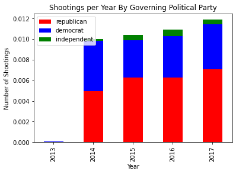
:::
:::

::: {.cell .markdown}
Here we display the number of shootings per year split by governing
political party in a pyramid bar plot. This allows us to better
visualize the data from the previous cell. We can now see that it is
more obvious that republican governed states had more shootings than
democrat governed states. We chose not to display independent governed
states as the data was small and insignificant to the bigger picture.
For 2014, the number of shootings between democrat and republican states
seems to be about the same. However, for the years 2015, 2016, and 2017,
republican governed states have more shootings than democrat states by a
larger margin.
:::

::: {.cell .code execution_count="26" scrolled="true"}
``` {.python}
democrat = [-1*x for x in democrat]
plt.rcParams["figure.figsize"] = (10, 5)
df_party = pd.DataFrame({'Year': index, 
                    'Democrat': democrat, 
                    'Republican': republican})

#Class
YearClass = index
#Chart
bar_plot = sns.barplot(x='Democrat', y='Year', data=df_party, order=YearClass, lw=0, palette="PRGn")
bar_plot = sns.barplot(x='Republican', y='Year', data=df_party, order=YearClass, lw=0, palette="Spectral")
plt.xlim([-0.0074, 0.0074])
plt.title("Number of Shootings per Year by Governing Political Party", fontsize=18)
plt.xlabel("Number of Shootings (Democrat/Republican)")
plt.show()
```

::: {.output .display_data}
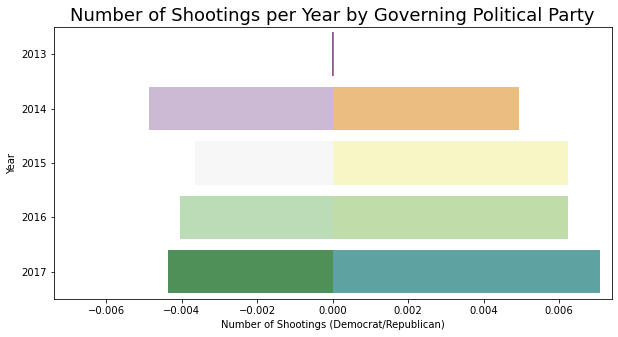
:::
:::

::: {.cell .markdown}
Below we are adding to the df_age dataframe we created earlier to
calculate the number of susppects per incident. Using helper functions,
we are able to add total suspects, the list of suspects using their
number values, suspects\' age groups, number of teens, and number of
adults for each incident.
:::

::: {.cell .code execution_count="27"}
``` {.python}
# counting number of suspects for each incident:
def count(x):
    count = 0
#     print(x)
    for key in x:
        if x[key] == 'Subject-Suspect':
            count += 1
    return count

def list_count(x):
    count = []
    for key in x:
        if x[key] == 'Subject-Suspect':
            count.append(key)
    return count

def make_groups(x):
    count = []
    for key in x:
        count.append(x[key])
    return count

def teen(x):
    count = 0
    for key in x:
        if x[key] == 'Teen 12-17':
            count += 1
    return count

def adult(x):
    count = 0
    for key in x:
        if x[key] == 'Adult 18+':
            count += 1
    return count


df_age['suspects_no'] = df_age['participant_type'].apply(count)
df_age['suspects_list'] = df_age['participant_type'].apply(list_count)
df_age['suspect_age_groups'] = df_age['participant_age_group'].apply(make_groups)
df_age['suspect_teens'] = df_age['participant_age_group'].apply(teen)
df_age['suspect_adults'] = df_age['participant_age_group'].apply(adult)
df_age['combined'] = df_age.apply(lambda x: list([x['suspect_teens'],
                                        x['suspect_adults']]),axis=1) 
df_age
```

::: {.output .stream .stderr}
    <ipython-input-27-ff7be581d569>:38: SettingWithCopyWarning: 
    A value is trying to be set on a copy of a slice from a DataFrame.
    Try using .loc[row_indexer,col_indexer] = value instead

    See the caveats in the documentation: https://pandas.pydata.org/pandas-docs/stable/user_guide/indexing.html#returning-a-view-versus-a-copy
      df_age['suspects_no'] = df_age['participant_type'].apply(count)
    <ipython-input-27-ff7be581d569>:39: SettingWithCopyWarning: 
    A value is trying to be set on a copy of a slice from a DataFrame.
    Try using .loc[row_indexer,col_indexer] = value instead

    See the caveats in the documentation: https://pandas.pydata.org/pandas-docs/stable/user_guide/indexing.html#returning-a-view-versus-a-copy
      df_age['suspects_list'] = df_age['participant_type'].apply(list_count)
    <ipython-input-27-ff7be581d569>:40: SettingWithCopyWarning: 
    A value is trying to be set on a copy of a slice from a DataFrame.
    Try using .loc[row_indexer,col_indexer] = value instead

    See the caveats in the documentation: https://pandas.pydata.org/pandas-docs/stable/user_guide/indexing.html#returning-a-view-versus-a-copy
      df_age['suspect_age_groups'] = df_age['participant_age_group'].apply(make_groups)
    <ipython-input-27-ff7be581d569>:41: SettingWithCopyWarning: 
    A value is trying to be set on a copy of a slice from a DataFrame.
    Try using .loc[row_indexer,col_indexer] = value instead

    See the caveats in the documentation: https://pandas.pydata.org/pandas-docs/stable/user_guide/indexing.html#returning-a-view-versus-a-copy
      df_age['suspect_teens'] = df_age['participant_age_group'].apply(teen)
    <ipython-input-27-ff7be581d569>:42: SettingWithCopyWarning: 
    A value is trying to be set on a copy of a slice from a DataFrame.
    Try using .loc[row_indexer,col_indexer] = value instead

    See the caveats in the documentation: https://pandas.pydata.org/pandas-docs/stable/user_guide/indexing.html#returning-a-view-versus-a-copy
      df_age['suspect_adults'] = df_age['participant_age_group'].apply(adult)
    <ipython-input-27-ff7be581d569>:43: SettingWithCopyWarning: 
    A value is trying to be set on a copy of a slice from a DataFrame.
    Try using .loc[row_indexer,col_indexer] = value instead

    See the caveats in the documentation: https://pandas.pydata.org/pandas-docs/stable/user_guide/indexing.html#returning-a-view-versus-a-copy
      df_age['combined'] = df_age.apply(lambda x: list([x['suspect_teens'],
:::

::: {.output .execute_result execution_count="27"}
```{=html}
<div>
<style scoped>
    .dataframe tbody tr th:only-of-type {
        vertical-align: middle;
    }

    .dataframe tbody tr th {
        vertical-align: top;
    }

    .dataframe thead th {
        text-align: right;
    }
</style>
<table border="1" class="dataframe">
  <thead>
    <tr style="text-align: right;">
      <th></th>
      <th>incident_id</th>
      <th>date</th>
      <th>state</th>
      <th>city_or_county</th>
      <th>address</th>
      <th>n_killed</th>
      <th>n_injured</th>
      <th>congressional_district</th>
      <th>incident_characteristics</th>
      <th>latitude</th>
      <th>...</th>
      <th>participant_status</th>
      <th>participant_type</th>
      <th>state_house_district</th>
      <th>state_senate_district</th>
      <th>suspects_no</th>
      <th>suspects_list</th>
      <th>suspect_age_groups</th>
      <th>suspect_teens</th>
      <th>suspect_adults</th>
      <th>combined</th>
    </tr>
  </thead>
  <tbody>
    <tr>
      <th>164474</th>
      <td>740176</td>
      <td>2017-01-01</td>
      <td>Tennessee</td>
      <td>Memphis</td>
      <td>3000 block of Danville Road</td>
      <td>1</td>
      <td>0</td>
      <td>9.0</td>
      <td>Shot - Dead (murder, accidental, suicide)||Dri...</td>
      <td>35.0670</td>
      <td>...</td>
      <td>0::Killed||1::Unharmed, Arrested||2::Unharmed,...</td>
      <td>{0: 'Victim', 1: 'Subject-Suspect', 2: 'Subjec...</td>
      <td>91.0</td>
      <td>33.0</td>
      <td>2</td>
      <td>[1, 2]</td>
      <td>[Adult 18+, Teen 12-17, Adult 18+]</td>
      <td>1</td>
      <td>2</td>
      <td>[1, 2]</td>
    </tr>
    <tr>
      <th>164475</th>
      <td>741857</td>
      <td>2017-01-01</td>
      <td>Nebraska</td>
      <td>Omaha</td>
      <td>N 24th St and Sprague St</td>
      <td>0</td>
      <td>0</td>
      <td>2.0</td>
      <td>Shots Fired - No Injuries</td>
      <td>41.2960</td>
      <td>...</td>
      <td>0::Unharmed, Arrested</td>
      <td>{0: 'Subject-Suspect'}</td>
      <td>NaN</td>
      <td>11.0</td>
      <td>1</td>
      <td>[0]</td>
      <td>[Adult 18+]</td>
      <td>0</td>
      <td>1</td>
      <td>[0, 1]</td>
    </tr>
    <tr>
      <th>164476</th>
      <td>741852</td>
      <td>2017-01-01</td>
      <td>Nebraska</td>
      <td>Omaha</td>
      <td>S 27th St and Polk St</td>
      <td>0</td>
      <td>1</td>
      <td>2.0</td>
      <td>Shot - Wounded/Injured</td>
      <td>41.1918</td>
      <td>...</td>
      <td>0::Injured||1::Unharmed, Arrested</td>
      <td>{0: 'Victim', 1: 'Subject-Suspect'}</td>
      <td>NaN</td>
      <td>5.0</td>
      <td>1</td>
      <td>[1]</td>
      <td>[Adult 18+, Teen 12-17]</td>
      <td>1</td>
      <td>1</td>
      <td>[1, 1]</td>
    </tr>
    <tr>
      <th>164477</th>
      <td>740911</td>
      <td>2017-01-01</td>
      <td>Pennsylvania</td>
      <td>Erie</td>
      <td>2134 Glendale Ave</td>
      <td>0</td>
      <td>1</td>
      <td>3.0</td>
      <td>Shot - Wounded/Injured||Domestic Violence</td>
      <td>42.1306</td>
      <td>...</td>
      <td>0::Injured||1::Unharmed, Arrested</td>
      <td>{0: 'Victim', 1: 'Subject-Suspect'}</td>
      <td>NaN</td>
      <td>NaN</td>
      <td>1</td>
      <td>[1]</td>
      <td>[Adult 18+, Adult 18+]</td>
      <td>0</td>
      <td>2</td>
      <td>[0, 2]</td>
    </tr>
    <tr>
      <th>164479</th>
      <td>740240</td>
      <td>2017-01-01</td>
      <td>Virginia</td>
      <td>Richmond</td>
      <td>2800 block of Fairfield Ave</td>
      <td>0</td>
      <td>1</td>
      <td>3.0</td>
      <td>Shot - Wounded/Injured</td>
      <td>37.5488</td>
      <td>...</td>
      <td>0::Injured</td>
      <td>{0: 'Victim'}</td>
      <td>71.0</td>
      <td>16.0</td>
      <td>0</td>
      <td>[]</td>
      <td>[Adult 18+]</td>
      <td>0</td>
      <td>1</td>
      <td>[0, 1]</td>
    </tr>
    <tr>
      <th>...</th>
      <td>...</td>
      <td>...</td>
      <td>...</td>
      <td>...</td>
      <td>...</td>
      <td>...</td>
      <td>...</td>
      <td>...</td>
      <td>...</td>
      <td>...</td>
      <td>...</td>
      <td>...</td>
      <td>...</td>
      <td>...</td>
      <td>...</td>
      <td>...</td>
      <td>...</td>
      <td>...</td>
      <td>...</td>
      <td>...</td>
      <td>...</td>
    </tr>
    <tr>
      <th>225862</th>
      <td>1021943</td>
      <td>2017-12-31</td>
      <td>Alabama</td>
      <td>Selma</td>
      <td>300 block of Gaines Avenue</td>
      <td>0</td>
      <td>1</td>
      <td>7.0</td>
      <td>Shot - Wounded/Injured||Drive-by (car to stree...</td>
      <td>32.3752</td>
      <td>...</td>
      <td>0::Injured</td>
      <td>{0: 'Victim'}</td>
      <td>67.0</td>
      <td>23.0</td>
      <td>0</td>
      <td>[]</td>
      <td>[Teen 12-17]</td>
      <td>1</td>
      <td>0</td>
      <td>[1, 0]</td>
    </tr>
    <tr>
      <th>225864</th>
      <td>1018580</td>
      <td>2017-12-31</td>
      <td>Illinois</td>
      <td>Rockford</td>
      <td>1100 Greenwood Ave</td>
      <td>0</td>
      <td>0</td>
      <td>17.0</td>
      <td>Non-Shooting Incident||Officer Involved Incide...</td>
      <td>42.2726</td>
      <td>...</td>
      <td>0::Unharmed, Arrested</td>
      <td>{0: 'Subject-Suspect'}</td>
      <td>67.0</td>
      <td>34.0</td>
      <td>1</td>
      <td>[0]</td>
      <td>[Adult 18+]</td>
      <td>0</td>
      <td>1</td>
      <td>[0, 1]</td>
    </tr>
    <tr>
      <th>225868</th>
      <td>1020900</td>
      <td>2017-12-31</td>
      <td>Florida</td>
      <td>Fort Pierce</td>
      <td>601 N 25th St</td>
      <td>0</td>
      <td>1</td>
      <td>18.0</td>
      <td>Shot - Wounded/Injured||Institution/Group/Busi...</td>
      <td>27.4549</td>
      <td>...</td>
      <td>0::Unharmed||1::Injured, Arrested||2::Unharmed...</td>
      <td>{0: 'Victim', 1: 'Subject-Suspect', 2: 'Subjec...</td>
      <td>84.0</td>
      <td>25.0</td>
      <td>2</td>
      <td>[1, 2]</td>
      <td>[Teen 12-17, Teen 12-17]</td>
      <td>2</td>
      <td>0</td>
      <td>[2, 0]</td>
    </tr>
    <tr>
      <th>225873</th>
      <td>1018101</td>
      <td>2017-12-31</td>
      <td>Illinois</td>
      <td>Chicago</td>
      <td>1900 S Sawyer Ave</td>
      <td>0</td>
      <td>1</td>
      <td>NaN</td>
      <td>Shot - Wounded/Injured||Drive-by (car to stree...</td>
      <td>41.8553</td>
      <td>...</td>
      <td>0::Injured||1::Unharmed</td>
      <td>{0: 'Victim', 1: 'Subject-Suspect'}</td>
      <td>NaN</td>
      <td>NaN</td>
      <td>1</td>
      <td>[1]</td>
      <td>[Adult 18+]</td>
      <td>0</td>
      <td>1</td>
      <td>[0, 1]</td>
    </tr>
    <tr>
      <th>225874</th>
      <td>1019212</td>
      <td>2017-12-31</td>
      <td>Kentucky</td>
      <td>Robards</td>
      <td>11000 block of US 41</td>
      <td>0</td>
      <td>1</td>
      <td>1.0</td>
      <td>Shot - Wounded/Injured</td>
      <td>37.7520</td>
      <td>...</td>
      <td>0::Injured||1::Unharmed||2::Unharmed</td>
      <td>{0: 'Victim', 1: 'Subject-Suspect', 2: 'Subjec...</td>
      <td>11.0</td>
      <td>4.0</td>
      <td>2</td>
      <td>[1, 2]</td>
      <td>[Adult 18+, Adult 18+]</td>
      <td>0</td>
      <td>2</td>
      <td>[0, 2]</td>
    </tr>
  </tbody>
</table>
<p>38449 rows × 26 columns</p>
</div>
```
:::
:::

::: {.cell .markdown}
We are then using these new columns to calculate the total number of
suspects and the number of suspects per age group for each incident. The
method count_sus(x) and list_count_sus(x) return the total number of
suspects and the list of all suspects for a particular incident.
count_vic(x) and list_count_vic(x) do the the same but for victims. The
make_groups() method iterates through each row in the suspects_list and
participant_age_group and returns a list of all age_groups that map the
suspects_list to the particular age group in that row. This idea is also
used for other methods like teen(), adult_18_to_24(), \...,
adult_76_plus(), which calculates the number of suspects that map to
each of the sub age groups. Creating different age groups and mapping
suspects into each of them will help us understand the distribution of
this data more clearly.
:::

::: {.cell .code execution_count="28" scrolled="false"}
``` {.python}
def count_sus(x):
    count = 0
    for key in x:
        if x[key] == 'Subject-Suspect':
            count += 1
    return count

def list_count_sus(x):
    count = []
    for key in x:
        if x[key] == 'Subject-Suspect':
            count.append(key)
    return count

def count_vic(x):
    count = 0
    for key in x:
        if x[key] == 'Victim':
            count += 1
    return count

def list_count_vic(x):
    count = []
    for key in x:
        if x[key] == 'Victim':
            count.append(key)
    return count

def make_groups():
    total_count = []
    count = []
    for suspects,age_groups in zip(df_age.suspects_list, df_age.participant_age_group):
        count = []
        for sus in suspects:
            if len(age_groups) > sus and sus in age_groups:
#                 print(age_groups)
                count.append(age_groups[sus])
        total_count.append(count)
    return total_count

def teen():
    total_count = []
    count = 0
    for suspects,age_groups in zip(df_age.suspects_list, df_age.participant_age_group):
        count = 0
        for sus in suspects:
            if len(age_groups) > sus and sus in age_groups:
                if age_groups[sus] == 'Teen 12-17':
                    count += 1
        total_count.append(count)
    return total_count

def adult_18_to_24():
    total_count = []
    count = 0
    for suspects,age_groups in zip(df_age.suspects_list, df_age.participant_age):
        count = 0
        for sus in suspects:
            if len(age_groups) > sus and sus in age_groups:
                if age_groups[sus] >= 18 and age_groups[sus] <= 24:
                    count += 1
        total_count.append(count)
    return total_count

def adult_25_to_40():
    total_count = []
    count = 0
    for suspects,age_groups in zip(df_age.suspects_list, df_age.participant_age):
        count = 0
        for sus in suspects:
            if len(age_groups) > sus and sus in age_groups:
                if age_groups[sus] >= 25 and age_groups[sus] <= 40:
                    count += 1
        total_count.append(count)
    return total_count

def adult_41_to_56():
    total_count = []
    count = 0
    for suspects,age_groups in zip(df_age.suspects_list, df_age.participant_age):
        count = 0
        for sus in suspects:
            if len(age_groups) > sus and sus in age_groups:
                if age_groups[sus] >= 41 and age_groups[sus] <= 56:
                    count += 1
        total_count.append(count)
    return total_count

def adult_57_to_66():
    total_count = []
    count = 0
    for suspects,age_groups in zip(df_age.suspects_list, df_age.participant_age):
        count = 0
        for sus in suspects:
            if len(age_groups) > sus and sus in age_groups:
                if age_groups[sus] >= 57 and age_groups[sus] <= 66:
                    count += 1
        total_count.append(count)
    return total_count

def adult_67_to_75():
    total_count = []
    count = 0
    for suspects,age_groups in zip(df_age.suspects_list, df_age.participant_age):
        count = 0
        for sus in suspects:
            if len(age_groups) > sus and sus in age_groups:
                if age_groups[sus] >= 67 and age_groups[sus] <= 75:
                    count += 1
        total_count.append(count)
    return total_count

def adult_76_plus():
    total_count = []
    count = 0
    for suspects,age_groups in zip(df_age.suspects_list, df_age.participant_age):
        count = 0
        for sus in suspects:
            if len(age_groups) > sus and sus in age_groups:
                if age_groups[sus] >= 76:
                    count += 1
        total_count.append(count)
    return total_count

# suspects
df_age['suspects_no'] = df_age['participant_type'].apply(count_sus)
df_age['suspects_list'] = df_age['participant_type'].apply(list_count_sus)
df_age['suspect_age_groups'] = make_groups()
df_age['suspect_teens'] = teen()
df_age['suspect_18-24'] = adult_18_to_24()
df_age['suspect_25-40'] = adult_25_to_40()
df_age['suspect_41-56'] = adult_41_to_56()
df_age['suspect_57-66'] = adult_57_to_66()
df_age['suspect_67-75'] = adult_67_to_75()
df_age['suspect_76'] = adult_76_plus()

df_age
```

::: {.output .stream .stderr}
    <ipython-input-28-83ae928bb04b>:126: SettingWithCopyWarning: 
    A value is trying to be set on a copy of a slice from a DataFrame.
    Try using .loc[row_indexer,col_indexer] = value instead

    See the caveats in the documentation: https://pandas.pydata.org/pandas-docs/stable/user_guide/indexing.html#returning-a-view-versus-a-copy
      df_age['suspects_no'] = df_age['participant_type'].apply(count_sus)
    <ipython-input-28-83ae928bb04b>:127: SettingWithCopyWarning: 
    A value is trying to be set on a copy of a slice from a DataFrame.
    Try using .loc[row_indexer,col_indexer] = value instead

    See the caveats in the documentation: https://pandas.pydata.org/pandas-docs/stable/user_guide/indexing.html#returning-a-view-versus-a-copy
      df_age['suspects_list'] = df_age['participant_type'].apply(list_count_sus)
    <ipython-input-28-83ae928bb04b>:128: SettingWithCopyWarning: 
    A value is trying to be set on a copy of a slice from a DataFrame.
    Try using .loc[row_indexer,col_indexer] = value instead

    See the caveats in the documentation: https://pandas.pydata.org/pandas-docs/stable/user_guide/indexing.html#returning-a-view-versus-a-copy
      df_age['suspect_age_groups'] = make_groups()
    <ipython-input-28-83ae928bb04b>:129: SettingWithCopyWarning: 
    A value is trying to be set on a copy of a slice from a DataFrame.
    Try using .loc[row_indexer,col_indexer] = value instead

    See the caveats in the documentation: https://pandas.pydata.org/pandas-docs/stable/user_guide/indexing.html#returning-a-view-versus-a-copy
      df_age['suspect_teens'] = teen()
    <ipython-input-28-83ae928bb04b>:130: SettingWithCopyWarning: 
    A value is trying to be set on a copy of a slice from a DataFrame.
    Try using .loc[row_indexer,col_indexer] = value instead

    See the caveats in the documentation: https://pandas.pydata.org/pandas-docs/stable/user_guide/indexing.html#returning-a-view-versus-a-copy
      df_age['suspect_18-24'] = adult_18_to_24()
    <ipython-input-28-83ae928bb04b>:131: SettingWithCopyWarning: 
    A value is trying to be set on a copy of a slice from a DataFrame.
    Try using .loc[row_indexer,col_indexer] = value instead

    See the caveats in the documentation: https://pandas.pydata.org/pandas-docs/stable/user_guide/indexing.html#returning-a-view-versus-a-copy
      df_age['suspect_25-40'] = adult_25_to_40()
    <ipython-input-28-83ae928bb04b>:132: SettingWithCopyWarning: 
    A value is trying to be set on a copy of a slice from a DataFrame.
    Try using .loc[row_indexer,col_indexer] = value instead

    See the caveats in the documentation: https://pandas.pydata.org/pandas-docs/stable/user_guide/indexing.html#returning-a-view-versus-a-copy
      df_age['suspect_41-56'] = adult_41_to_56()
    <ipython-input-28-83ae928bb04b>:133: SettingWithCopyWarning: 
    A value is trying to be set on a copy of a slice from a DataFrame.
    Try using .loc[row_indexer,col_indexer] = value instead

    See the caveats in the documentation: https://pandas.pydata.org/pandas-docs/stable/user_guide/indexing.html#returning-a-view-versus-a-copy
      df_age['suspect_57-66'] = adult_57_to_66()
    <ipython-input-28-83ae928bb04b>:134: SettingWithCopyWarning: 
    A value is trying to be set on a copy of a slice from a DataFrame.
    Try using .loc[row_indexer,col_indexer] = value instead

    See the caveats in the documentation: https://pandas.pydata.org/pandas-docs/stable/user_guide/indexing.html#returning-a-view-versus-a-copy
      df_age['suspect_67-75'] = adult_67_to_75()
    <ipython-input-28-83ae928bb04b>:135: SettingWithCopyWarning: 
    A value is trying to be set on a copy of a slice from a DataFrame.
    Try using .loc[row_indexer,col_indexer] = value instead

    See the caveats in the documentation: https://pandas.pydata.org/pandas-docs/stable/user_guide/indexing.html#returning-a-view-versus-a-copy
      df_age['suspect_76'] = adult_76_plus()
:::

::: {.output .execute_result execution_count="28"}
```{=html}
<div>
<style scoped>
    .dataframe tbody tr th:only-of-type {
        vertical-align: middle;
    }

    .dataframe tbody tr th {
        vertical-align: top;
    }

    .dataframe thead th {
        text-align: right;
    }
</style>
<table border="1" class="dataframe">
  <thead>
    <tr style="text-align: right;">
      <th></th>
      <th>incident_id</th>
      <th>date</th>
      <th>state</th>
      <th>city_or_county</th>
      <th>address</th>
      <th>n_killed</th>
      <th>n_injured</th>
      <th>congressional_district</th>
      <th>incident_characteristics</th>
      <th>latitude</th>
      <th>...</th>
      <th>suspect_age_groups</th>
      <th>suspect_teens</th>
      <th>suspect_adults</th>
      <th>combined</th>
      <th>suspect_18-24</th>
      <th>suspect_25-40</th>
      <th>suspect_41-56</th>
      <th>suspect_57-66</th>
      <th>suspect_67-75</th>
      <th>suspect_76</th>
    </tr>
  </thead>
  <tbody>
    <tr>
      <th>164474</th>
      <td>740176</td>
      <td>2017-01-01</td>
      <td>Tennessee</td>
      <td>Memphis</td>
      <td>3000 block of Danville Road</td>
      <td>1</td>
      <td>0</td>
      <td>9.0</td>
      <td>Shot - Dead (murder, accidental, suicide)||Dri...</td>
      <td>35.0670</td>
      <td>...</td>
      <td>[Teen 12-17, Adult 18+]</td>
      <td>1</td>
      <td>2</td>
      <td>[1, 2]</td>
      <td>1</td>
      <td>0</td>
      <td>0</td>
      <td>0</td>
      <td>0</td>
      <td>0</td>
    </tr>
    <tr>
      <th>164475</th>
      <td>741857</td>
      <td>2017-01-01</td>
      <td>Nebraska</td>
      <td>Omaha</td>
      <td>N 24th St and Sprague St</td>
      <td>0</td>
      <td>0</td>
      <td>2.0</td>
      <td>Shots Fired - No Injuries</td>
      <td>41.2960</td>
      <td>...</td>
      <td>[Adult 18+]</td>
      <td>0</td>
      <td>1</td>
      <td>[0, 1]</td>
      <td>0</td>
      <td>1</td>
      <td>0</td>
      <td>0</td>
      <td>0</td>
      <td>0</td>
    </tr>
    <tr>
      <th>164476</th>
      <td>741852</td>
      <td>2017-01-01</td>
      <td>Nebraska</td>
      <td>Omaha</td>
      <td>S 27th St and Polk St</td>
      <td>0</td>
      <td>1</td>
      <td>2.0</td>
      <td>Shot - Wounded/Injured</td>
      <td>41.1918</td>
      <td>...</td>
      <td>[Teen 12-17]</td>
      <td>1</td>
      <td>1</td>
      <td>[1, 1]</td>
      <td>0</td>
      <td>0</td>
      <td>0</td>
      <td>0</td>
      <td>0</td>
      <td>0</td>
    </tr>
    <tr>
      <th>164477</th>
      <td>740911</td>
      <td>2017-01-01</td>
      <td>Pennsylvania</td>
      <td>Erie</td>
      <td>2134 Glendale Ave</td>
      <td>0</td>
      <td>1</td>
      <td>3.0</td>
      <td>Shot - Wounded/Injured||Domestic Violence</td>
      <td>42.1306</td>
      <td>...</td>
      <td>[Adult 18+]</td>
      <td>0</td>
      <td>2</td>
      <td>[0, 2]</td>
      <td>0</td>
      <td>0</td>
      <td>0</td>
      <td>0</td>
      <td>1</td>
      <td>0</td>
    </tr>
    <tr>
      <th>164479</th>
      <td>740240</td>
      <td>2017-01-01</td>
      <td>Virginia</td>
      <td>Richmond</td>
      <td>2800 block of Fairfield Ave</td>
      <td>0</td>
      <td>1</td>
      <td>3.0</td>
      <td>Shot - Wounded/Injured</td>
      <td>37.5488</td>
      <td>...</td>
      <td>[]</td>
      <td>0</td>
      <td>1</td>
      <td>[0, 1]</td>
      <td>0</td>
      <td>0</td>
      <td>0</td>
      <td>0</td>
      <td>0</td>
      <td>0</td>
    </tr>
    <tr>
      <th>...</th>
      <td>...</td>
      <td>...</td>
      <td>...</td>
      <td>...</td>
      <td>...</td>
      <td>...</td>
      <td>...</td>
      <td>...</td>
      <td>...</td>
      <td>...</td>
      <td>...</td>
      <td>...</td>
      <td>...</td>
      <td>...</td>
      <td>...</td>
      <td>...</td>
      <td>...</td>
      <td>...</td>
      <td>...</td>
      <td>...</td>
      <td>...</td>
    </tr>
    <tr>
      <th>225862</th>
      <td>1021943</td>
      <td>2017-12-31</td>
      <td>Alabama</td>
      <td>Selma</td>
      <td>300 block of Gaines Avenue</td>
      <td>0</td>
      <td>1</td>
      <td>7.0</td>
      <td>Shot - Wounded/Injured||Drive-by (car to stree...</td>
      <td>32.3752</td>
      <td>...</td>
      <td>[]</td>
      <td>0</td>
      <td>0</td>
      <td>[1, 0]</td>
      <td>0</td>
      <td>0</td>
      <td>0</td>
      <td>0</td>
      <td>0</td>
      <td>0</td>
    </tr>
    <tr>
      <th>225864</th>
      <td>1018580</td>
      <td>2017-12-31</td>
      <td>Illinois</td>
      <td>Rockford</td>
      <td>1100 Greenwood Ave</td>
      <td>0</td>
      <td>0</td>
      <td>17.0</td>
      <td>Non-Shooting Incident||Officer Involved Incide...</td>
      <td>42.2726</td>
      <td>...</td>
      <td>[Adult 18+]</td>
      <td>0</td>
      <td>1</td>
      <td>[0, 1]</td>
      <td>1</td>
      <td>0</td>
      <td>0</td>
      <td>0</td>
      <td>0</td>
      <td>0</td>
    </tr>
    <tr>
      <th>225868</th>
      <td>1020900</td>
      <td>2017-12-31</td>
      <td>Florida</td>
      <td>Fort Pierce</td>
      <td>601 N 25th St</td>
      <td>0</td>
      <td>1</td>
      <td>18.0</td>
      <td>Shot - Wounded/Injured||Institution/Group/Busi...</td>
      <td>27.4549</td>
      <td>...</td>
      <td>[Teen 12-17]</td>
      <td>1</td>
      <td>0</td>
      <td>[2, 0]</td>
      <td>0</td>
      <td>0</td>
      <td>0</td>
      <td>0</td>
      <td>0</td>
      <td>0</td>
    </tr>
    <tr>
      <th>225873</th>
      <td>1018101</td>
      <td>2017-12-31</td>
      <td>Illinois</td>
      <td>Chicago</td>
      <td>1900 S Sawyer Ave</td>
      <td>0</td>
      <td>1</td>
      <td>NaN</td>
      <td>Shot - Wounded/Injured||Drive-by (car to stree...</td>
      <td>41.8553</td>
      <td>...</td>
      <td>[]</td>
      <td>0</td>
      <td>1</td>
      <td>[0, 1]</td>
      <td>0</td>
      <td>0</td>
      <td>0</td>
      <td>0</td>
      <td>0</td>
      <td>0</td>
    </tr>
    <tr>
      <th>225874</th>
      <td>1019212</td>
      <td>2017-12-31</td>
      <td>Kentucky</td>
      <td>Robards</td>
      <td>11000 block of US 41</td>
      <td>0</td>
      <td>1</td>
      <td>1.0</td>
      <td>Shot - Wounded/Injured</td>
      <td>37.7520</td>
      <td>...</td>
      <td>[Adult 18+]</td>
      <td>0</td>
      <td>2</td>
      <td>[0, 2]</td>
      <td>0</td>
      <td>0</td>
      <td>0</td>
      <td>0</td>
      <td>0</td>
      <td>0</td>
    </tr>
  </tbody>
</table>
<p>38449 rows × 32 columns</p>
</div>
```
:::
:::

::: {.cell .markdown}
We then calculate the sum of suspect teens and other age groups for all
incidents in total. This will be used to graph the age groups with the
number of suspects per age group. Below is the barplot that shows this
distribution. As seen below, the age group 25-40 has the highest number
of suspects for all incidents in the year of 2017, while the age group
76+ has the lowest.
:::

::: {.cell .code execution_count="29"}
``` {.python}
total_teens = df_age.loc[:, 'suspect_teens'].sum()
total_18_24 = df_age.loc[:, 'suspect_18-24'].sum()
total_25_40 = df_age.loc[:, 'suspect_25-40'].sum()
total_41_56 = df_age.loc[:, 'suspect_41-56'].sum()
total_57_66 = df_age.loc[:, 'suspect_57-66'].sum()
total_67_75 = df_age.loc[:, 'suspect_67-75'].sum()
total_75_plus = df_age.loc[:, 'suspect_76'].sum()
print("Teens : ", total_teens)
print("18-24 : ", total_18_24)
print("25-40 : ", total_25_40)
print("41-56 : ", total_41_56)
print("57-66 : ", total_57_66)
print("67-75 : ", total_67_75)
print("75+ : ", total_75_plus)
print("Total : ", total_teens+total_18_24+total_25_40+total_41_56+total_67_75+total_75_plus)
sns.barplot(x=['12-17', '18-24', '25-40', '41-56',
              '57-66', '67-75', '76+'], 
            y=[total_teens, total_18_24, total_25_40, total_41_56, total_57_66, total_67_75, total_75_plus], 
            palette="crest")
plt.rcParams["figure.figsize"] = (20,10)
plt.xlabel("Age Groups")
plt.ylabel("Number of Suspects")
plt.title("Number of Suspects per Age Group")
plt.rcParams.update({'font.size': 20})
plt.show()
```

::: {.output .stream .stdout}
    Teens :  2897
    18-24 :  9067
    25-40 :  10841
    41-56 :  3169
    57-66 :  752
    67-75 :  238
    75+ :  108
    Total :  26320
:::

::: {.output .display_data}
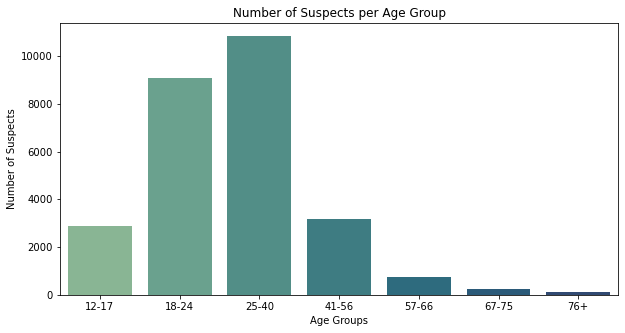
:::
:::

::: {.cell .markdown}
The following code is a replica to the code above but calculates the
number of victims for each incident instead.
:::

::: {.cell .code execution_count="30"}
``` {.python}
def make_groups():
    total_count = []
    count = []
    for victims,age_groups in zip(df_age.victims_list, df_age.participant_age_group):
        count = []
        for vic in victims:
            if len(age_groups) > vic and vic in age_groups:
                count.append(age_groups[vic])
        total_count.append(count)
    return total_count

def teen():
    total_count = []
    count = 0
    for victims,age_groups in zip(df_age.victims_list, df_age.participant_age_group):
        count = 0
        for vic in victims:
            if len(age_groups) > vic and vic in age_groups:
                if age_groups[vic] == 'Teen 12-17':
                    count += 1
        total_count.append(count)
    return total_count

def adult_18_to_24():
    total_count = []
    count = 0
    for victims,age_groups in zip(df_age.victims_list, df_age.participant_age):
        count = 0
        for vic in victims:
            if len(age_groups) > vic and vic in age_groups:
                if age_groups[vic] >= 18 and age_groups[vic] <= 24:
                    count += 1
        total_count.append(count)
    return total_count

def adult_25_to_40():
    total_count = []
    count = 0
    for victims,age_groups in zip(df_age.victims_list, df_age.participant_age):
        count = 0
        for vic in victims:
            if len(age_groups) > vic and vic in age_groups:
                if age_groups[vic] >= 25 and age_groups[vic] <= 40:
                    count += 1
        total_count.append(count)
    return total_count

def adult_41_to_56():
    total_count = []
    count = 0
    for victims,age_groups in zip(df_age.victims_list, df_age.participant_age):
        count = 0
        for vic in victims:
            if len(age_groups) > vic and vic in age_groups:
                if age_groups[vic] >= 41 and age_groups[vic] <= 56:
                    count += 1
        total_count.append(count)
    return total_count

def adult_57_to_66():
    total_count = []
    count = 0
    for victims,age_groups in zip(df_age.victims_list, df_age.participant_age):
        count = 0
        for vic in victims:
            if len(age_groups) > vic and vic in age_groups:
                if age_groups[vic] >= 57 and age_groups[vic] <= 66:
                    count += 1
        total_count.append(count)
    return total_count

def adult_67_to_75():
    total_count = []
    count = 0
    for victims,age_groups in zip(df_age.victims_list, df_age.participant_age):
        count = 0
        for vic in victims:
            if len(age_groups) > vic and vic in age_groups:
                if age_groups[vic] >= 67 and age_groups[vic] <= 75:
                    count += 1
        total_count.append(count)
    return total_count

def adult_76_plus():
    total_count = []
    count = 0
    for victims,age_groups in zip(df_age.victims_list, df_age.participant_age):
        count = 0
        for vic in victims:
            if len(age_groups) > vic and vic in age_groups:
                if age_groups[vic] >= 76:
                    count += 1
        total_count.append(count)
    return total_count

# victims
df_age['victims_no'] = df_age['participant_type'].apply(count_vic)
df_age['victims_list'] = df_age['participant_type'].apply(list_count_vic)
df_age['victim_age_groups'] = make_groups()
df_age['victim_teens'] = teen()
df_age['victim_18-24'] = adult_18_to_24()
df_age['victim_25-40'] = adult_25_to_40()
df_age['victim_41-56'] = adult_41_to_56()
df_age['victim_57-66'] = adult_57_to_66()
df_age['victim_67-75'] = adult_67_to_75()
df_age['victim_76'] = adult_76_plus()

df_age
```

::: {.output .stream .stderr}
    <ipython-input-30-69d52eba6d9d>:97: SettingWithCopyWarning: 
    A value is trying to be set on a copy of a slice from a DataFrame.
    Try using .loc[row_indexer,col_indexer] = value instead

    See the caveats in the documentation: https://pandas.pydata.org/pandas-docs/stable/user_guide/indexing.html#returning-a-view-versus-a-copy
      df_age['victims_no'] = df_age['participant_type'].apply(count_vic)
    <ipython-input-30-69d52eba6d9d>:98: SettingWithCopyWarning: 
    A value is trying to be set on a copy of a slice from a DataFrame.
    Try using .loc[row_indexer,col_indexer] = value instead

    See the caveats in the documentation: https://pandas.pydata.org/pandas-docs/stable/user_guide/indexing.html#returning-a-view-versus-a-copy
      df_age['victims_list'] = df_age['participant_type'].apply(list_count_vic)
    <ipython-input-30-69d52eba6d9d>:99: SettingWithCopyWarning: 
    A value is trying to be set on a copy of a slice from a DataFrame.
    Try using .loc[row_indexer,col_indexer] = value instead

    See the caveats in the documentation: https://pandas.pydata.org/pandas-docs/stable/user_guide/indexing.html#returning-a-view-versus-a-copy
      df_age['victim_age_groups'] = make_groups()
    <ipython-input-30-69d52eba6d9d>:100: SettingWithCopyWarning: 
    A value is trying to be set on a copy of a slice from a DataFrame.
    Try using .loc[row_indexer,col_indexer] = value instead

    See the caveats in the documentation: https://pandas.pydata.org/pandas-docs/stable/user_guide/indexing.html#returning-a-view-versus-a-copy
      df_age['victim_teens'] = teen()
    <ipython-input-30-69d52eba6d9d>:101: SettingWithCopyWarning: 
    A value is trying to be set on a copy of a slice from a DataFrame.
    Try using .loc[row_indexer,col_indexer] = value instead

    See the caveats in the documentation: https://pandas.pydata.org/pandas-docs/stable/user_guide/indexing.html#returning-a-view-versus-a-copy
      df_age['victim_18-24'] = adult_18_to_24()
    <ipython-input-30-69d52eba6d9d>:102: SettingWithCopyWarning: 
    A value is trying to be set on a copy of a slice from a DataFrame.
    Try using .loc[row_indexer,col_indexer] = value instead

    See the caveats in the documentation: https://pandas.pydata.org/pandas-docs/stable/user_guide/indexing.html#returning-a-view-versus-a-copy
      df_age['victim_25-40'] = adult_25_to_40()
    <ipython-input-30-69d52eba6d9d>:103: SettingWithCopyWarning: 
    A value is trying to be set on a copy of a slice from a DataFrame.
    Try using .loc[row_indexer,col_indexer] = value instead

    See the caveats in the documentation: https://pandas.pydata.org/pandas-docs/stable/user_guide/indexing.html#returning-a-view-versus-a-copy
      df_age['victim_41-56'] = adult_41_to_56()
    <ipython-input-30-69d52eba6d9d>:104: SettingWithCopyWarning: 
    A value is trying to be set on a copy of a slice from a DataFrame.
    Try using .loc[row_indexer,col_indexer] = value instead

    See the caveats in the documentation: https://pandas.pydata.org/pandas-docs/stable/user_guide/indexing.html#returning-a-view-versus-a-copy
      df_age['victim_57-66'] = adult_57_to_66()
    <ipython-input-30-69d52eba6d9d>:105: SettingWithCopyWarning: 
    A value is trying to be set on a copy of a slice from a DataFrame.
    Try using .loc[row_indexer,col_indexer] = value instead

    See the caveats in the documentation: https://pandas.pydata.org/pandas-docs/stable/user_guide/indexing.html#returning-a-view-versus-a-copy
      df_age['victim_67-75'] = adult_67_to_75()
    <ipython-input-30-69d52eba6d9d>:106: SettingWithCopyWarning: 
    A value is trying to be set on a copy of a slice from a DataFrame.
    Try using .loc[row_indexer,col_indexer] = value instead

    See the caveats in the documentation: https://pandas.pydata.org/pandas-docs/stable/user_guide/indexing.html#returning-a-view-versus-a-copy
      df_age['victim_76'] = adult_76_plus()
:::

::: {.output .execute_result execution_count="30"}
```{=html}
<div>
<style scoped>
    .dataframe tbody tr th:only-of-type {
        vertical-align: middle;
    }

    .dataframe tbody tr th {
        vertical-align: top;
    }

    .dataframe thead th {
        text-align: right;
    }
</style>
<table border="1" class="dataframe">
  <thead>
    <tr style="text-align: right;">
      <th></th>
      <th>incident_id</th>
      <th>date</th>
      <th>state</th>
      <th>city_or_county</th>
      <th>address</th>
      <th>n_killed</th>
      <th>n_injured</th>
      <th>congressional_district</th>
      <th>incident_characteristics</th>
      <th>latitude</th>
      <th>...</th>
      <th>victims_no</th>
      <th>victims_list</th>
      <th>victim_age_groups</th>
      <th>victim_teens</th>
      <th>victim_18-24</th>
      <th>victim_25-40</th>
      <th>victim_41-56</th>
      <th>victim_57-66</th>
      <th>victim_67-75</th>
      <th>victim_76</th>
    </tr>
  </thead>
  <tbody>
    <tr>
      <th>164474</th>
      <td>740176</td>
      <td>2017-01-01</td>
      <td>Tennessee</td>
      <td>Memphis</td>
      <td>3000 block of Danville Road</td>
      <td>1</td>
      <td>0</td>
      <td>9.0</td>
      <td>Shot - Dead (murder, accidental, suicide)||Dri...</td>
      <td>35.0670</td>
      <td>...</td>
      <td>1</td>
      <td>[0]</td>
      <td>[Adult 18+]</td>
      <td>0</td>
      <td>1</td>
      <td>0</td>
      <td>0</td>
      <td>0</td>
      <td>0</td>
      <td>0</td>
    </tr>
    <tr>
      <th>164475</th>
      <td>741857</td>
      <td>2017-01-01</td>
      <td>Nebraska</td>
      <td>Omaha</td>
      <td>N 24th St and Sprague St</td>
      <td>0</td>
      <td>0</td>
      <td>2.0</td>
      <td>Shots Fired - No Injuries</td>
      <td>41.2960</td>
      <td>...</td>
      <td>0</td>
      <td>[]</td>
      <td>[]</td>
      <td>0</td>
      <td>0</td>
      <td>0</td>
      <td>0</td>
      <td>0</td>
      <td>0</td>
      <td>0</td>
    </tr>
    <tr>
      <th>164476</th>
      <td>741852</td>
      <td>2017-01-01</td>
      <td>Nebraska</td>
      <td>Omaha</td>
      <td>S 27th St and Polk St</td>
      <td>0</td>
      <td>1</td>
      <td>2.0</td>
      <td>Shot - Wounded/Injured</td>
      <td>41.1918</td>
      <td>...</td>
      <td>1</td>
      <td>[0]</td>
      <td>[Adult 18+]</td>
      <td>0</td>
      <td>1</td>
      <td>0</td>
      <td>0</td>
      <td>0</td>
      <td>0</td>
      <td>0</td>
    </tr>
    <tr>
      <th>164477</th>
      <td>740911</td>
      <td>2017-01-01</td>
      <td>Pennsylvania</td>
      <td>Erie</td>
      <td>2134 Glendale Ave</td>
      <td>0</td>
      <td>1</td>
      <td>3.0</td>
      <td>Shot - Wounded/Injured||Domestic Violence</td>
      <td>42.1306</td>
      <td>...</td>
      <td>1</td>
      <td>[0]</td>
      <td>[Adult 18+]</td>
      <td>0</td>
      <td>0</td>
      <td>0</td>
      <td>0</td>
      <td>1</td>
      <td>0</td>
      <td>0</td>
    </tr>
    <tr>
      <th>164479</th>
      <td>740240</td>
      <td>2017-01-01</td>
      <td>Virginia</td>
      <td>Richmond</td>
      <td>2800 block of Fairfield Ave</td>
      <td>0</td>
      <td>1</td>
      <td>3.0</td>
      <td>Shot - Wounded/Injured</td>
      <td>37.5488</td>
      <td>...</td>
      <td>1</td>
      <td>[0]</td>
      <td>[Adult 18+]</td>
      <td>0</td>
      <td>1</td>
      <td>0</td>
      <td>0</td>
      <td>0</td>
      <td>0</td>
      <td>0</td>
    </tr>
    <tr>
      <th>...</th>
      <td>...</td>
      <td>...</td>
      <td>...</td>
      <td>...</td>
      <td>...</td>
      <td>...</td>
      <td>...</td>
      <td>...</td>
      <td>...</td>
      <td>...</td>
      <td>...</td>
      <td>...</td>
      <td>...</td>
      <td>...</td>
      <td>...</td>
      <td>...</td>
      <td>...</td>
      <td>...</td>
      <td>...</td>
      <td>...</td>
      <td>...</td>
    </tr>
    <tr>
      <th>225862</th>
      <td>1021943</td>
      <td>2017-12-31</td>
      <td>Alabama</td>
      <td>Selma</td>
      <td>300 block of Gaines Avenue</td>
      <td>0</td>
      <td>1</td>
      <td>7.0</td>
      <td>Shot - Wounded/Injured||Drive-by (car to stree...</td>
      <td>32.3752</td>
      <td>...</td>
      <td>1</td>
      <td>[0]</td>
      <td>[Teen 12-17]</td>
      <td>1</td>
      <td>0</td>
      <td>0</td>
      <td>0</td>
      <td>0</td>
      <td>0</td>
      <td>0</td>
    </tr>
    <tr>
      <th>225864</th>
      <td>1018580</td>
      <td>2017-12-31</td>
      <td>Illinois</td>
      <td>Rockford</td>
      <td>1100 Greenwood Ave</td>
      <td>0</td>
      <td>0</td>
      <td>17.0</td>
      <td>Non-Shooting Incident||Officer Involved Incide...</td>
      <td>42.2726</td>
      <td>...</td>
      <td>0</td>
      <td>[]</td>
      <td>[]</td>
      <td>0</td>
      <td>0</td>
      <td>0</td>
      <td>0</td>
      <td>0</td>
      <td>0</td>
      <td>0</td>
    </tr>
    <tr>
      <th>225868</th>
      <td>1020900</td>
      <td>2017-12-31</td>
      <td>Florida</td>
      <td>Fort Pierce</td>
      <td>601 N 25th St</td>
      <td>0</td>
      <td>1</td>
      <td>18.0</td>
      <td>Shot - Wounded/Injured||Institution/Group/Busi...</td>
      <td>27.4549</td>
      <td>...</td>
      <td>1</td>
      <td>[0]</td>
      <td>[]</td>
      <td>0</td>
      <td>0</td>
      <td>0</td>
      <td>0</td>
      <td>0</td>
      <td>0</td>
      <td>0</td>
    </tr>
    <tr>
      <th>225873</th>
      <td>1018101</td>
      <td>2017-12-31</td>
      <td>Illinois</td>
      <td>Chicago</td>
      <td>1900 S Sawyer Ave</td>
      <td>0</td>
      <td>1</td>
      <td>NaN</td>
      <td>Shot - Wounded/Injured||Drive-by (car to stree...</td>
      <td>41.8553</td>
      <td>...</td>
      <td>1</td>
      <td>[0]</td>
      <td>[Adult 18+]</td>
      <td>0</td>
      <td>0</td>
      <td>1</td>
      <td>0</td>
      <td>0</td>
      <td>0</td>
      <td>0</td>
    </tr>
    <tr>
      <th>225874</th>
      <td>1019212</td>
      <td>2017-12-31</td>
      <td>Kentucky</td>
      <td>Robards</td>
      <td>11000 block of US 41</td>
      <td>0</td>
      <td>1</td>
      <td>1.0</td>
      <td>Shot - Wounded/Injured</td>
      <td>37.7520</td>
      <td>...</td>
      <td>1</td>
      <td>[0]</td>
      <td>[Adult 18+]</td>
      <td>0</td>
      <td>0</td>
      <td>1</td>
      <td>0</td>
      <td>0</td>
      <td>0</td>
      <td>0</td>
    </tr>
  </tbody>
</table>
<p>38449 rows × 42 columns</p>
</div>
```
:::
:::

::: {.cell .markdown}
Like the suspects, we calculate the sum of victim teens and the other
age groups for all incidents in total. This will be used to graph the
age groups with the number of victims per age group. Below is the
barplot that shows this distribution. As seen below, the age group 25-40
has the highest number of victims for all incidents in the year of 2017,
while the age group 76+ has the lowest. This graph is very similar to
the distribution for suspects, although the data count varies between
the two, which is interesting to see.
:::

::: {.cell .code execution_count="31"}
``` {.python}
plt.figure()
total_teens = df_age.loc[:, 'victim_teens'].sum()
total_18_24 = df_age.loc[:, 'victim_18-24'].sum()
total_25_40 = df_age.loc[:, 'victim_25-40'].sum()
total_41_56 = df_age.loc[:, 'victim_41-56'].sum()
total_57_66 = df_age.loc[:, 'victim_57-66'].sum()
total_67_75 = df_age.loc[:, 'victim_67-75'].sum()
total_75_plus = df_age.loc[:, 'victim_76'].sum()
print("Teens : ", total_teens)
print("18-24 : ", total_18_24)
print("25-40 : ", total_25_40)
print("41-56 : ", total_41_56)
print("57-66 : ", total_57_66)
print("67-75 : ", total_67_75)
print("75+ : ", total_75_plus)
print("Total : ", total_teens+total_18_24+total_25_40+total_41_56+total_67_75+total_75_plus)
sns.barplot(x=['12-17', '18-24', '25-40', '41-56',
              '57-66', '67-75', '76+'], 
            y=[total_teens, total_18_24, total_25_40, total_41_56, total_57_66, total_67_75, total_75_plus], 
            palette="flare")
plt.rcParams["figure.figsize"] = (20,10)
plt.xlabel("Age Groups")
plt.ylabel("Number of Victims")
plt.title("Number of Victims per Age Group")
plt.rcParams.update({'font.size': 20})
plt.show()
```

::: {.output .stream .stdout}
    Teens :  2794
    18-24 :  8030
    25-40 :  10647
    41-56 :  3331
    57-66 :  934
    67-75 :  381
    75+ :  190
    Total :  25373
:::

::: {.output .display_data}
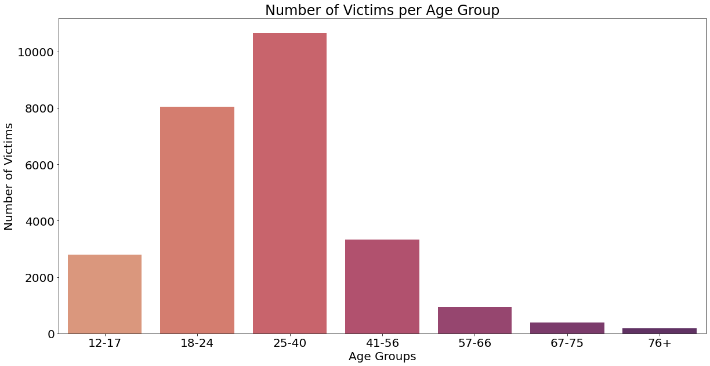
:::
:::

::: {.cell .markdown}
Gender analysis of suspects
:::

::: {.cell .code execution_count="38"}
``` {.python}
def female():
    total_count = []
    count = 0
    for suspects,genders in zip(df_age.suspects_list, df_age.participant_gender):
        count = 0
        for sus in suspects:
            if len(genders) > sus and sus in genders:
                if genders[sus] == 'Female':
                    count += 1
        total_count.append(count)
    return total_count
def male():
    total_count = []
    count = 0
    for suspects,genders in zip(df_age.suspects_list, df_age.participant_gender):
        count = 0
        for sus in suspects:
            if len(genders) > sus and sus in genders:
                if genders[sus] == 'Male':
                    count += 1
        total_count.append(count)
    return total_count
df_age['females'] = female()
df_age['males'] = male()
df_age
```

::: {.output .stream .stderr}
    <ipython-input-38-a4b9c3c3e003>:23: SettingWithCopyWarning: 
    A value is trying to be set on a copy of a slice from a DataFrame.
    Try using .loc[row_indexer,col_indexer] = value instead

    See the caveats in the documentation: https://pandas.pydata.org/pandas-docs/stable/user_guide/indexing.html#returning-a-view-versus-a-copy
      df_age['females'] = female()
    <ipython-input-38-a4b9c3c3e003>:24: SettingWithCopyWarning: 
    A value is trying to be set on a copy of a slice from a DataFrame.
    Try using .loc[row_indexer,col_indexer] = value instead

    See the caveats in the documentation: https://pandas.pydata.org/pandas-docs/stable/user_guide/indexing.html#returning-a-view-versus-a-copy
      df_age['males'] = male()
:::

::: {.output .execute_result execution_count="38"}
```{=html}
<div>
<style scoped>
    .dataframe tbody tr th:only-of-type {
        vertical-align: middle;
    }

    .dataframe tbody tr th {
        vertical-align: top;
    }

    .dataframe thead th {
        text-align: right;
    }
</style>
<table border="1" class="dataframe">
  <thead>
    <tr style="text-align: right;">
      <th></th>
      <th>incident_id</th>
      <th>date</th>
      <th>state</th>
      <th>city_or_county</th>
      <th>address</th>
      <th>n_killed</th>
      <th>n_injured</th>
      <th>congressional_district</th>
      <th>incident_characteristics</th>
      <th>latitude</th>
      <th>...</th>
      <th>victim_age_groups</th>
      <th>victim_teens</th>
      <th>victim_18-24</th>
      <th>victim_25-40</th>
      <th>victim_41-56</th>
      <th>victim_57-66</th>
      <th>victim_67-75</th>
      <th>victim_76</th>
      <th>females</th>
      <th>males</th>
    </tr>
  </thead>
  <tbody>
    <tr>
      <th>164474</th>
      <td>740176</td>
      <td>2017-01-01</td>
      <td>Tennessee</td>
      <td>Memphis</td>
      <td>3000 block of Danville Road</td>
      <td>1</td>
      <td>0</td>
      <td>9.0</td>
      <td>Shot - Dead (murder, accidental, suicide)||Dri...</td>
      <td>35.0670</td>
      <td>...</td>
      <td>[Adult 18+]</td>
      <td>0</td>
      <td>1</td>
      <td>0</td>
      <td>0</td>
      <td>0</td>
      <td>0</td>
      <td>0</td>
      <td>0</td>
      <td>2</td>
    </tr>
    <tr>
      <th>164475</th>
      <td>741857</td>
      <td>2017-01-01</td>
      <td>Nebraska</td>
      <td>Omaha</td>
      <td>N 24th St and Sprague St</td>
      <td>0</td>
      <td>0</td>
      <td>2.0</td>
      <td>Shots Fired - No Injuries</td>
      <td>41.2960</td>
      <td>...</td>
      <td>[]</td>
      <td>0</td>
      <td>0</td>
      <td>0</td>
      <td>0</td>
      <td>0</td>
      <td>0</td>
      <td>0</td>
      <td>0</td>
      <td>1</td>
    </tr>
    <tr>
      <th>164476</th>
      <td>741852</td>
      <td>2017-01-01</td>
      <td>Nebraska</td>
      <td>Omaha</td>
      <td>S 27th St and Polk St</td>
      <td>0</td>
      <td>1</td>
      <td>2.0</td>
      <td>Shot - Wounded/Injured</td>
      <td>41.1918</td>
      <td>...</td>
      <td>[Adult 18+]</td>
      <td>0</td>
      <td>1</td>
      <td>0</td>
      <td>0</td>
      <td>0</td>
      <td>0</td>
      <td>0</td>
      <td>0</td>
      <td>1</td>
    </tr>
    <tr>
      <th>164477</th>
      <td>740911</td>
      <td>2017-01-01</td>
      <td>Pennsylvania</td>
      <td>Erie</td>
      <td>2134 Glendale Ave</td>
      <td>0</td>
      <td>1</td>
      <td>3.0</td>
      <td>Shot - Wounded/Injured||Domestic Violence</td>
      <td>42.1306</td>
      <td>...</td>
      <td>[Adult 18+]</td>
      <td>0</td>
      <td>0</td>
      <td>0</td>
      <td>0</td>
      <td>1</td>
      <td>0</td>
      <td>0</td>
      <td>0</td>
      <td>1</td>
    </tr>
    <tr>
      <th>164479</th>
      <td>740240</td>
      <td>2017-01-01</td>
      <td>Virginia</td>
      <td>Richmond</td>
      <td>2800 block of Fairfield Ave</td>
      <td>0</td>
      <td>1</td>
      <td>3.0</td>
      <td>Shot - Wounded/Injured</td>
      <td>37.5488</td>
      <td>...</td>
      <td>[Adult 18+]</td>
      <td>0</td>
      <td>1</td>
      <td>0</td>
      <td>0</td>
      <td>0</td>
      <td>0</td>
      <td>0</td>
      <td>0</td>
      <td>0</td>
    </tr>
    <tr>
      <th>...</th>
      <td>...</td>
      <td>...</td>
      <td>...</td>
      <td>...</td>
      <td>...</td>
      <td>...</td>
      <td>...</td>
      <td>...</td>
      <td>...</td>
      <td>...</td>
      <td>...</td>
      <td>...</td>
      <td>...</td>
      <td>...</td>
      <td>...</td>
      <td>...</td>
      <td>...</td>
      <td>...</td>
      <td>...</td>
      <td>...</td>
      <td>...</td>
    </tr>
    <tr>
      <th>225862</th>
      <td>1021943</td>
      <td>2017-12-31</td>
      <td>Alabama</td>
      <td>Selma</td>
      <td>300 block of Gaines Avenue</td>
      <td>0</td>
      <td>1</td>
      <td>7.0</td>
      <td>Shot - Wounded/Injured||Drive-by (car to stree...</td>
      <td>32.3752</td>
      <td>...</td>
      <td>[Teen 12-17]</td>
      <td>1</td>
      <td>0</td>
      <td>0</td>
      <td>0</td>
      <td>0</td>
      <td>0</td>
      <td>0</td>
      <td>0</td>
      <td>0</td>
    </tr>
    <tr>
      <th>225864</th>
      <td>1018580</td>
      <td>2017-12-31</td>
      <td>Illinois</td>
      <td>Rockford</td>
      <td>1100 Greenwood Ave</td>
      <td>0</td>
      <td>0</td>
      <td>17.0</td>
      <td>Non-Shooting Incident||Officer Involved Incide...</td>
      <td>42.2726</td>
      <td>...</td>
      <td>[]</td>
      <td>0</td>
      <td>0</td>
      <td>0</td>
      <td>0</td>
      <td>0</td>
      <td>0</td>
      <td>0</td>
      <td>0</td>
      <td>1</td>
    </tr>
    <tr>
      <th>225868</th>
      <td>1020900</td>
      <td>2017-12-31</td>
      <td>Florida</td>
      <td>Fort Pierce</td>
      <td>601 N 25th St</td>
      <td>0</td>
      <td>1</td>
      <td>18.0</td>
      <td>Shot - Wounded/Injured||Institution/Group/Busi...</td>
      <td>27.4549</td>
      <td>...</td>
      <td>[]</td>
      <td>0</td>
      <td>0</td>
      <td>0</td>
      <td>0</td>
      <td>0</td>
      <td>0</td>
      <td>0</td>
      <td>0</td>
      <td>2</td>
    </tr>
    <tr>
      <th>225873</th>
      <td>1018101</td>
      <td>2017-12-31</td>
      <td>Illinois</td>
      <td>Chicago</td>
      <td>1900 S Sawyer Ave</td>
      <td>0</td>
      <td>1</td>
      <td>NaN</td>
      <td>Shot - Wounded/Injured||Drive-by (car to stree...</td>
      <td>41.8553</td>
      <td>...</td>
      <td>[Adult 18+]</td>
      <td>0</td>
      <td>0</td>
      <td>1</td>
      <td>0</td>
      <td>0</td>
      <td>0</td>
      <td>0</td>
      <td>0</td>
      <td>1</td>
    </tr>
    <tr>
      <th>225874</th>
      <td>1019212</td>
      <td>2017-12-31</td>
      <td>Kentucky</td>
      <td>Robards</td>
      <td>11000 block of US 41</td>
      <td>0</td>
      <td>1</td>
      <td>1.0</td>
      <td>Shot - Wounded/Injured</td>
      <td>37.7520</td>
      <td>...</td>
      <td>[Adult 18+]</td>
      <td>0</td>
      <td>0</td>
      <td>1</td>
      <td>0</td>
      <td>0</td>
      <td>0</td>
      <td>0</td>
      <td>0</td>
      <td>2</td>
    </tr>
  </tbody>
</table>
<p>38449 rows × 44 columns</p>
</div>
```
:::
:::

::: {.cell .code execution_count="46"}
``` {.python}
plt.figure()
total_female = df_age.loc[:, 'females'].sum()
total_male = df_age.loc[:, 'males'].sum()
print("Males : ", total_male)
print("Females : ", total_female)
sns.barplot(x=['Male', 'Female'], 
            y=[total_male, total_female], 
            palette="coolwarm")
plt.rcParams["figure.figsize"] = (20,10)
plt.xlabel("Suspect Gender")
plt.ylabel("Number of Suspects")
plt.title("Number of Suspects by Gender")
plt.rcParams.update({'font.size': 20})
plt.show()
```

::: {.output .stream .stdout}
    Males :  31744
    Females :  2565
:::

::: {.output .display_data}
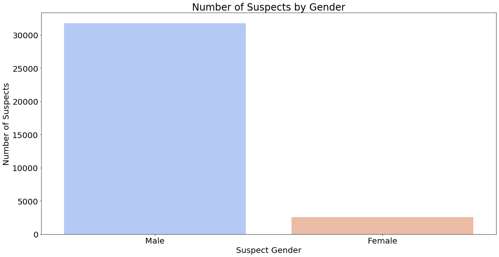
:::
:::

::: {.cell .code execution_count="33"}
``` {.python}
def count_incidents(x):
    temp = pd.DataFrame(columns = ['state', 'Jan', 'Feb', 'Mar', 'Apr', 'May', 'Jun', 'Jul', 'Aug', 'Sep', 'Oct', 'Nov', 'Dec'])
    states = sorted(list(df_2017.state.unique()))
    months = {1:'Jan', 2:'Feb', 3:'Mar', 4:'Apr', 5:'May', 6:'Jun', 7:'Jul', 8:'Aug', 9:'Sep', 10:'Oct', 11:'Nov', 12:'Dec'}
    for i in states: 
        state_df = x[x.state == i] #dataframe for each state
        dict = {'state': i, 'Jan':0, 'Feb':0, 'Mar':0, 'Apr':0, 'May':0, 'Jun':0, 'Jul':0, 'Aug':0, 'Sep':0, 'Oct':0, 'Nov':0, 'Dec':0} #what we want for that state
        for j in months.keys():
            count = 0
            for index, row in state_df.iterrows():
                if row['date'].month == j: 
                    count = count + 1
                dict[months[j]] = count
        temp = temp.append(dict, ignore_index=True)
    
    return temp
    
df_2013_2018["date"] = pd.to_datetime(df_2013_2018["date"])
numincidents_2013 = count_incidents(df_2013_2018[df_2013_2018['date'].dt.year == int(2013)])
numincidents_2014 = count_incidents(df_2013_2018[df_2013_2018['date'].dt.year == int(2014)])
numincidents_2015 = count_incidents(df_2013_2018[df_2013_2018['date'].dt.year == int(2015)])
numincidents_2016 = count_incidents(df_2013_2018[df_2013_2018['date'].dt.year == int(2016)])
numincidents_2017 = count_incidents(df_2013_2018[df_2013_2018['date'].dt.year == int(2017)])
```
:::

::: {.cell .code execution_count="34" scrolled="true"}
``` {.python}
from sklearn.linear_model import LinearRegression
months = {1:'Jan', 2:'Feb', 3:'Mar', 4:'Apr', 5:'May', 6:'Jun', 7:'Jul', 8:'Aug', 9:'Sep', 10:'Oct', 11:'Nov', 12:'Dec'}

def scatter_and_regress(x):
    m = np.array([])
    n = np.array([])
    plt.figure()
    for i in range(1, 13):
        m = np.append(m, np.repeat(i, 51))
        n = np.append(n, x[months[i]].values.tolist())
        plt.scatter(np.repeat(i, 51), x[months[i]].values.tolist())
    
    x = m.reshape(-1, 1)
    y = n.reshape(-1, 1)
    linreg = LinearRegression()
    linreg.fit(x,y)
    coeff = linreg.coef_[0,0]
    intercept = linreg.intercept_[0]    
    plt.plot(x, coeff*x+intercept, c='red')
    plt.show()

scatter_and_regress(numincidents_2013)
scatter_and_regress(numincidents_2014)
scatter_and_regress(numincidents_2015)
scatter_and_regress(numincidents_2016)
scatter_and_regress(numincidents_2017)
```

::: {.output .display_data}
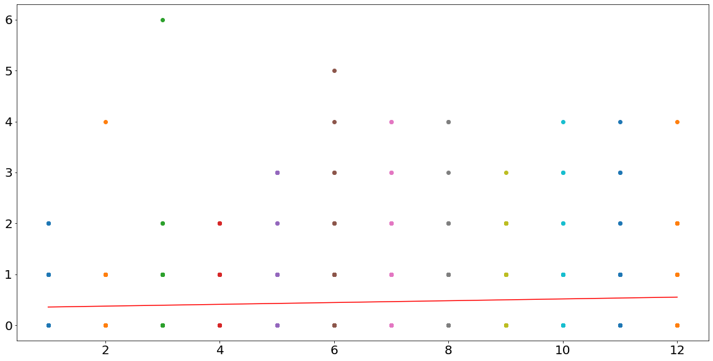
:::

::: {.output .display_data}
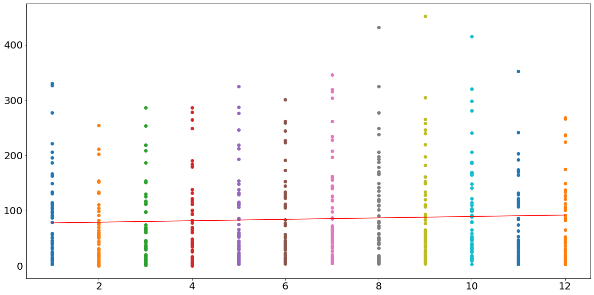
:::

::: {.output .display_data}
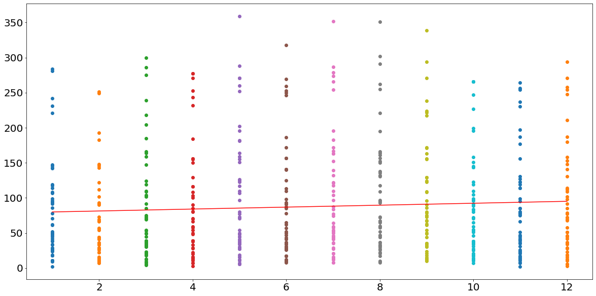
:::

::: {.output .display_data}
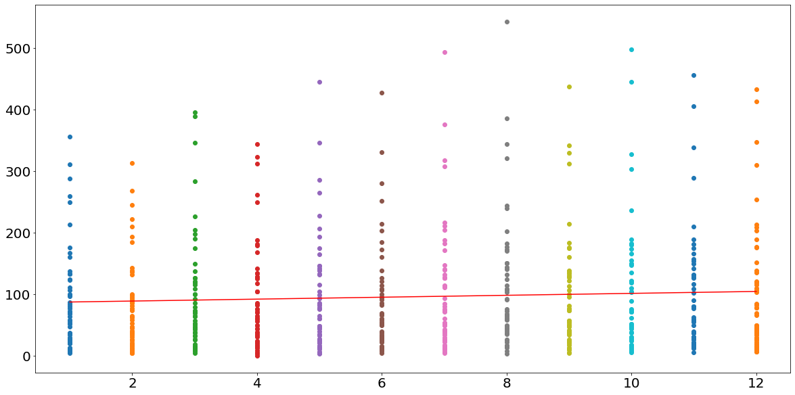
:::

::: {.output .display_data}
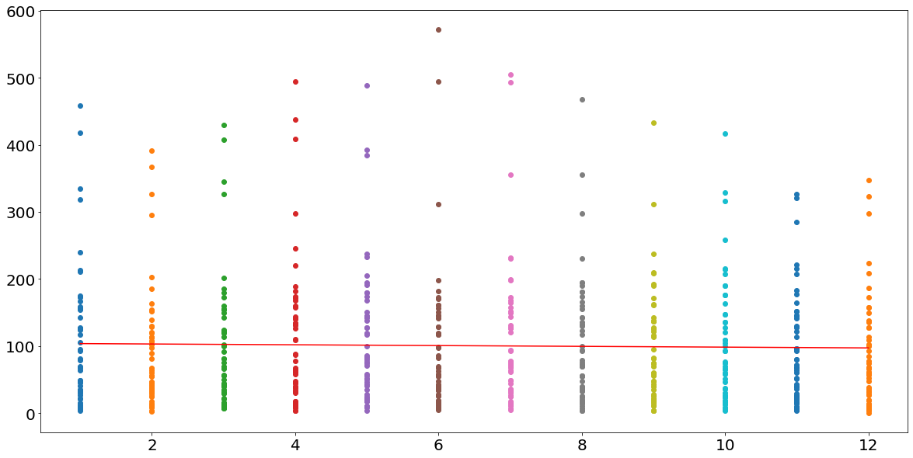
:::
:::

::: {.cell .code execution_count="35"}
``` {.python}
# total incidents for each state in each year
months_list = ['Jan', 'Feb', 'Mar', 'Apr', 'May', 'Jun', 'Jul', 'Aug', 'Sep', 'Oct', 'Nov', 'Dec']
numincidents_2013['Total'] = numincidents_2013.loc[0 : 51,months_list].sum(axis = 1)
numincidents_2014['Total'] = numincidents_2014.loc[0 : 51,months_list].sum(axis = 1)
numincidents_2015['Total'] = numincidents_2015.loc[0 : 51,months_list].sum(axis = 1)
numincidents_2016['Total'] = numincidents_2016.loc[0 : 51,months_list].sum(axis = 1)
numincidents_2017['Total'] = numincidents_2017.loc[0 : 51,months_list].sum(axis = 1)
```
:::

::: {.cell .code execution_count="36"}
``` {.python}
def normalize(x, year):
    norm = pd.DataFrame()
    norm['state'] = x['state']
    for i in months_list:
        norm[i] = x[i]/df_populations[year]*10000
    return norm 

numincidents_2013_normalized = normalize(numincidents_2013, '2013')
numincidents_2014_normalized = normalize(numincidents_2014, '2014')
numincidents_2015_normalized = normalize(numincidents_2015, '2015')
numincidents_2016_normalized = normalize(numincidents_2016, '2016')
numincidents_2017_normalized = normalize(numincidents_2017, '2017')

scatter_and_regress(numincidents_2013_normalized)
scatter_and_regress(numincidents_2014_normalized)
scatter_and_regress(numincidents_2015_normalized)
scatter_and_regress(numincidents_2016_normalized)
scatter_and_regress(numincidents_2017_normalized)
```

::: {.output .display_data}
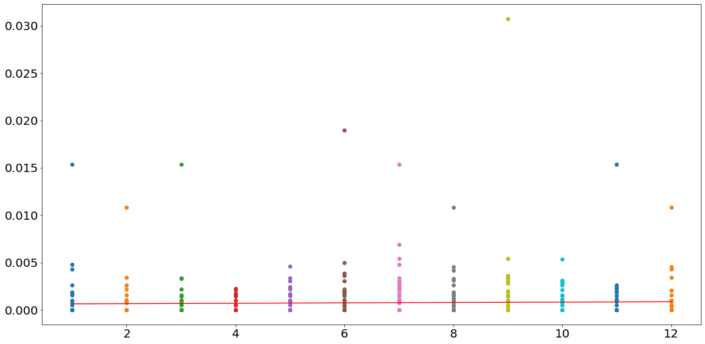
:::

::: {.output .display_data}
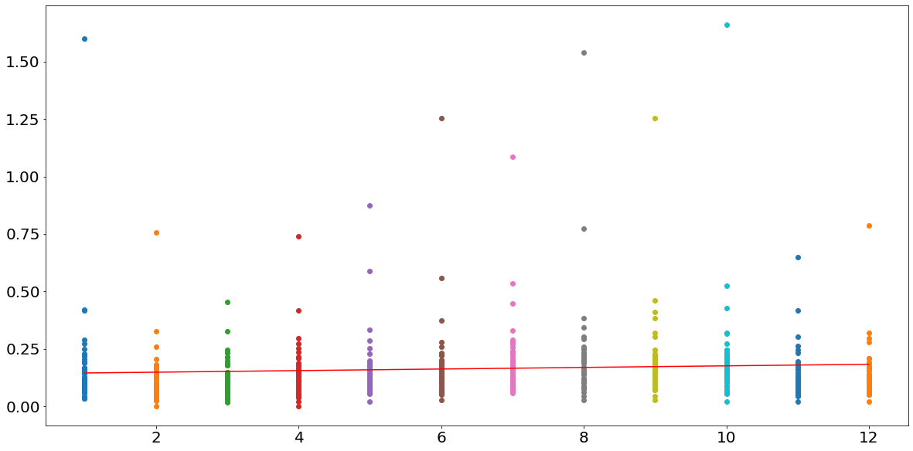
:::

::: {.output .display_data}
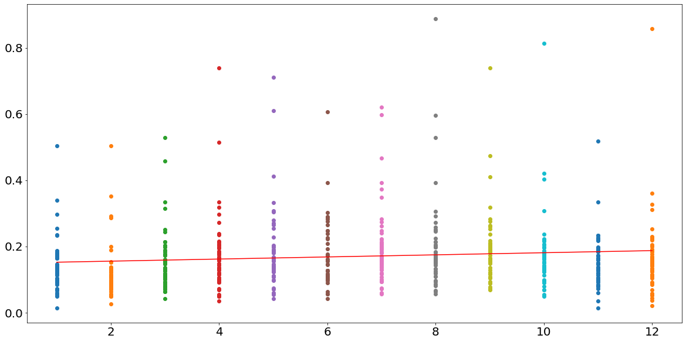
:::

::: {.output .display_data}
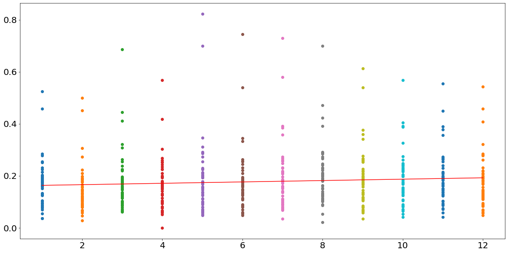
:::

::: {.output .display_data}
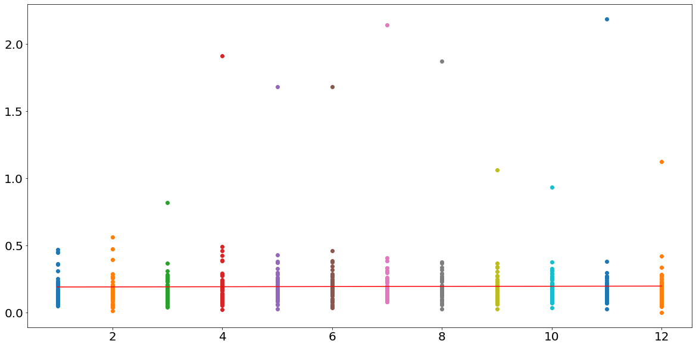
:::
:::

::: {.cell .code execution_count="37"}
``` {.python}
# #if we want fancy lookin violinplots 
# deaths_per_month = []
# months = {1:'Jan', 2:'Feb', 3:'Mar', 4:'Apr', 5:'May', 6:'Jun', 7:'Jul', 8:'Aug', 9:'Sep', 10:'Oct', 11:'Nov', 12:'Dec'}
# for i in range(1, 13):numincidents_2017[months[i]].values.tolist()
#     temp = 
#     deaths_per_month.append(temp)

    
# m = [i for i in range(1, 13)]
# fig, ax = plt.subplots()
# ax.violinplot(deaths_per_month,m,widths=0.5,showmeans=True)

# type(deaths_per_month[1])
```
:::

::: {.cell .code}
``` {.python}
```
:::
